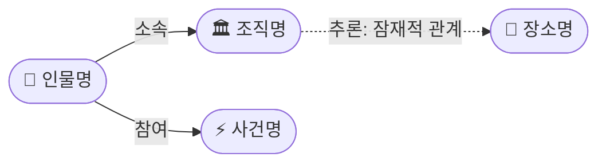

# 보고서 형식

## 보고서 경로
`reports/YYYY/MM/YYYY-MM-DD.md`

## 필수 구조

```markdown
---
title: "YYYY-MM-DD [주제명] OSINT 일일 보고서"
date: YYYY-MM-DD
topic: "config에서 읽은 주제명"
sources_count: N
new_items: N
updated_items: N
new_entities: N
new_triples: N
inferred_triples: N
---

# YYYY-MM-DD [주제명] OSINT 일일 보고서

## 요약
(3-5문장 핵심 요약. 특이사항 없으면 config의 report.empty_report_message 사용)

## 주요 뉴스
### 1. [뉴스 제목]
- **출처:** [매체명](URL)
- **일시:** YYYY-MM-DD
- **내용:** 상세 내용 2-3문장 요약
- **상태:** 신규 / 업데이트 (← YYYY-MM-DD "이전 항목 제목")
- **관련 엔티티:** 엔티티1, 엔티티2

## 지식그래프

### 오늘의 주요 관계
(오늘 새로 발견/강화된 주요 관계를 텍스트로 설명)

### 전체 지식그래프 시각화


### 주제별 세부 그래프
(주요 주제별로 관련 KG 부분을 분리하여 시각화 — 전체 그래프가 복잡할 때)

## 온톨로지 변경
| 변경 유형 | 대상 | 근거 |
|----------|------|------|
| 새 클래스 | ... | ... |
| 새 관계 유형 | ... | ... |
| 새 엔티티 | ... | ... |

## 추론 결과
(온톨로지 추론으로 발견된 암시적 관계 요약)
| 추론 | 신뢰도 | 근거 |
|------|--------|------|
| A → 간접소속 → C | 0.81 | A→B, B→C 소속 체인 |

## 분석 및 평가
(수집된 뉴스 + 추론 결과 기반 종합 분석)

## 추적 항목
(이전 보고서에서 이어지는 스토리라인)
| 항목 | 최초 보고 | 상태 | 최신 업데이트 |
|------|----------|------|-------------|

## 동향 요약
| 분류 | 상태 | 비고 |
|------|------|------|

## 출처 목록
1. [제목](URL) - 매체명, 날짜
```

## KG 시각화 규칙

### Mermaid 다이어그램 규칙
- `graph LR` (좌→우) 또는 `graph TD` (상→하) 사용
- **색상(classDef fill)을 사용하지 않는다** — GitHub 라이트/다크 모드 모두에서 가독성을 보장하기 위해 Mermaid 기본 테마 색상을 그대로 사용
- 엔티티 유형 구분은 노드 라벨에 접두 이모지로 표현:
  - Person: `👤`
  - Organization: `🏛`
  - Event: `⚡`
  - Location: `📍`
  - Concept: `💡`
- 노드 형태로 유형을 추가 구분:
  - 둥근 사각형 `(["..."])` — 기본
  - 육각형 `{{"..."}}` — 추론으로만 발견된 노드 (선택)
- 명시적 관계: 실선 화살표 `-->`
- 추론된 관계: 점선 화살표 `-.->` + "추론:" 접두사
- 노드 수가 config의 `report.max_kg_nodes`를 초과하면 중요도 순으로 잘라냄

### 복잡도 관리
- 노드 15개 이하: 단일 전체 그래프
- 노드 15~30개: 전체 그래프 + 주제별 세부 그래프
- 노드 30개 초과: 주제별 세부 그래프만 (전체는 텍스트 요약)

## 포함 기준
- `report-basis.md`에서 "포함"으로 결정된 항목만 넣는다
- `tag: new` → 상태: 신규
- `tag: update` → 상태: 업데이트 (← 이전 보고서 참조)
- `tag: reported` → 포함하지 않음
- 출처 URL 없는 정보는 포함하지 않는다
- 동일 뉴스를 여러 매체가 보도한 경우 대표 1개를 본문에, 나머지를 출처 목록에

## 특이사항 없음 처리
포함 항목이 0건이면 동일 구조로 config의 `report.empty_report_message` 보고서를 생성한다.
KG 시각화가 없으면 해당 섹션을 "변동 없음"으로 표시한다.

## Wiki 발행 규칙
config의 `report.wiki_publish`가 true일 때만 실행한다.
- GitHub Wiki는 YAML frontmatter를 지원하지 않는다
- Wiki 복사 시 frontmatter 블록(`---`로 감싼 부분)을 반드시 제거한다
- 메인 리포 `reports/` 파일에는 frontmatter를 유지한다
- Home.md에 최신 보고서 링크 추가
- _Sidebar.md에 최근 14일 유지
- Monthly-YYYY-MM.md 월별 인덱스 업데이트
