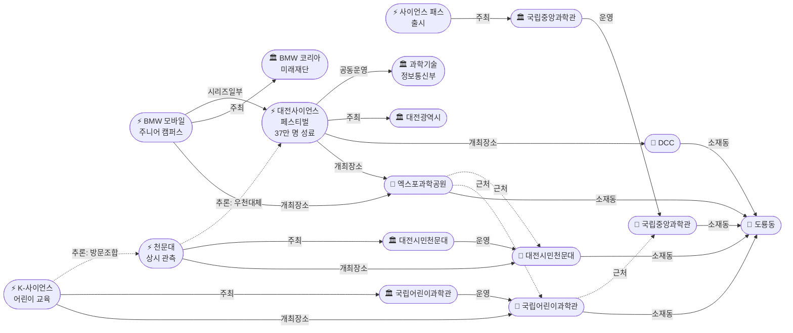
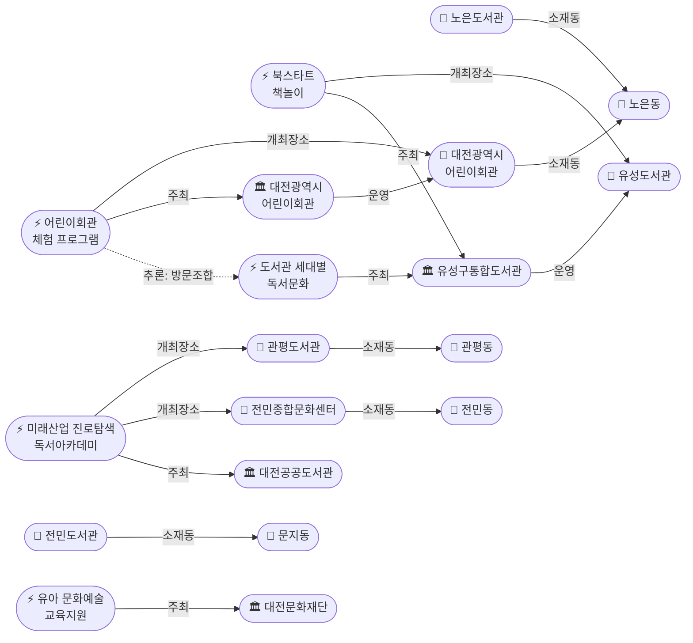

# 2026-04-25 대전 유성구 어린이·가족 이벤트 일일 보고서

## 요약

유성구 도룡동 과학벨트를 중심으로 어린이·가족 대상 이벤트가 집중 확인되었다. 2026 대전사이언스페스티벌(4.17~19)이 **37만 명 방문**, 287개 기관 참여, 420개 프로그램으로 성황리에 폐막했다. 과학기술정보통신부 '대한민국 과학축제'와 통합 운영되었으며, DCC·엑스포과학공원 등 6개 거점에서 진행됐다. 페스티벌 종료 후에도 국립어린이과학관 K-사이언스 교육, 대전시민천문대 관측 프로그램이 상시 운영 중이다. 노은동 **대전광역시어린이회관**(체험숲·사계절상상놀이터·아뜰리에)이 신규 발견되었으며, 대���문화재단의 유아 문화예술교육 지원사업도 확인되었다. 어린이날(5.5)까지 D-10으로, 사전신청 프로그램 조기 확인이 필요하다.

## 오늘의 추천 (가족 동반 Top 5)

| 순위 | 이벤트 | 장소 (동) | 대상 | 비용 | 어린이 친화도 |
|------|--------|----------|------|------|-------------|
| 1 | K-사이언스 어린이 교육 프로그램 | 국립어린이과학관 (도룡동) | 초등학생 | 사전신청 | 0.95 |
| 2 | 대전광역시어린이회관 체험 프로그램 | 어린이��관 (노은동) | 유아~초등저학년 | 유료 (프로그램별) | 0.95 |
| 3 | 북스타트 책놀이 | 유성도서관 | 영유아+보호자 | 무료 | 0.95 |
| 4 | 대전시민천문대 관측 프로그램 | 대전시민천문대 (도룡동) | 전연령가족 | 무료 | 0.85 |
| 5 | 유성구 도서관 세대별 독서문화 | 관평·전민·노은 도서관 | 영유아~초등 | 무료 | 0.90 |

## 신규 이벤트

### 1. 2026 대전사이언스페스티�� (종료 — 37만 명 방문)
- **출처:** [대전관광](https://daejeontour.co.kr/festival_djt/25)
- **일시:** 2026-04-17 ~ 2026-04-19 (종���)
- **장소:** 엑스포과학공원·대전컨벤션센터 외 6개 거점 (도룡동)
- **내용:** 'AI와 인간의 공존'을 주제로 한 국내 최대 과학문화축제. 287개 기관 참여, 420개 프로그램 운영. RC카 레이싱, 종이비행기 챌린지, 과학 퀴즈, 과학 마술·버스킹 등 체험형 콘텐츠 다수. 과학기술정보통신부 '대한민국 과학축제'와 통합 운영.
- **상태:** 업데이트 — 37만 명 방문 실적 확인 (← src-001)
- **비용:** 무료
- **실내/야외:** 야외+실내
- **관련 엔티티:** 대전광역시, 과학기술정보통신부, 엑스포과학공원, DCC, 국립중앙과학관
- **추가 출처:** [유성매거진](https://www.ysmagaz.com/news/articleView.html?idxno=1557), [충남일보](https://www.chungnamilbo.co.kr/news/articleView.html?idxno=884549), [뉴데일리](https://cc.newdaily.co.kr/site/data/html/2026/04/21/2026042100039.html), [충청도민일보](https://www.dominilbo.com/news/articleView.html?idxno=266372)

### 2. BMW 모바일 주니어 캠퍼스 (종료)
- **출처:** [헤럴드경제](https://biz.heraldcorp.com/article/10718465)
- **일시:** 2026-04-17 ~ 2026-04-19 (종료, 사이언스페스티벌 연계)
- **장소:** 엑스포과학공원 (도룡동)
- **내용:** BMW 코리아 미래재단이 운영한 초등학생 대상 미래 모빌리티 체험 워크숍. 전기차·수소차·자율주행 기술 실험실. 하루 8회, 회당 45분.
- **상태:** 신규 (사후 기록)
- **대상:** 초등학생 (7~12세)
- **비용:** 무료
- **실내/야외:** 실내

### 3. 국립어린이과학관 2026 K-사이언스 어린이 교육 프로그램
- **출처:** [국립어린이과학관 Facebook](https://www.facebook.com/scijoy2017/posts/2026-k-사이언스-어린이-교육-프로그램-안내)
- **장소:** 국립어린이과학관 (도룡동)
- **내용:** 선조의 전통 과학기술 지혜를 계승하고 대한민국 핵심 첨단 과학기술을 체험하는 교육 프로그램. 사전신청 필요.
- **상태:** 신규
- **대상:** 초등학생 (7~12세)
- **비용:** 사전신청 (상세 미확인)
- **실내/야외:** 실내

### 4. 사이언스 패스 출시
- **출처:** [YTN 사이언스](https://science.ytn.co.kr/program/view.php?mcd=0082&key=202604211105174220)
- **일시:** 2026-04-21~ (상시)
- **내용:** 과학관 통합 회원 시대 개막. 국립중앙과학관·국립어린이과학관 등 과학관 통합 회원 카드.
- **상태:** 신규
- **비용:** ���료 (회원카드)
- **실내/야외:** 실내

### 5. 유성구통합도서관 북스타트 책놀이
- **출처:** [유성구통합도서관](https://lib.yuseong.go.kr/web/program/lectureDetail.do?lectureIdx=11956)
- **장소:** 유성���서관 (가정동)
- **내용:** 36개월~미취학 아동 + 보호자 대상 독서놀이 프로그램.
- **상태:** 신규
- **대상:** 영유아·유아 (0~6세) + 보호자
- **비용:** 무료
- **사전신청:** 필요
- **실내/야외:** 실내

### 6. 대전시민천문대 상시 무료 관측 프로그램
- **출처:** [대전시민천문대](https://djstar.kr/)
- **장소:** 대전시민천문대 (도룡동)
- **내용:** 지자체 1호 천문과학관. 천체망원경으로 4계절 별자리 관측. 토요 별 음악회(토 20:00), 시와 음악회(화 20:00) 등 문화 프로그램 병행.
- **상태:** 신규 (상시 운영)
- **대상:** 전연령 가족
- **비용:** 무료
- **운영시간:** 14:00~22:00 (입장마감 21:50)
- **휴관:** 매주 월요일, 공휴일 다음날, 명절
- **실내/야외:** 실내+야외

### 7. 유성구 도서관 세대별 독서문화 프로그램
- **출처:** [충청도민일보](https://www.dominilbo.com/news/articleView.html?idxno=262086)
- **장소:** 관평도서관 (관평동), 노은도서관 (노은동), 전민도서관 (문지동) 등
- **내용:** 유성구 '생활밀착형 독서문화' 확산 사업. 영유아 북스타트, 어린이 독서·체험, 가족 영화상영, 인형극 등 세대별 맞춤형 프로그램.
- **상태:** 신규
- **대상:** 영유아~초등저학년
- **비용:** 무료
- **실내/야외:** 실내

### 8. 2026 미래산업 진로탐색 독서아카데미
- **출처:** [대전공공도서관](https://www.u-library.kr/)
- **장소:** 관평도서관 (관평동), 전민종합문화센터 (전민동)
- **내용:** 미래산업 진로탐색을 주제로 한 독서아카데미.
- **상태:** 신규
- **대상:** 초등고학년 이상 (추정, 신뢰도 0.5 미만)
- **비용:** 무료
- **사전신청:** 필요
- **실내/야외:** 실내

### 9. 대전광역시어린이회관 체험 프로그램 (신규 발견)
- **출처:** [대전광역시어린이회관](https://www.djkids.or.kr/)
- **장소:** 대전 유성구 노은동 대전월드컵경기장 동관 1층
- **내용:** 실내 3,520㎡, 야외 2,250㎡ 규모의 어린이 전용 복합시설. 체험숲, 사계절상상놀이터, 아뜰리에 등 체험 프로그램과 어린이뮤지컬, 3D 입체영상, 아동상담 운영. 유모차 접근 가능.
- **상태:** 신규
- **대상:** 유아~초등저학년
- **비용:** 유료 (프로그램별 상이)
- **사전신청:** 필요 (예약제)
- **운영시간:** 10:00~17:30 (휴게 12:00~13:00, 15:00~15:30)
- **실내/야외:** 실내+야외
- **전화:** 042-824-5500

### 10. 2026 생애주기별·유아 문화예술교육지원 프로그램
- **출처:** [대전문화재단](https://www.dcaf.or.kr/web/board.do?menuIdx=374&bbsIdx=18865)
- **내용:** 대전문화재단에서 운영하는 유아(4~7세) 대상 문화예술 체험 교육 지원���업. 대전광역시 내 어린이집·유치원을 대상으로 지원.
- **상태:** 신규
- **대상:** 유아 (4~7세)
- **비용:** 지원사업 (무료)
- **사전신청:** 필요
- **실내/야외:** 실내

## 마감 임박 (사전신청 D-3 이내)

현재 D-3 이내 마감 임박 이벤트 없음. 단, 도서관 프로그램(북스타트 책놀이 등)은 선착순 마감 가능성이 있으므로 조기 확인 권장.

## 동(洞)별 이벤트 묶음

### 도룡동 (1차 타겟) — 과학벨트 밀집 ��역
| 이벤트 | 장소 | 상태 |
|--------|------|------|
| 2026 대전사이언스페스티벌 | 엑스포과학공원·DCC | 종료 (37만 명 방문) |
| BMW 모바일 주니어 캠퍼스 | 엑스포과학공원 | 종료 |
| K-사이언스 어린이 교육 프로그램 | 국립어린이과학관 | 운영 중 |
| 사이언스 패스 | 국립중앙과학관 | 4.21~ 상시 |
| 상시 관측 프로그램 | 대전시민천문대 | 상시 운영 |

> 도룡동은 엑스포과학공원 → 국립중앙과학관 → 국립어린이과학관 → 대전시민천문대를 도보로 연계 방문할 수 있는 '과학벨트'이다.

### 관평동 (1차 타겟)
| 이벤트 | 장소 |
|--------|------|
| 도서관 독서문화 프로그램 | 관평도서관 |
| 미래산업 진로탐색 독서아카데미 | 관평도서관 |

### 전민동 (1차 타겟)
| 이벤트 | 장소 |
|--------|------|
| 미래산업 진로탐색 독서아카데미 | 전민종합문화센�� |

### 문지동 (1차 타겟)
| 이벤트 | 장소 |
|--------|------|
| 도서관 독서문화 프로그램 | 전민��서관 (문지로299번길 18) |

### 노은동 (보조 타겟) — 어린이회관 신규 발견
| 이벤트 | 장소 |
|--------|------|
| 대전광역시어린이회관 체험 프로그램 | 어린이회관 (월드컵경기장 동관 1층) |
| 도서관 독서문화 프로그램 | 노은도서관 |

> 노은동 어린이회관과 노은도서관은 묶음 방문 가능 (추론 신뢰도 0.70)

### 용산동·신성동 (1차 타겟)
금일 수집된 신규 이벤트 없음.

## 연령대별 묶음

### ��유아 (0~3세)
- 북스타트 책놀이 (유성도서관) — 36개월~ + 보호자

### 유아 (4~6세)
- ��스타트 책놀이 (유성도서관)
- 대전광역시어린이회관 체험 프로그램 (노은동) **[신규]**
- 도서관 세대별 독서문화 프로그램 (관평·전민·노은)
- 생애주기별·유아 문화예술교육지원 (대전문화재단) **[신규]**

### 초등저학년 (7~9세)
- K-사이언스 어린이 교육 프로그램 (국립어린이과학관)
- 대전광역시어린이회관 체험 프로그램 (노은동) **[신규]**
- BMW 모바일 주니어 캠퍼스 (종료)
- 도서관 세대별 독서문화 프로그램

### 초등고학년 (10~12세)
- K-사이언스 어린이 교육 프로그램 (국립어린이과학관)
- BMW 모바일 주니어 캠퍼스 (종료)
- 미래산업 진로탐색 독서아카데미 (관평·전민)

### 전연령 가족
- 대전사이언스페스티벌 (종료)
- 대전시민천문대 상시 관측
- 사이언스 패스

## 시리즈/정기 프로그램 업데이트

| 프로그램 | 주최 | 유형 | 비고 |
|---------|------|------|------|
| 북스타트 책놀이 | 유성구통합도서관 | 정기 | 영유아 대상 반복 운영 |
| K-사이언스 교육 | 국립어린이과학관 | 정기 | 2026년 연간 프로그램 |
| 천문대 관측 프로그램 | 대전시민천문대 | 상시 | 매일 14:00~22:00 |
| 도서관 독서문화 프로그램 | 유성구통합도서관 | 정기 | 세대별 맞춤, 관평·전민·노은 등 |
| 어린이회관 체험 프로그램 | 대전광역시어린이회관 | 상시 | 예약제, 노은동 |

## 지식그래프 시각화

### 오늘의 주요 관계

도룡동에 과학관·천문대·엑스포공원 등 5개 시설이 밀집하며, 이들이 주최하는 어린이 이벤트가 집중 분포한다. 사이언스페스티벌은 과학기술정보통신부와 대전광역시가 공동 주최했음이 확인되었다(37만 명 성료 보도). 유성구통합도서관은 관평동·문지동·노은동 등에 분관을 운영하며 세대별 프로그램을 전개하고 있다. 노은동에서 대전광역시어린이회관이 신규 발견되어, 노은도서관과의 묶음 방문이 가능한 것으로 추론되었다. 대전문화재단은 유아 문화예술교육 지원사업을 운영한다.

### 도룡동 과학벨트 그래프

### 도서관·어린이시설 네트워크 그래프

## 온톨로지 변경

| 변경 유형 | 대상 | 근거 |
|----------|------|------|
| 초기화 | 전체 스키마 (6 클래스, 10 관계 유형) | config seed로부터 최초 구성 |
| 새 엔티티 (Event) | 10건 | 금일 수집된 이벤트 (8 기존 + 2 신규) |
| 새 엔티티 (Venue) | 11건 | 과학관·도서관·문화센터·어린이회관 등 |
| 새 엔티티 (Organization) | 11건 | 주최·운영 기관 (과학기술정보통신부·어린이회관·대전문화재단 추가) |
| 업데이트 (Event) | 사이언스페스티벌 | 37만 명, 287기관, 420 프로그��� 수치 추가 |

## 추론 결과

| 추론 | 신뢰도 | 근거 |
|------|--------|------|
| 사이언스페스티벌 ↔ 천문대 방문조합 | 0.85 | 도룡동 동일 소재, 같은 날 이용 가능 |
| K-사이언스 ↔ 천문대 방문조합 | 0.85 | 도룡동 동일 소재, 오후→야간 연계 |
| K-사이언스 어린이 친화도 가산 | 0.90 | 과학관 운영 이벤트 → +0.2 |
| 북스타트 어린이 친화도 가산 | 0.90 | 도서관 운영 이벤트 → +0.2 |
| 어린이회관 어린이 친화도 가산 | 0.90 | 어린이 전용 시설 → +0.2 |
| 천문대 = 우천 대체 (페스티벌) | 0.75 | 동일 동 실내 시설 |
| 어린이회관 ↔ 노은도서관 방문조합 | 0.70 | 노은동 동일 소재 |
| 엑스포공원 ↔ 어린이과학관 근접 | 0.90 | 도룡동 과학벨트 도보 연계 |
| 어린이과학관 ↔ 중앙과학관 근접 | 0.95 | 동일 부지 내 위치 |
| 사이언스페스티벌 공동운영 | 0.85 | 과학기술정보통신부 '대한민국 과학축제' 통합 |

## 분석 및 평가

유성구 어린이·가족 이벤트 지형의 초기 매핑을 완료했다. 도룡동에 과학관·천문대·엑스포공원 등 핵심 가족 시설이 밀집해 있으며, 이 '과학벨트'가 유성��� 어린이 이벤트의 중심축이다. 사이언스페스티벌이 37만 명이라는 대규모 방문자를 기록하며 대전의 과학문화축제 위상을 재확인했다.

유성구통합도서관의 분관 네트워크(관평·전민·노은·진잠·구암·용산·아가랑)가 1차 타겟 동을 넓게 커버하�� 있어, 도서관 프로그램이 지역 밀착형 어린이 활동의 핵심 채널이다.

노은동의 대전광역시어린이회관은 이전 모니터링에서 누락되어 있었으며, 체험숲·사계절상상놀이터·아뜰리에 등 어린이 전용 콘텐츠가 풍부한 시설이다. 노은도서관과의 묶음 방문이 가능하다.

어린이날(5월 5일)까지 D-10으로, 향후 1~2주간 어린이날 특별 행사 공지가 예상된다. 유성온천문화축제(2025년 5월 2~4일 개최)의 2026년 일정은 아직 미공지 상태이다.

## 추적 항목

| 항목 | 최초 보고 | 상태 | 최신 업데이트 |
|------|----------|------|-------------|
| K-사이언스 어린이 교육 프로그램 | 2026-04-25 | 운영 중 | 사전신청 일정 추적 필요 |
| 사이언스 패스 | 2026-04-25 | 신규 출시 | 적용 과학관 범위 확인 필요 |
| 유성온천문화축제 | 2026-04-25 | 2026 일정 미정 | 2025년 5.2~4 개최, 공식 일정 공지 대기 |
| 어린이날 특별행사 | 2026-04-25 | D-10 예상 | 5.5 전후 각 기관 공지 추적 |
| 대전광역시어린이회관 | 2026-04-25 | 상시 운영 | 신규 발견, 향후 프로그램 변동 추적 |
| 유아 문화예술교육지원 | 2026-04-25 | 운영 중 | 유성구 적용 현황 추적 필요 |

## 동향 요약

| 분류 | 상태 | 비고 |
|------|------|------|
| 도룡동 과학벨트 | 활발 | 사이언스페스티벌 37만 성료, 상시 프로그램 다수 |
| 도서관 프로그램 | 운영 중 | 관평·전민·노은 등 세대별 맞춤 |
| 노은동 어린이시설 | 신규 발견 | 어린이회관 + 노은도서관 묶음 가능 |
| 어린이날 대비 | D-10 | 특별 행사 공지 예상 |
| 유성온천문화축제 | 미정 | 2026년 일정 미공지 |

## 출처 목록

1. [2026 대전사이언스페스티벌](https://daejeontour.co.kr/festival_djt/25) - 대전관광, 2026-04-25
2. [BMW 모바일 주니어 캠퍼스](https://biz.heraldcorp.com/article/10718465) - 헤럴드경제, 2026-04-25
3. [유성구통합도서관 북스타트 책놀이](https://lib.yuseong.go.kr/web/program/lectureDetail.do?lectureIdx=11956) - 유성구통합도서관, 2026-04-25
4. [K-사이언스 어린이 교육 프로그램](https://www.facebook.com/scijoy2017/posts/2026-k-사이언스-어린이-교육-프로그램-안내) - 국립어린이과학관 Facebook, 2026-04-25
5. [사이언스 패스 출시](https://science.ytn.co.kr/program/view.php?mcd=0082&key=202604211105174220) - YTN 사이언스, 2026-04-25
6. [대전시민천문대](https://djstar.kr/) - 대전시민천문대, 2026-04-25
7. [유성구 생활밀착형 독서문화 확산](https://www.dominilbo.com/news/articleView.html?idxno=262086) - 충청도민일보, 2026-04-25
8. [대전공공도서관 — 미래산업 진로탐색 독서아카데미](https://www.u-library.kr/) - 대전공공도서관, 2026-04-25
9. [대전사이언스페스티벌 37만 명 성료](https://www.ysmagaz.com/news/articleView.html?idxno=1557) - 유성매거진, 2026-04-21
10. [사이언스페스티벌 3일간 37만 명](https://www.chungnamilbo.co.kr/news/articleView.html?idxno=884549) - 충남일보, 2026-04-21
11. [37만 명 방문 성료](https://www.dominilbo.com/news/articleView.html?idxno=266372) - 충청도민일보, 2026-04-21
12. [과학이 도시를 점유했다](https://cc.newdaily.co.kr/site/data/html/2026/04/21/2026042100039.html) - 뉴데일리, 2026-04-21
13. [대전광역시어린이회관](https://www.djkids.or.kr/) - 대전광역시어린이회관, 2026-04-25
14. [2026 생애주기별 유아 문화예술교육지원](https://www.dcaf.or.kr/web/board.do?menuIdx=374&bbsIdx=18865) - 대전문화재단, 2026-04-25
15. [대전시민천문대 별축제](https://korean.visitkorea.or.kr/kfes/detail/fstvlDetail.do?fstvlCntntsId=306fb919-36d3-48d9-85cf-7d2247ad580c) - 대한민국 구석구석, 2026-04-25
