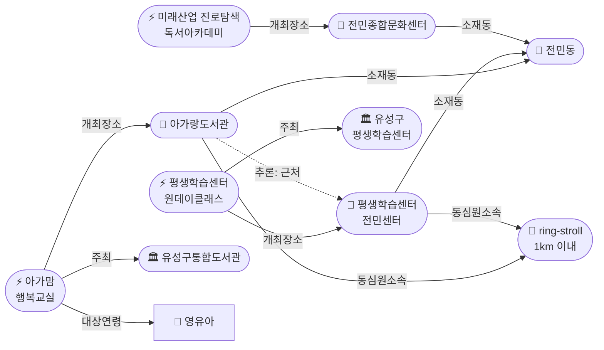
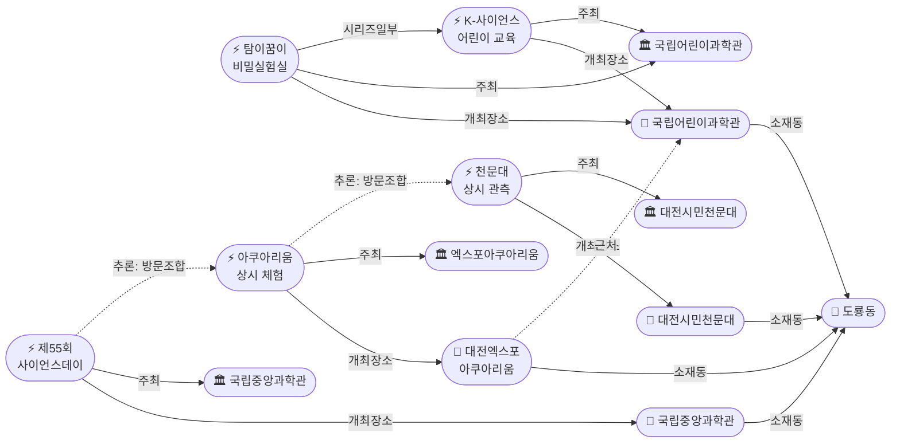
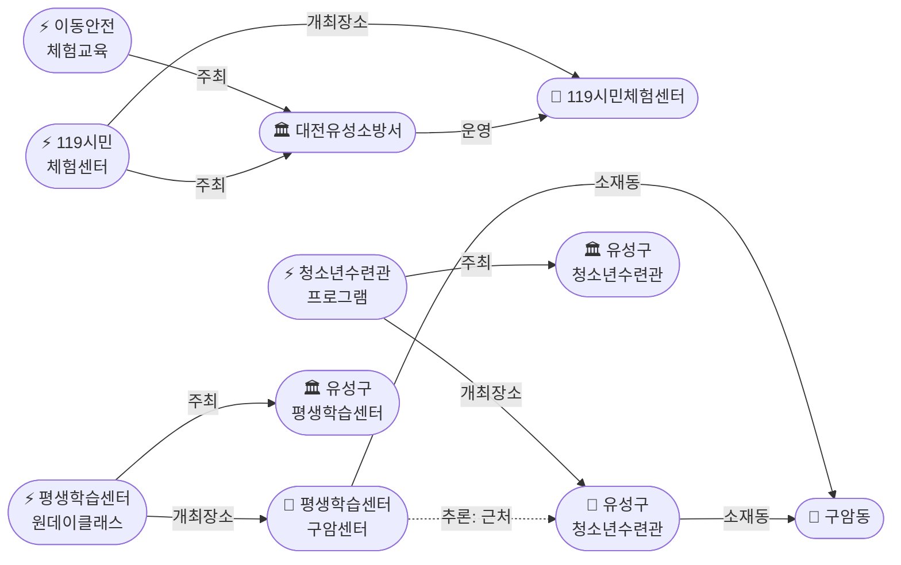

# 2026-04-26 대전 유성구 어린이·가족 이벤트 일일 보고서

## 요약

전민동 도보권(ring-stroll)에 **아가랑도서관**(0.9km)이 발견되어 '아가·맘 행복교실'(영유아 대상, 4/4~6/27 운영)이 신규 보고됐다. 평생학습센터 전민센터(0.8km)와 합쳐 **용성로20 도보권 내 공공 프로그램 2거점**이 형성됐다. 도룡동에서는 **대전엑스포아쿠아리움**이 상시 체험 시설로 신규 발견됐고, 국립중앙과학관 **제55회 사이언스데이** 봄 개최가 확인됐다. **유성소방서 이동안전체험차량**이 공공기관(소방서) 카테고리 첫 수집 항목으로 등록됐다. 어린이날(5.5)까지 D-9.

## 용성로20 주변 (도보권 내)

### ring-stroll (1km 이내) — 전민동 공공 프로그램 2거점

| 시설 | 동 | 거리 | 유형 | 상태 |
|------|---|------|------|------|
| **아가랑도서관** | 전민동 | ~0.9km | 도서관 — 아가맘 행복교실 | **[신규]** |
| **유성구 평생학습센터 전민센터** | 전민동 | ~0.8km | 공공기관 원데이클래스 | 신규 (전회 보고) |
| 전민종합문화센터 | 전민동 | ~0.8km | 문화센터 | 기존 |

> 용성로20에서 도보 15분 내(ring-stroll)에 공공 프로그램 거점이 3곳으로 확대됐다. 특히 아가랑도서관의 '아가·맘 행복교실'은 **영유아(0~3세) 전용**으로, 도보권 내 가장 높은 어린이 친화도(0.95)를 제공한다.

## 오늘의 추천 (가족 동반 Top 5)

| 순위 | 이벤트 | 장소 (동) | 대상 | 비용 | 어린이 친화도 |
|------|--------|----------|------|------|-------------|
| 1 | 아가·맘 행복교실 **[신규]** | 아가랑도서관 (전민동, 0.9km) | 영유아 | 무료 | 0.95 |
| 2 | 대전엑스포아쿠아리움 체험 **[신규]** | 신세계 Art&Science B1 (도룡동) | 전연령가족 | 유료 (입장권) | 0.85 |
| 3 | 탐이 꿈이의 비밀 실험실 **[신규]** | 국립어린이과학관 (도룡동) | 초등학생 | 유료 (사전신청) | 0.95 |
| 4 | 대전시민천문대 관측 프로그램 | 대전시민천문대 (도룡동) | 전연령가족 | 무료 | 0.85 |
| 5 | 대전광역시어린이회관 체험 프로그램 | 어린이회관 (노은동) | 유아~초등저학년 | 유료 (프로그램별) | 0.95 |

## 신규 이벤트

### 1. 아가·맘 행복교실 — 전민동 아가랑도서관 (ring-stroll)
- **출처:** [아가랑도서관 아가맘 행복교실](https://www.welfarehello.com/community/hometownNews/0fda2727-354e-4382-8caa-04ccebd49352)
- **장소:** 아가랑도서관 (전민동, 용성로20에서 ~0.9km)
- **기간:** 2026-04-04 ~ 2026-06-27
- **내용:** 아이와 엄마가 행복하게 소통하고 감정을 공유하는 프로그램. 영유아 대상 독서·놀이 통합 교육.
- **대상:** 영유아 (0~3세) + 보호자
- **비용:** 무료
- **사전신청:** 필요
- **실내/야외:** 실내
- **Ring:** ring-stroll (0.9km) — **도보권 최우선**
- **어린이 친화도:** 0.95

> 용성로20에서 도보 12분. 도보권 내 유일한 영유아 전용 프로그램. 평생학습센터 전민센터와 묶음 방문 가능(추론 신뢰도 0.80).

### 2. 대전엑스포아쿠아리움 — 도룡동 가족 상시 체험 시설
- **출처:** [대전엑스포아쿠아리움](https://djexpoaqua.com/)
- **장소:** 대전 유성구 엑스포로 1, 신세계 Art&Science B1 (도룡동)
- **내용:** 200여 종 2만여 마리 해양생물. 수중발레(매일 11:30·13:30·14:30·15:30·17:30), 먹이주기 체험(12:30·16:30), 가오리 터치풀, 마술쇼.
- **대상:** 전연령 가족
- **비용:** 유료 (입장권)
- **운영시간:** 10:00~19:00 (입장마감 18:00)
- **사전신청:** 불필요
- **실내/야외:** 실내
- **전화:** 042-607-8852
- **Ring:** ring-car (약 3.5km)
- **어린이 친화도:** 0.85

### 3. 제55회 사이언스데이 — 국립중앙과학관 봄 과학체험 축제
- **출처:** [국립중앙과학관](https://www.science.go.kr/)
- **장소:** 국립중앙과학관 (도룡동)
- **내용:** 매년 봄 국립중앙과학관에서 개최되는 대표 과학체험 축제. 학생·가족 대상 체험부스 다수 운영. 구체적 일정 추적 중.
- **대상:** 초등학생, 전연령 가족
- **비용:** 무료
- **사전신청:** 불필요 (체험부스별 상이)
- **실내/야외:** 야외+실내
- **Ring:** ring-car (약 3.5km)
- **어린이 친화도:** 0.90

> 사이언스페스티벌(4.17~19, 37만 명 방문, 종료)과 별개 행사. 봄 시즌 개최 예상이나 구체적 일정은 추적 중.

### 4. 탐이 꿈이의 비밀 실험실 — 국립어린이과학관
- **출처:** [국립어린이과학관](https://www.csc.go.kr/)
- **장소:** 국립어린이과학관 (도룡동)
- **기간:** 2026-04-01 ~ 2026-06-30 (수·목·금·토)
- **내용:** 초등생 대상 과학실험 프로그램. 10시·13시·15시 운영. 보호자 1인 필수 참여.
- **대상:** 초등학생 (보호자 동반)
- **비용:** 유료 (프로그램비)
- **사전신청:** 필요
- **실내/야외:** 실내
- **Ring:** ring-car (약 3.5km)
- **어린이 친화도:** 0.95

### 5. 유성소방서 이동안전체험교육 + 119시민체험센터
- **출처:** [유성소방서 이동안전체험차량 도입](https://m.anewsa.com/article_sub3.php?number=2358601)
- **이동안전체험차량:** 유성소방서가 학교·유치원·어린이집에 직접 방문하여 안전체험교육 제공. 사전신청(042-270-1688).
- **119시민체험센터:** 화~토 09:30~15:30 상시 운영. 지진·소화기·심폐소생술·완강기 체험. 무료. OK예약서비스로 사전 예약.
- **대상:** 유아~초등고학년, 전연령 가족
- **비용:** 무료
- **실내/야외:** 이동체험(야외) / 시민체험센터(실내)
- **어린이 친화도:** 이동체험 0.85 / 시민체험센터 0.80

> 공공기관(소방서) 카테고리 첫 수집. 어린이 안전교육이라는 공공 프로그램으로 publicTrustBoost +0.15 적용.

### 6. 유성구 평생학습센터 원데이클래스
- **출처:** [유성구 평생학습센터](https://lifelong.yuseong.go.kr/lly/prog/lctr/lly/sub02_06/LIFELONG_016/classDetail.do?lctrNo=8271)
- **장소:** 구암센터 (구암동) / 전민센터 (전민동, ring-stroll 0.8km)
- **대상:** 성인 중심 (부모-자녀 참여형 포함, 어린이 친화도 0.6)
- **비용:** 무료/저비용
- **사전신청:** 필수

### 7. 유성구청소년수련관 프로그램
- **출처:** [유성구청소년수련관](https://happy-you.kr/)
- **장소:** 구암동 (ring-car ~3.2km)
- **대상:** 초등고학년~중학생 (어린이 친화도 0.7)
- **비용:** 프로그램별 상이
- **사전신청:** 필요

## 신규 오픈 가게·팝업·프로모션

### IKEA 팝업스토어 (현대프리미엄아울렛 대전점)
- **출처:** [IKEA](https://www.ikea.com/kr/ko/stores/giheung/ikea-hyundai-outlet-dj-pub6d82f570/)
- **장소:** 현대프리미엄아울렛 대전점 1층 (관평동, 테크노중앙로 123)
- **Shop 정보:** 팝업스토어 | 관평동 | ~2,500m | 10:30~21:00 | 키즈존 보유 | **is_new: 팝업**
- **Ring:** ring-bike (2.5km)

### 신세계 Art&Science 대전 봄맞이 팝업
- **출처:** [뉴스1](https://www.news1.kr/local/daejeon-chungnam/6116778)
- **장소:** 대전 유성구 엑스포로 1 (도룡동) — 아쿠아리움과 동일 건물
- **내용:** 봄 시즌 이색 팝업과 신규 브랜드 입점. 가족 단위 쇼핑 가능.
- **Ring:** ring-car (3.5km)

## 공공기관 주최 행사

| 기관 | 프로그램 | 장소 | 대상 | 비용 | 상태 |
|------|---------|------|------|------|------|
| **대전유성소방서** **[신규]** | 이동안전체험교육 | 학교·유치원 방문 | 유아~초등 | 무료 | **신규 — 소방서 카테고리 첫 수집** |
| **대전유성소방서** **[신규]** | 119시민체험센터 | 유성구 | 전연령 | 무료 | **신규 — 화~토 상시** |
| 유성구 평생학습센터 | 원데이클래스 | 전민센터·구암센터 | 성인 중심 | 무료/저비용 | 신규 (전회) |
| 유성구청소년수련관 | 수련활동·캠프 | 구암동 | 초등고학년~중학생 | 프로그램별 | 신규 (전회) |
| 유성구통합도서관 | 세대별 독서문화·북스타트 (7개 도서관 확대) | 관평·전민·노은·유성 등 | 영유아~초등 | 무료 | **업데이트 — 7관 확대** |
| 유성구 아가랑도서관 **[신규]** | 아가맘 행복교실 | 전민동 (ring-stroll) | 영유아 | 무료 | **신규** |
| 유성구 보건소 | 건강프로그램·예방접종 | 유성구 | 영유아~전연령 | 무료/보험 | 기존 |

## 마감 임박 (사전신청 D-3 이내)

| 이벤트 | 마감 | 장소 | 비고 |
|--------|------|------|------|
| **4월 주말과학교실** | **오늘 (4/26) 최종일!** | 국립어린이과학관 (도룡동) | 만5세~초등6학년, 유료, 사전신청 |

> 도서관 프로그램(북스타트 등)은 선착순 마감 가능성 있음. 5월 프로그램 사전신청이 곧 시작될 것으로 예상.

## 동심원별 묶음

### ring-stroll (1km 이내) — 도보 15분 ★전민동 2거점★

- **아가랑도서관** (전민동, ~0.9km) — 아가맘 행복교실 **[신규]**
- **유성구 평생학습센터 전민센터** (전민동, ~0.8km) — 원데이클래스
- 전민종합문화센터 (전민동)

### ring-bike (2km 이내) — 자전거·짧은 차량

- **현대프리미엄아울렛 대전점 + IKEA 팝업** (관평동, ~2.5km) **[신규]**
- 관평도서관 (관평동)

### ring-car (5km 이내) — 차량 10분

- **대전엑스포아쿠아리움 + 신세계 Art&Science 팝업** (도룡동, ~3.5km) **[신규]**
- 국립중앙과학관 · 국립어린이과학관 · 대전시민천문대 · 엑스포과학공원 (도룡동)
- **유성구 평생학습센터 구암센터** (구암동, ~3km)
- **유성구청소년수련관** (구암동, ~3.2km)
- 대전광역시어린이회관 (노은동)

## 동(洞)별 이벤트 묶음

### 도룡동 (1차 타겟) — 과학벨트 6시설 + 사이언스데이

| 이벤트 | 장소 | 상태 |
|--------|------|------|
| **대전엑스포아쿠아리움 체험** | 신세계 Art&Science B1 | **신규** — 상시 운영 |
| **제55회 사이언스데이** | 국립중앙과학관 | **신규** — 일정 추적 중 |
| **탐이 꿈이의 비밀 실험실** | 국립어린이과학관 | **신규** — 4~6월 |
| K-사이언스 어린이 교육 프로그램 | 국립어린이과학관 | 운영 중 |
| 사이언스 패스 | 국립중앙과학관 | 4.21~ 상시 |
| 상시 관측 프로그램 | 대전시민천문대 | 상시 운영 |
| 2026 대전사이언스페스티벌 | 엑스포과학공원·DCC | 종료 (37만 명) |
| **신세계 Art&Science 봄 팝업** | 엑스포로 1 | **신규** — Shop |

> 도룡동 과학벨트 시설 6개 + 사이언스데이 = 유성구 가족 체험의 핵심 권역. 아쿠아리움은 예약 불필요 → 나머지 시설과 자유롭게 당일 조합 가능.

### 전민동 (1차 타겟) — ring-stroll 공공 프로그램 클러스터

| 이벤트 | 장소 | 상태 |
|--------|------|------|
| **아가·맘 행복교실** | 아가랑도서관 | **신규** — 4/4~6/27 |
| **유성구 평생학습센터 원데이클래스** | 전민센터 | 신규 (전회) |
| 미래산업 진로탐색 독서아카데미 | 전민종합문화센터 | 운영 중 |

> 전민동이 용성로20 도보권 내 가장 밀도 높은 공공 프로그램 거점으로 부상. 영유아(아가랑도서관) ~ 성인(평생학습센터) 전 연령 커버.

### 관평동 (1차 타겟)

| 이벤트 | 장소 |
|--------|------|
| **IKEA 팝업스토어** | 현대프리미엄아울렛 1층 **[신규]** |
| 도서관 독서문화 프로그램 | 관평도서관 |
| 미래산업 진로탐색 독서아카데미 | 관평도서관 |

### 구암동 (보조 타겟) — 공공시설 2곳

| 이벤트 | 장소 |
|--------|------|
| 유성구 평생학습센터 원데이클래스 | 구암센터 |
| 유성구청소년수련관 프로그램 | 청소년수련관 |

### 노은동 (보조 타겟)

| 이벤트 | 장소 |
|--------|------|
| 대전광역시어린이회관 체험 프로그램 | 어린이회관 |
| 도서관 독서문화 프로그램 | 노은도서관 |

### 용산동·문지동·신성동 (1차 타겟)
금일 수집된 신규 이벤트 없음.

## 연령대별 묶음

### 영유아 (0~3세)
- **아가·맘 행복교실** (아가랑도서관, 전민동 ring-stroll) **[신규]**
- 북스타트 책놀이 (7개 도서관 확대 — 아가랑도서관 3~18개월, 원신흥·노은 19~35개월, 구즉·유성 6개월~미취학)

### 유아 (4~6세)
- 대전광역시어린이회관 체험 프로그램 (노은동)
- **유성소방서 이동안전체험교육** (학교·유치원 방문) **[신규]**
- 도서관 세대별 독서문화 프로그램 (관평·전민·노은)
- 생애주기별 유아 문화예술교육지원 (대전문화재단)

### 초등저학년 (7~9세)
- **탐이 꿈이의 비밀 실험실** (국립어린이과학관) **[신규]**
- K-사이언스 어린이 교육 프로그램 (국립어린이과학관)
- **유성소방서 이동안전체험교육** **[신규]**
- **119시민체험센터 소방안전체험** **[신규]**
- 대전광역시어린이회관 체험 프로그램 (노은동)

### 초등고학년 (10~12세)
- **탐이 꿈이의 비밀 실험실** (국립어린이과학관) **[신규]**
- K-사이언스 어린이 교육 프로그램 (국립어린이과학관)
- **유성소방서 이동안전체험교육** **[신규]**
- 미래산업 진로탐색 독서아카데미 (관평·전민)
- 유성구청소년수련관 프로그램 (구암동)

### 전연령 가족
- **대전엑스포아쿠아리움 체험** (도룡동) **[신규]**
- **제55회 사이언스데이** (국립중앙과학관) **[신규]**
- 대전시민천문대 상시 관측 (도룡동)
- 사이언스 패스 (국립중앙과학관)
- IKEA 팝업스토어 (현대아울렛 관평동)

## 시리즈/정기 프로그램 업데이트

| 프로그램 | 주최 | 유형 | 비고 |
|---------|------|------|------|
| 북스타트 책놀이 | 유성구통합도서관 | 정기 | **7개 도서관 확대**, 연령별 세분화 |
| **아가맘 행복교실** | **아가랑도서관** | **정기** | **신규 — 4/4~6/27, 영유아 전용** |
| K-사이언스 교육 | 국립어린이과학관 | 정기 | 하위 프로그램 구체화 (탐이꿈이, 주말과학교실) |
| **탐이꿈이 비밀실험실** | **국립어린이과학관** | **정기** | **신규 — 4~6월 수목금토, 초등 대상** |
| 천문대 관측 프로그램 | 대전시민천문대 | 상시 | 매일 14:00~22:00 |
| 어린이회관 체험 프로그램 | 대전광역시어린이회관 | 상시 | 예약제, 노은동 |
| 아쿠아리움 체험 프로그램 | 대전엑스포아쿠아리움 | 상시 | 예약 불필요, 도룡동 |
| 원데이클래스 | 유성구 평생학습센터 | 수시 | 온라인 사전신청 |
| **이동안전체험교육** | **대전유성소방서** | **수시** | **신규 — 학교 방문형, 사전신청** |
| **소방안전체험** | **119시민체험센터** | **상시** | **신규 — 화~토, 예약제** |

## 지식그래프 시각화

### 오늘의 주요 관계

전민동 도보권(ring-stroll)에 **아가랑도서관**(0.9km)이 발견되어 평생학습센터 전민센터(0.8km)와 함께 용성로20 도보권 내 공공 프로그램 클러스터가 형성됐다. 도룡동에서는 아쿠아리움에 이어 **제55회 사이언스데이**와 **탐이꿈이 비밀실험실**이 추가되어 과학벨트의 프로그램 밀도가 더욱 높아졌다. **유성소방서**가 공공기관(소방서) 카테고리 첫 인스턴스로 등록되어 3종 의무 커버 중 소방서 부문이 채워졌다.

### 전민동 도보권 클러스터 (ring-stroll)

### 도룡동 과학벨트 그래프 (사이언스데이 + 탐이꿈이 추가)

### 공공기관 네트워크 그래프 (소방서 추가)

## 온톨로지 변경

| 변경 유형 | 대상 | 근거 |
|----------|------|------|
| 새 클래스 | Shop | config seed에 정의, 스키마에 누락 → IKEA 팝업 발견으로 추가 |
| 새 관계 유형 (4종) | shopHosts, shopLocatedIn, withinRing, shopWithinRing | Shop/GeoRing 관련 관계 추가 |
| 새 엔티티 (Venue) | 6건 — 아쿠아리움, 평생학습센터(구암·전민), 청소년수련관, 아가랑도서관, 119시민체험센터 | 금일 수집 |
| 새 엔티티 (Organization) | 4건 — 아쿠아리움, 평생학습센터, 청소년수련관, 유성소방서 | 금일 수집 |
| 새 엔티티 (Event) | 9건 — 아쿠아리움 체험, 원데이클래스, 청소년수련관, 사이언스데이, 탐이꿈이, 주말과학교실, 아가맘행복교실, 이동안전체험, 소방안전체험 | 금일 수집 |
| 새 엔티티 (Shop) | 3건 — 현대프리미엄아울렛, IKEA 팝업, 신세계 Art&Science | 금일 수집 |

## 추론 결과

| 추론 | 신뢰도 | 근거 |
|------|--------|------|
| 아쿠아리움 ↔ 엑스포과학공원 근접 | 0.90 | 도룡동 엑스포 권역 동일 소재 |
| 아쿠아리움 ↔ 어린이과학관 근접 | 0.85 | 도룡동 내 도보 연계 |
| 사이언스데이 + 아쿠아리움 방문조합 | 0.85 | 도룡동, 과학+해양 당일 연계 |
| 아쿠아리움 + 천문대 방문조합 | 0.80 | 주간→야간 시간대 연계 |
| 탐이꿈이 실험실 어린이 친화도 가산 | 0.90 | 과학관 운영 → +0.2 |
| 아가맘 행복교실 어린이 친화도 가산 | 0.90 | 도서관 운영 영유아 프로그램 → +0.2 |
| 유성소방서 이동안전체험 공공 신뢰도 가산 | 0.85 | 소방서 주최 → +0.15 |
| 119시민체험센터 공공 신뢰도 가산 | 0.85 | 소방서 운영 → +0.15 |
| 아가랑도서관 ↔ 평생학습센터 전민센터 근접 | 0.80 | 전민동 동일 소재, ring-stroll 내 클러스터 |
| 구암 평생학습센터 ↔ 청소년수련관 근접 | 0.75 | 구암동 동일 소재 |

## 분석 및 평가

**전민동 도보권 클러스터가 핵심 발견이다.** 아가랑도서관(0.9km)의 '아가·맘 행복교실'은 영유아 전용·무료·도서관 운영이라는 세 가지 장점을 갖춘 프로그램으로, 용성로20 도보권 내에서 가장 높은 어린이 친화도(0.95)를 제공한다. 평생학습센터 전민센터(0.8km)와 합쳐 전민동에 영유아~성인 전 연령을 커버하는 공공 프로그램 클러스터가 형성됐다.

도룡동 과학벨트에서는 아쿠아리움(상시, 예약 불필요)에 이어 **제55회 사이언스데이**와 **탐이꿈이 비밀실험실**(4~6월)이 추가되었다. K-사이언스(주간, 사전신청) → 탐이꿈이(수목금토) → 아쿠아리움(상시) → 천문대(야간)의 4시설 연계 코스가 가장 효율적인 도룡동 당일 가족 방문 루트로 추천된다.

**공공기관 3종 의무 커버**가 한층 강화됐다. 유성소방서(이동안전체험차량 + 119시민체험센터)가 소방서 카테고리 첫 수집 항목으로 등록되어, 이제 행정복지센터(추적중)·보건소·복지관·도서관·소방서까지 5개 유형이 커버된다.

어린이날(5.5) D-9. 4월 주말과학교실이 오늘 최종일이며, 5월 프로그램 사전신청이 곧 시작될 것으로 예상된다. 각 기관의 어린이날 특별 프로그램 공지를 집중 추적해야 한다.

## 추적 항목

| 항목 | 최초 보고 | 상태 | 최신 업데이트 |
|------|----------|------|-------------|
| K-사이언스 어린이 교육 프로그램 | 2026-04-25 | 운영 중 | **하위 프로그램 구체화: 탐이꿈이(4~6월), 주말과학교실(4/26 최종일)** |
| 사이언스 패스 | 2026-04-25 | 신규 출시 | 적용 과학관 범위 확인 필요 |
| 유성온천문화축제 | 2026-04-25 | **2026 일정 여전히 미공지** | 4/26 재확인 — 미공지. 2025년 5.2~4 기준 5월 초 추정 |
| 어린이날 특별행사 | 2026-04-25 | **D-9** | 각 기관 공지 추적 (특히 과학관·어린이회관·도서관·아쿠아리움) |
| 대전광역시어린이회관 | 2026-04-25 | 상시 운영 | 프로그램 변동 추적 |
| 유아 문화예술교육지원 | 2026-04-25 | 운영 중 | 유성구 적용 현황 추적 필요 |
| 대전엑스포아쿠아리움 | 2026-04-26 | 신규 발견, 상시 운영 | 어린이날 특별 프로그램 공지 대기 |
| 유성구 평생학습센터 원데이클래스 | 2026-04-26 | 신규 발견 | 부모-자녀 참여형 프로그램 확인 필요 |
| IKEA 팝업스토어 | 2026-04-26 | 신규 | 운영 기간 확인 필요 (팝업 종료일 미확인) |
| **아가·맘 행복교실** | **2026-04-26** | **신규 — 4/4~6/27 운영** | **전민동 ring-stroll, 영유아 전용** |
| **제55회 사이언스데이** | **2026-04-26** | **신규 — 일정 추적 중** | **국립중앙과학관, 봄 개최 예정. 구체적 날짜 추적 필요** |
| **탐이꿈이 비밀실험실** | **2026-04-26** | **신규 — 4~6월 운영** | **국립어린이과학관, 수목금토** |
| **유성소방서 안전체험** | **2026-04-26** | **신규** | **이동체험차량 + 119시민체험센터 상시** |
| **북스타트 7개 도서관** | **2026-04-26** | **업데이트** | **7관 확대, 연령별 세분화, 5월 재참가 가능** |

## 동향 요약

| 분류 | 상태 | 비고 |
|------|------|------|
| 전민동 도보권 | **확장 (1→3거점)** | 아가랑도서관 + 평생학습센터 전민센터 + 전민종합문화센터 |
| 도룡동 과학벨트 | 확장 (5→6시설, +사이언스데이) | 아쿠아리움 + 사이언스데이 + 탐이꿈이 |
| Shop 카테고리 | 확대 (2→3건) | 신세계 Art&Science 추가 |
| 공공기관 카테고리 | **소방서 첫 수집** | 이동안전체험차량 + 119시민체험센터 |
| 도서관 프로그램 | 확대 | 7개 도서관 확대, 아가맘 행복교실 추가 |
| 마감 임박 | 4월 주말과학교실 (오늘 최종일) | 5월 프로그램 사전신청 곧 시작 |
| 어린이날 대비 | D-9 | 특별 행사 공지 임박 |
| 유성온천문화축제 | 미정 | 2026년 일정 여전히 미공지 |

## 출처 목록

1. [대전엑스포아쿠아리움](https://djexpoaqua.com/) — 대전엑스포아쿠아리움, 2026-04-26
2. [유성구 평생학습센터 원데이클래스](https://lifelong.yuseong.go.kr/lly/prog/lctr/lly/sub02_06/LIFELONG_016/classDetail.do?lctrNo=8271) — 유성구 평생학습센터, 2026-04-26
3. [IKEA 팝업스토어 현대프리미엄아울렛 대전](https://www.ikea.com/kr/ko/stores/giheung/ikea-hyundai-outlet-dj-pub6d82f570/) — IKEA, 2026-04-26
4. [유성구청소년수련관](https://happy-you.kr/) — 유성구청소년수련관, 2026-04-26
5. [2026년 대전 대표축제 9개 선정](https://v.daum.net/v/20260114165842736?f=p) — Daum뉴스, 2026-01-14
6. [유성온천문화축제](http://ysfesta.com/index.php) — 유성온천문화축제 공식, 2026-04-26
7. [국립중앙과학관 — 제55회 사이언스데이](https://www.science.go.kr/) — 국립중앙과학관, 2026-04-26
8. [국립어린이과학관 — 탐이꿈이 비밀실험실·주말과학교실](https://www.csc.go.kr/) — 국립어린이과학관, 2026-04-26
9. [유성구 북스타트 7개 도서관 확대 운영](https://www.dominilbo.com/news/articleView.html?idxno=262939) — 충청도민일보, 2026-04-26
10. [아가랑도서관 아가맘 행복교실](https://www.welfarehello.com/community/hometownNews/0fda2727-354e-4382-8caa-04ccebd49352) — 웰페어헬로, 2026-04-26
11. [유성소방서 이동안전체험차량 도입](https://m.anewsa.com/article_sub3.php?number=2358601) — 아시아뉴스통신, 2026-04-26
12. [대전 신세계 봄맞이 이색 팝업·신규 브랜드](https://www.news1.kr/local/daejeon-chungnam/6116778) — 뉴스1, 2026-04-26
13. [대전엑스포아쿠아리움 이용요금·운영시간](https://djexpoaqua.com/html/operation.php) — 대전엑스포아쿠아리움, 2026-04-26
14. [현대프리미엄아울렛 대전점](https://www.ehyundai.com/newPortal/outlet/DP/DP000000_V.do?branchCd=B00177000) — 현대백화점, 2026-04-26
15. [119시민체험센터 소방체험교육](https://www.daejeon.go.kr/dj119/CmmContentsHtmlView.do?menuSeq=4462) — 대전광역시 소방본부, 2026-04-26
