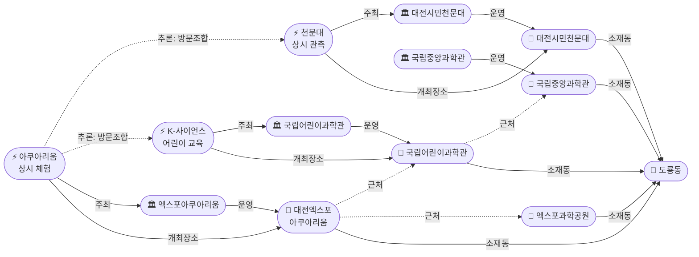
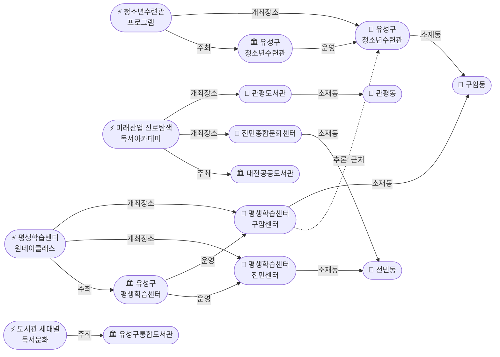

# 2026-04-26 대전 유성구 어린이·가족 이벤트 일일 보고서

## 요약

도룡동 과학벨트에 **대전엑스포아쿠아리움**(수중발레·터치풀·마술쇼, 상시 운영)이 신규 발견되어 가족 체험 시설이 6개로 확장됐다. **유성구 평생학습센터** 전민센터(용성로20에서 0.8km, ring-stroll)의 원데이클래스, 관평동 **현대프리미엄아울렛 IKEA 팝업스토어**(Shop 카테고리 첫 수집), **유성구청소년수련관**(구암동) 프로그램이 새로 확인됐다. 유성온천문화축제 2026 일정은 여전히 미공지 상태이며, 어린이날(5.5)까지 D-9로 각 기관 특별 행사 공지가 임박해 있다.

## 용성로20 주변 (도보권 내)

### ring-stroll (1km 이내)

| 시설 | 동 | 거리 | 유형 |
|------|---|------|------|
| **유성구 평생학습센터 전민센터** | 전민동 | ~0.8km | 공공기관 원데이클래스 |
| 전민종합문화센터 | 전민동 | ~0.8km | 문화센터 (기존) |

> 용성로20에서 도보 15분 내(ring-stroll)에 위치한 전민센터는 유성구민 대상 원데이클래스를 운영한다. 문의: 042-611-6553.

## 오늘의 추천 (가족 동반 Top 5)

| 순위 | 이벤트 | 장소 (동) | 대상 | 비용 | 어린이 친화도 |
|------|--------|----------|------|------|-------------|
| 1 | 대전엑스포아쿠아리움 체험 **[신규]** | 신세계 Art&Science B1 (도룡동) | 전연령가족 | 유료 (입장권) | 0.85 |
| 2 | K-사이언스 어린이 교육 프로그램 | 국립어린이과학관 (도룡동) | 초등학생 | 사전신청 | 0.95 |
| 3 | 대전광역시어린이회관 체험 프로그램 | 어린이회관 (노은동) | 유아~초등저학년 | 유료 (프로그램별) | 0.95 |
| 4 | 대전시민천문대 관측 프로그램 | 대전시민천문대 (도룡동) | 전연령가족 | 무료 | 0.85 |
| 5 | 유성구 도서관 세대별 독서문화 | 관평·전민·노은 도서관 | 영유아~초등 | 무료 | 0.90 |

## 신규 이벤트

### 1. 대전엑스포아쿠아리움 — 도룡동 가족 상시 체험 시설
- **출처:** [대전엑스포아쿠아리움](https://djexpoaqua.com/)
- **장소:** 대전 유성구 엑스포로 1, 신세계 Art&Science B1 (도룡동)
- **내용:** 국내 최초 살아있는 생물과 디지털 미디어 결합 전시. 200여 종, 2만여 마리 해양생물. 수중발레(매일 11:30·13:30·14:30·15:30·17:30), 먹이주기 체험(매일 12:30·16:30), 가오리 터치풀, 마술쇼.
- **상태:** 신규 (상시 운영)
- **대상:** 전연령 가족
- **비용:** 유료 (입장권)
- **운영시간:** 10:00~19:00 (입장마감 18:00)
- **사전신청:** 불필요
- **실내/야외:** 실내
- **전화:** 042-607-8852
- **Ring:** ring-car (약 3.5km)

> 도룡동 과학벨트의 6번째 가족 시설. 예약 없이 방문 가능하므로 과학관·천문대와 당일 연계 방문에 유리하다.

### 2. 유성구 평생학습센터 원데이클래스
- **출처:** [유성구 평생학습센터](https://lifelong.yuseong.go.kr/lly/prog/lctr/lly/sub02_06/LIFELONG_016/classDetail.do?lctrNo=8271)
- **장소:** 구암센터 (구암동, 042-611-6559) / 전민센터 (전민동, 042-611-6553)
- **내용:** 유성구민 및 유성구 소재 학교 재학생·직장 재직자 대상 원데이 특별강좌. 온라인 사전신청 필수. 3일 전 취소 및 당일 불참 시 2026년 특강 제한.
- **상태:** 신규
- **대상:** 성인 중심 (부모-자녀 참여형 프로그램 포함, 어린이 친화도 보수적 0.6)
- **비용:** 무료/저비용 (프로그램별 상이)
- **사전신청:** 필수
- **실내/야외:** 실내
- **Ring:** 전민센터 ring-stroll (0.8km), 구암센터 ring-car (3km)

### 3. 유성구청소년수련관 프로그램
- **출처:** [유성구청소년수련관](https://happy-you.kr/)
- **장소:** 유성구 구암동
- **내용:** 수련활동·동아리·캠프 등 청소년 프로그램 운영. 초등고학년~중학생 대상.
- **상태:** 신규
- **대상:** 초등고학년~중학생 (어린이 친화도 0.7)
- **비용:** 프로그램별 상이
- **사전신청:** 필요
- **실내/야외:** 실내+야외
- **Ring:** ring-car (약 3.2km)

### 4. 2026년 대전 대표축제 9개 선정
- **출처:** [Daum뉴스](https://v.daum.net/v/20260114165842736?f=p)
- **내용:** 대전시가 2026년 대표축제 9개를 선정. 유성구 관련으로 **유성사계절축제**, **유성국화축제**가 포함됨. 유성온천문화축제도 30회째 개최 예정.
- **상태:** 신규 (배경 정보)

## 신규 오픈 가게·팝업·프로모션

### IKEA 팝업스토어 (현대프리미엄아울렛 대전점)
- **출처:** [IKEA](https://www.ikea.com/kr/ko/stores/giheung/ikea-hyundai-outlet-dj-pub6d82f570/)
- **장소:** 현대프리미엄아울렛 대전점 1층 (관평동, 테크노중앙로 123)
- **내용:** IKEA 팝업스토어 운영. 현대프리미엄아울렛 대전점은 280여 개 브랜드 입점, 키즈 매장·키즈존·체험형 매장 보유. 가족 단위 쇼핑 가능.
- **Shop 정보:**
  - **shop_type:** 팝업스토어 (아울렛 내)
  - **dong:** 관평동
  - **distance_from_anchor_m:** ~2,500m
  - **open_hours:** 10:30~21:00
  - **kid_friendly:** 예 (키즈존 보유)
  - **is_new:** 팝업스토어 — 신규
- **Ring:** ring-bike (2.5km)

## 공공기관 주최 행사

| 기관 | 프로그램 | 장소 | 대상 | 비용 |
|------|---------|------|------|------|
| 유성구 평생학습센터 | 원데이클래스 **[신규]** | 전민센터·구암센터 | 성인 중심 | 무료/저비용 |
| 유성구청소년수련관 **[신규]** | 수련활동·캠프 | 구암동 | 초등고학년~중학생 | 프로그램별 |
| 유성구통합도서관 | 세대별 독서문화·북스타트 | 관평·전민·노은·유성 | 영유아~초등 | 무료 |
| 유성구 보건소 | 건강프로그램·예방접종 | 유성구 | 영유아~전연령 | 무료/보험 |

## 마감 임박 (사전신청 D-3 이내)

현재 D-3 이내 마감 임박 이벤트 없음. 도서관 프로그램(북스타트 등)은 선착순 마감 가능성 있음.

## 동심원별 묶음

### ring-stroll (1km 이내) — 도보 15분
- **유성구 평생학습센터 전민센터** (전민동, ~0.8km) **[신규]**
- 전민종합문화센터 (전민동)

### ring-bike (2km 이내) — 자전거·짧은 차량
- **현대프리미엄아울렛 대전점 + IKEA 팝업** (관평동, ~2.5km) **[신규]**
- 관평도서관 (관평동)

### ring-car (5km 이내) — 차량 10분
- **대전엑스포아쿠아리움** (도룡동, ~3.5km) **[신규]**
- 국립중앙과학관 · 국립어린이과학관 · 대전시민천문대 · 엑스포과학공원 (도룡동)
- **유성구 평생학습센터 구암센터** (구암동, ~3km) **[신규]**
- **유성구청소년수련관** (구암동, ~3.2km) **[신규]**
- 대전광역시어린이회관 (노은동)

## 동(洞)별 이벤트 묶음

### 도룡동 (1차 타겟) — 과학벨트 6시설

| 이벤트 | 장소 | 상태 |
|--------|------|------|
| **대전엑스포아쿠아리움 체험** | 신세계 Art&Science B1 | **신규** — 상시 운영 |
| K-사이언스 어린이 교육 프로그램 | 국립어린이과학관 | 운영 중 |
| 사이언스 패스 | 국립중앙과학관 | 4.21~ 상시 |
| 상시 관측 프로그램 | 대전시민천문대 | 상시 운영 |
| 2026 대전사이언스페스티벌 | 엑스포과학공원·DCC | 종료 (37만 명) |

> 도룡동 과학벨트가 엑스포과학공원 → 국립중앙과학관 → 국립어린이과학관 → 대전시민천문대 → **대전엑스포아쿠아리움** 5개 시설로 확장. 아쿠아리움은 예약 불필요 → 나머지 시설과 자유롭게 당일 조합 가능.

### 관평동 (1차 타겟)

| 이벤트 | 장소 |
|--------|------|
| **IKEA 팝업스토어** | 현대프리미엄아울렛 1층 **[신규]** |
| 도서관 독서문화 프로그램 | 관평도서관 |
| 미래산업 진로탐색 독서아카데미 | 관평도서관 |

### 전민동 (1차 타겟)

| 이벤트 | 장소 |
|--------|------|
| **유성구 평생학습센터 원데이클래스** | 전민센터 **[신규]** |
| 미래산업 진로탐색 독서아카데미 | 전민종합문화센터 |

### 구암동 (보조 타겟) — 공공시설 2곳 신규

| 이벤트 | 장소 |
|--------|------|
| **유성구 평생학습센터 원데이클래스** | 구암센터 **[신규]** |
| **유성구청소년수련관 프로그램** | 청소년수련관 **[신규]** |

> 구암동에서 평생학습센터 구암센터 + 청소년수련관이 묶음 방문 가능 (추론 신뢰도 0.75)

### 노은동 (보조 타겟)

| 이벤트 | 장소 |
|--------|------|
| 대전광역시어린이회관 체험 프로그램 | 어린이회관 |
| 도서관 독서문화 프로그램 | 노은도서관 |

### 용산동·문지동·신성동 (1차 타겟)
금일 수집된 신규 이벤트 없음.

## 연령대별 묶음

### 영유아 (0~3세)
- 북스타트 책놀이 (유성도서관)

### 유아 (4~6세)
- 대전광역시어린이회관 체험 프로그램 (노은동)
- 도서관 세대별 독서문화 프로그램 (관평·전민·노은)
- 생애주기별 유아 문화예술교육지원 (대전문화재단)

### 초등저학년 (7~9세)
- K-사이언스 어린이 교육 프로그램 (국립어린이과학관)
- 대전광역시어린이회관 체험 프로그램 (노은동)
- 도서관 세대별 독서문화 프로그램

### 초등고학년 (10~12세)
- K-사이언스 어린이 교육 프로그램 (국립어린이과학관)
- 미래산업 진로탐색 독서아카데미 (관평·전민)
- **유성구청소년수련관 프로그램** (구암동) **[신규]**

### 전연령 가족
- **대전엑스포아쿠아리움 체험** (도룡동) **[신규]**
- 대전시민천문대 상시 관측 (도룡동)
- 사이언스 패스 (국립중앙과학관)
- **IKEA 팝업스토어** (현대아울렛 관평동) **[신규]**

## 시리즈/정기 프로그램 업데이트

| 프로그램 | 주최 | 유형 | 비고 |
|---------|------|------|------|
| 북스타트 책놀이 | 유성구통합도서관 | 정기 | 영유아 대상 반복 운영 |
| K-사이언스 교육 | 국립어린이과학관 | 정기 | 2026년 연간 프로그램 |
| 천문대 관측 프로그램 | 대전시민천문대 | 상시 | 매일 14:00~22:00 |
| 도서관 독서문화 프로그램 | 유성구통합도서관 | 정기 | 세대별 맞춤 |
| 어린이회관 체험 프로그램 | 대전광역시어린이회관 | 상시 | 예약제, 노은동 |
| **아쿠아리움 체험 프로그램** | **대전엑스포아쿠아리움** | **상시** | **신규 — 예약 불필요, 도룡동** |
| **원데이클래스** | **유성구 평생학습센터** | **수시** | **신규 — 온라인 사전신청** |

## 지식그래프 시각화

### 오늘의 주요 관계

도룡동 과학벨트에 대전엑스포아쿠아리움이 추가되어 가족 체험 시설이 6개로 확장됐다. 아쿠아리움은 엑스포과학공원·국립어린이과학관과 근접하며(도보 연계 가능), K-사이언스(주간) → 아쿠아리움(주간) → 천문대(야간)의 시간대 연계 코스가 성립한다. 유성구 평생학습센터가 전민동(ring-stroll)과 구암동에 센터를 운영하며, 구암동에서는 청소년수련관과 묶음 방문이 가능하다. 관평동에 현대프리미엄아울렛 + IKEA 팝업스토어가 Shop 카테고리 첫 인스턴스로 등록됐다.

### 도룡동 과학벨트 그래프 (아쿠아리움 추가)

### 공공기관·도서관 네트워크 그래프

## 온톨로지 변경

| 변경 유형 | 대상 | 근거 |
|----------|------|------|
| 새 클래스 | Shop | config seed에 정의되었으나 스키마에 누락, IKEA 팝업 발견으로 추가 |
| 새 관계 유형 (4종) | shopHosts, shopLocatedIn, withinRing, shopWithinRing | Shop/GeoRing 관련 관계 추가 |
| 새 엔티티 (Venue) | 4건 — 아쿠아리움, 평생학습센터(구암·전민), 청소년수련관 | 금일 수집 |
| 새 엔티티 (Organization) | 3건 — 아쿠아리움, 평생학습센터, 청소년수련관 | 금일 수집 |
| 새 엔티티 (Event) | 3건 — 아쿠아리움 체험, 원데이클래스, 청소년수련관 프로그램 | 금일 수집 |
| 새 엔티티 (Shop) | 2건 — 현대프리미엄아울렛, IKEA 팝업 | 금일 수집 |

## 추론 결과

| 추론 | 신뢰도 | 근거 |
|------|--------|------|
| 아쿠아리움 ↔ 엑스포과학공원 근접 | 0.90 | 도룡동 엑스포 권역 동일 소재 |
| 아쿠아리움 ↔ 어린이과학관 근접 | 0.85 | 도룡동 내 도보 연계 |
| 아쿠아리움 + K-사이언스 방문조합 | 0.85 | 도룡동, 당일 연계 가능 |
| 아쿠아리움 + 천문대 방문조합 | 0.80 | 주간→야간 시간대 연계 |
| 평생학습센터 어린이 친화도 가산 | 0.90 | 평생학습관 운영 → +0.2 |
| 청소년수련관 공공 신뢰도 가산 | 0.85 | 복지관 주최 → +0.15 |
| 구암 평생학습센터 ↔ 청소년수련관 근접 | 0.75 | 구암동 동일 소재 |

## 분석 및 평가

도룡동 과학벨트가 5 → 6개 시설로 확장됐다. 대전엑스포아쿠아리움은 예약 불필요·상시 운영이라는 점에서 다른 시설(사전신청 필요)과 보완적이다. K-사이언스(주간, 사전신청) → 아쿠아리움(주간, 자유 방문) → 천문대(야간, 무료)의 3시설 연계 코스가 가장 효율적인 도룡동 당일 가족 방문 루트로 추천된다.

Shop 카테고리가 처음으로 채워졌다. 관평동 현대프리미엄아울렛의 IKEA 팝업은 가족 단위 쇼핑 + 키즈존 체험을 동시에 제공한다. 향후 용산동·전민동 인근 소규모 카페·베이커리·키즈카페 오픈 모니터링이 필요하다.

유성구 평생학습센터 전민센터(ring-stroll, 0.8km)의 발견은 용성로20 도보권 내 공공 프로그램 접근성을 높인다. 다만 주 대상이 성인이므로 부모-자녀 참여형 프로그램 여부를 지속 확인해야 한다.

어린이날(5.5)까지 D-9. 각 기관(과학관·어린이회관·도서관·아쿠아리움 등)의 어린이날 특별 프로그램 공지가 이번 주~다음 주 중 본격화될 것으로 예상된다.

## 추적 항목

| 항목 | 최초 보고 | 상태 | 최신 업데이트 |
|------|----------|------|-------------|
| K-사이언스 어린이 교육 프로그램 | 2026-04-25 | 운영 중 | 사전신청 일정 추적 필요 |
| 사이언스 패스 | 2026-04-25 | 신규 출시 | 적용 과학관 범위 확인 필요 |
| 유성온천문화축제 | 2026-04-25 | **2026 일정 여전히 미공지** | 4/26 재확인 — 미공지. 2025년 5.2~4 기준 5월 초 추정. 족욕테마열차·어린이프로그램 상세 확인 |
| 어린이날 특별행사 | 2026-04-25 | **D-9** | 각 기관 공지 추적 (특히 과학관·어린이회관·도서관·아쿠아리움) |
| 대전광역시어린이회관 | 2026-04-25 | 상시 운영 | 프로그램 변동 추적 |
| 유아 문화예술교육지원 | 2026-04-25 | 운영 중 | 유성구 적용 현황 추적 필요 |
| **대전엑스포아쿠아리움** | **2026-04-26** | **신규 발견, 상시 운영** | 어린이날 특별 프로그램 공지 대기 |
| **유성구 평생학습센터 원데이클래스** | **2026-04-26** | **신규 발견** | 부모-자녀 참여형 프로그램 확인 필요 |
| **IKEA 팝업스토어** | **2026-04-26** | **신규** | 운영 기간 확인 필요 (팝업 종료일 미확인) |

## 동향 요약

| 분류 | 상태 | 비고 |
|------|------|------|
| 도룡동 과학벨트 | 확장 (5→6시설) | 아쿠아리움 추가, 3시설 연계 코스 성립 |
| Shop 카테고리 | 첫 수집 | 현대프리미엄아울렛 + IKEA 팝업 (관평동) |
| 공공기관 프로그램 | 확대 | 평생학습센터(전민·구암) + 청소년수련관(구암) |
| 도서관 프로그램 | 운영 중 | 관평·전민·노은 등 세대별 맞춤 |
| 어린이날 대비 | D-9 | 특별 행사 공지 임박 |
| 유성온천문화축제 | 미정 | 2026년 일정 여전히 미공지 |

## 출처 목록

1. [대전엑스포아쿠아리움](https://djexpoaqua.com/) - 대전엑스포아쿠아리움, 2026-04-26
2. [유성구 평생학습센터 원데이클래스](https://lifelong.yuseong.go.kr/lly/prog/lctr/lly/sub02_06/LIFELONG_016/classDetail.do?lctrNo=8271) - 유성구 평생학습센터, 2026-04-26
3. [IKEA 팝업스토어 현대프리미엄아울렛 대전](https://www.ikea.com/kr/ko/stores/giheung/ikea-hyundai-outlet-dj-pub6d82f570/) - IKEA, 2026-04-26
4. [유성구청소년수련관](https://happy-you.kr/) - 유성구청소년수련관, 2026-04-26
5. [2026년 대전 대표축제 9개 선정](https://v.daum.net/v/20260114165842736?f=p) - Daum뉴스, 2026-01-14
6. [유성온천문화축제](http://ysfesta.com/index.php) - 유성온천문화축제 공식, 2026-04-26
7. [대전엑스포아쿠아리움 이용요금·운영시간](https://djexpoaqua.com/html/operation.php) - 대전엑스포아쿠아리움, 2026-04-26
8. [현대프리미엄아울렛 대전점](https://www.ehyundai.com/newPortal/outlet/DP/DP000000_V.do?branchCd=B00177000) - 현대백화점, 2026-04-26
9. [유성구 평생학습센터 메인](https://lifelong.yuseong.go.kr/lly/lly/index.do) - 유성구 평생학습센터, 2026-04-26
10. [대전엑스포아쿠아리움 나무위키](https://namu.wiki/w/%EB%8C%80%EC%A0%84%EC%97%91%EC%8A%A4%ED%8F%AC%EC%95%84%EC%BF%A0%EC%95%84%EB%A6%AC%EC%9B%80) - 나무위키
