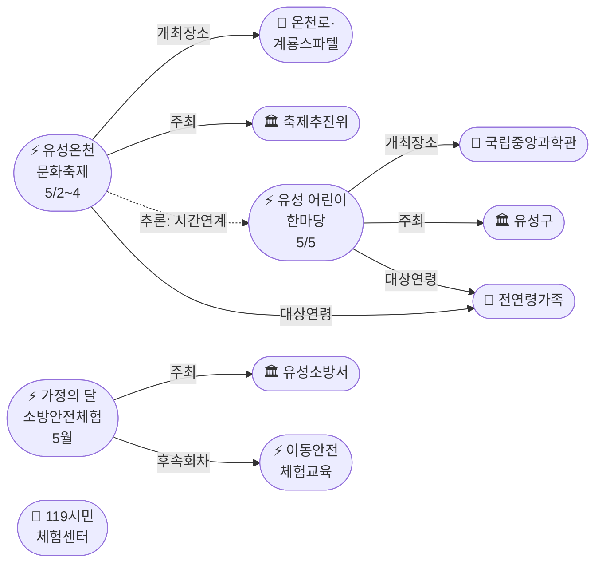
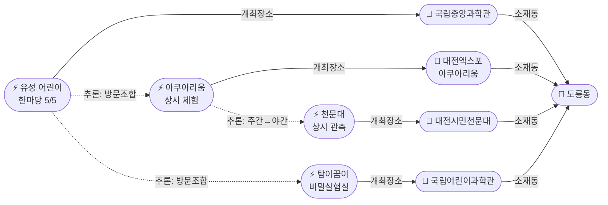
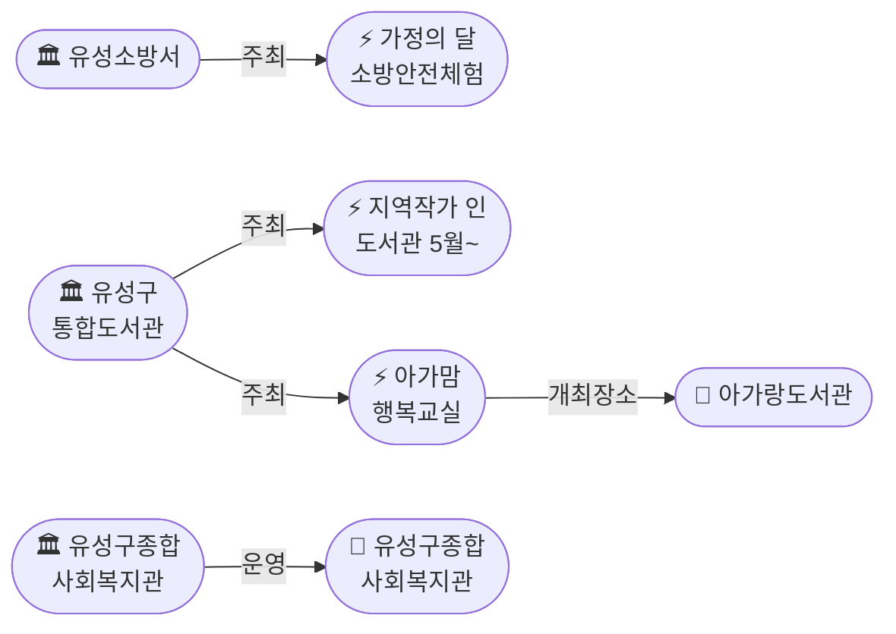

# 2026-04-27 대전 유성구 어린이·가족 이벤트 일일 보고서

## 요약

**5월 가정의 달 행사가 본격 확정됐다.** 추적 중이던 **유성온천문화축제**의 2026년 일정이 **5/2(금)~5/4(일)** 3일간으로 최종 확정됐고(D-5), 5/5 어린이날에는 유성구 주최 **'유성 어린이 한마당'**이 국립중앙과학관 중앙광장에서 개최된다(D-8). 온천축제(5/2~4) → 어린이 한마당(5/5) → 가정의 달 소방안전체험(5월) = **5일 연속 유성구 가족 행사**가 가능해졌다. 도서관에서는 5월부터 '지역작가 인(人) 도서관' 프로그램이 6개 관에서 시작되며, 유성구종합사회복지관이 복지관 카테고리에 새로 등록됐다.

## 용성로20 주변 (도보권 내)

### ring-stroll (1km 이내) — 전민동 클러스터 유지

| 시설 | 동 | 거리 | 유형 | 상태 |
|------|---|------|------|------|
| 아가랑도서관 | 전민동 | ~0.9km | 도서관 — 아가맘 행복교실 | 운영 중 (4/4~6/27) |
| 유성구 평생학습센터 전민센터 | 전민동 | ~0.8km | 공공기관 원데이클래스 | 운영 중 |
| 전민종합문화센터 | 전민동 | ~0.8km | 문화센터 | 기존 |

> 도보권 내 변동 없음. 전민동 3거점 클러스터 유지. 5월부터 지역작가 인 도서관 프로그램이 추가될 수 있음(6개 도서관 중 전민도서관 포함 여부 확인 필요).

## 오늘의 추천 (가족 동반 Top 5)

| 순위 | 이벤트 | 장소 (동) | 대상 | 비용 | D-day |
|------|--------|----------|------|------|-------|
| 1 | **유성 어린이 한마당** **[신규]** | 국립중앙과학관 (도룡동) | 유아~초등·가족 | 무료 | **D-8 (5/5)** |
| 2 | **유성온천문화축제** **[일정확정]** | 온천로 일원 (봉명동) | 전연령 가족 | 무료 | **D-5 (5/2~4)** |
| 3 | 아가·맘 행복교실 | 아가랑도서관 (전민동, 0.9km) | 영유아 | 무료 | 운영 중 |
| 4 | 대전엑스포아쿠아리움 | 신세계 B1 (도룡동) | 전연령 가족 | 유료 | 상시 |
| 5 | 탐이 꿈이의 비밀 실험실 | 국립어린이과학관 (도룡동) | 초등 | 유료 | 4~6월 |

## 신규 이벤트

### 1. 유성 어린이 한마당 — 5/5 국립중앙과학관 (D-8)
- **출처:** [디트NEWS24](https://www.dtnews24.com/news/articleView.html?idxno=810991), [충청매일](https://www.ccdn.co.kr/news/articleView.html?idxno=1075693)
- **장소:** 국립중앙과학관 중앙광장 일원 (도룡동, ring-car ~3.5km)
- **일시:** 2026-05-05 (월, 어린이날)
- **내용:** 제104회 어린이날 기념 복합 축제. 목재친화 팝업놀이터 '나무랑 놀꾸야' 연계.
  - **공연:** 사이언스홀 매직쇼·버블쇼, 돔형 중앙통로 매직버블쇼
  - **과학 체험:** 초코파이 진공 실험, 밀가루 배터리 시계 만들기, 무지개 망원경, 3D펜 체험
  - **목공·놀이:** 나무도마·자동차·독서대 등 16종 목공 체험, 보드게임·전통놀이
  - **안전:** 아동 권리 캠페인, 지문 사전등록, 감염병 예방 교육·손 씻기 체험
- **대상:** 유아 ~ 초등고학년, 전연령 가족
- **비용:** 무료
- **사전신청:** 불필요
- **실내/야외:** 야외+실내
- **어린이 친화도:** 0.95 (구청 주최 + 과학관 장소 → publicTrustBoost +0.15, kidFriendlyBoost +0.2)

> 어린이날 추적 항목(D-9 → D-8)의 구체적 행사가 확정됐다. 국립중앙과학관이라는 검증된 장소에서 유성구가 주최하는 무료 행사로, 사전신청 불필요. 도룡동 아쿠아리움·과학관과 당일 연계 가능.

### 2. 지역작가 인(人) 도서관 — 5월~ 6개 도서관
- **출처:** [페디앙](https://pedien.com/html/view.php?idx=1014924), [KSP뉴스](https://www.kspnews.com/2595126)
- **장소:** 유성구 6개 공공도서관 (관평·노은·진잠·전민·유성 등)
- **기간:** 2026-05-01~
- **내용:** 지역작가와 주민이 직접 만나 소통. 강연, 북토크, 창작 프로그램.
- **대상:** 전연령 가족 (성인 중심이나 가족 동반 가능)
- **비용:** 무료
- **사전신청:** 불필요 (프로그램별 상이)
- **실내/야외:** 실내
- **어린이 친화도:** 0.6 (성인 대상 프로그램 주이나 창작 활동 일부 어린이 참여 가능)

## 업데이트 항목

### 유성온천문화축제 — 2026 일정 확정! (5/2~5/4)
- **출처:** [유성온천문화축제 공식](http://ysfesta.com/bbs/spafest.php?page_id=overview), [유성구청](https://www.yuseong.go.kr/prog/trrsrt/TRSE_01/tour/sub04_01/view.do?trrsrtNo=7), [대전관광공사](https://www.daejeontour.co.kr/ko/festival/festivalView.do?festv_id=58)
- **이전 상태:** 2026년 일정 미공지 (4/25~26 3회 추적)
- **확정 일정:** 2026-05-02(금) ~ 05-04(일) 3일간
- **장소:** 온천로 일원·계룡스파텔 광장 (봉명동, ring-car ~5km)
- **내용:** 8개 분야 100여개 프로그램. 온천거리퍼레이드, 온천수 물총 스플래쉬, 온천수 DJ파티, 민·관·학·연 참여.
- **대상:** 전연령 가족
- **비용:** 무료 (일부 유료)
- **사전신청:** 불필요
- **어린이 친화도:** 0.7 (전연령 축제이나 물총 스플래쉬 등 어린이 흥미 프로그램 다수. DJ파티 등 성인 프로그램도 혼재.)

> **핵심 업데이트.** 3일 연속 추적한 '미공지' 상태가 해소됐다. 유성구 대표축제가 어린이날 직전(5/2~4)에 열려, 온천축제 → 어린이 한마당(5/5)으로 이어지는 5일 연속 가족 행사 가능.

### 유성소방서 — 가정의 달 소방안전체험의 장 확대
- **출처:** [대전시티저널](https://www.gocj.net/news/articleView.html?idxno=133782)
- **이전 상태:** 4/26 이동안전체험차량 + 119시민체험센터 신규 보고
- **업데이트:** 5월 가정의 달 맞아 소방안전체험의 장 확대 운영 확인. 어린이·가족 대상 체험 행사 강화.

## 신규 오픈 가게·팝업·프로모션

### 레포레스트 (덕명동 대형카페) — 신규 오픈
- **출처:** [웰페어헬로](https://www.welfarehello.com/community/hometownNews/c7c1f15b-d46a-4e5e-9689-0b77a91258e8)
- **장소:** 대전 유성구 덕명동 (한밭대학교 인근)
- **Shop 정보:** 카페 | 덕명동 | ~4,000m | 1~4층 각기 다른 분위기 | 야외 테라스 | 단체석 | **is_new: true**
- **Ring:** ring-car (4km)
- **어린이 동반:** 넓은 공간, 단체석 다수 → 가족 모임 가능

> 1차 타겟 동 아님(덕명동). 대형카페로 가족 모임에 적합하나, 어린이 전용 시설 여부는 미확인.

### 기존 Shop 현황 (변동 없음)
- IKEA 팝업스토어 (현대프리미엄아울렛, 관평동) — 운영 중
- 신세계 Art&Science 대전 봄 팝업 (도룡동) — 운영 중

## 공공기관 주최 행사

| 기관 | 프로그램 | 장소 | 대상 | 비용 | 상태 |
|------|---------|------|------|------|------|
| **유성구** **[신규]** | **유성 어린이 한마당** | 국립중앙과학관 | 유아~초등·가족 | 무료 | **D-8 (5/5)** |
| **대전유성소방서** **[업데이트]** | **가정의 달 소방안전체험** | 유성구 일원 | 유아~초등·가족 | 무료 | **5월 확대 운영** |
| **유성구종합사회복지관** **[신규]** | 지역사회복지 프로그램 | 봉명동 | 전연령 | 프로그램별 | **복지관 카테고리 신규 등록** |
| 유성구통합도서관 | 지역작가 인 도서관 **[신규]** | 6개 도서관 | 전연령 | 무료 | **5월~ 시작** |
| 유성구통합도서관 | 세대별 독서문화·북스타트 | 7개 도서관 | 영유아~초등 | 무료 | 운영 중 |
| 유성구 아가랑도서관 | 아가맘 행복교실 | 전민동 | 영유아 | 무료 | 운영 중 (4/4~6/27) |
| 유성구 평생학습센터 | 원데이클래스 | 전민·구암 | 성인 중심 | 무료/저비용 | 운영 중 |
| 대전유성소방서 | 119시민체험센터·이동체험 | 유성구 | 전연령 | 무료 | 상시 운영 |

## 마감 임박 (사전신청 D-5 이내)

| 이벤트 | D-day | 일시 | 장소 | 비고 |
|--------|-------|------|------|------|
| **유성온천문화축제** | **D-5** | 5/2(금)~5/4(일) | 온천로 일원 | 사전신청 불필요, 현장 참여 |
| **유성 어린이 한마당** | **D-8** | 5/5(월) | 국립중앙과학관 | 사전신청 불필요, 현장 참여 |

> 두 행사 모두 사전신청 불필요. 현장 방문으로 참여 가능. 어린이 한마당 체험 프로그램은 현장 선착순 예상.

## 동심원별 묶음

### ring-stroll (1km 이내) — 전민동 클러스터 (변동 없음)
- 아가랑도서관 (전민동, ~0.9km) — 아가맘 행복교실 (4/4~6/27)
- 유성구 평생학습센터 전민센터 (전민동, ~0.8km) — 원데이클래스
- 전민종합문화센터 (전민동) — 미래산업 진로탐색 독서아카데미

### ring-bike (2km 이내) — 관평동 (변동 없음)
- 현대프리미엄아울렛 대전점 + IKEA 팝업 (관평동, ~2.5km)
- 관평도서관 (관평동)

### ring-car (5km 이내) — 5월 행사 집중 추가
- **유성 어린이 한마당 (5/5)** + 국립중앙과학관 · 어린이과학관 · 천문대 · 아쿠아리움 (도룡동, ~3.5km) **[신규]**
- **유성온천문화축제 (5/2~4)** — 온천로 일원 (봉명동, ~5km) **[일정확정]**
- 유성구 평생학습센터 구암센터 · 유성구청소년수련관 (구암동, ~3km)
- **레포레스트 카페** (덕명동, ~4km) **[신규 Shop]**
- 대전광역시어린이회관 (노은동)
- **유성구종합사회복지관** (봉명동, ~4.5km) **[신규]**

## 동(洞)별 이벤트 묶음

### 도룡동 (1차 타겟) — 어린이 한마당 추가, 과학벨트 7시설

| 이벤트 | 장소 | 상태 |
|--------|------|------|
| **유성 어린이 한마당 (5/5)** | 국립중앙과학관 중앙광장 | **신규 — D-8** |
| 대전엑스포아쿠아리움 체험 | 신세계 Art&Science B1 | 상시 운영 |
| 탐이 꿈이의 비밀 실험실 | 국립어린이과학관 | 4~6월 |
| K-사이언스 어린이 교육 | 국립어린이과학관 | 운영 중 |
| 사이언스 패스 | 국립중앙과학관 | 4.21~ 상시 |
| 상시 관측 프로그램 | 대전시민천문대 | 상시 운영 |
| 신세계 Art&Science 봄 팝업 | 엑스포로 1 | Shop |

> 어린이날(5/5) 도룡동 추천 루트: **어린이 한마당(무료, 야외) → 아쿠아리움(유료, 실내) → 천문대(무료, 야간)**

### 봉명동 (보조 타겟) — 축제·복지관 2건 신규

| 이벤트 | 장소 | 상태 |
|--------|------|------|
| **유성온천문화축제 (5/2~4)** | 온천로·계룡스파텔 광장 | **일정 확정 — D-5** |
| **유성구종합사회복지관** | 도안대로589번길 27 | **신규 등록** |

### 전민동 (1차 타겟) — ring-stroll 클러스터 유지

| 이벤트 | 장소 | 상태 |
|--------|------|------|
| 아가·맘 행복교실 | 아가랑도서관 | 운영 중 (4/4~6/27) |
| 유성구 평생학습센터 원데이클래스 | 전민센터 | 운영 중 |
| 미래산업 진로탐색 독서아카데미 | 전민종합문화센터 | 운영 중 |

### 관평동 (1차 타겟)
| 이벤트 | 장소 |
|--------|------|
| IKEA 팝업스토어 | 현대프리미엄아울렛 1층 |
| 도서관 독서문화 프로그램 | 관평도서관 |

### 용산동·문지동·신성동 (1차 타겟)
금일 수집된 신규 이벤트 없음.

## 연령대별 묶음

### 영유아 (0~3세)
- 아가·맘 행복교실 (아가랑도서관, 전민동 ring-stroll) — 운영 중
- 북스타트 책놀이 (7개 도서관) — 운영 중

### 유아 (4~6세)
- **유성 어린이 한마당 (5/5)** **[신규]** — 목공·과학 체험
- 대전광역시어린이회관 체험 프로그램 (노은동)
- 유성소방서 안전체험 (이동체험·119시민체험센터)
- **유성온천문화축제 (5/2~4)** **[확정]** — 물총 스플래쉬

### 초등저학년 (7~9세)
- **유성 어린이 한마당 (5/5)** **[신규]** — 과학 실험·3D펜·목공 16종
- 탐이 꿈이의 비밀 실험실 (국립어린이과학관)
- K-사이언스 어린이 교육 프로그램 (국립어린이과학관)
- 유성소방서 안전체험
- 대전광역시어린이회관 체험 프로그램 (노은동)

### 초등고학년 (10~12세)
- **유성 어린이 한마당 (5/5)** **[신규]**
- 탐이 꿈이의 비밀 실험실 (국립어린이과학관)
- 미래산업 진로탐색 독서아카데미 (관평·전민)
- 유성구청소년수련관 프로그램 (구암동)

### 전연령 가족
- **유성 어린이 한마당 (5/5)** **[신규]**
- **유성온천문화축제 (5/2~4)** **[확정]**
- 대전엑스포아쿠아리움 체험 (도룡동)
- 대전시민천문대 상시 관측 (도룡동)
- **지역작가 인 도서관 (5월~)** **[신규]**

## 시리즈/정기 프로그램 업데이트

| 프로그램 | 주최 | 유형 | 비고 |
|---------|------|------|------|
| **유성 어린이 한마당** | **유성구** | **연례** | **신규 — 5/5, 어린이날 행사, 국립중앙과학관** |
| **유성온천문화축제** | **축제추진위** | **연례** | **일정 확정 — 5/2~4, 100여개 프로그램** |
| **가정의 달 소방안전체험** | **유성소방서** | **연례** | **업데이트 — 5월 확대 운영** |
| **지역작가 인 도서관** | **유성구통합도서관** | **정기** | **신규 — 5월~, 6개 도서관** |
| 아가맘 행복교실 | 아가랑도서관 | 정기 | 4/4~6/27, 영유아 전용 |
| 탐이꿈이 비밀실험실 | 국립어린이과학관 | 정기 | 4~6월 수목금토 |
| 천문대 관측 프로그램 | 대전시민천문대 | 상시 | 매일 14:00~22:00 |
| 어린이회관 체험 프로그램 | 대전광역시어린이회관 | 상시 | 예약제 |
| 아쿠아리움 체험 | 대전엑스포아쿠아리움 | 상시 | 예약 불필요 |
| 북스타트 책놀이 | 유성구통합도서관 | 정기 | 7개 도서관 |
| 원데이클래스 | 유성구 평생학습센터 | 수시 | 온라인 사전신청 |
| 이동안전체험교육 | 유성소방서 | 수시 | 학교 방문형 |
| 소방안전체험 | 119시민체험센터 | 상시 | 화~토, 예약제 |

## 지식그래프 시각화

### 오늘의 주요 관계

5월 가정의 달 행사가 집중 확정됐다. **유성온천문화축제**(5/2~4, 봉명동)와 **유성 어린이 한마당**(5/5, 도룡동)이 연이어 개최되어, 도룡동 과학벨트와 봉명동 축제장을 잇는 **5일 연속 가족 행사 루트**가 형성됐다. 유성소방서의 **가정의 달 소방안전체험**이 5월 확대 운영되어 공공기관 프로그램이 한층 강화됐다.

### 5월 가정의 달 행사 연계

### 도룡동 과학벨트 + 어린이 한마당 (5/5 추천 루트)

### 공공기관 네트워크 (복지관 추가)

## 온톨로지 변경

| 변경 유형 | 대상 | 근거 |
|----------|------|------|
| 새 엔티티 (Event) | 4건 — 유성 어린이 한마당, 유성온천문화축제, 가정의 달 소방안전체험, 지역작가 인 도서관 | 금일 수집 |
| 새 엔티티 (Venue) | 2건 — 온천로 축제장, 유성구종합사회복지관 | 금일 수집 |
| 새 엔티티 (Organization) | 2건 — 유성온천문화축제추진위, 유성구종합사회복지관 | 금일 수집 |
| 새 엔티티 (Shop) | 1건 — 레포레스트 카페 (덕명동) | 금일 수집 |

## 추론 결과

| 추론 | 신뢰도 | 근거 |
|------|--------|------|
| 어린이 한마당 공공 신뢰도 가산 | 0.90 | 구청 주최 → +0.15 |
| 어린이 한마당 ↔ 사이언스데이 방문조합 | 0.85 | 동일 장소(국립중앙과학관), 유성구 반복 개최 |
| 어린이 한마당 ↔ 아쿠아리움 방문조합 | 0.80 | 도룡동 당일 연계 |
| 소방안전체험 공공 신뢰도 가산 | 0.85 | 소방서 주최 → +0.15 |
| 유성온천축제 → 어린이 한마당 시간연계 | 0.75 | 5/2~4 → 5/5 연속, 봉명동→도룡동 이동 필요 |
| 어린이 한마당 어린이 친화도 가산 | 0.90 | 과학관 장소 → +0.2 |

## 분석 및 평가

**5월 가정의 달 행사 집중 시즌에 진입했다.** 가장 큰 발견은 **유성온천문화축제 일정 확정**(5/2~4)과 **유성 어린이 한마당**(5/5)의 동시 확인이다. 이로써 5월 첫째 주가 유성구 가족의 "골든위크"가 됐다:

- **5/2(금)~5/4(일):** 유성온천문화축제 — 온천로 퍼레이드, 물총 스플래쉬, 100여개 프로그램
- **5/5(월, 어린이날):** 유성 어린이 한마당 — 국립중앙과학관, 과학·목공·공연 복합 축제
- **5월 전체:** 가정의 달 소방안전체험의 장 — 유성소방서 확대 운영

도룡동 과학벨트에서는 어린이 한마당이 추가되어, **어린이날 당일 추천 루트**가 확정됐다: 어린이 한마당(국립중앙과학관, 무료) → 아쿠아리움(신세계 B1, 유료) → 천문대(야간, 무료). 이 세 시설 모두 사전 예약 불필요 or 현장 참여 가능.

**3종 의무 커버 현황:**
- **(a) 이벤트:** 어린이 한마당·유성온천문화축제·지역작가 도서관 = 충족
- **(b) Shop:** 레포레스트 카페 (덕명동, 신규 오픈) = 충족
- **(c) 공공기관:** 유성구(어린이 한마당)·유성소방서(가정의 달 확대)·유성구종합사회복지관(신규 등록) = 충족

## 추적 항목

| 항목 | 최초 보고 | 상태 | 최신 업데이트 |
|------|----------|------|-------------|
| **유성온천문화축제** | 2026-04-25 | **✅ 일정 확정!** | **5/2(금)~5/4(일), 온천로, 100여개 프로그램 — D-5** |
| **어린이날 특별행사** | 2026-04-25 | **✅ 구체화!** | **유성 어린이 한마당 5/5, 국립중앙과학관 — D-8** |
| K-사이언스 어린이 교육 | 2026-04-25 | 운영 중 | 탐이꿈이(4~6월), 주말과학교실(4/26 종료) |
| 사이언스 패스 | 2026-04-25 | 신규 출시 | 적용 과학관 범위 확인 필요 |
| 대전광역시어린이회관 | 2026-04-25 | 상시 운영 | 어린이날 특별 프로그램 공지 대기 |
| 유아 문화예술교육지원 | 2026-04-25 | 운영 중 | 유성구 적용 현황 추적 필요 |
| 대전엑스포아쿠아리움 | 2026-04-26 | 상시 운영 | 어린이날 특별 프로그램 공지 대기 |
| IKEA 팝업스토어 | 2026-04-26 | 운영 중 | 종료일 미확인 |
| 아가·맘 행복교실 | 2026-04-26 | 운영 중 | 4/4~6/27, 전민동 ring-stroll |
| 유성소방서 안전체험 | 2026-04-26 | **5월 확대** | **가정의 달 소방안전체험의 장 — 5월 전체** |
| 북스타트 7개 도서관 | 2026-04-26 | 운영 중 | 5월 프로그램 사전신청 곧 시작 예상 |
| **지역작가 인 도서관** | **2026-04-27** | **신규** | **5월~, 6개 도서관** |
| **유성구종합사회복지관** | **2026-04-27** | **신규 등록** | **복지관 카테고리 추가** |

## 동향 요약

| 분류 | 상태 | 비고 |
|------|------|------|
| 5월 가정의 달 | **골든위크 확정** | 온천축제(5/2~4) + 어린이 한마당(5/5) + 소방체험(5월) |
| 유성온천문화축제 | **미공지 → 확정** | D-5, 100여개 프로그램 |
| 어린이날 행사 | **D-9 → D-8, 구체화** | 유성 어린이 한마당, 국립중앙과학관, 무료 |
| 전민동 도보권 | 유지 (3거점) | 변동 없음 |
| 도룡동 과학벨트 | 어린이 한마당 추가 | 어린이날 당일 루트 확정 |
| Shop 카테고리 | 확대 (3→4건) | 레포레스트 (덕명동) 추가 |
| 공공기관 카테고리 | 복지관 추가 | 유성구종합사회복지관 신규 등록 |
| 도서관 프로그램 | 5월 확대 | 지역작가 인 도서관 6개관 시작 |

## 출처 목록

1. [유성구 어린이날 '유성 어린이 한마당' 개최](https://www.dtnews24.com/news/articleView.html?idxno=810991) — 디트NEWS24, 2026-04-27
2. [유성구 어린이날 '어린이 한마당' 개최 — 과학·체험 축제](https://www.ccdn.co.kr/news/articleView.html?idxno=1075693) — 충청매일, 2026-04-27
3. [유성온천문화축제 2026 일정](http://ysfesta.com/bbs/spafest.php?page_id=overview) — 유성온천문화축제 공식, 2026-04-27
4. [유성온천문화축제 — 유성구 문화관광](https://www.yuseong.go.kr/prog/trrsrt/TRSE_01/tour/sub04_01/view.do?trrsrtNo=7) — 유성구청, 2026-04-27
5. [유성소방서, 가정의 달 소방안전체험의 장 운영](https://www.gocj.net/news/articleView.html?idxno=133782) — 대전시티저널, 2026-04-27
6. [유성구 '지역작가 인 도서관' 프로그램](https://pedien.com/html/view.php?idx=1014924) — 페디앙, 2026-04-27
7. [유성구 지역작가 인 도서관](https://www.kspnews.com/2595126) — KSP뉴스, 2026-04-27
8. [유성구종합사회복지관](http://yuseongswc.or.kr) — 유성구종합사회복지관, 2026-04-27
9. [레포레스트 카페](https://www.welfarehello.com/community/hometownNews/c7c1f15b-d46a-4e5e-9689-0b77a91258e8) — 웰페어헬로, 2026-04-27
10. [과학이 놀이터가 된다…사이언스데이 17일](https://www.asiae.co.kr/en/article/2026041510430893975) — 아시아경제, 2026-04-15
11. [유성소방서 이동안전체험차량 도입](https://m.anewsa.com/article_sub3.php?number=2358601) — 아시아뉴스통신, 2026
12. [119시민체험센터 소방체험안내](https://daejeon.go.kr/dj119/CmmContentsHtmlView.do?menuSeq=4462) — 대전광역시 소방본부, 2026
