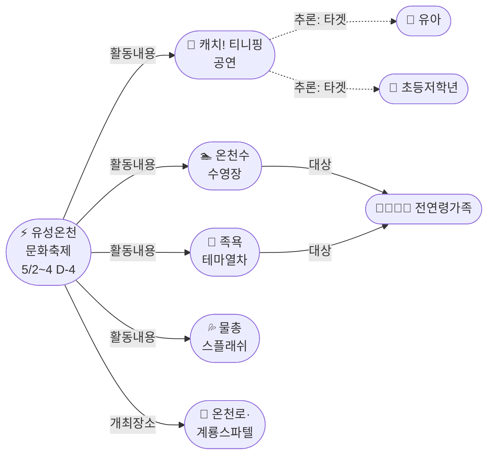
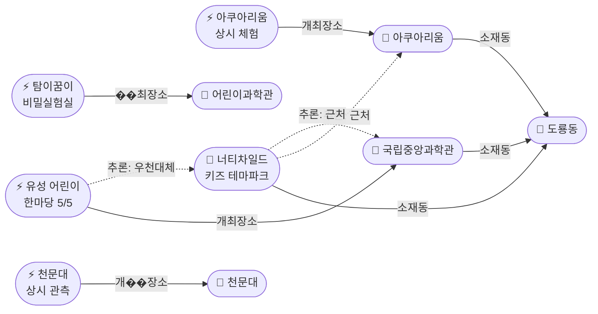
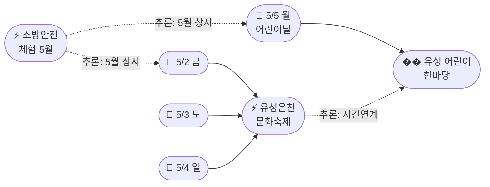

# 2026-04-28 대전 유성구 어린이·가족 이벤트 일일 보고서

## 요약

**유성온천문화축제(D-4) 세부 프로그램이 공개됐다.** 공식 사이트에서 **캐치! 티니핑 공연**(유아·초등 인기 IP), **유성호 족욕 테마열차**, **유성온천수 수영장**(매시간 45분 운영)을 포함한 핵심 프로그램이 확정 발표됐다. 티니핑 공연 확정으로 축제의 어린이 친화도가 0.7→0.8으로 상향됐다. 또한 도룡동 엑스포 권역에서 **너티차일드 프리미엄 키즈 테마파크**가 신규 발견되어 어린이날(5/5) 도룡동 실내 대체 루트가 보강됐다. 5/2~5 유성구 가족 골든위크까지 D-4.

## 용성로20 주변 (도보권 내)

### ring-stroll (1km 이내) — 전민동 클러스터 유지

| 시설 | 동 | 거리 | 유형 | 상태 |
|------|---|------|------|------|
| 아가랑도서관 | 전민동 | ~0.9km | 도서관 — 아가맘 행복교실 | 운영 중 (4/4~6/27) |
| 유성구 평생학습센터 전민센터 | 전민동 | ~0.8km | 공공기관 원데이클래스 | 운영 중 |
| 전민종합문화센터 | 전민동 | ~0.8km | 문화센터 | 기존 |

> 도보권 내 변동 없음. 전민동 3거점 클러스터 유지.

## 오늘의 추천 (가족 동반 Top 5)

| 순위 | 이벤트 | 장소 (동) | 대상 | 비용 | D-day |
|------|--------|----------|------|------|-------|
| 1 | **유성온천문화축제** **[프로그램 공개]** | 온천로 일원 (봉명동) | 전연령 가족 | 무료 | **D-4 (5/2~4)** |
| 2 | **유성 어린이 한마당** | 국립중앙과학관 (��룡동) | 유아~초등·가족 | 무료 | **D-7 (5/5)** |
| 3 | 아가·맘 행복교실 | 아가랑도서관 (전민동, 0.9km) | 영유아 | 무료 | 운영 ��� |
| 4 | 대전엑스포아쿠아리움 | 신세계 B1 (도룡동) | 전연령 가족 | 유료 | 상시 |
| 5 | 탐이 꿈이의 비밀 실험실 | 국립어린이과학관 (도룡동) | 초등 | 유료 | 4~6월 |

## 업데이트 항목

### 유성온천문화축제 — 세부 프로그램 공개! (D-4)
- **출처:** [유성온천문화축제 대표 프로그램](http://ysfesta.com/bbs/spafest.php?page_id=program1), [행사 일정](http://ysfesta.com/bbs/spafest.php?page_id=schedule), [행사 개요](http://ysfesta.com/bbs/spafest.php?page_id=overview)
- **이전 상태:** 4/27 일정 확정(5/2~4), 프로그램 상세 미공개
- **확정 프로그램:**

| 프로그램 | 유형 | 대상 | 어린이 친화도 |
|---------|------|------|-------------|
| **캐치! 티니핑 공연** | 공연 | **유아·초등저학년** | **0.95** |
| **유성온천수 물총 스플래쉬** | 체험 | 초등~성인 | 0.85 |
| **유성호 족욕 테마열차** | 체험 | 전연령 가족 | 0.8 |
| **유성온천수 수영장** (11시~20시, 매시간 45분) | 체험 | 전연령 가족 | 0.8 |
| 온천 거리퍼레이드 | 공연 | 전연령 | 0.7 |
| 힙합&댄스 공연 | 공연 | 전연령 | 0.6 |
| 헤어아트쇼 | 공연 | 성인 중심 | 0.3 |
| 7080 음악 공연 | 공연 | 성인 중심 | 0.3 |
| 생활체조·무용·뮤직&댄스 경연 | 경연 | 전연령 | 0.5 |

> **핵심 업데이트.** 캐치! 티니핑 공연이 확정되면서 유아·초등 가족의 방문 동기가 대폭 강화됐다. 족욕 열차와 온천수 수영장은 가족 전체가 함께 즐길 수 있는 체험형 프로그램. 물총 스플래쉬는 여벌 옷 준비 필요. **축제 전체 어린이 친화도: 0.7 → 0.8 상향.**

## 신규 오픈 가게·팝업·프로모션

### 너티차일드 프리미엄 키즈 테마파크 대전점 (도룡동) — 신규 발견
- **출처:** [너티차일드 대전점 공식](https://www.naughtychild.co.kr/daejeon)
- **장소:** 대전 유성구 엑스포로151번길 (도룡동)
- **Shop 정보:** 키즈카페 | 도룡동 | ~3,500m | 매일 10:30~20:30 | 프리미엄 대형 실내 테마파크 | **is_new: false**
- **Ring:** ring-car (3.5km)
- **어린이 동반:** 유아~초등 전용 대형 실내 놀이 시설. 엑스포 권역 과학관·아쿠아리움과 같은 동 내 도보 연계 가능.

> 도룡동 엑스포 권역에 키즈 전용 실내 시설이 추가됐다. 어린이날(5/5) 어린이 한마당(야외) 후 실내 놀이로 전환하거나, 우천 시 대체 방문지로 활용 가능. 아쿠아리움(신세계 B1)과 함께 도룡동 실내 연계 루트 형성.

### 기존 Shop 현황 (변동 없음)
- IKEA 팝업스토어 (현대프리미엄아울렛, 관평동) — 운영 중
- 신세계 Art&Science 대전 봄 팝업 (도룡동) — 운영 중
- 레포레스트 (덕명동, 신규 대형카페) — 운영 중

## 공공기관 주최 행사

> 금일 신규 공공기관 주최 행사 없음. 기존 추적 항목 유지.

| 기관 | 프로그램 | 장소 | 대상 | 비용 | 상태 |
|------|---------|------|------|------|------|
| 유성구 | 유성 어린이 한마당 | 국립중앙과학관 | 유아~초등·가족 | 무료 | D-7 (5/5) |
| 대전유성소방서 | 가정의 달 소방안전체험 | 유성구 일원 | 유아~초등·가족 | 무료 | 5월 확대 운영 |
| 유성구종합사회복지관 | 지역사회복지 프로그램 | 봉명동 | 전연령 | 프로그램별 | 운영 중 |
| 유성구통합도서관 | 지역작가 인 도서관 | 6개 도서관 | 전연령 | 무료 | 5월~ 시작 |
| 유성구통합도서관 | 세대별 독서문화·북스타트 | 7개 도서관 | 영유아~초등 | 무료 | 운영 중 |
| 유성구 아가랑도서관 | 아가맘 행복교실 | 전민동 | 영유아 | 무료 | 운영 중 (4/4~6/27) |
| 유성구 평생학습센터 | 원데이클래스 | 전민·구암 | 성인 중심 | 무료/저비용 | 운영 중 |
| 대전유성소방서 | 119시민체험센터·이동체험 | 유성구 | 전연령 | 무료 | 상시 운영 |

## 마감 임박 (사전신청 D-5 이내)

| 이벤트 | D-day | 일시 | 장소 | 비고 |
|--------|-------|------|------|------|
| **유성온천문화축제** | **D-4** | 5/2(금)~5/4(일) | 온천로 일원 | 사전신청 불필요, 현장 참여. **프로그램 공개 완료.** |
| **유성 어린이 한마당** | **D-7** | 5/5(월) | 국립중앙과학관 | 사전신청 불필요, 현장 참여 |

> 두 행사 연달아 개최. 골든위크 5일 연속 가족 행사 가능. 5/2~4 온천축제 → 5/5 어린이 한마당.

## 동심원별 묶음

### ring-stroll (1km 이내) — 전민동 클러스터 (변동 없음)
- 아가랑도서관 (전민동, ~0.9km) — 아가맘 행복교실 (4/4~6/27)
- 유성구 평생학습센터 전민센터 (전민동, ~0.8km) — 원데이클래스
- 전민종합문화센터 (전민동) — 미래산업 진로탐색 독서아카데미

### ring-bike (2km 이내) — 관평동 (변동 없음)
- 현대프리미엄아울렛 대전점 + IKEA 팝업 (관평동, ~2.5km)
- 관평도서관 (관평동)

### ring-car (5km 이내) — 도룡동 키즈카페 추가
- 유성 어린이 한마당 (5/5) + 국립중앙과학관 · 어린이과학관 · 천문대 · 아쿠아리움 (도룡동, ~3.5km)
- **너티차일드 키즈 테마파크 (도룡동, ~3.5km)** **[신규 Shop]**
- 유성온천문화축제 (5/2~4) — 온천로 일원 (봉명동, ~5km) **[프로그램 공개]**
- 유성구 평생학습센터 구암센터 · 유성구청소년수련관 (구암동, ~3km)
- 레포레스트 카페 (덕명동, ~4km)
- 대전광역시어린이회관 (노은동)
- 유성구종합사회복지관 (봉명동, ~4.5km)

## 동(洞)별 이벤트 묶음

### 도룡동 (1차 타겟) — 키즈카페 추가, 과학벨트 8시설

| 이벤트/시설 | 장소 | 상태 |
|------------|------|------|
| 유성 어린이 한마당 (5/5) | 국립중앙과학관 중앙광장 | D-7 |
| **너티차일드 키즈 테마파크** | 엑스포로151번길 | **신규 발견 — 실내 키즈카페** |
| 대전엑스포아쿠아리움 체험 | 신세계 Art&Science B1 | 상시 운영 |
| 탐이 꿈이의 비밀 실험실 | 국립어린이과학관 | 4~6월 |
| K-사이언스 어린이 교육 | 국립어린이과학관 | 운영 중 |
| 사이언스 패스 | 국립중앙과학관 | 4.21~ 상시 |
| 상시 관측 프로그램 | 대전시민천문대 | 상시 운영 |
| 신세계 Art&Science 봄 팝업 | 엑스포로 1 | Shop |

> 어린이날(5/5) 도룡동 추천 루트: **어린이 한마당(무료, 야외) → 아쿠아리움(유료, 실내) → 너티차일드(유료, 실내) → 천문대(무료, 야간)**. 우천 시: 아쿠아리움 → 너티차일드 → 어린이과학관(실내).

### 봉명동 (보조 타겟) — 축제 프로그램 공개

| 이벤트 | 장소 | 상태 |
|--------|------|------|
| **유성온천문화축제 (5/2~4)** | 온천로·계룡스파텔 광장 | **D-4, 프로그램 공개** |
| 유성구종합사회복지관 | 도안대로589번길 27 | 운영 중 |

### 전민동 (1차 타겟) — ring-stroll 클러스터 유지

| 이벤트 | 장소 | 상태 |
|--------|------|------|
| 아가·맘 행복교실 | 아가랑도서관 | 운영 중 (4/4~6/27) |
| 유성구 평생학습센터 원데이클래스 | 전민센터 | 운영 중 |
| 미래산업 진로탐색 독서아카데미 | 전민종합문화센터 | 운영 중 |

### 관평동 (1차 타겟)
| 이벤트 | 장소 |
|--------|------|
| IKEA 팝업스토어 | 현대프리미엄아울렛 1층 |
| 도서관 독서문화 프로그램 | 관평도서관 |

### 용산동·문지동·신성동 (1차 타겟)
금일 수집된 신규 이벤트 없음.

## 연령대별 묶음

### 영유아 (0~3세)
- 아가·맘 행복교실 (아가랑도서관, 전민동 ring-stroll) — 운영 중
- 북스타트 책놀이 (7개 도서관) — 운영 중

### 유아 (4~6세)
- **유성온천문화축제 캐치! 티니핑 공연 (5/2~4)** **[프로그램 확정]**
- 유성 어린이 한마당 (5/5) — 목공·과학 체험
- **너티차일드 키즈 테마파크 (도룡동)** **[신규]**
- 대전광역시어린이회관 체험 프로그램 (노은동)
- 유성소방서 안전체험 (이동체험·119시민체험센터)

### 초등저학년 (7~9세)
- **유성온천문화축제 물총 스플래쉬 + 티니핑 (5/2~4)** **[프로그램 확정]**
- 유성 어린이 한마당 (5/5) — 과학 실험·3D펜·목공 16종
- 탐이 꿈이의 비밀 실험실 (국립어린이과학관)
- K-사이언스 어린이 교육 프로그램
- **너티차일드 키즈 테마파크 (도룡동)** **[신규]**
- 유성소방서 안전체험

### 초등고학�� (10~12세)
- 유성 어린이 한마당 (5/5)
- 탐이 꿈이의 비밀 실험실
- 미래산업 진로탐색 독서아카데미 (관평·전민)
- 유성구청소년수련관 프로그램 (구암동)

### 전연령 가족
- **유성온천문화축제 (5/2~4)** **[프로그램 공개]** — 족욕 열차, 온천수 수영장, 퍼레이드
- 유성 어린이 한마당 (5/5)
- 대전엑스포아쿠아리움 체험 (도룡동)
- 대전시민천문대 상시 관측 (도룡동)
- 지역작가 인 도서관 (5월~)

## 시리즈/정기 프로그램 업데이트

| 프로그램 | 주최 | 유형 | 비고 |
|---------|------|------|------|
| **유성온천문화축제** | **축제추진위** | **연례** | **D-4, 세부 프로그램 공개 — 티니핑·족욕열차·수영장** |
| 유성 어린이 한마당 | 유성구 | 연례 | D-7 (5/5) |
| 가정의 달 소방안전체험 | 유성소방서 | 연례 | 5월 확대 운영 |
| 지역작가 인 도서관 | 유성구통합도서관 | 정기 | 5월~, 6개 도서관 |
| 아가맘 행복교실 | 아가랑도서관 | 정기 | 4/4~6/27, 영유아 전용 |
| 탐이꿈이 비밀실험실 | 국립어린이과학관 | 정기 | 4~6월 수목금토 |
| 천문대 관측 프로그램 | 대전시민천문대 | 상시 | 매일 14:00~22:00 |
| 어린이회관 체험 프로그램 | 대전광역시어린이회관 | 상시 | 예약제 |
| 아쿠아리움 체험 | 대전엑스포아쿠아리움 | 상시 | 예약 불필요 |
| 북스타트 책놀이 | 유성구통합도서관 | 정기 | 7개 도서관 |
| 원데이클래스 | 유성구 평생학습센터 | 수시 | 온라인 사전신청 |
| 이동안전체험교육 | 유성소방서 | 수시 | 학교 방문형 |
| 소방안전체험 | 119시민체험센터 | 상시 | 화~토, 예약제 |

## 지식그래프 시각화

### 오늘의 주요 관계

유성온천문화축제의 세부 프로그램이 공개되면서 **축제 → 하위 프로그램(Activity)** 관계가 새로 형성됐다. **캐치! 티니핑 공연**은 유아·초등저학년 핵심 IP로, 축제의 어린이 친화도를 크게 높였다. 도룡동에서는 **너티차일드 키즈 테마파크**가 신규 발견되어 어린이날 실내 대체 루트가 강화됐다.

### 유성온천문화축제 프로그램 구조 (D-4)

### 도룡동 어린이날 루트 (키즈카페 추가)

### 5월 골든위크 타임라인 (5/2~5)

## 온톨로지 변경

| 변경 유형 | 대상 | 근거 |
|----------|------|------|
| 새 엔티티 (Activity) | 3건 — 캐치! 티니핑 공연, 유성호 족욕 테마열차, 유성온천수 수영장 | 축제 공식 사이트 프로그램 공개 |
| 새 엔티티 (Shop) | 1건 — 너티차일드 프리미엄 키즈 테마파크 대전점 (도룡동) | 웹 검색 신규 발견 |
| 기존 엔티티 업데이트 | ent-evt-021 (유성온천문화축제) — kid_friendly_score 0.7→0.8, 프로그램 7종 추가 | 세부 프로그램 공개 |

## 추론 결과

| 추론 | 신뢰도 | 근거 |
|------|--------|------|
| 캐치! 티니핑 → 유아 타겟 | 0.90 | 유아·초등저학년 핵심 IP |
| 너티차일드 ↔ 아쿠아리움 근접 | 0.85 | 도룡동 엑스포 권역 동일 |
| 너티차일드 ↔ 국립중앙과학관 근접 | 0.80 | 도룡동 내 근접 |
| 유성온천문화축제 어린이 친화도 +0.1 | 0.85 | 티니핑+물총 프로그램 확정 |

## 분석 및 평가

**골든위크(5/2~5) 카운트다운 D-4.** 오늘의 핵심 발견은 유성온천문화축제의 **세부 프로그램 공개**다. 특히 **캐치! 티니핑 공연**은 유아·초등 가족에게 강력한 방문 동기를 제공한다. 이전까지 축제는 "전연령 축제이나 어린이 전용 프로그램 미확인" 상태였으나, 이제 명확한 어린이 타겟 프로그램이 확정됐다.

**연령별 추천 루트 구체화:**
- **유아 (4~6세):** 유성온천문화축제 티니핑 공연(5/2~4) → 어린이 한마당 목공체험(5/5)
- **초등저학년 (7~9세):** 온천축제 물총 스플래쉬(5/2~4) → 어린이 한마당 과학실험(5/5) → 너티차일드(5/5 오후)
- **전연령 가족:** 족욕 열차·온천수 수영장(5/2~4) → 어린이 한마당+아쿠아리움+천문대(5/5)

**3종 의무 커버 현황:**
- **(a) 이벤트:** 유성온천문화축제 프로그램 공개(update) + 전국 기사(new) = 충족
- **(b) Shop:** 너티차일드 키즈 테마파크(new) = 충족
- **(c) 공공기관:** 금일 신규 없음 — 기존 추적 항목(유성구·유성소방서·복지관·도서관) 유지

## 추적 항목

| 항목 | 최초 보고 | 상태 | 최신 업데이트 |
|------|----------|------|-------------|
| **유성온천문화축제** | 2026-04-25 | **D-4, 프로그램 공개** | **캐치! 티니핑, 족욕 열차, 온천수 수영장 확정** |
| **어린이날 특별행사** | 2026-04-25 | D-7 | 유성 어린이 한마당 5/5, 변동 없음 |
| K-사이언스 어린이 교육 | 2026-04-25 | 운영 중 | 탐이꿈이(4~6월) |
| 사이언스 패�� | 2026-04-25 | 출시 완료 | 적용 과학관 범위 확인 필요 |
| 대전광역시어린이회관 | 2026-04-25 | 상시 운영 | 어린이날 특별 프로그램 공지 대기 |
| 유아 문화예술교육지원 | 2026-04-25 | 운영 중 | 유성구 적용 현황 추적 필요 |
| 대전엑스포아쿠아리움 | 2026-04-26 | 상시 운영 | 어린이날 특별 프로그램 공지 대기 |
| IKEA 팝업스토어 | 2026-04-26 | 운영 중 | 종료일 미확인 |
| 아가·맘 행복교실 | 2026-04-26 | 운영 중 | 4/4~6/27, 전민동 ring-stroll |
| 유성소방서 안전체험 | 2026-04-26 | 5월 확대 | 가정의 달 소방안전체험의 장 |
| 북스타트 7개 도서관 | 2026-04-26 | 운영 중 | 5월 프로그램 사전신청 곧 시작 예상 |
| 지역작가 인 도서��� | 2026-04-27 | 5월~ 시작 예정 | 6개 도서관 |
| 유성구종합사회복지관 | 2026-04-27 | 운영 중 | 복지관 카테고리 등록 |
| **너티차일드 키즈 테마파크** | **2026-04-28** | **신규 발견** | **도룡동 엑스포 권역 키즈카페** |

## 동향 요약

| 분류 | 상태 | 비고 |
|------|------|------|
| 5월 가정의 달 | **D-4 카운트다운** | 온천축제(5/2~4) + 어린이 한마당(5/5) |
| 유성온천문화축제 | **프로그램 공개** | 캐치! 티니핑, 족욕 열차, 온천수 수영장, kid_friendly 0.7→0.8 |
| 어린이날 행사 | D-7 | 변동 없음 |
| 전민동 도보권 | 유지 (3거점) | 변동 없음 |
| 도룡동 과학벨트 | 키즈카페 추가 | 너티차일드 → 실내 대체 루트 보강, 시설 7→8 |
| Shop 카테고리 | 확대 (4→5건) | 너티차일드 (도룡동) 추가 |
| 공공기관 카테고리 | 금일 신규 없음 | 기존 추적 유지 |

## 출처 목록

1. [유성온천문화축제 대표 프로그램](http://ysfesta.com/bbs/spafest.php?page_id=program1) — 유성온천문화축제 공식, 2026
2. [유성온천문화축제 행사 일정](http://ysfesta.com/bbs/spafest.php?page_id=schedule) — 유성온천문화축제 공식, 2026
3. [유성온천문화축제 행사 개요](http://ysfesta.com/bbs/spafest.php?page_id=overview) — 유성온천문화축제 공식, 2026
4. [너티차일드 프리미엄 키즈 테마파크 대전점](https://www.naughtychild.co.kr/daejeon) — 너티차일드 공식, 2026
5. [Cities Nationwide Transform Into Kids' Playgrounds This May](https://en.sedaily.com/society/2026/04/26/cities-nationwide-transform-into-kids-playgrounds-this-may) — Seoul Economic Daily, 2026-04-26
6. [유성온천문화축제 — 유성구 문화관광](https://www.yuseong.go.kr/prog/trrsrt/TRSE_01/tour/sub04_01/view.do?trrsrtNo=7) — 유성구청, 2026
7. [유성온천문화축제 | 대한민국 구석구석](https://korean.visitkorea.or.kr/kfes/detail/fstvlDetail.do?fstvlCntntsId=2fcee4ea-7f88-4485-a67b-d4a88ee78320) — 한국관광공사, 2026
8. [유성구 어린이날 '유성 어린이 한마당' 개최](https://www.dtnews24.com/news/articleView.html?idxno=810991) — 디트NEWS24, 2026-04-27
9. [유성구, 어린이날 '어린이 한마당' 개최](https://www.ccdn.co.kr/news/articleView.html?idxno=1075693) — 충청매일, 2026-04-27
