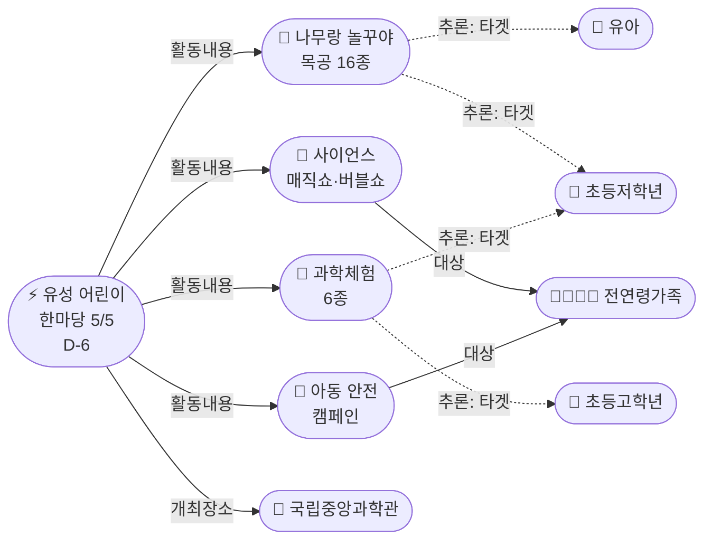
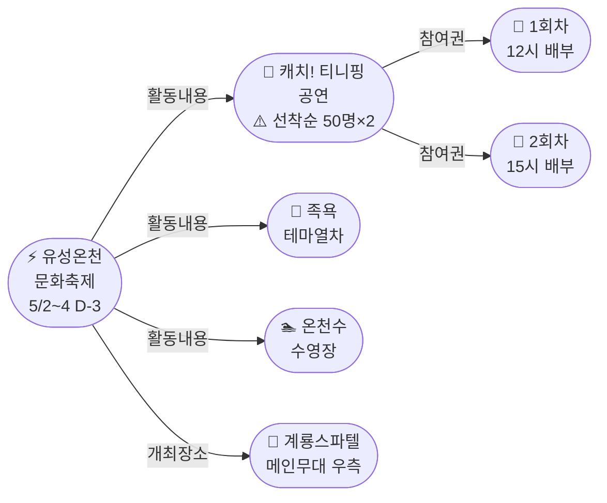
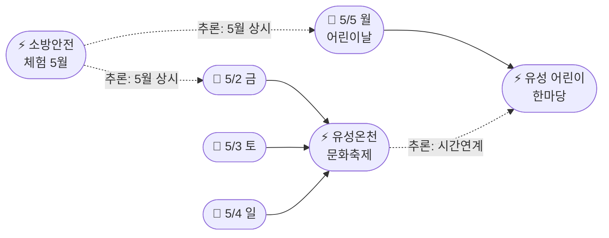

# 2026-04-29 대전 유성구 어린이·가족 이벤트 일일 보고서

## 요약

**골든위크 카운트다운 D-3.** 유성온천문화축제(5/2~4)의 핵심 어린이 프로그램 **캐치! 티니핑 공연 참여권이 선착순 50명×2회**로 확인됐다 — 1회차 12시, 2회차 15시 계룡스파텔 메인무대 우측에서 배부. 유아 가족은 **11시 현장 도착을 권장**한다. 어린이 한마당(D-6)도 프로그램 상세가 공개됐다: **나무랑 놀꾸야 목공체험 16종**, 사이언스 매직쇼·버블쇼, 과학 원리 체험 6종, 아동 안전 캠페인. 도서관에서는 **지역작가 인(人) 도서관** 5월 참여 작가(김석영·이보현·조예은)와 세션명이 공개됐다.

## 용성로20 주변 (도보권 내)

### ring-stroll (1km 이내) — 전민동 클러스터 유지

| 시설 | 동 | 거리 | 유형 | 상태 |
|------|---|------|------|------|
| 아가랑도서관 | 전민동 | ~0.9km | 도서관 — 아가맘 행복교실 | 운영 중 (4/4~6/27) |
| 유성구 평생학습센터 전민센터 | 전민동 | ~0.8km | 공공기관 원데이클래스 | 운영 중 |
| 전민종합문화센터 | 전민동 | ~0.8km | 문화센터 | 기존 |

> 도보권 내 변동 없음. 전민동 3거점 클러스터 유지.

## 오늘의 추천 (가족 동반 Top 5)

| 순위 | 이벤트 | 장소 (동) | 대상 | 비용 | D-day |
|------|--------|----------|------|------|-------|
| 1 | **유성온천문화축제** **[티니핑 참여권 선착순!]** | 온천로 일원 (봉명동) | 전연령 가족 | 무료 | **D-3 (5/2~4)** |
| 2 | **유성 어린이 한마당** **[프로그램 상세 공개]** | 국립중앙과학관 (도룡동) | 유아~초등·가족 | 무료 | **D-6 (5/5)** |
| 3 | 아가·맘 행복교실 | 아가랑도서관 (전민동, 0.9km) | 영유아 | 무료 | 운영 중 |
| 4 | 대전엑스포아쿠아리움 | 신세계 B1 (도룡동) | 전연령 가족 | 유료 | 상시 |
| 5 | 탐이 꿈이의 비밀 실험실 | 국립어린이과학관 (도룡동) | 초등 | 유료 | 4~6월 |

## 업데이트 항목

### 1. 유성온천문화축제 — 티니핑 참여권 선착순 배부 확인 (D-3)
- **출처:** [공연 프로그램 | 유성온천문화축제](http://ysfesta.com/bbs/spafest.php?page_id=program3)
- **이전 상태:** 4/28 프로그램 공개 — 티니핑 공연 확정, 운영 디테일 미공개
- **신규 정보:**

| 항목 | 내용 |
|------|------|
| **참여 방식** | 선착순 참여권 배부 |
| **1회차 배부** | **12:00** (공연 13:00 추정) |
| **2회차 배부** | **15:00** (공연 16:00 추정) |
| **배부 장소** | 계룡스파텔 메인무대 **우측** |
| **인원** | **회당 50명 한정** |
| **배부 시점** | 공연 **1시간 전** |

> **액션 아이템.** 티니핑 공연을 보려면 배부 시간 전 도착이 필수. 인기 유아 IP이므로 조기 소진 예상 → **1회차: 11시 현장 도착 권장.** 2회차는 축제 현장에서 체험(물총·족욕·수영장) 후 14시 대기.

### 2. 유성 어린이 한마당 — 프로그램 상세 공개 (D-6)
- **출처:** [유성구 어린이날 '유성 어린이 한마당' 개최](https://www.dtnews24.com/news/articleView.html?idxno=810991)
- **이전 상태:** 4/27 개최 사실만 보도 → 4/29 프로그램 상세 공개
- **확정 프로그램:**

| 프로그램 | 유형 | 대상 | 어린이 친화도 |
|---------|------|------|-------------|
| **나무랑 놀꾸야** — 16종 목공체험 (샤프·도마·자동차·독서대) | 체험 | 유아~초등 | **0.95** |
| **사이언스 매직쇼·버블쇼** (사이언스홀+돔통로) | 공연 | 전연령 | **0.9** |
| **과학 원리 체험 6종** (진공실험·배터리시계·망원경·3D펜·모루인형) | 체험 | **초등저학년~고학년** | **0.95** |
| **아동 안전·권리 캠페인** (지문등록·감염병예방·손씻기) | 교육 | 전연령 | 0.7 |
| **플레이존** (보드게임·민속놀이) | 놀이 | 전연령 가족 | 0.85 |

> 나무랑 놀꾸야(16종 목공)가 핵심 체험. 사이언스 매직쇼·버블쇼는 전 연령 관람 가능. 과학체험 6종은 초등저학년~고학년에 최적. 안전 캠페인의 아동 사전 지문등록은 부모에게 실용적.

## 신규 이벤트

### 지역작가 인(人) 도서관 — 5월 참여 작가·세션명 공개
- **출처:** [유성구, 지역작가와 함께하는 특별한 만남 '지역작가 인 도서관' 운영](https://pedien.com/html/view.php?idx=1014924)
- **장소:** 유성구 6개 공공도서관 (관평·노은·진잠·전민 등)
- **기간:** 5월~
- **비용:** 무료
- **프로그램 형태:** 강연 · 북토크 · 창작 · 북큐레이션
- **참여 작가 및 세션:**

| 작가 | 세션명 |
|------|--------|
| 김석영 시인 | 김석영 시인과 시작하는 오후 |
| 이보현 작가 | 일상에서 영감찾기 / 글쓰기부터 출판까지 |
| 조예은 작가 | 독립서점 지기와 함께 읽고 쓰며 내 삶의 우선순위 알아가기 |

> 성인 중심 프로그램이나 가족 단위 참여 가능. 도서관별 일정은 유성구통합도서관 홈페이지에서 확인 필요. kid_friendly_score: 0.4 (성인 대상이지만 초등고학년 참여 가능성 있음).

## 신규 오픈 가게·팝업·프로모션

> 금일 신규 가게·팝업·프로모션 발견 없음. 기존 목록 유지.

### 기존 Shop 현황 (변동 없음)

| 가게 | 유형 | 동 | 거리 | 상태 |
|------|------|---|------|------|
| 너티차일드 키즈 테마파크 | 키즈카페 | 도룡동 | ~3.5km | 운영 중 |
| IKEA 팝업스토어 | 팝업 | 관평동 | ~2.5km | 운영 중 |
| 신세계 Art&Science 봄 팝업 | 백화점 | 도룡동 | ~3.5km | 운영 중 |
| 현대프리미엄아울렛 | 아울렛 | 관평동 | ~2.5km | 운영 중 |
| 레포레스트 | 대형카페 | 덕명동 | ~4km | 운영 중 |

## 공공기관 주최 행사 (행정복지센터·보건소·복지관·도서관·우체국·경찰서·소방서)

> 금일 신규 공공기관 주최 행사 없음. 기존 추적 항목 유지.

| 기관 | 프로그램 | 장소 | 대상 | 비용 | 상태 |
|------|---------|------|------|------|------|
| 유성구 | **유성 어린이 한마당** | 국립중앙과학관 | 유아~초등·가족 | 무료 | **D-6 (5/5), 프로그램 공개** |
| 유성온천문화축제추진위 | **유성온천문화축제** | 온천로 일원 | 전연령 | 무료 | **D-3 (5/2~4), 참여권 정보 공개** |
| 대전유성소방서 | 가정의 달 소방안전체험 | 유성구 일원 | 유아~초등·가족 | 무료 | 5월 확대 운영 |
| 유성구종합사회복지관 | 지역사회복지 프로그램 | 봉명동 | 전연령 | 프로그램별 | 운영 중 |
| 유성구통합도서관 | **지역작가 인 도서관** | 6개 도서관 | 전연령 | 무료 | **5월~, 작가 공개** |
| 유성구통합도서관 | 세대별 독서문화·북스타트 | 7개 도서관 | 영유아~초등 | 무료 | 운영 중 |
| 유성구 아가랑도서관 | 아가맘 행복교실 | 전민동 | 영유아 | 무료 | 운영 중 (4/4~6/27) |
| 유성구 평생학습센터 | 원데이클래스 | 전민·구암 | 성인 중심 | 무료/저비용 | 운영 중 |
| 대전유성소방서 | 119시민체험센터·이동체험 | 유성구 | 전연령 | 무료 | 상시 운영 |

## 마감 임박 (사전신청 D-3 이내)

| 이벤트 | D-day | 일시 | 장소 | 비고 |
|--------|-------|------|------|------|
| **유성온천문화축제** | **D-3** | 5/2(금)~5/4(일) | 온천로 일원 | 사전신청 불필요, **티니핑 참여권 선착순 50명×2회** |

> 유성온천문화축제가 D-3으로 진입. 사전신청 없이 현장 참여이나, **티니핑 공연은 선착순 참여권(50명)이 조기 소진될 수 있으므로 조기 도착 필수.**

## 동심원별 묶음

### ring-stroll (1km 이내) — 전민동 클러스터 (변동 없음)
- 아가랑도서관 (전민동, ~0.9km) — 아가맘 행복교실 (4/4~6/27)
- 유성구 평생학습센터 전민센터 (전민동, ~0.8km) — 원데이클래스
- 전민종합문화센터 (전민동) — 미래산업 진로탐색 독서아카데미

### ring-bike (2km 이내) — 관평동 (변동 없음)
- 현대프리미엄아울렛 대전점 + IKEA 팝업 (관평동, ~2.5km)
- 관평도서관 (관평동)

### ring-car (5km 이내)
- **유성온천문화축제 (D-3, 5/2~4)** — 온천로 일원 (봉명동, ~5km) **[티니핑 참여권 정보 공개]**
- 유성 어린이 한마당 (D-6, 5/5) + 국립중앙과학관 · 어린이과학관 · 천문대 · 아쿠아리움 (도룡동, ~3.5km) **[프로그램 상세 공개]**
- 너티차일드 키즈 테마파크 (도룡동, ~3.5km)
- 유성구 평생학습센터 구암센터 · 유성구청소년수련관 (구암동, ~3km)
- 레포레스트 카페 (덕명동, ~4km)
- 대전광역시어린이회관 (노은동)
- 유성구종합사회복지관 (봉명동, ~4.5km)

## 동(洞)별 이벤트 묶음

### 도룡동 (1차 타겟) — 어린이 한마당 프로그램 공개, 과학벨트 8시설

| 이벤트/시설 | 장소 | 상태 |
|------------|------|------|
| **유성 어린이 한마당 (5/5)** | 국립중앙과학관 중앙광장 | **D-6, 프로그램 상세 공개** |
| 너티차일드 키즈 테마파크 | 엑스포로151번길 | 운영 중 — 실내 키즈카페 |
| 대전엑스포아쿠아리움 체험 | 신세계 Art&Science B1 | 상시 운영 |
| 탐이 꿈이의 비밀 실험실 | 국립어린이과학관 | 4~6월 |
| K-사이언스 어린이 교육 | 국립어린이과학관 | 운영 중 |
| 사이언스 패스 | 국립중앙과학관 | 4.21~ 상시 |
| 상시 관측 프로그램 | 대전시민천문대 | 상시 운영 |
| 신세계 Art&Science 봄 팝업 | 엑스포로 1 | Shop |

> 어린이날(5/5) 도룡동 추천 루트: **어린이 한마당(무료, 야외) — 나무랑 놀꾸야 + 매직쇼 + 과학체험 → 아쿠아리움(유료, 실내) → 너티차일드(유료, 실내) → 천문대(무료, 야간)**

### 봉명동 (보조 타겟) — 온천축제 D-3

| 이벤트 | 장소 | 상태 |
|--------|------|------|
| **유성온천문화축제 (5/2~4)** | 온천로·계룡스파텔 광장 | **D-3, 티니핑 참여권 정보 공개** |
| 유성구종합사회복지관 | 도안대로589번길 27 | 운영 중 |

### 전민동 (1차 타겟) — ring-stroll 클러스터 유지

| 이벤트 | 장소 | 상태 |
|--------|------|------|
| 아가·맘 행복교실 | 아가랑도서관 | 운영 중 (4/4~6/27) |
| 유성구 평생학습센터 원데이클래스 | 전민센터 | 운영 중 |
| 미래산업 진로탐색 독서아카데미 | 전민종합문화센터 | 운영 중 |

### 관평동 (1차 타겟)
| 이벤트 | 장소 |
|--------|------|
| IKEA 팝업스토어 | 현대프리미엄아울렛 1층 |
| 도서관 독서문화 프로그램 | 관평도서관 |

### 용산동·문지동·신성동 (1차 타겟)
금일 수집된 신규 이벤트 없음.

## 연령대별 묶음

### 영유아 (0~3세)
- 아가·맘 행복교실 (아가랑도서관, 전민동 ring-stroll) — 운영 중
- 북스타트 책놀이 (7개 도서관) — 운영 중

### 유아 (4~6세)
- **유성온천문화축제 캐치! 티니핑 공연 (5/2~4)** — **선착순 50명×2회!** [D-3]
- **유성 어린이 한마당 (5/5)** — 나무랑 놀꾸야 목공 + 매직버블쇼 [D-6, 프로그램 공개]
- 너티차일드 키즈 테마파크 (도룡동)
- 대전광역시어린이회관 체험 프로그램 (노은동)
- 유성소방서 안전체험 (이동체험·119시민체험센터)

### 초등저학년 (7~9세)
- **유성 어린이 한마당 (5/5)** — 과학 원리 체험 6종 + 나무랑 놀꾸야 [프로그램 공개]
- **유성온천문화축제 물총 스플래쉬 + 티니핑 (5/2~4)** [D-3]
- 탐이 꿈이의 비밀 실험실 (국립어린이과학관)
- K-사이언스 어린이 교육 프로그램
- 너티차일드 키즈 테마파크 (도룡동)
- 유성소방서 안전체험

### 초등고학년 (10~12세)
- **유성 어린이 한마당 (5/5)** — 3D펜 체험 + 밀가루 배터리 시계 [프로그램 공개]
- 탐이 꿈이의 비밀 실험실
- 미래산업 진로탐색 독서아카데미 (관평·전민)
- 유성구청소년수련관 프로그램 (구암동)

### 전연령 가족
- **유성온천문화축제 (5/2~4)** [D-3] — 족욕 열차, 온천수 수영장, 퍼레이드, **티니핑(선착순)**
- **유성 어린이 한마당 (5/5)** [D-6] — 나무랑 놀꾸야 + 매직쇼 + 플레이존
- 대전엑스포아쿠아리움 체험 (도룡동)
- 대전시민천문대 상시 관측 (도룡동)
- **지역작가 인 도서관 (5월~)** — 김석영·이보현·조예은 작가 [프로그램 공개]

## 시리즈/정기 프로그램 업데이트

| 프로그램 | 주최 | 유형 | 비고 |
|---------|------|------|------|
| **유성온천문화축제** | **축제추진위** | **연례** | **D-3, 티니핑 참여권 선착순 50명×2회 확인** |
| **유성 어린이 한마당** | **유성구** | **연례** | **D-6 (5/5), 프로그램 4개 카테고리 상세 공개** |
| **지역작가 인 도서관** | **유성구통합도서관** | **정기** | **5월~, 참여 작가 3명·세션명 공개** |
| 가정의 달 소방안전체험 | 유성소방서 | 연례 | 5월 확대 운영 |
| 아가맘 행복교실 | 아가랑도서관 | 정기 | 4/4~6/27, 영유아 전용 |
| 탐이꿈이 비밀실험실 | 국립어린이과학관 | 정기 | 4~6월 수목금토 |
| 천문대 관측 프로그램 | 대전시민천문대 | 상시 | 매일 14:00~22:00 |
| 어린이회관 체험 프로그램 | 대전광역시어린이회관 | 상시 | 예약제 |
| 아쿠아리움 체험 | 대전엑스포아쿠아리움 | 상시 | 예약 불필요 |
| 북스타트 책놀이 | 유성구통합도서관 | 정기 | 7개 도서관 |
| 원데이클래스 | 유성구 평생학습센터 | 수시 | 온라인 사전신청 |
| 이동안전체험교육 | 유성소방서 | 수시 | 학교 방문형 |
| 소방안전체험 | 119시민체험센터 | 상시 | 화~토, 예약제 |

## 지식그래프 시각화

### 오늘의 주요 관계

유성 어린이 한마당(D-6)의 **프로그램 구조가 처음 구체화**됐다 — 목공·공연·과학·안전 4개 카테고리의 하위 Activity가 KG에 추가됐다. 유성온천문화축제(D-3)에서는 **티니핑 참여권 배부 정보**가 확인되면서, 선착순 운영이라는 핵심 제약이 KG에 기록됐다. 골든위크 5일 연속 행사 루트(5/2~4 온천축제 → 5/5 어린이 한마당)가 확정 상태.

### 유성 어린이 한마당 프로그램 구조 (D-6)

### 유성온천문화축제 티니핑 참여권 정보 (D-3)

### 5월 골든위크 타임라인 (D-3 → D-6)

## 온톨로지 변경

| 변경 유형 | 대상 | 근거 |
|----------|------|------|
| 새 엔티티 (Activity) | 4건 — 나무랑 놀꾸야 목공체험, 사이언스 매직쇼·버블쇼, 과학 원리 체험 6종, 아동 안전·권리 캠페인 | 어린이 한마당 프로그램 상세 공개 |
| 기존 엔티티 업데이트 | ent-act-001 (캐치! 티니핑 공연) — 참여권 배부 디테일 추가 | 유성온천문화축제 공식 사이트 공연 프로그램 페이지 |
| 기존 엔티티 업데이트 | ent-evt-023 (지역작가 인 도서관) — 참여 작가 3명·세션명 공개 | 페디엔 보도 |

## 추론 결과

| 추론 | 신뢰도 | 근거 |
|------|--------|------|
| 나무랑 놀꾸야 → 유아·초등저학년 타겟 | 0.85~0.90 | 16종 목공체험(도마·자동차) 연령 적합도 |
| 과학체험 6종 → 초등저학년·고학년 | 0.90~0.95 | 밀가루 배터리 시계·3D펜 = 초등 교과 연계 |
| 티니핑 참여권 조기 소진 예상 | 0.80 | 인기 유아 IP + 선착순 50명 한정 |
| 어린이 한마당 kid_friendly 0.95 확정 | 0.85 | 4개 카테고리 프로그램 구체화 |
| 골든위크 5일 연속 가족 행사 루트 | 0.85 | 5/2~4 축제 → 5/5 한마당 시간 연계 |

## 분석 및 평가

**골든위크 카운트다운 D-3.** 오늘의 핵심 발견은 두 가지다:

1. **유성온천문화축제 티니핑 참여권 운영 방식 확인** — 선착순 50명×2회는 인기 유아 IP 대비 매우 적은 수량이다. 공연 1시간 전 배부(12시/15시)이므로, **1회차는 11시 현장 도착, 2회차는 14시 대기가 필요하다.** 이 정보는 유아 가족의 축제 방문 시간 계획에 직접 영향을 미친다.

2. **어린이 한마당 프로그램 구체화** — 이전까지 '과학·체험 복합 축제' 수준의 정보만 있었으나, 이제 4개 카테고리(목공 16종/매직쇼/과학체험 6종/안전캠페인)의 구체적 프로그램이 확인됐다. 연령별 추천이 가능해졌다:
   - **유아:** 나무랑 놀꾸야(간단한 목공) + 매직버블쇼
   - **초등저학년:** 과학 원리 체험(밀가루 배터리·진공실험) + 목공 16종
   - **초등고학년:** 3D펜 + 밀가루 배터리 시계 + 무지개 망원경

**3종 의무 커버 현황:**
- **(a) 이벤트:** 온천축제 티니핑 참여권(update) + 어린이 한마당 프로그램 상세(update) + 지역작가 인 도서관 작가 공개(new) = **충족**
- **(b) Shop:** 금일 신규 없음 — 기존 5건 유지
- **(c) 공공기관:** 금일 신규 없음 — 기존 추적(소방서·복지관·도서관·보건소·행정복지센터) 유지

## 추적 항목

| 항목 | 최초 보고 | 상태 | 최신 업데이트 |
|------|----------|------|-------------|
| **유성온천문화축제** | 2026-04-25 | **D-3, 참여권 정보 공개** | **티니핑 선착순 50명×2회, 12시/15시 배부, 메인무대 우측** |
| **어린이날 특별행사** | 2026-04-25 | **D-6, 프로그램 상세 공개** | **나무랑 놀꾸야 16종 + 매직쇼 + 과학체험 6종 + 안전캠페인** |
| **지역작가 인 도서관** | 2026-04-27 | **프로그램 공개** | **김석영·이보현·조예은 작가 참여, 세션명 공개** |
| K-사이언스 어린이 교육 | 2026-04-25 | 운영 중 | 탐이꿈이(4~6월) |
| 사이언스 패스 | 2026-04-25 | 출시 완료 | 적용 과학관 범위 확인 필요 |
| 대전광역시어린이회관 | 2026-04-25 | 상시 운영 | 어린이날 특별 프로그램 공지 대기 |
| 유아 문화예술교육지원 | 2026-04-25 | 운영 중 | 유성구 적용 현황 추적 필요 |
| 대전엑스포아쿠아리움 | 2026-04-26 | 상시 운영 | 어린이날 특별 프로그램 공지 대기 |
| IKEA 팝업스토어 | 2026-04-26 | 운영 중 | 종료일 미확인 |
| 아가·맘 행복교실 | 2026-04-26 | 운영 중 | 4/4~6/27, 전민동 ring-stroll |
| 유성소방서 안전체험 | 2026-04-26 | 5월 확대 | 가정의 달 소방안전체험의 장 |
| 북스타트 7개 도서관 | 2026-04-26 | 운영 중 | 5월 프로그램 사전신청 곧 시작 예상 |
| 유성구종합사회복지관 | 2026-04-27 | 운영 중 | 복지관 카테고리 등록 |
| 너티차일드 키즈 테마파크 | 2026-04-28 | 운영 중 | 도룡동 엑스포 권역 키즈카페 |

## 동향 요약

| 분류 | 상태 | 비고 |
|------|------|------|
| 5월 가정의 달 | **D-3 카운트다운** | 온천축제(5/2~4) + 어린이 한마당(5/5) |
| 유성온천문화축제 | **D-3, 참여권 공개** | 티니핑 선착순 50명×2회 — 조기 소진 예상 |
| 유성 어린이 한마당 | **D-6, 프로그램 공개** | 나무랑 놀꾸야 16종 + 매직쇼 + 과학체험 + 안전캠페인 |
| 지역작가 인 도서관 | **작가·세션 공개** | 김석영·이보현·조예은, 5월~ 6개 도서관 |
| 전민동 도보권 | 유지 (3거점) | 변동 없음 |
| 도룡동 과학벨트 | 유지 (8시설) | 어린이 한마당 프로그램 구체화 |
| Shop 카테고리 | 유지 (5건) | 금일 신규 없음 |
| 공공기관 카테고리 | 유지 | 금일 신규 없음 |

## 출처 목록

1. [공연 프로그램 | 유성온천문화축제](http://ysfesta.com/bbs/spafest.php?page_id=program3) — 유성온천문화축제 공식, 2026
2. [대전 유성구 어린이날 '유성 어린이 한마당' 개최](https://www.dtnews24.com/news/articleView.html?idxno=810991) — 디트NEWS24, 2026-04-27
3. [유성구, 지역작가와 함께하는 특별한 만남 '지역작가 인 도서관' 운영](https://pedien.com/html/view.php?idx=1014924) — 페디엔, 2026
4. [대전 '어린이날 행사' 풍성](https://www.dailycc.net/news/articleView.html?idxno=742937) — 충청투데이, 2026
5. [유성구, 지역작가와의 만남 '지역작가 인(人) 도서관'](https://www.kspnews.com/2595126) — KSP뉴스, 2026
6. [대전 유성구, 어린이날 '어린이 한마당' 개최…과학·체험 축제](https://www.ccdn.co.kr/news/articleView.html?idxno=1075693) — 충청매일, 2026-04-27
7. [유성온천문화축제 대표 프로그램](http://ysfesta.com/bbs/spafest.php?page_id=program1) — 유성온천문화축제 공식, 2026
8. [유성온천문화축제 행사 일정](http://ysfesta.com/bbs/spafest.php?page_id=schedule) — 유성온천문화축제 공식, 2026
9. [유성온천문화축제 — 유성구 문화관광](https://www.yuseong.go.kr/prog/trrsrt/TRSE_01/tour/sub04_01/view.do?trrsrtNo=7) — 유성구청, 2026
