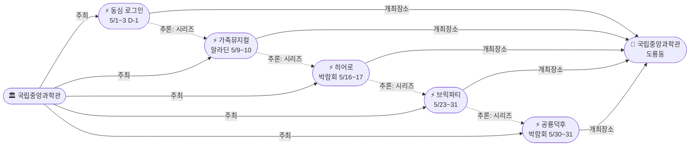
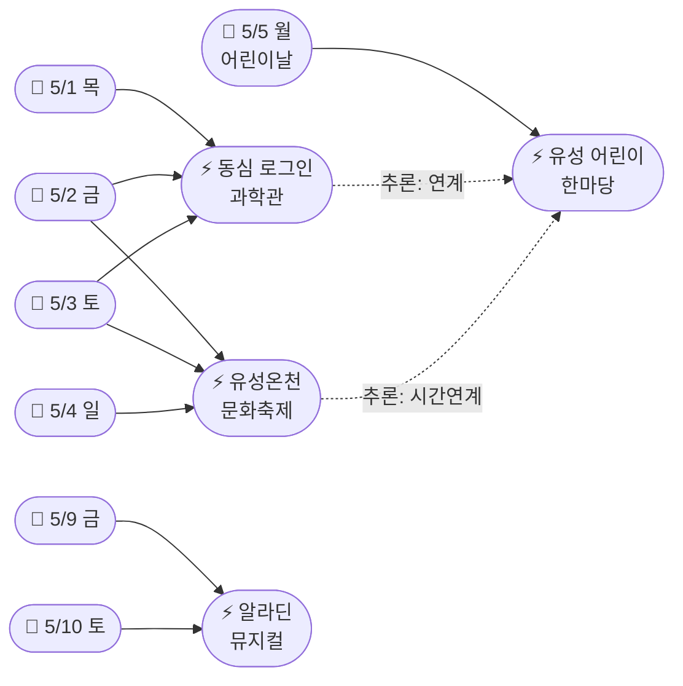
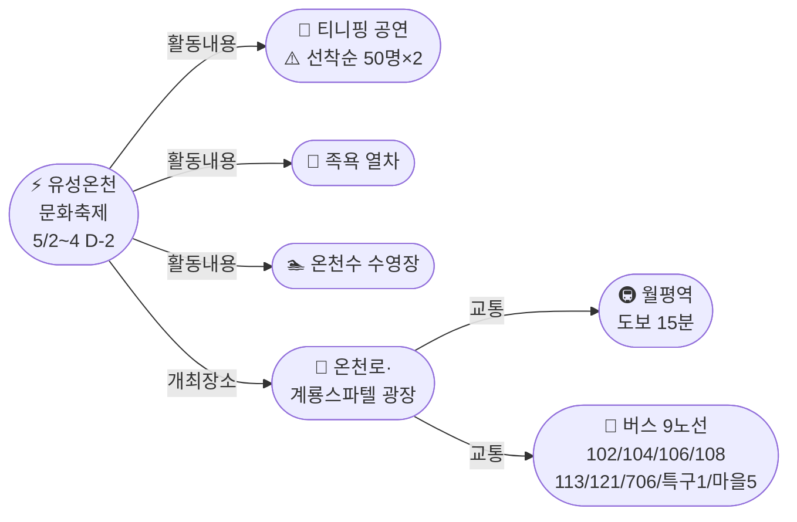

# 2026-04-30 대전 유성구 어린이·가족 이벤트 일일 보고서

## 요약

**국립중앙과학관이 5월 가정의 달 행사 캘린더를 공개했다.** 골든위크 시작일인 5/1부터 '갓생 일시정지, 동심 로그인'(5/1~3)을 개최하고, 이어서 가족뮤지컬 알라딘(5/9~10), 초능력 히어로 박람회(5/16~17), 사이언스 브릭파티(5/23~31), 공룡덕후박람회(5/30~31)까지 **5월 매주 가족 행사가 이어진다.** 이로써 골든위크 타임라인이 **5/1 동심 로그인 → 5/2~4 온천축제 → 5/5 어린이 한마당 → 5/9~10 알라딘**으로 확장됐다. 유성온천문화축제는 D-2로 진입했으며, 대중교통 안내(월평역 도보 15분, 버스 9개 노선)가 확인됐다.

## 용성로20 주변 (도보권 내)

### ring-stroll (1km 이내) — 전민동 클러스터 유지

| 시설 | 동 | 거리 | 유형 | 상태 |
|------|---|------|------|------|
| 아가랑도서관 | 전민동 | ~0.9km | 도서관 — 아가맘 행복교실 | 운영 중 (4/4~6/27) |
| 유성구 평생학습센터 전민센터 | 전민동 | ~0.8km | 공공기관 원데이클래스 | 운영 중 |
| 전민종합문화센터 | 전민동 | ~0.8km | 문화센터 | 기존 |

> 도보권 내 변동 없음. 전민동 3거점 클러스터 유지.

## 오늘의 추천 (가족 동반 Top 5)

| 순위 | 이벤트 | 장소 (동) | 대상 | 비용 | D-day |
|------|--------|----------|------|------|-------|
| 1 | **유성온천문화축제** **[D-2, 교통 안내]** | 온천로 일원 (봉명동) | 전연령 가족 | 무료 | **D-2 (5/2~4)** |
| 2 | **유성 어린이 한마당** | 국립중앙과학관 (도룡동) | 유아~초등·가족 | 무료 | **D-5 (5/5)** |
| 3 | **갓생 일시정지, 동심 로그인** **[NEW]** | 국립중앙과학관 (도룡동) | 전연령 가족 | 미확인 | **D-1 (5/1~3)** |
| 4 | 아가·맘 행복교실 | 아가랑도서관 (전민동, 0.9km) | 영유아 | 무료 | 운영 중 |
| 5 | 탐이 꿈이의 비밀 실험실 | 국립어린이과학관 (도룡동) | 초등 | 유료 | 4~6월 |

## 신규 이벤트

### 국립중앙과학관 5월 가정의 달 행사 캘린더 공개 (5건)
- **출처:** [국립중앙과학관 행사안내](https://www.science.go.kr/mps/1070/bbs/431/moveBbsNttList.do)
- **장소:** 국립중앙과학관 (도룡동, ~3.5km, ring-car)
- **주최:** 국립중앙과학관

| 행사명 | 일시 | 장소 (관내) | 어린이 친화도 | 대상 연령 |
|--------|------|-----------|-------------|----------|
| **갓생 일시정지, 동심 로그인** | **5/1(목)~3(토)** | 천체관·세미나실·꿈이 광장 | **0.9** | 전연령 가족 |
| **가족뮤지컬 알라딘** | **5/9(금)~10(토)** | 사이언스홀 | **0.95** | 유아·초등·가족 |
| **초능력 히어로 박람회** | **5/16(토)~17(일)** | 사이언스터널 | **0.9** | 초등저학년·고학년 |
| **사이언스 브릭파티** | **5/23(금)~31(토)** | 한국과학기술사관·세미나실 | **0.9** | 유아·초등 전연령 |
| **공룡덕후박람회** | **5/30(토)~31(일)** | 사이언스터널·꿈이광장 | **0.9** | 유아·초등·가족 |

> **핵심 발견.** 도룡동 국립중앙과학관이 5월 한 달을 **가정의 달 특별 시즌**으로 운영한다. 매주 1~2건의 가족 행사가 연속 배치돼 있어, 5월 어느 주말에 방문해도 행사에 참여할 수 있다. 특히 **5/1~3 '동심 로그인'은 내일(5/1) 시작**으로, 골든위크 첫 행사가 된다. 입장료·사전신청 등 상세 정보는 추후 공개 예상 — 과학관 홈페이지 확인 필요.

## 업데이트 항목

### 1. 유성온천문화축제 D-2 — 대중교통 안내 확인
- **출처:** [유성온천문화축제 > 유성구 문화관광](https://www.yuseong.go.kr/prog/trrsrt/TRSE_01/tour/sub04_01/view.do?trrsrtNo=7)
- **이전 상태:** D-3(4/29) — 티니핑 참여권 선착순 50명×2회, 12시/15시 배부 정보 공개
- **신규 정보:**

| 항목 | 내용 |
|------|------|
| **지하철** | **월평역** (도보 약 15분) |
| **시내버스** | **102, 104, 106, 108, 113, 121, 706, 특구1, 마을5** |
| **축제장 구역** | 온천로, 계룡스파텔 잔디광장, 갑천변, 유림공원 일원 |
| **문의** | 042-611-2080 |

> **액션 아이템.** 축제 당일 온천로 일대 교통 통제 예상 — **대중교통(월평역 또는 버스) 이용 권장.** 유아 동반 가족은 유모차 접근성이 좋은 계룡스파텔 광장 진입이 유리하다. 티니핑 참여권(선착순 50명, 12시 배부) 리마인드: **1회차 관람은 11시 현장 도착 필수.**

### 2. 유성 어린이 한마당 D-5 (5/5)
- **출처:** [유성구 어린이날 '유성 어린이 한마당' 개최](https://www.dtnews24.com/news/articleView.html?idxno=810991)
- **이전 상태:** D-6(4/29) — 프로그램 4개 카테고리 상세 공개
- **금일 변동:** 프로그램 변동 없음. 국립중앙과학관 5월 일정 공개로 어린이 한마당 전후 맥락 확장:
  - 5/1~3: 동심 로그인 (과학관 자체 행사)
  - **5/5: 유성 어린이 한마당** (과학관 광장)
  - 5/9~10: 알라딘 뮤지컬 (과학관 사이언스홀)

## 신규 오픈 가게·팝업·프로모션

> 금일 신규 가게·팝업·프로모션 발견 없음. 기존 목록 유지.

### 기존 Shop 현황 (변동 없음)

| 가게 | 유형 | 동 | 거리 | 상태 |
|------|------|---|------|------|
| 너티차일드 키즈 테마파크 | 키즈카페 | 도룡동 | ~3.5km | 운영 중 |
| IKEA 팝업스토어 | 팝업 | 관평동 | ~2.5km | 운영 중 |
| 신세계 Art&Science 봄 팝업 | 백화점 | 도룡동 | ~3.5km | 운영 중 |
| 현대프리미엄아울렛 | 아울렛 | 관평동 | ~2.5km | 운영 중 |
| 레포레스트 | 대형카페 | 덕명동 | ~4km | 운영 중 |

## 공공기관 주최 행사 (행정복지센터·보건소·복지관·도서관·우체국·경찰서·소방서)

### 신규: 국립중앙과학관 5월 행사 5건
국립중앙과학관(국립기관, publicTrustBoost +0.15 적용)이 5월 가정의 달 행사 일정을 공개했다. 상세는 "신규 이벤트" 섹션 참조.

| 기관 | 프로그램 | 장소 | 대상 | 비용 | 상태 |
|------|---------|------|------|------|------|
| **국립중앙과학관** | **갓생 일시정지, 동심 로그인** | 과학관 전관 | 전연령 가족 | 미확인 | **D-1 (5/1~3) [NEW]** |
| **국립중앙과학관** | **가족뮤지컬 알라딘** | 사이언스홀 | 유아~초등·가족 | 미확인 | **5/9~10 [NEW]** |
| **국립중앙과학관** | **초능력 히어로 박람회** | 사이언스터널 | 초등 | 미확인 | **5/16~17 [NEW]** |
| **국립중앙과학관** | **사이언스 브릭파티** | 한국과학기술사관 | 유아~초등 | 미확인 | **5/23~31 [NEW]** |
| **국립중앙과학관** | **공룡덕후박람회** | 사이언스터널·꿈이광장 | 유아~초등·가족 | 미확인 | **5/30~31 [NEW]** |
| 유성구 | **유성 어린이 한마당** | 국립중앙과학관 | 유아~초등·가족 | 무료 | D-5 (5/5) |
| 유성온천문화축제추진위 | **유성온천문화축제** | 온천로 일원 | 전연령 | 무료 | **D-2 (5/2~4), 교통 안내 공개** |
| 대전유성소방서 | 가정의 달 소방안전체험 | 유성구 일원 | 유아~초등·가족 | 무료 | 5월 확대 운영 |
| 유성구종합사회복지관 | 지역사회복지 프로그램 | 봉명동 | 전연령 | 프로그램별 | 운영 중 |
| 유성구통합도서관 | **지역작가 인 도서관** | 6개 도서관 | 전연령 | 무료 | 5월~ |
| 유성구통합도서관 | 세대별 독서문화·북스타트 | 7개 도서관 | 영유아~초등 | 무료 | 운영 중 |
| 유성구 아가랑도서관 | 아가맘 행복교실 | 전민동 | 영유아 | 무료 | 운영 중 (4/4~6/27) |
| 유성구 평생학습센터 | 원데이클래스 | 전민·구암 | 성인 중심 | 무료/저비용 | 운영 중 |
| 대전유성소방서 | 119시민체험센터·이동체험 | 유성구 | 전연령 | 무료 | 상시 운영 |

## 마감 임박 (사전신청 D-3 이내)

| 이벤트 | D-day | 일시 | 장소 | 비고 |
|--------|-------|------|------|------|
| **갓생 일시정지, 동심 로그인** | **D-1** | 5/1(목)~3(토) | 국립중앙과학관 전관 | 사전신청 여부 미확인 — 과학관 홈페이지 확인 필요 |
| **유성온천문화축제** | **D-2** | 5/2(금)~5/4(일) | 온천로 일원 | 사전신청 불필요. **티니핑 참여권 선착순 50명×2회** |

## 동심원별 묶음

### ring-stroll (1km 이내) — 전민동 클러스터 (변동 없음)
- 아가랑도서관 (전민동, ~0.9km) — 아가맘 행복교실 (4/4~6/27)
- 유성구 평생학습센터 전민센터 (전민동, ~0.8km) — 원데이클래스
- 전민종합문화센터 (전민동) — 미래산업 진로탐색 독서아카데미

### ring-bike (2km 이내) — 관평동 (변동 없음)
- 현대프리미엄아울렛 대전점 + IKEA 팝업 (관평동, ~2.5km)
- 관평도서관 (관평동)

### ring-car (5km 이내) — 과학관 5월 캘린더 추가
- **국립중앙과학관 "동심 로그인" (D-1, 5/1~3)** — 도룡동 과학관 전관 **[NEW]**
- **유성온천문화축제 (D-2, 5/2~4)** — 온천로 일원 (봉명동, ~5km) **[교통 안내 공개]**
- 유성 어린이 한마당 (D-5, 5/5) + 국립중앙과학관·어린이과학관·천문대·아쿠아리움 (도룡동, ~3.5km)
- **가족뮤지컬 알라딘 (5/9~10)** — 국립중앙과학관 사이언스홀 **[NEW]**
- 너티차일드 키즈 테마파크 (도룡동, ~3.5km)
- 유성구 평생학습센터 구암센터·유성구청소년수련관 (구암동, ~3km)
- 레포레스트 카페 (덕명동, ~4km)
- 대전광역시어린이회관 (노은동)
- 유성구종합사회복지관 (봉명동, ~4.5km)

## 동(洞)별 이벤트 묶음

### 도룡동 (1차 타겟) — 5월 가정의 달 "과학벨트 시즌" 확정

| 이벤트/시설 | 장소 | 상태 |
|------------|------|------|
| **갓생 일시정지, 동심 로그인 (5/1~3)** | 국립중앙과학관 전관 | **D-1 [NEW]** |
| **유성 어린이 한마당 (5/5)** | 국립중앙과학관 중앙광장 | D-5 |
| **가족뮤지컬 알라딘 (5/9~10)** | 국립중앙과학관 사이언스홀 | **[NEW]** |
| **초능력 히어로 박람회 (5/16~17)** | 국립중앙과학관 사이언스터널 | **[NEW]** |
| **사이언스 브릭파티 (5/23~31)** | 한국과학기술사관 | **[NEW]** |
| **공룡덕후박람회 (5/30~31)** | 사이언스터널·꿈이광장 | **[NEW]** |
| 너티차일드 키즈 테마파크 | 엑스포로151번길 | 운영 중 |
| 대전엑스포아쿠아리움 체험 | 신세계 Art&Science B1 | 상시 운영 |
| 탐이 꿈이의 비밀 실험실 | 국립어린이과학관 | 4~6월 |
| K-사이언스 어린이 교육 | 국립어린이과학관 | 운영 중 |
| 사이언스 패스 | 국립중앙과학관 | 4.21~ 상시 |
| 상시 관측 프로그램 | 대전시민천문대 | 상시 운영 |
| 신세계 Art&Science 봄 팝업 | 엑스포로 1 | Shop |

> **도룡동 과학벨트가 5월 전체를 커버하는 "가정의 달 시즌"을 운영한다.** 5월 매주 방문해도 새로운 행사 참여 가능. 5/1 동심 로그인 → 5/5 어린이 한마당 → 5/9 알라딘 → 5/16 히어로 → 5/23~31 브릭파티+공룡.

### 봉명동 (보조 타겟) — 온천축제 D-2

| 이벤트 | 장소 | 상태 |
|--------|------|------|
| **유성온천문화축제 (5/2~4)** | 온천로·계룡스파텔 광장 | **D-2, 교통 안내 공개** |
| 유성구종합사회복지관 | 도안대로589번길 27 | 운영 중 |

### 전민동 (1차 타겟) — ring-stroll 클러스터 유지

| 이벤트 | 장소 | 상태 |
|--------|------|------|
| 아가·맘 행복교실 | 아가랑도서관 | 운영 중 (4/4~6/27) |
| 유성구 평생학습센터 원데이클래스 | 전민센터 | 운영 중 |
| 미래산업 진로탐색 독서아카데미 | 전민종합문화센터 | 운영 중 |

### 관평동 (1차 타겟)
| 이벤트 | 장소 |
|--------|------|
| IKEA 팝업스토어 | 현대프리미엄아울렛 1층 |
| 도서관 독서문화 프로그램 | 관평도서관 |

### 용산동·문지동·신성동 (1차 타겟)
금일 수집된 신규 이벤트 없음.

## 연령대별 묶음

### 영유아 (0~3세)
- 아가·맘 행복교실 (아가랑도서관, 전민동 ring-stroll) — 운영 중
- 북스타트 책놀이 (7개 도서관) — 운영 중

### 유아 (4~6세)
- **유성온천문화축제 캐치! 티니핑 공연 (5/2~4)** — **선착순 50명×2회!** [D-2]
- **유성 어린이 한마당 (5/5)** — 나무랑 놀꾸야 목공 + 매직버블쇼 [D-5]
- **갓생 일시정지, 동심 로그인 (5/1~3)** — **[D-1, NEW]**
- **가족뮤지컬 알라딘 (5/9~10)** — **[NEW]**
- 너티차일드 키즈 테마파크 (도룡동)
- 대전광역시어린이회관 체험 프로그램 (노은동)
- 유성소방서 안전체험 (이동체험·119시민체험센터)

### 초등저학년 (7~9세)
- **유성 어린이 한마당 (5/5)** — 과학 원리 체험 6종 + 나무랑 놀꾸야 [D-5]
- **유성온천문화축제 물총 스플래쉬 + 티니핑 (5/2~4)** [D-2]
- **초능력 히어로 박람회 (5/16~17)** — **[NEW]**
- **사이언스 브릭파티 (5/23~31)** — **[NEW]**
- 탐이 꿈이의 비밀 실험실 (국립어린이과학관)
- K-사이언스 어린이 교육 프로그램
- 너티차일드 키즈 테마파크 (도룡동)

### 초등고학년 (10~12세)
- **유성 어린이 한마당 (5/5)** — 3D펜 체험 + 밀가루 배터리 시계 [D-5]
- **초능력 히어로 박람회 (5/16~17)** — **[NEW]**
- **사이언스 브릭파티 (5/23~31)** — **[NEW]**
- **공룡덕후박람회 (5/30~31)** — **[NEW]**
- 탐이 꿈이의 비밀 실험실
- 미래산업 진로탐색 독서아카데미 (관평·전민)
- 유성구청소년수련관 프로그램 (구암동)

### 전연령 가족
- **유성온천문화축제 (5/2~4)** [D-2] — 족욕 열차, 온천수 수영장, 퍼레이드, **티니핑(선착순)**
- **유성 어린이 한마당 (5/5)** [D-5] — 나무랑 놀꾸야 + 매직쇼 + 플레이존
- **갓생 일시정지, 동심 로그인 (5/1~3)** [D-1] — **[NEW]**
- **가족뮤지컬 알라딘 (5/9~10)** — **[NEW]**
- **공룡덕후박람회 (5/30~31)** — **[NEW]**
- 대전엑스포아쿠아리움 체험 (도룡동)
- 대전시민천문대 상시 관측 (도룡동)
- 지역작가 인 도서관 (5월~) — 6개 도서관

## 시리즈/정기 프로그램 업데이트

| 프로그램 | 주최 | 유형 | 비고 |
|---------|------|------|------|
| **국립중앙과학관 가정의 달 시리즈** | **국립중앙과학관** | **시즌 시리즈** | **5월 전체 5건 — 매주 가족 행사 [NEW]** |
| **유성온천문화축제** | 축제추진위 | 연례 | **D-2, 교통 안내 공개** |
| **유성 어린이 한마당** | 유성구 | 연례 | D-5 (5/5) |
| **지역작가 인 도서관** | 유성구통합도서관 | 정기 | 5월~, 3명 작가 참여 |
| 가정의 달 소방안전체험 | 유성소방서 | 연례 | 5월 확대 운영 |
| 아가맘 행복교실 | 아가랑도서관 | 정기 | 4/4~6/27, 영유아 전용 |
| 탐이꿈이 비밀실험실 | 국립어린이과학관 | 정기 | 4~6월 수목금토 |
| 천문대 관측 프로그램 | 대전시민천문대 | 상시 | 매일 14:00~22:00 |
| 어린이회관 체험 프로그램 | 대전광역시어린이회관 | 상시 | 예약제 |
| 아쿠아리움 체험 | 대전엑스포아쿠아리움 | 상시 | 예약 불필요 |
| 북스타트 책놀이 | 유성구통합도서관 | 정기 | 7개 도서관 |
| 원데이클래스 | 유성구 평생학습센터 | 수시 | 온라인 사전신청 |
| 이동안전체험교육 | 유성소방서 | 수시 | 학교 방문형 |
| 소방안전체험 | 119시민체험센터 | 상시 | 화~토, 예약제 |

## 지식그래프 시각화

### 오늘의 주요 관계

국립중앙과학관이 5월 행사 캘린더를 공개하면서, **도룡동 과학벨트의 5월 행사 구조가 완전히 드러났다.** 5건의 새 Event가 모두 국립중앙과학관(ent-venue-005)에서 개최되며, 같은 주최(ent-org-006)가 운영하는 **가정의 달 시리즈**로 추론됐다. 골든위크 타임라인도 5/1부터 시작하는 것으로 확장됐다.

### 국립중앙과학관 5월 가정의 달 시리즈

### 골든위크 확장 타임라인 (5/1~10)

### 유성온천문화축제 교통 안내 (D-2)

## 온톨로지 변경

| 변경 유형 | 대상 | 근거 |
|----------|------|------|
| 새 엔티티 (Event) | 5건 — 갓생 일시정지·동심 로그인, 가족뮤지컬 알라딘, 초능력 히어로 박람회, 사이언스 브릭파티, 공룡덕후박람회 | 국립중앙과학관 5월 행사 일정 공개 |
| 기존 엔티티 업데이트 | ent-evt-021 (유성온천문화축제) — 교통 안내 속성 추가 (월평역·버스노선) | 유성구청 문화관광 페이지 |

## 추론 결과

| 추론 | 신뢰도 | 근거 |
|------|--------|------|
| 과학관 5월 행사 5건 → 가정의 달 시리즈 | 0.85 | 동일 장소 + 동일 주최 + 5월 연속 배치 |
| 동심 로그인(5/1~3) + 어린이 한마당(5/5) → 방문 콤보 | 0.80 | 동일 장소, 2일 간격 연속 |
| 과학관 운영 5건 모두 kidFriendlyBoost +0.2 | 0.90 | 과학관 = operator_kid_friendliness 대상 |
| 골든위크 5/1~10 확장 타임라인 | 0.85 | 동심 로그인(5/1) → 온천축제(5/2) → 한마당(5/5) → 알라딘(5/9) |
| 과학관 5건 publicTrustBoost +0.15 | 0.90 | 국립중앙과학관 = 국립기관 |

## 분석 및 평가

**국립중앙과학관 5월 캘린더 공개가 오늘의 핵심 발견이다.** 두 가지 의미가 있다:

1. **골든위크 행사 시작일이 5/2에서 5/1로 앞당겨졌다.** '갓생 일시정지, 동심 로그인'(5/1~3)이 온천축제(5/2~4)와 하루 겹치면서, 5/1부터 가족 행사가 시작된다. 5/1(목)에 도룡동 과학관을 방문하고, 5/2~4에 봉명동 온천축제로 이동하는 **2거점 루트**가 가능해졌다.

2. **도룡동 과학벨트가 5월 전체를 가정의 달 특별 시즌으로 운영한다.** 매주 1~2건의 가족 행사(히어로·브릭·공룡 등)가 연속 배치돼 있어, 5월 어느 주말에 과학관을 방문해도 특별 행사를 만날 수 있다. 이는 "5월에 뭐 하지?"라는 질문에 대한 안정적 답변이 된다.

**3종 의무 커버 현황:**
- **(a) 이벤트:** 국립중앙과학관 5월 행사 5건(new) + 온천축제 D-2 교통(update) + 어린이 한마당 D-5(update) = **충족**
- **(b) Shop:** 금일 신규 없음 — 기존 5건 유지
- **(c) 공공기관:** 국립중앙과학관(국립기관) 5월 행사 5건 = **충족 [NEW]**

## 추적 항목

| 항목 | 최초 보고 | 상태 | 최신 업데이트 |
|------|----------|------|-------------|
| **유성온천문화축제** | 2026-04-25 | **D-2, 교통 안내 공개** | **월평역 도보15분, 버스 9노선. 티니핑 선착순 50명×2회 리마인드** |
| **유성 어린이 한마당** | 2026-04-25 | **D-5** | 프로그램 변동 없음. 과학관 5월 맥락 연계 |
| **국립중앙과학관 5월 시리즈** | **2026-04-30** | **NEW — 5건 공개** | **동심 로그인(5/1~3), 알라딘(5/9~10), 히어로(5/16~17), 브릭파티(5/23~31), 공룡(5/30~31)** |
| **지역작가 인 도서관** | 2026-04-27 | 프로그램 공개 | 김석영·이보현·조예은 작가, 5월~ 6개 도서관 |
| K-사이언스 어린이 교육 | 2026-04-25 | 운영 중 | 탐이꿈이(4~6월) |
| 사이언스 패스 | 2026-04-25 | 출시 완료 | 적용 과학관 범위 확인 필요 |
| 대전광역시어린이회관 | 2026-04-25 | 상시 운영 | 어린이날 특별 프로그램 공지 대기 |
| 유아 문화예술교육지원 | 2026-04-25 | 운영 중 | 유성구 적용 현황 추적 필요 |
| 대전엑스포아쿠아리움 | 2026-04-26 | 상시 운영 | 어린이날 특별 프로그램 공지 대기 |
| IKEA 팝업스토어 | 2026-04-26 | 운영 중 | 종료일 미확인 |
| 아가·맘 행복교실 | 2026-04-26 | 운영 중 | 4/4~6/27, 전민동 ring-stroll |
| 유성소방서 안전체험 | 2026-04-26 | 5월 확대 | 가정의 달 소방안전체험의 장 |
| 북스타트 7개 도서관 | 2026-04-26 | 운영 중 | 5월 프로그램 사전신청 곧 시작 예상 |
| 유성구종합사회복지관 | 2026-04-27 | 운영 중 | 복지관 카테고리 등록 |
| 너티차일드 키즈 테마파크 | 2026-04-28 | 운영 중 | 도룡동 엑스포 권역 키즈카페 |

## 동향 요약

| 분류 | 상태 | 비고 |
|------|------|------|
| 5월 가정의 달 | **D-1 카운트다운** | 내일(5/1) 과학관 동심 로그인 시작 → 5/2 온천축제 개막 |
| **국립중앙과학관 5월 시리즈** | **5건 공개 [NEW]** | **매주 가족 행사 — 동심 로그인·알라딘·히어로·브릭파티·공룡** |
| 유성온천문화축제 | **D-2, 교통 공개** | 월평역 도보15분 + 버스 9노선. 티니핑 선착순 리마인드 |
| 유성 어린이 한마당 | **D-5** | 프로그램 확정, 변동 없음 |
| 전민동 도보권 | 유지 (3거점) | 변동 없음 |
| 도룡동 과학벨트 | **13시설 + 5월 시리즈 5건** | **5월 전체를 가정의 달 특별 시즌으로 운영** |
| Shop 카테고리 | 유지 (5건) | 금일 신규 없음 |
| 공공기관 카테고리 | **확충** | 국립중앙과학관 5월 행사 5건 추가 |

## 출처 목록

1. [국립중앙과학관 행사안내](https://www.science.go.kr/mps/1070/bbs/431/moveBbsNttList.do) — 국립중앙과학관, 2026
2. [유성온천문화축제 > 축제·공연 > 유성구 문화관광](https://www.yuseong.go.kr/prog/trrsrt/TRSE_01/tour/sub04_01/view.do?trrsrtNo=7) — 유성구청, 2026
3. [대전 유성구 어린이날 '유성 어린이 한마당' 개최](https://www.dtnews24.com/news/articleView.html?idxno=810991) — 디트NEWS24, 2026-04-27
4. [전국 400여개 어린이날 행사, T맵으로 찾아보세요](https://zdnet.co.kr/view/?no=20260430160757) — ZDNet Korea, 2026-04-30
5. [공연 프로그램 | 유성온천문화축제](http://ysfesta.com/bbs/spafest.php?page_id=program3) — 유성온천문화축제 공식, 2026
6. [대표 프로그램 | 유성온천문화축제](http://ysfesta.com/bbs/spafest.php?page_id=program1) — 유성온천문화축제 공식, 2026
7. [행사 일정 | 유성온천문화축제](http://ysfesta.com/bbs/spafest.php?page_id=schedule) — 유성온천문화축제 공식, 2026
8. [유성구, 지역작가와 함께하는 특별한 만남 '지역작가 인 도서관' 운영](https://pedien.com/html/view.php?idx=1014924) — 페디엔, 2026
9. [대전 유성구, 어린이날 '어린이 한마당' 개최…과학·체험 축제](https://www.ccdn.co.kr/news/articleView.html?idxno=1075693) — 충청매일, 2026-04-27
10. [대전 '어린이날 행사' 풍성](https://www.dailycc.net/news/articleView.html?idxno=742937) — 충청투데이, 2026
