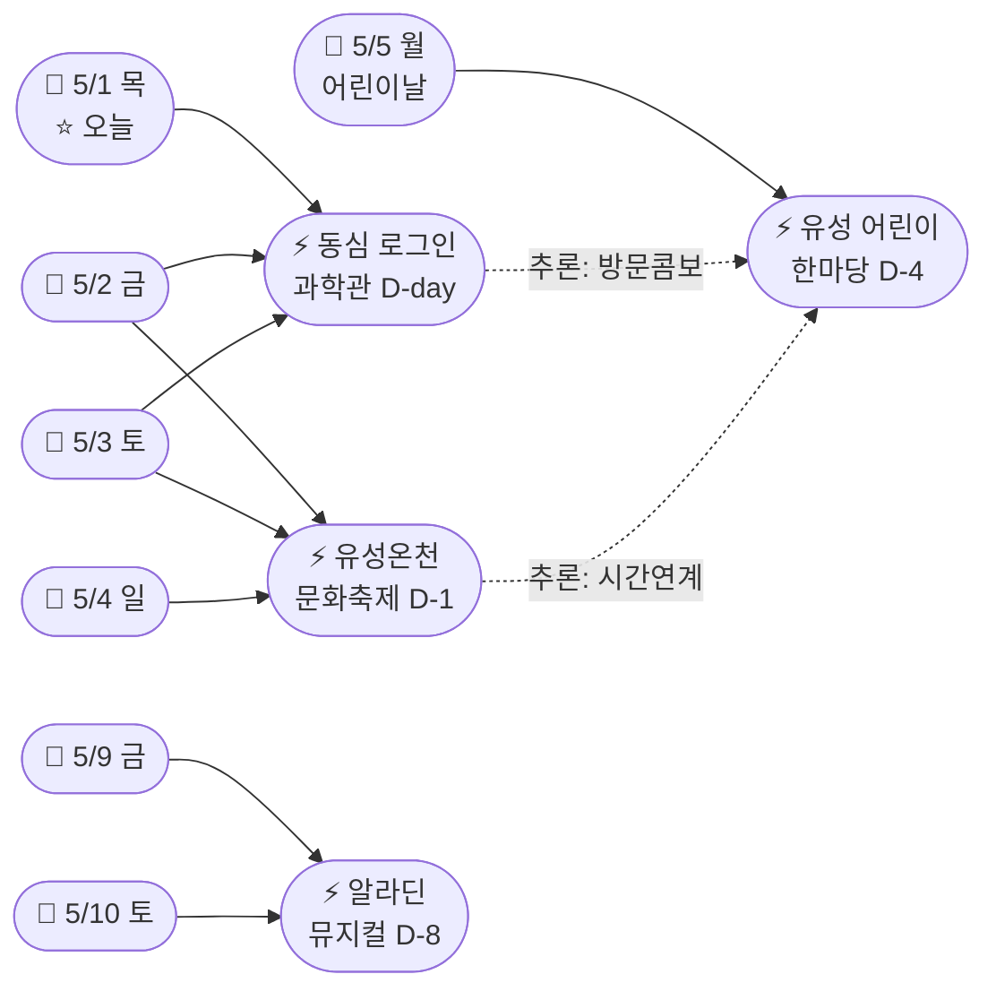
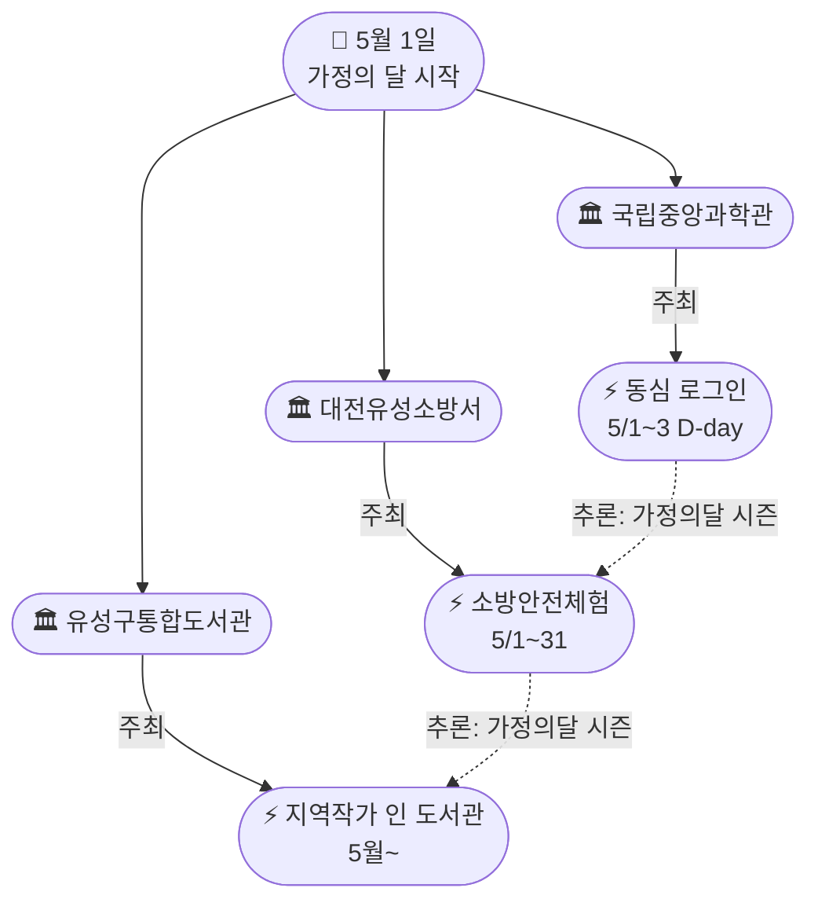
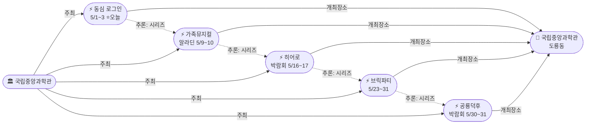

# 2026-05-01 대전 유성구 어린이·가족 이벤트 일일 보고서

## 요약

**골든위크 D-day.** 국립중앙과학관 '갓생 일시정지, 동심 로그인'이 오늘(5/1) 개막했다. 유성온천문화축제는 내일(5/2) 시작으로 D-1에 돌입했다. 5월 가정의 달이 시작되면서 공공기관 3곳(과학관·소방서·도서관)의 가족 프로그램이 일제히 운영을 시작했다. 골든위크 타임라인은 **오늘 5/1 동심 로그인 → 내일 5/2~4 온천축제 → 5/5 어린이 한마당 → 5/9~10 알라딘**으로 확정됐다. 금일 신규 이벤트·신규 가게 발견은 없으며, 기존 추적 항목의 D-day 전환이 핵심이다.

## 용성로20 주변 (도보권 내)

### ring-stroll (1km 이내) — 전민동 클러스터 유지 (변동 없음)

| 시설 | 동 | 거리 | 유형 | 상태 |
|------|---|------|------|------|
| 아가랑도서관 | 전민동 | ~0.9km | 도서관 — 아가맘 행복교실 | 운영 중 (4/4~6/27) |
| 유성구 평생학습센터 전민센터 | 전민동 | ~0.8km | 공공기관 원데이클래스 | 운영 중 |
| 전민종합문화센터 | 전민동 | ~0.8km | 문화센터 | 기존 |

> 도보권 내 변동 없음. 전민동 3거점 클러스터 유지.

## 오늘의 추천 (가족 동반 Top 5)

| 순위 | 이벤트 | 장소 (동) | 대상 | 비용 | D-day |
|------|--------|----------|------|------|-------|
| 1 | **갓생 일시정지, 동심 로그인** **[D-day, 오늘 개막]** | 국립중앙과학관 (도룡동) | 전연령 가족 | 미확인 | **오늘~5/3** |
| 2 | **유성온천문화축제** **[D-1, 내일 개막]** | 온천로 일원 (봉명동) | 전연령 가족 | 무료 | **내일 5/2~4** |
| 3 | **유성 어린이 한마당** | 국립중앙과학관 (도룡동) | 유아~초등·가족 | 무료 | **D-4 (5/5)** |
| 4 | 아가·맘 행복교실 | 아가랑도서관 (전민동, 0.9km) | 영유아 | 무료 | 운영 중 |
| 5 | 탐이 꿈이의 비밀 실험실 | 국립어린이과학관 (도룡동) | 초등 | 유료 | 4~6월 |

## 업데이트 항목

### 1. 국립중앙과학관 '갓생 일시정지, 동심 로그인' — D-day 개막
- **출처:** [국립중앙과학관 행사안내](https://www.science.go.kr/mps/1070/bbs/431/moveBbsNttList.do)
- **장소:** 국립중앙과학관 천체관·세미나실·꿈이 광장 (도룡동, ~3.5km, ring-car)
- **이전 상태:** D-1 (4/30)
- **금일 변경:** **D-day — 오늘(5/1, 목) 개막.** 5/3(토)까지 3일간 진행.
- **어린이 친화도:** 0.9
- **대상:** 전연령 가족
- **비용:** 미확인 (과학관 홈페이지 확인 필요)

> **액션 아이템.** 오늘 과학관 방문 가능. 5월 가정의 달 시리즈 첫 행사로, 천체관·세미나실·꿈이 광장 3개 공간에서 동시 운영. 사전신청 여부는 현장 확인 필요. 내일(5/2)부터는 온천축제와 병행 가능 — 오전 과학관 → 오후 온천축제 루트 추천.

### 2. 유성온천문화축제 D-1 — 내일(5/2) 개막
- **출처:** [유성온천문화축제 > 유성구 문화관광](https://www.yuseong.go.kr/prog/trrsrt/TRSE_01/tour/sub04_01/view.do?trrsrtNo=7)
- **이전 상태:** D-2 (4/30) — 교통 안내 공개
- **금일 변경:** **D-1 — 내일(5/2, 금) 개막.** 최종 리마인드.

| 항목 | 리마인드 |
|------|---------|
| **티니핑 참여권** | **선착순 50명×2회. 1회차 12시, 2회차 15시 — 계룡스파텔 메인 무대 우측 배부** |
| **1회차 관람** | **11시 현장 도착 필수** (12시 참여권 배부 전 줄서기) |
| **교통** | **월평역** 도보 15분 / **버스** 102·104·106·108·113·121·706·특구1·마을5 |
| **축제장** | 온천로·계룡스파텔 잔디광장·갑천변·유림공원 일원 |
| **유아 동반** | 계룡스파텔 광장 진입 추천 (유모차 접근성 양호) |

> **내일 축제 방문 플래너:** 가족 동반이라면 10시 출발 → 11시 현장 도착(티니핑 줄서기) → 12시 참여권 → 13시 공연 관람 → 오후 족욕 열차·온천수 수영장 체험.

## 신규 이벤트

> 금일 신규 이벤트 발견 없음. 기존 추적 항목의 D-day 전환이 핵심.

## 신규 오픈 가게·팝업·프로모션

> 금일 신규 가게·팝업·프로모션 발견 없음. 기존 목록 유지.

### 기존 Shop 현황 (변동 없음)

| 가게 | 유형 | 동 | 거리 | 상태 |
|------|------|---|------|------|
| 너티차일드 키즈 테마파크 | 키즈카페 | 도룡동 | ~3.5km | 운영 중 |
| IKEA 팝업스토어 | 팝업 | 관평동 | ~2.5km | 운영 중 |
| 신세계 Art&Science 봄 팝업 | 백화점 | 도룡동 | ~3.5km | 운영 중 |
| 현대프리미엄아울렛 | 아울렛 | 관평동 | ~2.5km | 운영 중 |
| 레포레스트 | 대형카페 | 덕명동 | ~4km | 운영 중 |

## 공공기관 주최 행사 (행정복지센터·보건소·복지관·도서관·우체국·경찰서·소방서)

### 5월 가정의 달 — 공공기관 일제 시작

오늘(5/1)부터 **3개 공공기관**이 가정의 달 프로그램을 동시 시작했다:

| 기관 | 프로그램 | 장소 | 대상 | 비용 | 상태 |
|------|---------|------|------|------|------|
| **국립중앙과학관** | **갓생 일시정지, 동심 로그인** | 과학관 전관 (도룡동) | 전연령 가족 | 미확인 | **D-day 개막 [UPDATE]** |
| **대전유성소방서** | **가정의 달 소방안전체험의 장** | 유성구 일원 | 유아~초등·가족 | 무료 | **5월 운영 시작** |
| **유성구통합도서관** | **지역작가 인(人) 도서관** | 6개 도서관 | 전연령 | 무료 | **5월 운영 시작** |
| 국립중앙과학관 | 가족뮤지컬 알라딘 | 사이언스홀 | 유아~초등·가족 | 미확인 | D-8 (5/9~10) |
| 국립중앙과학관 | 초능력 히어로 박람회 | 사이언스터널 | 초등 | 미확인 | 5/16~17 |
| 국립중앙과학관 | 사이언스 브릭파티 | 한국과학기술사관 | 유아~초등 | 미확인 | 5/23~31 |
| 국립중앙과학관 | 공룡덕후박람회 | 사이언스터널·꿈이광장 | 유아~초등·가족 | 미확인 | 5/30~31 |
| 유성구 | **유성 어린이 한마당** | 국립중앙과학관 | 유아~초등·가족 | 무료 | D-4 (5/5) |
| 유성온천문화축제추진위 | **유성온천문화축제** | 온천로 일원 | 전연령 | 무료 | **D-1 (5/2~4)** |
| 유성구종합사회복지관 | 지역사회복지 프로그램 | 봉명동 | 전연령 | 프로그램별 | 운영 중 |
| 유성구통합도서관 | 세대별 독서문화·북스타트 | 7개 도서관 | 영유아~초등 | 무료 | 운영 중 |
| 유성구 아가랑도서관 | 아가맘 행복교실 | 전민동 | 영유아 | 무료 | 운영 중 (4/4~6/27) |
| 유성구 평생학습센터 | 원데이클래스 | 전민·구암 | 성인 중심 | 무료/저비용 | 운영 중 |
| 대전유성소방서 | 119시민체험센터·이동체험 | 유성구 | 전연령 | 무료 | 상시 운영 |

## 마감 임박 (사전신청 D-3 이내)

| 이벤트 | D-day | 일시 | 장소 | 비고 |
|--------|-------|------|------|------|
| **갓생 일시정지, 동심 로그인** | **오늘 D-day** | 5/1(목)~3(토) | 국립중앙과학관 전관 | 사전신청 여부 미확인 — 현장 확인 |
| **유성온천문화축제** | **D-1** | 5/2(금)~5/4(일) | 온천로 일원 | 사전신청 불필요. **티니핑 선착순 50명×2회!** |
| **유성 어린이 한마당** | D-4 | 5/5(월) | 국립중앙과학관 | 사전신청 불필요 |

## 동심원별 묶음

### ring-stroll (1km 이내) — 전민동 클러스터 (변동 없음)
- 아가랑도서관 (전민동, ~0.9km) — 아가맘 행복교실 (4/4~6/27)
- 유성구 평생학습센터 전민센터 (전민동, ~0.8km) — 원데이클래스
- 전민종합문화센터 (전민동) — 미래산업 진로탐색 독서아카데미

### ring-bike (2km 이내) — 관평동 (변동 없음)
- 현대프리미엄아울렛 대전점 + IKEA 팝업 (관평동, ~2.5km)
- 관평도서관 (관평동) — 지역작가 인 도서관 5월 시작

### ring-car (5km 이내) — 골든위크 메인 존
- **국립중앙과학관 "동심 로그인" (D-day, 5/1~3)** — 도룡동 과학관 전관 **[오늘 개막]**
- **유성온천문화축제 (D-1, 5/2~4)** — 온천로 일원 (봉명동, ~5km) **[내일 개막]**
- 유성 어린이 한마당 (D-4, 5/5) + 국립중앙과학관·어린이과학관·천문대·아쿠아리움 (도룡동, ~3.5km)
- 가족뮤지컬 알라딘 (5/9~10) — 국립중앙과학관 사이언스홀
- 너티차일드 키즈 테마파크 (도룡동, ~3.5km)
- 유성구 평생학습센터 구암센터·유성구청소년수련관 (구암동, ~3km)
- 레포레스트 카페 (덕명동, ~4km)
- 대전광역시어린이회관 (노은동)
- 유성구종합사회복지관 (봉명동, ~4.5km)

## 동(洞)별 이벤트 묶음

### 도룡동 (1차 타겟) — 골든위크 "과학벨트 시즌" 진행 중

| 이벤트/시설 | 장소 | 상태 |
|------------|------|------|
| **갓생 일시정지, 동심 로그인 (5/1~3)** | 국립중앙과학관 전관 | **D-day 오늘 개막** |
| **유성 어린이 한마당 (5/5)** | 국립중앙과학관 중앙광장 | D-4 |
| **가족뮤지컬 알라딘 (5/9~10)** | 국립중앙과학관 사이언스홀 | D-8 |
| **초능력 히어로 박람회 (5/16~17)** | 국립중앙과학관 사이언스터널 | 5월 중순 |
| **사이언스 브릭파티 (5/23~31)** | 한국과학기술사관 | 5월 하순 |
| **공룡덕후박람회 (5/30~31)** | 사이언스터널·꿈이광장 | 5월 말 |
| 너티차일드 키즈 테마파크 | 엑스포로151번길 | 운영 중 |
| 대전엑스포아쿠아리움 체험 | 신세계 Art&Science B1 | 상시 운영 |
| 탐이 꿈이의 비밀 실험실 | 국립어린이과학관 | 4~6월 |
| K-사이언스 어린이 교육 | 국립어린이과학관 | 운영 중 |
| 사이언스 패스 | 국립중앙과학관 | 4.21~ 상시 |
| 상시 관측 프로그램 | 대전시민천문대 | 상시 운영 |
| 신세계 Art&Science 봄 팝업 | 엑스포로 1 | Shop |

> **도룡동 과학벨트 가정의 달 시즌이 오늘 공식 시작됐다.** 첫 행사 "동심 로그인"(5/1~3) 개막으로 5월 전체를 커버하는 주말 행사 릴레이가 시작. 오늘부터 5/31까지 매주 방문해도 새 행사 참여 가능.

### 봉명동 (보조 타겟) — 온천축제 D-1 (내일 개막)

| 이벤트 | 장소 | 상태 |
|--------|------|------|
| **유성온천문화축제 (5/2~4)** | 온천로·계룡스파텔 광장 | **D-1, 내일 개막** |
| 유성구종합사회복지관 | 도안대로589번길 27 | 운영 중 |

### 전민동 (1차 타겟) — ring-stroll 클러스터 유지

| 이벤트 | 장소 | 상태 |
|--------|------|------|
| 아가·맘 행복교실 | 아가랑도서관 | 운영 중 (4/4~6/27) |
| 유성구 평생학습센터 원데이클래스 | 전민센터 | 운영 중 |
| 미래산업 진로탐색 독서아카데미 | 전민종합문화센터 | 운영 중 |

### 관평동 (1차 타겟)
| 이벤트 | 장소 |
|--------|------|
| IKEA 팝업스토어 | 현대프리미엄아울렛 1층 |
| 도서관 독서문화 프로그램 | 관평도서관 |
| 지역작가 인 도서관 (5월~) | 관평도서관 |

### 용산동·문지동·신성동 (1차 타겟)
금일 수집된 신규 이벤트 없음.

## 연령대별 묶음

### 영유아 (0~3세)
- 아가·맘 행복교실 (아가랑도서관, 전민동 ring-stroll) — 운영 중
- 북스타트 책놀이 (7개 도서관) — 운영 중

### 유아 (4~6세)
- **갓생 일시정지, 동심 로그인 (5/1~3)** — **[오늘 개막]**
- **유성온천문화축제 캐치! 티니핑 공연 (5/2~4)** — **선착순 50명×2회!** [D-1]
- **유성 어린이 한마당 (5/5)** — 나무랑 놀꾸야 목공 + 매직버블쇼 [D-4]
- **가족뮤지컬 알라딘 (5/9~10)** — D-8
- 너티차일드 키즈 테마파크 (도룡동)
- 대전광역시어린이회관 체험 프로그램 (노은동)
- 유성소방서 안전체험 (가정의 달 확대 운영)

### 초등저학년 (7~9세)
- **갓생 일시정지, 동심 로그인 (5/1~3)** — **[오늘 개막]**
- **유성 어린이 한마당 (5/5)** — 과학 원리 체험 6종 + 나무랑 놀꾸야 [D-4]
- **유성온천문화축제 물총 스플래쉬 + 티니핑 (5/2~4)** [D-1]
- **초능력 히어로 박람회 (5/16~17)**
- **사이언스 브릭파티 (5/23~31)**
- 탐이 꿈이의 비밀 실험실 (국립어린이과학관)
- K-사이언스 어린이 교육 프로그램

### 초등고학년 (10~12세)
- **갓생 일시정지, 동심 로그인 (5/1~3)** — **[오늘 개막]**
- **유성 어린이 한마당 (5/5)** — 3D펜 체험 + 밀가루 배터리 시계 [D-4]
- **초능력 히어로 박람회 (5/16~17)**
- **사이언스 브릭파티 (5/23~31)**
- **공룡덕후박람회 (5/30~31)**
- 미래산업 진로탐색 독서아카데미 (관평·전민)
- 유성구청소년수련관 프로그램 (구암동)

### 전연령 가족
- **갓생 일시정지, 동심 로그인 (5/1~3)** — **[오늘 개막]**
- **유성온천문화축제 (5/2~4)** [D-1] — 족욕 열차, 온천수 수영장, 퍼레이드, **티니핑(선착순)**
- **유성 어린이 한마당 (5/5)** [D-4] — 나무랑 놀꾸야 + 매직쇼 + 플레이존
- **가족뮤지컬 알라딘 (5/9~10)** — D-8
- **공룡덕후박람회 (5/30~31)**
- 대전엑스포아쿠아리움 체험 (도룡동)
- 대전시민천문대 상시 관측 (도룡동)
- 지역작가 인 도서관 (5월~) — 6개 도서관

## 시리즈/정기 프로그램 업데이트

| 프로그램 | 주최 | 유형 | 비고 |
|---------|------|------|------|
| **국립중앙과학관 가정의 달 시리즈** | 국립중앙과학관 | 시즌 시리즈 | **5월 전체 5건 — 동심 로그인 오늘 개막** |
| **유성온천문화축제** | 축제추진위 | 연례 | **D-1, 내일 개막** |
| **유성 어린이 한마당** | 유성구 | 연례 | D-4 (5/5) |
| **지역작가 인 도서관** | 유성구통합도서관 | 정기 | **5월 운영 시작** |
| 가정의 달 소방안전체험 | 유성소방서 | 연례 | **5월 운영 시작** |
| 아가맘 행복교실 | 아가랑도서관 | 정기 | 4/4~6/27, 영유아 전용 |
| 탐이꿈이 비밀실험실 | 국립어린이과학관 | 정기 | 4~6월 수목금토 |
| 천문대 관측 프로그램 | 대전시민천문대 | 상시 | 매일 14:00~22:00 |
| 어린이회관 체험 프로그램 | 대전광역시어린이회관 | 상시 | 예약제 |
| 아쿠아리움 체험 | 대전엑스포아쿠아리움 | 상시 | 예약 불필요 |
| 북스타트 책놀이 | 유성구통합도서관 | 정기 | 7개 도서관 |
| 원데이클래스 | 유성구 평생학습센터 | 수시 | 온라인 사전신청 |
| 이동안전체험교육 | 유성소방서 | 수시 | 학교 방문형 |
| 소방안전체험 | 119시민체험센터 | 상시 | 화~토, 예약제 |

## 지식그래프 시각화

### 오늘의 주요 관계

골든위크 첫날 — 국립중앙과학관 "동심 로그인"이 개막하면서 **5/1~5/10 골든위크 타임라인이 "진행 중"으로 확정됐다.** 동시에 소방서·도서관도 5월 프로그램을 시작하여, **"가정의 달 공공기관 시즌"이 3기관 동시 발진으로 확정.**

### 골든위크 타임라인 (진행 중)

### 가정의 달 공공기관 동시 시작 (5/1)

### 국립중앙과학관 5월 시리즈 전체 (유지)

## 온톨로지 변경

| 변경 유형 | 대상 | 근거 |
|----------|------|------|
| 상태 업데이트 | ent-evt-024 (D-1→D-day), ent-evt-021 (D-2→D-1), ent-evt-022·023 (예정→운영개시) | 골든위크 D-day 도래, 가정의 달 시작 |
| 새 엔티티 | 없음 | 금일 신규 발견 없음 |
| 새 관계 유형 | 없음 | — |

## 추론 결과

| 추론 | 신뢰도 | 근거 |
|------|--------|------|
| 골든위크 타임라인 확정 (5/1→5/10) | 0.95 | 동심 로그인 D-day 개막으로 예측→확정 전환 |
| 가정의 달 공공기관 시즌 (3기관 동시) | 0.80 | 과학관·소방서·도서관 5/1 동시 시작 |
| 동심 로그인 ↔ 어린이 한마당 방문 콤보 | 0.85 | 같은 장소(과학관), 2일 간격 (5/3→5/5) |
| 동심 로그인 ↔ 온천축제 시간 연계 | 0.75 | 5/2~3 양일 동시 진행 — 오전 과학관 → 오후 온천로 |

## 분석 및 평가

**골든위크 첫날의 의미: "계획"에서 "실행"으로.** 지난 5일간 추적해온 골든위크 타임라인(5/1~10)이 오늘 첫 행사 개막으로 "진행 중"이 됐다. 이제 보고서의 초점은 "무슨 행사가 있는가"에서 **"오늘/내일 어디를 갈 것인가"**로 전환된다.

**오늘의 액션 플랜:**
1. **오늘(5/1, 목):** 국립중앙과학관 "동심 로그인" 방문 가능 (오후 2시 이후 천문대 연계 가능)
2. **내일(5/2, 금):** 온천축제 개막 — 티니핑 11시 도착 필수. 과학관 동심 로그인도 이틀째 진행 중
3. **모레(5/3, 토):** 동심 로그인 마지막 날 + 온천축제 2일차
4. **5/4(일):** 온천축제 마지막 날
5. **5/5(월, 어린이날):** 유성 어린이 한마당 — 과학관 중앙광장

**3종 의무 커버 현황:**
- **(a) 이벤트:** 동심 로그인 D-day + 온천축제 D-1 = **충족 (update 2건)**
- **(b) Shop:** 금일 신규 없음 — 기존 5건 유지
- **(c) 공공기관:** 과학관 D-day + 소방서 5월 시작 + 도서관 5월 시작 = **충족**

## 추적 항목

| 항목 | 최초 보고 | 상태 | 최신 업데이트 |
|------|----------|------|-------------|
| **갓생 일시정지, 동심 로그인** | 2026-04-30 | **D-day 개막** | **오늘(5/1) 개막. 천체관·세미나실·꿈이 광장. 5/3까지** |
| **유성온천문화축제** | 2026-04-25 | **D-1, 내일 개막** | **티니핑 선착순 50명 12시/15시 리마인드. 월평역·버스 9노선** |
| **유성 어린이 한마당** | 2026-04-25 | **D-4** | 프로그램 변동 없음. 5/5 과학관 광장 |
| **국립중앙과학관 5월 시리즈** | 2026-04-30 | 동심 로그인 개막 | 5건 중 1건(동심 로그인) 진행 시작 |
| **지역작가 인 도서관** | 2026-04-27 | **5월 운영 시작** | 김석영·이보현·조예은 작가, 6개 도서관 |
| **가정의 달 소방안전체험** | 2026-04-27 | **5월 운영 시작** | 심폐소생술·소화기·포토존 체험 — 유성구 일원 |
| K-사이언스 어린이 교육 | 2026-04-25 | 운영 중 | 탐이꿈이(4~6월) |
| 사이언스 패스 | 2026-04-25 | 출시 완료 | 적용 과학관 범위 확인 필요 |
| 대전광역시어린이회관 | 2026-04-25 | 상시 운영 | 어린이날 특별 프로그램 공지 대기 |
| 유아 문화예술교육지원 | 2026-04-25 | 운영 중 | 유성구 적용 현황 추적 필요 |
| 대전엑스포아쿠아리움 | 2026-04-26 | 상시 운영 | 어린이날 특별 프로그램 공지 대기 |
| IKEA 팝업스토어 | 2026-04-26 | 운영 중 | 종료일 미확인 |
| 아가·맘 행복교실 | 2026-04-26 | 운영 중 | 4/4~6/27, 전민동 ring-stroll |
| 북스타트 7개 도서관 | 2026-04-26 | 운영 중 | 5월 프로그램 사전신청 확인 필요 |
| 유성구종합사회복지관 | 2026-04-27 | 운영 중 | 복지관 카테고리 등록 |
| 너티차일드 키즈 테마파크 | 2026-04-28 | 운영 중 | 도룡동 엑스포 권역 키즈카페 |

## 동향 요약

| 분류 | 상태 | 비고 |
|------|------|------|
| **골든위크** | **D-day 진행 중** | 오늘 동심 로그인 개막 → 내일 온천축제 → 5/5 어린이날 |
| **국립중앙과학관** | **동심 로그인 D-day** | 5월 시리즈 첫 행사 개막 |
| **유성온천문화축제** | **D-1, 내일 개막** | 티니핑 선착순 리마인드 |
| **가정의 달** | **5/1 공식 시작** | 과학관·소방서·도서관 3기관 동시 시작 |
| 유성 어린이 한마당 | D-4 | 5/5 과학관, 변동 없음 |
| 전민동 도보권 | 유지 (3거점) | 변동 없음 |
| 도룡동 과학벨트 | 시즌 개막 | 동심 로그인으로 5월 첫 행사 시작 |
| Shop 카테고리 | 유지 (5건) | 금일 신규 없음 |
| 공공기관 카테고리 | 5월 시작 | 소방서·도서관 가정의 달 운영 개시 |

## 출처 목록

1. [국립중앙과학관 행사안내](https://www.science.go.kr/mps/1070/bbs/431/moveBbsNttList.do) — 국립중앙과학관, 2026
2. [유성온천문화축제 > 축제·공연 > 유성구 문화관광](https://www.yuseong.go.kr/prog/trrsrt/TRSE_01/tour/sub04_01/view.do?trrsrtNo=7) — 유성구청, 2026
3. [대전 유성구 어린이날 '유성 어린이 한마당' 개최](https://www.dtnews24.com/news/articleView.html?idxno=810991) — 디트NEWS24, 2026-04-27
4. [유성소방서, 가정의 달 소방안전체험의 장 운영](https://www.gocj.net/news/articleView.html?idxno=133782) — 대전시티저널, 2026
5. [유성구, 지역작가와 함께하는 특별한 만남 '지역작가 인 도서관' 운영](https://pedien.com/html/view.php?idx=1014924) — 페디엔, 2026
6. [공연 프로그램 | 유성온천문화축제](http://ysfesta.com/bbs/spafest.php?page_id=program3) — 유성온천문화축제 공식, 2026
7. [행사 일정 | 유성온천문화축제](http://ysfesta.com/bbs/spafest.php?page_id=schedule) — 유성온천문화축제 공식, 2026
8. [대전 유성구, 어린이날 '어린이 한마당' 개최…과학·체험 축제](https://www.ccdn.co.kr/news/articleView.html?idxno=1075693) — 충청매일, 2026-04-27
9. [대전시민천문대](https://djstar.kr/) — 대전시민천문대, 2026
10. [유성구, 지역작가와의 만남 '지역작가 인(人) 도서관'](https://www.kspnews.com/2595126) — KSP뉴스, 2026
