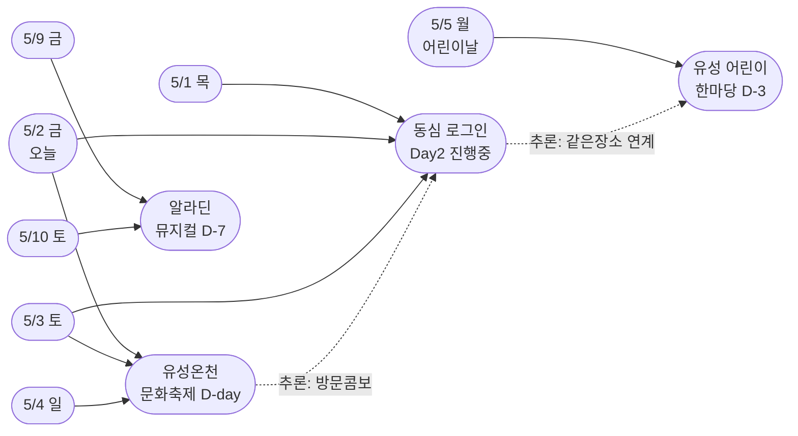
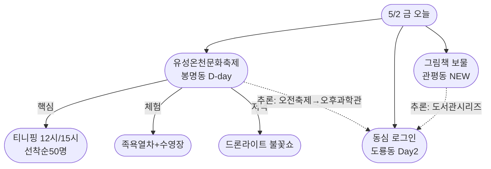
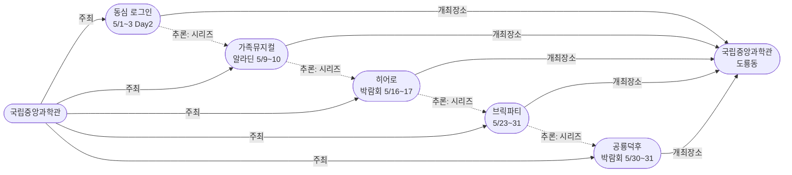

# 2026-05-02 대전 유성구 어린이·가족 이벤트 일일 보고서

## 요약

**유성온천문화축제 D-day.** 오늘(5/2, 금) 유성온천문화축제가 개막했다. 3일간(5/2~4) 온천로·계룡스파텔 일원에서 100여 개 프로그램이 펼쳐진다. 캐치! 티니핑 선착순 50명×2회(12시/15시)가 유아·초등 가족의 최대 관심사다. 동시에 국립중앙과학관 '동심 로그인'은 Day 2로 내일(5/3) 마지막이며, 어린이 한마당(5/5)이 D-3으로 마감임박 섹션에 진입했다. 신규 발견으로 관평도서관 '그림책, 나만의 보물을 담다' 어린이 프로그램 추가모집이 확인됐다.

## 용성로20 주변 (도보권 내)

### ring-stroll (1km 이내) — 전민동 클러스터 유지 (변동 없음)

| 시설 | 동 | 거리 | 유형 | 상태 |
|------|---|------|------|------|
| 아가랑도서관 | 전민동 | ~0.9km | 도서관 — 아가맘 행복교실 | 운영 중 (4/4~6/27) |
| 유성구 평생학습센터 전민센터 | 전민동 | ~0.8km | 공공기관 원데이클래스 | 운영 중 |
| 전민종합문화센터 | 전민동 | ~0.8km | 문화센터 | 기존 |

> 도보권 내 변동 없음. 전민동 3거점 클러스터 유지.

## 오늘의 추천 (가족 동반 Top 5)

| 순위 | 이벤트 | 장소 (동) | 대상 | 비용 | D-day |
|------|--------|----------|------|------|-------|
| 1 | **유성온천문화축제** **[D-day, 오늘 개막]** | 온천로 일원 (봉명동) | 전연령 가족 | 무료 (일부 유료) | **오늘~5/4** |
| 2 | **갓생 일시정지, 동심 로그인** **[Day 2]** | 국립중앙과학관 (도룡동) | 전연령 가족 | 미확인 | **오늘~내일(5/3 마지막)** |
| 3 | **유성 어린이 한마당** **[D-3 마감임박]** | 국립중앙과학관 (도룡동) | 유아~초등·가족 | 무료 | **5/5 어린이날** |
| 4 | **그림책, 나만의 보물을 담다** **[신규]** | 관평도서관 (관평동, 1.8km) | 유아~초등저 | 무료 | 추가모집 중 |
| 5 | 아가·맘 행복교실 | 아가랑도서관 (전민동, 0.9km) | 영유아 | 무료 | 운영 중 |

## 업데이트 항목

### 1. 유성온천문화축제 D-day 개막 — 오늘(5/2) 시작!
- **출처:** [행사 일정 | 유성온천문화축제](http://ysfesta.com/bbs/spafest.php?page_id=schedule)
- **장소:** 온천로·계룡스파텔 잔디광장·갑천변·유림공원 일원 (봉명동, ~5km, ring-car)
- **이전 상태:** D-1 (5/1)
- **금일 변경:** **D-day — 오늘(5/2, 금) 개막.** 5/4(일)까지 3일간.

| 프로그램 | 시간 | 장소 | 비고 |
|---------|------|------|------|
| **캐치! 티니핑 놀이&포토타임** | **1회 12시 / 2회 15시** | 계룡스파텔 메인무대 | **선착순 50명, 1시간 전 우측 배부** |
| 개막식 + 드론라이트·불꽃쇼 | 저녁 | 메인무대 | 식전공연 + 개막 퍼포먼스 |
| 온천수 DJ파티 | 저녁 | 축제장 | 분위기 |
| 유성호 족욕 테마열차 | 종일 | 축제장 | 가족 체험 |
| 온천수 수영장 | 11:00~20:00 | 축제장 | 45분 세션 |
| 힙합 공연 / 7080 낭만콘서트 | 오후~저녁 | 메인무대 | 일자별 상이 |
| 뷰티플라워 헤어아트쇼 | 오후 | 메인무대 | |
| 공예·VR·건강 체험부스 | 종일 | 축제장 일대 | 가족 체험 |

> **오늘 방문 플래너 (티니핑 타겟):**
> 10시 출발 → 11시 현장 도착(티니핑 줄서기 시작) → 12시 참여권 배부 → 13시 관람 → 오후 족욕열차·온천수수영장 → 저녁 드론라이트·불꽃쇼
>
> **교통:** 월평역 도보 15분 / 버스 102·104·106·108·113·121·706·특구1·마을5
> **축제 문의:** 042-611-2080

### 2. 유성 어린이 한마당 D-3 마감임박 진입
- **출처:** [대전 유성구 어린이날 '유성 어린이 한마당' 개최](https://www.dtnews24.com/news/articleView.html?idxno=810991)
- **이전 상태:** D-4 (5/1)
- **금일 변경:** **D-3. 마감임박 기준(D-3 이내) 충족.**
- **일시:** 5/5(월, 어린이날) / 국립중앙과학관 중앙광장
- **사전신청:** 불필요 (현장 참여)
- **프로그램:** 나무랑 놀꾸야 목공 + 사이언스 매직쇼·버블쇼 + 과학 원리 체험 6종 + 아동 안전·권리 캠페인

## 신규 이벤트

### 관평도서관 '그림책, 나만의 보물을 담다' — 1기 추가모집
- **출처:** [유성구통합도서관 행사신청](https://lib.yuseong.go.kr/web/program/lectureDetail.do?lectureIdx=11956)
- **장소:** 관평도서관 (관평동, ~1.8km, ring-bike)
- **대상:** 유아~초등저학년 (추정)
- **비용:** 무료 (추정)
- **사전신청:** 필요 (추가모집 중)
- **실내/야외:** 실내
- **어린이 친화도:** 0.85 (도서관 운영 가산 적용 시 1.0)
- **ring:** ring-bike (자전거·짧은 차량)
- **의의:** 관평동(1차 타겟 동)의 공공 도서관 어린이 프로그램. 그림책 창작·감상 활동으로 추정.

> **액션 아이템:** 관평도서관 홈페이지에서 추가모집 신청. 정원·일정 확인 필요.

## 신규 오픈 가게·팝업·프로모션

> 금일 신규 가게·팝업·프로모션 발견 없음. 기존 목록 유지.

### 기존 Shop 현황 (변동 없음)

| 가게 | 유형 | 동 | 거리 | 상태 |
|------|------|---|------|------|
| 너티차일드 키즈 테마파크 | 키즈카페 | 도룡동 | ~3.5km | 운영 중 |
| IKEA 팝업스토어 | 팝업 | 관평동 | ~2.5km | 운영 중 |
| 신세계 Art&Science 봄 팝업 | 백화점 | 도룡동 | ~3.5km | 운영 중 |
| 현대프리미엄아울렛 | 아울렛 | 관평동 | ~2.5km | 운영 중 |
| 레포레스트 | 대형카페 | 덕명동 | ~4km | 운영 중 |

## 공공기관 주최 행사 (행정복지센터·보건소·복지관·도서관·우체국·경찰서·소방서)

| 기관 | 프로그램 | 장소 | 대상 | 비용 | 상태 |
|------|---------|------|------|------|------|
| **유성온천문화축제추진위** | **유성온천문화축제** | 온천로 일원 (봉명동) | 전연령 가족 | 무료 | **D-day 개막 [UPDATE]** |
| **국립중앙과학관** | **갓생 일시정지, 동심 로그인** | 과학관 전관 (도룡동) | 전연령 가족 | 미확인 | **Day 2 (내일 마지막)** |
| **유성구** | **유성 어린이 한마당** | 국립중앙과학관 | 유아~초등·가족 | 무료 | **D-3 마감임박 [UPDATE]** |
| **유성구통합도서관** | **그림책, 나만의 보물을 담다** | 관평도서관 | 유아~초등저 | 무료 | **추가모집 [NEW]** |
| 대전유성소방서 | 가정의 달 소방안전체험의 장 | 유성구 일원 | 유아~초등·가족 | 무료 | 5월 운영 중 |
| 유성구통합도서관 | 지역작가 인(人) 도서관 | 6개 도서관 | 전연령 | 무료 | 5월 운영 중 |
| 국립중앙과학관 | 가족뮤지컬 알라딘 | 사이언스홀 | 유아~초등·가족 | 미확인 | D-7 (5/9~10) |
| 국립중앙과학관 | 초능력 히어로 박람회 | 사이언스터널 | 초등 | 미확인 | 5/16~17 |
| 국립중앙과학관 | 사이언스 브릭파티 | 한국과학기술사관 | 유아~초등 | 미확인 | 5/23~31 |
| 국립중앙과학관 | 공룡덕후박람회 | 사이언스터널·꿈이광장 | 유아~초등·가족 | 미확인 | 5/30~31 |
| 유성구종합사회복지관 | 지역사회복지 프로그램 | 봉명동 | 전연령 | 프로그램별 | 운영 중 |
| 유성구통합도서관 | 세대별 독서문화·북스타트 | 7개 도서관 | 영유아~초등 | 무료 | 운영 중 |
| 유성구 아가랑도서관 | 아가맘 행복교실 | 전민동 | 영유아 | 무료 | 운영 중 (4/4~6/27) |
| 유성구 평생학습센터 | 원데이클래스 | 전민·구암 | 성인 중심 | 무료/저비용 | 운영 중 |
| 대전유성소방서 | 119시민체험센터·이동체험 | 유성구 | 전연령 | 무료 | 상시 운영 |

## 마감 임박 (사전신청 D-3 이내)

| 이벤트 | D-day | 일시 | 장소 | 비고 |
|--------|-------|------|------|------|
| **유성온천문화축제** | **D-day (오늘)** | 5/2(금)~5/4(일) | 온천로 일원 | 사전신청 불필요. **티니핑 선착순 50명×2회!** |
| **갓생 일시정지, 동심 로그인** | **Day 2 (내일 마지막)** | 5/1(목)~5/3(토) | 국립중앙과학관 전관 | 사전신청 여부 미확인 |
| **유성 어린이 한마당** | **D-3** | 5/5(월) | 국립중앙과학관 | 사전신청 불필요 |
| **그림책, 나만의 보물을 담다** | **추가모집 중** | 미확인 | 관평도서관 | **사전신청 필요 — 조기 마감 가능** |

## 동심원별 묶음

### ring-stroll (1km 이내) — 전민동 클러스터 (변동 없음)
- 아가랑도서관 (전민동, ~0.9km) — 아가맘 행복교실 (4/4~6/27)
- 유성구 평생학습센터 전민센터 (전민동, ~0.8km) — 원데이클래스
- 전민종합문화센터 (전민동) — 미래산업 진로탐색 독서아카데미

### ring-bike (2km 이내) — 관평동
- **관평도서관 (관평동, ~1.8km) — '그림책, 나만의 보물을 담다' 추가모집 [NEW]**
- 현대프리미엄아울렛 대전점 + IKEA 팝업 (관평동, ~2.5km)

### ring-car (5km 이내) — 골든위크 본격 진행
- **유성온천문화축제 (D-day, 5/2~4)** — 온천로 일원 (봉명동, ~5km) **[오늘 개막]**
- **국립중앙과학관 "동심 로그인" (Day 2, 5/1~3)** — 도룡동 과학관 전관 **[내일 마지막]**
- 유성 어린이 한마당 (D-3, 5/5) + 국립중앙과학관·어린이과학관·천문대·아쿠아리움 (도룡동, ~3.5km)
- 가족뮤지컬 알라딘 (5/9~10) — 국립중앙과학관 사이언스홀
- 너티차일드 키즈 테마파크 (도룡동, ~3.5km)
- 유성구 평생학습센터 구암센터·유성구청소년수련관 (구암동, ~3km)
- 레포레스트 카페 (덕명동, ~4km)
- 대전광역시어린이회관 (노은동)
- 유성구종합사회복지관 (봉명동, ~4.5km)

## 동(洞)별 이벤트 묶음

### 봉명동 — 유성온천문화축제 D-day 개막!

| 이벤트 | 장소 | 상태 |
|--------|------|------|
| **유성온천문화축제 (5/2~4)** | 온천로·계룡스파텔 광장 | **D-day 오늘 개막** |
| 유성구종합사회복지관 | 도안대로589번길 27 | 운영 중 |

### 도룡동 (1차 타겟) — 과학벨트 Day 2 + 5월 시리즈 계속

| 이벤트/시설 | 장소 | 상태 |
|------------|------|------|
| **갓생 일시정지, 동심 로그인 (5/1~3)** | 국립중앙과학관 전관 | **Day 2 (내일 마지막)** |
| **유성 어린이 한마당 (5/5)** | 국립중앙과학관 중앙광장 | D-3 마감임박 |
| **가족뮤지컬 알라딘 (5/9~10)** | 국립중앙과학관 사이언스홀 | D-7 |
| 초능력 히어로 박람회 (5/16~17) | 국립중앙과학관 사이언스터널 | 5월 중순 |
| 사이언스 브릭파티 (5/23~31) | 한국과학기술사관 | 5월 하순 |
| 공룡덕후박람회 (5/30~31) | 사이언스터널·꿈이광장 | 5월 말 |
| 너티차일드 키즈 테마파크 | 엑스포로151번길 | 운영 중 |
| 대전엑스포아쿠아리움 체험 | 신세계 Art&Science B1 | 상시 운영 |
| 탐이 꿈이의 비밀 실험실 | 국립어린이과학관 | 4~6월 |
| K-사이언스 어린이 교육 | 국립어린이과학관 | 운영 중 |
| 사이언스 패스 | 국립중앙과학관 | 4.21~ 상시 |
| 상시 관측 프로그램 | 대전시민천문대 | 상시 운영 |

### 관평동 (1차 타겟)

| 이벤트 | 장소 | 상태 |
|--------|------|------|
| **그림책, 나만의 보물을 담다** | 관평도서관 | **추가모집 [NEW]** |
| IKEA 팝업스토어 | 현대프리미엄아울렛 1층 | 운영 중 |
| 도서관 독서문화 프로그램 | 관평도서관 | 운영 중 |
| 지역작가 인 도서관 (5월~) | 관평도서관 | 운영 중 |

### 전민동 (1차 타겟) — ring-stroll 클러스터 유지

| 이벤트 | 장소 | 상태 |
|--------|------|------|
| 아가·맘 행복교실 | 아가랑도서관 | 운영 중 (4/4~6/27) |
| 유성구 평생학습센터 원데이클래스 | 전민센터 | 운영 중 |
| 미래산업 진로탐색 독서아카데미 | 전민종합문화센터 | 운영 중 |

### 용산동·문지동·신성동 (1차 타겟)
금일 수집된 신규 이벤트 없음.

### 노은동 (보조 타겟)
- 노은도서관 북스타트 책놀이 (5/1~5/22, 매주 목 10:30~11:30) — 운영 중
- 대전광역시어린이회관 — 상시 운영

## 연령대별 묶음

### 영유아 (0~3세)
- 아가·맘 행복교실 (아가랑도서관, 전민동 ring-stroll) — 운영 중
- 북스타트 책놀이 (노은도서관, 5/1~22 매주 목) — 운영 중
- 유성온천문화축제 유아 동반 (유모차 접근성 양호) — **오늘 개막**

### 유아 (4~6세)
- **유성온천문화축제 캐치! 티니핑 공연 (5/2~4)** — **선착순 50명×2회! [오늘 개막]**
- **갓생 일시정지, 동심 로그인 (5/1~3)** — Day 2 (내일 마지막)
- **유성 어린이 한마당 (5/5)** — 나무랑 놀꾸야 목공 + 매직버블쇼 [D-3]
- **그림책, 나만의 보물을 담다 (관평도서관)** — **추가모집 [NEW]**
- **가족뮤지컬 알라딘 (5/9~10)** — D-7
- 너티차일드 키즈 테마파크 (도룡동)
- 대전광역시어린이회관 체험 프로그램 (노은동)
- 유성소방서 안전체험 (가정의 달 확대 운영)

### 초등저학년 (7~9세)
- **유성온천문화축제 물놀이·체험부스 (5/2~4)** — **[오늘 개막]**
- **갓생 일시정지, 동심 로그인 (5/1~3)** — Day 2
- **유성 어린이 한마당 (5/5)** — 과학 원리 체험 6종 + 나무랑 놀꾸야 [D-3]
- **그림책, 나만의 보물을 담다 (관평도서관)** — **추가모집 [NEW]**
- 초능력 히어로 박람회 (5/16~17)
- 사이언스 브릭파티 (5/23~31)
- 탐이 꿈이의 비밀 실험실 (국립어린이과학관)
- K-사이언스 어린이 교육 프로그램

### 초등고학년 (10~12세)
- **유성온천문화축제 체험부스·VR (5/2~4)** — **[오늘 개막]**
- **갓생 일시정지, 동심 로그인 (5/1~3)** — Day 2
- **유성 어린이 한마당 (5/5)** — 3D펜 체험 + 밀가루 배터리 시계 [D-3]
- 초능력 히어로 박람회 (5/16~17)
- 사이언스 브릭파티 (5/23~31)
- 공룡덕후박람회 (5/30~31)
- 미래산업 진로탐색 독서아카데미 (관평·전민)
- 유성구청소년수련관 프로그램 (구암동)

### 전연령 가족
- **유성온천문화축제 (5/2~4)** **[오늘 개막]** — 족욕 열차, 온천수 수영장, 퍼레이드, 드론라이트·불꽃쇼, **티니핑(선착순)**
- **갓생 일시정지, 동심 로그인 (5/1~3)** — Day 2 (내일 마지막)
- **유성 어린이 한마당 (5/5)** [D-3] — 나무랑 놀꾸야 + 매직쇼 + 플레이존
- **가족뮤지컬 알라딘 (5/9~10)** — D-7
- 공룡덕후박람회 (5/30~31)
- 대전엑스포아쿠아리움 체험 (도룡동)
- 대전시민천문대 상시 관측 (도룡동)
- 지역작가 인 도서관 (5월~) — 6개 도서관

## 시리즈/정기 프로그램 업데이트

| 프로그램 | 주최 | 유형 | 비고 |
|---------|------|------|------|
| **유성온천문화축제** | 축제추진위 | 연례 | **D-day 오늘 개막** |
| **국립중앙과학관 가정의 달 시리즈** | 국립중앙과학관 | 시즌 시리즈 | 동심 로그인 Day 2 (내일 마지막) |
| **유성 어린이 한마당** | 유성구 | 연례 | D-3 (5/5) 마감임박 |
| **유성구통합도서관 어린이 독서** | 유성구통합도서관 | 정기 | **그림책 프로그램 추가모집 [NEW]** |
| 가정의 달 소방안전체험 | 유성소방서 | 연례 | 5월 운영 중 |
| 지역작가 인 도서관 | 유성구통합도서관 | 정기 | 5월 운영 중 |
| 아가맘 행복교실 | 아가랑도서관 | 정기 | 4/4~6/27, 영유아 전용 |
| 탐이꿈이 비밀실험실 | 국립어린이과학관 | 정기 | 4~6월 수목금토 |
| 천문대 관측 프로그램 | 대전시민천문대 | 상시 | 매일 14:00~22:00 |
| 어린이회관 체험 프로그램 | 대전광역시어린이회관 | 상시 | 예약제 |
| 아쿠아리움 체험 | 대전엑스포아쿠아리움 | 상시 | 예약 불필요 |
| 북스타트 책놀이 | 유성구통합도서관 | 정기 | 노은도서관 5/1~22 목 10:30 |
| 원데이클래스 | 유성구 평생학습센터 | 수시 | 온라인 사전신청 |
| 이동안전체험교육 | 유성소방서 | 수시 | 학교 방문형 |
| 소방안전체험 | 119시민체험센터 | 상시 | 화~토, 예약제 |

## 지식그래프 시각화

### 오늘의 주요 관계

골든위크 Day 2 — **유성온천문화축제 개막으로 봉명동 축제존과 도룡동 과학존이 동시 가동됐다.** 오늘·내일(5/2~3)은 온천축제+동심 로그인 동시 진행으로 "오전 축제 → 오후 과학관" 루트가 가능하다. 관평도서관에서 신규 어린이 프로그램이 발견되어 관평동 클러스터가 강화됐다.

### 골든위크 타임라인 (Day 2 진행 중)

### 오늘의 동시 진행 이벤트 (방문 플래너)

### 국립중앙과학관 5월 시리즈 (유지 — 진행 중 표시)

## 온톨로지 변경

| 변경 유형 | 대상 | 근거 |
|----------|------|------|
| 새 엔티티 | ent-evt-029 (그림책, 나만의 보물을 담다) | 관평도서관 어린이 프로그램 신규 발견 |
| 상태 업데이트 | ent-evt-021 (D-1→D-day), ent-evt-024 (D-day→Day2), ent-evt-020 (D-4→D-3) | 골든위크 타임라인 진행 |
| 새 클래스/관계 | 없음 | — |

## 추론 결과

| 추론 | 신뢰도 | 근거 |
|------|--------|------|
| 온천축제 ↔ 동심 로그인 방문콤보 | 0.85 | 5/2~3 양일 동시 진행. 봉명동↔도룡동 차량 15분 |
| 그림책 프로그램 kid_friendly 가산 | 0.85 | 도서관 운영 어린이 프로그램 → 0.85+0.2=1.0 |
| 그림책 ↔ 북스타트 시리즈 가능성 | 0.60 (잠정) | 같은 운영 주체 + 유사 대상 + 도서 주제 |
| 골든위크 타임라인 Day 2 | 0.95 | 온천축제 개막으로 2/5 완료 확인 |

## 분석 및 평가

**골든위크 Day 2: 축제 개막 전환.** 어제까지의 "카운트다운 모드"가 오늘 온천축제 개막으로 "현장 모드"에 돌입했다. 보고서의 초점이 **"언제 시작하는가"에서 "지금 어디로 가는가"**로 완전히 전환됐다.

**오늘·내일의 이동 루트 추천:**
1. **오늘(5/2, 금) — 온천축제 올인:** 11시 도착 → 티니핑 줄서기 → 12시 참여권 → 오후 족욕·수영 → 저녁 불꽃쇼
2. **오늘 오후 대안 — 과학관 겸방:** 오전 축제 → 14시 이동 → 동심 로그인 (도룡동, 차량 15분)
3. **내일(5/3, 토) — 라스트 찬스:** 동심 로그인 마지막 날 + 온천축제 2일차. 양쪽 모두 가능한 마지막 날.
4. **5/4(일):** 온천축제 마지막 날 (동심 로그인은 종료됨)
5. **5/5(월, 어린이날):** 유성 어린이 한마당 — 과학관 중앙광장

**3종 의무 커버 현황:**
- **(a) 이벤트:** 온천축제 D-day + 어린이 한마당 D-3 + 그림책 신규 = **충족**
- **(b) Shop:** 금일 신규 없음 — 기존 5건 유지
- **(c) 공공기관:** 도서관 신규(그림책) + 소방서 운영 중 + 과학관 진행 중 = **충족**

## 추적 항목

| 항목 | 최초 보고 | 상태 | 최신 업데이트 |
|------|----------|------|-------------|
| **유성온천문화축제** | 2026-04-25 | **D-day 개막** | **오늘(5/2) 개막. 티니핑 50명×2회(12시/15시). 3일간(~5/4)** |
| **갓생 일시정지, 동심 로그인** | 2026-04-30 | **Day 2 (내일 마지막)** | **5/3(토) 마지막. 내일 방문하지 않으면 종료** |
| **유성 어린이 한마당** | 2026-04-25 | **D-3 마감임박** | 5/5 과학관 광장. 변동 없음 |
| **그림책, 나만의 보물을 담다** | **2026-05-02 (오늘)** | **추가모집 [NEW]** | **관평도서관 어린이 프로그램. 신청 필요** |
| **국립중앙과학관 5월 시리즈** | 2026-04-30 | 동심 로그인 Day 2 | 5건 중 1건 진행 중. 다음: 알라딘(5/9) |
| 가정의 달 소방안전체험 | 2026-04-27 | 5월 운영 중 | 변동 없음 |
| 지역작가 인 도서관 | 2026-04-27 | 5월 운영 중 | 변동 없음 |
| K-사이언스 어린이 교육 | 2026-04-25 | 운영 중 | 탐이꿈이(4~6월) |
| 사이언스 패스 | 2026-04-25 | 출시 완료 | 적용 범위 확인 필요 |
| 대전광역시어린이회관 | 2026-04-25 | 상시 운영 | 어린이날 특별 프로그램 공지 대기 |
| 유아 문화예술교육지원 | 2026-04-25 | 운영 중 | 유성구 적용 현황 추적 필요 |
| 대전엑스포아쿠아리움 | 2026-04-26 | 상시 운영 | 어린이날 특별 프로그램 공지 대기 |
| IKEA 팝업스토어 | 2026-04-26 | 운영 중 | 종료일 미확인 |
| 아가·맘 행복교실 | 2026-04-26 | 운영 중 | 4/4~6/27, 전민동 ring-stroll |
| 북스타트 7개 도서관 | 2026-04-26 | 운영 중 | 노은 5/1~22 목 10:30 확인 |
| 유성구종합사회복지관 | 2026-04-27 | 운영 중 | 복지관 카테고리 등록 |
| 너티차일드 키즈 테마파크 | 2026-04-28 | 운영 중 | 도룡동 엑스포 권역 키즈카페 |

## 동향 요약

| 분류 | 상태 | 비고 |
|------|------|------|
| **골든위크** | **Day 2 진행 중** | 온천축제 개막 → 내일 동심 로그인 마지막 → 5/5 어린이날 |
| **유성온천문화축제** | **D-day 개막** | 오늘~5/4. 티니핑 핵심. 드론라이트 저녁 |
| **국립중앙과학관** | **Day 2 (내일 마지막)** | 동심 로그인 5/3 종료 예정 |
| **유성 어린이 한마당** | D-3 마감임박 | 5/5 과학관, 무료, 사전신청 불필요 |
| **관평도서관 그림책** | **신규 발견** | 추가모집 중. 관평동 1차 타겟. |
| 전민동 도보권 | 유지 (3거점) | 변동 없음 |
| 도룡동 과학벨트 | 시즌 Day 2 | 동심 로그인 진행 중 |
| Shop 카테고리 | 유지 (5건) | 금일 신규 없음 |
| 공공기관 카테고리 | 신규 추가 | 관평도서관 그림책 프로그램 |

## 출처 목록

1. [행사 일정 | 유성온천문화축제](http://ysfesta.com/bbs/spafest.php?page_id=schedule) — 유성온천문화축제 공식, 2026
2. [공연 프로그램 | 유성온천문화축제](http://ysfesta.com/bbs/spafest.php?page_id=program3) — 유성온천문화축제 공식, 2026
3. [대표 프로그램 | 유성온천문화축제](http://ysfesta.com/bbs/spafest.php?page_id=program1) — 유성온천문화축제 공식, 2026
4. [유성온천문화축제 > 축제·공연 > 유성구 문화관광](https://www.yuseong.go.kr/prog/trrsrt/TRSE_01/tour/sub04_01/view.do?trrsrtNo=7) — 유성구청, 2026
5. [대전 유성구 어린이날 '유성 어린이 한마당' 개최](https://www.dtnews24.com/news/articleView.html?idxno=810991) — 디트NEWS24, 2026-04-27
6. [대전 유성구, 어린이날 '어린이 한마당' 개최…과학·체험 축제](https://www.ccdn.co.kr/news/articleView.html?idxno=1075693) — 충청매일, 2026-04-27
7. [유성구통합도서관 행사신청 — 그림책, 나만의 보물을 담다](https://lib.yuseong.go.kr/web/program/lectureDetail.do?lectureIdx=11956) — 유성구통합도서관, 2026
8. [국립중앙과학관 행사안내](https://www.science.go.kr/mps/1070/bbs/431/moveBbsNttList.do) — 국립중앙과학관, 2026
9. [유성소방서, 가정의 달 소방안전체험의 장 운영](https://www.gocj.net/news/articleView.html?idxno=133782) — 대전시티저널, 2026
10. [유성구, 지역작가와 함께하는 특별한 만남 '지역작가 인 도서관' 운영](https://pedien.com/html/view.php?idx=1014924) — 페디엔, 2026
11. [대전시민천문대](https://djstar.kr/) — 대전시민천문대, 2026
12. [유성온천문화축제 | 대한민국 구석구석](https://korean.visitkorea.or.kr/kfes/detail/fstvlDetail.do?fstvlCntntsId=2fcee4ea-7f88-4485-a67b-d4a88ee78320) — 한국관광공사, 2026
