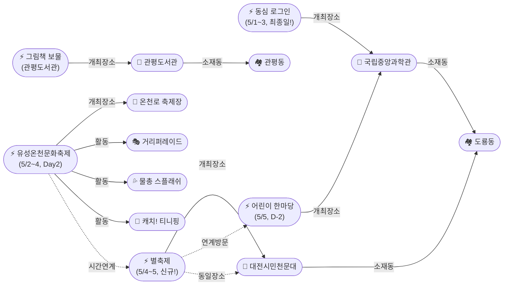

# 2026-05-03 대전 유성구 어린이·가족 이벤트 일일 보고서

## 요약

**황금연휴 Day 3 — 온천축제 거리퍼레이드 + 동심 로그인 마지막 날.** 유성온천문화축제 Day 2인 오늘(5/3, 토)은 30주년 기념 거리퍼레이드가 온천로를 가득 채운다. 캐치! 티니핑(선착순 50명×2회)과 온천수 물총 스플래쉬(15시)도 매일 운영. 국립중앙과학관 '동심 로그인'은 오늘이 마지막이므로 방문 계획이 있다면 오늘 안에 다녀와야 한다. **신규 발견:** 대전시민천문대 별축제(5/4~5)가 내일 개막 — 과학체험부스 수십 개, 태양관측, 별음악회. 도룡동 과학벨트에서 어린이 한마당(5/5)과 연계 가능한 2일 코스가 완성됐다.

## 용성로20 주변 (도보권 내)

### ring-stroll (1km 이내) — 전민동 클러스터 유지 (변동 없음)

| 시설 | 동 | 거리 | 유형 | 상태 |
|------|---|------|------|------|
| 아가랑도서관 | 전민동 | ~0.9km | 도서관 — 아가맘 행복교실 | 운영 중 (4/4~6/27) |
| 유성구 평생학습센터 전민센터 | 전민동 | ~0.8km | 공공기관 원데이클래스 | 운영 중 |
| 전민종합문화센터 | 전민동 | ~0.8km | 문화센터 | 기존 |

> 도보권 내 변동 없음. 전민동 3거점 클러스터 유지.

## 오늘의 추천 (가족 동반 Top 5)

| 순위 | 이벤트 | 장소 (동) | 대상 | 비용 | D-day |
|------|--------|----------|------|------|-------|
| 1 | **유성온천문화축제 Day 2** **[거리퍼레이드]** | 온천로 일원 (봉명동) | 전연령 가족 | 무료 (일부 유료) | **오늘~5/4** |
| 2 | **갓생 일시정지, 동심 로그인** **[최종일!]** | 국립중앙과학관 (도룡동) | 전연령 가족 | 미확인 | **오늘 마지막** |
| 3 | **대전시민천문대 별축제** **[신규·내일 개막]** | 대전시민천문대 (도룡동) | 전연령 가족 | 무료 | **내일~5/5** |
| 4 | **유성 어린이 한마당** **[D-2 마감임박]** | 국립중앙과학관 (도룡동) | 유아~초등·가족 | 무료 | **5/5 어린이날** |
| 5 | 아가·맘 행복교실 | 아가랑도서관 (전민동, 0.9km) | 영유아 | 무료 | 운영 중 |

## 신규 이벤트

### 대전시민천문대 별축제 (5/4~5) — 내일 개막!

- **출처:** [대전시민천문대 별축제 | 대전관광공사](https://daejeontour.co.kr/ko/festival/festivalView.do?festv_id=44)
- **장소:** 대전시민천문대 (도룡동, ~3km, ring-car)
- **일시:** 5/4(일) ~ 5/5(월, 어린이날)
- **비용:** 무료
- **사전신청:** 불필요
- **실내/야외:** 야외+실내
- **대상:** 전연령 가족 (유아~초등~성인)
- **어린이 친화도:** 0.85 (천문대 운영 가산 +0.2 적용)

**주요 프로그램:**
| 프로그램 | 내용 |
|---------|------|
| 과학체험부스 (수십 개) | 천문기관·출연연·학교·과학동아리 참여 |
| 태양관측 | 천체망원경으로 태양 홍염·흑점 관측 |
| 별음악회 | 천체투영관 공연 |
| 야간천체관측 | 행성·성운·성단 관측 (야간 프로그램) |

**주의사항:**
- **5/4(일) 야외 주차장에서 행사 진행 — 주차 불가. 대중교통 이용 권고.**
- 야간 관측은 영유아에게 부적합 (늦은 시간)

> **연계 코스:** 5/5 어린이날에는 오전 유성 어린이 한마당(국립중앙과학관, 도룡동) → 오후 별축제(대전시민천문대, 도룡동) 도보 연계 가능. 도룡동 과학벨트 풀코스.

## 업데이트 항목

### 1. 유성온천문화축제 Day 2 — 거리퍼레이드가 오늘의 하이라이트

- **출처:** [행사 일정 | 유성온천문화축제](http://ysfesta.com/bbs/spafest.php?page_id=schedule)
- **장소:** 온천로·계룡스파텔 잔디광장·갑천변·유림공원 일원 (봉명동, ~5km, ring-car)
- **이전 상태:** D-day 개막 (5/2)
- **금일 변경:** **Day 2. 30주년 기념 거리퍼레이드가 Day 2 고유 프로그램.**

| 프로그램 | 시간 | 장소 | 비고 |
|---------|------|------|------|
| **거리퍼레이드** (Day 2 메인) | 오후 | 온천로 일대 | **30주년 주제. 대형 학·마리오네트·플래시몹 댄스팀** |
| **캐치! 티니핑 놀이&포토타임** | 1회 12시 / 2회 15시 | 계룡스파텔 메인무대 | 선착순 50명, 1시간 전 우측 배부 |
| **온천수 물총 스플래쉬** | **15:00** | 온천로 | **매일 진행. 온천수로 물총 싸움** |
| 온천수DJ파티 (스탠딩) | 11시 팔찌배부 | 계룡스파텔 | 150명 선착순 (초등고학년 이상 적합) |
| 유성호 족욕 테마열차 | 종일 | 축제장 | 가족 체험 |
| 온천수 수영장 | 11:00~20:00 | 축제장 | 45분 세션 |
| 체험부스 100여 개 + 숲속 힐링존 | 종일 | 축제장 일대 | 공예·VR·건강 |

> **오늘 방문 플래너 (티니핑 타겟):**
> 10시 출발 → 11시 현장(티니핑 줄서기) → 12시 참여권 배부 → 관람 → 14시 거리퍼레이드 감상 → 15시 물총 스플래쉬 → 족욕열차·온천수수영장
>
> **교통:** 월평역 도보 15분 / 버스 102·104·106·108·113·121·706·특구1·마을5

### 2. 국립중앙과학관 '갓생 일시정지, 동심 로그인' — 오늘 마지막!

- **출처:** [국립중앙과학관 행사](https://www.science.go.kr/mps/1070/bbs/431/moveBbsNttList.do)
- **장소:** 국립중앙과학관 천체관·세미나실·꿈이광장 (도룡동, ~3km, ring-car)
- **이전 상태:** Day 2 (5/2)
- **금일 변경:** **최종일(Day 3). 오늘이 마지막.**
- **대상:** 전연령 가족
- **어린이 친화도:** 0.9

> **놓치지 마세요!** 5/1~3 3일간 한정 운영. 내일부터는 없습니다.

## 마감 임박 (사전신청 D-3 이내)

### 유성 어린이 한마당 — D-2 (5/5, 어린이날)

- **출처:** [대전 유성구 어린이날 '유성 어린이 한마당' 개최](https://www.dtnews24.com/news/articleView.html?idxno=810991)
- **장소:** 국립중앙과학관 중앙광장 (도룡동)
- **사전신청:** 불필요 (현장 참여)
- **프로그램:** 나무랑 놀꾸야 목공체험 16종 + 사이언스 매직쇼·버블쇼 + 과학 원리 체험 6종 + 아동 안전·권리 캠페인
- **보도:** [충청매일](https://www.ccdn.co.kr/news/articleView.html?idxno=1075693), [네이트뉴스](https://news.nate.com/view/20260427n22757)

> 사전신청 불필요. 어린이날 당일 현장 방문만으로 참여 가능. D-2 표기는 준비 안내 목적.

## 신규 오픈 가게·팝업·프로모션

> 금일 신규 가게·팝업·프로모션 발견 없음.

### 기존 Shop 현황 (변동 없음)

| 가게 | 유형 | 동 | 거리 | 상태 |
|------|------|---|------|------|
| 너티차일드 키즈 테마파크 | 키즈카페 | 도룡동 | ~3.5km | 운영 중 |
| IKEA 팝업스토어 | 팝업 | 관평동 | ~2.5km | 운영 중 |
| 신세계 Art&Science 봄 팝업 | 백화점 | 도룡동 | ~3.5km | 운영 중 |
| 현대프리미엄아울렛 | 아울렛 | 관평동 | ~2.5km | 운영 중 |
| 레포레스트 | 카페 | 덕명동 | ~4km | 운영 중 (신규) |

## 공공기관 주최 행사

| 기관 | 행사 | 상태 | 비고 |
|------|------|------|------|
| 대전유성소방서 | 가정의 달 소방안전체험의 장 | 운영 중 (5/1~31) | 119시민체험센터 화~토 |
| 유성구통합도서관 | 관평도서관 '그림책, 나만의 보물을 담다' | 추가모집 중 | 유아~초등저, 무료 |
| 유성구통합도서관 | 노은도서관 북스타트 책놀이 | 운영 중 (5/1~22) | 36개월~미취학, 무료 |
| 대전시민천문대 | 상시 관측 프로그램 | 운영 중 | 주간 태양·야간 천체 |

> 금일 공공기관 신규 행사 없음. 기존 운영 확인.

## 동심원별 묶음

| Ring | 거리 | 오늘 진행 중 이벤트 |
|------|------|-------------------|
| ring-stroll (1km) | 0.8~0.9km | 아가맘 행복교실, 평생학습센터 원데이클래스 |
| ring-bike (2km) | ~1.8km | 관평도서관 그림책 추가모집 |
| ring-car (5km) | 3~5km | 유성온천문화축제, 동심로그인, **별축제(내일)**, 어린이한마당(D-2) |

## 연령대별 묶음

| 연령대 | 추천 이벤트 |
|--------|-----------|
| 영유아 (0~3) | 아가맘 행복교실, 북스타트 책놀이 |
| 유아 (4~6) | **캐치! 티니핑**(온천축제), 어린이 한마당 목공체험, 별축제 태양관측 |
| 초등저 (7~9) | **물총 스플래쉬**, 과학원리체험 6종, 별축제, 관평도서관 그림책 |
| 초등고 (10~12) | 별축제 야간관측, 과학원리체험, 동심 로그인 |
| 전연령 가족 | 유성온천문화축제 거리퍼레이드, 족욕열차, 어린이 한마당 |

## 시리즈/정기 프로그램 업데이트

| 시리즈 | 상태 | 비고 |
|--------|------|------|
| 국립중앙과학관 가정의 달 시리즈 | 진행 중 | 동심로그인(5/1~3) → 알라딘(5/9~10) → 히어로(5/16~17) → 브릭파티(5/23~31) → 공룡(5/30~31) |
| 유성소방서 안전체험 | 운영 중 | 5월 내내 화~토 |
| 노은도서관 북스타트 | 운영 중 | 5/1~5/22 |
| 아가맘 행복교실 | 운영 중 | 4/4~6/27, 매주 금 |

## 지식그래프 시각화

### 오늘의 주요 관계

- **신규:** 별축제 → 대전시민천문대(개최장소) → 도룡동(소재)
- **추론:** 별축제(5/4~5) + 어린이한마당(5/5) = 도룡동 당일 연계 방문 코스
- **추론:** 온천축제(~5/4) → 별축제(5/4~) → 어린이한마당(5/5) = 황금연휴 5일 연속 체인

### 전체 지식그래프

## 온톨로지 변경

| 변경 유형 | 대상 | 근거 |
|----------|------|------|
| 새 인스턴스 | Event: 대전시민천문대 별축제 | 대전관광공사 출처, 내일 개막 |
| 새 인스턴스 | Activity: 거리퍼레이드 | 온천축제 Day 2 고유 프로그램 |
| 새 인스턴스 | Activity: 온천수 물총 스플래쉬 | 온천축제 매일 15시 대표 프로그램 |
| 새 인스턴스 | Activity: 온천수DJ파티 | 온천축제 스탠딩 150명 |

## 추론 결과

| 추론 | 신뢰도 | 근거 |
|------|--------|------|
| 별축제 → 어린이 친화도 가산 +0.2 | 0.90 | 천문대(과학기관) 운영 행사 |
| 별축제 + 어린이 한마당 = 도룡동 연계 방문 | 0.80 | 5/5 동일 날짜·동일 동 |
| 온천축제→별축제→어린이한마당 = 5일 연속 체인 | 0.95 | 시간 순서 연속 + 지리적 인접 |

## 추적 항목

| 항목 | 최초 보고 | 상태 | 최신 업데이트 |
|------|----------|------|-------------|
| 유성온천문화축제 (5/2~4) | 4/27 | Day 2 진행 중 | **오늘: 거리퍼레이드 Day 2 메인** |
| 동심 로그인 (5/1~3) | 4/30 | **오늘 마지막** | 최종일 |
| 유성 어린이 한마당 (5/5) | 4/27 | D-2 마감임박 | 변동 없음 |
| **별축제 (5/4~5)** | **5/3 (오늘)** | **내일 개막** | **신규 발견** |
| 관평도서관 그림책 | 5/2 | 추가모집 중 | 변동 없음 |
| 국립중앙과학관 가정의 달 시리즈 | 4/30 | 진행 중 | 동심로그인 마지막, 다음: 알라딘(5/9) |

## 동향 요약

| 분류 | 상태 | 비고 |
|------|------|------|
| 골든위크 (5/1~5) | 3/5일 경과 | 온천축제 + 동심로그인 동시 진행. 내일부터 별축제 추가 |
| 도룡동 과학벨트 | 활성 | 5/3~5 3일 연속 행사: 동심로그인→별축제→어린이한마당 |
| 가게·팝업 | 신규 없음 | 기존 5곳 유지 |
| 공공기관 | 운영 중 | 소방서 체험 + 도서관 프로그램 지속 |

## 출처 목록

1. [행사 일정 | 유성온천문화축제](http://ysfesta.com/bbs/spafest.php?page_id=schedule) — 유성온천문화축제 공식
2. [국립중앙과학관 행사](https://www.science.go.kr/mps/1070/bbs/431/moveBbsNttList.do) — 국립중앙과학관
3. [대전 유성구 어린이날 '유성 어린이 한마당' 개최](https://www.dtnews24.com/news/articleView.html?idxno=810991) — 디트NEWS24
4. [대전시민천문대 별축제](https://daejeontour.co.kr/ko/festival/festivalView.do?festv_id=44) — 대전관광공사
5. [유성소방서 가정의 달 소방안전체험](https://www.gocj.net/news/articleView.html?idxno=133782) — 충청방송
6. [관평도서관 '그림책, 나만의 보물을 담다'](https://lib.yuseong.go.kr/web/program/lectureDetail.do?lectureIdx=11956) — 유성구통합도서관
7. [대전시민천문대](https://djstar.kr/) — 대전시민천문대 공식
8. [대전 유성구, 어린이날 '어린이 한마당' 개최](https://www.ccdn.co.kr/news/articleView.html?idxno=1075693) — 충청매일
9. [유성온천문화축제 대표 프로그램](http://ysfesta.com/bbs/spafest.php?page_id=program1) — 유성온천문화축제 공식
10. [유성온천문화축제 공연 프로그램](http://ysfesta.com/bbs/spafest.php?page_id=program3) — 유성온천문화축제 공식
11. [대전시민천문대 별축제 | 대한민국 구석구석](https://korean.visitkorea.or.kr/kfes/detail/fstvlDetail.do?fstvlCntntsId=306fb919-36d3-48d9-85cf-7d2247ad580c) — 한국관광공사
12. [5월 연휴, 대전 가볼만한 곳](https://www.goodmorningcc.com/news/articleView.html?idxno=420748) — 굿모닝충청
