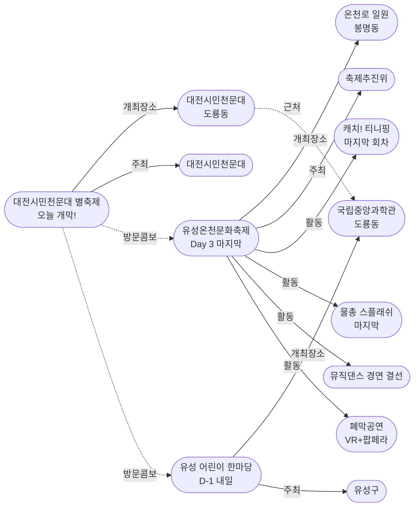

# 2026-05-04 대전 유성구 어린이·가족 이벤트 일일 보고서

## 요약

**황금연휴 Day 4 — 두 축제의 교차점.** 유성온천문화축제가 3일간의 여정을 마무리하는 마지막 날(폐막공연·뮤직댄스경연 결선·생활체조/생활무용 경연대회)이자, 대전시민천문대 별축제가 오늘 개막한다(과학체험부스 수십 개·태양관측·별음악회). 오전에 온천축제를 마무리하고 오후에 별축제로 이동하는 하루 코스가 가능하다. **내일(5/5 어린이날)이 황금연휴의 클라이맥스** — 유성 어린이 한마당(국립중앙과학관) + 별축제 Day 2(대전시민천문대)가 도룡동 과학벨트에서 동시 진행된다. 금일 신규 이벤트/가게 발견 없음.

## 용성로20 주변 (도보권 내)

### ring-stroll (1km 이내) — 전민동 클러스터 유지 (변동 없음)

| 시설 | 동 | 거리 | 유형 | 상태 |
|------|---|------|------|------|
| 아가랑도서관 | 전민동 | ~0.9km | 도서관 — 아가맘 행복교실 | 운영 중 (4/4~6/27) |
| 유성구 평생학습센터 전민센터 | 전민동 | ~0.8km | 공공기관 원데이클래스 | 운영 중 |
| 전민종합문화센터 | 전민동 | ~0.8km | 문화센터 | 기존 |

> 도보권 내 변동 없음. 전민동 3거점 클러스터 유지.

## 오늘의 추천 (가족 동반 Top 5)

| 순위 | 이벤트 | 장소 (동) | 대상 | 비용 | D-day |
|------|--------|----------|------|------|-------|
| 1 | **유성온천문화축제 Day 3** **[마지막 날!]** | 온천로 일원 (봉명동) | 전연령 가족 | 무료 (일부 유료) | **오늘 마지막** |
| 2 | **대전시민천문대 별축제** **[오늘 개막!]** | 대전시민천문대 (도룡동) | 전연령 가족 | 무료 | **오늘~5/5** |
| 3 | **유성 어린이 한마당** **[D-1 내일!]** | 국립중앙과학관 (도룡동) | 유아~초등·가족 | 무료 | **내일 5/5** |
| 4 | 가족뮤지컬 알라딘 (예정) | 국립중앙과학관 사이언스홀 (도룡동) | 유아~초등·가족 | 미확인 | 5/9~10 |
| 5 | 아가·맘 행복교실 | 아가랑도서관 (전민동, 0.9km) | 영유아 | 무료 | 운영 중 |

## 업데이트 항목

### 1. 유성온천문화축제 Day 3 — 폐막공연·뮤직댄스경연 결선으로 마무리

- **출처:** [행사 일정 | 유성온천문화축제](http://ysfesta.com/bbs/spafest.php?page_id=schedule), [충청투데이](https://www.cctoday.co.kr/news/articleView.html?idxno=2211163), [대전일보](https://www.daejonilbo.com/news/articleView.html?idxno=2198734)
- **장소:** 온천로·계룡스파텔 잔디광장·갑천변·유림공원 일원 (봉명동, ~5km, ring-car)
- **이전 상태:** Day 2 거리퍼레이드 (5/3)
- **금일 변경:** **Day 3 (최종일). 폐막공연 + 뮤직댄스 경연대회 결선 + 생활체조/생활무용 경연대회.**

| 프로그램 | 시간 | 장소 | 비고 |
|---------|------|------|------|
| **생활체조 경연대회** (Day 3 고유) | 오전 | 메인무대 | 유성구 체조협회 구청장배 |
| **생활무용 경연대회** (Day 3 고유) | 오전~오후 | 메인무대 | 유성구 생활무용협회 구청장배 |
| **뮤직&댄스 경연대회 결선** (Day 3 메인) | 오후 | 메인무대 | **전국 참가자 결선** |
| **폐막 식전공연** | 저녁 | 메인무대 | 레베로프 밴드, 팝페라 느루, 퓨전국악 소유 |
| **폐막공연** | 저녁 | 메인무대 | **메타버스&아바타 드로잉 VR퍼포먼스(염동균 작가) + 테너 류정필 & 코아모러스 팝페라** |
| **캐치! 티니핑 놀이&포토타임** | 1회 12시 / 2회 15시 | 계룡스파텔 메인무대 | **마지막 회차!** 선착순 50명, 1시간 전 우측 배부 |
| **온천수 물총 스플래쉬** | **15:00** | 온천로 | **마지막 물총 스플래쉬!** |
| 유성호 족욕 테마열차 | 종일 | 축제장 | 마지막 운영 |
| 온천수 수영장 | 11:00~20:00 | 축제장 | 마지막 운영 (45분 세션) |
| 체험부스 100여 개 + 숲속 힐링존 | 종일 | 축제장 일대 | 마지막 운영 |

> **오늘 방문 플래너 (마지막 날):**
> 10시 출발 → 11시 현장(티니핑 줄서기) → 12시 참여권 배부 → 관람 → 14시 경연대회 결선 감상 → 15시 마지막 물총 스플래쉬 → 족욕열차·수영장 → 저녁 폐막공연
>
> **교통:** 월평역 도보 15분 / 버스 102·104·106·108·113·121·706·특구1·마을5

### 2. 대전시민천문대 별축제 Day 1 — 오늘 개막!

- **출처:** [대전시민천문대 별축제 | 대전관광공사](https://daejeontour.co.kr/ko/festival/festivalView.do?festv_id=44), [대전광역시청](https://www.daejeon.go.kr/drh/board/boardNormalView.do?ntatcSeq=1480568937&menuSeq=6825&boardId=normal_0189)
- **장소:** 대전시민천문대 (도룡동, ~3km, ring-car)
- **이전 상태:** 내일 개막 (어제 보고)
- **금일 변경:** **D-day 개막! 과학체험부스 운영 시작.**

| 프로그램 | 내용 | 비고 |
|---------|------|------|
| **과학체험부스 (수십 개)** | 천문기관·출연연·학교·과학동아리 참여. 로켓 만들기, 우주 VR 체험 등 | 종일 운영 |
| **태양관측** | 천체망원경으로 태양 홍염·흑점 관측 | 주간 |
| **돔영상관** | 야외 돔영상 상영 | 종일 |
| **태양계 행성 모형 포토존** | 대형 행성·달 모형 포토존 | 종일 |
| **별음악회** | 대전시민오케스트라, 뮤지컬팀 미리내, 대전시민천문대 어린이합창단, 여행스케치&써니힐(은주) 콜라보 | 저녁 |
| **소원별추첨** | 천체망원경 등 경품 추첨 | 저녁 |
| **야간천체관측** | 행성·성운·성단 관측 | 야간 (영유아 부적합) |

**주의사항:**
- **5/4(일) 야외주차장에서 행사 진행 — 주차 불가! 대중교통 이용 권고.**
- 야간 관측은 영유아에게 부적합 (늦은 시간)
- 어린이 친화도: 0.85 (천문대 운영 가산 +0.2 적용)

> **내일(5/5) 도룡동 과학벨트 풀코스:**
> 오전 유성 어린이 한마당(국립중앙과학관) → 오후 별축제 Day 2(대전시민천문대)
> 두 장소 모두 도룡동, 도보/차량 5분 연계 가능.

## 내일을 위한 준비 — 유성 어린이 한마당 D-1 최종 안내

- **출처:** [유성구 어린이날 '유성 어린이 한마당' 개최 | 디트NEWS24](https://www.dtnews24.com/news/articleView.html?idxno=810991)
- **일시:** 2026년 5월 5일 (월, 어린이날)
- **장소:** 국립중앙과학관 중앙광장 일원 (도룡동, ~3km, ring-car)
- **비용:** 무료
- **사전신청:** 불필요
- **주최:** 유성구

| 카테고리 | 프로그램 |
|---------|---------|
| 공연 | 사이언스 매직쇼, 버블쇼 (사이언스홀), 매직버블쇼 (돔형 중앙통로) |
| 과학 체험 | 초코파이 진공실험, 밀가루 배터리시계, 무지개 망원경, 3D펜, 모루 인형 만들기 |
| 목공 체험 | '나무랑 놀꾸야' — 샤프·나무도마·나무자동차·독서대 등 16종 |
| 놀이 | 보드게임, 민속놀이 (플레이존) |
| 안전·권리 | 아동권리캠페인, 사전지문등록, 감염병예방, 손씻기체험 |

## 신규 오픈 가게·팝업·프로모션

금일 유성구 일대 신규 오픈 가게/팝업/프로모션 발견 없음.

## 공공기관 주최 행사

| 기관 | 행사 | 상태 | 비고 |
|------|------|------|------|
| 유성소방서 | 가정의 달 소방안전체험의 장 | 운영 중 (5월 내) | 사전신청 필요 |
| 유성구통합도서관 (관평) | 그림책, 나만의 보물을 담다 | 추가모집 중 | 유아~초등저학년 |
| 유성구통합도서관 | 지역작가 인(人) 도서관 | 5월 운영 중 | 6개 도서관 순회 |
| 아가랑도서관 (전민) | 아가·맘 행복교실 | 운영 중 (4/4~6/27) | 영유아 |
| 국립중앙과학관 | 가정의 달 시리즈 | 운영 중 | 다음: 5/9~10 알라딘 |

## 마감 임박 (사전신청 D-3 이내)

| 이벤트 | 마감 | 잔여 | 비고 |
|--------|------|------|------|
| 유성 어린이 한마당 | **내일 D-day** | 사전신청 불필요 | 현장 참여 |
| 별축제 | **오늘~내일** | 사전신청 불필요 | 현장 참여 |
| 온천축제 티니핑 | **오늘 마지막** | 선착순 50명x2회 | 11시 현장 도착 권장 |

## 동심원별 묶음

### ring-stroll (1km 이내) — 전민동
- 아가랑도서관 (아가맘 행복교실) — 운영 중
- 유성구 평생학습센터 전민센터 — 운영 중

### ring-bike (2km 이내) — 관평동
- 관평도서관 (그림책 프로그램) — 추가모집 중

### ring-car (5km 이내) — 도룡동·봉명동
- **대전시민천문대 별축제** (도룡동, ~3km) — **오늘 개막**
- **유성 어린이 한마당** (도룡동, ~3km) — 내일 D-day
- **유성온천문화축제** (봉명동, ~5km) — **오늘 마지막**
- 국립중앙과학관 가정의달 시리즈 (도룡동) — 운영 중
- 너티차일드 키즈테마파크 (도룡동, ~3.5km) — 상시

## 동(洞)별 이벤트 묶음

| 동 | 1차 타겟 | 금일 이벤트 |
|----|---------|------------|
| **도룡동** | O | 별축제 개막, 과학관 가정의달 시리즈, 너티차일드, 아쿠아리움 |
| **봉명동** | — | 온천축제 마지막날 |
| **전민동** | O | 아가맘 행복교실, 평생학습센터 |
| **관평동** | O | 관평도서관 그림책 프로그램 |
| 용산동 | O | 금일 해당 없음 |
| 문지동 | O | 금일 해당 없음 |
| 신성동 | O | 금일 해당 없음 |

## 연령대별 묶음

| 연령대 | 추천 이벤트 |
|--------|-----------|
| 영유아 (0~3) | 아가맘 행복교실 (전민동) |
| 유아 (4~6) | 온천축제 티니핑(마지막), 별축제 체험부스, 내일 어린이 한마당 |
| 초등저학년 (7~9) | 별축제 과학체험·태양관측, 온천축제 물총, 내일 어린이 한마당 과학체험·목공 |
| 초등고학년 (10~12) | 별축제 야간관측, 온천축제 경연대회, 내일 어린이 한마당 3D펜·과학실험 |
| 전연령 가족 | 온천축제 → 별축제 하루 코스, 내일 도룡동 풀코스 |

## 시리즈/정기 프로그램 업데이트

| 시리즈 | 금일 상태 | 다음 일정 |
|--------|---------|----------|
| 국립중앙과학관 가정의 달 | 운영 중 (동심 로그인 종료) | 5/9~10 가족뮤지컬 알라딘 |
| 유성소방서 안전체험 | 5월 운영 중 | 사전신청 후 방문 |
| 유성구 도서관 프로그램 | 운영 중 | 북스타트·그림책·지역작가 |
| 탐이꿈이의 비밀 실험실 | 운영 중 (~6/30) | 국립어린이과학관 사전신청 |

## 지식그래프 시각화

### 오늘의 주요 관계

오늘의 핵심은 **두 축제의 교차** — 유성온천문화축제(ent-evt-021)가 Day 3 폐막을 맞이하면서 새로운 Activity 2건(경연결선·폐막공연)이 추가되었고, 동시에 대전시민천문대 별축제(ent-evt-030)가 개막하여 두 축제가 동시 진행된다. 내일 별축제는 어린이 한마당(ent-evt-020)과 도룡동에서 합류하여 황금연휴 클라이맥스를 형성한다.

### 전체 지식그래프 시각화

### 황금연휴 타임라인 그래프

## 온톨로지 변경

| 변경 유형 | 대상 | 근거 |
|----------|------|------|
| 새 Activity | ent-act-011 뮤직&댄스 경연대회 결선 | 온천축제 Day 3 고유 프로그램 |
| 새 Activity | ent-act-012 폐막공연 (VR+팝페라) | 온천축제 Day 3 고유 마감 공연. 식전: 레베로프·느루·소유 |

## 추론 결과

| 추론 | 신뢰도 | 근거 |
|------|--------|------|
| 별축제 + 온천축제 방문콤보 | 0.70 | 동시 진행(도룡동 ↔ 봉명동, 차량 15분) |
| 별축제 Day 2 + 어린이 한마당 (신뢰도 상향) | 0.85 | 내일 동일 동(도룡동), D-1 확정 (0.80 → 0.85) |
| Day 3 프로그램 체계 완성 | 0.90 | Day1=개막+드론, Day2=퍼레이드, Day3=경연+폐막 |
| 골든위크 Day 4 교차점 | 0.95 | 온천축제 폐막 + 별축제 개막 = 두 축제 교차 |

## 분석 및 평가

오늘은 황금연휴 5일 연속 가족 행사의 **4일째이자 전환점**이다. 유성온천문화축제(봉명동)가 3일간의 여정을 마무리하고, 대전시민천문대 별축제(도룡동)가 개막하면서 행사의 무게중심이 봉명동에서 도룡동으로 이동한다.

**오늘의 핵심 선택지:**
- **온천축제 올인 코스:** 오전 생활체조/무용 경연 관람 → 11시 티니핑 줄서기(마지막) → 오후 뮤직댄스 결선 → 15시 마지막 물총 스플래쉬 → 저녁 폐막공연(VR+팝페라)
- **별축제 선택:** 오후 별축제 과학체험부스 → 저녁 별음악회(시민오케스트라·어린이합창단) → 소원별추첨 → 야간 천체관측
- **하이브리드:** 오전 온천축제 → 오후 별축제 이동 (차량 15분)

**내일(5/5) 최적 동선:**
국립중앙과학관(어린이 한마당, 오전) → 대전시민천문대(별축제 Day 2, 오후) = 도룡동 과학벨트 풀코스

## 추적 항목

| 항목 | 최초 보고 | 상태 | 최신 업데이트 |
|------|----------|------|-------------|
| 유성온천문화축제 | 2026-04-27 | **오늘 폐막** | Day 3 마지막날 |
| 대전시민천문대 별축제 | 2026-05-03 | **오늘 개막** | Day 1 |
| 유성 어린이 한마당 | 2026-04-27 | D-1 | 내일 D-day |
| 과학관 가정의달 시리즈 | 2026-04-30 | 운영 중 | 다음: 5/9 알라딘 |
| 소방서 안전체험 | 2026-04-26 | 운영 중 | 5월 내 |
| 도서관 프로그램 | 2026-04-25 | 운영 중 | 북스타트·그림책·작가 |

## 동향 요약

| 분류 | 상태 | 비고 |
|------|------|------|
| 어린이·가족 이벤트 | 온천축제 폐막 + 별축제 개막 + 한마당 D-1 | 황금연휴 4일째 |
| 신규 가게/팝업 | **금일 신규 없음** | — |
| 공공기관 행사 | 소방서·도서관·과학관 운영 중 | 가정의달 시즌 계속 |

## 출처 목록

1. [행사 일정 | 유성온천문화축제](http://ysfesta.com/bbs/spafest.php?page_id=schedule) - 유성온천문화축제 공식, 2026-05-04
2. [대전시민천문대 별축제 | 대전관광공사](https://daejeontour.co.kr/ko/festival/festivalView.do?festv_id=44) - 대전관광공사, 2026-05-04
3. [유성구 어린이날 '유성 어린이 한마당' 개최 | 디트NEWS24](https://www.dtnews24.com/news/articleView.html?idxno=810991) - 디트NEWS24, 2026-04-27
4. [유성온천문화축제 | 대한민국 구석구석](https://korean.visitkorea.or.kr/kfes/detail/fstvlDetail.do?fstvlCntntsId=2fcee4ea-7f88-4485-a67b-d4a88ee78320) - 한국관광공사
5. [대전시민천문대 별축제 | 대한민국 구석구석](https://korean.visitkorea.or.kr/kfes/detail/fstvlDetail.do?fstvlCntntsId=306fb919-36d3-48d9-85cf-7d2247ad580c) - 한국관광공사
6. [국립중앙과학관 행사안내](https://www.science.go.kr/mps/1070/bbs/431/moveBbsNttList.do) - 국립중앙과학관
7. [유성구통합도서관 행사신청](https://lib.yuseong.go.kr/web/program/lectureDetail.do?lectureIdx=11956) - 유성구통합도서관
8. [유성구 지역작가 인 도서관 운영 | 페디앙](https://pedien.com/html/view.php?idx=1014924) - 페디앙
9. [30년째 이어지는 감동 유성온천문화축제 | 충청투데이](https://www.cctoday.co.kr/news/articleView.html?idxno=2211163) - 충청투데이
10. [유성온천문화축제 일정 | 대전일보](https://www.daejonilbo.com/news/articleView.html?idxno=2198734) - 대전일보
11. [대전시민천문대 별축제 | 대전광역시청](https://www.daejeon.go.kr/drh/board/boardNormalView.do?ntatcSeq=1480568937&menuSeq=6825&boardId=normal_0189) - 대전광역시청
12. [Cities Transform Into Kids' Playgrounds | Seoul Economic Daily](https://en.sedaily.com/society/2026/04/26/cities-nationwide-transform-into-kids-playgrounds-this-may) - 서울경제(영문), 2026-04-26
13. [소방체험안내 | 대전광역시 소방본부](https://daejeon.go.kr/dj119/CmmContentsHtmlView.do?menuSeq=4462) - 대전광역시 소방본부
