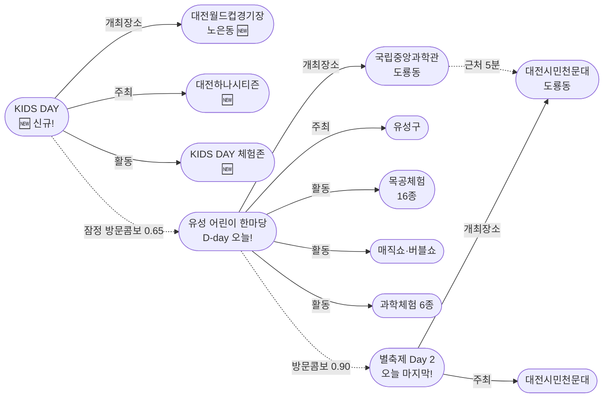

# 2026-05-05 대전 유성구 어린이·가족 이벤트 일일 보고서

## 요약

**어린이날 D-day — 황금연휴 클라이맥스.** 오늘 유성구에서 3개 어린이날 행사가 동시 진행된다: (1) **유성 어린이 한마당**(국립중앙과학관, 도룡동) — 과학·목공·공연·안전체험 무료 복합 축제, (2) **대전시민천문대 별축제 Day 2**(마지막, 도룡동) — 수십 개 과학체험부스·별음악회, (3) **대전하나시티즌 KIDS DAY**(대전월드컵경기장, 노은동) — 어린이 티켓 1,000원 + 페이스페인팅·에어바운스 체험존 **[신규 발견]**. 도룡동 과학벨트 풀코스(오전 과학관→오후 천문대)가 확정된 날이자, 5/2~5/5 황금연휴 5일 연속 가족 행사의 마지막 날이다.

## 용성로20 주변 (도보권 내)

### ring-stroll (1km 이내) — 전민동 클러스터 유지 (변동 없음)

| 시설 | 동 | 거리 | 유형 | 상태 |
|------|---|------|------|------|
| 아가랑도서관 | 전민동 | ~0.9km | 도서관 — 아가맘 행복교실 | 운영 중 (4/4~6/27) |
| 유성구 평생학습센터 전민센터 | 전민동 | ~0.8km | 공공기관 원데이클래스 | 운영 중 |
| 전민종합문화센터 | 전민동 | ~0.8km | 문화센터 | 기존 |

> 도보권 내 변동 없음. 전민동 3거점 클러스터 유지. 오늘은 도룡동 행사 집중일.

## 오늘의 추천 (가족 동반 Top 5)

| 순위 | 이벤트 | 장소 (동) | 대상 | 비용 | 비고 |
|------|--------|----------|------|------|------|
| 1 | **유성 어린이 한마당** | 국립중앙과학관 (도룡동) | 유아~초등·가족 | **무료** | **D-day 오늘!** 예약 불필요 |
| 2 | **대전시민천문대 별축제** | 대전시민천문대 (도룡동) | 전연령 가족 | **무료** | **오늘 마지막!** |
| 3 | **대전하나시티즌 KIDS DAY** 🆕 | 대전월드컵경기장 (노은동) | 전연령 가족 | 어린이 1,000원 | **신규!** K리그 + 체험존 |
| 4 | 아가·맘 행복교실 | 아가랑도서관 (전민동, 0.9km) | 영유아 | 무료 | 운영 중 |
| 5 | 가족뮤지컬 알라딘 (예정) | 국립중앙과학관 사이언스홀 (도룡동) | 유아~초등·가족 | 미확인 | 5/9~10 |

## 신규 이벤트

### 대전하나시티즌 KIDS DAY — 어린이날 K리그 가족 축제

- **출처:** [대전하나시티즌, 어린이날 맞아 'KIDS DAY' 개최 | 충청투데이](https://www.cctoday.co.kr/news/articleView.html?idxno=2229594)
- **일시:** 2026년 5월 5일 (월, 어린이날)
- **장소:** 대전월드컵경기장 (노은동, ~4km, ring-car)
- **경기:** K리그1 12라운드 대전 vs 인천 유나이티드
- **비용:** 어린이 W·E·S·N 구역 **1,000원** / 예매 수수료 없음
- **예매:** 하나원큐 앱 또는 현장 예매 가능
- **사전신청:** 불필요 (현장 참여 가능)
- **어린이 친화도:** 0.80

| 프로그램 | 내용 | 비고 |
|---------|------|------|
| 페이스페인팅 | 경기장 외부 체험존 | 어린이 무료 |
| 슈팅 에어바운스 | 축구 슈팅 + 에어바운스 | 어린이 전용 |
| '무한의 계단' K리그 협업 부스 | 모바일 게임 현장 플레이 | 참가자 전원 한정판 유니폼 스킨 또는 마스코트 펫 쿠폰 |

> **참고:** 대전월드컵경기장은 대전광역시어린이회관(동관 1층)과 같은 건물 단지. KIDS DAY 전후 어린이회관 방문도 가능.

## 업데이트 항목

### 1. 유성 어린이 한마당 D-day — 어린이날 오늘 개최!

- **출처:** [유성구 어린이날 '유성 어린이 한마당' 개최 | 디트NEWS24](https://www.dtnews24.com/news/articleView.html?idxno=810991), [충청매일](https://www.ccdn.co.kr/news/articleView.html?idxno=1075693)
- **장소:** 국립중앙과학관 중앙광장 일원 (도룡동, ~3km, ring-car)
- **이전 상태:** D-1 (어제)
- **금일 변경:** **D-day 도래! 오늘 개최!**

| 카테고리 | 프로그램 | 대상 |
|---------|---------|------|
| 공연 | 사이언스 매직쇼, 버블쇼 (사이언스홀), 매직버블쇼 (돔형 중앙통로) | 전연령 |
| 과학 체험 | 초코파이 진공실험, 밀가루 배터리시계, 무지개 망원경, 3D펜, 모루 인형 | 초등 |
| 목공 체험 | '나무랑 놀꾸야' — 16종 목공 (샤프·나무도마·나무자동차·독서대 등) | 유아~초등 |
| 놀이 | 보드게임, 민속놀이 (플레이존) | 전연령 |
| 안전·권리 | 아동권리캠페인, 사전지문등록, 감염병예방, 손씻기체험 | 전연령 |

- **비용:** 무료
- **사전신청:** 불필요
- **주최:** 유성구 (구청장배 어린이날 행사)
- **어린이 친화도:** 0.95

### 2. 대전시민천문대 별축제 Day 2 — 오늘 마지막!

- **출처:** [대전시민천문대 별축제 | 대전관광공사](https://daejeontour.co.kr/ko/festival/festivalView.do?festv_id=44), [대전시민천문대](https://djstar.kr/)
- **장소:** 대전시민천문대 (도룡동, ~3km, ring-car)
- **이전 상태:** Day 1 개막 (어제)
- **금일 변경:** **Day 2 마지막 날. 어린이 한마당과 도룡동 풀코스 형성.**

| 프로그램 | 내용 | 비고 |
|---------|------|------|
| 과학체험부스 (수십 개) | 천문기관·출연연·학교·동아리 부스 | 종일 |
| 태양관측 | 천체망원경 태양 홍염·흑점 | 주간 |
| 돔영상관 | 야외 돔영상 상영 | 종일 |
| 태양계 행성 포토존 | 대형 행성·달 모형 | 종일 |
| 별음악회 | 대전시민오케스트라, 뮤지컬팀 미리내, 어린이합창단, 써니힐(은주) | 저녁 |
| 소원별추첨 | 천체망원경 등 경품 | 저녁 |
| 야간천체관측 | 행성·성운·성단 | 야간 (영유아 부적합) |

- **비용:** 무료
- **5/5 주차:** 가능 (어제 5/4은 야외주차장 행사로 불가했으나 오늘은 정상 주차)
- **어린이 친화도:** 0.85

> **도룡동 과학벨트 풀코스 (오늘 최적 동선):**
> 오전 유성 어린이 한마당(국립중앙과학관) → 오후 별축제 Day 2(대전시민천문대)
> 두 장소 모두 도룡동, 도보/차량 5분 연계.

## 신규 오픈 가게·팝업·프로모션

금일 유성구 일대 신규 오픈 가게/팝업/프로모션 발견 없음.

## 공공기관 주최 행사 (행정복지센터·보건소·복지관·도서관·우체국·경찰서·소방서)

| 기관 | 행사 | 상태 | 비고 |
|------|------|------|------|
| 유성구 (구청) | **유성 어린이 한마당** | **오늘 D-day** | 무료·예약 불필요 |
| 대전시민천문대 | **별축제** | **오늘 마지막** | 무료 |
| 유성소방서 | 가정의 달 소방안전체험의 장 | 운영 중 (5월 내) | 사전신청 필요 |
| 유성구통합도서관 (관평) | 그림책, 나만의 보물을 담다 | 추가모집 중 | 유아~초등저학년 |
| 유성구통합도서관 | 지역작가 인(人) 도서관 | 5월 운영 중 | 6개 도서관 순회 |
| 아가랑도서관 (전민) | 아가·맘 행복교실 | 운영 중 (4/4~6/27) | 영유아 |
| 국립중앙과학관 | 가정의 달 시리즈 | 운영 중 | 다음: 5/9~10 알라딘 |

## 마감 임박 (사전신청 D-3 이내)

| 이벤트 | 마감 | 잔여 | 비고 |
|--------|------|------|------|
| 유성 어린이 한마당 | **오늘 D-day** | 사전신청 불필요 | 현장 참여 |
| 별축제 | **오늘 마지막** | 사전신청 불필요 | 현장 참여 |
| KIDS DAY | **오늘** | 현장 예매 가능 | 어린이 1,000원 |

## 동심원별 묶음 (0.5km / 1km / 2km / 5km)

### ring-stroll (1km 이내) — 전민동
- 아가랑도서관 (아가맘 행복교실) — 운영 중
- 유성구 평생학습센터 전민센터 — 운영 중

### ring-bike (2km 이내) — 관평동
- 관평도서관 (그림책 프로그램) — 추가모집 중

### ring-car (5km 이내) — 도룡동·노은동
- **유성 어린이 한마당** (도룡동, ~3km) — **오늘 D-day!**
- **대전시민천문대 별축제** (도룡동, ~3km) — **오늘 마지막!**
- **대전하나시티즌 KIDS DAY** (노은동, ~4km) — **오늘! [신규]**
- 국립중앙과학관 가정의달 시리즈 (도룡동) — 운영 중
- 너티차일드 키즈테마파크 (도룡동, ~3.5km) — 상시
- 대전광역시어린이회관 (노은동, ~4km) — 상시

## 동(洞)별 이벤트 묶음

| 동 | 1차 타겟 | 금일 이벤트 |
|----|---------|------------|
| **도룡동** | O | **어린이 한마당(D-day) + 별축제(마지막)** = 과학벨트 풀코스 |
| **노은동** | — | **KIDS DAY(신규)** + 어린이회관 상시 |
| **전민동** | O | 아가맘 행복교실, 평생학습센터 |
| **관평동** | O | 관평도서관 그림책 프로그램 |
| 용산동 | O | 금일 해당 없음 |
| 문지동 | O | 금일 해당 없음 |
| 신성동 | O | 금일 해당 없음 |

## 연령대별 묶음

| 연령대 | 추천 이벤트 |
|--------|-----------|
| 영유아 (0~3) | 아가맘 행복교실 (전민동, 0.9km) |
| 유아 (4~6) | 어린이 한마당 목공·버블쇼, 별축제 체험부스, KIDS DAY 페이스페인팅 |
| 초등저학년 (7~9) | 어린이 한마당 과학체험 6종·매직쇼, 별축제 태양관측·체험부스, KIDS DAY 에어바운스 |
| 초등고학년 (10~12) | 어린이 한마당 3D펜·과학실험, 별축제 야간관측, KIDS DAY 무한의계단 게임부스 |
| 전연령 가족 | **도룡동 풀코스**(오전 한마당→오후 별축제) 또는 **노은동 스포츠 코스**(KIDS DAY + 어린이회관) |

## 시리즈/정기 프로그램 업데이트

| 시리즈 | 금일 상태 | 다음 일정 |
|--------|---------|----------|
| 국립중앙과학관 가정의 달 | 어린이 한마당 D-day | **5/9~10 가족뮤지컬 알라딘** |
| 유성소방서 안전체험 | 5월 운영 중 | 사전신청 후 방문 |
| 유성구 도서관 프로그램 | 운영 중 | 북스타트·그림책·지역작가 |
| 탐이꿈이의 비밀 실험실 | 운영 중 (~6/30) | 국립어린이과학관 사전신청 |
| 유성온천문화축제 | **종료** (어제 폐막) | 다음 시즌 미정 |

## 지식그래프 시각화

### 오늘의 주요 관계

어린이날 D-day에 유성구 두 권역에서 동시다발 가족 행사가 진행된다: **도룡동 과학벨트**(어린이 한마당 + 별축제)와 **노은동 스포츠존**(KIDS DAY + 어린이회관). 5/2부터 이어진 황금연휴 5일 연속 가족 행사가 오늘로 완결된다. 다음 주요 행사는 5/9~10 가족뮤지컬 알라딘(과학관).

### 전체 지식그래프 시각화

### 황금연휴 완결 타임라인

## 온톨로지 변경

| 변경 유형 | 대상 | 근거 |
|----------|------|------|
| 새 Event | ent-evt-031 대전하나시티즌 KIDS DAY | 어린이날 K리그 가족 이벤트 신규 발견 |
| 새 Venue | ent-venue-020 대전월드컵경기장 | 노은동 소재 경기장 (어린이회관과 같은 단지) |
| 새 Organization | ent-org-018 대전하나시티즌 | K리그1 프로축구단 |
| 새 Activity | ent-act-013 KIDS DAY 체험존 | 페이스페인팅·에어바운스·게임부스 |

## 추론 결과

| 추론 | 신뢰도 | 근거 |
|------|--------|------|
| 어린이 한마당 + 별축제 방문콤보 (상향) | 0.90 | D-day 동일 동(도룡동) 동시 진행 확정 |
| 대전월드컵경기장 ↔ 어린이회관 근접 | 0.95 | 동일 건물 단지 (월드컵대로 32) |
| KIDS DAY + 어린이 한마당 방문콤보 | 0.65 (잠정) | 같은 날, 다른 동(노은동↔도룡동, 차량 15분) |
| 황금연휴 5일 타임라인 완결 | 0.95 | 5/2~5/5 연속 가족 행사 최종일 |
| 유성온천문화축제 완전 종료 | 0.99 | 어제(5/4) 폐막 완료 |

## 분석 및 평가

오늘은 **어린이날**이자 **황금연휴 5일 연속 가족 행사의 클라이맥스**이다.

**오늘의 3가지 선택지:**

1. **도룡동 과학벨트 풀코스 (추천 1순위)**
   - 오전: 유성 어린이 한마당 (국립중앙과학관) — 목공·과학실험·매직쇼·안전교육
   - 오후: 별축제 Day 2 (대전시민천문대) — 과학체험부스·태양관측
   - 저녁: 별음악회 (시민오케스트라·어린이합창단)
   - 야간: 천체관측 (초등고학년 이상)
   - 장점: 무료·예약 불필요·같은 동 5분 거리·오늘만 가능한 조합

2. **노은동 스포츠 코스 (스포츠 가족 추천)**
   - 대전하나시티즌 KIDS DAY — K리그 축구 관람 + 체험존
   - 경기 전후 대전광역시어린이회관 방문 가능 (같은 건물 단지)
   - 장점: 어린이 1,000원 저렴·게임 부스(무한의계단)·유니폼 쿠폰

3. **하이브리드 (체력 좋은 가족)**
   - 오전 어린이 한마당(도룡동) → 오후 KIDS DAY(노은동, 차량 15~20분) → 저녁 별축제 별음악회(도룡동 복귀)
   - 주의: 이동 시간 + 주차 부담. 체력 소모 큼

**이번 황금연휴 총 리뷰:**
5/2(온천축제 개막) → 5/3(거리퍼레이드·티니핑) → 5/4(온천축제 폐막+별축제 개막) → **5/5(어린이 한마당+별축제+KIDS DAY)** = 5일 연속 매일 대형 가족 행사. 유성구의 "가정의 달" 행사 밀도가 매우 높았던 주간.

**다음 주요 일정:** 5/9~10 가족뮤지컬 알라딘 (국립중앙과학관 사이언스홀)

## 추적 항목

| 항목 | 최초 보고 | 상태 | 최신 업데이트 |
|------|----------|------|-------------|
| 유성 어린이 한마당 | 2026-04-27 | **D-day 오늘** | 어린이날 개최 |
| 대전시민천문대 별축제 | 2026-05-03 | **오늘 마지막** | Day 2 |
| 유성온천문화축제 | 2026-04-27 | **종료** | 어제(5/4) 폐막 |
| 대전하나시티즌 KIDS DAY | 2026-05-05 | **오늘 (신규)** | 첫 보고 |
| 과학관 가정의달 시리즈 | 2026-04-30 | 운영 중 | 다음: 5/9 알라딘 |
| 소방서 안전체험 | 2026-04-26 | 운영 중 | 5월 내 |
| 도서관 프로그램 | 2026-04-25 | 운영 중 | 북스타트·그림책·작가 |

## 동향 요약

| 분류 | 상태 | 비고 |
|------|------|------|
| 어린이·가족 이벤트 | **어린이 한마당(D-day) + 별축제(마지막) + KIDS DAY(신규)** | 황금연휴 클라이맥스 |
| 신규 가게/팝업 | **금일 신규 없음** | — |
| 공공기관 행사 | 유성구 한마당 + 천문대 별축제 + 소방서·도서관 운영 중 | 가정의달 시즌 |

## 출처 목록

1. [유성구 어린이날 '유성 어린이 한마당' 개최 | 디트NEWS24](https://www.dtnews24.com/news/articleView.html?idxno=810991) - 디트NEWS24, 2026-04-27
2. [대전시민천문대 별축제 | 대전관광공사](https://daejeontour.co.kr/ko/festival/festivalView.do?festv_id=44) - 대전관광공사, 2026-05-05
3. [대전하나시티즌, 어린이날 맞아 'KIDS DAY' 개최 | 충청투데이](https://www.cctoday.co.kr/news/articleView.html?idxno=2229594) - 충청투데이, 2026-05-05
4. [대전 유성구, 어린이날 '어린이 한마당' 개최…과학·체험 축제 | 충청매일](https://www.ccdn.co.kr/news/articleView.html?idxno=1075693) - 충청매일, 2026-04-27
5. [대전시민천문대 별축제 | 대한민국 구석구석](https://korean.visitkorea.or.kr/kfes/detail/fstvlDetail.do?fstvlCntntsId=306fb919-36d3-48d9-85cf-7d2247ad580c) - 한국관광공사
6. [국립중앙과학관 행사안내](https://www.science.go.kr/mps/1070/bbs/431/moveBbsNttList.do) - 국립중앙과학관
7. [유성구통합도서관 행사신청](https://lib.yuseong.go.kr/web/program/lectureDetail.do?lectureIdx=11956) - 유성구통합도서관
8. [유성구 지역작가 인 도서관 운영 | 페디앙](https://pedien.com/html/view.php?idx=1014924) - 페디앙
9. [대전시민천문대 | 대전광역시청](https://www.daejeon.go.kr/drh/board/boardNormalView.do?ntatcSeq=1480568937&menuSeq=6825&boardId=normal_0189) - 대전광역시청
10. [소방체험안내 | 대전광역시 소방본부](https://daejeon.go.kr/dj119/CmmContentsHtmlView.do?menuSeq=4462) - 대전광역시 소방본부
11. [대전시민천문대](https://djstar.kr/) - 대전시민천문대 공식
12. [대전하나시티즌](https://www.dhcfc.kr/) - 대전하나시티즌 공식
13. [Cities Transform Into Kids' Playgrounds | Seoul Economic Daily](https://en.sedaily.com/society/2026/04/26/cities-nationwide-transform-into-kids-playgrounds-this-may) - 서울경제(영문)
