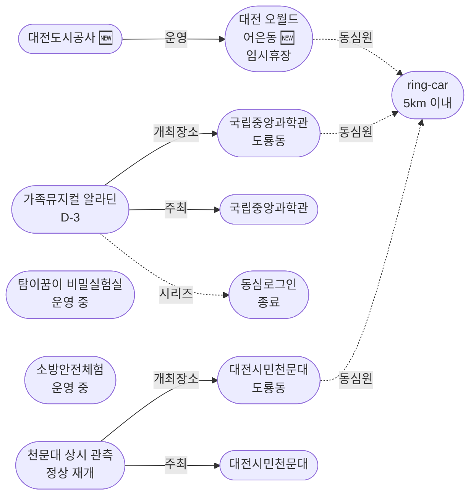

# 2026-05-06 대전 유성구 어린이·가족 이벤트 일일 보고서

## 요약

**포스트 황금연휴 — 일상 복귀.** 5/2~5/5 연속 5일간 대형 가족 행사(온천축제·별축제·어린이 한마당·KIDS DAY)가 모두 종료되었다. 오늘부터 유성구는 정기 프로그램 중심의 일상 밀도로 복귀한다. 신규로 **대전 오월드(어은동, 4.5km) 재개장 검토** 소식이 포착되었다 — 늑대 탈출 사고 후 시설 보수 중이던 대형 가족 시설이 5월 가정의달에 맞춰 부분 개장을 검토 중이나 불확실성이 크다. 다음 주요 행사는 **5/9~10 가족뮤지컬 알라딘(국립중앙과학관, D-3)**이며, **대전시민천문대**는 오늘(화)부터 정상 운영을 재개했다.

## 용성로20 주변 (도보권 내)

### ring-stroll (1km 이내) — 전민동 클러스터 유지 (변동 없음)

| 시설 | 동 | 거리 | 유형 | 상태 |
|------|---|------|------|------|
| 아가랑도서관 | 전민동 | ~0.9km | 도서관 — 아가맘 행복교실 | 운영 중 (4/4~6/27) |
| 유성구 평생학습센터 전민센터 | 전민동 | ~0.8km | 공공기관 원데이클래스 | 운영 중 |
| 전민종합문화센터 | 전민동 | ~0.8km | 문화센터 | 기존 |

> 도보권 내 변동 없음. 전민동 3거점 클러스터 유지.

## 오늘의 추천 (가족 동반 Top 5)

| 순위 | 이벤트 | 장소 (동) | 대상 | 비용 | 비고 |
|------|--------|----------|------|------|------|
| 1 | **대전시민천문대 상시 관측** | 대전시민천문대 (도룡동) | 전연령 가족 | **무료** | 오늘 정상 운영 재개! |
| 2 | **가족뮤지컬 알라딘** (예정) | 국립중앙과학관 사이언스홀 (도룡동) | 유아~초등·가족 | 유료 | **D-3** (5/9~10) |
| 3 | 탐이꿈이의 비밀 실험실 | 국립어린이과학관 (도룡동) | 유아~초등저학년 | 유료 | 운영 중 (~6/30) |
| 4 | 아가·맘 행복교실 | 아가랑도서관 (전민동, 0.9km) | 영유아 | 무료 | 운영 중 |
| 5 | 그림책, 나만의 보물을 담다 | 관평도서관 (관평동, 1.8km) | 유아~초등저학년 | 무료 | 운영 중 |

## 신규 이벤트

### 대전 오월드 재개장 검토 — 늑대 탈출 사고 후 가정의달 맞아 부분 개장 가능성

- **출처:** [어린이날 '늑구' 볼 수 있을까… 대전 오월드 '5월 재개장' 검토한다 | 대전일보](https://www.daejonilbo.com/news/articleView.html?idxno=2270280)
- **보조 출처:** [늑구 탈출 여파 길어진다…대전 오월드, '5월 재개장' 어려울 듯 | 머니투데이](https://www.mt.co.kr/society/2026/04/27/2026042714451851213)
- **장소:** 대전 오월드 (어은동, ~4.5km, ring-car)
- **현재 상태:** 임시휴장 중
- **검토 사항:** 5월 가정의달에 맞춰 재개장 검토. 늑대 '늑구' 포획 후 회복·안정 + 동물원 시설 보수·보강 진행 중.
- **불확실성:** 머니투데이(4/27) 보도에서는 "5월 말까지 재개장 불가" 통보, 대전일보 후속 보도에서는 "5월 재개장 검토"로 상충. 확정 시까지 추적.
- **어린이 친화도:** 0.90 (테마파크·동물원 유형)
- **실내·야외:** 야외+실내

> **추적 개시:** 대전 오월드는 유성구 어은동 소재 대형 가족 나들이 시설(동물원+놀이공원+플라워랜드). 재개장 확정 시 ring-car 내 주요 추천 옵션으로 부상할 예정. 확정 소식을 계속 추적한다.

## 업데이트 항목

### 1. 가족뮤지컬 알라딘 D-3 — 예매 확인 필요

- **출처:** [국립중앙과학관 행사안내](https://www.science.go.kr/mps/1070/bbs/431/moveBbsNttList.do)
- **보조 출처:** [NOL 티켓 | 2026 라이브 가족뮤지컬 알라딘](https://tickets.interpark.com/contents/notice/detail/13108)
- **일시:** 2026년 5월 9일(금)~10일(토)
- **장소:** 국립중앙과학관 사이언스홀 (도룡동, ~3km, ring-car)
- **이전 상태:** 예정 (5/5 보고서)
- **금일 변경:** **D-3 진입 — 마감 임박 카테고리 해당**
- **비용:** 유료 (추정)
- **사전신청:** 필요 (예매)
- **대상:** 유아~초등, 전연령 가족
- **어린이 친화도:** 0.95
- **시리즈:** 국립중앙과학관 가정의달 시리즈 3번째 (동심로그인 5/1~3 → 어린이한마당 5/5 → **알라딘 5/9~10**)

### 2. 대전시민천문대 정상 운영 재개

- **출처:** [대전시민천문대](https://djstar.kr/)
- **장소:** 대전시민천문대 (도룡동, ~3km, ring-car)
- **이전 상태:** 별축제 Day 2 마지막 (5/5 보고서)
- **금일 변경:** 별축제 종료 → **정상 운영 재개 (화~일 14:00~22:00)**
- **프로그램:** 태양관측(주간), 야간천체관측, 천문교실
- **비용:** 무료
- **사전신청:** 불필요 (당일 방문)
- **어린이 친화도:** 0.85
- **참고:** 월요일 휴관. 오늘(화요일)부터 바로 방문 가능. 별축제를 놓친 가족에게 좋은 대안.

## 신규 오픈 가게·팝업·프로모션

금일 유성구 일대 신규 오픈 가게/팝업/프로모션 발견 없음.

## 공공기관 주최 행사 (행정복지센터·보건소·복지관·도서관·우체국·경찰서·소방서)

| 기관 | 행사 | 상태 | 비고 |
|------|------|------|------|
| 유성소방서 | 가정의 달 소방안전체험의 장 | 운영 중 (5월 내) | 사전신청 필요 |
| 유성구통합도서관 (관평) | 그림책, 나만의 보물을 담다 | 운영 중 | 유아~초등저학년 |
| 유성구통합도서관 | 지역작가 인(人) 도서관 | 5월 운영 중 | 6개 도서관 순회 |
| 아가랑도서관 (전민) | 아가·맘 행복교실 | 운영 중 (4/4~6/27) | 영유아 |
| 국립중앙과학관 | 가정의 달 시리즈 | 운영 중 | 다음: 5/9~10 알라딘 **(D-3)** |
| 대전시민천문대 | 상시 관측 프로그램 | **정상 운영 재개** | 오늘부터 방문 가능 |

## 마감 임박 (사전신청 D-3 이내)

| 이벤트 | 일시 | D-day | 비고 |
|--------|------|-------|------|
| **가족뮤지컬 알라딘** | 5/9(금)~10(토) | **D-3** | 국립중앙과학관 사이언스홀, 예매 필요 |

## 동심원별 묶음 (0.5km / 1km / 2km / 5km)

### ring-stroll (1km 이내) — 전민동
- 아가랑도서관 (아가맘 행복교실) — 운영 중
- 유성구 평생학습센터 전민센터 — 운영 중

### ring-bike (2km 이내) — 관평동
- 관평도서관 (그림책 프로그램) — 운영 중

### ring-car (5km 이내) — 도룡동·어은동·노은동
- **가족뮤지컬 알라딘** (도룡동, ~3km) — **D-3 (5/9~10)**
- **대전시민천문대 상시 관측** (도룡동, ~3km) — **정상 운영 재개 (오늘부터)**
- 탐이꿈이의 비밀 실험실 (도룡동, ~3km) — 운영 중 (~6/30)
- 국립중앙과학관 (도룡동, ~3km) — 상시
- 대전 오월드 (어은동, ~4.5km) — **임시휴장 (재개장 검토 중)** 🆕
- 너티차일드 키즈테마파크 (도룡동, ~3.5km) — 상시
- 대전광역시어린이회관 (노은동, ~4km) — 상시

## 동(洞)별 이벤트 묶음

| 동 | 1차 타겟 | 금일 이벤트 |
|----|---------|------------|
| **도룡동** | O | 천문대 정상 재개 + 탐이꿈이 + 알라딘(D-3) |
| **전민동** | O | 아가맘 행복교실, 평생학습센터 |
| **관평동** | O | 관평도서관 그림책 프로그램 |
| **어은동** | — | **대전 오월드 재개장 검토 [신규 추적]** |
| 용산동 | O | 금일 해당 없음 |
| 문지동 | O | 금일 해당 없음 |
| 신성동 | O | 금일 해당 없음 |
| 노은동 | — | 어린이회관 상시 |

## 연령대별 묶음

| 연령대 | 추천 이벤트 |
|--------|-----------|
| 영유아 (0~3) | 아가맘 행복교실 (전민동, 0.9km) |
| 유아 (4~6) | 탐이꿈이 비밀실험실 (도룡동), 그림책 프로그램 (관평동) |
| 초등저학년 (7~9) | 천문대 태양관측 (도룡동), 그림책 프로그램 (관평동), 알라딘(D-3) |
| 초등고학년 (10~12) | 천문대 야간관측 (도룡동), 알라딘(D-3) |
| 전연령 가족 | 대전시민천문대 상시 프로그램 (무료, 오늘 바로 방문 가능) |

## 시리즈/정기 프로그램 업데이트

| 시리즈 | 금일 상태 | 다음 일정 |
|--------|---------|----------|
| 국립중앙과학관 가정의 달 | 동심로그인·한마당 종료 | **5/9~10 가족뮤지컬 알라딘 (D-3)** |
| 유성소방서 안전체험 | 5월 운영 중 | 사전신청 후 방문 |
| 유성구 도서관 프로그램 | 운영 중 | 북스타트·그림책·지역작가 |
| 탐이꿈이의 비밀 실험실 | 운영 중 (~6/30) | 국립어린이과학관 사전예약 |
| 대전시민천문대 | **정상 운영 재개** | 매일(화~일) 14:00~22:00 |
| 유성온천문화축제 | **종료** (5/4 폐막) | 다음 시즌 미정 |

## 지식그래프 시각화

### 오늘의 주요 관계

황금연휴(5/2~5/5) 종료로 대형 행사 3건이 일괄 종료되었다. 국립중앙과학관 **가정의달 시리즈**는 다음 회차(알라딘 5/9~10)로 이어지며, 유성구 어은동의 **대전 오월드** 재개장 검토가 새로운 추적 노드로 추가되었다. 정기 프로그램(천문대·도서관·소방서)은 변함없이 운영 중.

### 전체 지식그래프 시각화

### 가정의달 시리즈 타임라인

## 온톨로지 변경

| 변경 유형 | 대상 | 근거 |
|----------|------|------|
| 새 Venue | ent-venue-021 대전 오월드 | 유성구 어은동 소재 대형 가족 시설 재개장 검토 뉴스 |
| 새 Organization | ent-org-019 대전도시공사 | 오월드 운영사 |
| 상태 업데이트 | ent-evt-020, 030, 031 | 황금연휴 행사 일괄 종료 |
| 상태 업데이트 | ent-evt-025 | D-3 진입 |
| 상태 업데이트 | ent-evt-006 | 별축제 종료 → 정상 운영 재개 |

## 추론 결과

| 추론 | 신뢰도 | 근거 |
|------|--------|------|
| 알라딘 = 가정의달 시리즈의 후속 회차 | 0.85 | 동일 venue(국립중앙과학관) + 동일 주최 + 가정의달 테마 (same_venue_series) |
| 알라딘 어린이 친화도 가산 +0.2 | 0.90 | 과학관이 운영하는 가족 대상 공연 (operator_kid_friendliness) |
| 대전 오월드 kid_friendly_score 0.9 | 0.85 | 테마파크·동물원 유형 자체의 높은 어린이 친화도 |
| 황금연휴 행사 일괄 종료 | 0.99 | end_date 5/5, 금일 5/6 — 확정 |

## 분석 및 평가

오늘은 **포스트 황금연휴 첫 평일**이다. 5일간 매일 대형 행사가 있었던 유성구가 정상 밀도로 복귀한다.

**금일의 핵심:**

1. **정기 프로그램 일상 복귀**: 천문대 상시 관측이 정상 재개되어 오늘부터 무료 방문 가능. 도서관·소방서 프로그램도 정상 운영.

2. **알라딘 D-3 진입**: 국립중앙과학관 가정의달 시리즈의 다음 행사. 5/9(금)~10(토) 공연. 예매 확인 필요.

3. **대전 오월드 추적 개시**: 유성구 어은동의 대형 가족 시설(동물원+놀이공원). 재개장 확정 시 ring-car 내 주요 추천 옵션 추가. 불확실성 있으므로 추적만 개시.

**이번 주 전망:**
- 5/6(화)~8(목): 정기 프로그램 중심. 천문대·도서관·과학관 상시 이용.
- **5/9(금)~10(토)**: 가족뮤지컬 알라딘 (국립중앙과학관 사이언스홀) — 가정의달 시리즈 계속.
- 5/16~17: 초능력 히어로 박람회 (다음 큰 행사)

## 추적 항목

| 항목 | 최초 보고 | 상태 | 최신 업데이트 |
|------|----------|------|-------------|
| 가족뮤지컬 알라딘 | 2026-04-30 | **D-3 마감 임박** | 5/9~10 예매 확인 필요 |
| 대전 오월드 재개장 | 2026-05-06 | **신규 추적 (불확실)** | 재개장 검토 중 |
| 대전시민천문대 상시 관측 | 2026-04-25 | **정상 운영 재개** | 별축제 종료 후 화요일 재개 |
| 유성 어린이 한마당 | 2026-04-27 | **종료** | 5/5 개최 완료 |
| 대전시민천문대 별축제 | 2026-05-03 | **종료** | 5/4~5 진행 완료 |
| 대전하나시티즌 KIDS DAY | 2026-05-05 | **종료** | 5/5 개최 완료 |
| 유성온천문화축제 | 2026-04-27 | **종료** | 5/2~4 진행 완료 |
| 과학관 가정의달 시리즈 | 2026-04-30 | 운영 중 | 다음: 5/9 알라딘 → 5/16 히어로 |
| 소방서 안전체험 | 2026-04-26 | 운영 중 | 5월 내 |
| 도서관 프로그램 | 2026-04-25 | 운영 중 | 북스타트·그림책·작가 |

## 동향 요약

| 분류 | 상태 | 비고 |
|------|------|------|
| 어린이·가족 이벤트 | 황금연휴 종료 → 정기 프로그램 복귀 | 다음: 알라딘 D-3 |
| 신규 가게/팝업 | **금일 신규 없음** | — |
| 공공기관 행사 | 천문대 재개 + 소방서·도서관 정상 운영 | 가정의달 시즌 계속 |

## 출처 목록

1. [어린이날 '늑구' 볼 수 있을까… 대전 오월드 '5월 재개장' 검토한다 | 대전일보](https://www.daejonilbo.com/news/articleView.html?idxno=2270280) - 대전일보, 2026-05
2. [늑구 탈출 여파 길어진다…대전 오월드, '5월 재개장' 어려울 듯 | 머니투데이](https://www.mt.co.kr/society/2026/04/27/2026042714451851213) - 머니투데이, 2026-04-27
3. [국립중앙과학관 행사안내](https://www.science.go.kr/mps/1070/bbs/431/moveBbsNttList.do) - 국립중앙과학관
4. [NOL 티켓 | 2026 라이브 가족뮤지컬 알라딘](https://tickets.interpark.com/contents/notice/detail/13108) - 인터파크
5. [대전시민천문대](https://djstar.kr/) - 대전시민천문대 공식
6. [소방체험안내 | 대전광역시 소방본부](https://daejeon.go.kr/dj119/CmmContentsHtmlView.do?menuSeq=4462) - 대전광역시 소방본부
7. [유성구통합도서관 행사신청 (관평도서관 그림책)](https://lib.yuseong.go.kr/web/program/lectureDetail.do?lectureIdx=11956) - 유성구통합도서관
8. [유성구 지역작가 인 도서관 운영 | 페디앙](https://pedien.com/html/view.php?idx=1014924) - 페디앙
9. [국립어린이과학관](https://www.csc.go.kr/) - 국립어린이과학관 공식
10. [유성구통합도서관](https://lib.yuseong.go.kr/) - 유성구통합도서관 공식
