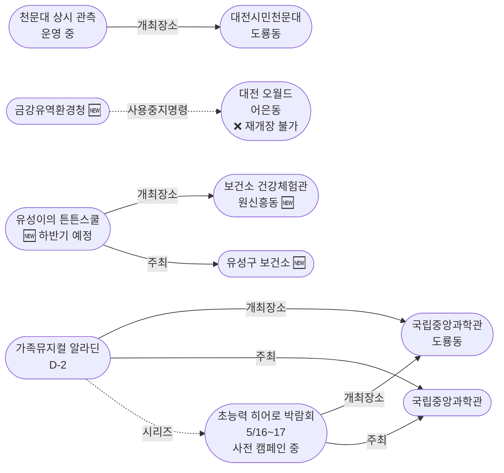
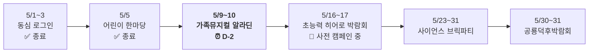

# 2026-05-07 대전 유성구 어린이·가족 이벤트 일일 보고서

## 요약

**포스트 황금연휴 2일째 — 평일 안정기 지속.** 오늘의 핵심 변화는 두 가지다. 첫째, **대전 오월드(어은동) 재개장이 5월 말까지 불가로 확정**되었다 — 어제까지 "검토 중"이던 불확실성이 복수 매체 보도로 해소되었으며, 금강유역환경청의 동물원 시설 사용 중지 명령이 법적 장애물이다. 둘째, **가족뮤지컬 알라딘이 D-2**에 진입했다 — 5/9(금)~10(토) 국립중앙과학관 사이언스홀에서 공연 예정이며, 예매 마감이 임박하다. 신규로 **유성구 보건소 '유성이의 튼튼스쿨'** 어린이 건강체험 프로그램(5~7세)이 발견되었다.

## 용성로20 주변 (도보권 내)

### ring-stroll (1km 이내) — 전민동 클러스터 유지 (변동 없음)

| 시설 | 동 | 거리 | 유형 | 상태 |
|------|---|------|------|------|
| 아가랑도서관 | 전민동 | ~0.9km | 도서관 — 아가맘 행복교실 | 운영 중 (4/4~6/27) |
| 유성구 평생학습센터 전민센터 | 전민동 | ~0.8km | 공공기관 원데이클래스 | 운영 중 |
| 전민종합문화센터 | 전민동 | ~0.8km | 문화센터 | 기존 |

> 도보권 내 변동 없음. 전민동 3거점 클러스터 유지.

## 오늘의 추천 (가족 동반 Top 5)

| 순위 | 이벤트 | 장소 (동) | 대상 | 비용 | 비고 |
|------|--------|----------|------|------|------|
| 1 | **가족뮤지컬 알라딘** (예정) | 국립중앙과학관 사이언스홀 (도룡동) | 유아~초등·가족 | 유료 | **D-2** — 예매 서두르세요 |
| 2 | **대전시민천문대 상시 관측** | 대전시민천문대 (도룡동) | 전연령 가족 | **무료** | 정상 운영 중 (화~일 14:00~22:00) |
| 3 | 탐이꿈이의 비밀 실험실 | 국립어린이과학관 (도룡동) | 유아~초등저학년 | 유료 | 운영 중 (~6/30) |
| 4 | 아가·맘 행복교실 | 아가랑도서관 (전민동, 0.9km) | 영유아 | 무료 | 운영 중 |
| 5 | 그림책, 나만의 보물을 담다 | 관평도서관 (관평동, 1.8km) | 유아~초등저학년 | 무료 | 운영 중 |

## 신규 이벤트

### 유성이의 튼튼스쿨 — 유성구 보건소 어린이 건강체험 프로그램

- **출처:** [유성구, 어린이 건강체험 프로그램 '유성이의 튼튼스쿨' 운영 | 시사저널](https://www.sisajournal.com/news/articleView.html?idxno=371774)
- **장소:** 유성구 보건소 어린이 건강체험관 (원신흥동, ~5km, ring-car)
- **대상:** 5~7세 (유아)
- **비용:** 무료 (추정)
- **사전신청:** 필요 (유성구청 홈페이지 선착순)
- **내용:** 탄생·감염·위생·구강·흡연음주예방·안전·신체활동·영양 등 8개 테마 체험형 교육. 신생아 모형 체험, 손 씻기 체험, 음주 고글 체험 등.
- **현재 상태:** 상반기 모집 마감. **하반기 8/19~11/27 운영 예정** (7/20부터 신청 가능)
- **어린이 친화도:** 0.85
- **실내·야외:** 실내

> **참고:** 현재 참여 불가(상반기 마감). 하반기 일정(7/20 신청 시작)을 사전 안내 목적으로 기록. 보건소 주최 공공 프로그램으로 publicTrustBoost +0.15 적용.

## 업데이트 항목

### 1. 대전 오월드 — 5월 말까지 재개장 불가 확정

- **출처:** [대전 오월드 5월 재개장 불가…입점업소 특수 기대 난망 | 뉴스1](https://www.news1.kr/local/daejeon-chungnam/6149846)
- **보조 출처:** [오월드, 5월 말까지 휴장 연장 | 인사이트](https://www.insight.co.kr/news/551937), [오월드 재개장 일정은? | 금강일보](https://www.ggilbo.com/news/articleView.html?idxno=1155607), [입점 업체에 재개장 불가 통보 | 대전MBC](https://tjmbc.co.kr/NewsArticle/837502), [금강환경청 사용중지 명령 | 문화일보](https://www.munhwa.com/article/11585405)
- **이전 상태:** 재개장 검토 중 (불확실, 5/6 보고서)
- **금일 변경:** **5월 말까지 재개장 불가 확정** — 대전도시공사가 입점 11개 업소에 공식 통보
- **원인:** 금강유역환경청의 동물원 시설(주랜드) 사용 중지 명령. 기후에너지환경부 실사 및 개장 승인 필요.
- **재개장 판단:** 5월 하순 예정
- **영향:** 5월 가정의달 전체를 놓치게 됨. ring-car 내 대형 가족 시설 옵션에서 당분간 제외.

### 2. 가족뮤지컬 알라딘 D-2 — 예매 마감 임박

- **출처:** [국립중앙과학관 행사안내](https://www.science.go.kr/mps/1070/bbs/431/moveBbsNttList.do)
- **일시:** 2026년 5월 9일(금)~10일(토)
- **장소:** 국립중앙과학관 사이언스홀 (도룡동, ~3km, ring-car)
- **이전 상태:** D-3 (5/6 보고서)
- **금일 변경:** **D-2 진입 — 내일(목)이 사실상 마지막 온라인 예매 기회**
- **비용:** 유료 (예매)
- **대상:** 유아~초등, 전연령 가족
- **어린이 친화도:** 0.95
- **시리즈:** 국립중앙과학관 가정의달 시리즈 3번째

### 3. 초능력 히어로 박람회 — 사전 캠페인 '잠든 영웅을 깨워라' 시작

- **출처:** [국립중앙과학관 '잠든 영웅을 깨워라' 대국민 초능력 아이템 수집 전 시작 | IDSN](https://idsn.co.kr/news/view/1065593651704268)
- **일시:** 2026년 5월 16일(토)~17일(일) (본 행사)
- **장소:** 국립중앙과학관 사이언스터널 (도룡동, ~3km, ring-car)
- **이전 상태:** 예정 (4/30 보고서)
- **금일 변경:** **사전 캠페인 시작** — 영화 속 히어로의 초능력 아이템을 기증하면 과학관 기념품 + 히어로 페스타 특별 초청권 제공
- **대상:** 초등저학년~초등고학년
- **어린이 친화도:** 0.90
- **시리즈:** 국립중앙과학관 가정의달 시리즈 4번째 (알라딘 5/9~10 → **히어로 5/16~17**)

## 신규 오픈 가게·팝업·프로모션

금일 유성구 일대 신규 오픈 가게/팝업/프로모션 발견 없음.

## 공공기관 주최 행사 (행정복지센터·보건소·복지관·도서관·우체국·경찰서·소방서)

| 기관 | 행사 | 상태 | 비고 |
|------|------|------|------|
| **유성구 보건소** | **유성이의 튼튼스쿨** (5~7세 건강체험) | **신규 발견** (상반기 마감) | 하반기 8/19~, 7/20 신청 🆕 |
| 유성소방서 | 가정의 달 소방안전체험의 장 | 운영 중 (5월 내) | 사전신청 필요 |
| 유성구통합도서관 (관평) | 그림책, 나만의 보물을 담다 | 운영 중 | 유아~초등저학년 |
| 유성구통합도서관 | 지역작가 인(人) 도서관 | 5월 운영 중 | 6개 도서관 순회 |
| 아가랑도서관 (전민) | 아가·맘 행복교실 | 운영 중 (4/4~6/27) | 영유아 |
| 국립중앙과학관 | 가정의 달 시리즈 | 운영 중 | 다음: 5/9~10 알라딘 **(D-2)** |
| 대전시민천문대 | 상시 관측 프로그램 | 정상 운영 중 | 화~일 14:00~22:00 |

## 마감 임박 (사전신청 D-3 이내)

| 이벤트 | 일시 | D-day | 비고 |
|--------|------|-------|------|
| **가족뮤지컬 알라딘** | 5/9(금)~10(토) | **D-2** | 국립중앙과학관 사이언스홀, 예매 마감 임박 |

## 동심원별 묶음 (0.5km / 1km / 2km / 5km)

### ring-stroll (1km 이내) — 전민동
- 아가랑도서관 (아가맘 행복교실) — 운영 중
- 유성구 평생학습센터 전민센터 — 운영 중

### ring-bike (2km 이내) — 관평동
- 관평도서관 (그림책 프로그램) — 운영 중

### ring-car (5km 이내) — 도룡동·어은동·노은동·원신흥동
- **가족뮤지컬 알라딘** (도룡동, ~3km) — **D-2 (5/9~10)** 예매 서두르세요
- **대전시민천문대 상시 관측** (도룡동, ~3km) — 정상 운영 중
- 탐이꿈이의 비밀 실험실 (도룡동, ~3km) — 운영 중 (~6/30)
- 국립중앙과학관 (도룡동, ~3km) — 상시
- 대전 오월드 (어은동, ~4.5km) — **5월 말까지 재개장 불가 확정** ❌
- 너티차일드 키즈테마파크 (도룡동, ~3.5km) — 상시
- 대전광역시어린이회관 (노은동, ~4km) — 상시
- **유성구 보건소 건강체험관** (원신흥동, ~5km) — 튼튼스쿨 하반기 8/19~ 🆕

## 동(洞)별 이벤트 묶음

| 동 | 1차 타겟 | 금일 이벤트 |
|----|---------|------------|
| **도룡동** | O | 알라딘(D-2) + 천문대 상시 + 탐이꿈이 |
| **전민동** | O | 아가맘 행복교실, 평생학습센터 |
| **관평동** | O | 관평도서관 그림책 프로그램 |
| **어은동** | — | **대전 오월드 5월 말까지 재개장 불가 확정** ❌ |
| 용산동 | O | 금일 해당 없음 |
| 문지동 | O | 금일 해당 없음 |
| 신성동 | O | 금일 해당 없음 |
| 노은동 | — | 어린이회관 상시 |
| 원신흥동 | — | **유성구 보건소 튼튼스쿨** (하반기 예정) 🆕 |

## 연령대별 묶음

| 연령대 | 추천 이벤트 |
|--------|-----------|
| 영유아 (0~3) | 아가맘 행복교실 (전민동, 0.9km) |
| 유아 (4~6) | 탐이꿈이 비밀실험실 (도룡동), 그림책 프로그램 (관평동), 튼튼스쿨 (하반기 예정) |
| 초등저학년 (7~9) | 천문대 태양관측 (도룡동), 알라딘(D-2), 히어로 사전 캠페인 참여 |
| 초등고학년 (10~12) | 천문대 야간관측 (도룡동), 알라딘(D-2), 히어로 사전 캠페인 참여 |
| 전연령 가족 | 대전시민천문대 상시 프로그램 (무료, 바로 방문 가능) |

## 시리즈/정기 프로그램 업데이트

| 시리즈 | 금일 상태 | 다음 일정 |
|--------|---------|----------|
| 국립중앙과학관 가정의 달 | 운영 중 | **5/9~10 가족뮤지컬 알라딘 (D-2)** → 5/16~17 히어로 (사전 캠페인 시작) |
| 유성소방서 안전체험 | 5월 운영 중 | 사전신청 후 방문 |
| 유성구 도서관 프로그램 | 운영 중 | 북스타트·그림책·지역작가 |
| 탐이꿈이의 비밀 실험실 | 운영 중 (~6/30) | 국립어린이과학관 사전예약 |
| 대전시민천문대 | 정상 운영 중 | 매일(화~일) 14:00~22:00 |
| 유성구 보건소 튼튼스쿨 | **신규 발견** (상반기 마감) | 하반기 8/19~11/27 (7/20 신청) |

## 지식그래프 시각화

### 오늘의 주요 관계

오월드 재개장 불가가 확정되면서 추적 노드의 상태가 안정화되었다. 국립중앙과학관 가정의달 시리즈는 알라딘(D-2) → 히어로(사전 캠페인)로 이어지며, 유성구 보건소의 어린이 건강체험 프로그램이 새로운 공공기관 노드로 추가되었다.

### 전체 지식그래프 시각화

### 가정의달 시리즈 타임라인

## 온톨로지 변경

| 변경 유형 | 대상 | 근거 |
|----------|------|------|
| 새 Event | ent-evt-032 유성이의 튼튼스쿨 | 유성구 보건소 어린이 건강체험 프로그램 신규 발견 |
| 새 Venue | ent-venue-022 보건소 어린이 건강체험관 | 튼튼스쿨 개최장소 |
| 새 Organization | ent-org-020 유성구 보건소 | 튼튼스쿨 주최기관 |
| 새 Organization | ent-org-021 금강유역환경청 | 오월드 사용 중지 명령 발령 기관 |
| 상태 업데이트 | ent-venue-021 오월드 | '검토 중' → '5월 말까지 재개장 불가 확정' |
| 상태 업데이트 | ent-evt-025 알라딘 | D-3 → D-2 |
| 속성 추가 | ent-evt-026 히어로 박람회 | 사전 캠페인 '잠든 영웅을 깨워라' 시작 |

## 추론 결과

| 추론 | 신뢰도 | 근거 |
|------|--------|------|
| 유성이의 튼튼스쿨 publicTrustBoost +0.15 | 0.85 | 보건소(공공기관) 주최 어린이 대상 프로그램 (public_institution_kid_event) |
| 히어로 박람회 = 알라딘의 후속 시리즈 | 0.85 | 동일 venue + 동일 주최 + 가정의달 테마 (same_venue_series) |
| 오월드 재개장 법적 장애물 = 환경청 사용 중지 명령 | 0.95 | 5개 매체 보도 교차확인 |
| 알라딘 예매 마감 임박 | 0.90 | D-2 + 유료 공연 + 금요일 개막 |

## 분석 및 평가

오늘은 **포스트 황금연휴 2일째 수요일**이다. 유성구는 평일 안정기를 유지하며, 정기 프로그램만 운영 중이다.

**금일의 핵심:**

1. **오월드 재개장 불가 확정**: 어제까지 상충하던 보도가 오늘 '불가'로 정리되었다. 금강유역환경청의 사용 중지 명령이 법적 근거이며, 기후에너지환경부의 실사와 승인을 거쳐야 재개장이 가능하다. 재개장 판단은 5월 하순으로 예정되어 있으나, 사실상 5월 전체 가정의달 시즌을 놓치게 된다.

2. **알라딘 D-2 — 예매 마감 임박**: 금요일 공연이므로 내일(목)이 사실상 마지막 온라인 예매 기회. 주말(토요일) 공연도 잔여석 확인 필요.

3. **히어로 박람회 사전 캠페인**: 과학관의 5월 마케팅 전략이 체계적으로 가동 중. 각 행사마다 사전 캠페인을 운영하여 관심을 유지하는 패턴이 보인다.

4. **유성이의 튼튼스쿨 신규 발견**: 보건소 주최 공공 프로그램으로 추적 대상 3종(공공기관 행사) 카테고리 신규. 상반기 마감이지만 하반기(7/20 신청) 사전 안내.

**이번 주 남은 일정:**
- 5/7(수)~8(목): 평일 정기 프로그램 + 알라딘 예매 마지막 기회
- **5/9(금)~10(토)**: 가족뮤지컬 알라딘 (국립중앙과학관 사이언스홀)
- 5/11(일): 평일 전환, 천문대 정상 운영

## 추적 항목

| 항목 | 최초 보고 | 상태 | 최신 업데이트 |
|------|----------|------|-------------|
| 가족뮤지컬 알라딘 | 2026-04-30 | **D-2 마감 임박** | 5/9~10 예매 서두르세요 |
| 초능력 히어로 박람회 | 2026-04-30 | **사전 캠페인 시작** | '잠든 영웅을 깨워라' 아이템 수집 |
| 대전 오월드 재개장 | 2026-05-06 | **5월 말까지 불가 확정** ❌ | 금강환경청 사용 중지 + 입점업소 공식 통보 |
| 유성이의 튼튼스쿨 | 2026-05-07 | **신규 발견** (상반기 마감) | 하반기 8/19~, 7/20 신청 |
| 대전시민천문대 상시 관측 | 2026-04-25 | 정상 운영 중 | 화~일 14:00~22:00 |
| 과학관 가정의달 시리즈 | 2026-04-30 | 운영 중 | 다음: 5/9 알라딘 → 5/16 히어로 |
| 소방서 안전체험 | 2026-04-26 | 운영 중 | 5월 내 |
| 도서관 프로그램 | 2026-04-25 | 운영 중 | 북스타트·그림책·작가 |

## 동향 요약

| 분류 | 상태 | 비고 |
|------|------|------|
| 어린이·가족 이벤트 | 정기 프로그램 운영 중 | 다음: 알라딘 D-2, 히어로 캠페인 |
| 신규 가게/팝업 | **금일 신규 없음** | — |
| 공공기관 행사 | 보건소 튼튼스쿨 신규 + 소방서·도서관·과학관 정상 운영 | 오월드 불가 확정 |

## 출처 목록

1. [대전 오월드 5월 재개장 불가…입점업소 특수 기대 난망 | 뉴스1](https://www.news1.kr/local/daejeon-chungnam/6149846) - 뉴스1, 2026-04
2. [오월드, 5월 말까지 휴장 연장 | 인사이트](https://www.insight.co.kr/news/551937) - 인사이트, 2026-04
3. [오월드 재개장 일정은? | 금강일보](https://www.ggilbo.com/news/articleView.html?idxno=1155607) - 금강일보, 2026-04
4. [오월드, 입점 업체에 재개장 불가 통보 | 대전MBC](https://tjmbc.co.kr/NewsArticle/837502) - 대전MBC, 2026-04
5. [금강환경청 사용중지 명령 | 문화일보](https://www.munhwa.com/article/11585405) - 문화일보, 2026-04
6. [국립중앙과학관 행사안내](https://www.science.go.kr/mps/1070/bbs/431/moveBbsNttList.do) - 국립중앙과학관
7. [잠든 영웅을 깨워라 대국민 초능력 아이템 수집 전 | IDSN](https://idsn.co.kr/news/view/1065593651704268) - IDSN
8. [유성구 어린이 건강체험 프로그램 '유성이의 튼튼스쿨' 운영 | 시사저널](https://www.sisajournal.com/news/articleView.html?idxno=371774) - 시사저널
9. [대전시민천문대](https://djstar.kr/) - 대전시민천문대 공식
10. [유성구통합도서관](https://lib.yuseong.go.kr/) - 유성구통합도서관 공식
11. [소방체험안내 | 대전광역시 소방본부](https://daejeon.go.kr/dj119/CmmContentsHtmlView.do?menuSeq=4462) - 대전광역시 소방본부
12. [유성구 지역작가 인 도서관 운영 | 페디앙](https://pedien.com/html/view.php?idx=1014924) - 페디앙
13. [국립어린이과학관](https://www.csc.go.kr/) - 국립어린이과학관 공식
