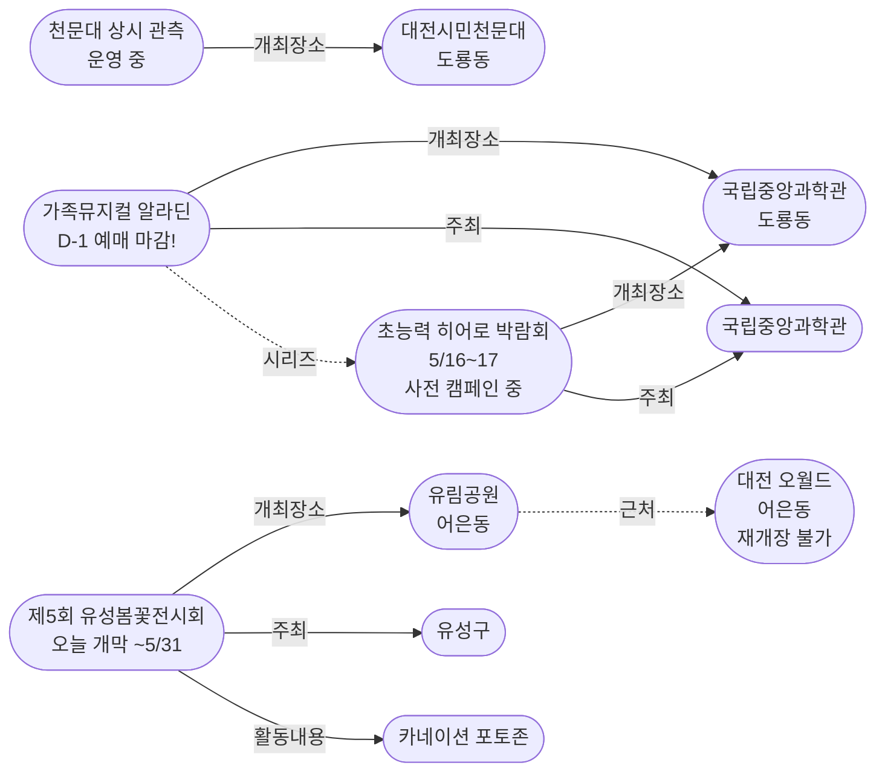
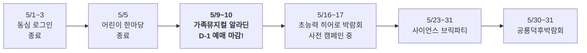
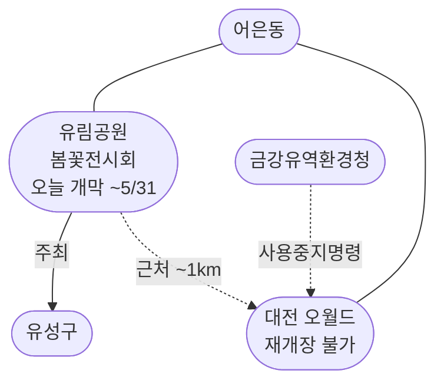

# 2026-05-08 대전 유성구 어린이·가족 이벤트 일일 보고서

## 요약

**포스트 황금연휴 3일째 — 유성봄꽃전시회 개막으로 야외 행사 복귀.** 오늘의 핵심 변화는 세 가지다. 첫째, **제5회 유성봄꽃전시회가 유림공원(어은동)에서 오늘 개막**하여 5월 31일까지 운영된다 — 50여 종 8만여 본의 봄꽃 전시와 카네이션 포토존이 가정의 달 가족 방문객을 맞는다. 재개장 불가인 오월드(어은동)의 공백을 부분적으로 대체하는 의미가 있다. 둘째, **가족뮤지컬 알라딘이 D-1**에 진입했다 — 내일(5/9 금) 개막이며, 오늘이 온라인 예매 최종일이다. 셋째, **초능력 히어로 박람회 사전 캠페인의 기증자 보상 상세가 정부 공식 보도자료로 확인**되었다 — 히어로 페스타 특별 초청권에 더해 7월 '비밀 아카데미' 사전 체험 특권이 제공된다.

## 용성로20 주변 (도보권 내)

### ring-stroll (1km 이내) — 전민동 클러스터 유지 (변동 없음)

| 시설 | 동 | 거리 | 유형 | 상태 |
|------|---|------|------|------|
| 아가랑도서관 | 전민동 | ~0.9km | 도서관 — 아가맘 행복교실 | 운영 중 (4/4~6/27) |
| 유성구 평생학습센터 전민센터 | 전민동 | ~0.8km | 공공기관 원데이클래스 | 운영 중 |
| 전민종합문화센터 | 전민동 | ~0.8km | 문화센터 | 기존 |

> 도보권 내 변동 없음. 전민동 3거점 클러스터 유지.

## 오늘의 추천 (가족 동반 Top 5)

| 순위 | 이벤트 | 장소 (동) | 대상 | 비용 | 비고 |
|------|--------|----------|------|------|------|
| 1 | **가족뮤지컬 알라딘** (내일 개막) | 국립중앙과학관 사이언스홀 (도룡동) | 유아~초등·가족 | 유료 | **D-1** — 오늘 예매 마감! |
| 2 | **제5회 유성봄꽃전시회** | 유림공원 (어은동, 3.8km) | 전연령 가족 | **무료** | **오늘 개막** (~5/31) |
| 3 | **대전시민천문대 상시 관측** | 대전시민천문대 (도룡동) | 전연령 가족 | **무료** | 정상 운영 중 (화~일 14:00~22:00) |
| 4 | 탐이꿈이의 비밀 실험실 | 국립어린이과학관 (도룡동) | 유아~초등저학년 | 유료 | 운영 중 (~6/30) |
| 5 | 아가·맘 행복교실 | 아가랑도서관 (전민동, 0.9km) | 영유아 | 무료 | 운영 중 |

## 신규 이벤트

### 제5회 유성봄꽃전시회 — 유림공원에서 오늘 개막

- **출처:** [대전 유성구 5월 8~31일 '봄꽃전시회' | 네이트뉴스(연합뉴스)](https://news.nate.com/view/20260430n25212)
- **보조 출처:** [대전 유림공원 봄꽃 전시회로 놀러오세요 | 다음뉴스](https://v.daum.net/v/20260503151008346)
- **기간:** 2026년 5월 8일(목) ~ 5월 31일(토)
- **장소:** 유림공원 일원 (어은동, ~3.8km, ring-car)
- **주최:** 유성구(유성구청)
- **비용:** 무료
- **사전신청:** 불필요
- **내용:**
  - **규모:** 50여 종, 8만여 본의 봄꽃
  - 메인광장: 풍차 꽃 조형물 + 수국
  - 화훼원: 라벤더 포토존
  - 반도지: 수변 델피늄
  - 어은교: 꽃다리 장식
  - **카네이션 포토존** — 가정의 달 부모·자녀 추억 공간
- **어린이 친화도:** 0.70 (공원 산책·포토존은 가족 대상이나 어린이 특화 체험은 미확인)
- **실내·야외:** 야외 (우천 시 관람 불편)

> **맥락:** 어은동에서 오월드(재개장 불가)의 공백을 부분적으로 대체하는 야외 가족 공간. 5월 전체 운영으로 주말 가족 나들이에 적합.

## 업데이트 항목

### 1. 가족뮤지컬 알라딘 D-1 — 오늘 예매 마감

- **출처:** [국립중앙과학관 행사안내](https://www.science.go.kr/mps/1070/bbs/431/moveBbsNttList.do)
- **일시:** 2026년 5월 9일(금)~10일(토)
- **장소:** 국립중앙과학관 사이언스홀 (도룡동, ~3km, ring-car)
- **이전 상태:** D-2 (5/7 보고서)
- **금일 변경:** **D-1 진입 — 오늘이 온라인 예매 최종일**
- **비용:** 유료 (예매)
- **대상:** 유아~초등, 전연령 가족
- **어린이 친화도:** 0.95
- **시리즈:** 국립중앙과학관 가정의달 시리즈 3번째

### 2. 초능력 히어로 박람회 사전 캠페인 — 기증자 보상 상세 확인

- **출처:** [국립중앙과학관 '잠든 영웅을 깨워라' | 정책브리핑](https://www.korea.kr/briefing/pressReleaseView.do?newsId=156748115)
- **보조 출처:** [IDSN](https://idsn.co.kr/news/view/1065593651704268)
- **일시:** 2026년 5월 16일(토)~17일(일) (본 행사)
- **이전 상태:** 사전 캠페인 시작 (5/7 보고서)
- **금일 변경:** **정부 공식 보도자료에서 기증자 보상 상세 확인**
  - 과학관 기념품
  - 5월 **초능력 영웅 축제(히어로 페스타) 특별 초청권**
  - 7월 **초능력 비밀 교실(비밀 아카데미) 사전 체험 특권**
- **의미:** 과학관의 5월~7월 연속 프로그래밍 전략이 정부 차원에서 공식화. 히어로 페스타 이후 7월 아카데미까지 이어지는 장기 시리즈 확인.

### 3. 대전 오월드 재개장 불가 — 변동 없음

- 5/7 확정된 '5월 말까지 재개장 불가'에서 추가 변동 없음.
- 재개장 판단 시점: 5월 하순.
- 어은동 대안: **유림공원 봄꽃전시회**(오늘 개막)가 야외 가족 공간으로 부분 대체.

## 신규 오픈 가게·팝업·프로모션

금일 유성구 일대 신규 오픈 가게/팝업/프로모션 발견 없음.

## 공공기관 주최 행사 (행정복지센터·보건소·복지관·도서관·우체국·경찰서·소방서)

| 기관 | 행사 | 상태 | 비고 |
|------|------|------|------|
| **유성구(유성구청)** | **제5회 유성봄꽃전시회** | **오늘 개막** | 유림공원, 5/31까지, 무료 |
| 국립중앙과학관 | 가정의 달 시리즈 | 운영 중 | **5/9~10 알라딘 (D-1)**, 히어로 캠페인 진행 중 |
| 유성소방서 | 가정의 달 소방안전체험의 장 | 운영 중 (5월 내) | 사전신청 필요 |
| 유성구통합도서관 (관평) | 그림책, 나만의 보물을 담다 | 운영 중 | 유아~초등저학년 |
| 유성구통합도서관 | 지역작가 인(人) 도서관 | 5월 운영 중 | 6개 도서관 순회 |
| 아가랑도서관 (전민) | 아가·맘 행복교실 | 운영 중 (4/4~6/27) | 영유아 |
| 대전시민천문대 | 상시 관측 프로그램 | 정상 운영 중 | 화~일 14:00~22:00 |
| 유성구 보건소 | 유성이의 튼튼스쿨 | 하반기 예정 | 7/20 신청, 8/19~ 운영 |

## 마감 임박 (사전신청 D-3 이내)

| 이벤트 | 일시 | D-day | 비고 |
|--------|------|-------|------|
| **가족뮤지컬 알라딘** | 5/9(금)~10(토) | **D-1** | 국립중앙과학관 사이언스홀, **오늘 예매 마감!** |

## 동심원별 묶음 (0.5km / 1km / 2km / 5km)

### ring-stroll (1km 이내) — 전민동
- 아가랑도서관 (아가맘 행복교실) — 운영 중
- 유성구 평생학습센터 전민센터 — 운영 중

### ring-bike (2km 이내) — 관평동
- 관평도서관 (그림책 프로그램) — 운영 중

### ring-car (5km 이내) — 도룡동·어은동·노은동·원신흥동
- **가족뮤지컬 알라딘** (도룡동, ~3km) — **D-1 (5/9~10)** 오늘 예매 마감!
- **제5회 유성봄꽃전시회** (어은동, ~3.8km) — **오늘 개막** (~5/31, 무료)
- **대전시민천문대 상시 관측** (도룡동, ~3km) — 정상 운영 중
- 탐이꿈이의 비밀 실험실 (도룡동, ~3km) — 운영 중 (~6/30)
- 국립중앙과학관 (도룡동, ~3km) — 상시
- 대전 오월드 (어은동, ~4.5km) — 5월 말까지 재개장 불가
- 너티차일드 키즈테마파크 (도룡동, ~3.5km) — 상시
- 대전광역시어린이회관 (노은동, ~4km) — 상시
- 유성구 보건소 건강체험관 (원신흥동, ~5km) — 튼튼스쿨 하반기 8/19~

## 동(洞)별 이벤트 묶음

| 동 | 1차 타겟 | 금일 이벤트 |
|----|---------|------------|
| **도룡동** | O | **알라딘(D-1)** + 천문대 상시 + 탐이꿈이 |
| **어은동** | — | **유성봄꽃전시회 오늘 개막** / 오월드 재개장 불가 |
| **전민동** | O | 아가맘 행복교실, 평생학습센터 |
| **관평동** | O | 관평도서관 그림책 프로그램 |
| 용산동 | O | 금일 해당 없음 |
| 문지동 | O | 금일 해당 없음 |
| 신성동 | O | 금일 해당 없음 |
| 노은동 | — | 어린이회관 상시 |
| 원신흥동 | — | 유성구 보건소 튼튼스쿨 (하반기 예정) |

## 연령대별 묶음

| 연령대 | 추천 이벤트 |
|--------|-----------|
| 영유아 (0~3) | 아가맘 행복교실 (전민동, 0.9km) |
| 유아 (4~6) | 탐이꿈이 비밀실험실 (도룡동), 그림책 프로그램 (관평동), 봄꽃전시회 산책 (어은동) |
| 초등저학년 (7~9) | **알라딘(D-1, 예매 서두르세요)**, 천문대 태양관측, 히어로 캠페인 참여 |
| 초등고학년 (10~12) | **알라딘(D-1)**, 천문대 야간관측, 히어로 캠페인 참여 |
| 전연령 가족 | **봄꽃전시회**(무료, 바로 방문), 대전시민천문대 상시 프로그램 (무료) |

## 시리즈/정기 프로그램 업데이트

| 시리즈 | 금일 상태 | 다음 일정 |
|--------|---------|----------|
| 국립중앙과학관 가정의 달 | 운영 중 | **5/9~10 가족뮤지컬 알라딘 (D-1)** → 5/16~17 히어로 (캠페인 중) |
| **유성봄꽃전시회** | **오늘 개막** | 5/8~31 유림공원, 매일 관람 가능 |
| 유성소방서 안전체험 | 5월 운영 중 | 사전신청 후 방문 |
| 유성구 도서관 프로그램 | 운영 중 | 북스타트·그림책·지역작가 |
| 탐이꿈이의 비밀 실험실 | 운영 중 (~6/30) | 국립어린이과학관 사전예약 |
| 대전시민천문대 | 정상 운영 중 | 매일(화~일) 14:00~22:00 |
| 유성구 보건소 튼튼스쿨 | 하반기 예정 | 7/20 신청, 8/19~11/27 운영 |

## 지식그래프 시각화

### 오늘의 주요 관계

유성봄꽃전시회(어은동)가 오늘 개막하면서 오월드(어은동) 재개장 불가의 맥락에서 같은 동의 대안 야외 공간으로 부상했다. 국립중앙과학관 가정의달 시리즈는 알라딘(D-1)으로 초읽기에 들어갔고, 히어로 박람회의 사전 캠페인이 정부 보도자료로 공식화되면서 시리즈 연속성이 강화되었다.

### 전체 지식그래프 시각화

### 가정의달 시리즈 타임라인

### 어은동 현황 — 봄꽃전시회 vs 오월드

## 온톨로지 변경

| 변경 유형 | 대상 | 근거 |
|----------|------|------|
| 새 Event | ent-evt-033 제5회 유성봄꽃전시회 | 오늘 개막 신규 행사 (유림공원, 5/8~5/31) |
| 새 Venue | ent-venue-023 유림공원 | 봄꽃전시회 개최장소 (어은동) |
| 새 Activity | ent-act-014 카네이션 포토존 | 가정의달 가족 포토 프로그램 |
| 상태 업데이트 | ent-evt-025 알라딘 | D-2 → D-1 (예매 마감 최종일) |
| 속성 추가 | ent-evt-026 히어로 박람회 | 기증자 보상 상세: 7월 비밀 아카데미 특권 |
| 신뢰도 상향 | ent-evt-026 partOfSeries | 0.85 → 0.90 (정부 보도자료 확인) |

## 추론 결과

| 추론 | 신뢰도 | 근거 |
|------|--------|------|
| 유성봄꽃전시회 publicTrustBoost +0.15 | 0.85 | 유성구청(지자체) 주최 무료 행사 (public_institution_kid_event) |
| 유림공원 ↔ 오월드 근접 (어은동 동일 동) | 0.80 | 동일 동 소재 ~1km (proximity) |
| 히어로 → 알라딘 시리즈 신뢰도 0.85→0.90 | 0.90 | 정부 보도자료로 시리즈 확정 (same_venue_series) |
| 유림공원 = 오월드 공백 대안 | 0.75 | 동일 동 + 오월드 불가 + 봄꽃전시회 5월 전체 운영 |
| 알라딘 D-1 예매 마감 최종일 | 0.95 | 내일 개막 + 유료 공연 + 온라인 예매 전날 마감 |

## 분석 및 평가

오늘은 **포스트 황금연휴 3일째 목요일**이다. 유성봄꽃전시회 개막으로 황금연휴 이후 처음으로 신규 행사가 시작되면서 유성구의 이벤트 밀도가 소폭 회복되었다.

**금일의 핵심:**

1. **유성봄꽃전시회 개막**: 유성구청 주최 야외 전시로, 5월 전체(5/8~31)를 커버하는 장기 행사다. 어은동 유림공원에서 열려 오월드 재개장 불가의 공백을 부분적으로 메운다. 카네이션 포토존은 가정의 달 가족 방문을 유도하나, 어린이 특화 체험 프로그램은 별도로 확인되지 않아 kid_friendly_score는 0.70으로 산정했다.

2. **알라딘 D-1 — 오늘 예매 마감**: 내일(금) 개막, 토요일(5/10) 공연. 유료 가족뮤지컬이므로 사전 예매가 필수적이며, 온라인 예매 시스템은 보통 전날까지 접수한다. 잔여석은 현장 판매.

3. **히어로 캠페인 보상 상세 확인**: 정부 공식 보도자료(정책브리핑)에서 기증자에게 히어로 페스타 특별 초청권 + **7월 비밀 아카데미 사전 체험 특권**을 제공한다고 명시. 이는 과학관의 프로그래밍이 5월 가정의달을 넘어 7월까지 이어지는 장기 전략임을 보여준다.

4. **어은동 맥락**: 오월드(테마파크·동물원)가 5월 내내 닫혀 있는 상황에서 같은 동(어은동)의 유림공원이 봄꽃전시회로 활성화된다. 완전한 대체는 아니지만, "어은동에서 가족이 갈 곳"이 생긴 것은 의미 있다.

**이번 주 남은 일정:**
- 5/8(목): 봄꽃전시회 개막 + 알라딘 예매 마지막 기회
- **5/9(금)~10(토)**: 가족뮤지컬 알라딘 (국립중앙과학관 사이언스홀)
- 5/11(일): 봄꽃전시회 첫 주말, 천문대 정상 운영

## 추적 항목

| 항목 | 최초 보고 | 상태 | 최신 업데이트 |
|------|----------|------|-------------|
| **유성봄꽃전시회** | **2026-05-08** | **오늘 개막** | 유림공원(어은동), 5/31까지, 무료 |
| 가족뮤지컬 알라딘 | 2026-04-30 | **D-1 예매 마감!** | 5/9~10 사이언스홀 |
| 초능력 히어로 박람회 | 2026-04-30 | 사전 캠페인 중 | 기증 보상: 초청권 + 7월 아카데미 특권 |
| 대전 오월드 재개장 | 2026-05-06 | 5월 말까지 불가 | 변동 없음. 5월 하순 판단 예정 |
| 대전시민천문대 상시 관측 | 2026-04-25 | 정상 운영 중 | 화~일 14:00~22:00 |
| 과학관 가정의달 시리즈 | 2026-04-30 | 운영 중 | 다음: 5/9 알라딘(D-1) → 5/16 히어로 |
| 소방서 안전체험 | 2026-04-26 | 운영 중 | 5월 내 |
| 도서관 프로그램 | 2026-04-25 | 운영 중 | 북스타트·그림책·작가 |
| 유성이의 튼튼스쿨 | 2026-05-07 | 하반기 예정 | 7/20 신청, 8/19~ 운영 |

## 동향 요약

| 분류 | 상태 | 비고 |
|------|------|------|
| 어린이·가족 이벤트 | **봄꽃전시회 개막** + 정기 프로그램 | 다음: 알라딘 D-1 |
| 신규 가게/팝업 | **금일 신규 없음** | — |
| 공공기관 행사 | 유성구청 봄꽃전시 + 과학관·소방서·도서관 정상 운영 | 히어로 캠페인 정부 공식화 |

## 출처 목록

1. [대전 유성구 5월 8~31일 '봄꽃전시회'…온천문화축제 연계 | 네이트뉴스(연합뉴스)](https://news.nate.com/view/20260430n25212) - 연합뉴스, 2026-04-30
2. [대전 유림공원 봄꽃 전시회로 놀러오세요 | 다음뉴스](https://v.daum.net/v/20260503151008346) - 다음뉴스, 2026-05-03
3. [국립중앙과학관 행사안내](https://www.science.go.kr/mps/1070/bbs/431/moveBbsNttList.do) - 국립중앙과학관
4. [잠든 영웅을 깨워라 대국민 초능력 아이템 수집 전 | 정책브리핑](https://www.korea.kr/briefing/pressReleaseView.do?newsId=156748115) - 대한민국 정책브리핑
5. [잠든 영웅을 깨워라 | IDSN](https://idsn.co.kr/news/view/1065593651704268) - IDSN
6. [대전시민천문대](https://djstar.kr/) - 대전시민천문대 공식
7. [유성구통합도서관](https://lib.yuseong.go.kr/) - 유성구통합도서관 공식
8. [소방체험안내 | 대전광역시 소방본부](https://daejeon.go.kr/dj119/CmmContentsHtmlView.do?menuSeq=4462) - 대전광역시 소방본부
9. [유성구 지역작가 인 도서관 운영 | 페디앙](https://pedien.com/html/view.php?idx=1014924) - 페디앙
10. [국립어린이과학관](https://www.csc.go.kr/) - 국립어린이과학관 공식
11. [대전 오월드 5월 재개장 불가 | 뉴스1](https://www.news1.kr/local/daejeon-chungnam/6149846) - 뉴스1
