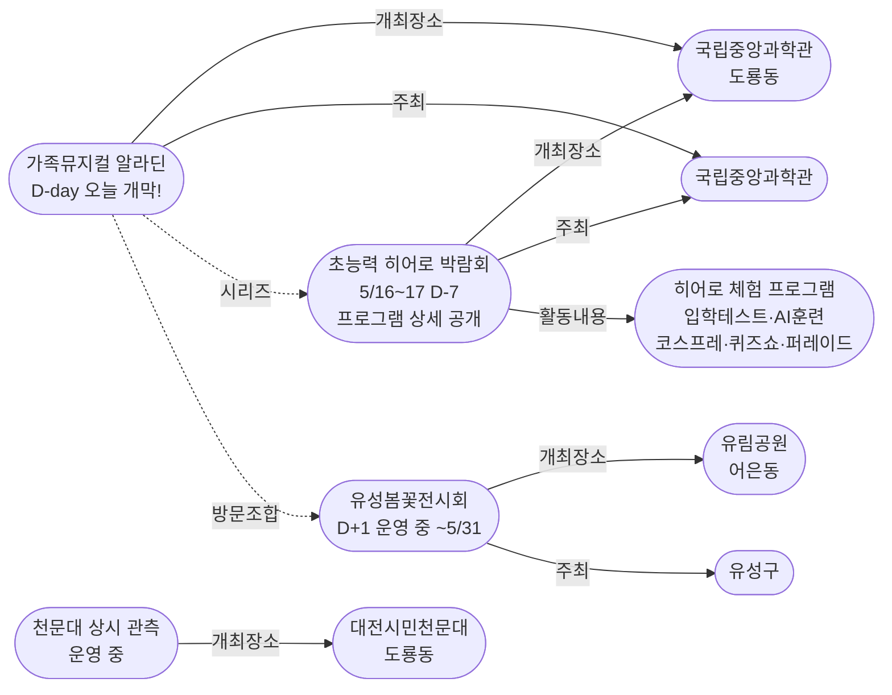
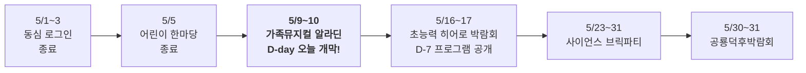
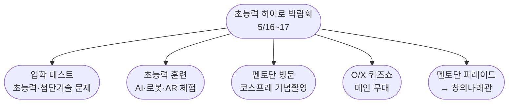

# 2026-05-09 대전 유성구 어린이·가족 이벤트 일일 보고서

## 요약

**가족뮤지컬 알라딘 D-day — 오늘 국립중앙과학관 사이언스홀에서 개막.** 오늘의 핵심은 두 가지다. 첫째, **가족뮤지컬 알라딘이 오늘(5/9 금) 개막**하여 내일(5/10 토)까지 공연된다 — 가정의 달 시리즈 3번째 행사로, 유아~초등·가족 대상 유료 공연이다. 둘째, **초능력 히어로 박람회(5/16~17)의 상세 프로그램이 과학기술 전문매체 헬로디디를 통해 최초 공개**되었다 — 입학 테스트, AI·로봇·AR 초능력 훈련, 코스프레 기념촬영, O/X 퀴즈쇼, 창의나래관 퍼레이드 등 5개 프로그램이 확인되었다. 다음 주를 위한 사전 계획이 가능해진 시점이다.

## 용성로20 주변 (도보권 내)

### ring-stroll (1km 이내) — 전민동 클러스터 유지 (변동 없음)

| 시설 | 동 | 거리 | 유형 | 상태 |
|------|---|------|------|------|
| 아가랑도서관 | 전민동 | ~0.9km | 도서관 — 아가맘 행복교실 | 운영 중 (4/4~6/27) |
| 유성구 평생학습센터 전민센터 | 전민동 | ~0.8km | 공공기관 원데이클래스 | 운영 중 |
| 전민종합문화센터 | 전민동 | ~0.8km | 문화센터 | 기존 |

> 도보권 내 변동 없음. 전민동 3거점 클러스터 유지.

## 오늘의 추천 (가족 동반 Top 5)

| 순위 | 이벤트 | 장소 (동) | 대상 | 비용 | 비고 |
|------|--------|----------|------|------|------|
| 1 | **가족뮤지컬 알라딘** | 국립중앙과학관 사이언스홀 (도룡동) | 유아~초등·가족 | 유료 | **D-day 오늘 개막!** |
| 2 | **제5회 유성봄꽃전시회** | 유림공원 (어은동, 3.8km) | 전연령 가족 | **무료** | 운영 중 (D+1, ~5/31) |
| 3 | **대전시민천문대 상시 관측** | 대전시민천문대 (도룡동) | 전연령 가족 | **무료** | 정상 운영 (화~일 14:00~22:00) |
| 4 | 탐이꿈이의 비밀 실험실 | 국립어린이과학관 (도룡동) | 유아~초등저학년 | 유료 | 운영 중 (~6/30) |
| 5 | 아가·맘 행복교실 | 아가랑도서관 (전민동, 0.9km) | 영유아 | 무료 | 운영 중 |

## 업데이트 항목

### 1. 가족뮤지컬 알라딘 D-day — 오늘 개막

- **출처:** [국립중앙과학관 행사안내](https://www.science.go.kr/mps/1070/bbs/431/moveBbsNttList.do)
- **일시:** 2026년 5월 9일(금)~10일(토)
- **장소:** 국립중앙과학관 사이언스홀 (도룡동, ~3km, ring-car)
- **이전 상태:** D-1 예매 마감 (5/8 보고서)
- **금일 변경:** **D-day — 오늘 개막. 내일(5/10 토)까지 공연.**
- **비용:** 유료 (예매 또는 현장 잔여석 구매)
- **대상:** 유아~초등, 전연령 가족
- **어린이 친화도:** 0.95
- **시리즈:** 국립중앙과학관 가정의달 시리즈 3번째
  - 동심 로그인 (5/1~3, 종료)
  - 어린이 한마당 (5/5, 종료)
  - **알라딘 (5/9~10, D-day)**
  - 히어로 박람회 (5/16~17, D-7)

### 2. 초능력 히어로 박람회 상세 프로그램 최초 공개

- **출처:** [슈퍼파워 히어로 변신! 중앙과학관, '초능력 히어로 박람회' 개최 | 헬로디디](https://www.hellodd.com/news/articleView.html?idxno=111696)
- **보조 출처:** [국립중앙과학관 잠든 영웅을 깨워라 | IDSN](https://idsn.co.kr/news/view/1065593651704268)
- **일시:** 2026년 5월 16일(토)~17일(일)
- **장소:** 국립중앙과학관 사이언스터널 (도룡동, ~3km, ring-car)
- **이전 상태:** 사전 캠페인 + 기증자 보상 확인 (5/8 보고서)
- **금일 변경:** **헬로디디(과학기술 전문매체)에서 본 행사 프로그램 상세 최초 공개**
- **확인된 프로그램 5가지:**
  1. **입학 테스트** — 초능력·첨단기술 관련 문제 풀기
  2. **초능력 훈련** — AI·로봇·AR 등 첨단기술 체험으로 상상 속 초능력이 구현되는 과정 학습
  3. **아카데미 멘토단 방문** — 히어로 코스프레 전문가와 기념촬영
  4. **O/X 퀴즈쇼** — 메인 무대, 첨단기술과 초능력의 연관성 퀴즈
  5. **아카데미 멘토단 퍼레이드** — 코스프레 전문가들이 창의나래관까지 행진
- **어린이 친화도:** 0.90 (체험·퀴즈·퍼레이드 구성으로 확정)
- **의미:** 사전 캠페인(잠든 영웅을 깨워라) → 정부 보도자료(기증 보상) → 전문매체 프로그램 상세로 정보가 3단계 상승. 다음 주 방문 사전 계획이 가능해진 시점.

### 3. 유성소방서 가정의 달 체험 — 솔로몬파크 체험부스 운영 확인

- **출처:** [유성소방서, 가정의 달 소방안전체험의 장 운영 | 대전시티저널](https://www.gocj.net/news/articleView.html?idxno=133782)
- **보조 출처:** [소방체험안내 | 대전광역시 소방본부](https://daejeon.go.kr/dj119/CmmContentsHtmlView.do?menuSeq=4462)
- **이전 상태:** '5월 운영 중' (장소 미특정)
- **금일 변경:** **원촌동 솔로몬파크에서 체험부스 운영 확인 + 이동안전체험차량 동시 투입**
- **체험 내용:** 화재·지진·교통안전 대피 체험, 소화기 사용법, 수직구조대 탈출 체험
- **비용:** 무료
- **사전신청:** 필요 (소방서 체험교육팀)
- **어린이 친화도:** 0.85

## 신규 오픈 가게·팝업·프로모션

금일 유성구 일대 신규 오픈 가게/팝업/프로모션 발견 없음.

## 공공기관 주최 행사 (행정복지센터·보건소·복지관·도서관·우체국·경찰서·소방서)

| 기관 | 행사 | 상태 | 비고 |
|------|------|------|------|
| **국립중앙과학관** | **가족뮤지컬 알라딘** | **D-day 오늘 개막** | 사이언스홀, 5/9~10, 유료 |
| **국립중앙과학관** | 초능력 히어로 박람회 | D-7 프로그램 상세 공개 | 사이언스터널, 5/16~17 |
| **유성소방서** | 가정의 달 소방안전체험 | **솔로몬파크 체험부스 확인** | 원촌동, 사전신청 필요 |
| 유성구통합도서관 (관평) | 그림책, 나만의 보물을 담다 | 운영 중 | 유아~초등저학년 |
| 유성구통합도서관 | 지역작가 인(人) 도서관 | 5월 운영 중 | 6개 도서관 순회 |
| 아가랑도서관 (전민) | 아가·맘 행복교실 | 운영 중 (4/4~6/27) | 영유아 |
| 대전시민천문대 | 상시 관측 프로그램 | 정상 운영 중 | 화~일 14:00~22:00 |
| 유성구 보건소 | 유성이의 튼튼스쿨 | 하반기 예정 | 7/20 신청, 8/19~ 운영 |

## 마감 임박 (사전신청 D-3 이내)

| 이벤트 | 일시 | D-day | 비고 |
|--------|------|-------|------|
| **가족뮤지컬 알라딘** | 5/9(금)~10(토) | **D-day** | 국립중앙과학관 사이언스홀, **오늘 개막!** 잔여석 현장 판매 |

## 동심원별 묶음 (0.5km / 1km / 2km / 5km)

### ring-stroll (1km 이내) — 전민동
- 아가랑도서관 (아가맘 행복교실) — 운영 중
- 유성구 평생학습센터 전민센터 — 운영 중

### ring-bike (2km 이내) — 관평동
- 관평도서관 (그림책 프로그램) — 운영 중

### ring-car (5km 이내) — 도룡동·어은동·노은동·원신흥동
- **가족뮤지컬 알라딘** (도룡동, ~3km) — **D-day 오늘 개막!**
- **제5회 유성봄꽃전시회** (어은동, ~3.8km) — 운영 중 (D+1, ~5/31, 무료)
- **대전시민천문대 상시 관측** (도룡동, ~3km) — 정상 운영 중
- 탐이꿈이의 비밀 실험실 (도룡동, ~3km) — 운영 중 (~6/30)
- 국립중앙과학관 (도룡동, ~3km) — 상시
- 대전 오월드 (어은동, ~4.5km) — 5월 말까지 재개장 불가
- 너티차일드 키즈테마파크 (도룡동, ~3.5km) — 상시
- 대전광역시어린이회관 (노은동, ~4km) — 상시
- 유성구 보건소 건강체험관 (원신흥동, ~5km) — 튼튼스쿨 하반기 8/19~

## 동(洞)별 이벤트 묶음

| 동 | 1차 타겟 | 금일 이벤트 |
|----|---------|------------|
| **도룡동** | O | **알라딘(D-day)** + 천문대 상시 + 탐이꿈이 |
| **어은동** | — | 유성봄꽃전시회 운영 중(D+1) / 오월드 재개장 불가 |
| **전민동** | O | 아가맘 행복교실, 평생학습센터 |
| **관평동** | O | 관평도서관 그림책 프로그램 |
| 용산동 | O | 금일 해당 없음 |
| 문지동 | O | 금일 해당 없음 |
| 신성동 | O | 금일 해당 없음 |
| 노은동 | — | 어린이회관 상시 |
| 원신흥동 | — | 유성구 보건소 튼튼스쿨 (하반기 예정) |

## 연령대별 묶음

| 연령대 | 추천 이벤트 |
|--------|-----------|
| 영유아 (0~3) | 아가맘 행복교실 (전민동, 0.9km) |
| 유아 (4~6) | **알라딘(D-day, 잔여석 확인!)**, 탐이꿈이 비밀실험실, 그림책 프로그램 |
| 초등저학년 (7~9) | **알라딘(D-day)**, 히어로 캠페인 참여(D-7), 천문대 태양관측 |
| 초등고학년 (10~12) | **알라딘(D-day)**, 히어로 캠페인 참여(D-7), 천문대 야간관측 |
| 전연령 가족 | **봄꽃전시회**(무료), 대전시민천문대 (무료), 알라딘 + 과학관 동선 |

## 시리즈/정기 프로그램 업데이트

| 시리즈 | 금일 상태 | 다음 일정 |
|--------|---------|----------|
| 국립중앙과학관 가정의 달 | **알라딘 D-day 오늘 개막** | 5/10(토) 알라딘 마지막 → **5/16~17 히어로 (D-7, 프로그램 상세 공개)** |
| 유성봄꽃전시회 | D+1 운영 중 | 5/31까지 매일 (유림공원, 무료) |
| 유성소방서 안전체험 | **솔로몬파크 체험부스 확인** | 5월 내 사전신청 |
| 유성구 도서관 프로그램 | 운영 중 | 북스타트·그림책·지역작가 |
| 탐이꿈이의 비밀 실험실 | 운영 중 (~6/30) | 국립어린이과학관 사전예약 |
| 대전시민천문대 | 정상 운영 중 | 매일(화~일) 14:00~22:00 |
| 유성구 보건소 튼튼스쿨 | 하반기 예정 | 7/20 신청, 8/19~11/27 운영 |

## 지식그래프 시각화

### 오늘의 주요 관계

가정의달 시리즈가 알라딘 D-day로 클라이맥스에 진입했다. 동시에 차주 히어로 박람회의 상세 프로그램이 공개되면서 시리즈의 "알라딘 → 히어로" 전환이 구체화되었다. 히어로 박람회에 새로운 Activity(체험 프로그램 5가지)가 연결되어 지식그래프가 확장되었다.

### 전체 지식그래프 시각화

### 가정의달 시리즈 타임라인

### 히어로 박람회 프로그램 구조 (신규)

## 온톨로지 변경

| 변경 유형 | 대상 | 근거 |
|----------|------|------|
| 새 Activity | ent-act-015 히어로 박람회 체험 프로그램 | 헬로디디 보도로 5개 프로그램 상세 확인 |
| 상태 업데이트 | ent-evt-025 알라딘 | D-1 → D-day 개막 |
| 상태 업데이트 | ent-evt-026 히어로 박람회 | 사전 캠페인 → D-7 프로그램 상세 공개 |
| 속성 추가 | ent-evt-022 소방체험 | 운영 장소: 원촌동 솔로몬파크 + 이동체험차량 |

## 추론 결과

| 추론 | 신뢰도 | 근거 |
|------|--------|------|
| 알라딘 D-day 확정 | 0.99 | 시작일=오늘 (same_date) |
| 히어로 체험 kidFriendlyBoost +0.2 | 0.90 | 과학관 운영 체험 행사 (operator_kid_friendliness) |
| 히어로 체험 → 초등저학년+고학년 | 0.90 | AI·로봇·AR + 퀴즈 = 초등 적합 (age_group_overlap) |
| 알라딘 + 봄꽃전시회 방문 조합 | 0.70 | ring-car 내 도룡동↔어은동 (잠정) |

## 분석 및 평가

오늘은 **금요일, 가정의달 시리즈 알라딘 D-day**다. 어제까지 "예매 서두르세요"였던 알라딘이 오늘 개막하면서, 가정의달 시리즈의 3번째 행사가 활성화되었다.

**금일의 핵심:**

1. **알라딘 D-day**: 국립중앙과학관 사이언스홀에서 오늘(금)~내일(토) 가족뮤지컬 알라딘 공연. 유료 공연이므로 사전 예매자 중심이나, 잔여석은 현장에서 구매 가능할 수 있다. 유아~초등 가족에게 오늘 유성구 최우선 추천.

2. **히어로 박람회 D-7 프로그램 상세**: 헬로디디(과학기술 전문매체)에서 히어로 박람회의 실제 프로그램 구성이 최초 공개되었다. 이전에는 사전 캠페인(기증)과 보상 정보만 알려져 있었으나, 이제 "입학 테스트 → 초능력 훈련(AI·로봇·AR) → 코스프레 → 퀴즈 → 퍼레이드"의 전체 체험 동선이 확인되었다. 가족 관점에서 사전 계획이 가능해진 시점이며, Activity 인스턴스를 추가하여 지식그래프를 확장했다.

3. **소방서 솔로몬파크**: 유성소방서 가정의 달 체험이 원촌동 솔로몬파크에서 구체적으로 운영되고 있음이 대전시티저널 보도로 확인되었다. 이동안전체험차량도 동시 투입되어 체험 프로그램 밀도가 높아졌다.

4. **시리즈 전환점**: 알라딘이 5/10(토)에 종료되면 가정의달 시리즈는 히어로 박람회(5/16~17)로 전환된다. 프로그램 상세가 이미 공개되었으므로 다음 주 보고서부터는 히어로 박람회가 핵심 추적 대상이 된다.

**이번 주 남은 일정:**
- **5/9(금)~10(토)**: 가족뮤지컬 알라딘 (D-day~마지막)
- 5/11(일): 봄꽃전시회 첫 주말, 천문대 정상 운영
- 5/12(월): 히어로 D-4 진입

## 추적 항목

| 항목 | 최초 보고 | 상태 | 최신 업데이트 |
|------|----------|------|-------------|
| **가족뮤지컬 알라딘** | 2026-04-30 | **D-day 오늘 개막** | 5/9~10 사이언스홀, 잔여석 현장 |
| **초능력 히어로 박람회** | 2026-04-30 | **D-7 프로그램 상세 공개** | 5개 프로그램 확인 (헬로디디) |
| 유성봄꽃전시회 | 2026-05-08 | D+1 운영 중 | 유림공원 5/31까지, 무료 |
| 대전 오월드 재개장 | 2026-05-06 | 5월 말까지 불가 | 변동 없음. 5월 하순 판단 예정 |
| 유성소방서 안전체험 | 2026-04-26 | **솔로몬파크 체험부스 확인** | 원촌동 + 이동체험차량 |
| 대전시민천문대 상시 관측 | 2026-04-25 | 정상 운영 중 | 화~일 14:00~22:00 |
| 과학관 가정의달 시리즈 | 2026-04-30 | **알라딘 D-day** | 다음: 5/16 히어로(D-7, 상세 공개) |
| 도서관 프로그램 | 2026-04-25 | 운영 중 | 북스타트·그림책·작가 |
| 유성이의 튼튼스쿨 | 2026-05-07 | 하반기 예정 | 7/20 신청, 8/19~ 운영 |

## 동향 요약

| 분류 | 상태 | 비고 |
|------|------|------|
| 어린이·가족 이벤트 | **알라딘 D-day** + 히어로 D-7 + 정기 프로그램 | 시리즈 클라이맥스 |
| 신규 가게/팝업 | **금일 신규 없음** | — |
| 공공기관 행사 | 과학관(알라딘 D-day, 히어로 D-7) + 소방서(솔로몬파크) + 도서관 운영 | — |

## 출처 목록

1. [국립중앙과학관 행사안내](https://www.science.go.kr/mps/1070/bbs/431/moveBbsNttList.do) - 국립중앙과학관
2. [슈퍼파워 히어로 변신! 중앙과학관, '초능력 히어로 박람회' 개최 | 헬로디디](https://www.hellodd.com/news/articleView.html?idxno=111696) - 헬로디디
3. [유성소방서, 가정의 달 소방안전체험의 장 운영 | 대전시티저널](https://www.gocj.net/news/articleView.html?idxno=133782) - 대전시티저널
4. [국립중앙과학관 잠든 영웅을 깨워라 | IDSN](https://idsn.co.kr/news/view/1065593651704268) - IDSN
5. [대전시민천문대](https://djstar.kr/) - 대전시민천문대 공식
6. [유성구통합도서관](https://lib.yuseong.go.kr/) - 유성구통합도서관 공식
7. [소방체험안내 | 대전광역시 소방본부](https://daejeon.go.kr/dj119/CmmContentsHtmlView.do?menuSeq=4462) - 대전광역시 소방본부
8. [국립어린이과학관](https://www.csc.go.kr/) - 국립어린이과학관 공식
9. [대전 오월드 5월 재개장 불가 | 뉴스1](https://www.news1.kr/local/daejeon-chungnam/6149846) - 뉴스1
10. [유림공원 봄꽃 나들이 | 웰로](https://www.welfarehello.com/community/hometownNews/faf70a22-9d1b-4b94-a6f2-72fa4d6d4654) - 웰로
11. [유성구 지역작가 인 도서관 운영 | 페디앙](https://pedien.com/html/view.php?idx=1014924) - 페디앙
12. [유성이의 튼튼스쿨 | 시사저널](https://www.sisajournal.com/news/articleView.html?idxno=371774) - 시사저널
