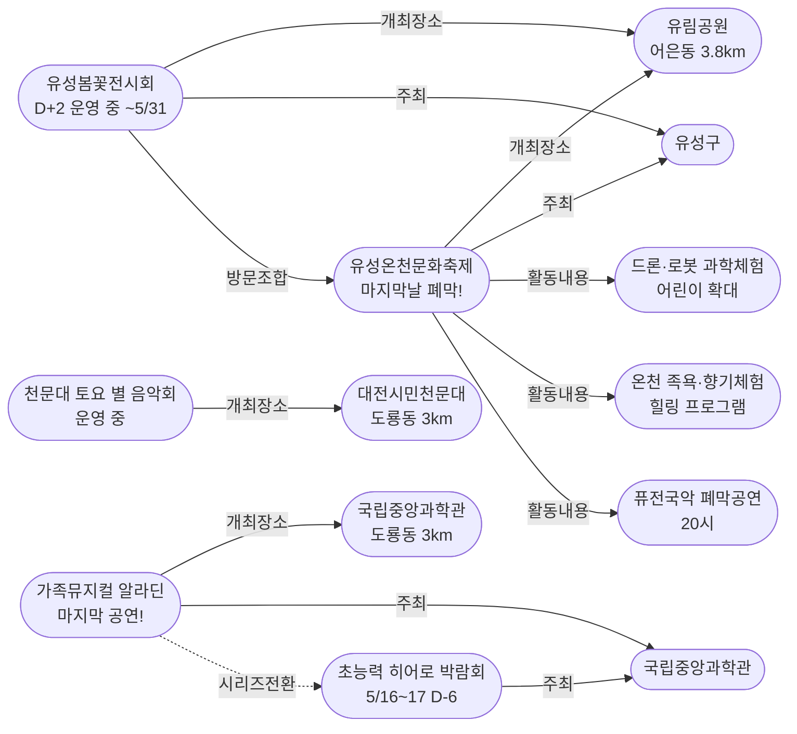
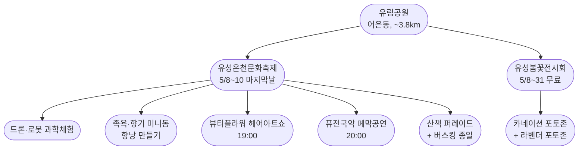
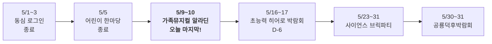

# 2026-05-10 대전 유성구 어린이·가족 이벤트 일일 보고서

## 요약

**유림공원 더블헤더 — 온천문화축제 마지막날 + 봄꽃전시회, 오늘 한 장소에서 동시 즐길 수 있는 마지막 기회.** 오늘의 핵심은 세 가지다. 첫째, **유성온천문화축제(5/8~10)가 유림공원에서 오늘 폐막**한다 — 드론·로봇 과학체험, 온천수 족욕, 청소년 오케스트라, 뮤직댄스 경연 결선, 퓨전국악 폐막공연이 토요일 하루에 집중된다. 둘째, **봄꽃전시회(~5/31)와 동일 장소**이므로 꽃구경+축제를 올인원으로 즐길 수 있는 날은 오늘이 마지막이다. 셋째, **가족뮤지컬 알라딘도 오늘 사이언스홀에서 마지막 공연** — 알라딘 종료와 함께 가정의달 시리즈는 히어로 박람회(5/16~17, D-6)로 본격 전환된다.

## 용성로20 주변 (도보권 내)

### ring-stroll (1km 이내) — 전민동 클러스터 유지 (변동 없음)

| 시설 | 동 | 거리 | 유형 | 상태 |
|------|---|------|------|------|
| 아가랑도서관 | 전민동 | ~0.9km | 도서관 — 아가맘 행복교실 | 운영 중 (4/4~6/27) |
| 유성구 평생학습센터 전민센터 | 전민동 | ~0.8km | 공공기관 원데이클래스 | 운영 중 |
| 전민종합문화센터 | 전민동 | ~0.8km | 문화센터 | 기존 |

> 도보권 내 변동 없음. 전민동 3거점 클러스터 유지.

## 오늘의 추천 (가족 동반 Top 5)

| 순위 | 이벤트 | 장소 (동) | 대상 | 비용 | 비고 |
|------|--------|----------|------|------|------|
| 1 | **유성온천문화축제 + 봄꽃전시회** | 유림공원 (어은동, 3.8km) | 전연령 가족 | **무료** | **축제 마지막날! 꽃+축제 동시 체험 마지막 기회** |
| 2 | **가족뮤지컬 알라딘** | 국립중앙과학관 사이언스홀 (도룡동) | 유아~초등·가족 | 유료 | **마지막 공연! 잔여석 현장** |
| 3 | **대전시민천문대 토요 별 음악회** | 대전시민천문대 (도룡동, 3km) | 전연령 가족 | **무료** | 토요일 프로그램 운영 |
| 4 | 탐이꿈이의 비밀 실험실 | 국립어린이과학관 (도룡동) | 유아~초등저학년 | 유료 | 운영 중 (~6/30) |
| 5 | 아가·맘 행복교실 | 아가랑도서관 (전민동, 0.9km) | 영유아 | 무료 | 운영 중 |

## 업데이트 항목

### 1. 유성온천문화축제 마지막날 — 유림공원에서 폐막

- **출처:** [[주말 여기 어때] 유림공원서 즐기는 '유성온천문화축제' | 굿모닝충청](https://www.goodmorningcc.com/news/articleView.html?idxno=445779)
- **보조 출처:** [유성구, 유림공원서 펼쳐지는 힐링 축제 | 코리아타임뉴스](https://www.koreatimenews.com/news/article.html?no=1144920)
- **보조 출처:** [2026 유성온천문화축제 | 대전관광](https://daejeontour.co.kr/festival_djt/32)
- **일시:** 2026년 5월 8일(목)~10일(토) — **오늘 마지막날**
- **장소:** 유림공원 일원 (어은동, ~3.8km, ring-car)
- **이전 상태:** 5/2~4 온천로 개최로 추적 (사전 발표 기준)
- **금일 변경:** **확정 일정 5/8~10, 장소 유림공원으로 4개 매체 교차확인.** 2026년은 '공원형 축제'로 재구성, '마음 치유' 주제 힐링 콘텐츠 중심.
- **Day 3 (마지막날) 주요 프로그램:**
  - **어린이 체험 프로그램 확대** (종일) + **드론·로봇 과학체험** (종일)
  - **산책 퍼레이드 + 버스킹 공연** (종일, 유림공원 전역)
  - **유성온천 문화목욕탕** — 족욕 체험, 온천향기 치유 미니돔, 향낭 만들기 (유림공원 서편)
  - **청소년 오케스트라 공연** + **뮤직·댄스 경연대회 결선**
  - **뷰티플라워 헤어아트쇼** (19:00, 동편 광장, 유성구 미용협회)
  - **에이플러스 + 퓨전국악 그룹 풍류 폐막공연** (20:00, 동편 메인무대)
- **기타:** 7080 감성 온천거리, 유성 실버페스티벌, 온천수 마사지 체험
- **비용:** 무료 (일부 체험 유료 가능)
- **대상:** 전연령 가족 (어린이 체험 확대 강조)
- **어린이 친화도:** 0.80 (드론·로봇·과학체험·퍼레이드 등 키즈 프로그램 확대)

### 2. 봄꽃전시회+축제 동시개최 확인 — 유림공원 올인원 나들이

- **출처:** ["대전 유림공원 봄꽃 전시회로 놀러오세요" | 대전일보](https://www.daejonilbo.com/news/articleView.html?idxno=2272873)
- **이전 상태:** 봄꽃전시회(5/8~31) 유림공원 운영 중 (5/8 보고서)
- **금일 변경:** **유성온천문화축제(5/8~10)와 동일 장소 동시 개최가 대전일보 보도로 명확히 확인됨**
- **의미:** 꽃 구경(50여 종 8만 본 봄꽃, 라벤더 포토존, 카네이션 포토존) + 축제(족욕·과학체험·공연)를 한 장소에서 즐길 수 있는 올인원 나들이. **축제는 오늘까지이므로 동시 체험은 5/10 한정.**
- **5/11 이후:** 봄꽃전시회만 5/31까지 계속 (축제 종료 후에도 꽃 구경 가능)

### 3. 유성구 도서관 '생활밀착형 독서문화' 정책 보도

- **출처:** [대전 유성구, '생활밀착형 독서문화' 확산...도서관-지역 인프라 연계 | 데일리연합](https://www.dailyan.com/news/article.html?no=765866)
- **보조 출처:** [유성구 '생활밀착형 독서문화' 확산 | 충청도민일보](https://www.dominilbo.com/news/articleView.html?idxno=262086)
- **내용:** 유성구통합도서관이 '생활밀착형 독서문화' 확산 정책으로 지역 인프라와 연계한 프로그램을 체계적으로 운영 중
- **확인된 프로그램:**
  - 전문 인재 활용 북큐레이션
  - 1도서관 1작가 북토크
  - 책으로 여는 대전 역사 산책 (역사 인문학)
  - 시니어 강좌, 북스타트 책놀이 (상반기 진행)
- **어린이 친화도:** 0.65 (일부 프로그램 어린이 대상, 전체적으로는 전연령)
- **의미:** 기존에 개별 추적하던 도서관 프로그램(북스타트·그림책·지역작가)이 유성구 통합 정책 차원에서 체계적으로 운영되고 있음이 매체 보도로 확인됨.

## 신규 오픈 가게·팝업·프로모션

금일 유성구 일대 신규 오픈 가게/팝업/프로모션 발견 없음.

## 공공기관 주최 행사 (행정복지센터·보건소·복지관·도서관·우체국·경찰서·소방서)

| 기관 | 행사 | 상태 | 비고 |
|------|------|------|------|
| **유성구(유성구청)** | **유성온천문화축제** | **마지막날 오늘 폐막!** | 유림공원, 무료 |
| **유성구(유성구청)** | **유성봄꽃전시회** | D+2 운영 중 (~5/31) | 유림공원, 무료 |
| **국립중앙과학관** | **가족뮤지컬 알라딘** | **마지막 공연!** | 사이언스홀, 유료 |
| **국립중앙과학관** | 초능력 히어로 박람회 | D-6 | 사이언스터널, 5/16~17 |
| **유성구통합도서관** | 생활밀착형 독서문화 프로그램 | 운영 중 (정책 보도) | 북큐레이션·북토크·역사산책 |
| 유성구통합도서관 (관평) | 그림책, 나만의 보물을 담다 | 운영 중 | 유아~초등저학년 |
| 유성구통합도서관 | 지역작가 인(人) 도서관 | 5월 운영 중 | 6개 도서관 순회 |
| 아가랑도서관 (전민) | 아가·맘 행복교실 | 운영 중 (4/4~6/27) | 영유아 |
| 대전시민천문대 | 상시 관측 + **토요 별 음악회** | **토요일 운영** | 무료 |
| 유성소방서 | 가정의 달 소방안전체험 | 운영 중 | 솔로몬파크 |
| 유성구 보건소 | 유성이의 튼튼스쿨 | 하반기 예정 | 7/20 신청, 8/19~ |

## 마감 임박 (사전신청 D-3 이내)

| 이벤트 | 일시 | D-day | 비고 |
|--------|------|-------|------|
| **가족뮤지컬 알라딘** | 5/9(금)~10(토) | **마지막날** | 국립중앙과학관 사이언스홀, **오늘 마지막 공연!** |
| **유성온천문화축제** | 5/8(목)~10(토) | **마지막날** | 유림공원, **오늘 폐막!** |

## 동심원별 묶음 (0.5km / 1km / 2km / 5km)

### ring-stroll (1km 이내) — 전민동
- 아가랑도서관 (아가맘 행복교실) — 운영 중
- 유성구 평생학습센터 전민센터 — 운영 중

### ring-bike (2km 이내) — 관평동
- 관평도서관 (그림책 프로그램) — 운영 중

### ring-car (5km 이내) — 어은동·도룡동·노은동

- **유림공원 — 유성온천문화축제 마지막날 + 봄꽃전시회** (어은동, ~3.8km) — **오늘 핵심!**
- **가족뮤지컬 알라딘** (도룡동, ~3km) — **마지막 공연!**
- **대전시민천문대 토요 별 음악회** (도룡동, ~3km) — 정상 운영
- 탐이꿈이의 비밀 실험실 (도룡동, ~3km) — 운영 중 (~6/30)
- 국립중앙과학관 (도룡동, ~3km) — 상시
- 너티차일드 키즈테마파크 (도룡동, ~3.5km) — 상시
- 대전광역시어린이회관 (노은동, ~4km) — 상시
- 대전 오월드 (어은동, ~4.5km) — 5월 말까지 재개장 불가

## 동(洞)별 이벤트 묶음

| 동 | 1차 타겟 | 금일 이벤트 |
|----|---------|------------|
| **어은동** | — | **유림공원: 온천축제(폐막) + 봄꽃전시회** |
| **도룡동** | O | **알라딘(마지막)** + 천문대(토요 별 음악회) + 탐이꿈이 |
| **전민동** | O | 아가맘 행복교실, 평생학습센터 |
| **관평동** | O | 관평도서관 그림책 프로그램 |
| 용산동 | O | 금일 해당 없음 |
| 문지동 | O | 금일 해당 없음 |
| 신성동 | O | 금일 해당 없음 |
| 노은동 | — | 어린이회관 상시 |

## 연령대별 묶음

| 연령대 | 추천 이벤트 |
|--------|-----------|
| 영유아 (0~3) | 아가맘 행복교실 (전민동, 0.9km) |
| 유아 (4~6) | **알라딘(마지막!)**, 유림공원 축제 어린이체험, 탐이꿈이 비밀실험실 |
| 초등저학년 (7~9) | **유림공원 드론·로봇 과학체험**, 알라딘, 천문대 토요 별 음악회 |
| 초등고학년 (10~12) | **유림공원 드론·로봇 과학체험**, 천문대 야간관측, 히어로 D-6 사전준비 |
| 전연령 가족 | **유림공원 올인원(축제+꽃)**, 천문대 토요 별 음악회, 알라딘 + 과학관 동선 |

## 시리즈/정기 프로그램 업데이트

| 시리즈 | 금일 상태 | 다음 일정 |
|--------|---------|----------|
| 국립중앙과학관 가정의 달 | **알라딘 마지막날 — 시리즈 전환점** | **5/16~17 히어로 박람회 (D-6)** |
| 유성온천문화축제 | **마지막날 폐막** | 내년 |
| 유성봄꽃전시회 | D+2 운영 중 | 5/31까지 매일 (유림공원, 무료) |
| 유성소방서 안전체험 | 운영 중 | 5월 내 사전신청 |
| 유성구 도서관 프로그램 | 운영 중 (정책 보도 확인) | 북스타트·그림책·작가·북큐레이션 |
| 탐이꿈이의 비밀 실험실 | 운영 중 (~6/30) | 국립어린이과학관 사전예약 |
| 대전시민천문대 | **토요 별 음악회** | 매일(화~일) 14:00~22:00 |
| 유성이의 튼튼스쿨 | 하반기 예정 | 7/20 신청, 8/19~11/27 운영 |

## 지식그래프 시각화

### 오늘의 주요 관계

유림공원이 오늘의 중심 노드가 되었다. 유성온천문화축제와 봄꽃전시회가 동일 장소에서 동시 개최됨이 확정되면서, 이전에 잠정(0.70)이었던 방문 조합이 확정(0.95)으로 격상되었다. 동시에 알라딘이 오늘 종료되면서 가정의달 시리즈의 "알라딘 → 히어로" 전환이 확정되었다.

### 전체 지식그래프 시각화

### 유림공원 올인원 구조 (신규)

### 가정의달 시리즈 타임라인

## 온톨로지 변경

| 변경 유형 | 대상 | 근거 |
|----------|------|------|
| 속성 수정 | ent-evt-021 유성온천문화축제 | 일정 5/8~10, 장소 유림공원으로 수정 (4개 매체 교차확인) |
| 새 Activity ×4 | ent-act-016~019 | 축제 Day3 프로그램: 드론·로봇, 족욕·향기, 헤어아트쇼, 폐막공연 |
| 상태 업데이트 | ent-evt-025 알라딘 | D-day → 마지막날 |
| 관계 확정 | ent-evt-033 visitCombo ent-evt-021 | 동일장소 동시개최 확인 (0.70→0.95) |

## 추론 결과

| 추론 | 신뢰도 | 근거 |
|------|--------|------|
| 봄꽃전시+온천축제 방문조합 확정 | 0.95 | 동일 장소(유림공원) 동시개최 (same_dong_combo) |
| 드론·로봇 과학체험 kidFriendlyBoost | 0.85 | 과학도시 테마 어린이 체험 (operator_kid_friendliness) |
| 유림공원 ring-car 확인 | 0.95 | ~3.8km = ring-car (anchor_distance_priority) |
| 알라딘→히어로 시리즈 전환 확정 | 0.95 | 동일 주최·장소, 종료→개시 연속 (same_venue_series) |

## 분석 및 평가

오늘은 **토요일, 유림공원 더블헤더 + 알라딘 마지막날**이다. 유성구 가족에게 오늘은 '선택의 기로'보다는 '동선 조합'의 날이다.

**금일의 핵심:**

1. **유림공원 올인원**: 유성온천문화축제(마지막날)와 봄꽃전시회가 유림공원에서 동시에 열린다. 오전에 꽃구경(라벤더 포토존·카네이션 포토존), 오후에 드론·로봇 과학체험, 족욕·향기 미니돔, 저녁에 청소년 오케스트라→경연 결선→헤어아트쇼(19시)→폐막공연(20시)까지 종일 프로그램이 이어진다. 축제와 꽃을 동시에 즐길 수 있는 날은 오늘이 마지막이다.

2. **온천문화축제 일정·장소 수정**: 이전 보고에서 5/2~4, 온천로로 추적했던 축제가 실제로는 5/8~10, 유림공원에서 '공원형 축제'로 재구성되어 개최되었음이 4개 매체(굿모닝충청·코리아타임뉴스·대전관광공사·대전일보) 교차확인으로 확정되었다. 온톨로지의 일정·장소 속성을 수정했다.

3. **알라딘 마지막 공연**: 국립중앙과학관 사이언스홀에서 오늘 마지막 공연. 잔여석이 있다면 현장 구매 가능할 수 있다.

4. **시리즈 전환점**: 알라딘 종료(오늘)로 가정의달 시리즈 3번째 행사가 마무리된다. 다음 주자는 초능력 히어로 박람회(5/16~17, D-6). 프로그램 상세가 이미 공개되었으므로 사전 히어로파티 등록으로 입학시험 면제 + 멘토퍼레이드 참여가 가능하다.

5. **도서관 정책**: 유성구 도서관의 '생활밀착형 독서문화' 정책이 매체에 보도되었다. 신규 프로그램은 아니지만, 기존에 개별 추적하던 프로그램들이 체계적 정책 하에 운영됨을 확인했다.

**이번 주말 남은 일정:**
- **5/10(토) 오늘**: 유림공원 축제 폐막 + 알라딘 마지막
- 5/11(일): 봄꽃전시회(축제 없이 단독), 천문대 정상 운영
- 5/12(월): 히어로 D-4 진입

## 추적 항목

| 항목 | 최초 보고 | 상태 | 최신 업데이트 |
|------|----------|------|-------------|
| **유성온천문화축제** | 2026-04-27 | **마지막날 폐막** | 유림공원, 5/8~10 확정 (일정·장소 수정) |
| **가족뮤지컬 알라딘** | 2026-04-30 | **마지막 공연** | 사이언스홀, 오늘 종료 |
| **초능력 히어로 박람회** | 2026-04-30 | D-6 | 5/16~17 사이언스터널, 프로그램 상세 공개 완료 |
| 유성봄꽃전시회 | 2026-05-08 | D+2 운영 중 | 유림공원 5/31까지, 무료 |
| 대전 오월드 재개장 | 2026-05-06 | 5월 말까지 불가 | 변동 없음 |
| 유성소방서 안전체험 | 2026-04-26 | 운영 중 | 솔로몬파크 |
| 대전시민천문대 | 2026-04-25 | **토요 별 음악회** | 화~일 14:00~22:00 |
| 과학관 가정의달 시리즈 | 2026-04-30 | **알라딘 마지막→히어로 D-6** | 시리즈 전환점 |
| 도서관 프로그램 | 2026-04-25 | **정책 보도 확인** | 생활밀착형 독서문화 |
| 유성이의 튼튼스쿨 | 2026-05-07 | 하반기 예정 | 7/20 신청, 8/19~ 운영 |

## 동향 요약

| 분류 | 상태 | 비고 |
|------|------|------|
| 어린이·가족 이벤트 | **축제 마지막날 + 알라딘 마지막 + 히어로 D-6** | 토요일 집중, 시리즈 전환 |
| 신규 가게/팝업 | **금일 신규 없음** | — |
| 공공기관 행사 | 유성구(축제·봄꽃전시) + 과학관(알라딘 마지막) + 도서관(정책 보도) | — |

## 출처 목록

1. [[주말 여기 어때] 유림공원서 즐기는 '유성온천문화축제' | 굿모닝충청](https://www.goodmorningcc.com/news/articleView.html?idxno=445779) - 굿모닝충청
2. [유성구, 유림공원서 펼쳐지는 힐링 축제 '유성온천문화축제' | 코리아타임뉴스](https://www.koreatimenews.com/news/article.html?no=1144920) - 코리아타임뉴스
3. ["대전 유림공원 봄꽃 전시회로 놀러오세요" | 대전일보](https://www.daejonilbo.com/news/articleView.html?idxno=2272873) - 대전일보
4. [2026 유성온천문화축제 | 대전관광](https://daejeontour.co.kr/festival_djt/32) - 대전관광공사
5. [대전 유성구, '생활밀착형 독서문화' 확산 | 데일리연합](https://www.dailyan.com/news/article.html?no=765866) - 데일리연합
6. [유성구 '생활밀착형 독서문화' 확산 | 충청도민일보](https://www.dominilbo.com/news/articleView.html?idxno=262086) - 충청도민일보
7. [국립중앙과학관 행사안내](https://www.science.go.kr/mps/1070/bbs/431/moveBbsNttList.do) - 국립중앙과학관
8. [대전시민천문대](https://djstar.kr/) - 대전시민천문대 공식
9. [유성구통합도서관](https://lib.yuseong.go.kr/) - 유성구통합도서관 공식
10. [과기정통부 초능력 히어로 박람회 개최 | 뉴스서울](https://newsseoul.co.kr/news/view/1065584409950991) - 뉴스서울
11. [유성온천문화축제 공식](http://ysfesta.com/) - 유성온천문화축제
12. [유성이의 튼튼스쿨 | 시사저널](https://www.sisajournal.com/news/articleView.html?idxno=371774) - 시사저널
