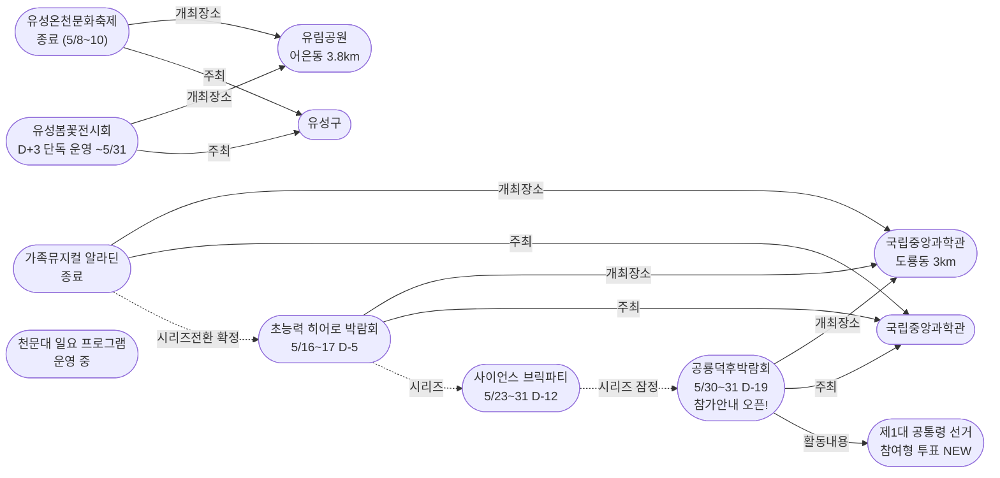
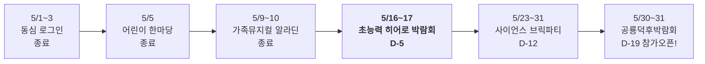
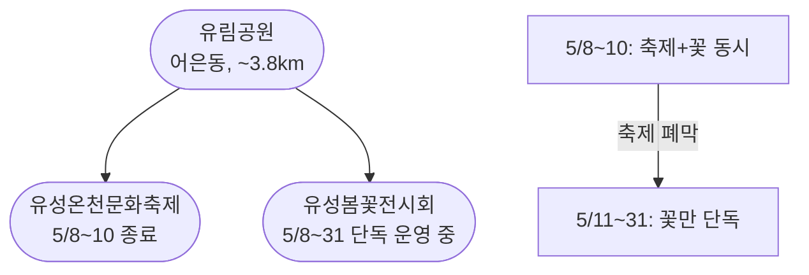

# 2026-05-11 대전 유성구 어린이·가족 이벤트 일일 보고서

## 요약

**축제 후 일요일 — 유림공원 봄꽃전시회 단독 운영, 다음 주 히어로 박람회로 포커스 전환.** 어제(5/10) 유성온천문화축제와 가족뮤지컬 알라딘이 동시에 종료되면서 지난 2주간 이어진 가정의달 축제 러시가 일단락되었다. 충남일보 르포에 따르면 축제는 3일간 불꽃·DJ파티·플리마켓·야간포토존으로 성황리에 폐막했다. 오늘부터 유림공원은 봄꽃전시회(~5/31)만 단독 운영되며, 가정의달 시리즈 포커스는 **초능력 히어로 박람회(5/16~17, D-5)**로 전환된다. 한편 **공룡덕후박람회(5/30~31)** 참가 신청이 공식 오픈되고 '제1대 공통령 선거' 프로그램이 공개되었다.

## 용성로20 주변 (도보권 내)

### ring-stroll (1km 이내) — 전민동 클러스터 유지 (변동 없음)

| 시설 | 동 | 거리 | 유형 | 상태 |
|------|---|------|------|------|
| 아가랑도서관 | 전민동 | ~0.9km | 도서관 — 아가맘 행복교실 | 운영 중 (4/4~6/27) |
| 유성구 평생학습센터 전민센터 | 전민동 | ~0.8km | 공공기관 원데이클래스 | 운영 중 |
| 전민종합문화센터 | 전민동 | ~0.8km | 문화센터 | 기존 |

> 도보권 내 변동 없음. 전민동 3거점 클러스터 유지.

## 오늘의 추천 (가족 동반 Top 5)

| 순위 | 이벤트 | 장소 (동) | 대상 | 비용 | 비고 |
|------|--------|----------|------|------|------|
| 1 | **유성봄꽃전시회** | 유림공원 (어은동, 3.8km) | 전연령 가족 | **무료** | 축제 종료 후 단독 — 여유롭게 꽃 감상 |
| 2 | **대전시민천문대 일요 프로그램** | 대전시민천문대 (도룡동, 3km) | 전연령 가족 | **무료** | 14:00~22:00 정상 운영 |
| 3 | 탐이꿈이의 비밀 실험실 | 국립어린이과학관 (도룡동) | 유아~초등저학년 | 유료 | 운영 중 (~6/30) |
| 4 | 아가·맘 행복교실 | 아가랑도서관 (전민동, 0.9km) | 영유아 | 무료 | 운영 중 |
| 5 | 국립중앙과학관 상설 전시 | 국립중앙과학관 (도룡동, 3km) | 전연령 가족 | 무료 | 일요일 운영 |

## 신규 보도

### 1. 유성온천문화축제 폐막 르포 — 충남일보 현장 기록

- **출처:** [[르포] 불꽃 터지고 함성도 터지고…초여름 밤공기 달군 '2026 유성온천문화축제' | 충남일보](https://www.chungnamilbo.co.kr/news/articleView.html?idxno=887523)
- **일시:** 2026년 5월 8일(목)~10일(토) — **폐막 완료**
- **장소:** 유림공원 일원 (어은동, ~3.8km, ring-car)
- **내용:** 3일간 유림공원 일대에서 개최된 축제가 성황리에 폐막했다. 충남일보 르포에 따르면 공연장·체험부스·플리마켓·야간 포토존 등 행사장 곳곳에 시민들의 발길이 이어졌다. 풍차 조형물 구역이 특히 인기였으며, 폐막 전야에는 도미노보이즈·래원·한요한이 참여한 DJ파티에서 불꽃이 치솟으며 수천 명의 함성이 터졌다. 폐막공연으로 레베로프 메타버스 VR 드로잉 퍼포먼스와 테너 류정필&코아모러스가 출연했다.
- **상태:** **종료** ← 2026-04-27 "유성온천문화축제 일정 확정"
- **관련 엔티티:** 유성온천문화축제, 유림공원, 유성구
- **어린이 친화도:** 0.80 (어린이 체험 프로그램 확대 운영 확인)

## 업데이트 항목

### 2. 가족뮤지컬 알라딘 종료 — 가정의달 시리즈 히어로 박람회로 전환

- **출처:** [국립중앙과학관 행사안내](https://www.science.go.kr/mps/1070/bbs/431/moveBbsNttList.do)
- **이전 상태:** 5/10 마지막 공연 (어제 보고)
- **금일 변경:** **공연 완료, 종료 확정.** 가정의달 시리즈 3번째 행사(알라딘) 마무리, 4번째 행사인 초능력 히어로 박람회(5/16~17, **D-5**)로 본격 전환.
- **시리즈 진행:** 동심로그인(종료) → 어린이한마당(종료) → **알라딘(종료)** → 히어로 박람회(D-5) → 브릭파티(D-12) → 공룡덕후(D-19)

### 3. 공룡덕후박람회 참가안내 공식 오픈 + '공통령 선거' 프로그램 공개

- **출처:** [세계 공룡의 날 공룡덕후박람회 참가안내 | 국립중앙과학관](https://www.science.go.kr/mps/0/bbs/208/moveBbsNttDetail.do?nttSn=47305)
- **보조 출처:** [국립중앙과학관 세계 공룡의 날맞아 '공룡덕후 박람회' 연다 | 소년한국일보](https://www.kidshankook.kr/news/articleView.html?idxno=13845)
- **보조 출처:** [국립중앙과학관, 세계 공룡의 날 박람회 개최 | YTN사이언스](https://m.science.ytn.co.kr/program/view_today.php?s_mcd=0082&key=202505211112442017)
- **이전 상태:** 일정(5/30~31)만 확인 (4/30 보고)
- **금일 변경:** **참가 신청 페이지 공식 오픈.** 단체/개인 참가 신청 가능. **신규 프로그램 '제1대 공통령(恐統領) 선거'** — 관람객이 좋아하는 공룡에 투표하는 참여형 투표 이벤트 공개. 소년한국일보·YTN사이언스·공공포털 등 다수 매체 사전 보도 본격화.
- **일시:** 2026년 5월 30일(토)~31일(일) — **D-19**
- **장소:** 국립중앙과학관 사이언스터널·꿈이광장 일대 (도룡동, ~3km)
- **대상:** 유아~초등~전연령 가족
- **어린이 친화도:** 0.90

## 신규 오픈 가게·팝업·프로모션

금일 유성구 일대 신규 오픈 가게/팝업/프로모션 발견 없음.

## 공공기관 주최 행사 (행정복지센터·보건소·복지관·도서관·우체국·경찰서·소방서)

| 기관 | 행사 | 상태 | 비고 |
|------|------|------|------|
| **유성구(유성구청)** | **유성온천문화축제** | **종료 (5/8~10)** | 충남일보 르포로 폐막 확인 |
| **유성구(유성구청)** | **유성봄꽃전시회** | D+3 운영 중 (~5/31) | 유림공원, 무료, 축제 종료 후 단독 |
| **국립중앙과학관** | 초능력 히어로 박람회 | **D-5** | 사이언스터널, 5/16~17 |
| **국립중앙과학관** | **공룡덕후박람회** | **참가안내 오픈 D-19** | 사이언스터널·꿈이광장, 5/30~31 |
| 유성구통합도서관 (관평) | 그림책, 나만의 보물을 담다 | 운영 중 | 유아~초등저학년 |
| 유성구통합도서관 | 지역작가 인(人) 도서관 | 5월 운영 중 | 6개 도서관 순회 |
| 아가랑도서관 (전민) | 아가·맘 행복교실 | 운영 중 (4/4~6/27) | 영유아 |
| 대전시민천문대 | 상시 관측 프로그램 | **일요일 정상 운영** | 무료, 14:00~22:00 |
| 유성소방서 | 가정의 달 소방안전체험 | 운영 중 | 솔로몬파크 |
| 유성구 보건소 | 유성이의 튼튼스쿨 | 하반기 예정 | 7/20 신청, 8/19~ |

## 마감 임박 (사전신청 D-3 이내)

금일 사전신청 마감 임박 항목 없음. 다음 마감 대상: 히어로 박람회 (5/16~17, D-5) — 사전 히어로파티 등록은 아직 진행 중.

## 동심원별 묶음 (0.5km / 1km / 2km / 5km)

### ring-stroll (1km 이내) — 전민동
- 아가랑도서관 (아가맘 행복교실) — 운영 중
- 유성구 평생학습센터 전민센터 — 운영 중

### ring-bike (2km 이내) — 관평동
- 관평도서관 (그림책 프로그램) — 운영 중

### ring-car (5km 이내) — 어은동·도룡동·노은동

- **유림공원 — 봄꽃전시회 단독 운영** (어은동, ~3.8km) — 축제 종료, 여유롭게 꽃 감상
- **대전시민천문대** (도룡동, ~3km) — 일요일 정상 운영
- 탐이꿈이의 비밀 실험실 (도룡동, ~3km) — 운영 중 (~6/30)
- 국립중앙과학관 (도룡동, ~3km) — 상시
- 너티차일드 키즈테마파크 (도룡동, ~3.5km) — 상시
- 대전광역시어린이회관 (노은동, ~4km) — 상시
- 대전 오월드 (어은동, ~4.5km) — 5월 말까지 재개장 불가

## 동(洞)별 이벤트 묶음

| 동 | 1차 타겟 | 금일 이벤트 |
|----|---------|------------|
| **어은동** | — | **유림공원: 봄꽃전시회 (축제 종료 후 단독)** |
| **도룡동** | O | 천문대(일요 운영) + 탐이꿈이 + 과학관 상시 |
| **전민동** | O | 아가맘 행복교실, 평생학습센터 |
| **관평동** | O | 관평도서관 그림책 프로그램 |
| 용산동 | O | 금일 해당 없음 |
| 문지동 | O | 금일 해당 없음 |
| 신성동 | O | 금일 해당 없음 |
| 노은동 | — | 어린이회관 상시 |

## 연령대별 묶음

| 연령대 | 추천 이벤트 |
|--------|-----------|
| 영유아 (0~3) | 아가맘 행복교실 (전민동, 0.9km) |
| 유아 (4~6) | 유림공원 봄꽃전시회, 탐이꿈이 비밀실험실 |
| 초등저학년 (7~9) | 유림공원 봄꽃전시회, 천문대 일요 프로그램, 과학관 상설 |
| 초등고학년 (10~12) | 천문대 야간관측, 히어로 D-5 사전준비, 공룡덕후 참가 신청 |
| 전연령 가족 | **유림공원 봄꽃(축제 없이 여유)**, 천문대, 과학관 동선 |

## 시리즈/정기 프로그램 업데이트

| 시리즈 | 금일 상태 | 다음 일정 |
|--------|---------|----------|
| 국립중앙과학관 가정의 달 | **알라딘 종료 → 히어로 전환 완료** | **5/16~17 히어로 박람회 (D-5)** |
| 유성온천문화축제 | **종료 (폐막 르포 확인)** | 내년 |
| 유성봄꽃전시회 | D+3 단독 운영 | 5/31까지 매일 (유림공원, 무료) |
| **공룡덕후박람회** | **참가안내 오픈 + 공통령 선거 공개** | **5/30~31 (D-19)** |
| 사이언스 브릭파티 | 사전 안내 | 5/23~31 (D-12) |
| 유성소방서 안전체험 | 운영 중 | 5월 내 사전신청 |
| 유성구 도서관 프로그램 | 운영 중 | 북스타트·그림책·작가·북큐레이션 |
| 탐이꿈이의 비밀 실험실 | 운영 중 (~6/30) | 국립어린이과학관 사전예약 |
| 대전시민천문대 | **일요일 정상 운영** | 매일(화~일) 14:00~22:00 |
| 유성이의 튼튼스쿨 | 하반기 예정 | 7/20 신청, 8/19~11/27 운영 |

## 지식그래프 시각화

### 오늘의 주요 관계

오늘은 "종료와 전환"이 핵심이다. 유성온천문화축제와 알라딘이 동시에 종료되면서 두 노드가 "종료" 상태로 전환되었고, 봄꽃전시회+축제 방문조합(0.95)이 무효화되었다. 알라딘→히어로 시리즈 순서가 확정되었고, 공룡덕후박람회에 "공통령 선거" Activity 노드가 추가되었다.

### 전체 지식그래프 시각화

### 가정의달 시리즈 타임라인 (시리즈 전환점)

### 유림공원 상태 변화

## 온톨로지 변경

| 변경 유형 | 대상 | 근거 |
|----------|------|------|
| 새 Activity | ent-act-020 제1대 공통령 선거 | 공룡덕후박람회 참가안내 공개로 신규 프로그램 확인 |
| 상태 업데이트 | ent-evt-021 유성온천문화축제 → 종료 | 충남일보 폐막 르포 |
| 상태 업데이트 | ent-evt-025 알라딘 → 종료 | 5/10 마지막 공연 완료 |
| 속성 업데이트 | ent-evt-028 registration_open=true | 참가 신청 페이지 공식 오픈 |

## 추론 결과

| 추론 | 신뢰도 | 근거 |
|------|--------|------|
| 알라딘→히어로 시리즈 순서 확정 | 0.95 | 알라딘 종료 확정, 동일 주최·장소 (same_venue_series) |
| 브릭파티→공룡덕후 시리즈 관계 잠정 | 0.80 | 일정 겹침(5/30~31), 동일 주최 — 별도 행사/동시개최 확인 필요 |
| 공통령 선거 kidFriendlyBoost | 0.85 | 과학관 운영 참여형 프로그램 (operator_kid_friendliness) |
| 봄꽃+축제 방문조합 무효화 | 0.0 | 축제 종료로 동시 방문 불가 |

## 분석 및 평가

오늘은 **일요일, 축제 후 정리의 날**이다. 두 대형 이벤트(유성온천문화축제, 알라딘)가 어제 동시에 종료되면서 지난 2주간의 가정의달 축제 러시가 일단락되었다.

**금일의 핵심:**

1. **축제 폐막 르포**: 충남일보가 유성온천문화축제 현장을 르포로 기록했다. 공연·체험·플리마켓·야간포토존 등 곳곳이 성황이었으며, 불꽃+DJ파티로 마무리한 것이 확인됐다. 4/27부터 16일간 추적한 축제가 공식 종료되었다.

2. **시리즈 전환점**: 알라딘 종료로 가정의달 시리즈가 3번째 행사까지 마무리됐다. 이제 포커스는 **히어로 박람회(D-5)**로 이동한다. 프로그램 상세는 이미 공개되었으므로 사전 히어로파티 등록이 유일한 사전 준비 사항이다.

3. **공룡덕후박람회 사전 준비 본격화**: 5/30~31 개최 예정인 공룡덕후박람회의 참가 신청이 공식 오픈되었다. '공통령 선거'라는 참여형 투표 이벤트가 새로 공개되어 어린이 흥미를 끌 수 있는 프로그램이 추가되었다.

4. **유림공원 전환**: 축제가 끝나면서 유림공원은 봄꽃전시회만 단독 운영된다. 오히려 축제 때보다 여유롭게 50여 종 8만 본의 봄꽃을 감상할 수 있는 환경이 되었다.

5. **도보권 안정**: 전민동 클러스터(아가맘·평생학습·문화센터)는 변동 없이 안정적으로 운영 중이다.

**이번 주 남은 일정:**
- 5/12(월): 천문대 휴관일, 히어로 D-4
- 5/13~15(화~목): 히어로 D-3~D-1 (사전 준비 집중)
- **5/16~17(금~토): 초능력 히어로 박람회 D-day**

## 추적 항목

| 항목 | 최초 보고 | 상태 | 최신 업데이트 |
|------|----------|------|-------------|
| **유성온천문화축제** | 2026-04-27 | **종료** | 충남일보 르포로 폐막 확인 (5/8~10) |
| **가족뮤지컬 알라딘** | 2026-04-30 | **종료** | 5/10 마지막 공연 완료 |
| **초능력 히어로 박람회** | 2026-04-30 | **D-5** | 5/16~17 사이언스터널, 프로그램 상세 공개 완료 |
| **공룡덕후박람회** | 2026-04-30 | **D-19 참가안내 오픈** | 참가 신청 + 공통령 선거 프로그램 공개 |
| 사이언스 브릭파티 | 2026-04-30 | D-12 | 5/23~31, 사전 안내 |
| 유성봄꽃전시회 | 2026-05-08 | D+3 단독 운영 | 유림공원 5/31까지, 무료 |
| 대전 오월드 재개장 | 2026-05-06 | 5월 말까지 불가 | 변동 없음 |
| 유성소방서 안전체험 | 2026-04-26 | 운영 중 | 솔로몬파크 |
| 대전시민천문대 | 2026-04-25 | **일요일 정상 운영** | 화~일 14:00~22:00 |
| 과학관 가정의달 시리즈 | 2026-04-30 | **알라딘 종료→히어로 D-5** | 시리즈 전환 완료 |
| 도서관 프로그램 | 2026-04-25 | 운영 중 | 생활밀착형 독서문화 |
| 유성이의 튼튼스쿨 | 2026-05-07 | 하반기 예정 | 7/20 신청, 8/19~ 운영 |

## 동향 요약

| 분류 | 상태 | 비고 |
|------|------|------|
| 어린이·가족 이벤트 | **축제+알라딘 종료, 히어로 D-5, 공룡덕후 참가 오픈** | 전환기 — 다음 주 히어로 집중 |
| 신규 가게/팝업 | **금일 신규 없음** | — |
| 공공기관 행사 | 축제 폐막(유성구) + 과학관(알라딘 종료, 공룡덕후 참가 오픈) + 도서관(운영 중) | — |

## 출처 목록

1. [[르포] 불꽃 터지고 함성도 터지고…초여름 밤공기 달군 '2026 유성온천문화축제' | 충남일보](https://www.chungnamilbo.co.kr/news/articleView.html?idxno=887523) - 충남일보
2. [유성온천문화축제 공식](http://ysfesta.com/) - 유성온천문화축제
3. [국립중앙과학관 행사안내](https://www.science.go.kr/mps/1070/bbs/431/moveBbsNttList.do) - 국립중앙과학관
4. [세계 공룡의 날 공룡덕후박람회 참가안내 | 국립중앙과학관](https://www.science.go.kr/mps/0/bbs/208/moveBbsNttDetail.do?nttSn=47305) - 국립중앙과학관
5. [국립중앙과학관 공룡덕후박람회 제1대 공통령 선거](https://www.science.go.kr/mps/0/bbs/208/moveBbsNttDetail.do?nttSn=47381) - 국립중앙과학관
6. [국립중앙과학관 세계 공룡의 날맞아 '공룡덕후 박람회' 연다 | 소년한국일보](https://www.kidshankook.kr/news/articleView.html?idxno=13845) - 소년한국일보
7. [국립중앙과학관, 세계 공룡의 날 박람회 개최 | YTN사이언스](https://m.science.ytn.co.kr/program/view_today.php?s_mcd=0082&key=202505211112442017) - YTN사이언스
8. [유림공원 봄꽃나들이 | 웰로](https://www.welfarehello.com/community/hometownNews/faf70a22-9d1b-4b94-a6f2-72fa4d6d4654) - 웰로
9. [대전시민천문대](https://djstar.kr/) - 대전시민천문대 공식
10. [유성구통합도서관](https://lib.yuseong.go.kr/) - 유성구통합도서관 공식
11. [대전 오월드 5월 재개장 불가 | 뉴스1](https://www.news1.kr/local/daejeon-chungnam/6149846) - 뉴스1
12. [유성이의 튼튼스쿨 | 시사저널](https://www.sisajournal.com/news/articleView.html?idxno=371774) - 시사저널
