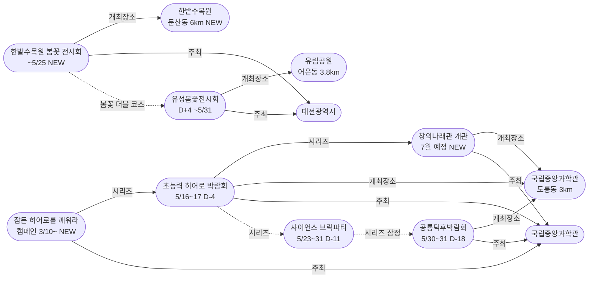
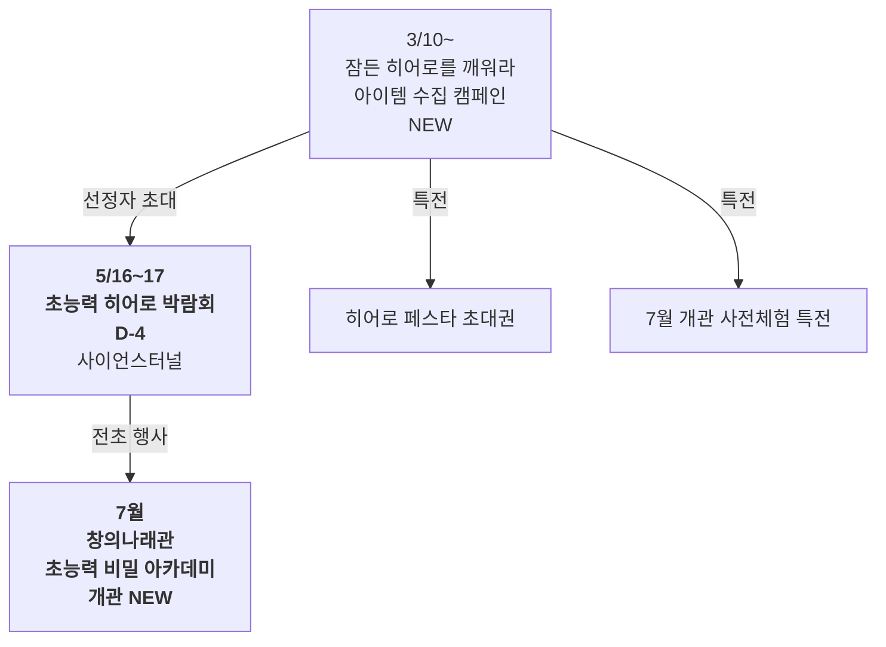
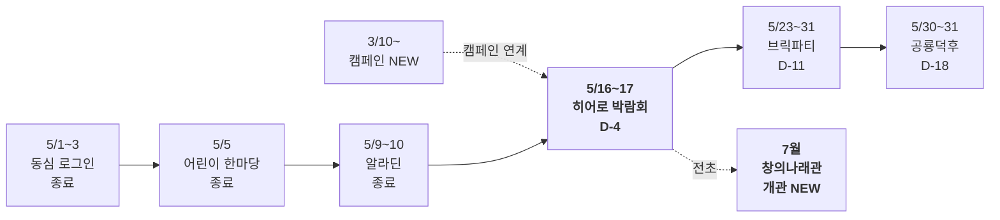

# 2026-05-12 대전 유성구 어린이·가족 이벤트 일일 보고서

## 요약

**히어로 박람회 D-4 — 창의나래관 개관(7월)의 전초 행사임이 밝혀지다.** 정책브리핑 보도자료로 '잠든 히어로를 깨워라' 아이템 수집 캠페인이 발견되었다. 이를 통해 초능력 히어로 박람회(5/16~17)가 단순 가정의달 행사가 아니라 **국립중앙과학관 창의나래관 '초능력 비밀 아카데미' 7월 개관의 전초 행사**라는 상위 전략이 확인되었다. 또한 **한밭수목원 봄꽃 전시회(5/8~25)**가 신규 발견되어 유림공원 봄꽃전시회와 함께 '봄꽃 더블' 코스가 가능해졌다. 오늘은 월요일로 **대전시민천문대가 정기 휴관**이다.

## 용성로20 주변 (도보권 내)

### ring-stroll (1km 이내) — 전민동 클러스터 유지 (변동 없음)

| 시설 | 동 | 거리 | 유형 | 상태 |
|------|---|------|------|------|
| 아가랑도서관 | 전민동 | ~0.9km | 도서관 — 아가맘 행복교실 | 운영 중 (4/4~6/27) |
| 유성구 평생학습센터 전민센터 | 전민동 | ~0.8km | 공공기관 원데이클래스 | 운영 중 |
| 전민종합문화센터 | 전민동 | ~0.8km | 문화센터 | 기존 |

> 도보권 내 변동 없음. 전민동 3거점 클러스터 유지.

## 오늘의 추천 (가족 동반 Top 5)

| 순위 | 이벤트 | 장소 (동) | 대상 | 비용 | 비고 |
|------|--------|----------|------|------|------|
| 1 | **유성봄꽃전시회** | 유림공원 (어은동, 3.8km) | 전연령 가족 | **무료** | D+4 단독 운영, 축제 없어 여유 |
| 2 | **한밭수목원 봄꽃 전시회** | 한밭수목원 (둔산동, 6km) | 전연령 가족 | **무료** | **NEW** — 유림공원과 봄꽃 더블 코스 |
| 3 | 탐이꿈이의 비밀 실험실 | 국립어린이과학관 (도룡동) | 유아~초등저학년 | 유료 | 운영 중 (~6/30) |
| 4 | 아가·맘 행복교실 | 아가랑도서관 (전민동, 0.9km) | 영유아 | 무료 | 운영 중 |
| 5 | 국립중앙과학관 상설 전시 | 국립중앙과학관 (도룡동, 3km) | 전연령 가족 | 무료 | 월요일 정상 운영 |

> **주의:** 대전시민천문대는 월요일 정기 휴관 (화~일 14:00~22:00)

## 신규 이벤트

### 1. 한밭수목원 '2026 봄꽃 전시회' — 오월의 꽃마중 (5/8~25)

- **출처:** [대전시 '5월에 꽃마중 오세요~' 한밭수목원, '2026 봄꽃 전시회' 개최 | 더SNS타임](https://www.thesnstime.com/daejeonsi-5weole-ggocmajung-oseyo-hanbatsumogweon-2026-bomggoc-jeonsihoe-gaecoe/)
- **보조 출처:** [대전 한밭수목원, '2026 봄꽃 전시회' 팡파르 | 헤럴드경제](https://biz.heraldcorp.com/article/10733502)
- **보조 출처:** ['봄의 향연' 한밭수목원 봄꽃 전시회 | 중부매일](https://www.jbnews.com/news/articleView.html?idxno=1503723)
- **일시:** 2026년 5월 8일(목)~25일(일) — **D+4, 남은 기간 13일**
- **장소:** 한밭수목원 동원·서원 일원 (둔산동, ~6km, ring 초과)
- **비용:** **무료** (주차 1시간 무료, 이후 30분 500원)
- **운영시간:** 05:00~21:00
- **내용:** '오월의 꽃마중'을 주제로 작약·으아리(클레마티스)·장미·해당화 등 봄꽃을 전시한다. 수직 정원, 장미원, 해당화 수변 등 다양한 조형으로 구성. **스탬프 투어**가 마련되어 가족 단위 참여 미션으로 즐길 수 있다.
- **상태:** 신규 발견
- **어린이 친화도:** 0.65 (꽃 전시·산책 위주, 스탬프 투어가 가족 참여 유도)
- **동심원:** ring 초과(6km) — 유성구 인접 둔산권이지만 config에 모니터링 대상으로 포함
- **관련 엔티티:** 한밭수목원, 대전광역시, 스탬프 투어

> **봄꽃 더블 코스:** 유림공원 유성봄꽃전시회(~5/31)와 한밭수목원(~5/25) 동시 운영 중. 두 곳 모두 무료·야외 산책형으로, 차량 이동(약 4km)하면 하루에 두 곳 관람 가능.

### 2. '잠든 히어로를 깨워라' 대국민 아이템 수집 전 — 창의나래관 7월 개관 연계 캠페인

- **출처:** [『잠든 영웅(히어로)을 깨워라』 대국민 초능력 아이템 수집 전 시작 | 정책브리핑](https://www.korea.kr/briefing/pressReleaseView.do?newsId=156748115&call_from=rsslink)
- **보조 출처:** [국립중앙과학관 '잠든 히어로를 깨워라' 캠페인 | IDSN](https://idsn.co.kr/news/view/1065593651704268)
- **일시:** 2026년 3월 10일~ (진행 중)
- **장소:** 국립중앙과학관 (온라인+현장)
- **비용:** 무료 (참여형)
- **내용:** 국립중앙과학관은 **창의나래관 신규 전시관 '초능력 비밀 아카데미' 개관(7월 예정)**을 준비하며 대국민 초능력 아이템 수집 캠페인을 운영 중이다. 과학과 초능력을 주제로 시민들이 '아이템'을 기부하면, 선정자에게 **5월 히어로 페스타(= 히어로 박람회) 초대권**과 **7월 창의나래관 개관 사전체험 특전**이 제공된다.
- **상태:** 신규 발견
- **어린이 친화도:** 0.75 (연령 제한 없는 참여형, 특전이 매력적)

> **핵심 인사이트:** 이로써 초능력 히어로 박람회(5/16~17, D-4)가 단순 가정의달 행사가 아니라 **창의나래관 리뉴얼의 전초 행사**임이 밝혀졌다. 가정의달 시리즈의 최종 목적지는 **7월 창의나래관 개관**이다.

## 업데이트 항목

### 3. 초능력 히어로 박람회 D-4 — 창의나래관 전초행사 맥락 추가

- **출처:** [초능력 배우러 과학관으로 출동 『초능력 히어로 박람회』 | 다자비](https://dazabi.com/insurance_magazine/article.php?id=20334)
- **이전 상태:** D-5 (5/11)
- **금일 변경:** D-5→**D-4**. 창의나래관 개관(7월) 연계 캠페인 발견으로 히어로 박람회의 상위 맥락이 추가됨.
- **시리즈 전체 구조 (금일 완성):**
  - 캠페인: 잠든 히어로를 깨워라 (3/10~, 진행 중)
  - 5/1~3: 동심 로그인 (종료)
  - 5/5: 어린이 한마당 (종료)
  - 5/9~10: 가족뮤지컬 알라딘 (종료)
  - **5/16~17: 초능력 히어로 박람회 (D-4)** ← 창의나래관 전초
  - 5/23~31: 사이언스 브릭파티 (D-11)
  - 5/30~31: 공룡덕후박람회 (D-18)
  - **7월: 창의나래관 '초능력 비밀 아카데미' 개관** ← 시리즈 최종 목적지

### 4. 공룡덕후박람회 D-18 — 참가안내 지속 운영

- **출처:** [세계 공룡의 날 공룡덕후박람회 참가안내 | 국립중앙과학관](https://www.science.go.kr/mps/0/bbs/208/moveBbsNttDetail.do?nttSn=47305)
- **이전 상태:** D-19 참가안내 오픈 (5/11)
- **금일 변경:** D-19→**D-18**. 참가안내 페이지 정상 운영 중. 단체/개인 참가 신청 가능.

## 신규 오픈 가게·팝업·프로모션

금일 유성구 일대 신규 오픈 가게/팝업/프로모션 발견 없음.

## 공공기관 주최 행사 (행정복지센터·보건소·복지관·도서관·우체국·경찰서·소방서)

| 기관 | 행사 | 상태 | 비고 |
|------|------|------|------|
| **국립중앙과학관** | **초능력 히어로 박람회** | **D-4** | 사이언스터널, 5/16~17, 창의나래관 전초 |
| **국립중앙과학관** | **잠든 히어로를 깨워라 캠페인** | **진행 중 (NEW)** | 창의나래관 7월 개관 준비 |
| **국립중앙과학관** | 공룡덕후박람회 | D-18 참가안내 오픈 | 사이언스터널·꿈이광장, 5/30~31 |
| **대전광역시** | **한밭수목원 봄꽃 전시회** | **D+4 (NEW)** | 둔산동, 5/8~25, 무료 |
| **유성구(유성구청)** | 유성봄꽃전시회 | D+4 단독 운영 (~5/31) | 유림공원, 무료 |
| 유성구통합도서관 (관평) | 그림책, 나만의 보물을 담다 | 운영 중 | 유아~초등저학년 |
| 유성구통합도서관 | 지역작가 인(人) 도서관 | 5월 운영 중 | 6개 도서관 순회 |
| 아가랑도서관 (전민) | 아가·맘 행복교실 | 운영 중 (4/4~6/27) | 영유아 |
| 대전시민천문대 | 상시 관측 프로그램 | **월요일 휴관** | 내일(화)부터 정상 14:00~22:00 |
| 유성소방서 | 가정의 달 소방안전체험 | 운영 중 | 솔로몬파크 |
| 유성구 보건소 | 유성이의 튼튼스쿨 | 하반기 예정 | 7/20 신청, 8/19~ |

## 마감 임박 (사전신청 D-3 이내)

금일 사전신청 마감 임박 항목 없음. 다음 마감 대상: **히어로 박람회 (5/16~17, D-4)** — 사전 히어로파티 등록은 아직 진행 중.

## 동심원별 묶음 (0.5km / 1km / 2km / 5km)

### ring-stroll (1km 이내) — 전민동
- 아가랑도서관 (아가맘 행복교실) — 운영 중
- 유성구 평생학습센터 전민센터 — 운영 중

### ring-bike (2km 이내) — 관평동
- 관평도서관 (그림책 프로그램) — 운영 중

### ring-car (5km 이내) — 어은동·도룡동·노은동

- **유림공원 — 봄꽃전시회 D+4 단독 운영** (어은동, ~3.8km) — 무료
- 탐이꿈이의 비밀 실험실 (도룡동, ~3km) — 운영 중 (~6/30)
- 국립중앙과학관 (도룡동, ~3km) — 상시, **월요일 정상 운영**
- 너티차일드 키즈테마파크 (도룡동, ~3.5km) — 상시
- 대전광역시어린이회관 (노은동, ~4km) — 상시
- 대전 오월드 (어은동, ~4.5km) — 5월 말까지 재개장 불가

### ring 초과 (5km+) — 둔산동
- **한밭수목원 — 봄꽃 전시회 (NEW)** (둔산동, ~6km) — 무료, 5/8~25

## 동(洞)별 이벤트 묶음

| 동 | 1차 타겟 | 금일 이벤트 |
|----|---------|------------|
| **어은동** | — | **유림공원: 봄꽃전시회 D+4 단독** |
| **도룡동** | O | 과학관 상시(월 운영) + 탐이꿈이, **천문대 휴관** |
| **전민동** | O | 아가맘 행복교실, 평생학습센터 |
| **관평동** | O | 관평도서관 그림책 프로그램 |
| 용산동 | O | 금일 해당 없음 |
| 문지동 | O | 금일 해당 없음 |
| 신성동 | O | 금일 해당 없음 |
| 노은동 | — | 어린이회관 상시 |
| **둔산동** | 유성구 외 | **한밭수목원 봄꽃 전시회 (NEW)** |

## 연령대별 묶음

| 연령대 | 추천 이벤트 |
|--------|-----------|
| 영유아 (0~3) | 아가맘 행복교실 (전민동, 0.9km) |
| 유아 (4~6) | 탐이꿈이 비밀실험실, 유림공원 봄꽃산책 |
| 초등저학년 (7~9) | 과학관 상설, 유림공원 봄꽃+한밭수목원 스탬프투어 |
| 초등고학년 (10~12) | **히어로 D-4 사전준비**, 공룡덕후 참가 신청, 과학관 상설 |
| 전연령 가족 | **봄꽃 더블 코스(유림공원+한밭수목원)**, 과학관 동선 |

## 시리즈/정기 프로그램 업데이트

| 시리즈 | 금일 상태 | 다음 일정 |
|--------|---------|----------|
| **국립중앙과학관 가정의 달** | **시리즈 상위 구조 확정** | **5/16~17 히어로 D-4 → 7월 창의나래관 개관** |
| **잠든 히어로를 깨워라** | **진행 중 (NEW)** | 히어로 페스타(5/16~17) 초대권 추첨 |
| 유성봄꽃전시회 | D+4 단독 운영 | 5/31까지 매일 (유림공원, 무료) |
| **한밭수목원 봄꽃 전시회** | **D+4 (NEW)** | **5/25까지 (한밭수목원, 무료)** |
| 공룡덕후박람회 | D-18 참가안내 오픈 | 5/30~31 (D-18) |
| 사이언스 브릭파티 | 사전 안내 | 5/23~31 (D-11) |
| 유성소방서 안전체험 | 운영 중 | 5월 내 사전신청 |
| 유성구 도서관 프로그램 | 운영 중 | 북스타트·그림책·작가·북큐레이션 |
| 탐이꿈이의 비밀 실험실 | 운영 중 (~6/30) | 국립어린이과학관 사전예약 |
| 대전시민천문대 | **월요일 휴관** | 내일(화)부터 14:00~22:00 |
| 유성이의 튼튼스쿨 | 하반기 예정 | 7/20 신청, 8/19~11/27 운영 |
| 대전 오월드 재개장 | 5월 말까지 불가 | 변동 없음 |

## 지식그래프 시각화

### 오늘의 주요 관계

오늘의 핵심 발견은 **"시리즈 상위 구조 확정"**이다. 정책브리핑 보도자료로 '잠든 히어로를 깨워라' 캠페인(3/10~)이 초능력 히어로 박람회(5/16~17)를 거쳐 창의나래관 개관(7월)으로 이어지는 3단계 시리즈가 확인되었다. 또한 한밭수목원 봄꽃 전시회가 신규 발견되어 유림공원과의 '봄꽃 더블' 코스가 성립했다.

### 전체 지식그래프 시각화

### 캠페인→히어로→창의나래관 시리즈 구조 (금일 발견)

### 가정의달 시리즈 타임라인 (상위 구조 포함)

## 온톨로지 변경

| 변경 유형 | 대상 | 근거 |
|----------|------|------|
| 새 Event | ent-evt-034 한밭수목원 봄꽃 전시회 | 더SNS타임·헤럴드·중부매일 3개 매체 확인 |
| 새 Event | ent-evt-035 잠든 히어로를 깨워라 캠페인 | 정책브리핑 보도자료 |
| 새 Event | ent-evt-036 창의나래관 개관 | 정책브리핑 + IDSN |
| 새 Venue | ent-venue-024 한밭수목원 | 신규 발견 |
| 새 Activity | ent-act-021 스탬프 투어 | 한밭수목원 봄꽃전시회 연계 |

## 추론 결과

| 추론 | 신뢰도 | 근거 |
|------|--------|------|
| 캠페인→히어로→창의나래관 3단계 시리즈 | 0.85 | 정책브리핑 보도자료 (same_venue_series) |
| 봄꽃 더블 코스 (유림공원+한밭수목원) | 0.70 | 동시 운영 확인, 차량 이동 필요 (nearby_flower_exhibitions) |
| 창의나래관 kidFriendlyBoost +0.2 | 0.90 | 과학관 운영 어린이 전시관 (operator_kid_friendliness) |
| 가정의달 시리즈 최종 목적지 = 창의나래관 | 0.80 | 시리즈 전체 로드맵 확인 (잠정) |

## 분석 및 평가

오늘은 **월요일, 시리즈 전체 그림이 완성된 날**이다.

**금일의 핵심:**

1. **시리즈 상위 구조 확정**: 정책브리핑 보도자료로 히어로 박람회(D-4)가 단순 행사가 아니라 **창의나래관 리뉴얼 개관(7월)의 전초 행사**임이 밝혀졌다. '잠든 히어로를 깨워라' 캠페인(3/10~)→히어로 박람회(5/16~17)→창의나래관 개관(7월)이라는 3단계 전략이 확인되었다. 이로써 가정의달 시리즈의 최종 목적지가 **7월 창의나래관 '초능력 비밀 아카데미' 개관**이라는 점이 명확해졌다.

2. **한밭수목원 봄꽃 전시회 신규 발견**: 5/8~25 기간 한밭수목원에서 '오월의 꽃마중'을 주제로 봄꽃 전시회가 열리고 있다. 작약·클레마티스·장미·해당화 전시와 스탬프 투어를 운영한다. 유림공원 봄꽃전시회(~5/31)와 함께 '봄꽃 더블' 코스로 하루에 두 곳 관람이 가능하다. 단, 한밭수목원은 용성로20에서 6km로 ring 초과(둔산권).

3. **월요일 휴관 주의**: 대전시민천문대는 매주 월요일 정기 휴관. 국립중앙과학관은 월요일에도 정상 운영(단, 국립어린이과학관은 월요일 휴관 확인 필요).

4. **도보권 안정**: 전민동 클러스터(아가맘·평생학습·문화센터)는 변동 없이 안정적으로 운영 중.

**이번 주 남은 일정:**
- 5/13(화): 천문대 재개관, 히어로 D-3
- 5/14(수): 히어로 D-2
- 5/15(목): 히어로 D-1
- **5/16(금)~17(토): 초능력 히어로 박람회 D-day**

## 추적 항목

| 항목 | 최초 보고 | 상태 | 최신 업데이트 |
|------|----------|------|-------------|
| **초능력 히어로 박람회** | 2026-04-30 | **D-4** | 창의나래관 전초행사 맥락 확정 |
| **잠든 히어로를 깨워라 캠페인** | **2026-05-12** | **진행 중 (NEW)** | 3/10~ 아이템 수집, 히어로 초대+개관 사전체험 |
| **창의나래관 개관** | **2026-05-12** | **7월 예정 (NEW)** | 초능력 비밀 아카데미, 시리즈 최종 목적지 |
| **한밭수목원 봄꽃 전시회** | **2026-05-12** | **D+4 (NEW)** | 5/8~25, 무료, 스탬프 투어 |
| 공룡덕후박람회 | 2026-04-30 | D-18 참가안내 오픈 | 참가 신청 지속 운영 |
| 사이언스 브릭파티 | 2026-04-30 | D-11 | 5/23~31, 사전 안내 |
| 유성봄꽃전시회 | 2026-05-08 | D+4 단독 운영 | 유림공원 5/31까지, 무료 |
| 대전 오월드 재개장 | 2026-05-06 | 5월 말까지 불가 | 변동 없음 |
| 유성소방서 안전체험 | 2026-04-26 | 운영 중 | 솔로몬파크 |
| 대전시민천문대 | 2026-04-25 | **월요일 휴관** | 화~일 14:00~22:00 |
| 과학관 가정의달 시리즈 | 2026-04-30 | **히어로 D-4, 시리즈 구조 확정** | 캠페인→히어로→개관 |
| 도서관 프로그램 | 2026-04-25 | 운영 중 | 생활밀착형 독서문화 |
| 유성이의 튼튼스쿨 | 2026-05-07 | 하반기 예정 | 7/20 신청, 8/19~ 운영 |

## 동향 요약

| 분류 | 상태 | 비고 |
|------|------|------|
| 어린이·가족 이벤트 | **히어로 D-4 + 시리즈 구조 확정, 한밭수목원 봄꽃 NEW** | 창의나래관 개관(7월) 전초 |
| 신규 가게/팝업 | **금일 신규 없음** | — |
| 공공기관 행사 | 과학관(히어로 D-4, 캠페인 NEW) + 대전시(한밭수목원 NEW) + 도서관(운영 중) | — |

## 출처 목록

1. [대전시 '5월에 꽃마중 오세요~' 한밭수목원, '2026 봄꽃 전시회' 개최 | 더SNS타임](https://www.thesnstime.com/daejeonsi-5weole-ggocmajung-oseyo-hanbatsumogweon-2026-bomggoc-jeonsihoe-gaecoe/) - 더SNS타임
2. [대전 한밭수목원, '2026 봄꽃 전시회' 팡파르 | 헤럴드경제](https://biz.heraldcorp.com/article/10733502) - 헤럴드경제
3. ['봄의 향연' 한밭수목원, '2026 봄꽃 전시회' 개최 | 중부매일](https://www.jbnews.com/news/articleView.html?idxno=1503723) - 중부매일
4. [『잠든 영웅(히어로)을 깨워라』 대국민 초능력 아이템 수집 전 시작 | 정책브리핑](https://www.korea.kr/briefing/pressReleaseView.do?newsId=156748115&call_from=rsslink) - 대한민국 정부
5. [국립중앙과학관 '잠든 히어로를 깨워라' 캠페인 | IDSN](https://idsn.co.kr/news/view/1065593651704268) - IDSN
6. [초능력 배우러 과학관으로 출동 『초능력 히어로 박람회』 | 다자비](https://dazabi.com/insurance_magazine/article.php?id=20334) - 다자비
7. [과기정통부 히어로 박람회 개최 | 뉴스서울](https://newsseoul.co.kr/news/view/1065584409950991) - 뉴스서울
8. [세계 공룡의 날 공룡덕후박람회 참가안내 | 국립중앙과학관](https://www.science.go.kr/mps/0/bbs/208/moveBbsNttDetail.do?nttSn=47305) - 국립중앙과학관
9. [제5회 유성봄꽃전시회 | 대전관광공사](https://daejeontour.co.kr/festival_djt/33) - 대전관광공사
10. [대전시민천문대](https://djstar.kr/) - 대전시민천문대 공식
11. [유성구통합도서관](https://lib.yuseong.go.kr/) - 유성구통합도서관 공식
12. [대전 오월드 5월 재개장 불가 | 뉴스1](https://www.news1.kr/local/daejeon-chungnam/6149846) - 뉴스1
