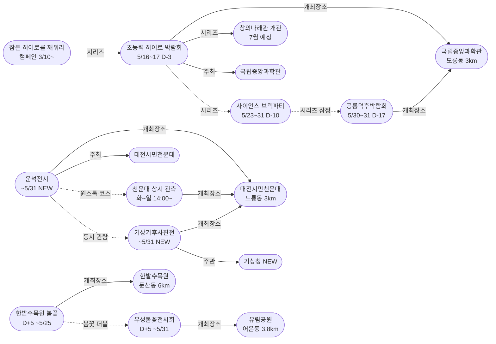
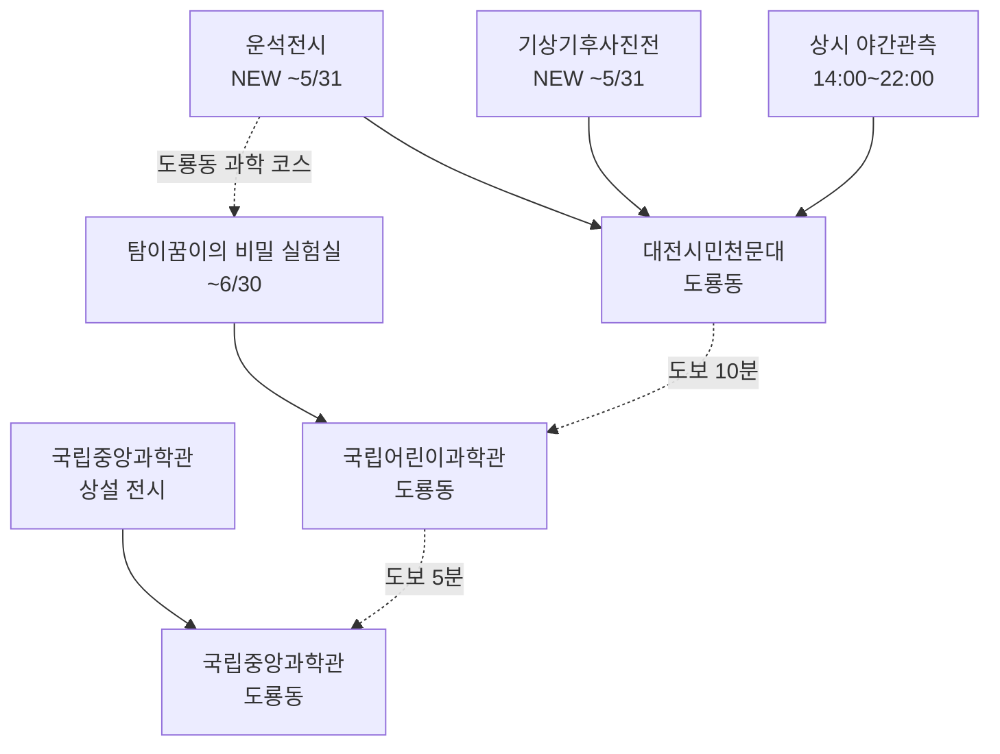

# 2026-05-13 대전 유성구 어린이·가족 이벤트 일일 보고서

## 요약

**천문대 재개관일 — 운석전시·기상기후사진전 특별전시 2건 신규 발견.** 대전시민천문대가 화요일 재개관과 함께 가정의 달 특별전시 2건(운석전시 + 기상기후사진전, ~5/31 무료)을 운영 중임이 서울경제 보도로 확인되었다. 실제 운석 표본을 직접 관찰하는 운석전시는 어린이 과학교육에 매우 적합하다. **초능력 히어로 박람회가 D-3에 진입**하여 마감 임박 구간에 들어섰다(5/16~17, 국립중앙과학관 사이언스터널). 봄꽃 더블 코스(유림공원+한밭수목원)는 D+5로 안정 운영 중이다.

## 용성로20 주변 (도보권 내)

### ring-stroll (1km 이내) — 전민동 클러스터 유지 (변동 없음)

| 시설 | 동 | 거리 | 유형 | 상태 |
|------|---|------|------|------|
| 아가랑도서관 | 전민동 | ~0.9km | 도서관 — 아가맘 행복교실 | 운영 중 (4/4~6/27) |
| 유성구 평생학습센터 전민센터 | 전민동 | ~0.8km | 공공기관 원데이클래스 | 운영 중 |
| 전민종합문화센터 | 전민동 | ~0.8km | 문화센터 | 기존 |

> 도보권 내 변동 없음. 전민동 3거점 클러스터 안정 유지.

## 오늘의 추천 (가족 동반 Top 5)

| 순위 | 이벤트 | 장소 (동) | 대상 | 비용 | 비고 |
|------|--------|----------|------|------|------|
| 1 | **대전시민천문대 운석전시** | 대전시민천문대 (도룡동, 3km) | 전연령 가족 | **무료** | **NEW** — 재개관일! 실제 운석 관찰 |
| 2 | **유성봄꽃전시회** | 유림공원 (어은동, 3.8km) | 전연령 가족 | **무료** | D+5 단독 운영 |
| 3 | 한밭수목원 봄꽃 전시회 | 한밭수목원 (둔산동, 6km) | 전연령 가족 | **무료** | D+5, 봄꽃 더블 코스 |
| 4 | 탐이꿈이의 비밀 실험실 | 국립어린이과학관 (도룡동) | 유아~초등저학년 | 유료 | 운영 중 (~6/30) |
| 5 | 아가·맘 행복교실 | 아가랑도서관 (전민동, 0.9km) | 영유아 | 무료 | 운영 중 |

> **오늘의 포인트:** 대전시민천문대가 월요일 휴관 후 오늘(화) 재개관. 운석전시·기상기후사진전 특별전시 + 상시 관측(14:00~22:00)까지 원스톱 과학 코스.

## 신규 이벤트

### 1. 대전시민천문대 특별전시 — '운석전시' + '기상기후사진전' (~5/31, 무료)

- **출처:** [대전시민천문대, '운석전시' 등 특별전시 연다 | 서울경제](https://www.sedaily.com/article/20042838)
- **일시:** 2026년 5월 ~ 5월 31일 (기간 중 천문대 개관 시간에 관람)
- **장소:** 대전시민천문대 (도룡동, ~3km, ring-car)
- **비용:** **무료**
- **운영시간:** 화~일 14:00~22:00 (매주 월요일 휴관)
- **사전신청:** 불필요 (자유 관람)
- **실내/야외:** 실내

**운석전시 내용:**
세계운석박물관 이현장 회장이 소장한 **실제 운석 표본**을 공개한다. 관람객은 지구로 떨어진 다양한 운석을 가까이서 직접 관찰하며, 운석의 생성 과정과 종류, 태양계의 역사를 살펴볼 수 있다.

**기상기후사진전 내용:**
기상청 주관 '날씨·기후 사진공모전' 수상작을 전시한다. 다양한 기상·기후 사진 작품을 통해 지구환경 변화의 중요성을 되새기는 교육적 전시.

- **어린이 친화도:** 운석전시 0.75 / 기상기후사진전 0.60
  - 운석전시: 실물 운석 관찰은 어린이 과학 호기심 자극에 탁월. 유아~초등 모두 적합.
  - 기상기후사진전: 사진 전시 위주로 영유아 흥미 유발은 낮으나, 초등학생 환경교육에 좋음.
- **관련 엔티티:** 대전시민천문대, 기상청, 세계운석박물관

> **천문대 원스톱 코스:** 운석전시(신규) + 기상기후사진전(신규) + 상시 야간관측(14:00~22:00) = 한 번의 방문으로 3가지 체험. 도룡동 국립중앙과학관·어린이과학관과 연계하면 과학 풀코스.

## 업데이트 항목

### 2. 초능력 히어로 박람회 D-3 — 마감 임박 구간 진입

- **출처:** [중앙과학관, 16~17일 초능력 히어로 박람회 | 전파신문](http://www.jeonpa.co.kr/news/articleView.html?idxno=218393)
- **이전 상태:** D-4 (5/12)
- **금일 변경:** D-4→**D-3**. 전파신문 추가 보도로 매체 범위 확대. **마감 임박 구간 진입(D-3 이내)**.
- **시리즈 전체 구조 (5/12 확정):**
  - 캠페인: 잠든 히어로를 깨워라 (3/10~, 진행 중)
  - 5/1~3: 동심 로그인 (종료)
  - 5/5: 어린이 한마당 (종료)
  - 5/9~10: 가족뮤지컬 알라딘 (종료)
  - **5/16~17: 초능력 히어로 박람회 (D-3)** ← 마감 임박!
  - 5/23~31: 사이언스 브릭파티 (D-10)
  - 5/30~31: 공룡덕후박람회 (D-17)
  - 7월: 창의나래관 '초능력 비밀 아카데미' 개관

### 3. 공룡덕후박람회 D-17 — 참가안내 지속 운영

- **출처:** [세계 공룡의 날 공룡덕후박람회 참가안내 | 국립중앙과학관](https://www.science.go.kr/mps/0/bbs/208/moveBbsNttDetail.do?nttSn=47305)
- **이전 상태:** D-18 (5/12)
- **금일 변경:** D-18→**D-17**. 참가안내 페이지 정상 운영 중.

## 신규 오픈 가게·팝업·프로모션

금일 유성구 일대 신규 오픈 가게/팝업/프로모션 발견 없음.

## 공공기관 주최 행사 (행정복지센터·보건소·복지관·도서관·우체국·경찰서·소방서)

| 기관 | 행사 | 상태 | 비고 |
|------|------|------|------|
| **대전시민천문대** | **운석전시 + 기상기후사진전** | **운영 중 (NEW)** | ~5/31, 무료, 재개관일! |
| **국립중앙과학관** | **초능력 히어로 박람회** | **D-3 마감 임박** | 사이언스터널, 5/16~17 |
| **국립중앙과학관** | 잠든 히어로를 깨워라 캠페인 | 진행 중 | 창의나래관 7월 개관 연계 |
| **국립중앙과학관** | 공룡덕후박람회 | D-17 참가안내 오픈 | 사이언스터널·꿈이광장, 5/30~31 |
| **유성구(유성구청)** | 유성봄꽃전시회 | D+5 단독 운영 (~5/31) | 유림공원, 무료 |
| **대전광역시** | 한밭수목원 봄꽃 전시회 | D+5 (~5/25) | 둔산동, 무료 |
| 유성구통합도서관 (관평) | 그림책, 나만의 보물을 담다 | 운영 중 | 유아~초등저학년 |
| 유성구통합도서관 | 지역작가 인(人) 도서관 | 5월 운영 중 | 6개 도서관 순회 |
| 아가랑도서관 (전민) | 아가·맘 행복교실 | 운영 중 (4/4~6/27) | 영유아 |
| 대전시민천문대 | 상시 관측 프로그램 | **화요일 재개관** | 14:00~22:00 |
| 유성소방서 | 가정의 달 소방안전체험 | 운영 중 | 솔로몬파크 |
| 유성구 보건소 | 유성이의 튼튼스쿨 | 하반기 예정 | 7/20 신청, 8/19~ |

## 마감 임박 (사전신청 D-3 이내)

| 이벤트 | D-day | 일시 | 장소 | 비고 |
|--------|-------|------|------|------|
| **초능력 히어로 박람회** | **D-3** | 5/16(금)~17(토) | 국립중앙과학관 사이언스터널 | 창의나래관 전초 행사 |

> 히어로 박람회가 D-3 이내 마감 임박 구간에 진입. 사전 히어로파티 등록 및 캠페인 아이템 제출 마감에 주의.

## 동심원별 묶음 (0.5km / 1km / 2km / 5km)

### ring-stroll (1km 이내) — 전민동
- 아가랑도서관 (아가맘 행복교실) — 운영 중
- 유성구 평생학습센터 전민센터 — 운영 중

### ring-bike (2km 이내) — 관평동
- 관평도서관 (그림책 프로그램) — 운영 중

### ring-car (5km 이내) — 어은동·도룡동·노은동

- **대전시민천문대 — 운석전시+기상기후사진전 (NEW)** (도룡동, ~3km) — 무료, ~5/31
- **유림공원 — 봄꽃전시회 D+5 단독 운영** (어은동, ~3.8km) — 무료
- 국립중앙과학관 (도룡동, ~3km) — 상시 운영
- 탐이꿈이의 비밀 실험실 (도룡동, ~3km) — 운영 중 (~6/30)
- 너티차일드 키즈테마파크 (도룡동, ~3.5km) — 상시
- 대전광역시어린이회관 (노은동, ~4km) — 상시
- 대전 오월드 (어은동, ~4.5km) — 5월 말까지 재개장 불가

### ring 초과 (5km+) — 둔산동
- 한밭수목원 — 봄꽃 전시회 D+5 (둔산동, ~6km) — 무료, ~5/25

## 동(洞)별 이벤트 묶음

| 동 | 1차 타겟 | 금일 이벤트 |
|----|---------|------------|
| **도룡동** | O | **천문대: 운석전시+기상기후사진전 NEW**, 과학관 상시, 탐이꿈이 |
| **어은동** | — | 유림공원: 봄꽃전시회 D+5 단독 |
| **전민동** | O | 아가맘 행복교실, 평생학습센터 |
| **관평동** | O | 관평도서관 그림책 프로그램 |
| 용산동 | O | 금일 해당 없음 |
| 문지동 | O | 금일 해당 없음 |
| 신성동 | O | 금일 해당 없음 |
| 노은동 | — | 어린이회관 상시 |
| **둔산동** | 유성구 외 | 한밭수목원 봄꽃 전시회 D+5 |

## 연령대별 묶음

| 연령대 | 추천 이벤트 |
|--------|-----------|
| 영유아 (0~3) | 아가맘 행복교실 (전민동, 0.9km) |
| 유아 (4~6) | 탐이꿈이 비밀실험실, 유림공원 봄꽃산책, **천문대 운석전시** |
| 초등저학년 (7~9) | **천문대 운석전시+기상기후사진전**, 과학관 상설, 봄꽃 더블 코스 |
| 초등고학년 (10~12) | **히어로 D-3 사전준비**, 공룡덕후 참가 신청, **천문대 특별전시** |
| 전연령 가족 | **도룡동 과학 코스(천문대 특별전시→과학관)**, 봄꽃 더블 코스 |

## 시리즈/정기 프로그램 업데이트

| 시리즈 | 금일 상태 | 다음 일정 |
|--------|---------|----------|
| **대전시민천문대 특별전시** | **운석전시+기상기후사진전 (NEW)** | **~5/31 매일 14:00~22:00 (월 휴관)** |
| **국립중앙과학관 가정의 달** | **히어로 D-3 마감 임박** | **5/16~17 히어로 D-day** |
| 잠든 히어로를 깨워라 | 진행 중 | 히어로 페스타 초대권 추첨 |
| 유성봄꽃전시회 | D+5 단독 운영 | 5/31까지 매일 (유림공원, 무료) |
| 한밭수목원 봄꽃 전시회 | D+5 | 5/25까지 (한밭수목원, 무료) |
| 공룡덕후박람회 | D-17 참가안내 오픈 | 5/30~31 (D-17) |
| 사이언스 브릭파티 | 사전 안내 | 5/23~31 (D-10) |
| 유성소방서 안전체험 | 운영 중 | 5월 내 사전신청 |
| 유성구 도서관 프로그램 | 운영 중 | 북스타트·그림책·작가·북큐레이션 |
| 탐이꿈이의 비밀 실험실 | 운영 중 (~6/30) | 국립어린이과학관 사전예약 |
| 대전시민천문대 상시 관측 | **화요일 재개관** | 화~일 14:00~22:00 |
| 유성이의 튼튼스쿨 | 하반기 예정 | 7/20 신청, 8/19~11/27 운영 |
| 대전 오월드 재개장 | 5월 말까지 불가 | 변동 없음 |
| 창의나래관 개관 | 7월 예정 | 히어로 박람회가 전초 행사 |

## 지식그래프 시각화

### 오늘의 주요 관계

오늘의 핵심 발견은 **대전시민천문대 특별전시 2건 신규 발견**이다. 운석전시·기상기후사진전이 천문대 상시 관측과 결합하여 '천문대 원스톱 과학 코스'를 형성한다. 또한 도룡동 내 국립중앙과학관·어린이과학관과 연계하면 '도룡동 과학 풀코스'가 완성된다. 히어로 박람회 D-3 진입으로 가정의달 시리즈의 클라이맥스가 다가오고 있다.

### 전체 지식그래프 시각화

### 도룡동 과학 코스 (금일 확장)

### 히어로 박람회 D-3 카운트다운

## 온톨로지 변경

| 변경 유형 | 대상 | 근거 |
|----------|------|------|
| 새 Event | ent-evt-037 대전시민천문대 운석전시 | 서울경제 보도 |
| 새 Event | ent-evt-038 대전시민천문대 기상기후사진전 | 서울경제 보도 |
| 새 Organization | ent-org-022 기상청 | 기상기후사진전 주관 기관 |

## 추론 결과

| 추론 | 신뢰도 | 근거 |
|------|--------|------|
| 운석전시 kidFriendlyBoost +0.2 | 0.90 | 천문대 운영 과학전시 (operator_kid_friendliness) |
| 운석전시·사진전 publicTrustBoost +0.15 | 0.85 | 공공기관 주최 (public_institution_kid_event) |
| 천문대 원스톱 코스 (운석+사진전+관측) | 0.90~0.95 | 같은 장소 (same_dong_combo) |
| 도룡동 과학 코스 (천문대+어린이과학관) | 0.75 | 같은 동 내 과학시설 연계 (same_dong_combo) |

## 분석 및 평가

오늘은 **화요일, 천문대 재개관일에 특별전시를 발견한 날**이다.

**금일의 핵심:**

1. **천문대 특별전시 2건 신규 발견**: 대전시민천문대가 가정의 달을 맞아 '운석전시'와 '기상기후사진전' 특별전시를 5/31까지 무료로 운영한다(서울경제 보도). 세계운석박물관 이현장 회장 소장 실제 운석 표본을 직접 관찰할 수 있어 어린이 과학교육에 매우 적합하다. 기상기후사진전은 기상청 주관으로 환경교육과 연계 가능하다. 두 전시 + 상시 야간관측(14:00~22:00)을 합치면 **천문대 원스톱 과학 코스**가 완성된다.

2. **히어로 박람회 D-3 진입**: 초능력 히어로 박람회(5/16~17)가 마감 임박 구간(D-3 이내)에 진입했다. 전파신문 추가 보도로 매체 범위가 확대되었다. 캠페인(잠든 히어로를 깨워라)→히어로 박람회→창의나래관 개관(7월)으로 이어지는 시리즈의 클라이맥스가 다가오고 있다.

3. **봄꽃 더블 코스 안정**: 유림공원 봄꽃전시회(D+5)와 한밭수목원 봄꽃전시회(D+5) 모두 안정 운영 중. 한밭수목원은 5/25 종료 예정이므로 잔여 12일.

4. **도룡동 과학 벨트 강화**: 천문대 특별전시 발견으로 도룡동의 과학 인프라가 더 풍성해졌다. 천문대(운석+기상+관측) → 어린이과학관(탐이꿈이) → 국립중앙과학관(상설+히어로 준비) 동선이 완성되었다.

**이번 주 남은 일정:**
- 5/14(수): 히어로 D-2
- 5/15(목): 히어로 D-1
- **5/16(금)~17(토): 초능력 히어로 박람회 D-day**

## 추적 항목

| 항목 | 최초 보고 | 상태 | 최신 업데이트 |
|------|----------|------|-------------|
| **대전시민천문대 특별전시** | **2026-05-13** | **운석전시+기상기후사진전 (NEW)** | ~5/31 무료, 재개관일 발견 |
| **초능력 히어로 박람회** | 2026-04-30 | **D-3 마감 임박** | 전파신문 추가 보도 |
| 잠든 히어로를 깨워라 캠페인 | 2026-05-12 | 진행 중 | 변동 없음 |
| 창의나래관 개관 | 2026-05-12 | 7월 예정 | 변동 없음 |
| 한밭수목원 봄꽃 전시회 | 2026-05-12 | D+5 | 잔여 12일 (~5/25) |
| 공룡덕후박람회 | 2026-04-30 | D-17 참가안내 오픈 | 참가 신청 지속 운영 |
| 사이언스 브릭파티 | 2026-04-30 | D-10 | 5/23~31, 사전 안내 |
| 유성봄꽃전시회 | 2026-05-08 | D+5 단독 운영 | 유림공원 5/31까지, 무료 |
| 대전 오월드 재개장 | 2026-05-06 | 5월 말까지 불가 | 변동 없음 |
| 유성소방서 안전체험 | 2026-04-26 | 운영 중 | 솔로몬파크 |
| 대전시민천문대 상시 관측 | 2026-04-25 | **화요일 재개관** | 14:00~22:00 |
| 과학관 가정의달 시리즈 | 2026-04-30 | **히어로 D-3, 클라이맥스 임박** | 캠페인→히어로→개관 |
| 도서관 프로그램 | 2026-04-25 | 운영 중 | 그림책·아가맘·작가 |
| 유성이의 튼튼스쿨 | 2026-05-07 | 하반기 예정 | 7/20 신청, 8/19~ 운영 |

## 동향 요약

| 분류 | 상태 | 비고 |
|------|------|------|
| 어린이·가족 이벤트 | **천문대 특별전시 NEW + 히어로 D-3 마감 임박** | 도룡동 과학 코스 강화 |
| 신규 가게/팝업 | **금일 신규 없음** | — |
| 공공기관 행사 | 천문대(특별전시 NEW) + 과학관(히어로 D-3) + 도서관(운영중) + 기상청(사진전 NEW) | — |

## 출처 목록

1. [대전시민천문대, '운석전시' 등 특별전시 연다 | 서울경제](https://www.sedaily.com/article/20042838) - 서울경제
2. [중앙과학관, 16~17일 초능력 히어로 박람회 | 전파신문](http://www.jeonpa.co.kr/news/articleView.html?idxno=218393) - 전파신문
3. [초능력 배우러 과학관으로 출동 『초능력 히어로 박람회』 | 다자비](https://dazabi.com/insurance_magazine/article.php?id=20334) - 다자비
4. [세계 공룡의 날 공룡덕후박람회 참가안내 | 국립중앙과학관](https://www.science.go.kr/mps/0/bbs/208/moveBbsNttDetail.do?nttSn=47305) - 국립중앙과학관
5. [제5회 유성봄꽃전시회 | 대전관광공사](https://daejeontour.co.kr/festival_djt/33) - 대전관광공사
6. [2026 한밭수목원 봄꽃 전시회 | 대전관광공사](https://daejeontour.co.kr/festival_djt/35) - 대전관광공사
7. [대전시민천문대](https://djstar.kr/) - 대전시민천문대 공식
8. [유성구통합도서관](https://lib.yuseong.go.kr/) - 유성구통합도서관 공식
9. [국립어린이과학관](https://www.csc.go.kr/) - 국립어린이과학관 공식
10. [대전 오월드 5월 재개장 불가 | 뉴스1](https://www.news1.kr/local/daejeon-chungnam/6149846) - 뉴스1
