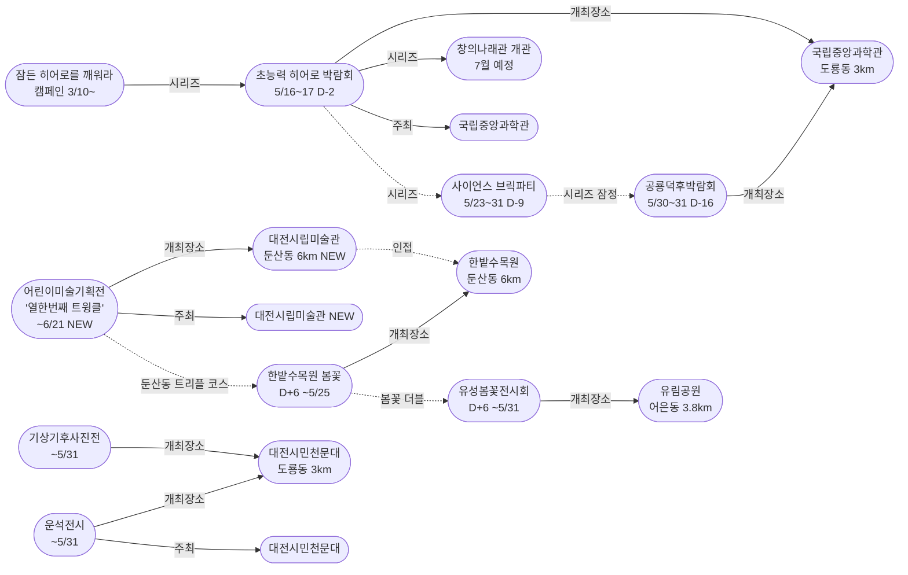
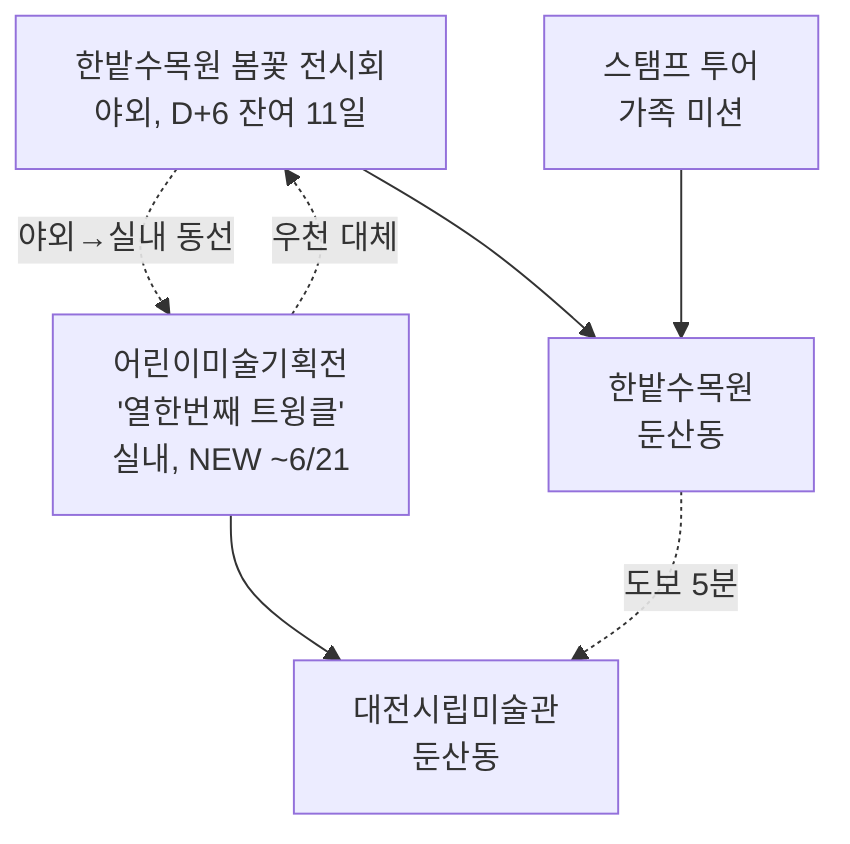
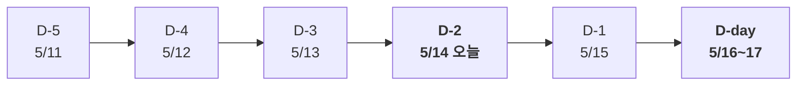

# 2026-05-14 대전 유성구 어린이·가족 이벤트 일일 보고서

## 요약

**대전시립미술관 어린이미술기획전 '열한번째 트윙클' 신규 발견 — 미끄럼틀·만지기·움직이기 체험형 미술전시.** 한밭수목원 인접 대전시립미술관에서 3/18~6/21 개최 중인 어린이 전용 체험 전시가 5개 매체 보도로 확인되었다. 미끄럼틀 구조물(정승원 작가)과 섬유 촉각 체험(백인교 작가) 등 전신으로 참여하는 작품으로 구성되어 어린이 친화도가 매우 높다. **초능력 히어로 박람회가 D-2에 진입** — 모레(5/16) D-day. **공룡덕후박람회 공통령 선거 별도 참가안내 페이지가 국립중앙과학관에 개설**되고 YTN 사이언스 보도로 매체가 확대되었다.

## 용성로20 주변 (도보권 내)

### ring-stroll (1km 이내) — 전민동 클러스터 유지 (변동 없음)

| 시설 | 동 | 거리 | 유형 | 상태 |
|------|---|------|------|------|
| 아가랑도서관 | 전민동 | ~0.9km | 도서관 — 아가맘 행복교실 | 운영 중 (4/4~6/27) |
| 유성구 평생학습센터 전민센터 | 전민동 | ~0.8km | 공공기관 원데이클래스 | 운영 중 |
| 전민종합문화센터 | 전민동 | ~0.8km | 문화센터 | 기존 |

> 도보권 내 변동 없음. 전민동 3거점 클러스터 안정 유지.

## 오늘의 추천 (가족 동반 Top 5)

| 순위 | 이벤트 | 장소 (동) | 대상 | 비용 | 비고 |
|------|--------|----------|------|------|------|
| 1 | **초능력 히어로 박람회** | 국립중앙과학관 (도룡동, 3km) | 초등 | 미확인 | **D-2 마감 임박!** 모레 D-day |
| 2 | **어린이미술기획전 '열한번째 트윙클'** | 대전시립미술관 (둔산동, 6km) | 유아~초등 | 미확인 | **NEW** — 미끄럼틀·만지기 체험 |
| 3 | **대전시민천문대 운석전시** | 대전시민천문대 (도룡동, 3km) | 전연령 가족 | **무료** | 운영 중 (~5/31) |
| 4 | **한밭수목원 봄꽃 전시회** | 한밭수목원 (둔산동, 6km) | 전연령 가족 | **무료** | D+6, **잔여 11일** (~5/25) |
| 5 | 유성봄꽃전시회 | 유림공원 (어은동, 3.8km) | 전연령 가족 | **무료** | D+6, ~5/31 |

> **오늘의 포인트:** 히어로 박람회 D-2 — 사전 준비 마지막 날들. 둔산동에서는 한밭수목원 봄꽃(잔여 11일) + 대전시립미술관 트윙클(NEW) = **둔산동 가족 트리플 코스** 성립.

## 신규 이벤트

### 1. 대전시립미술관 2026 어린이미술기획전 '열한번째 트윙클' (3/18~6/21)

- **출처:** [대전시립미술관, 2026 어린이미술기획전 '열한번째 트윙클' 개최 | 더에스엔에스타임](https://www.thesnstime.com/daejeonsiribmisulgwan-2026-eorinimisulgihoegjeon-yeolhanbeonjjae-teuwingkeulgaecoe/)
- **일시:** 2026년 3월 18일 ~ 6월 21일
- **장소:** 대전시립미술관 (둔산동, ~6km, ring 초과 — 한밭수목원 인접)
- **비용:** 미확인
- **사전신청:** 불필요 (자유 관람)
- **실내/야외:** 실내

**전시 개념:**
어린이를 보호나 교육의 대상으로만 한정하지 않고, 세계와 관계를 맺는 독립된 존재로 바라보는 관점에서 출발한다. 전시 제목 '트윙클'은 잠시 드러나는 마음의 여분을 지칭하며, 성장 과정에서 점차 사라져가는 이 상태를 다시 느낄 수 있도록 기획되었다.

**체험 프로그램:**
- **Playground 놀이터 (정승원 작가):** 회화 작품을 미끄럼틀 구조물로 만들어 관람객이 오르고 미끄러지며 작품을 직접 경험
- **섬유 촉각 체험 (백인교 작가):** 실과 섬유 등 일상적 재료를 활용한 작품을 직접 만지고 형태를 바꾸어가며 참여

전시장에는 오르고, 미끄러지고, 만지고, 움직이며 경험할 수 있는 구조가 마련되어 있다. 작품은 관람객과 거리를 두는 대상이 아니라, 아이가 몸으로 부딪치며 변화를 만들어가는 장치로 기능한다.

- **어린이 친화도:** 0.90
  - 미끄럼틀·만지기·움직이기 등 전신 참여형 체험 전시. 어린이 전용 기획전이므로 친화도 매우 높음.
  - 유아(4~6): 미끄럼틀·만지기 중심 적합
  - 초등저학년(7~9): 전체 프로그램 적합
  - 초등고학년(10~12): 미술적 관점에서 이해 가능
- **관련 엔티티:** 대전시립미술관, 정승원 작가, 백인교 작가
- **추가 출처:** [세계일보](http://incheon.thesegye.com/news/view/1065599512998244), [퍼블릭뉴스통신](http://www.ttlnews.com/news/articleView.html?idxno=3081852), [TJB 대전방송](https://www.tjb.co.kr/news11/category/view/id/95553/version/1), [뉴스로](https://www.newsro.kr/article243/1626322/)

> **둔산동 가족 트리플 코스:** 한밭수목원 봄꽃 산책(야외, 잔여 11일) → 대전시립미술관 트윙클(실내, NEW) → 스탬프 투어 = 봄꽃 관람 + 체험형 미술 + 미션 활동. 우천 시에도 미술관 실내 체험으로 대체 가능.

## 업데이트 항목

### 2. 초능력 히어로 박람회 D-2 — 모레 D-day

- **출처:** [초능력 배우러 과학관으로 출동 『초능력 히어로 박람회』 | 다자비](https://dazabi.com/insurance_magazine/article.php?id=20334)
- **이전 상태:** D-3 (5/13)
- **금일 변경:** D-3→**D-2**. 마감 임박 구간 지속. 5/16(금) D-day까지 2일.
- **시리즈 전체 구조:**
  - 캠페인: 잠든 히어로를 깨워라 (3/10~, 진행 중)
  - 5/1~3: 동심 로그인 (종료)
  - 5/5: 어린이 한마당 (종료)
  - 5/9~10: 가족뮤지컬 알라딘 (종료)
  - **5/16~17: 초능력 히어로 박람회 (D-2)** ← 마감 임박!
  - 5/23~31: 사이언스 브릭파티 (D-9)
  - 5/30~31: 공룡덕후박람회 (D-16)
  - 7월: 창의나래관 '초능력 비밀 아카데미' 개관

### 3. 공룡덕후박람회 D-16 — 공통령 선거 별도 참가안내 페이지 + YTN 사이언스 보도

- **출처:** [국립중앙과학관 공룡덕후박람회 제1대 공통령 선거](https://www.science.go.kr/mps/0/bbs/208/moveBbsNttDetail.do?nttSn=47381)
- **이전 상태:** D-17 (5/13)
- **금일 변경:**
  - D-17→**D-16**
  - **공통령 선거 별도 참가안내 페이지 개설** (nttSn=47381) — 공룡 13종 중 대표를 뽑는 투표 이벤트
  - **이융남 전 서울대 교수 '오지에서의 공룡탐사' 특별강연** 프로그램 새로 확인
  - YTN 사이언스 보도로 매체 3개→5개 확대
- **추가 출처:** [YTN 사이언스](https://m.science.ytn.co.kr/program/view_today.php?s_mcd=0082&key=202505211112442017), ["당신의 '공통령'에 투표하세요" | 트위그24](https://www.twig24.com/news/lifestyle/trip/2025/05/22/20250522500095)

### 4. 대전시민천문대 특별전시 — thesnstime 추가 매체 확인

- **출처:** [대전시민천문대, 가정의 달 5월 특별전시 개최 | 더에스엔에스타임](https://www.thesnstime.com/daejeonsiminceonmundae-gajeongyi-dal-5weol-teugbyeoljeonsi-gaecoe/)
- **이전 상태:** 서울경제 단일 매체 (5/13)
- **금일 변경:** thesnstime 추가 보도 확인. 서울경제+thesnstime = **2개 매체 교차검증** 완료. 내용 동일, 신뢰도 0.85→0.90 상향.

## 신규 오픈 가게·팝업·프로모션

금일 유성구 일대 신규 오픈 가게/팝업/프로모션 발견 없음.

## 공공기관 주최 행사 (행정복지센터·보건소·복지관·도서관·우체국·경찰서·소방서)

| 기관 | 행사 | 상태 | 비고 |
|------|------|------|------|
| **국립중앙과학관** | **초능력 히어로 박람회** | **D-2 마감 임박** | 사이언스터널, 5/16~17 |
| **국립중앙과학관** | 잠든 히어로를 깨워라 캠페인 | 진행 중 | 창의나래관 7월 개관 연계 |
| **국립중앙과학관** | **공룡덕후박람회** | **D-16 공통령 선거 페이지 개설** | 5/30~31, YTN 사이언스 보도 |
| **대전시립미술관** | **어린이미술기획전 '열한번째 트윙클'** | **운영 중 (NEW)** | ~6/21, 체험형 |
| **대전시민천문대** | 운석전시 + 기상기후사진전 | 운영 중 (교차검증 완료) | ~5/31, 무료 |
| **유성구(유성구청)** | 유성봄꽃전시회 | D+6 단독 운영 (~5/31) | 유림공원, 무료 |
| **대전광역시** | 한밭수목원 봄꽃 전시회 | D+6 (**잔여 11일**) | ~5/25, 무료 |
| 유성구통합도서관 (관평) | 그림책, 나만의 보물을 담다 | 운영 중 | 유아~초등저학년 |
| 유성구통합도서관 | 지역작가 인(人) 도서관 | 5월 운영 중 | 6개 도서관 순회 |
| 아가랑도서관 (전민) | 아가·맘 행복교실 | 운영 중 (4/4~6/27) | 영유아 |
| 대전시민천문대 | 상시 관측 프로그램 | 정상 운영 | 14:00~22:00 |
| 유성소방서 | 가정의 달 소방안전체험 | 운영 중 | 솔로몬파크 |
| 유성구 보건소 | 유성이의 튼튼스쿨 | 하반기 예정 | 7/20 신청, 8/19~ |

## 마감 임박 (사전신청 D-3 이내)

| 이벤트 | D-day | 일시 | 장소 | 비고 |
|--------|-------|------|------|------|
| **초능력 히어로 박람회** | **D-2** | 5/16(금)~17(토) | 국립중앙과학관 사이언스터널 | 창의나래관 전초 행사 |

> **히어로 박람회 D-2.** 내일(5/15) D-1, 모레(5/16) D-day. 사전 히어로파티 등록 및 캠페인 아이템 제출 마감에 주의.

## 동심원별 묶음 (0.5km / 1km / 2km / 5km)

### ring-stroll (1km 이내) — 전민동
- 아가랑도서관 (아가맘 행복교실) — 운영 중
- 유성구 평생학습센터 전민센터 — 운영 중

### ring-bike (2km 이내) — 관평동
- 관평도서관 (그림책 프로그램) — 운영 중

### ring-car (5km 이내) — 어은동·도룡동·노은동

- 국립중앙과학관 (도룡동, ~3km) — **히어로 D-2 마감 임박**
- **대전시민천문대 — 운석전시+기상기후사진전** (도룡동, ~3km) — 무료, ~5/31
- **유림공원 — 봄꽃전시회 D+6 단독 운영** (어은동, ~3.8km) — 무료
- 탐이꿈이의 비밀 실험실 (도룡동, ~3km) — 운영 중 (~6/30)
- 너티차일드 키즈테마파크 (도룡동, ~3.5km) — 상시
- 대전광역시어린이회관 (노은동, ~4km) — 상시
- 대전 오월드 (어은동, ~4.5km) — 5월 말까지 재개장 불가

### ring 초과 (5km+) — 둔산동

- **대전시립미술관 — 어린이미술기획전 '열한번째 트윙클' (NEW)** (둔산동, ~6km) — ~6/21
- 한밭수목원 — 봄꽃 전시회 D+6 (둔산동, ~6km) — 무료, ~5/25 (**잔여 11일**)

> **둔산동 가족 트리플 코스:** 한밭수목원 봄꽃(야외) + 대전시립미술관 트윙클(실내, NEW) + 스탬프 투어 = 실외·실내 겸비. 우천 대체 가능.

## 동(洞)별 이벤트 묶음

| 동 | 1차 타겟 | 금일 이벤트 |
|----|---------|------------|
| **도룡동** | O | 과학관: **히어로 D-2**, 천문대: 운석전시+기상기후사진전, 탐이꿈이 |
| **어은동** | — | 유림공원: 봄꽃전시회 D+6 단독 |
| **전민동** | O | 아가맘 행복교실, 평생학습센터 |
| **관평동** | O | 관평도서관 그림책 프로그램 |
| 용산동 | O | 금일 해당 없음 |
| 문지동 | O | 금일 해당 없음 |
| 신성동 | O | 금일 해당 없음 |
| 노은동 | — | 어린이회관 상시 |
| **둔산동** | 유성구 외 | **미술관 트윙클 NEW** + 한밭수목원 봄꽃 D+6 |

## 연령대별 묶음

| 연령대 | 추천 이벤트 |
|--------|-----------|
| 영유아 (0~3) | 아가맘 행복교실 (전민동, 0.9km) |
| 유아 (4~6) | **미술관 트윙클 미끄럼틀(NEW)**, 탐이꿈이 비밀실험실, 봄꽃 산책 |
| 초등저학년 (7~9) | **미술관 트윙클(NEW)**, 천문대 운석전시, **히어로 D-2 사전준비**, 봄꽃 코스 |
| 초등고학년 (10~12) | **히어로 D-2 사전준비**, 공룡덕후 참가 신청, 천문대 특별전시, **미술관 트윙클(NEW)** |
| 전연령 가족 | **둔산동 가족 트리플 코스(봄꽃+트윙클)**, 도룡동 과학 코스(천문대+과학관) |

## 시리즈/정기 프로그램 업데이트

| 시리즈 | 금일 상태 | 다음 일정 |
|--------|---------|----------|
| **국립중앙과학관 가정의 달** | **히어로 D-2 마감 임박** | **5/16~17 히어로 D-day** |
| 잠든 히어로를 깨워라 | 진행 중 | 히어로 페스타 초대권 추첨 |
| **대전시립미술관 어린이미술기획전** | **'열한번째 트윙클' (NEW)** | **~6/21 매일 운영** |
| 대전시민천문대 특별전시 | 운석전시+기상기후사진전 (교차검증) | ~5/31 매일 14:00~22:00 (월 휴관) |
| 유성봄꽃전시회 | D+6 단독 운영 | 5/31까지 매일 (유림공원, 무료) |
| 한밭수목원 봄꽃 전시회 | D+6 (**잔여 11일**) | 5/25까지 (한밭수목원, 무료) |
| 공룡덕후박람회 | **D-16 공통령 선거 페이지 개설** | 5/30~31 (D-16) |
| 사이언스 브릭파티 | 사전 안내 | 5/23~31 (D-9) |
| 유성소방서 안전체험 | 운영 중 | 5월 내 사전신청 |
| 유성구 도서관 프로그램 | 운영 중 | 북스타트·그림책·작가·북큐레이션 |
| 탐이꿈이의 비밀 실험실 | 운영 중 (~6/30) | 국립어린이과학관 사전예약 |
| 대전시민천문대 상시 관측 | 정상 운영 | 화~일 14:00~22:00 |
| 유성이의 튼튼스쿨 | 하반기 예정 | 7/20 신청, 8/19~11/27 운영 |
| 대전 오월드 재개장 | 5월 말까지 불가 | 변동 없음 |
| 창의나래관 개관 | 7월 예정 | 히어로 박람회가 전초 행사 |

## 지식그래프 시각화

### 오늘의 주요 관계

오늘의 핵심 발견은 **대전시립미술관 어린이미술기획전 '열한번째 트윙클'**이다. 한밭수목원과 인접하여 봄꽃전시회(잔여 11일)와 연계한 '둔산동 가족 트리플 코스'가 성립한다. 히어로 박람회 D-2로 가정의 달 시리즈 클라이맥스가 코앞에 다가왔다. 공룡덕후박람회는 공통령 선거 별도 페이지 개설 + 이융남 교수 강연 확인으로 프로그램이 더 풍성해졌다.

### 전체 지식그래프 시각화

### 둔산동 가족 트리플 코스 (금일 신규)

### 히어로 박람회 D-2 카운트다운

## 온톨로지 변경

| 변경 유형 | 대상 | 근거 |
|----------|------|------|
| 새 Event | ent-evt-039 어린이미술기획전 '열한번째 트윙클' | 5개 매체 교차확인 |
| 새 Venue | ent-venue-025 대전시립미술관 | 한밭수목원 인접 가족 방문지 |
| 새 Organization | ent-org-023 대전시립미술관 | 전시 주최 기관 |
| 새 Activity | ent-act-022 Playground 놀이터 (미끄럼틀 구조물) | 정승원 작가 체험 프로그램 |
| 새 Activity | ent-act-023 섬유 촉각 체험 | 백인교 작가 체험 프로그램 |
| 새 Activity | ent-act-024 공룡탐사 특별강연 (이융남 교수) | YTN 사이언스/Twig24 보도 |

## 추론 결과

| 추론 | 신뢰도 | 근거 |
|------|--------|------|
| 대전시립미술관 ↔ 한밭수목원 인접 | 0.90 | 둔산동 동일 권역 (proximity) |
| 봄꽃+트윙클 둔산동 트리플 코스 | 0.85 | 인접 시설 동시 개최 (same_dong_combo) |
| 트윙클 kidFriendlyBoost +0.2 | 0.85 | 미술관 운영 어린이 전용 기획전 (operator_kid_friendliness) |
| 트윙클 = 봄꽃전시 우천 대체 | 0.80 | 실외↔실내 대체 (indoor_rainy_fallback) |
| 공룡탐사 강연 → 초등고학년 적합 | 0.80 | 학술적 강연 성격 (age_group_overlap) |

## 분석 및 평가

오늘은 **히어로 D-2, 둔산동 가족 코스 확장의 날**이다.

**금일의 핵심:**

1. **대전시립미술관 '열한번째 트윙클' 신규 발견**: 한밭수목원 인접 대전시립미술관에서 3/18~6/21 개최 중인 어린이 체험형 미술전시. 미끄럼틀 구조물과 섬유 촉각 체험 등 전신으로 참여하는 프로그램으로 어린이 친화도 0.90. 한밭수목원 봄꽃전시회(잔여 11일)와 연계하면 '둔산동 가족 트리플 코스'가 성립한다.

2. **히어로 박람회 D-2**: 모레(5/16) D-day. 과학관 가정의 달 시리즈의 클라이맥스가 코앞이다. 사전 준비(히어로파티 등록, 캠페인 아이템 제출) 마지막 기회.

3. **공룡덕후박람회 D-16 확장**: 공통령 선거 별도 참가안내 페이지가 국립중앙과학관에 개설되었다. 공룡 13종 중 대표를 뽑는 투표 이벤트 + 이융남 전 서울대 교수 '공룡탐사' 강연 프로그램이 새로 확인되었다. YTN 사이언스·Twig24 보도로 매체 범위도 확대.

4. **천문대 특별전시 교차검증 완료**: thesnstime 추가 보도로 서울경제+thesnstime = 2개 매체 교차검증. 신뢰도 상향.

**이번 주 남은 일정:**
- 5/15(목): 히어로 D-1
- **5/16(금)~17(토): 초능력 히어로 박람회 D-day**
- 5/18(일)~: 히어로 종료 후 브릭파티(D-5)·공룡덕후(D-12) 카운트다운 가속

## 추적 항목

| 항목 | 최초 보고 | 상태 | 최신 업데이트 |
|------|----------|------|-------------|
| **초능력 히어로 박람회** | 2026-04-30 | **D-2 마감 임박** | 모레 D-day |
| **대전시립미술관 어린이미술기획전** | **2026-05-14** | **'열한번째 트윙클' (NEW)** | ~6/21, 체험형 |
| 잠든 히어로를 깨워라 캠페인 | 2026-05-12 | 진행 중 | 변동 없음 |
| 창의나래관 개관 | 2026-05-12 | 7월 예정 | 변동 없음 |
| 대전시민천문대 특별전시 | 2026-05-13 | 운석전시+기상기후사진전 (교차검증 완료) | thesnstime 추가 |
| 한밭수목원 봄꽃 전시회 | 2026-05-12 | D+6 (**잔여 11일**) | ~5/25 |
| **공룡덕후박람회** | 2026-04-30 | **D-16 공통령 선거 페이지 개설** | YTN·Twig24·이융남 강연 |
| 사이언스 브릭파티 | 2026-04-30 | D-9 | 5/23~31, 사전 안내 |
| 유성봄꽃전시회 | 2026-05-08 | D+6 단독 운영 | 유림공원 5/31까지, 무료 |
| 대전 오월드 재개장 | 2026-05-06 | 5월 말까지 불가 | 변동 없음 |
| 유성소방서 안전체험 | 2026-04-26 | 운영 중 | 솔로몬파크 |
| 대전시민천문대 상시 관측 | 2026-04-25 | 정상 운영 | 14:00~22:00 |
| 과학관 가정의 달 시리즈 | 2026-04-30 | **히어로 D-2, 클라이맥스 임박** | 캠페인→히어로→개관 |
| 도서관 프로그램 | 2026-04-25 | 운영 중 | 그림책·아가맘·작가 |
| 유성이의 튼튼스쿨 | 2026-05-07 | 하반기 예정 | 7/20 신청, 8/19~ 운영 |

## 동향 요약

| 분류 | 상태 | 비고 |
|------|------|------|
| 어린이·가족 이벤트 | **미술관 트윙클 NEW + 히어로 D-2 마감 임박** | 둔산동 가족 코스 + 도룡동 과학 코스 |
| 신규 가게/팝업 | **금일 신규 없음** | — |
| 공공기관 행사 | 미술관(트윙클 NEW) + 과학관(히어로 D-2) + 천문대(교차검증) + 도서관(운영중) | 공룡덕후 공통령 선거 페이지 |

## 출처 목록

1. [대전시립미술관, 2026 어린이미술기획전 '열한번째 트윙클' 개최 | 더에스엔에스타임](https://www.thesnstime.com/daejeonsiribmisulgwan-2026-eorinimisulgihoegjeon-yeolhanbeonjjae-teuwingkeulgaecoe/) - 더에스엔에스타임
2. [초능력 배우러 과학관으로 출동 『초능력 히어로 박람회』 | 다자비](https://dazabi.com/insurance_magazine/article.php?id=20334) - 다자비
3. [국립중앙과학관 공룡덕후박람회 제1대 공통령 선거](https://www.science.go.kr/mps/0/bbs/208/moveBbsNttDetail.do?nttSn=47381) - 국립중앙과학관
4. [대전시민천문대, 가정의 달 5월 특별전시 개최 | 더에스엔에스타임](https://www.thesnstime.com/daejeonsiminceonmundae-gajeongyi-dal-5weol-teugbyeoljeonsi-gaecoe/) - 더에스엔에스타임
5. [국립중앙과학관, 세계 공룡의 날 박람회 개최 | YTN 사이언스](https://m.science.ytn.co.kr/program/view_today.php?s_mcd=0082&key=202505211112442017) - YTN 사이언스
6. [대전시립미술관, 어린이미술전 '열한번째 트윙클' 열어 | TJB](https://www.tjb.co.kr/news11/category/view/id/95553/version/1) - TJB 대전방송
7. [대전시립미술관, 2026 어린이미술기획전 개최 | 뉴스로](https://www.newsro.kr/article243/1626322/) - 뉴스로
8. [세계 공룡의 날 공룡덕후박람회 참가안내 | 국립중앙과학관](https://www.science.go.kr/mps/1111/bbs/208/moveBbsNttDetail.do?nttSn=47305) - 국립중앙과학관
9. ["당신의 '공통령'에 투표하세요" | 트위그24](https://www.twig24.com/news/lifestyle/trip/2025/05/22/20250522500095) - 트위그24
10. [대전시민천문대, '운석전시' 등 특별전시 연다 | 서울경제](https://www.sedaily.com/article/20042838) - 서울경제
11. [유성구통합도서관](https://lib.yuseong.go.kr/) - 유성구통합도서관 공식
12. [대전시민천문대](https://djstar.kr/) - 대전시민천문대 공식
