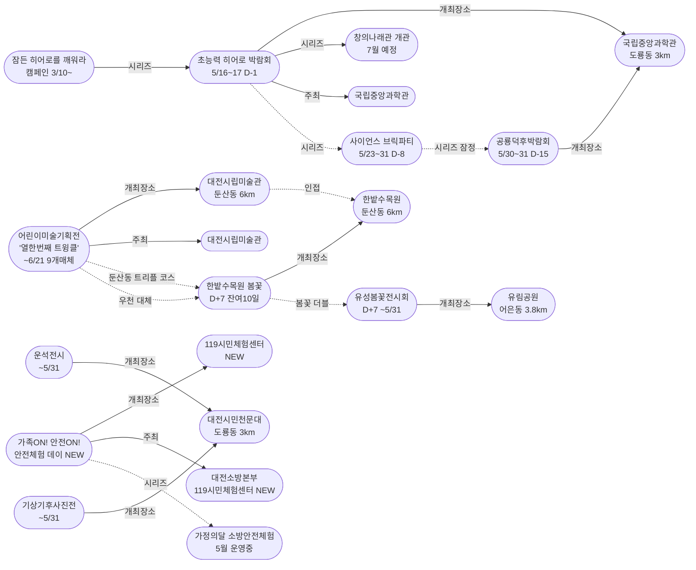
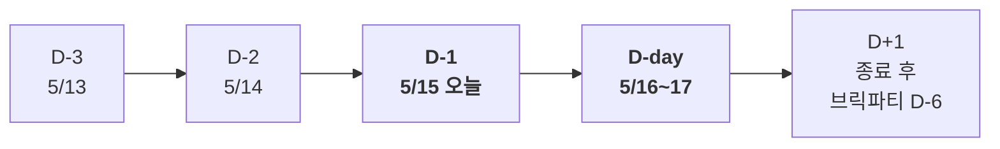
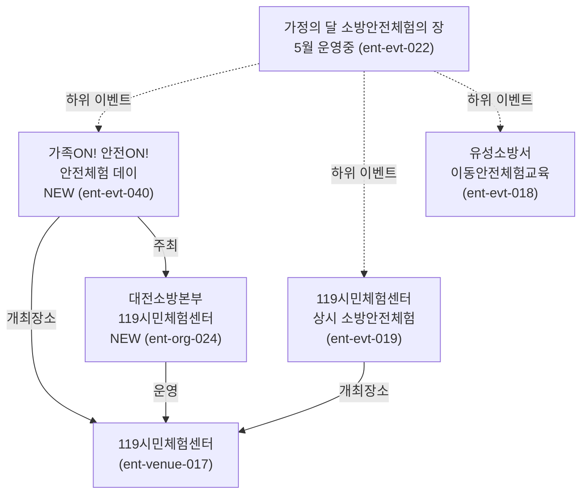

# 2026-05-15 대전 유성구 어린이·가족 이벤트 일일 보고서

## 요약

**초능력 히어로 박람회가 D-1에 진입 — 내일(5/16) D-day.** 국립중앙과학관 사이언스터널에서 열리는 가정의 달 시리즈 클라이맥스가 내일이다. 전파신문 신규 매체 보도로 히어로 박람회 누적 매체가 확대되었다. **119시민체험센터 '가족ON! 안전ON! 안전체험 데이' 신규 발견** — 대전소방본부가 가정의 달을 맞아 운영하는 가족 안전체험 특별 이벤트가 5개 매체에 동시 보도되었다. **대전시립미술관 '열한번째 트윙클' 전시가 누적 9개 매체 교차검증 완료** — 신뢰도 0.95로 상향되어 둔산동 가족 코스가 확정되었다.

## 용성로20 주변 (도보권 내)

### ring-stroll (1km 이내) — 전민동 클러스터 유지 (변동 없음)

| 시설 | 동 | 거리 | 유형 | 상태 |
|------|---|------|------|------|
| 아가랑도서관 | 전민동 | ~0.9km | 도서관 — 아가맘 행복교실 | 운영 중 (4/4~6/27) |
| 유성구 평생학습센터 전민센터 | 전민동 | ~0.8km | 공공기관 원데이클래스 | 운영 중 |
| 전민종합문화센터 | 전민동 | ~0.8km | 문화센터 | 기존 |

> 도보권 내 변동 없음. 전민동 3거점 클러스터 안정 유지.

## 오늘의 추천 (가족 동반 Top 5)

| 순위 | 이벤트 | 장소 (동) | 대상 | 비용 | 비고 |
|------|--------|----------|------|------|------|
| 1 | **초능력 히어로 박람회** | 국립중앙과학관 (도룡동, 3km) | 초등 | 미확인 | **D-1 내일 D-day!** |
| 2 | **어린이미술기획전 '열한번째 트윙클'** | 대전시립미술관 (둔산동, 6km) | 유아~초등 | 미확인 | 9개 매체 검증 완료 |
| 3 | **가족ON! 안전ON! 안전체험 데이** | 119시민체험센터 (5km) | 전연령 가족 | **무료** | **NEW** 소방 가족체험 |
| 4 | **대전시민천문대 운석전시** | 대전시민천문대 (도룡동, 3km) | 전연령 가족 | **무료** | 운영 중 (~5/31) |
| 5 | **한밭수목원 봄꽃 전시회** | 한밭수목원 (둔산동, 6km) | 전연령 가족 | **무료** | D+7, **잔여 10일** (~5/25) |

> **오늘의 포인트:** 히어로 D-1 — 내일 D-day 직전 마지막 준비일. 안전체험 데이(NEW)로 공공기관 주최 행사 라인업이 두꺼워졌다.

## 신규 이벤트

### 1. 대전119시민체험센터 '가족ON! 안전ON! 안전체험 데이'

- **출처:** [대전119시민체험센터, 가정의 달 맞아 '가족ON! 안전ON! 안전체험 데이' 성황 | 더에스엔에스타임](https://www.thesnstime.com/daejeon119siminceheomsenteo-gajeongyi-dal-maja-gajogon-anjeonon-anjeonceheom-dei-seonghwang/)
- **장소:** 119시민체험센터 (~5km, ring-car)
- **주최:** 대전소방본부 119시민체험센터
- **비용:** 무료
- **사전신청:** 불필요
- **실내/야외:** 실내

**프로그램 구성:**
- 소화기 및 옥내소화전 사용법 체험
- 노래방 화재 대피·탈출 체험
- 심폐소생술 등 생활응급처치 체험
- 위기 탈출 체험
- 투척용 소화기 토너먼트 게임
- 소방안전 상식 퀴즈
- 지진 발생 시 행동요령 및 대피 체험

이도훈 119시민체험센터장은 "가정의 달을 맞아 가족이 함께 즐기며 안전을 배울 수 있는 체험형 프로그램을 마련했다"고 밝혔다.

- **어린이 친화도:** 0.85
  - 게임·토너먼트·퀴즈 등 놀이 요소로 어린이 참여도 높음
  - 유아(4~6): 소화기 체험, 지진 대피 등 기본 프로그램 적합
  - 초등(7~12): 탈출 체험, 응급처치 등 고난이도 프로그램 참여 가능
- **관련 엔티티:** 대전소방본부 119시민체험센터, 가정의 달 소방안전체험의 장
- **추가 출처:** [KSP뉴스](https://kspnews.com/2653197), [더연합타임즈](https://www.theuniontimes.co.kr/2051212), [천지일보](https://www.newscj.com/news/articleView.html?idxno=3399622), [충남일보](https://www.chungnamilbo.co.kr/news/articleView.html?idxno=887490)

## 업데이트 항목

### 2. 초능력 히어로 박람회 D-1 — 내일 D-day!

- **출처:** [중앙과학관, 16~17일 초능력 히어로 박람회 | 전파신문](http://www.jeonpa.co.kr/news/articleView.html?idxno=218393)
- **이전 상태:** D-2 (5/14)
- **금일 변경:** D-2→**D-1**. **내일(5/16 금) D-day.** 전파신문 신규 매체 확인.
- **시리즈 전체 구조:**
  - 캠페인: 잠든 히어로를 깨워라 (3/10~, 진행 중)
  - 5/1~3: 동심 로그인 (종료)
  - 5/5: 어린이 한마당 (종료)
  - 5/9~10: 가족뮤지컬 알라딘 (종료)
  - **5/16~17: 초능력 히어로 박람회 (D-1)** ← **내일 D-day!**
  - 5/23~31: 사이언스 브릭파티 (D-8)
  - 5/30~31: 공룡덕후박람회 (D-15)
  - 7월: 창의나래관 '초능력 비밀 아카데미' 개관

### 3. 공룡덕후박람회 D-15 — 유튜브 공식 안내 영상 공개

- **출처:** [국립중앙과학관 6.1 세계 공룡의 날 공룡덕후박람회 한눈에 보기 | YouTube](https://www.youtube.com/watch?v=9gP975mQS1Q)
- **이전 상태:** D-16 (5/14)
- **금일 변경:**
  - D-16→**D-15**
  - **국립중앙과학관 공식 유튜브 채널에 안내 영상 공개** — 텍스트 매체(YTN 사이언스·Twig24 등) 외 시각적 홍보 채널 확대
  - 공통령 선거·이융남 강연 내용은 기존과 동일

### 4. 대전시립미술관 '열한번째 트윙클' — 9개 매체 교차검증 완료

- **출처:** [대전시립미술관, 2026 어린이미술기획전 '열한번째 트윙클' 개최 | 한국연합신문](https://www.koreaunionnews.com/2046689)
- **이전 상태:** 5개 매체 (5/14)
- **금일 변경:** 한국연합신문·正筆·금강일보·투어코리아 4개 매체 추가 → **누적 9개 매체 교차검증 완료**. 신뢰도 0.90→**0.95** 상향.
- **추가 출처:** [正筆](https://www.jeongpil.com/2424799), [금강일보](https://www.ggilbo.com/news/articleView.html?idxno=1142790), [투어코리아](https://www.tournews21.com/news/articleView.html?idxno=130126)

## 신규 오픈 가게·팝업·프로모션

금일 유성구 일대 신규 오픈 가게/팝업/프로모션 발견 없음.

## 공공기관 주최 행사 (행정복지센터·보건소·복지관·도서관·우체국·경찰서·소방서)

| 기관 | 행사 | 상태 | 비고 |
|------|------|------|------|
| **국립중앙과학관** | **초능력 히어로 박람회** | **D-1 내일 D-day!** | 사이언스터널, 5/16~17 |
| **119시민체험센터** | **가족ON! 안전ON! 안전체험 데이** | **운영 중 (NEW)** | 무료, 가족 안전체험 |
| **국립중앙과학관** | 잠든 히어로를 깨워라 캠페인 | 진행 중 | 창의나래관 7월 개관 연계 |
| **국립중앙과학관** | **공룡덕후박람회** | **D-15 유튜브 영상 공개** | 5/30~31 |
| **대전시립미술관** | 어린이미술기획전 '열한번째 트윙클' | 운영 중 (9개 매체 검증) | ~6/21, 체험형 |
| **대전시민천문대** | 운석전시 + 기상기후사진전 | 운영 중 | ~5/31, 무료 |
| **유성구(유성구청)** | 유성봄꽃전시회 | D+7 단독 운영 (~5/31) | 유림공원, 무료 |
| **대전광역시** | 한밭수목원 봄꽃 전시회 | D+7 (**잔여 10일**) | ~5/25, 무료 |
| 유성구통합도서관 (관평) | 그림책, 나만의 보물을 담다 | 운영 중 | 유아~초등저학년 |
| 유성구통합도서관 | 지역작가 인(人) 도서관 | 5월 운영 중 | 6개 도서관 순회 |
| 아가랑도서관 (전민) | 아가·맘 행복교실 | 운영 중 (4/4~6/27) | 영유아 |
| 대전시민천문대 | 상시 관측 프로그램 | 정상 운영 | 14:00~22:00 |
| 유성소방서 | 가정의 달 소방안전체험 | 운영 중 | 솔로몬파크 |
| 유성구 보건소 | 유성이의 튼튼스쿨 | 하반기 예정 | 7/20 신청, 8/19~ |

## 마감 임박 (사전신청 D-3 이내)

| 이벤트 | D-day | 일시 | 장소 | 비고 |
|--------|-------|------|------|------|
| **초능력 히어로 박람회** | **D-1** | **5/16(금)~17(토)** | 국립중앙과학관 사이언스터널 | **내일 D-day!** |

> **히어로 박람회 D-1.** 오늘이 사전 준비 마지막 날. 내일(5/16 금) D-day 개막. 캠페인 아이템 제출·히어로파티 등록 최종 기한.

## 동심원별 묶음 (0.5km / 1km / 2km / 5km)

### ring-stroll (1km 이내) — 전민동
- 아가랑도서관 (아가맘 행복교실) — 운영 중
- 유성구 평생학습센터 전민센터 — 운영 중

### ring-bike (2km 이내) — 관평동
- 관평도서관 (그림책 프로그램) — 운영 중

### ring-car (5km 이내) — 어은동·도룡동·노은동

- 국립중앙과학관 (도룡동, ~3km) — **히어로 D-1 내일 D-day!**
- **대전시민천문대 — 운석전시+기상기후사진전** (도룡동, ~3km) — 무료, ~5/31
- **유림공원 — 봄꽃전시회 D+7 단독 운영** (어은동, ~3.8km) — 무료
- 탐이꿈이의 비밀 실험실 (도룡동, ~3km) — 운영 중 (~6/30)
- 너티차일드 키즈테마파크 (도룡동, ~3.5km) — 상시
- **119시민체험센터 — 안전체험 데이 (NEW)** (~5km) — 무료
- 대전광역시어린이회관 (노은동, ~4km) — 상시
- 대전 오월드 (어은동, ~4.5km) — 5월 말까지 재개장 불가

### ring 초과 (5km+) — 둔산동

- **대전시립미술관 — 어린이미술기획전 '열한번째 트윙클'** (둔산동, ~6km) — ~6/21, 9개 매체 검증
- 한밭수목원 — 봄꽃 전시회 D+7 (둔산동, ~6km) — 무료, ~5/25 (**잔여 10일**)

> **둔산동 가족 트리플 코스 확정:** 한밭수목원 봄꽃(야외, 잔여 10일) + 대전시립미술관 트윙클(실내, 9개 매체 검증) + 스탬프 투어. 우천 시 실내 대체 가능(신뢰도 0.85).

## 동(洞)별 이벤트 묶음

| 동 | 1차 타겟 | 금일 이벤트 |
|----|---------|------------|
| **도룡동** | O | 과학관: **히어로 D-1 내일 D-day!**, 천문대: 운석전시+기상기후사진전, 탐이꿈이 |
| **어은동** | — | 유림공원: 봄꽃전시회 D+7 단독 |
| **전민동** | O | 아가맘 행복교실, 평생학습센터 |
| **관평동** | O | 관평도서관 그림책 프로그램 |
| 용산동 | O | 금일 해당 없음 |
| 문지동 | O | 금일 해당 없음 |
| 신성동 | O | 금일 해당 없음 |
| 노은동 | — | 어린이회관 상시 |
| **둔산동** | 유성구 외 | 미술관 트윙클 (9개 매체) + 한밭수목원 봄꽃 D+7 |

## 연령대별 묶음

| 연령대 | 추천 이벤트 |
|--------|-----------|
| 영유아 (0~3) | 아가맘 행복교실 (전민동, 0.9km) |
| 유아 (4~6) | 미술관 트윙클 미끄럼틀, 탐이꿈이 비밀실험실, 봄꽃 산책, **안전체험 데이(NEW)** |
| 초등저학년 (7~9) | **히어로 D-1 사전준비!**, 미술관 트윙클, 천문대 운석전시, **안전체험 데이(NEW)** |
| 초등고학년 (10~12) | **히어로 D-1 사전준비!**, 공룡덕후 참가 신청, 천문대 특별전시, 미술관 트윙클 |
| 전연령 가족 | **둔산동 가족 트리플 코스(봄꽃+트윙클)**, 도룡동 과학 코스(천문대+과학관), **안전체험 데이(NEW)** |

## 시리즈/정기 프로그램 업데이트

| 시리즈 | 금일 상태 | 다음 일정 |
|--------|---------|----------|
| **국립중앙과학관 가정의 달** | **히어로 D-1 내일 D-day!** | **5/16~17 히어로 D-day** |
| 잠든 히어로를 깨워라 | 진행 중 | 히어로 페스타 초대권 추첨 |
| 대전시립미술관 어린이미술기획전 | 트윙클 (9개 매체 검증) | ~6/21 매일 운영 |
| **119시민체험센터 안전체험** | **안전체험 데이 (NEW)** | **5월 내 추가 회차 예상** |
| 대전시민천문대 특별전시 | 운석전시+기상기후사진전 | ~5/31 매일 14:00~22:00 (월 휴관) |
| 유성봄꽃전시회 | D+7 단독 운영 | 5/31까지 매일 (유림공원, 무료) |
| 한밭수목원 봄꽃 전시회 | D+7 (**잔여 10일**) | 5/25까지 (한밭수목원, 무료) |
| 공룡덕후박람회 | **D-15 유튜브 영상 공개** | 5/30~31 (D-15) |
| 사이언스 브릭파티 | 사전 안내 | 5/23~31 (D-8) |
| 유성소방서 안전체험 | 운영 중 | 5월 내 사전신청 |
| 유성구 도서관 프로그램 | 운영 중 | 북스타트·그림책·작가·북큐레이션 |
| 탐이꿈이의 비밀 실험실 | 운영 중 (~6/30) | 국립어린이과학관 사전예약 |
| 대전시민천문대 상시 관측 | 정상 운영 | 화~일 14:00~22:00 |
| 유성이의 튼튼스쿨 | 하반기 예정 | 7/20 신청, 8/19~11/27 운영 |
| 대전 오월드 재개장 | 5월 말까지 불가 | 변동 없음 |
| 창의나래관 개관 | 7월 예정 | 히어로 박람회가 전초 행사 |

## 지식그래프 시각화

### 오늘의 주요 관계

오늘의 핵심은 **히어로 박람회 D-1 — 내일 D-day**와 **119시민체험센터 안전체험 데이(NEW)**이다. 히어로 박람회는 가정의 달 시리즈의 최고 정점에 도달했고, 안전체험 데이는 소방 안전 프로그램의 특별 회차로 공공기관 라인업을 보강한다. 트윙클 전시는 9개 매체 교차검증으로 둔산동 가족 코스가 확정되었다.

### 전체 지식그래프 시각화

### 히어로 박람회 D-1 카운트다운

### 소방 안전체험 관계도 (금일 신규)

## 온톨로지 변경

| 변경 유형 | 대상 | 근거 |
|----------|------|------|
| 새 Event | ent-evt-040 가족ON! 안전ON! 안전체험 데이 | 5개 매체 동시 보도 |
| 새 Organization | ent-org-024 대전소방본부 119시민체험센터 | 안전체험 데이 주최 기관 |

## 추론 결과

| 추론 | 신뢰도 | 근거 |
|------|--------|------|
| 안전체험 데이 → 가정의달 소방안전 하위 시리즈 | 0.85 | 동일 장소·동일 계열 기관 (same_venue_series) |
| 안전체험 데이 publicTrustBoost +0.15 | 0.85 | 소방서 주최 어린이 행사 (public_institution_kid_event) |
| 안전체험 데이 ↔ 상시 소방체험 방문 연계 | 0.90 | 동일 장소 연계 (same_dong_combo) |
| 트윙클 = 봄꽃 우천 대체 신뢰도 상향 | 0.85 | 9개 매체 교차검증 (indoor_rainy_fallback) |
| 히어로 → 알라딘 후속 시리즈 확정 | 0.98 | D-1 확정 (same_venue_series) |

## 분석 및 평가

오늘은 **히어로 D-1 마감 카운트다운 + 소방 안전체험 데이 신규 발견의 날**이다.

**금일의 핵심:**

1. **히어로 박람회 D-1 — 내일 D-day**: 국립중앙과학관 가정의 달 시리즈의 클라이맥스가 내일(5/16 금)이다. 전파신문 신규 매체 보도로 히어로 박람회의 인지도가 더 넓어졌다. 사전 히어로파티 등록, 캠페인 아이템 제출 마감에 주의해야 한다.

2. **119시민체험센터 '가족ON! 안전ON! 안전체험 데이' (NEW)**: 대전소방본부가 가정의 달을 맞아 운영하는 가족 안전체험 특별 이벤트. 소화기·탈출·응급처치·지진 체험 등 7개 프로그램을 무료로 운영한다. 5개 매체 동시 보도로 신뢰도가 높다. 기존 '가정의 달 소방안전체험의 장'(ent-evt-022)의 하위 이벤트로, 공공기관 행사 3종 커버 의무를 더 두텁게 충족한다.

3. **트윙클 전시 9개 매체 교차검증 완료**: 어제 5개 매체에서 금일 9개 매체로 확대. 둔산동 가족 코스(한밭수목원 봄꽃 + 트윙클 미술전)가 확정 수준의 신뢰도(0.95)에 도달했다.

4. **공룡덕후박람회 유튜브 공식 안내 영상**: 텍스트 매체 외 시각적 홍보 채널이 추가되었다. 5/30~31 D-day까지 D-15.

**내일 일정:**
- **5/16(금): 초능력 히어로 박람회 D-day 개막!**
- 5/17(토): 히어로 박람회 Day 2 (마지막)
- 5/18(일)~: 히어로 종료 → 브릭파티(D-5)·공룡덕후(D-12) 카운트다운 가속

## 추적 항목

| 항목 | 최초 보고 | 상태 | 최신 업데이트 |
|------|----------|------|-------------|
| **초능력 히어로 박람회** | 2026-04-30 | **D-1 내일 D-day!** | 전파신문 신규 매체 |
| **119시민체험센터 안전체험 데이** | **2026-05-15** | **NEW** | 5개 매체 동시 보도 |
| 대전시립미술관 어린이미술기획전 | 2026-05-14 | 트윙클 (9개 매체 검증) | 신뢰도 0.95 상향 |
| 잠든 히어로를 깨워라 캠페인 | 2026-05-12 | 진행 중 | 변동 없음 |
| 창의나래관 개관 | 2026-05-12 | 7월 예정 | 변동 없음 |
| 대전시민천문대 특별전시 | 2026-05-13 | 운석전시+기상기후사진전 | 변동 없음, ~5/31 |
| 한밭수목원 봄꽃 전시회 | 2026-05-12 | D+7 (**잔여 10일**) | ~5/25 |
| **공룡덕후박람회** | 2026-04-30 | **D-15 유튜브 영상 공개** | 시각적 홍보 채널 확대 |
| 사이언스 브릭파티 | 2026-04-30 | D-8 | 5/23~31, 사전 안내 |
| 유성봄꽃전시회 | 2026-05-08 | D+7 단독 운영 | 유림공원 5/31까지, 무료 |
| 대전 오월드 재개장 | 2026-05-06 | 5월 말까지 불가 | 변동 없음 |
| 유성소방서 안전체험 | 2026-04-26 | 운영 중 | 솔로몬파크 |
| 대전시민천문대 상시 관측 | 2026-04-25 | 정상 운영 | 14:00~22:00 |
| 과학관 가정의 달 시리즈 | 2026-04-30 | **히어로 D-1, 클라이맥스 내일!** | 캠페인→히어로→개관 |
| 도서관 프로그램 | 2026-04-25 | 운영 중 | 그림책·아가맘·작가 |
| 유성이의 튼튼스쿨 | 2026-05-07 | 하반기 예정 | 7/20 신청, 8/19~ 운영 |

## 동향 요약

| 분류 | 상태 | 비고 |
|------|------|------|
| 어린이·가족 이벤트 | **히어로 D-1 내일 D-day! + 안전체험 데이 NEW** | 도룡동 과학코스 + 소방체험 |
| 신규 가게/팝업 | **금일 신규 없음** | — |
| 공공기관 행사 | 과학관(히어로 D-1) + 119시민체험센터(안전체험 데이 NEW) + 미술관(트윙클 9개 매체) + 천문대·도서관(운영중) | 공룡덕후 유튜브 |

## 출처 목록

1. [대전119시민체험센터, 가정의 달 맞아 '가족ON! 안전ON! 안전체험 데이' 성황 | 더에스엔에스타임](https://www.thesnstime.com/daejeon119siminceheomsenteo-gajeongyi-dal-maja-gajogon-anjeonon-anjeonceheom-dei-seonghwang/) - 더에스엔에스타임
2. [중앙과학관, 16~17일 초능력 히어로 박람회 | 전파신문](http://www.jeonpa.co.kr/news/articleView.html?idxno=218393) - 전파신문
3. [국립중앙과학관 6.1 세계 공룡의 날 공룡덕후박람회 한눈에 보기 | YouTube](https://www.youtube.com/watch?v=9gP975mQS1Q) - 국립중앙과학관 유튜브
4. [대전시립미술관, 2026 어린이미술기획전 '열한번째 트윙클' 개최 | 한국연합신문](https://www.koreaunionnews.com/2046689) - 한국연합신문
5. [대전시립미술관, 2026 어린이미술기획전 '열한번째 트윙클' 개최 | 正筆](https://www.jeongpil.com/2424799) - 正筆
6. [대전시립미술관, 2026 어린이미술기획전 '열한번째 트윙클' 개최 | 금강일보](https://www.ggilbo.com/news/articleView.html?idxno=1142790) - 금강일보
7. [대전시립미술관, 어린이미술기획전 '열한번째 트윙클' 마련 | 투어코리아](https://www.tournews21.com/news/articleView.html?idxno=130126) - 투어코리아
8. [대전119시민체험센터 가족ON! 안전ON! 안전체험 데이 성황 | KSP뉴스](https://kspnews.com/2653197) - KSP뉴스
9. [대전119시민체험센터 안전체험 데이 성황 | 더연합타임즈](https://www.theuniontimes.co.kr/2051212) - 더연합타임즈
10. [대전119시민체험센터 체험형 안전교육 시민 큰 호응 | 천지일보](https://www.newscj.com/news/articleView.html?idxno=3399622) - 천지일보
11. [대전소방본부 119시민체험센터 안전체험 데이 행사 진행 | 충남일보](https://www.chungnamilbo.co.kr/news/articleView.html?idxno=887490) - 충남일보
12. [유성구통합도서관](https://lib.yuseong.go.kr/) - 유성구통합도서관 공식
13. [대전시민천문대](https://djstar.kr/) - 대전시민천문대 공식
