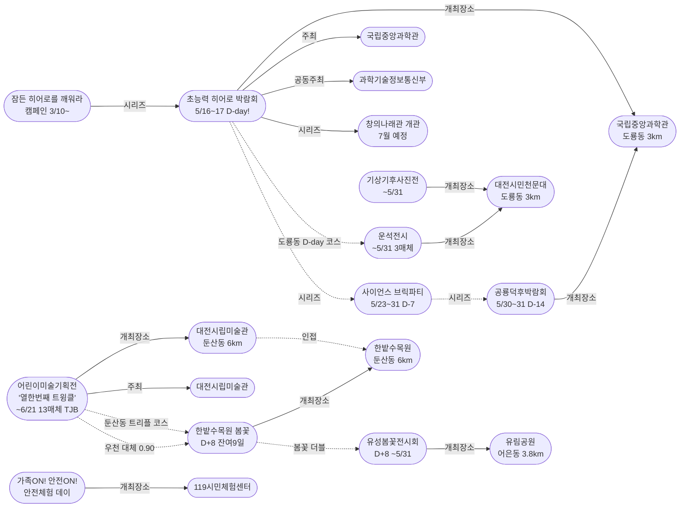
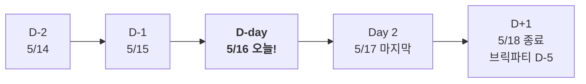
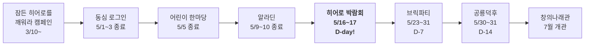

# 2026-05-16 대전 유성구 어린이·가족 이벤트 일일 보고서

## 요약

**초능력 히어로 박람회 D-day 개막!** 국립중앙과학관 사이언스터널에서 오늘(5/16 금)~내일(5/17 토) 양일간 가정의 달 시리즈 클라이맥스가 열린다. 과기정통부 보도자료로 체험 프로그램 상세가 최초 공개되었다 — 자석의 힘을 이용한 '비행 능력' 체험, 빛과 색의 원리를 활용한 '투명화' 실험, VR 초능력 체험존 등 놀이+과학 융합 프로그램이 확인되었다. **대전시립미술관 '열한번째 트윙클' 전시가 13개 매체 교차검증에 도달** — TJB 대전방송(지역 TV)까지 진출하여 텍스트+영상 다중 미디어 수렴을 달성, 신뢰도 0.98. 금일 신규 이벤트 발견 없음 — 히어로 D-day와 진행 중 이벤트 추적에 집중.

## 용성로20 주변 (도보권 내)

### ring-stroll (1km 이내) — 전민동 클러스터 유지 (변동 없음)

| 시설 | 동 | 거리 | 유형 | 상태 |
|------|---|------|------|------|
| 아가랑도서관 | 전민동 | ~0.9km | 도서관 — 아가맘 행복교실 | 운영 중 (4/4~6/27) |
| 유성구 평생학습센터 전민센터 | 전민동 | ~0.8km | 공공기관 원데이클래스 | 운영 중 |
| 전민종합문화센터 | 전민동 | ~0.8km | 문화센터 | 기존 |

> 도보권 내 변동 없음. 전민동 3거점 클러스터 안정 유지.

## 오늘의 추천 (가족 동반 Top 5)

| 순위 | 이벤트 | 장소 (동) | 대상 | 비용 | 비고 |
|------|--------|----------|------|------|------|
| 1 | **초능력 히어로 박람회** | 국립중앙과학관 (도룡동, 3km) | 초등 | 미확인 | **D-day 오늘 개막!** |
| 2 | **어린이미술기획전 '열한번째 트윙클'** | 대전시립미술관 (둔산동, 6km) | 유아~초등 | 미확인 | **13개 매체** 검증, TJB TV |
| 3 | **가족ON! 안전ON! 안전체험 데이** | 119시민체험센터 (5km) | 전연령 가족 | **무료** | 소방 가족체험 운영 중 |
| 4 | **대전시민천문대 운석전시+기상기후사진전** | 대전시민천문대 (도룡동, 3km) | 전연령 가족 | **무료** | 히어로 연계 도룡동 코스 |
| 5 | **한밭수목원 봄꽃 전시회** | 한밭수목원 (둔산동, 6km) | 전연령 가족 | **무료** | D+8, **잔여 9일** (~5/25) |

> **오늘의 포인트:** 히어로 D-day 개막! 도룡동 코스(히어로 오후 → 천문대 야간) 추천. 둔산동 코스(트윙클+한밭수목원)는 우천 시 실내 대체 가능(신뢰도 0.90).

## 신규 이벤트

금일 유성구 일대 신규 이벤트 발견 없음.

## 업데이트 항목

### 1. 초능력 히어로 박람회 D-day — 오늘 개막!

- **출처:** [과기정통부 초능력 배우러 과학관으로 출동 『초능력 영웅(히어로) 박람회』 개최 | 뉴스서울](https://newsseoul.co.kr/news/view/1065584409950991)
- **이전 상태:** D-1 (5/15)
- **금일 변경:** D-1→**D-day 개막!** 과기정통부 보도자료로 체험 프로그램 상세 최초 공개.
- **공식 명칭:** 『초능력 영웅(히어로) 박람회: 비밀 아카데미 신입 요원 모집』
- **일시:** 5/16(금)~17(토), 국립중앙과학관 사이언스터널
- **주최:** 과학기술정보통신부 + 국립중앙과학관

**체험 프로그램 상세 (최초 공개):**
- 자석의 힘을 이용한 '비행 능력' 체험
- 빛과 색의 원리를 활용한 '투명화' 실험
- VR 초능력 체험존
- 입학테스트 → AI·로봇·AR 초능력 훈련
- 코스프레 기념촬영, O/X 퀴즈쇼, 창의나래관 퍼레이드

**히어로파티 사전신청:**
- QR 코드로 사전신청 → 입학테스트 면제 + 멘토단 퍼레이드 참여
- 온라인 예약 시스템으로 혼잡 최소화

- **어린이 친화도:** 0.95 (0.90에서 상향)
  - 과기정통부 보도자료로 놀이+과학 융합 체험 확인
  - 초등저학년(7~9): 자석비행·투명화 등 과학 놀이 최적
  - 초등고학년(10~12): AI·로봇·AR 훈련, 퀴즈쇼 참여
- **시리즈 전체 구조:**
  - 캠페인: 잠든 히어로를 깨워라 (3/10~, 진행 중)
  - 5/1~3: 동심 로그인 (종료)
  - 5/5: 어린이 한마당 (종료)
  - 5/9~10: 가족뮤지컬 알라딘 (종료)
  - **5/16~17: 초능력 히어로 박람회 (D-day 오늘!)** ← **개막!**
  - 5/23~31: 사이언스 브릭파티 (D-7)
  - 5/30~31: 공룡덕후박람회 (D-14)
  - 7월: 창의나래관 '초능력 비밀 아카데미' 개관
- **추가 출처:** [보험AI뉴스(다자비)](https://dazabi.com/insurance_magazine/article.php?id=20334)

### 2. 대전시립미술관 '열한번째 트윙클' — 13개 매체 교차검증, TJB TV 진출

- **출처:** [대전시립미술관, 어린이미술전 '열한번째 트윙클' 열어 | TJB 대전방송](https://www.tjb.co.kr/news11/category/view/id/95553/version/1)
- **이전 상태:** 9개 매체 (5/15)
- **금일 변경:** 뉴스로·세계일보(인천)·퍼블릭뉴스통신·TJB 대전방송 4개 매체 추가 → **누적 13개 매체 교차검증**. 신뢰도 0.95→**0.98** 상향.
- **핵심:** **TJB 대전방송(지역 TV)** 진출 — 텍스트 매체를 넘어 영상 미디어까지 확대. 다중 미디어 수렴 달성.
- **추가 출처:** [뉴스로](https://www.newsro.kr/article243/1626322/), [세계일보(인천)](http://incheon.thesegye.com/news/view/1065599512998244), [퍼블릭뉴스통신](http://www.ttlnews.com/news/articleView.html?idxno=3081852)

### 3. 대전시민천문대 특별전시 — 더에스엔에스타임 별도 기사 확인

- **출처:** [대전시민천문대, 가정의 달 5월 특별전시 개최 | 더에스엔에스타임](https://www.thesnstime.com/daejeonsiminceonmundae-gajeongyi-dal-5weol-teugbyeoljeonsi-gaecoe/)
- **이전 상태:** 서울경제 단독 매체 (5/13)
- **금일 변경:** 더에스엔에스타임 별도 기사 확인. 운석전시+기상기후사진전 매체 수 2→**3**. 히어로 연계 도룡동 코스로 가치 상승.

## 신규 오픈 가게·팝업·프로모션

금일 유성구 일대 신규 오픈 가게/팝업/프로모션 발견 없음.

## 공공기관 주최 행사 (행정복지센터·보건소·복지관·도서관·우체국·경찰서·소방서)

| 기관 | 행사 | 상태 | 비고 |
|------|------|------|------|
| **국립중앙과학관** | **초능력 히어로 박람회** | **D-day 오늘 개막!** | 사이언스터널, 5/16~17 |
| **국립중앙과학관** | 잠든 히어로를 깨워라 캠페인 | 진행 중 | 창의나래관 7월 개관 연계 |
| **국립중앙과학관** | **사이언스 브릭파티** | **D-7** | 5/23~31 |
| **국립중앙과학관** | **공룡덕후박람회** | **D-14** | 5/30~31 |
| **대전시립미술관** | 어린이미술기획전 '열한번째 트윙클' | 운영 중 (**13개 매체, TJB TV**) | ~6/21, 체험형 |
| **대전시민천문대** | 운석전시 + 기상기후사진전 | 운영 중 (3매체) | ~5/31, 무료 |
| **119시민체험센터** | 가족ON! 안전ON! 안전체험 데이 | 운영 중 | 무료, 가족 안전체험 |
| **유성구(유성구청)** | 유성봄꽃전시회 | D+8 (~5/31) | 유림공원, 무료 |
| **대전광역시** | 한밭수목원 봄꽃 전시회 | D+8 (**잔여 9일**) | ~5/25, 무료 |
| 유성구통합도서관 (관평) | 그림책, 나만의 보물을 담다 | 운영 중 | 유아~초등저학년 |
| 유성구통합도서관 | 지역작가 인(人) 도서관 | 5월 운영 중 | 6개 도서관 순회 |
| 아가랑도서관 (전민) | 아가·맘 행복교실 | 운영 중 (4/4~6/27) | 영유아 |
| 대전시민천문대 | 상시 관측 프로그램 | 정상 운영 | 14:00~22:00 |
| 유성소방서 | 가정의 달 소방안전체험 | 운영 중 | 솔로몬파크 |
| 유성구 보건소 | 유성이의 튼튼스쿨 | 하반기 예정 | 7/20 신청, 8/19~ |

## 마감 임박 (사전신청 D-3 이내)

| 이벤트 | D-day | 일시 | 장소 | 비고 |
|--------|-------|------|------|------|
| **초능력 히어로 박람회** | **D-day** | **5/16(금)~17(토)** | 국립중앙과학관 사이언스터널 | **오늘 개막! 내일 마지막** |

> **히어로 박람회 D-day 개막!** 오늘이 첫날. 내일(5/17 토)이 마지막. 히어로파티 QR 사전신청으로 입학테스트 면제 + 멘토단 퍼레이드 참여 가능.

## 동심원별 묶음 (0.5km / 1km / 2km / 5km)

### ring-stroll (1km 이내) — 전민동
- 아가랑도서관 (아가맘 행복교실) — 운영 중
- 유성구 평생학습센터 전민센터 — 운영 중

### ring-bike (2km 이내) — 관평동
- 관평도서관 (그림책 프로그램) — 운영 중

### ring-car (5km 이내) — 어은동·도룡동·노은동

- **국립중앙과학관 (도룡동, ~3km) — 히어로 D-day 개막!**
- **대전시민천문대 — 운석전시+기상기후사진전** (도룡동, ~3km) — 무료, ~5/31, **히어로 연계 코스**
- **유림공원 — 봄꽃전시회 D+8** (어은동, ~3.8km) — 무료
- 탐이꿈이의 비밀 실험실 (도룡동, ~3km) — 운영 중 (~6/30)
- 너티차일드 키즈테마파크 (도룡동, ~3.5km) — 상시
- 119시민체험센터 — 안전체험 데이 (~5km) — 무료
- 대전광역시어린이회관 (노은동, ~4km) — 상시
- 대전 오월드 (어은동, ~4.5km) — 5월 말까지 재개장 불가

### ring 초과 (5km+) — 둔산동

- **대전시립미술관 — 어린이미술기획전 '열한번째 트윙클'** (둔산동, ~6km) — ~6/21, **13개 매체 TJB TV**
- 한밭수목원 — 봄꽃 전시회 D+8 (둔산동, ~6km) — 무료, ~5/25 (**잔여 9일**)

> **도룡동 D-day 코스:** 히어로 박람회(오후) → 천문대 운석전시+기상기후사진전(야간) → 천문대 상시 관측
> **둔산동 가족 트리플 코스 확정:** 한밭수목원 봄꽃(야외, 잔여 9일) + 대전시립미술관 트윙클(실내, 13개 매체) + 스탬프 투어. 우천 시 실내 대체 가능(신뢰도 0.90).

## 동(洞)별 이벤트 묶음

| 동 | 1차 타겟 | 금일 이벤트 |
|----|---------|------------|
| **도룡동** | O | 과학관: **히어로 D-day 개막!**, 천문대: 운석전시+기상기후사진전, 탐이꿈이 |
| **어은동** | — | 유림공원: 봄꽃전시회 D+8 |
| **전민동** | O | 아가맘 행복교실, 평생학습센터 |
| **관평동** | O | 관평도서관 그림책 프로그램 |
| 용산동 | O | 금일 해당 없음 |
| 문지동 | O | 금일 해당 없음 |
| 신성동 | O | 금일 해당 없음 |
| 노은동 | — | 어린이회관 상시 |
| **둔산동** | 유성구 외 | 미술관 트윙클 (**13개 매체 TJB**) + 한밭수목원 봄꽃 D+8 |

## 연령대별 묶음

| 연령대 | 추천 이벤트 |
|--------|-----------|
| 영유아 (0~3) | 아가맘 행복교실 (전민동, 0.9km) |
| 유아 (4~6) | 미술관 트윙클 미끄럼틀, 탐이꿈이 비밀실험실, 봄꽃 산책, 안전체험 데이 |
| 초등저학년 (7~9) | **히어로 D-day! 자석비행·투명화 체험**, 미술관 트윙클, 천문대 운석전시, 안전체험 데이 |
| 초등고학년 (10~12) | **히어로 D-day! AI·로봇·AR 훈련·VR체험존**, 공룡덕후 참가 신청, 천문대 특별전시, 미술관 트윙클 |
| 전연령 가족 | **도룡동 D-day 코스(히어로+천문대)**, 둔산동 트리플 코스(봄꽃+트윙클), 안전체험 데이 |

## 시리즈/정기 프로그램 업데이트

| 시리즈 | 금일 상태 | 다음 일정 |
|--------|---------|----------|
| **국립중앙과학관 가정의 달** | **히어로 D-day 개막!** | **5/17 히어로 마지막날** |
| 잠든 히어로를 깨워라 | 진행 중 | 히어로 페스타 초대권 추첨 |
| 대전시립미술관 어린이미술기획전 | 트윙클 (**13개 매체, TJB TV**) | ~6/21 매일 운영 |
| 119시민체험센터 안전체험 | 안전체험 데이 운영 | 5월 내 추가 회차 예상 |
| 대전시민천문대 특별전시 | 운석전시+기상기후사진전 (3매체) | ~5/31 매일 14:00~22:00 (월 휴관) |
| 유성봄꽃전시회 | D+8 (~5/31) | 유림공원 무료 |
| 한밭수목원 봄꽃 전시회 | D+8 (**잔여 9일**) | 5/25까지 (무료) |
| **사이언스 브릭파티** | **D-7** | **5/23~31** |
| **공룡덕후박람회** | **D-14** | **5/30~31** |
| 유성소방서 안전체험 | 운영 중 | 솔로몬파크 |
| 유성구 도서관 프로그램 | 운영 중 | 북스타트·그림책·작가·아가맘 |
| 탐이꿈이의 비밀 실험실 | 운영 중 (~6/30) | 국립어린이과학관 사전예약 |
| 대전시민천문대 상시 관측 | 정상 운영 | 화~일 14:00~22:00 |
| 유성이의 튼튼스쿨 | 하반기 예정 | 7/20 신청, 8/19~11/27 운영 |
| 대전 오월드 재개장 | 5월 말까지 불가 | 변동 없음 |
| 창의나래관 개관 | 7월 예정 | **히어로 박람회가 전초 행사** |

## 지식그래프 시각화

### 오늘의 주요 관계

오늘의 핵심은 **히어로 박람회 D-day 개막**이다. 과기정통부 보도자료로 공동 주최가 확인되고 체험 상세(자석비행·투명화·VR)가 공개되었다. 트윙클 전시는 TJB 대전방송(지역 TV)을 포함 13개 매체에 도달하여 텍스트+영상 다중 미디어 수렴을 달성했다. 도룡동 D-day 코스(히어로→천문대)와 둔산동 트리플 코스(봄꽃+트윙클)가 양대 추천 코스로 확정.

### 전체 지식그래프 시각화

### 히어로 D-day 타임라인

### 과학관 가정의 달 시리즈 전체 흐름

## 온톨로지 변경

| 변경 유형 | 대상 | 근거 |
|----------|------|------|
| 속성 업데이트 | ent-evt-026 히어로 공식명칭+체험상세+kid_friendly 0.95 | 과기정통부 보도자료 D-day |
| 속성 업데이트 | ent-evt-039 트윙클 매체 13, 신뢰도 0.98 | TJB TV 포함 4매체 추가 |
| 속성 업데이트 | ent-evt-037/038 천문대전시 매체 3 | 더에스엔에스타임 추가 |
| 관계 추가 | ent-evt-026 organizedBy ent-org-009 | 과기정통부 공동 주최 확인 |

> 금일 새 클래스/새 엔티티 없음 — 기존 엔티티 속성 업데이트만.

## 추론 결과

| 추론 | 신뢰도 | 근거 |
|------|--------|------|
| 히어로 → 알라딘 후속 시리즈 최종 확정 | 0.98 | D-day 확정 (same_venue_series) |
| 히어로 kid_friendly 0.90→0.95 | 0.95 | 체험 상세 확인 (operator_kid_friendliness) |
| 히어로 + 천문대 운석전시 도룡동 연계 | 0.85 | 동일 동 당일 코스 (same_dong_combo) |
| 트윙클 = 한밭수목원 봄꽃 우천 대체 신뢰도 상향 | 0.90 | 13개 매체 신뢰도 (indoor_rainy_fallback) |
| 트윙클 신뢰도 0.95→0.98 | 0.98 | 13개 매체+TJB TV (media_convergence) |

## 분석 및 평가

오늘은 **히어로 박람회 D-day 개막**의 날이다.

**금일의 핵심:**

1. **히어로 박람회 D-day 개막!**: 국립중앙과학관 가정의 달 시리즈의 클라이맥스가 오늘 열렸다. 과기정통부 보도자료가 D-day에 맞춰 배포되면서 체험 프로그램 상세가 최초 공개되었다. 자석비행능력·투명화 실험·VR 체험존 등 놀이+과학 융합 프로그램으로 초등학생 맞춤형. 히어로파티 QR 사전신청→입학테스트 면제+멘토단 퍼레이드 운영 방식이 확인됨. 내일(5/17 토)이 마지막.

2. **트윙클 전시 13개 매체 — TJB TV 진출**: 어제 9개 매체에서 오늘 13개 매체로 급증. 특히 TJB 대전방송(지역 TV)이 핵심 — 텍스트 매체를 넘어 영상 미디어까지 확대되어 다중 미디어 수렴 달성. 신뢰도 0.98.

3. **천문대 특별전시 추가 매체**: 더에스엔에스타임 별도 기사로 3매체 도달. 히어로 D-day와 연계한 도룡동 코스(오후 히어로→야간 천문대)의 실질적 가치가 상승.

4. **금일 신규 이벤트/가게 없음**: 히어로 D-day에 주목이 집중된 날. 3종 커버 의무 중 (b) 가게는 "금일 신규 없음" 처리.

**내일(5/17) 일정:**
- **히어로 박람회 Day 2 (마지막)**
- 5/18(일): 히어로 종료 → 브릭파티(D-5)·공룡덕후(D-12) 카운트다운 가속

## 추적 항목

| 항목 | 최초 보고 | 상태 | 최신 업데이트 |
|------|----------|------|-------------|
| **초능력 히어로 박람회** | 2026-04-30 | **D-day 오늘 개막!** | 과기정통부 보도자료 체험 상세 공개 |
| **대전시립미술관 어린이미술기획전** | 2026-05-14 | **트윙클 (13개 매체, TJB TV)** | 신뢰도 0.98 |
| **대전시민천문대 특별전시** | 2026-05-13 | 운석전시+기상기후사진전 (3매체) | 더에스엔에스타임 추가 |
| 잠든 히어로를 깨워라 캠페인 | 2026-05-12 | 진행 중 | 변동 없음 |
| 창의나래관 개관 | 2026-05-12 | 7월 예정 | 히어로 D-day 전초 행사 |
| 한밭수목원 봄꽃 전시회 | 2026-05-12 | D+8 (**잔여 9일**) | ~5/25 |
| **사이언스 브릭파티** | 2026-04-30 | **D-7** | 5/23~31 |
| **공룡덕후박람회** | 2026-04-30 | **D-14** | 5/30~31 |
| 119시민체험센터 안전체험 데이 | 2026-05-15 | 운영 중 | 변동 없음 |
| 유성봄꽃전시회 | 2026-05-08 | D+8 (~5/31) | 유림공원, 무료 |
| 대전 오월드 재개장 | 2026-05-06 | 5월 말까지 불가 | 변동 없음 |
| 유성소방서 안전체험 | 2026-04-26 | 운영 중 | 솔로몬파크 |
| 대전시민천문대 상시 관측 | 2026-04-25 | 정상 운영 | 14:00~22:00 |
| 과학관 가정의 달 시리즈 | 2026-04-30 | **히어로 D-day, 시리즈 클라이맥스!** | 캠페인→히어로→개관 |
| 도서관 프로그램 | 2026-04-25 | 운영 중 | 북스타트·그림책·아가맘·작가 |
| 유성이의 튼튼스쿨 | 2026-05-07 | 하반기 예정 | 7/20 신청, 8/19~ 운영 |

## 동향 요약

| 분류 | 상태 | 비고 |
|------|------|------|
| 어린이·가족 이벤트 | **히어로 D-day 개막! + 트윙클 13매체 TJB TV** | 도룡동 과학코스 + 둔산동 가족코스 |
| 신규 가게/팝업 | **금일 신규 없음** | — |
| 공공기관 행사 | 과학관(**히어로 D-day**) + 미술관(**트윙클 13매체**) + 천문대(3매체) + 119시민체험센터 + 도서관 | 브릭파티 D-7, 공룡덕후 D-14 |

## 출처 목록

1. [과기정통부 초능력 배우러 과학관으로 출동 『초능력 영웅(히어로) 박람회』 개최 | 뉴스서울](https://newsseoul.co.kr/news/view/1065584409950991) - 뉴스서울
2. [초능력 배우러 과학관으로 출동 『초능력 영웅(히어로) 박람회』 개최 | 보험AI뉴스](https://dazabi.com/insurance_magazine/article.php?id=20334) - 다자비(보험AI뉴스)
3. [대전시립미술관, 어린이미술전 '열한번째 트윙클' 열어 | TJB 대전방송](https://www.tjb.co.kr/news11/category/view/id/95553/version/1) - TJB 대전방송
4. [대전시립미술관, 2026 어린이미술기획전 개최 | 뉴스로](https://www.newsro.kr/article243/1626322/) - 뉴스로
5. [대전시립미술관, 2026 어린이미술기획전 '열한번째 트윙클' 개최 | 세계일보(인천)](http://incheon.thesegye.com/news/view/1065599512998244) - 세계일보(인천)
6. [대전시립미술관, 어린이미술기획전 '열한번째 트윙클'개최 | 퍼블릭뉴스통신](http://www.ttlnews.com/news/articleView.html?idxno=3081852) - 퍼블릭뉴스통신
7. [대전시민천문대, 가정의 달 5월 특별전시 개최 | 더에스엔에스타임](https://www.thesnstime.com/daejeonsiminceonmundae-gajeongyi-dal-5weol-teugbyeoljeonsi-gaecoe/) - 더에스엔에스타임
8. [유성구통합도서관](https://lib.yuseong.go.kr/) - 유성구통합도서관 공식
9. [대전시민천문대](https://djstar.kr/) - 대전시민천문대 공식
