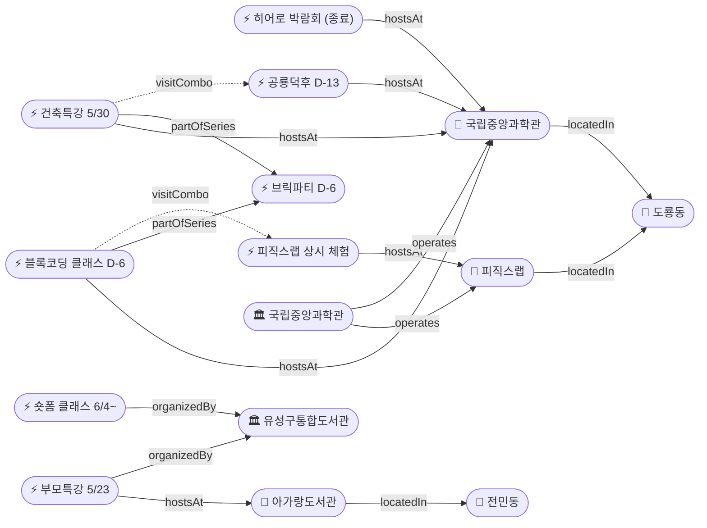

# 2026-05-17 유성구 어린이·가족 이벤트 일일 보고서

## 요약

초능력 히어로 박람회가 **오늘(5/17) 마지막날**을 맞아 국립중앙과학관 사이언스터널에서 종료된다. 파이프라인 누락으로 등록되지 않았던 **피직스랩(Physics Lab) 상설 전시관**(1월 개관, 33종 물리체험)을 금일 발견하여 온톨로지에 추가했다. 사이언스 브릭파티(D-6) 연계 프로그램 2건(블록 코딩 클래스·건축 특강)이 신규 공개되었고, 아가랑도서관 부모특강(5/23, **접수 마감 D-5**)과 진잠도서관 숏폼 클래스(6/4~, 접수 마감 D-11)가 새로 확인되었다.

---

## 용성로20 주변 (도보권 0.5km 내)

금일 도보권(ring-walk, 0.5km) 내 신규 이벤트 없음.

---

## 오늘의 추천 (가족 동반 Top 5)

| # | 이벤트 | 장소 | 대상 | 비용 | 비고 |
|---|--------|------|------|------|------|
| 1 | **초능력 히어로 박람회 (마지막날)** | 국립중앙과학관 사이언스터널 | 초등 | 미확인 | 오늘 종료 — 자석비행·투명화·VR |
| 2 | **피직스랩 상시 체험** | 국립중앙과학관 과학기술관 1층 | 초등·가족 | 무료(입장권별도) | 33종 물리 실험 |
| 3 | **아이들은 놀기 위해 세상에 온다** (부모특강) | 아가랑도서관(전민동) | 영유아·유아 부모 | 무료 | 접수 마감 D-5 (5/22) |
| 4 | **블록 코딩 전통과학기술 클래스** | 국립중앙과학관 세미나실 | 초등 | 미확인 | D-6 (5/23~24) |
| 5 | **유성봄꽃전시회** | 유림공원(어은동) | 전연령 | 무료 | D+9, ~5/31 |

---

## 신규 이벤트

### 1. 피직스랩(Physics Lab) 상시 체험 — 국립중앙과학관 (신규 등록)
- **출처:** [뉴스1](https://www.news1.kr/local/daejeon-chungnam/6047996)
- **장소:** 국립중앙과학관 과학기술관 1층 (도룡동, ring-car ~3.2km)
- **개관일:** 2026-01-23
- **내용:** 약 750㎡ 규모, 힘과에너지·열과에너지·전기와자기·빛과파동 4개 주제, 33종 체험형 전시품. 레이저·공기압·자석 등 직접 실험. 초등~중등 교과서 물리 원리를 오감으로 체험.
- **비용:** 무료 (과학관 입장권 별도)
- **대상연령:** 초등저학년 / 초등고학년 / 전연령가족
- **kid_friendly_score:** 0.90
- **실내·야외:** 실내
- **상태:** 신규 (기존 파이프라인 누락 발견)

### 2. 블록 코딩 전통과학기술 클래스 (브릭파티 연계)
- **출처:** [국립중앙과학관](https://www.science.go.kr/mps/1070/bbs/431/moveBbsNttList.do)
- **일시:** 2026-05-23 ~ 05-24
- **장소:** 국립중앙과학관 세미나실 (도룡동, ring-car)
- **내용:** 사이언스 브릭파티(5/23~31) 연계. 블록 코딩과 전통과학기술 융합 STEM 교육 프로그램.
- **비용:** 미확인 (사전예약 예상)
- **대상연령:** 초등저학년 / 초등고학년
- **kid_friendly_score:** 0.90
- **실내·야외:** 실내
- **상태:** 신규

### 3. 시리즈 1: 선넘는 높이 — 건축 특별강연 (브릭파티 연계)
- **출처:** [국립중앙과학관](https://www.science.go.kr/mps/1070/bbs/431/moveBbsNttList.do)
- **일시:** 2026-05-30
- **장소:** 국립중앙과학관 내래홀 (도룡동, ring-car)
- **내용:** 사이언스 브릭파티 연계 건축+과학 융합 특별강연. 5/30은 공룡덕후박람회와 같은 날 — 종일 방문 콤보 가능.
- **비용:** 미확인
- **대상연령:** 초등고학년 / 전연령가족
- **kid_friendly_score:** 0.70
- **실내·야외:** 실내
- **상태:** 신규

---

## 신규 오픈 가게·팝업·프로모션

금일 유성구 일대 가게(Shop) 신규 오픈/프로모션/팝업 특이사항 **없음**.

---

## 공공기관 주최 행사 (행정복지센터·보건소·복지관·도서관·우체국·경찰서·소방서)

### 1. 아가랑도서관 부모특강 '아이들은 놀기 위해 세상에 온다'
- **출처:** [유성구통합도서관](https://lib.yuseong.go.kr/web/menu/10095/program/30010/lectureList.do)
- **일시:** 2026-05-23
- **장소:** 아가랑도서관 (전민동, ring-stroll ~900m)
- **내용:** 양육자·관심있는 성인 대상 놀이 관련 특강
- **비용:** 무료
- **정원:** 35명 (현재 16명 접수 — 잔여 19석)
- **접수 마감:** 2026-05-22 **(D-5)**
- **대상연령:** 영유아·유아 보호자
- **kid_friendly_score:** 0.75
- **실내·야외:** 실내
- **상태:** 신규

### 2. 진잠도서관 숏폼 영상 제작 클래스 '함께 만드는 우리의 세계'
- **출처:** [유성구통합도서관](https://lib.yuseong.go.kr/web/menu/10095/program/30010/lectureList.do)
- **일시:** 2026-06-04 ~ 06-25 (4회)
- **장소:** 진잠도서관 K-도서관 미디어 창작공간
- **내용:** 공익 숏폼 영상 제작 교육. K-도서관 미디어 장비 활용.
- **비용:** 무료 (추정)
- **정원:** 10명 (현재 2명 — 잔여 8석)
- **접수 마감:** 2026-05-28 (D-11)
- **대상연령:** 초등 4~6학년 (초등고학년)
- **kid_friendly_score:** 0.80
- **실내·야외:** 실내
- **상태:** 신규

### 3. 진잠도서관 K-도서관 5월 이용자교육
- **출처:** [유성구통합도서관](https://lib.yuseong.go.kr/web/menu/10095/program/30010/lectureList.do)
- **일시:** 2026-05-30
- **장소:** 진잠도서관 K-도서관
- **비용:** 무료
- **정원:** 8명 (현재 2명 — 잔여 6석)
- **접수 마감:** 2026-05-27 (D-10)
- **대상연령:** 초등생·가족
- **상태:** 업데이트 (접수 현황 최초 확인)

---

## 마감 임박 (사전신청 D-3 이내)

금일 기준 D-3 이내 마감 항목 **없음**.

참고: 아가랑도서관 부모특강 접수 마감 D-5 (5/22) — 다음 주 초 마감 임박 섹션 진입 예정.

---

## 동심원별 묶음

### ring-stroll (1km 이내, 도보 15분)
| 이벤트 | 장소 | 일시 | 상태 |
|--------|------|------|------|
| 아이들은 놀기 위해 세상에 온다 | 아가랑도서관(전민동) | 5/23 | 신규·접수중 |

### ring-car (5km 이내, 차량 10분)
| 이벤트 | 장소 | 일시 | 상태 |
|--------|------|------|------|
| 초능력 히어로 박람회 | 국립중앙과학관 사이언스터널 | 5/16~17 | **오늘 종료** |
| 피직스랩 상시 체험 | 국립중앙과학관 과학기술관 1층 | 상시 | 신규 등록 |
| 블록 코딩 클래스 | 국립중앙과학관 세미나실 | 5/23~24 | D-6 |
| 건축 특강 '선넘는 높이' | 국립중앙과학관 내래홀 | 5/30 | D-13 |
| 유성봄꽃전시회 | 유림공원(어은동) | ~5/31 | 진행중 |
| 천문대 운석전시+사진전 | 대전시민천문대(도룡동) | ~5/31 | 진행중 |

---

## 동(洞)별 이벤트 묶음

### 도룡동 (1차 타겟)
- 초능력 히어로 박람회 (마지막날)
- 피직스랩 상시 체험 (신규)
- 블록 코딩 전통과학기술 클래스 (5/23~24)
- 건축 특별강연 (5/30)
- 천문대 운석전시·기상기후사진전 (~5/31)

### 전민동 (1차 타겟)
- 아가랑도서관 부모특강 (5/23, 접수중)

### 어은동 (보조)
- 유성봄꽃전시회 (~5/31)

---

## 연령대별 묶음

| 연령대 | 이벤트 |
|--------|--------|
| 영유아·유아 (0~6세) | 부모특강 '아이들은 놀기 위해 세상에 온다' (5/23) |
| 초등저학년 (7~9세) | 히어로 박람회(마지막날), 피직스랩, 블록 코딩(5/23~24) |
| 초등고학년 (10~12세) | 히어로 박람회(마지막날), 피직스랩, 블록 코딩(5/23~24), 건축특강(5/30), 숏폼 클래스(6/4~) |
| 전연령가족 | 유성봄꽃전시회, 천문대 전시, 피직스랩 |

---

## 시리즈/정기 프로그램 업데이트

| 시리즈 | 다음 회차 | 상태 |
|--------|----------|------|
| 국립중앙과학관 가정의 달 시리즈 | 브릭파티 5/23~31 → 공룡덕후 5/30~31 | D-6 / D-13 |
| 유성구 도서관 세대별 독서문화 | 아가랑도서관 부모특강 5/23 | D-6, 접수중 |
| K-도서관 이용자교육 (연 4회) | 5월분 5/30 | D-13, 접수중 |
| 탐이 꿈이의 비밀 실험실 | 상시 운영 (~6/30) | 진행중 |

---

## 지식그래프 시각화

### 오늘의 주요 관계
- **신규:** 피직스랩 → 국립중앙과학관 운영, 도룡동 소재
- **연계:** 블록코딩·건축특강 → 브릭파티(partOfSeries)
- **추론:** 블록코딩 ↔ 피직스랩(visitCombo), 건축특강 ↔ 공룡덕후(visitCombo, 5/30 동일일)
- **종료:** 히어로 박람회 Day 2 → 종료 전환

### 전체 지식그래프

---

## 온톨로지 변경

| 변경 유형 | 대상 | 근거 |
|----------|------|------|
| 새 Venue | ent-venue-026 피직스랩 | 2026.1.23 개관, 기존 파이프라인 누락 발견 |
| 새 Event | ent-evt-041 피직스랩 상시 체험 | 상설 체험관 |
| 새 Event | ent-evt-042 블록코딩 클래스 | 브릭파티 연계 신규 공개 |
| 새 Event | ent-evt-043 건축 특별강연 | 브릭파티 연계 신규 공개 |
| 새 Event | ent-evt-044 부모특강 | 아가랑도서관 신규 접수 |
| 새 Event | ent-evt-045 숏폼 클래스 | 진잠도서관 신규 접수 |

---

## 추론 결과

| 추론 | 규칙 | 신뢰도 | 근거 |
|------|------|--------|------|
| 피직스랩 → kidFriendlyBoost +0.2 | operator_kid_friendliness | 0.90 | 과학관 운영 체험관 |
| 블록코딩 ↔ 피직스랩 방문 콤보 | same_dong_combo | 0.85 | 같은 날 같은 기관 내 이동 |
| 건축특강 ↔ 공룡덕후 방문 콤보 | same_dong_combo | 0.85 | 5/30 동일일 국립중앙과학관 |
| 부모특강 → kidFriendlyBoost +0.2 | operator_kid_friendliness | 0.90 | 도서관 운영 프로그램 |

---

## 분석 및 평가

**히어로 박람회 종료:** 5/16~17 양일 행사가 금일 마무리된다. 과기정통부 보도자료 기반 최종 확인. 전파신문 추가 보도(총 매체 수 증가). 내일부터 보고서에서 '종료' 처리.

**피직스랩 발견의 의미:** 1월에 개관한 상설 시설이 23일간 누락된 것은 해당 시기 파이프라인 미가동 때문. 국립중앙과학관 방문 시 히어로·브릭파티·공룡덕후 등 특별행사와 함께 상시 체험 가능한 핵심 시설. 33종 전시로 kid_friendly_score 0.90.

**브릭파티 생태계 확장:** 모이벤트(5/23~31) 외에 블록코딩(5/23~24), 건축특강(5/30)이 연계 프로그램으로 공개됨. 5/30에는 공룡덕후박람회와도 겹쳐 가족 종일 방문 최적일.

**도서관 프로그램 활발:** 아가랑도서관(전민동, ring-stroll) 부모특강은 용성로20에서 도보 15분 거리로 접근성 높음. 숏폼 클래스는 초등 고학년 미디어 리터러시 교육으로 차별화.

---

## 추적 항목

| 항목 | 최초 보고 | 상태 | 최신 업데이트 |
|------|----------|------|-------------|
| 초능력 히어로 박람회 | 2026-04-30 | **종료 (5/17)** | Day 2 마지막날 운영 후 종료 |
| 사이언스 브릭파티 | 2026-04-30 | D-6 (5/23~31) | 연계 프로그램 2건 신규 공개 |
| 공룡덕후박람회 | 2026-04-30 | D-13 (5/30~31) | 5/30 건축특강과 동시 개최 |
| 유성봄꽃전시회 | 2026-05-08 | 진행중 (~5/31) | 변동 없음 |
| 열한번째 트윙클 | 2026-05-14 | 진행중 (~6/21) | 변동 없음, 13개 매체 |
| 천문대 특별전시 | 2026-05-13 | 진행중 (~5/31) | 변동 없음 |

---

## 동향 요약

| 분류 | 상태 | 비고 |
|------|------|------|
| 어린이·가족 이벤트 | 신규 4건 | 피직스랩·블록코딩·건축특강·부모특강 |
| 가게(Shop) | 금일 신규 없음 | — |
| 공공기관 행사 | 신규 2건 | 도서관 프로그램 (부모특강·숏폼) |

---

## 출처 목록

1. [중앙과학관, 16~17일 초능력 히어로 박람회](http://www.jeonpa.co.kr/news/articleView.html?idxno=218393) - 전파신문, 2026-05-17
2. [국립중앙과학관, 신규 물리체험 전시관 '피직스랩' 개관](https://www.news1.kr/local/daejeon-chungnam/6047996) - 뉴스1, 2026-01-23
3. [국립중앙과학관 행사 안내 (브릭파티·블록코딩·건축특강)](https://www.science.go.kr/mps/1070/bbs/431/moveBbsNttList.do) - 국립중앙과학관
4. [유성구통합도서관 프로그램 (부모특강·숏폼·K-도서관)](https://lib.yuseong.go.kr/web/menu/10095/program/30010/lectureList.do) - 유성구통합도서관
5. [과기정통부 초능력 히어로 박람회 보도자료](https://newsseoul.co.kr/news/view/1065584409950991) - 뉴스서울, 2026-05-16
6. [초능력 히어로 박람회 개최](https://dazabi.com/insurance_magazine/article.php?id=20334) - 다자비, 2026-05-16
7. ["보고 만지고 느끼니 원리가 쏙쏙" 피직스랩 개관](https://www.hellodd.com/news/articleView.html?idxno=110628) - 헬로디디, 2026-01-23
8. [물리로 세상을 체험하다, '피직스랩' 전격 개관](https://www.edu-focus.com/news/461944) - 교육포커스, 2026-01-23
