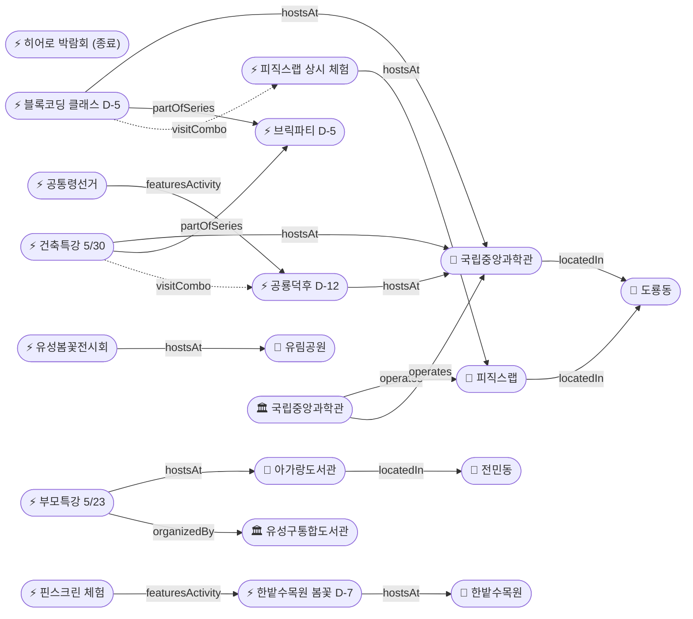

# 2026-05-18 유성구 어린이·가족 이벤트 일일 보고서

## 요약

초능력 히어로 박람회가 **어제(5/17) 공식 종료**되었다. **한밭수목원 봄꽃전시회가 D-7(5/25 종료)**로 이번 주가 마지막 관람 기회이며, 헤럴드경제·신아일보 추가 보도에서 **핀스크린 체험**과 야간 조명 연출이 확인되었다. 국립중앙과학관은 5/30~31 공룡덕후박람회의 하위 프로그램 **'제1대 공통령 선거' 참가안내를 공식 게시**하여 사전예약 불필요·무료 참여 조건을 확정했다. 아가랑도서관 부모특강 접수 마감은 **D-4(5/22)**로 접근 중이다.

---

## 용성로20 주변 (도보권 0.5km 내)

금일 도보권(ring-walk, 0.5km) 내 신규 이벤트 없음.

---

## 오늘의 추천 (가족 동반 Top 5)

| # | 이벤트 | 장소 | 대상 | 비용 | 비고 |
|---|--------|------|------|------|------|
| 1 | **한밭수목원 봄꽃전시회** | 한밭수목원(둔산동) | 전연령 | 무료 | **D-7 종료 임박** (5/25까지) |
| 2 | **피직스랩 상시 체험** | 국립중앙과학관 과학기술관 1층 | 초등·가족 | 무료(입장권별도) | 33종 물리 실험 |
| 3 | **아이들은 놀기 위해 세상에 온다** (부모특강) | 아가랑도서관(전민동) | 영유아·유아 부모 | 무료 | 접수 마감 **D-4** (5/22) |
| 4 | **유성봄꽃전시회** | 유림공원(어은동) | 전연령 | 무료 | ~5/31, D+10 |
| 5 | **열한번째 트윙클** (어린이미술기획전) | 대전시립미술관 | 유아·초등 | 미확인 | ~6/21, 미끄럼틀·섬유체험 |

---

## 신규 이벤트

### 1. 공룡덕후박람회 '제1대 공통령 선거' 참가안내 공식 게시
- **출처:** [국립중앙과학관](https://www.science.go.kr/mps/0/bbs/208/moveBbsNttDetail.do?nttSn=47381)
- **일시:** 2026-05-30 ~ 05-31 (공룡덕후박람회 내)
- **장소:** 국립중앙과학관 사이언스터널·꿈이광장 (도룡동, ring-car ~3.2km)
- **내용:** 관람객이 좋아하는 공룡에 투표하는 참여형 투표 이벤트. 선거 컨셉으로 공룡 후보들의 공약을 보고 투표.
- **비용:** 무료
- **사전예약:** 불필요 (현장 참여)
- **대상연령:** 유아 / 초등저학년 / 초등고학년 / 전연령가족
- **kid_friendly_score:** 0.85
- **실내·야외:** 실내+야외
- **상태:** 참가안내 공식 게시 (D-12)

---

## 신규 오픈 가게·팝업·프로모션

금일 유성구 일대 가게(Shop) 신규 오픈/프로모션/팝업 특이사항 **없음**.

---

## 공공기관 주최 행사 (행정복지센터·보건소·복지관·도서관·우체국·경찰서·소방서)

금일 공공기관 신규 행사 **없음**. 기존 프로그램 상시 운영 중:
- 119시민체험센터 소방안전체험 (화~토 상시)
- 유성구 도서관 세대별 독서문화 프로그램 (상시)
- 유성이의 튼튼스쿨 (하반기 8/19~ 예정)

---

## 마감 임박 (사전신청 D-3 이내)

금일 기준 D-3 이내 마감 항목 **없음**.

참고: **아가랑도서관 부모특강 접수 마감 D-4 (5/22)** — 내일(5/19) D-3 섹션 진입 예정.

---

## 동심원별 묶음

### ring-stroll (1km 이내, 도보 15분)
| 이벤트 | 장소 | 일시 | 상태 |
|--------|------|------|------|
| 아이들은 놀기 위해 세상에 온다 | 아가랑도서관(전민동) | 5/23 | 접수중·마감 D-4 |

### ring-car (5km 이내, 차량 10분)
| 이벤트 | 장소 | 일시 | 상태 |
|--------|------|------|------|
| 피직스랩 상시 체험 | 국립중앙과학관 과학기술관 1층 | 상시 | 운영중 |
| 블록 코딩 클래스 | 국립중앙과학관 세미나실 | 5/23~24 | D-5 |
| 건축 특강 '선넘는 높이' | 국립중앙과학관 내래홀 | 5/30 | D-12 |
| 공룡덕후박람회 (공통령선거 포함) | 국립중앙과학관 사이언스터널 | 5/30~31 | D-12, 참가안내 확정 |
| 유성봄꽃전시회 | 유림공원(어은동) | ~5/31 | D+10 |
| 천문대 운석전시+사진전 | 대전시민천문대(도룡동) | ~5/31 | 진행중 |
| 한밭수목원 봄꽃전시회 | 한밭수목원(둔산동) | ~5/25 | **D-7 종료 임박** |

---

## 동(洞)별 이벤트 묶음

### 도룡동 (1차 타겟)
- 피직스랩 상시 체험
- 블록 코딩 클래스 (D-5, 5/23~24)
- 건축 특별강연 (D-12, 5/30)
- 공룡덕후박람회 (D-12, 5/30~31) — 공통령선거 참가안내 확정
- 천문대 운석전시·기상기후사진전 (~5/31)

### 전민동 (1차 타겟)
- 아가랑도서관 부모특강 (5/23, 접수 마감 D-4)

### 어은동 (보조)
- 유성봄꽃전시회 (~5/31, D+10)

### 둔산동 (유성구 인접)
- 한밭수목원 봄꽃전시회 (~5/25, **D-7 종료 임박**)
- 열한번째 트윙클 (~6/21)

---

## 연령대별 묶음

| 연령대 | 이벤트 |
|--------|--------|
| 영유아·유아 (0~6세) | 부모특강 '아이들은 놀기 위해 세상에 온다' (5/23, 마감 D-4) |
| 초등저학년 (7~9세) | 피직스랩, 블록코딩(5/23~24), 공룡덕후+공통령선거(5/30~31) |
| 초등고학년 (10~12세) | 피직스랩, 블록코딩(5/23~24), 건축특강(5/30), 공룡덕후(5/30~31), 숏폼클래스(6/4~, 마감 D-10) |
| 전연령가족 | 한밭수목원 봄꽃(D-7), 유성봄꽃(~5/31), 열한번째 트윙클(~6/21), 천문대 전시(~5/31), 피직스랩 |

---

## 시리즈/정기 프로그램 업데이트

| 시리즈 | 다음 회차 | 상태 |
|--------|----------|------|
| 국립중앙과학관 가정의 달 시리즈 | 브릭파티 5/23~31 → 공룡덕후 5/30~31 | D-5 / D-12 |
| 유성구 도서관 세대별 독서문화 | 아가랑도서관 부모특강 5/23 | **마감 D-4**, 접수중 |
| K-도서관 이용자교육 (연 4회) | 5월분 5/30 | D-12, 접수중 |
| 탐이 꿈이의 비밀 실험실 | 상시 운영 (~6/30) | 진행중 |

---

## 지식그래프 시각화

### 오늘의 주요 관계
- **종료:** 히어로 박람회 → 공식 종료 (5/17)
- **신규:** 핀스크린 체험 → 한밭수목원 봄꽃전시회(featuresActivity)
- **업데이트:** 공통령선거 → 참가조건 확정 (사전예약 불필요·무료)
- **추론 유지:** 건축특강 ↔ 공룡덕후(visitCombo, 5/30), 블록코딩 ↔ 피직스랩(visitCombo)

### 전체 지식그래프

---

## 온톨로지 변경

| 변경 유형 | 대상 | 근거 |
|----------|------|------|
| 새 Activity | ent-act-025 핀스크린 체험 | 한밭수목원 봄꽃전시회 내 체험 프로그램 (헤럴드경제) |
| 속성 업데이트 | ent-act-020 공통령선거 | 참가조건 확정: 사전예약 불필요·무료 |
| 속성 업데이트 | ent-evt-034 한밭수목원 | 매체 5→7, 핀스크린·야간조명 상세 추가 |
| 상태 전환 | ent-evt-026 히어로 박람회 | 종료 (5/17 Day 2 마지막날) |

---

## 추론 결과

| 추론 | 규칙 | 신뢰도 | 근거 |
|------|------|--------|------|
| 건축특강 ↔ 공룡덕후 방문 콤보 | same_dong_combo | 0.85 | 5/30 동일일 동일장소 (유지) |
| 블록코딩 ↔ 피직스랩 방문 콤보 | same_dong_combo | 0.85 | 5/23~24 동일기관 (유지) |
| 한밭수목원 봄꽃전시회 긴급도 가산 | anchor_distance_priority | 0.80 | D-7 종료 임박 |

---

## 분석 및 평가

**히어로 박람회 종료:** 5/16~17 양일 행사가 어제(5/17) 마무리되었다. 오늘부터 추적 항목에서 '종료' 처리.

**한밭수목원 D-7의 의미:** 5/25 종료이므로 이번 주(5/18~25)가 마지막 관람 주간. 핀스크린 체험과 야간 조명이 추가 확인되어 가족 야간 방문 권유. 유성구 인접(둔산동)이라 약간 멀지만 가족 나들이 적합.

**공룡덕후 참가안내 확정:** 공통령선거가 사전예약 불필요·무료로 확정되어, 5/30 가족 방문 시 건축특강+공룡덕후+공통령투표 3개 프로그램을 하루에 소화 가능. 이 조합은 보고서에서 지속 권유.

**브릭파티 D-5:** 다음 주 금요일(5/23) 개막. 블록코딩 클래스(5/23~24)도 동시 시작. 사전예약 여부 확인 필요 — 후속 모니터링 대상.

**부모특강 마감 임박:** 내일(5/19) D-3 진입. 잔여석이 있다면 보고서에서 신청 독려.

---

## 추적 항목

| 항목 | 최초 보고 | 상태 | 최신 업데이트 |
|------|----------|------|-------------|
| 초능력 히어로 박람회 | 2026-04-30 | **종료 (5/17)** | 공식 종료 |
| 사이언스 브릭파티 | 2026-04-30 | D-5 (5/23~31) | 변동 없음 |
| 공룡덕후박람회 | 2026-04-30 | D-12 (5/30~31) | 공통령선거 참가안내 공식 게시 |
| 한밭수목원 봄꽃전시회 | 2026-05-12 | **D-7 종료 임박** (5/25) | 핀스크린·야간조명 확인, 매체 7개 |
| 유성봄꽃전시회 | 2026-05-08 | 진행중 (~5/31) | 변동 없음 |
| 열한번째 트윙클 | 2026-05-14 | 진행중 (~6/21) | 변동 없음, 13개 매체 |
| 천문대 특별전시 | 2026-05-13 | 진행중 (~5/31) | 변동 없음 |

---

## 동향 요약

| 분류 | 상태 | 비고 |
|------|------|------|
| 어린이·가족 이벤트 | 업데이트 2건 | 한밭수목원 D-7·공통령선거 참가안내 |
| 가게(Shop) | 금일 신규 없음 | — |
| 공공기관 행사 | 금일 신규 없음 | 기존 상시 운영 유지 |

---

## 출처 목록

1. [대전 한밭수목원, '2026 봄꽃 전시회' 팡파르](https://biz.heraldcorp.com/article/10733502) - 헤럴드경제
2. [한밭수목원, 25일까지 봄꽃 전시회 개최](https://www.shinailbo.co.kr/news/articleView.html?idxno=5018662) - 신아일보
3. [국립중앙과학관 공룡덕후박람회 제1대 공통령 선거 참가안내](https://www.science.go.kr/mps/0/bbs/208/moveBbsNttDetail.do?nttSn=47381) - 국립중앙과학관
4. [세계 공룡의 날 ��룡덕후박람회 참가안내](https://www.science.go.kr/mps/1111/bbs/208/moveBbsNttDetail.do?nttSn=47305) - 국립중앙과학관
5. [국립중앙과학관 행사안내](https://www.science.go.kr/mps/1070/bbs/431/moveBbsNttList.do) - 국립중앙과학관
6. [유성구통합도서관 프로그램](https://lib.yuseong.go.kr/web/menu/10095/program/30010/lectureList.do) - 유성구통합도서관
7. [대전시민천문대 운석전시 등 특별전시](https://www.sedaily.com/article/20042838) - 서울경제
8. [제5회 유성봄꽃전시회](https://daejeontour.co.kr/festival_djt/33) - 대전관광공사
