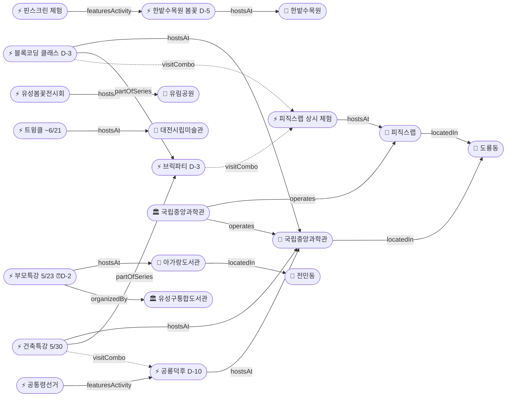

# 2026-05-20 유성구 어린이·가족 이벤트 일일 보고서

## 요약

**한밭수목원 봄꽃전시회가 D-5(5/25 종료)**로 마지막 주에 진입했다 — 이번 주말(5/24~25)이 사실상 마지막 관람 기회이며, 신아일보·텔트립 추가 보도로 총 12개 매체가 다루었다. **아가랑도서관 부모특강 접수 마감이 D-2(5/22)**로 하루 더 촉박해졌으나, 접수현황 최초 확인 결과 **35명 중 16명 접수(잔여 19명)**로 아직 여유가 있다. **공룡덕후박람회(D-10, 5/30~31)**는 소년한국일보(어린이 전문 매체)가 추가 보도하여 어린이 관객 유입 신호가 감지된다. **이번 주 금요일(5/23)에 브릭파티 개막(D-3)·블록코딩 클래스·부모특강 3종이 집중**된다.

---

## 용성로20 주변 (도보권 0.5km 내)

금일 도보권(ring-walk, 0.5km) 내 신규 이벤트 없음.

---

## 오늘의 추천 (가족 동반 Top 5)

| # | 이벤트 | 장소 | 대상 | 비용 | 비고 |
|---|--------|------|------|------|------|
| 1 | **한밭수목원 봄꽃전시회** | 한밭수목원(둔산동) | 전연령 | 무료 | **D-5 마지막 주** (5/25 종료, 이번 주말이 마지막) |
| 2 | **아이들은 놀기 위해 세상에 온다** (부모특강) | 아가랑도서관(전민동) | 영유아·유아 부모 | 무료 | **접수 마감 D-2** (5/22), 잔여 19명 |
| 3 | **피직스랩 상시 체험** | 국립중앙과학관 과학기술관 1층 | 초등·가족 | 무료(입장권별도) | 33종 물리 실험 |
| 4 | **유성봄꽃전시회** | 유림공원(어은동) | 전연령 | 무료 | ~5/31, D+12 |
| 5 | **열한번째 트윙클** (어린이미술기획전) | 대전시립미술관 | 유아·초등 | 미확인 | ~6/21, 미끄럼틀·섬유체험 |

---

## 신규 이벤트

금일 신규 이벤트 없음.

---

## 신규 오픈 가게·팝업·프로모션

금일 유성구 일대 가게(Shop) 신규 오픈/프로모션/팝업 특이사항 **없음**.

---

## 공공기관 주최 행사 (행정복지센터·보건소·복지관·도서관·우체국·경찰서·소방서)

금일 공공기관 신규 행사 **없음**. 기존 프로그램 상시 운영 중:
- 119시민체험센터 소방안전체험 (화~토 상시)
- 유성구 도서관 세대별 독서문화 프로그램 (상시)
- 유성이의 튼튼스쿨 (하반기 8/19~ 예정)

---

## 마감 임박 (사전신청 D-3 이내)

### 아가랑도서관 부모특강 '아이들은 놀기 위해 세상에 온다'
- **출처:** [유성구통합도서관](https://lib.yuseong.go.kr/web/menu/10095/program/30010/lectureList.do)
- **일시:** 2026-05-23 (금) 10:00
- **장소:** 아가랑도서관 (전민동, ring-stroll ~900m)
- **정원:** 35명 → **16명 접수, 잔여 19명**
- **접수 마감:** **2026-05-22 (D-2)**
- **대상:** 영유아·유아 양육자
- **비용:** 무료
- **상태:** 접수중 → **마감 임박** (내일/모레 마감)

### 한밭수목원 봄꽃전시회 (관람 종료 임박)
- **출처:** [대전관광공사](https://daejeontour.co.kr/festival_djt/35) | [신아일보](https://www.shinailbo.co.kr/news/articleView.html?idxno=5018662)
- **종료일:** 2026-05-25 (일) — **D-5, 이번 주말이 마지막 관람 기회**
- **장소:** 한밭수목원 동원·서원 (둔산동)
- **비용:** 무료
- **볼거리:** 작약·장미·해당화 만개, 핀스크린 체험, 야간 조명
- **매체 보도:** 총 12개 매체 (신아일보·텔트립 금일 추가)

---

## 동심원별 묶음

### ring-stroll (1km 이내, 도보 15분)
| 이벤트 | 장소 | 일시 | 상태 |
|--------|------|------|------|
| 아이들은 놀기 위해 세상에 온다 | 아가랑도서관(전민동) | 5/23 | **마감 D-2**, 잔여 19명 |

### ring-car (5km 이내, 차량 10분)
| 이벤트 | 장소 | 일시 | 상태 |
|--------|------|------|------|
| 피직스랩 상시 체험 | 국립중앙과학관 과학기술관 1층 | 상시 | 운영중 |
| 사이언스 브릭파티 | 국립중앙과학관 한국과학기술사관 | 5/23~31 | **D-3 개막** |
| 블록 코딩 클래스 | 국립중앙과학관 세미나실 | 5/23~24 | **D-3** |
| 건축 특강 '선넘는 높이' | 국립중앙과학관 내래홀 | 5/30 | D-10 |
| 공룡덕후박람회 (공통령선거 포함) | 국립중앙과학관 사이언스터널 | 5/30~31 | D-10, 소년한국일보 보도 |
| 유성봄꽃전시회 | 유림공원(어은동) | ~5/31 | D+12 |
| 천문대 운석전시+사진전 | 대전시민천문대(도룡동) | ~5/31 | 진행중 |
| 한밭수목원 봄꽃전시회 | 한밭수목원(둔산동) | ~5/25 | **D-5 마지막 주** |

---

## 동(洞)별 이벤트 묶음

### 도룡동 (1차 타겟)
- 피직스랩 상시 체험
- 사이언스 브릭파티 (**D-3**, 5/23~31 개막)
- 블록 코딩 클래스 (**D-3**, 5/23~24)
- 건축 특별강연 (D-10, 5/30)
- 공룡덕후박람회 (D-10, 5/30~31) — 소년한국일보 추가 보도
- 천문대 운석전시·기상기후사진전 (~5/31)

### 전민동 (1차 타겟)
- 아가랑도서관 부모특강 (5/23, **접수 마감 D-2**, 잔여 19명)

### 어은동 (보조)
- 유성봄꽃전시회 (~5/31, D+12)

### 둔산동 (유성구 인접)
- 한밭수목원 봄꽃전시회 (~5/25, **D-5 마지막 주**)
- 열한번째 트윙클 (~6/21)

---

## 연령대별 묶음

| 연령대 | 이벤트 |
|--------|--------|
| 영유아·유아 (0~6세) | 부모특강 '아이들은 놀기 위해 세상에 온다' (5/23, **마감 D-2**, 잔여 19명) |
| 초등저학년 (7~9세) | 피직스랩, 블록코딩(5/23~24), 브릭파티(5/23~), 공룡덕후+공통령선거(5/30~31) |
| 초등고학년 (10~12세) | 피직스랩, 블록코딩(5/23~24), 건축특강(5/30), 공룡덕후(5/30~31), 숏폼클래스(6/4~, 마감 D-8) |
| 전연령가족 | 한밭수목원 봄꽃(**D-5**), 유성봄꽃(~5/31), 열한번째 트윙클(~6/21), 천문대 전시(~5/31), 피직스랩 |

---

## 시리즈/정기 프로그램 업데이트

| 시리즈 | 다음 회차 | 상태 |
|--------|----------|------|
| 국립중앙과학관 가정의 달 시리즈 | 브릭파티 5/23~31 → 공룡덕후 5/30~31 | **D-3** / D-10 |
| 유성구 도서관 세대별 독서문화 | 아가랑도서관 부모특강 5/23 | **마감 D-2**, 잔여 19명 |
| K-도서관 이용자교육 (연 4회) | 5월분 5/30 | D-10, 접수중 (5/15~5/29) |
| 탐이 꿈이의 비밀 실험실 | 상시 운영 (~6/30) | 진행중 |
| 진잠도서관 숏폼 클래스 | 6/4~25 | 접수 마감 D-8 (5/28) |

---

## 지식그래프 시각화

### 오늘의 주요 관계
- **마감 임박:** 부모특강(ent-evt-044) → 접수 마감 D-2 → 아가랑도서관(전민동), 잔여 19명
- **종료 임박:** 한밭수목원 봄꽃전시회(ent-evt-034) → D-5, 매체 12개
- **개막 임박:** 브릭파티(ent-evt-027) → D-3, 5/23 개막
- **매체 확산:** 공룡덕후박람회(ent-evt-028) → 소년한국일보 추가, D-10
- **추론 유지:** 건축특강 ↔ 공룡덕후(visitCombo, 5/30), 블록코딩 ↔ 피직스랩(visitCombo), 브릭파티 ↔ 피직스랩(visitCombo)

### 전체 지식그래프

---

## 온톨로지 변경

| 변경 유형 | 대상 | 근거 |
|----------|------|------|
| 속성 업데이트 | ent-evt-034 한밭수목원 | 매체 10→12 (신아일보·텔트립), D-5 마지막 주 |
| 속성 업데이트 | ent-evt-028 공룡덕후박람회 | 소년한국일보(어린이 전문 매체) 추가, D-10 |
| 속성 업데이트 | ent-evt-044 부모특강 | D-2 마감 임박, 접수현황 35/16(잔여 19명) 최초 확인 |

---

## 추론 결과

| 추론 | 규칙 | 신뢰도 | 근거 |
|------|------|--------|------|
| 건축특강 ↔ 공룡덕후 방문 콤보 | same_dong_combo | 0.85 | 5/30 동일일 동일장소 (유지) |
| 블록코딩 ↔ 피직스랩 방문 콤보 | same_dong_combo | 0.85 | 5/23~24 동일기관 (유지) |
| 브릭파티 ↔ 피직스랩 방문 콤보 | same_dong_combo | 0.85 | 5/23~ 동일기관 (유지) |
| 한밭수목원 D-5 긴급도 가산 | anchor_distance_priority | 0.90 | 마지막 주, 매체 12개, urgencyBoost +0.2 |

---

## 분석 및 평가

**이번 주 하이라이트 — 한밭수목원 마지막 주:** 5/25(일) 종료이므로 이번 주말이 사실상 마지막 관람 기회이다. 작약·장미·해당화가 만개기에 접어든 시점이며, 핀스크린 체험과 야간 조명이 가능하다. 12개 매체가 보도한 올 시즌 최다 주목 전시. 주말 방문을 적극 권장한다.

**부모특강 접수현황 최초 확인:** 35명 정원 중 16명 접수(잔여 19명)로 아직 여유가 있다. 접수 마감일은 5/22(목)이므로 내일~모레까지 2일 남았다. 도서관 프로그램 특성상 마감 직전 몰림 가능성이 있으므로, 관심 있는 양육자는 오늘 중 신청을 권한다.

**금요일(5/23) 3종 집중:** 브릭파티 개막(D-3) + 블록코딩 클래스 시작(D-3) + 부모특강(5/23) — 3개 이벤트가 동일일에 집중된다. 브릭파티+블록코딩+피직스랩은 도룡동 종일 과학체험 콤보, 부모특강은 전민동 오전 프로그램으로 동선이 분리된다.

**공룡덕후 어린이 매체 보도:** 소년한국일보는 어린이·학부모 대상 전문 매체로, 이 채널의 보도는 실제 어린이 관객 유입의 선행지표이다. 5/30 방문 시 건축특강+공룡덕후+공통령투표 3종 체험이 하루에 가능하다.

---

## 추적 항목

| 항목 | 최초 보고 | 상태 | 최신 업데이트 |
|------|----------|------|-------------|
| 사이언스 브릭파티 | 2026-04-30 | **D-3** (5/23~31 개막) | 변동 없음 |
| 공룡덕후박람회 | 2026-04-30 | D-10 (5/30~31) | 소년한국일보 추가 |
| 한밭수목원 봄꽃전시회 | 2026-05-12 | **D-5 마지막 주** (5/25) | 매체 12개 달성 |
| 유성봄꽃전시회 | 2026-05-08 | 진행중 (~5/31) | 변동 없음 |
| 열한번째 트윙클 | 2026-05-14 | 진행중 (~6/21) | 변동 없음 |
| 천문대 특별전시 | 2026-05-13 | 진행중 (~5/31) | 변동 없음 |
| 아가랑도서관 부모특강 | 2026-05-17 | **마감 D-2** (5/22) | 접수현황 16/35(잔여 19명) |

---

## 동향 요약

| 분류 | 상태 | 비고 |
|------|------|------|
| 어린이·가족 이벤트 | 업데이트 3건 | 한밭수목원 D-5·공룡덕후 D-10·부모특강 D-2(잔여 19명) |
| 가게(Shop) | 금일 신규 없음 | — |
| 공공기관 행사 | 금일 신규 없음 | 기존 상시 운영 유지 |

---

## 출처 목록

1. [한밭수목원, 25일까지 봄꽃 전시회 개최](https://www.shinailbo.co.kr/news/articleView.html?idxno=5018662) - 신아일보
2. ["11만 7천 평 장미 터널이 무료라니"](https://www.telltrip.com/domestic-travel/daejeon-hanbat-arboretum-spring-flower-exhibition/) - 텔트립
3. [2026 한밭수목원 봄꽃 전시회](https://daejeontour.co.kr/festival_djt/35) - 대전관광공사
4. [대전 한밭수목원, 25일까지 봄꽃 전시회](https://www.news1.kr/local/daejeon-chungnam/6161639) - 뉴스1
5. [국립중앙과학관 세계 공룡의 날맞아 '공룡덕후 박람회' 연다](https://www.kidshankook.kr/news/articleView.html?idxno=13845) - 소년한국일보
6. [세계 공룡의 날 공룡덕후박람회 참가안내](https://www.science.go.kr/mps/1111/bbs/208/moveBbsNttDetail.do?nttSn=47305) - 국립중앙과학관
7. [유성구통합도서관 프로그램](https://lib.yuseong.go.kr/web/menu/10095/program/30010/lectureList.do) - 유성구통합도서관
8. [제5회 유성봄꽃전시회](https://daejeontour.co.kr/festival_djt/33) - 대전관광공사
9. [대전시민천문대, '운석전시' 등 특별전시 연다](https://www.sedaily.com/article/20042838) - 서울경제
10. [대전시립미술관, 2026 어린이미술기획전 '열한번째 트윙클' 개최](https://www.ggilbo.com/news/articleView.html?idxno=1142790) - 금강일보
