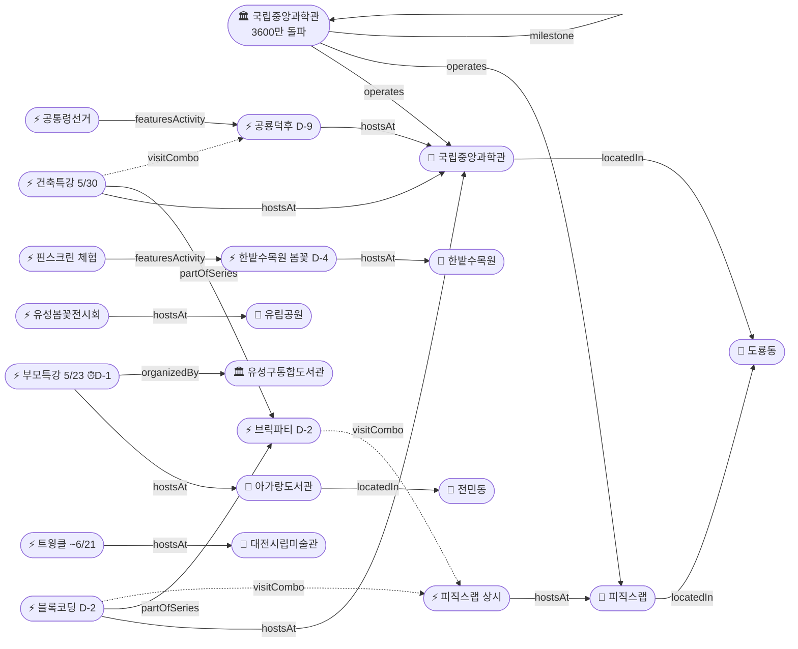

# 2026-05-21 유성구 어린이·가족 이벤트 일일 보고서

## 요약

**아가랑도서관 부모특강 접수 마감이 D-1(내일 5/22)**로 오늘이 사실상 마지막 신청 기회다 — 잔여 19명(어제 기준)으로 여유는 있으나 내일까지만 접수 가능하다. **국립중앙과학관이 5/17 누적 관람객 3600만명을 돌파**하여 이전 개관 35년만의 이정표를 달성했다 — 전년 대비 33.5% 증가이며, 공룡덕후박람회·피직스랩 등 체험형 콘텐츠가 핵심 요인으로 꼽혔다. **한밭수목원 봄꽃전시회가 D-4(5/25 종료)**로 이번 주말이 마지막 관람 기회이며, **사이언스 브릭파티가 D-2(모레 5/23 개막)**로 도룡동 과학체험 본격 시작을 앞두고 있다.

---

## 용성로20 주변 (도보권 0.5km 내)

금일 도보권(ring-walk, 0.5km) 내 신규 이벤트 없음.

---

## 오늘의 추천 (가족 동반 Top 5)

| # | 이벤트 | 장소 | 대상 | 비용 | 비고 |
|---|--------|------|------|------|------|
| 1 | **아이들은 놀기 위해 세상에 온다** (부모특강) | 아가랑도서관(전민동) | 영유아·유아 부모 | 무료 | **접수 마감 D-1** (내일 5/22), 잔여 19명 |
| 2 | **한밭수목원 봄꽃전시회** | 한밭수목원(둔산동) | 전연령 | 무료 | **D-4 마지막 주** (5/25 종료, 이번 주말 마지막) |
| 3 | **사이언스 브릭파티** | 국립중앙과학관(도룡동) | 유아·초등·가족 | 미확인 | **D-2** (모레 5/23 개막) |
| 4 | **피직스랩 상시 체험** | 국립중앙과학관 과학기술관 1층 | 초등·가족 | 무료(입장권별도) | 33종 물리 실험 |
| 5 | **열한번째 트윙클** (어린이미술기획전) | 대전시립미술관 | 유아·초등 | 미확인 | ~6/21, 미끄럼틀·섬유체험 |

---

## 주요 뉴스

### 1. 국립중앙과학관 누적 관람객 3600만명 돌파
- **출처:** [머니투데이](https://www.mt.co.kr/tech/2026/05/19/2026051909161071067) | [뉴스웍스](https://www.newsworks.co.kr/news/articleView.html?idxno=841171) | [ZDNet](https://zdnet.co.kr/view/?no=20260519110839) | [TJB](https://www.tjb.co.kr/news06/category/view/id/98404) 외 3건
- **일시:** 2026-05-17 달성, 5/19 보도
- **내용:** 1990년 대전 대덕연구단지 이전·개관 이후 35년만에 누적 관람객 3600만명을 돌파했다. 3500만→3600만 달성까지 약 9개월 소요, 전년 동기 대비 33.5% 증가했다. 3600만번째 관람객은 원주에서 온 태장초등학교 2학년 김모군으로, 가족 단위 방문이 확인되었다.
- **관람객 증가 요인:** 공룡덕후박람회, 멍냥이 학술대회, 사이언스데이 등 주제형 행사와 피직스랩 등 체험형 콘텐츠가 핵심으로 꼽혔다.
- **상태:** 신규
- **관련 엔티티:** 국립중앙과학관, 피직스랩, 공룡덕후박람회
- **유성구 가족 방문 시사점:** 도룡동 과학관 권역이 연간 100만명 이상 방문하는 대전 대표 가족 나들이 명소임을 수치로 입증. 향후 브릭파티(D-2)·공룡덕후(D-9) 방문 시 주말 혼잡 예상.

---

## 신규 이벤트

금일 유성구 일대 어린이·가족 동반 신규 이벤트 없음. (국립중앙과학관 3600만 돌파는 이정표 뉴스이며 신규 이벤트가 아님)

---

## 신규 오픈 가게·팝업·프로모션

금일 유성구 일대 가게(Shop) 신규 오픈/프로모션/팝업 특이사항 **없음**.

---

## 공공기관 주최 행사 (행정복지센터·보건소·복지관·도서관·우체국·경찰서·소방서)

금일 공공기관 신규 행사 **없음**. 기존 프로그램 상시 운영 중:
- 119시민체험센터 소방안전체험 (화~토 상시)
- 유성구 도서관 세대별 독서문화 프로그램 (상시)
- 유성이의 튼튼스쿨 (하반기 8/19~ 예정)

---

## 마감 임박 (사전신청 D-3 이내)

### 아가랑도서관 부모특강 '아이들은 놀기 위해 세상에 온다'
- **출처:** [유성구통합도서관](https://lib.yuseong.go.kr/web/menu/10095/program/30010/lectureList.do)
- **일시:** 2026-05-23 (금) 10:00
- **장소:** 아가랑도서관 (전민동, ring-stroll ~900m)
- **정원:** 35명 → **16명 접수, 잔여 19명** (어제 기준)
- **접수 마감:** **2026-05-22 (D-1, 내일!)**
- **대상:** 영유아·유아 양육자
- **비용:** 무료
- **상태:** 접수중 → **최긴급** (오늘 중 신청 권고)

### 한밭수목원 봄꽃전시회 (관람 종료 임박)
- **출처:** [대전관광공사](https://daejeontour.co.kr/festival_djt/35) | [뉴스1](https://www.news1.kr/local/daejeon-chungnam/6161639)
- **종료일:** 2026-05-25 (일) — **D-4, 이번 주말이 마지막 관람 기회**
- **장소:** 한밭수목원 동원·서원 (둔산동)
- **비용:** 무료
- **볼거리:** 작약·장미·해당화 만개, 핀스크린 체험, 야간 조명
- **매체 보도:** 총 12개 매체

### 사이언스 브릭파티 (개막 임박)
- **출처:** [국립중앙과학관](https://www.science.go.kr/mps/1070/bbs/431/moveBbsNttList.do)
- **일시:** 2026-05-23 ~ 5/31 — **D-2, 모레 개막**
- **장소:** 국립중앙과학관 한국과학기술사관·세미나실 (도룡동, ring-car ~3.2km)
- **연계 프로그램:** 블록 코딩 클래스 (5/23~24), 건축특강 (5/30)
- **대상:** 유아·초등·가족

---

## 동심원별 묶음

### ring-stroll (1km 이내, 도보 15분)
| 이벤트 | 장소 | 일시 | 상태 |
|--------|------|------|------|
| 아이들은 놀기 위해 세상에 온다 | 아가랑도서관(전민동) | 5/23 | **마감 D-1**, 잔여 19명 |

### ring-car (5km 이내, 차량 10분)
| 이벤트 | 장소 | 일시 | 상태 |
|--------|------|------|------|
| 피직스랩 상시 체험 | 국립중앙과학관 과학기술관 1층 | 상시 | 운영중 (3600만 달성 시설) |
| 사이언스 브릭파티 | 국립중앙과학관 한국과학기술사관 | 5/23~31 | **D-2 개막** |
| 블록 코딩 클래스 | 국립중앙과학관 세미나실 | 5/23~24 | **D-2** |
| 건축 특강 '선넘는 높이' | 국립중앙과학관 내래홀 | 5/30 | D-9 |
| 공룡덕후박람회 (공통령선거 포함) | 국립중앙과학관 사이언스터널 | 5/30~31 | D-9 |
| 유성봄꽃전시회 | 유림공원(어은동) | ~5/31 | 진행중 |
| 천문대 운석전시+사진전 | 대전시민천문대(도룡동) | ~5/31 | 진행중 |
| 한밭수목원 봄꽃전시회 | 한밭수목원(둔산동) | ~5/25 | **D-4 마지막 주** |

---

## 동(洞)별 이벤트 묶음

### 도룡동 (1차 타겟)
- 피직스랩 상시 체험 (**3600만 달성 대표 시설**)
- 사이언스 브릭파티 (**D-2**, 5/23~31 개막)
- 블록 코딩 클래스 (**D-2**, 5/23~24)
- 건축 특별강연 (D-9, 5/30)
- 공룡덕후박람회 (D-9, 5/30~31)
- 천문대 운석전시·기상기후사진전 (~5/31)

### 전민동 (1차 타겟)
- 아가랑도서관 부모특강 (5/23, **접수 마감 D-1**, 잔여 19명)

### 어은동 (보조)
- 유성봄꽃전시회 (~5/31)

### 둔산동 (유성구 인접)
- 한밭수목원 봄꽃전시회 (~5/25, **D-4 마지막 주**)
- 열한번째 트윙클 (~6/21)

---

## 연령대별 묶음

| 연령대 | 이벤트 |
|--------|--------|
| 영유아·유아 (0~6세) | 부모특강 '아이들은 놀기 위해 세상에 온다' (5/23, **마감 D-1**, 잔여 19명) |
| 초등저학년 (7~9세) | 피직스랩, 블록코딩(5/23~24), 브릭파티(5/23~), 공룡덕후+공통령선거(5/30~31) |
| 초등고학년 (10~12세) | 피직스랩, 블록코딩(5/23~24), 건축특강(5/30), 공룡덕후(5/30~31), 숏폼클래스(6/4~, 마감 D-7) |
| 전연령가족 | 한밭수목원 봄꽃(**D-4**), 유성봄꽃(~5/31), 열한번째 트윙클(~6/21), 천문대 전시(~5/31), 피직스랩 |

---

## 시리즈/정기 프로그램 업데이트

| 시리즈 | 다음 회차 | 상태 |
|--------|----------|------|
| 국립중앙과학관 가정의 달 시리즈 | 브릭파티 5/23~31 → 공룡덕후 5/30~31 | **D-2** / D-9 |
| 유성구 도서관 세대별 독서문화 | 아가랑도서관 부모특강 5/23 | **마감 D-1**, 잔여 19명 |
| K-도서관 이용자교육 (연 4회) | 5월분 5/30 | D-9, 접수중 (5/15~5/29) |
| 탐이 꿈이의 비밀 실험실 | 상시 운영 (~6/30) | 진행중 |
| 진잠도서관 숏폼 클래스 | 6/4~25 | 접수 마감 D-7 (5/28) |

---

## 지식그래프 시각화

### 오늘의 주요 관계
- **신규:** 국립중앙과학관(ent-org-006) → 3600만 관람객 달성 (5/17) → 7+ 매체 교차확인
- **최긴급:** 부모특강(ent-evt-044) → 접수 마감 D-1 → 아가랑도서관(전민동), 잔여 19명
- **종료 임박:** 한밭수목원 봄꽃전시회(ent-evt-034) → D-4, 매체 12개
- **개막 임박:** 브릭파티(ent-evt-027) → D-2, 5/23 개막
- **추론 유지:** 건축특강 ↔ 공룡덕후(visitCombo, 5/30), 블록코딩 ↔ 피직스랩(visitCombo), 브릭파티 ↔ 피직스랩(visitCombo)

### 전체 지식그래프

---

## 온톨로지 변경

| 변경 유형 | 대상 | 근거 |
|----------|------|------|
| 속성 추가 | ent-org-006 국립중앙과학관 | 3600만 관람객 달성 (5/17), 전년비 +33.5%, 7+ 매체 |
| 속성 업데이트 | ent-evt-034 한밭수목원 | D-5→D-4, 마지막 주 |
| 속성 업데이트 | ent-evt-044 부모특강 | D-2→D-1 최긴급, 잔여 19명 |
| 속성 업데이트 | ent-evt-027 브릭파티 | D-3→D-2, 모레 개막 |

---

## 추론 결과

| 추론 | 규칙 | 신뢰도 | 근거 |
|------|------|--------|------|
| 건축특강 ↔ 공룡덕후 방문 콤보 | same_dong_combo | 0.85 | 5/30 동일일 동일장소 (유지) |
| 블록코딩 ↔ 피직스랩 방문 콤보 | same_dong_combo | 0.85 | 5/23~24 동일기관 (유지) |
| 브릭파티 ↔ 피직스랩 방문 콤보 | same_dong_combo | 0.85 | 5/23~ 동일기관 (유지) |
| 한밭수목원 D-4 긴급도 가산 | anchor_distance_priority | 0.90 | 마지막 주, 매체 12개, urgencyBoost +0.2 |
| 부모특강 D-1 최긴급 가산 | registration_deadline_urgency | 0.95 | 접수 마감 내일, urgencyBoost +0.3 |

---

## 분석 및 평가

**최긴급 — 부모특강 접수 마감 D-1:** 아가랑도서관 부모특강 접수 마감이 내일(5/22)이다. 어제 기준 35명 중 16명 접수(잔여 19명)로 정원 여유는 있지만, 도서관 프로그램 특성상 마감 직전 몰림이 있다. 관심 있는 영유아·유아 양육자는 **오늘 중 신청을 강력 권고**한다.

**3600만 돌파의 의미:** 국립중앙과학관의 3600만 관람객 달성은 도룡동 과학관 권역이 대전 최대 가족 나들이 명소임을 수치로 입증한다. 3600만번째 관람객이 초등 2학년이라는 점도 가족 방문 비중의 높음을 보여준다. 공룡덕후박람회·피직스랩이 관람객 증가 핵심 요인으로 꼽힌 만큼, D-2 브릭파티·D-9 공룡덕후 방문 시 주말 혼잡을 예상해야 한다.

**한밭수목원 마지막 주말:** D-4로 종료 4일 전이다. 금요일(5/23)·토요일(5/24)·일요일(5/25) 3일이 남았으며, 작약·장미·해당화 만개기다. 핀스크린 체험과 야간 조명(~21시)이 가능하다. 12개 매체 보도 달성으로 올 시즌 최다 주목 전시.

**모레(5/23) 4종 집중:** 브릭파티 개막(D-2) + 블록코딩 클래스 시작(D-2) + 부모특강(D-1 접수 후 5/23 참석) — 도룡동 종일 과학체험과 전민동 오전 부모 프로그램이 동시에 시작된다. 도룡동에서는 브릭파티+블록코딩+피직스랩 3종 종일 콤보가 가능하다.

---

## 추적 항목

| 항목 | 최초 보고 | 상태 | 최신 업데이트 |
|------|----------|------|-------------|
| 아가랑도서관 부모특강 | 2026-05-17 | **마감 D-1** (5/22) | 잔여 19명, 최긴급 |
| 한밭수목원 봄꽃전시회 | 2026-05-12 | **D-4 마지막 주** (5/25) | 매체 12개 유지 |
| 사이언스 브릭파티 | 2026-04-30 | **D-2** (5/23~31 개막) | 모레 개막 |
| 공룡덕후박람회 | 2026-04-30 | D-9 (5/30~31) | 3600만 돌파 보도에서 핵심 행사로 언급 |
| 유성봄꽃전시회 | 2026-05-08 | 진행중 (~5/31) | 변동 없음 |
| 열한번째 트윙클 | 2026-05-14 | 진행중 (~6/21) | 변동 없음 |
| 천문대 특별전시 | 2026-05-13 | 진행중 (~5/31) | 변동 없음 |
| 국립중앙과학관 3600만 | 2026-05-21 | **신규** | 5/17 달성, 7+ 매체 |

---

## 동향 요약

| 분류 | 상태 | 비고 |
|------|------|------|
| 어린이·가족 이벤트 | 신규 1건, 업데이트 3건 | 3600만 돌파(신규)·부모특강 D-1·한밭수목원 D-4·브릭파티 D-2 |
| 가게(Shop) | 금일 신규 없음 | — |
| 공공기관 행사 | 금일 신규 없음 | 기존 상시 운영 유지 |

---

## 출처 목록

1. [국립중앙과학관 누적 관람객 3600만명 돌파](https://www.mt.co.kr/tech/2026/05/19/2026051909161071067) - 머니투데이, 2026-05-19
2. [국립중앙과학관, 누적 관람객 3600만 돌파…이전 개관 35년만](https://www.newsworks.co.kr/news/articleView.html?idxno=841171) - 뉴스웍스, 2026-05-19
3. [국립중앙과학관, 과학기술문화 플랫폼 변모… 누적 관람객 3600만명 돌파](https://v.daum.net/v/20260519124417840) - 다음(서울경제), 2026-05-19
4. [국립중앙과학관, 개관 36년만에 누적 관람객 3,600만 명 돌파](https://zdnet.co.kr/view/?no=20260519110839) - ZDNet korea, 2026-05-19
5. [국립중앙과학관 누적 관람객 3천600만명 돌파](https://www.tjb.co.kr/news06/category/view/id/98404) - TJB대전방송, 2026-05-19
6. [연간 관람객 100만명 국립중앙과학관](https://v.daum.net/v/20260519174420924) - 다음(머니투데이), 2026-05-19
7. [2026 한밭수목원 봄꽃 전시회](https://daejeontour.co.kr/festival_djt/35) - 대전관광공사
8. [대전 한밭수목원, 25일까지 봄꽃 전시회](https://www.news1.kr/local/daejeon-chungnam/6161639) - 뉴스1
9. [유성구통합도서관 프로그램](https://lib.yuseong.go.kr/web/menu/10095/program/30010/lectureList.do) - 유성구통합도서관
10. [국립중앙과학관 행사안내](https://www.science.go.kr/mps/1070/bbs/431/moveBbsNttList.do) - 국립중앙과학관
11. [소방체험 및 교육신청](https://www.daejeon.go.kr/dj119/CmmContentsHtmlView.do?menuSeq=5092) - 대전소방본부
