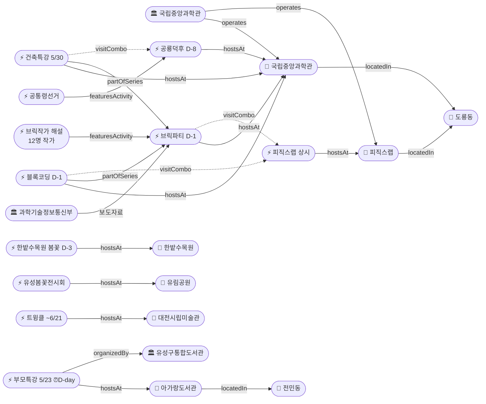

# 2026-05-22 유성구 어린이·가족 이벤트 일일 보고서

## 요약

**아가랑도서관 부모특강 접수 마감이 오늘(D-day)**이다 — 잔여 19명(어제 기준)으로 여유가 있지만 오늘이 마지막 신청 기회다. **사이언스 브릭파티가 D-1(내일 5/23 개막)**로, 과기정통부 보도자료를 통해 프로그램 상세가 최초 공개되었다 — 블록코딩·업사이클링 클래스 신규 도입, 12명 브릭 작가 해설 프로그램, 경복궁 경회루·거북선 가습기 등 전통과학 브릭작품 전시가 확인되었다. **한밭수목원 봄꽃전시회가 D-3(5/25 종료)**으로 이번 주말이 마지막 관람 기회이다. 내일(5/23)은 브릭파티 개막 + 블록코딩 시작 + 부모특강 참석의 3종 집중일이다.

---

## 용성로20 주변 (도보권 0.5km 내)

금일 도보권(ring-walk, 0.5km) 내 신규 이벤트 없음.

---

## 오늘의 추천 (가족 동반 Top 5)

| # | 이벤트 | 장소 | 대상 | 비용 | 비고 |
|---|--------|------|------|------|------|
| 1 | **아이들은 놀기 위해 세상에 온다** (부모특강) | 아가랑도서관(전민동) | 영유아·유아 부모 | 무료 | **접수 마감 D-day** (오늘!), 잔여 19명 |
| 2 | **사이언스 브릭파티** | 국립중앙과학관(도룡동) | 유아·초등·가족 | 미확인 | **D-1** (내일 개막), 3+ 매체 보도 |
| 3 | **한밭수목원 봄꽃전시회** | 한밭수목원(둔산동) | 전연령 | 무료 | **D-3 마지막 주말** (5/25 종료) |
| 4 | **피직스랩 상시 체험** | 국립중앙과학관 과학기술관 1층 | 초등·가족 | 무료(입장권별도) | 33종 물리 실험 |
| 5 | **열한번째 트윙클** (어린이미술기획전) | 대전시립미술관 | 유아·초등 | 미확인 | ~6/21, 미끄럼틀·섬유체험 |

---

## 주요 뉴스

### 1. 사이언스 브릭파티 D-1 — 과기정통부 보도자료로 프로그램 상세 최초 공개
- **출처:** [전자신문](https://www.etnews.com/20260521000123) | [정필](https://www.jeongpil.com/2537104) | [시사일보](http://www.koreasisailbo.com/2255066)
- **일시:** 2026-05-23 ~ 5/31 (내일 개막)
- **장소:** 국립중앙과학관 한국과학기술사관·세미나실 (도룡동, ring-car ~3.2km)
- **테마:** "Build Together! Build Science! Rebuild the Future!"
- **신규 프로그램:**
  - **블록 코딩 기반 과학원리 클래스** + **브릭 업사이클링 클래스** 신규 도입 — 체험 중심 프로그램 강화
  - **12명의 브릭 작가 해설 프로그램** — 작가가 직접 관람객에게 작품 속 과학 원리와 제작 과정을 소개
  - 경복궁 경회루, 한양도성전도, 거북선 가습기 등 **전통 과학기술을 브릭으로 재해석**한 작품 전시
- **연계 프로그램:** 블록 코딩 클래스 (5/23~24), 건축특강 '선넘는 높이' (5/30)
- **상태:** 신규 보도 (과기정통부 보도자료 기반, 3+ 매체 동시 보도)
- **관련 엔티티:** 국립중앙과학관, 과학기술정보통신부, 사이언스 브릭파티, 블록코딩 클래스

---

## 신규 이벤트

금일 신규 이벤트 없음. (브릭파티는 기존 추적 항목의 프로그램 상세 공개)

---

## 신규 오픈 가게·팝업·프로모션

금일 유성구 일대 가게(Shop) 신규 오픈/프로모션/팝업 특이사항 **없음**.

---

## 공공기관 주최 행사 (행정복지센터·보건소·복지관·도서관·우체국·경찰서·소방서)

금일 공공기관 신규 행사 **없음**. 기존 프로그램 상시 운영 중:
- 119시민체험센터 소방안전체험 (화~토 상시)
- 유성구 도서관 세대별 독서문화 프로그램 (상시)
- 유성이의 튼튼스쿨 (하반기 8/19~ 예정)

---

## 마감 임박 (사전신청 D-3 이내)

### 아가랑도서관 부모특강 '아이들은 놀기 위해 세상에 온다'
- **출처:** [유성구통합도서관](https://lib.yuseong.go.kr/web/menu/10095/program/30010/lectureList.do)
- **일시:** 2026-05-23 (금) 10:00
- **장소:** 아가랑도서관 (전민동, ring-stroll ~900m)
- **정원:** 35명 → **16명 접수, 잔여 19명** (어제 기준)
- **접수 마감:** **2026-05-22 (D-day, 오늘!)**
- **대상:** 영유아·유아 양육자
- **비용:** 무료
- **상태:** **최긴급** — 오늘이 마지막 신청 기회

### 한밭수목원 봄꽃전시회 (관람 종료 임박)
- **출처:** [대전관광공사](https://daejeontour.co.kr/festival_djt/35) | [뉴스1](https://www.news1.kr/local/daejeon-chungnam/6161639)
- **종료일:** 2026-05-25 (일) — **D-3, 이번 주말(토·일)이 마지막 관람 기회**
- **장소:** 한밭수목원 동원·서원 (둔산동)
- **비용:** 무료
- **볼거리:** 작약·장미·해당화 만개, 핀스크린 체험, 야간 조명 (~21시)
- **매체 보도:** 총 12+ 매체

### 사이언스 브릭파티 (개막 임박)
- **출처:** [전자신문](https://www.etnews.com/20260521000123) | [국립중앙과학관](https://www.science.go.kr/mps/1070/bbs/431/moveBbsNttList.do)
- **일시:** 2026-05-23 ~ 5/31 — **D-1, 내일 개막**
- **장소:** 국립중앙과학관 한국과학기술사관·세미나실 (도룡동, ring-car ~3.2km)
- **연계 프로그램:** 블록 코딩 클래스 (5/23~24), 건축특강 (5/30)
- **대상:** 유아·초등·가족

---

## 동심원별 묶음

### ring-stroll (1km 이내, 도보 15분)
| 이벤트 | 장소 | 일시 | 상태 |
|--------|------|------|------|
| 아이들은 놀기 위해 세상에 온다 | 아가랑도서관(전민동) | 5/23 | **마감 D-day**, 잔여 19명 |

### ring-car (5km 이내, 차량 10분)
| 이벤트 | 장소 | 일시 | 상태 |
|--------|------|------|------|
| 사이언스 브릭파티 | 국립중앙과학관 한국과학기술사관 | 5/23~31 | **D-1 내일 개막** |
| 블록 코딩 클래스 | 국립중앙과학관 세미나실 | 5/23~24 | **D-1** |
| 피직스랩 상시 체험 | 국립중앙과학관 과학기술관 1층 | 상시 | 운영중 |
| 건축 특강 '선넘는 높이' | 국립중앙과학관 내래홀 | 5/30 | D-8 |
| 공룡덕후박람회 (공통령선거 포함) | 국립중앙과학관 사이언스터널 | 5/30~31 | D-8 |
| 유성봄꽃전시회 | 유림공원(어은동) | ~5/31 | 진행중 |
| 천문대 운석전시+사진전 | 대전시민천문대(도룡동) | ~5/31 | 진행중 |
| 한밭수목원 봄꽃전시회 | 한밭수목원(둔산동) | ~5/25 | **D-3 마지막 주말** |

---

## 동(洞)별 이벤트 묶음

### 도룡동 (1차 타겟)
- 사이언스 브릭파티 (**D-1**, 내일 개막 + 프로그램 상세 공개)
- 블록 코딩 클래스 (**D-1**, 5/23~24)
- 피직스랩 상시 체험 (운영중)
- 건축 특별강연 (D-8, 5/30)
- 공룡덕후박람회 (D-8, 5/30~31)
- 천문대 운석전시·기상기후사진전 (~5/31)

### 전민동 (1차 타겟)
- 아가랑도서관 부모특강 (5/23, **접수 마감 D-day**, 잔여 19명)

### 어은동 (보조)
- 유성봄꽃전시회 (~5/31)

### 둔산동 (유성구 인접)
- 한밭수목원 봄꽃전시회 (~5/25, **D-3 마지막 주말**)
- 열한번째 트윙클 (~6/21)

---

## 연령대별 묶음

| 연령대 | 이벤트 |
|--------|--------|
| 영유아·유아 (0~6세) | 부모특강 '아이들은 놀기 위해 세상에 온다' (5/23, **마감 D-day**) |
| 초등저학년 (7~9세) | 피직스랩, 블록코딩(5/23~24), 브릭파티(5/23~), 공룡덕후+공통령선거(5/30~31) |
| 초등고학년 (10~12세) | 피직스랩, 블록코딩(5/23~24), 건축특강(5/30), 공룡덕후(5/30~31), 숏폼클래스(6/4~, 마감 D-6) |
| 전연령가족 | 한밭수목원 봄꽃(**D-3**), 유성봄꽃(~5/31), 열한번째 트윙클(~6/21), 천문대 전시(~5/31), 피직스랩, 브릭파티 |

---

## 시리즈/정기 프로그램 업데이트

| 시리즈 | 다음 회차 | 상태 |
|--------|----------|------|
| 국립중앙과학관 가정의 달 시리즈 | 브릭파티 5/23~31 → 공룡덕후 5/30~31 | **D-1** / D-8 |
| 유성구 도서관 세대별 독서문화 | 아가랑도서관 부모특강 5/23 | **마감 D-day** |
| K-도서관 이용자교육 (연 4회) | 5월분 5/30 진잠분관 | D-8, 접수중 2명 (5/13~5/27) |
| 탐이 꿈이의 비밀 실험실 | 상시 운영 (~6/30) | 진행중 |
| 진잠도서관 숏폼 클래스 | 6/4~25 | 접수 마감 D-6 (5/28) |

---

## 지식그래프 시각화

### 오늘의 주요 관계
- **신규:** 브릭작가 해설 프로그램(ent-act-026) → featuresActivity → 브릭파티(ent-evt-027) — 12명 작가 해설
- **최긴급:** 부모특강(ent-evt-044) → 접수 마감 D-day → 아가랑도서관(전민동), 잔여 19명
- **종료 임박:** 한밭수목원 봄꽃전시회(ent-evt-034) → D-3, 이번 주말 마지막
- **개막 임박:** 브릭파티(ent-evt-027) → D-1, 내일 개막 + 과기정통부 3+ 매체
- **추론 유지:** 건축특강 ↔ 공룡덕후(visitCombo, 5/30), 블록코딩 ↔ 피직스랩(visitCombo), 브릭파티 ↔ 피직스랩(visitCombo)

### 전체 지식그래프

---

## 온톨로지 변경

| 변경 유형 | 대상 | 근거 |
|----------|------|------|
| 새 엔티티 | Activity(ent-act-026 브릭작가 해설 프로그램) | 과기정통부 보도: 12명 브릭작가 해설 |
| 속성 업데이트 | ent-evt-027 브릭파티 | D-2→D-1, 테마·프로그램·전시 상세 추가, 3+ 매체 |
| 속성 업데이트 | ent-evt-044 부모특강 | D-1→D-day 마감 |
| 속성 업데이트 | ent-evt-034 한밭수목원 | D-4→D-3, 마지막 주말 |
| 속성 업데이트 | ent-evt-045 숏폼 클래스 | D-7→D-6 |

---

## 추론 결과

| 추론 | 규칙 | 신뢰도 | 근거 |
|------|------|--------|------|
| 브릭파티 ↔ 피직스랩 방문 콤보 | same_dong_combo | 0.90 | 내일(5/23) 개막 + 상시 = 도룡동 종일 콤보 확정 |
| 블록코딩 ↔ 피직스랩 방문 콤보 | same_dong_combo | 0.90 | 5/23~24 동일기관 연계 (유지) |
| 건축특강 ↔ 공룡덕후 방문 콤보 | same_dong_combo | 0.85 | 5/30 동일일 동일장소 (유지) |
| 부모특강 D-day 긴급도 최대 | registration_deadline_urgency | 0.98 | 접수 마감 당일, urgencyBoost +0.4 |
| 한밭수목원 D-3 종료 임박 | anchor_distance_priority | 0.92 | 마지막 주말, 12+ 매체, urgencyBoost +0.2 |

---

## 분석 및 평가

**최긴급 — 부모특강 접수 마감 D-day:** 아가랑도서관 부모특강 접수 마감이 오늘(5/22)이다. 어제 기준 35명 중 16명 접수(잔여 19명)로 정원 여유는 있지만, 오늘이 마지막 기회다. 관심 있는 영유아·유아 양육자는 **즉시 신청**해야 한다.

**브릭파티 D-1 프로그램 상세 공개:** 과기정통부 보도자료를 통해 내일 개막하는 브릭파티의 프로그램이 최초 공개되었다. 핵심 포인트는 (1) 블록코딩 기반 과학원리·업사이클링 클래스 **신규 도입** — 단순 전시를 넘어 체험 중심으로 전환, (2) 12명 브릭 작가의 현장 해설 — 과학 원리를 작가에게 직접 듣는 기회, (3) 전통 과학기술 브릭 재해석 — 경복궁 경회루·한양도성전도·거북선 가습기 등. 도룡동에서 브릭파티+블록코딩+피직스랩 3종 종일 콤보가 내일부터 가능하다.

**한밭수목원 마지막 주말:** D-3으로 토요일(5/24)·일요일(5/25) 2일만 남았다. 작약·장미·해당화 만개기이며, 핀스크린 체험과 야간 조명(~21시)이 가능하다. 이번 주말을 놓치면 올해는 관람 불가.

**내일(5/23) 3종 집중:** 브릭파티 개막(D-1) + 블록코딩 클래스 시작(D-1) + 부모특강 참석(D-day 신청 후) — 도룡동 종일 과학체험과 전민동 오전 부모 프로그램이 동시에 시작된다.

---

## 추적 항목

| 항목 | 최초 보고 | 상태 | 최신 업데이트 |
|------|----------|------|-------------|
| 아가랑도서관 부모특강 | 2026-05-17 | **마감 D-day** (오늘!) | 잔여 19명, 오늘 마감 |
| 사이언스 브릭파티 | 2026-04-30 | **D-1** (내일 5/23 개막) | 과기정통부 3+ 매체, 프로그램 상세 공개 |
| 한밭수목원 봄꽃전시회 | 2026-05-12 | **D-3 마지막 주말** (5/25) | 매체 12+ 유지 |
| 공룡덕후박람회 | 2026-04-30 | D-8 (5/30~31) | 변동 없음 |
| 유성봄꽃전시회 | 2026-05-08 | 진행중 (~5/31) | 변동 없음 |
| 열한번째 트윙클 | 2026-05-14 | 진행중 (~6/21) | 변동 없음 |
| 천문대 특별전시 | 2026-05-13 | 진행중 (~5/31) | 변동 없음 |
| 진잠도서관 숏폼 클래스 | 2026-05-17 | 접수 마감 D-6 (5/28) | 카운트다운 |

---

## 동향 요약

| 분류 | 상태 | 비고 |
|------|------|------|
| 어린이·가족 이벤트 | 신규 1건, 업데이트 3건 | 브릭파티 D-1 보도(신규)·부모특강 D-day·한밭수목원 D-3·숏폼 D-6 |
| 가게(Shop) | 금일 신규 없음 | — |
| 공공기관 행사 | 금일 신규 없음 | 기존 상시 운영 유지 |

---

## 출처 목록

1. [브릭으로 만나는 과학기술…국립중앙과학관 '사이언스 브릭파티' 개최](https://www.etnews.com/20260521000123) - 전자신문, 2026-05-21
2. [과기정통부 국립중앙과학관, '2026 사이언스 브릭파티' 개최](https://www.jeongpil.com/2537104) - 정필, 2026-05-21
3. [과기정통부 국립중앙과학관, '2026 사이언스 브릭파티' 개최](http://www.koreasisailbo.com/2255066) - 시사일보, 2026-05-21
4. [유성구통합도서관 프로그램](https://lib.yuseong.go.kr/web/menu/10095/program/30010/lectureList.do) - 유성구통합도서관
5. [2026 한밭수목원 봄꽃 전시회](https://daejeontour.co.kr/festival_djt/35) - 대전관광공사
6. [대전 한밭수목원, 25일까지 봄꽃 전시회](https://www.news1.kr/local/daejeon-chungnam/6161639) - 뉴스1
7. [국립중앙과학관 행사안내](https://www.science.go.kr/mps/1070/bbs/431/moveBbsNttList.do) - 국립중앙과학관
8. [세계 공룡의 날 공룡덕후박람회 참가안내](https://www.science.go.kr/mps/0/bbs/208/moveBbsNttDetail.do?nttSn=47305) - 국립중앙과학관
9. [소방체험 및 교육신청](https://www.daejeon.go.kr/dj119/CmmContentsHtmlView.do?menuSeq=5092) - 대전소방본부
10. [대전시민천문대 특별전시](https://www.sedaily.com/article/20042838) - 서울경제
11. [대전시립미술관 열한번째 트윙클](https://www.thesnstime.com/daejeonsiribmisulgwan-2026-eorinimisulgihoegjeon-yeolhanbeonjjae-teuwingkeulgaecoe/) - 더에스엔에스타임
