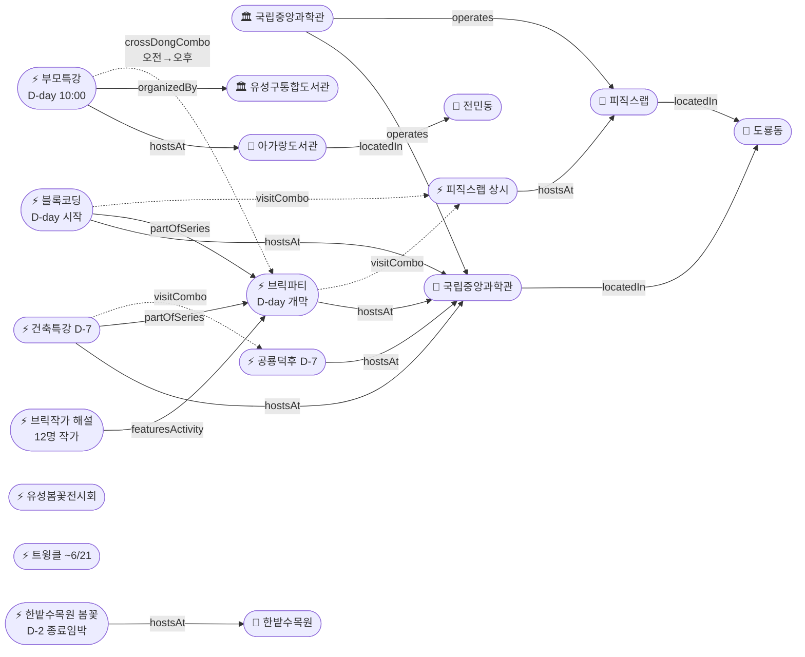

# 2026-05-23 유성구 어린이·가족 이벤트 일일 보고서

## 요약

**오늘은 3종 D-day 집중일이다.** (1) **사이언스 브릭파티가 오늘 개막**(5/23~31, 국립중앙과학관) — 블록코딩·업사이클링 클래스, 12명 브릭작가 해설, 전통과학 브릭작품 전시가 9일간 운영된다. (2) **블록 코딩 전통과학기술 클래스가 오늘 시작**(5/23~24, 2일간) — 브릭파티 연계 초등 대상 체험 프로그램. (3) **아가랑도서관 부모특강이 오늘 10:00 개최**(전민동) — 접수는 어제(5/22) 마감 완료. 오전 전민동(부모특강) → 오후 도룡동(브릭파티+블록코딩+피직스랩) 크로스동 종일 동선이 가능하다. **한밭수목원 봄꽃전시회는 D-2**(5/25 종료)로 내일·모레가 마지막 관람 기회다.

---

## 용성로20 주변 (도보권 0.5km 내)

금일 도보권(ring-walk, 0.5km) 내 신규 이벤트 없음.

---

## 오늘의 추천 (가족 동반 Top 5)

| # | 이벤트 | 장소 | 대상 | 비용 | 비고 |
|---|--------|------|------|------|------|
| 1 | **사이언스 브릭파티** | 국립중앙과학관(도룡동) | 유아·초등·가족 | 미확인 | **D-day 오늘 개막**, 9일간 |
| 2 | **블록 코딩 전통과학기술 클래스** | 국립중앙과학관 세미나실(도룡동) | 초등 | 미확인 | **D-day 오늘 시작**, 2일간(~24) |
| 3 | **아이들은 놀기 위해 세상에 온다** (부모특강) | 아가랑도서관(전민동) | 영유아·유아 부모 | 무료 | **D-day 오늘 10:00**, 접수 마감 |
| 4 | **한밭수목원 봄꽃전시회** | 한밭수목원(둔산동) | 전연령 | 무료 | **D-2 마지막 주말** (5/25 종료) |
| 5 | **피직스랩 상시 체험** | 국립중앙과학관 과학기술관 1층 | 초등·가족 | 무료(입장권별도) | 33종 물리 실험 — 브릭파티와 동일일 콤보 |

---

## 주요 뉴스

### 1. 사이언스 브릭파티 D-day — 오늘 개막
- **출처:** [국립중앙과학관](https://www.science.go.kr/mps/1070/bbs/431/moveBbsNttList.do) | [전자신문](https://www.etnews.com/20260521000123) | [정필](https://www.jeongpil.com/2537104) | [시사일보](http://www.koreasisailbo.com/2255066)
- **일시:** 2026-05-23 ~ 5/31 (오늘 개막, 9일간)
- **장소:** 국립중앙과학관 한국과학기술사관·세미나실 (도룡동, ring-car ~3.2km)
- **테마:** "Build Together! Build Science! Rebuild the Future!"
- **프로그램:**
  - 블록 코딩 기반 과학원리 클래스 + 브릭 업사이클링 클래스
  - 12명 브릭 작가 현장 해설 프로그램
  - 경복궁 경회루·한양도성전도·거북선 가습기 등 전통과학 브릭작품 전시
- **연계:** 블록 코딩 클래스 (5/23~24), 건축특강 '선넘는 높이' (5/30)
- **상태:** 업데이트 (← 2026-05-22 D-1에서 D-day 전환)
- **관련 엔티티:** 국립중앙과학관, 과학기술정보통신부, 브릭작가 해설 프로그램

### 2. 블록 코딩 클래스 D-day — 오늘 시작
- **출처:** [국립중앙과학관](https://www.science.go.kr/mps/1070/bbs/431/moveBbsNttList.do)
- **일시:** 2026-05-23 ~ 5/24 (오늘~내일, 2일간)
- **장소:** 국립중앙과학관 세미나실 (도룡동, ring-car ~3.2km)
- **대상:** 초등저학년·초등고학년
- **내용:** 브릭파티 연계 블록코딩 기반 전통과학기술 체험
- **상태:** 업데이트 (← D-1에서 D-day 전환)

### 3. 아가랑도서관 부모특강 D-day — 오늘 행사
- **출처:** [유성구통합도서관](https://lib.yuseong.go.kr/web/menu/10095/program/30010/lectureList.do)
- **일시:** 2026-05-23 (금) 10:00
- **장소:** 아가랑도서관 (전민동, ring-stroll ~900m)
- **정원:** 35명 (접수 마감 5/22 완료)
- **대상:** 영유아·유아 양육자
- **비용:** 무료
- **상태:** 업데이트 (← 접수 마감 D-day에서 행사 D-day 전환)

---

## 신규 이벤트

금일 신규 이벤트 없음. (3건 모두 기존 추적 항목의 D-day 상태 전환)

---

## 신규 오픈 가게·팝업·프로모션

금일 유성구 일대 가게(Shop) 신규 오픈/프로모션/팝업 특이사항 **없음**.

---

## 공공기관 주최 행사 (행정복지센터·보건소·복지관·도서관·우체국·경찰서·소방서)

금일 공공기관 신규 행사 **없음**. 기존 프로그램 상시 운영 중:
- 119시민체험센터 소방안전체험 (화~토 상시)
- 유성구 도서관 세대별 독서문화 프로그램 (상시)
- 유성이의 튼튼스쿨 (하반기 8/19~ 예정)

---

## 마감 임박 (사전신청 D-3 이내)

### 한밭수목원 봄꽃전시회 (관람 종료 임박)
- **출처:** [대전관광공사](https://daejeontour.co.kr/festival_djt/35) | [뉴스1](https://www.news1.kr/local/daejeon-chungnam/6161639)
- **종료일:** 2026-05-25 (일) — **D-2, 내일(토)·모레(일)가 마지막 관람 기회**
- **장소:** 한밭수목원 동원·서원 (둔산동)
- **비용:** 무료
- **볼거리:** 작약·장미·해당화 만개, 핀스크린 체험, 야간 조명 (~21시)
- **매체 보도:** 총 12+ 매체

---

## 동심원별 묶음

### ring-stroll (1km 이내, 도보 15분)
| 이벤트 | 장소 | 일시 | 상태 |
|--------|------|------|------|
| 아이들은 놀기 위해 세상에 온다 | 아가랑도서관(전민동) | 5/23 10:00 | **D-day 행사 당일** |

### ring-car (5km 이내, 차량 10분)
| 이벤트 | 장소 | 일시 | 상태 |
|--------|------|------|------|
| 사이언스 브릭파티 | 국립중앙과학관 한국과학기술사관 | 5/23~31 | **D-day 오늘 개막** |
| 블록 코딩 클래스 | 국립중앙과학관 세미나실 | 5/23~24 | **D-day 오늘 시작** |
| 피직스랩 상시 체험 | 국립중앙과학관 과학기술관 1층 | 상시 | 운영중 |
| 건축 특강 '선넘는 높이' | 국립중앙과학관 내래홀 | 5/30 | D-7 |
| 공룡덕후박람회 (공통령선거 포함) | 국립중앙과학관 사이언스터널 | 5/30~31 | D-7 |
| 유성봄꽃전시회 | 유림공원(어은동) | ~5/31 | 진행중 |
| 천문대 운석전시+사진전 | 대전시민천문대(도룡동) | ~5/31 | 진행중 |
| 한밭수목원 봄꽃전시회 | 한밭수목원(둔산동) | ~5/25 | **D-2 마지막 주말** |

---

## 동(洞)별 이벤트 묶음

### 도룡동 (1차 타겟) — 오늘의 핵심
- 사이언스 브릭파티 (**D-day**, 오늘 개막 ~5/31)
- 블록 코딩 클래스 (**D-day**, 오늘~내일 5/23~24)
- 피직스랩 상시 체험 (운영중)
- 건축 특별강연 (D-7, 5/30)
- 공룡덕후박람회 (D-7, 5/30~31)
- 천문대 운석전시·기상기후사진전 (~5/31)

### 전민동 (1차 타겟)
- 아가랑도서관 부모특강 (**D-day**, 오늘 10:00)

### 어은동 (보조)
- 유성봄꽃전시회 (~5/31)

### 둔산동 (유성구 인접)
- 한밭수목원 봄꽃전시회 (~5/25, **D-2 마지막 주말**)
- 열한번째 트윙클 (~6/21)

---

## 연령대별 묶음

| 연령대 | 이벤트 |
|--------|--------|
| 영유아·유아 (0~6세) | 부모특강 '아이들은 놀기 위해 세상에 온다' (**D-day**) |
| 초등저학년 (7~9세) | 피직스랩, 블록코딩(**D-day**), 브릭파티(**D-day**), 공룡덕후+공통령선거(D-7) |
| 초등고학년 (10~12세) | 피직스랩, 블록코딩(**D-day**), 건축특강(D-7), 공룡덕후(D-7), 숏폼클래스(6/4~, 접수 D-5) |
| 전연령가족 | 한밭수목원 봄꽃(**D-2**), 유성봄꽃(~5/31), 열한번째 트윙클(~6/21), 천문대 전시(~5/31), 피직스랩, 브릭파티(**D-day**) |

---

## 시리즈/정기 프로그램 업데이트

| 시리즈 | 다음 회차 | 상태 |
|--------|----------|------|
| 국립중앙과학관 가정의 달 시리즈 | 브릭파티 5/23~31 → 공룡덕후 5/30~31 | **D-day** / D-7 |
| 유성구 도서관 세대별 독서문화 | 부모특강 5/23 (오늘 행사) | **D-day** |
| K-도서관 이용자교육 (연 4회) | 5월분 5/30 진잠분관 | D-7 |
| 탐이 꿈이의 비밀 실험실 | 상시 운영 (~6/30) | 진행중 |
| 진잠도서관 숏폼 클래스 | 6/4~25 | 접수 마감 D-5 (5/28) |

---

## 지식그래프 시각화

### 오늘의 주요 관계
- **D-day 개막:** 브릭파티(ent-evt-027) → 오늘 개막, 도룡동 9일간 운영
- **D-day 시작:** 블록코딩(ent-evt-042) → 브릭파티 연계, 오늘~내일 2일
- **D-day 행사:** 부모특강(ent-evt-044) → 전민동 아가랑도서관, 오늘 10:00
- **종일 콤보:** 브릭파티 ↔ 피직스랩 ↔ 블록코딩 (도룡동 3종 동시 방문 가능)
- **크로스동 콤보:** 부모특강(전민동 오전) → 브릭파티(도룡동 오후) 동일일 동선
- **D-2 종료 임박:** 한밭수목원 봄꽃전시회(5/25 종료)
- **D-7 예고:** 건축특강 ↔ 공룡덕후 (5/30 도룡동 동일일)

### 전체 지식그래프

---

## 온톨로지 변경

| 변경 유형 | 대상 | 근거 |
|----------|------|------|
| 속성 업데이트 | ent-evt-027 브릭파티 | D-1→**D-day 개막**, 9일간 운영 시작 |
| 속성 업데이트 | ent-evt-042 블록코딩 | D-1→**D-day 시작**, 2일간(~24) |
| 속성 업데이트 | ent-evt-044 부모특강 | 접수마감→**D-day 행사 당일** |
| 카운트다운 | ent-evt-034 한밭수목원 | D-3→**D-2**, 내일·모레 마지막 |
| 카운트다운 | ent-evt-028 공룡덕후 | D-8→D-7 |
| 카운트다운 | ent-evt-043 건축특강 | D-8→D-7 |
| 카운트다운 | ent-evt-045 숏폼 클래스 | D-6→D-5 (접수 마감) |

---

## 추론 결과

| 추론 | 규칙 | 신뢰도 | 근거 |
|------|------|--------|------|
| 브릭파티 ↔ 피직스랩 종일 콤보 | same_dong_combo | 0.92 | D-day 개막 — 오늘부터 실제 동시 방문 가능 |
| 블록코딩 ↔ 피직스랩 연계 | same_dong_combo | 0.92 | D-day 시작 — 세미나실→과학기술관 이동 |
| 부모특강 → 브릭파티 크로스동 | same_date_cross_dong | 0.80 | 전민동(10:00) → 도룡동(오후) 동일일 동선 |
| 건축특강 ↔ 공룡덕후 | same_dong_combo | 0.85 | 5/30 동일일 동일장소 (유지) |
| 브릭파티 어린이 친화도 가산 | operator_kid_friendliness | 0.90 | 과학관 운영 프로그램 (유지) |

---

## 분석 및 평가

**3종 D-day 집중일:** 오늘은 브릭파티 개막(도룡동) + 블록코딩 시작(도룡동) + 부모특강 행사(전민동)가 동시에 열리는 집중일이다. 특히 **오전 전민동 → 오후 도룡동** 크로스동 동선이 가능하다: 부모특강(10:00, 아가랑도서관) 참석 후 차량 15분 이동하면 국립중앙과학관에서 브릭파티+블록코딩+피직스랩 3종을 즐길 수 있다.

**도룡동 과학체험 황금기:** 브릭파티 개막으로 도룡동 국립중앙과학관 권역에 동시 운영 프로그램이 3종(브릭파티·블록코딩·피직스랩)으로 늘었다. 이번 주말(5/24~25)이 브릭파티 첫 주말이자 블록코딩 마지막날(5/24)이므로, 내일(토)이 최적 방문일이다.

**한밭수목원 마지막 주말:** D-2로 내일(토)·모레(일) 2일만 남았다. 작약·장미·해당화 만개기이며, 핀스크린 체험과 야간 조명(~21시)이 가능하다. 이번 주말을 놓치면 올해는 관람 불가.

**다음 주 예고:** 공룡덕후박람회·건축특강(5/30, D-7)과 숏폼 클래스 접수 마감(5/28, D-5)이 다음 주 주요 일정이다.

---

## 추적 항목

| 항목 | 최초 보고 | 상태 | 최신 업데이트 |
|------|----------|------|-------------|
| 사이언스 브릭파티 | 2026-04-30 | **D-day 개막** (오늘 5/23~31) | 개막일 도달, 9일간 운영 시작 |
| 블록 코딩 클래스 | 2026-05-17 | **D-day 시작** (오늘~24) | 2일간 체험 시작 |
| 아가랑도서관 부모특강 | 2026-05-17 | **D-day 행사** (오늘 10:00) | 접수 마감 완료, 오늘 행사 |
| 한밭수목원 봄꽃전시회 | 2026-05-12 | **D-2 마지막 주말** (5/25) | 내일·모레 마지막 |
| 공룡덕후박람회 | 2026-04-30 | D-7 (5/30~31) | 변동 없음 |
| 건축특강 '선넘는 높이' | 2026-05-17 | D-7 (5/30) | 변동 없음 |
| 유성봄꽃전시회 | 2026-05-08 | 진행중 (~5/31) | 변동 없음 |
| 열한번째 트윙클 | 2026-05-14 | 진행중 (~6/21) | 변동 없음 |
| 천문대 특별전시 | 2026-05-13 | 진행중 (~5/31) | 변동 없음 |
| 진잠도서관 숏폼 클래스 | 2026-05-17 | 접수 마감 D-5 (5/28) | 카운트다운 |

---

## 동향 요약

| 분류 | 상태 | 비고 |
|------|------|------|
| 어린이·가족 이벤트 | 업데이트 3건 | 브릭파티·블록코딩·부모특강 3종 D-day |
| 가게(Shop) | 금일 신규 없음 | — |
| 공공기관 행사 | 금일 신규 없음 | 기존 상시 운영 유지 |

---

## 출처 목록

1. [국립중앙과학관 행사안내](https://www.science.go.kr/mps/1070/bbs/431/moveBbsNttList.do) - 국립중앙과학관
2. [브릭으로 만나는 과학기술…국립중앙과학관 '사이언스 브릭파티' 개최](https://www.etnews.com/20260521000123) - 전자신문, 2026-05-21
3. [과기정통부 국립중앙과학관, '2026 사이언스 브릭파티' 개최](https://www.jeongpil.com/2537104) - 정필, 2026-05-21
4. [과기정통부 국립중앙과학관, '2026 사이언스 브릭파티' 개최](http://www.koreasisailbo.com/2255066) - 시사일보, 2026-05-21
5. [유성구통합도서관 프로그램](https://lib.yuseong.go.kr/web/menu/10095/program/30010/lectureList.do) - 유성구통합도서관
6. [2026 한밭수목원 봄꽃 전시회](https://daejeontour.co.kr/festival_djt/35) - 대전관광공사
7. [대전 한밭수목원, 25일까지 봄꽃 전시회](https://www.news1.kr/local/daejeon-chungnam/6161639) - 뉴스1
8. [세계 공룡의 날 공룡덕후박람회 참가안내](https://www.science.go.kr/mps/0/bbs/208/moveBbsNttDetail.do?nttSn=47305) - 국립중앙과학관
9. [대전시민천문대 특별전시](https://www.sedaily.com/article/20042838) - 서울경제
10. [대전시립미술관 열한번째 트윙클](https://www.thesnstime.com/daejeonsiribmisulgwan-2026-eorinimisulgihoegjeon-yeolhanbeonjjae-teuwingkeulgaecoe/) - 더에스엔에스타임
11. [소방체험 및 교육신청](https://www.daejeon.go.kr/dj119/CmmContentsHtmlView.do?menuSeq=5092) - 대전소방본부
12. [피직스랩 개관](https://www.news1.kr/local/daejeon-chungnam/6047996) - 뉴스1
