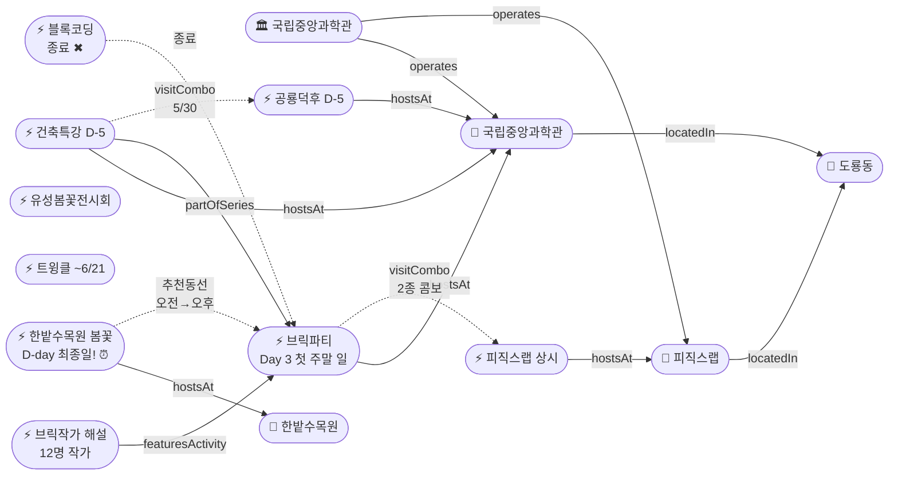

# 2026-05-25 유성구 어린이·가족 이벤트 일일 보고서

## 요약

**일요일, 한밭수목원 마지막 날.** (1) **한밭수목원 봄꽃전시회가 D-day** — 오늘(5/25 일)이 최종일이다. 50여 종 8만여 본의 작약·장미·해당화 만개를 볼 수 있는 마지막 기회. 야간 조명(~21시)까지 종일 관람 가능. (2) **사이언스 브릭파티 Day 3 첫 주말 일요일** — 어제 블록코딩 클래스가 종료되어 브릭파티+피직스랩 2종 콤보만 남았다. 12명 브릭작가 해설·업사이클링 클래스는 계속. (3) **접수 마감 D-3** — 숏폼 클래스(5/28)·독서아카데미(5/28) 접수 마감이 수요일로 다가왔다. **추천 동선:** 오전 한밭수목원(마지막!) → 오후 도룡동 과학관(브릭파티+피직스랩).

---

## 용성로20 주변 (도보권 0.5km 내)

금일 도보권(ring-walk, 0.5km) 내 신규 이벤트 없음.

---

## 오늘의 추천 (가족 동반 Top 5)

| # | 이벤트 | 장소 | 대상 | 비용 | 비고 |
|---|--------|------|------|------|------|
| 1 | **한밭수목원 봄꽃전시회** | 한밭수목원(둔산동) | 전연령 | 무료 | **D-day 최종일!** 오늘 종료 |
| 2 | **사이언스 브릭파티** | 국립중앙과학관(도룡동) | 유아·초등·가족 | 미확인 | Day 3 첫 주말 (~5/31) |
| 3 | **피직스랩 상시 체험** | 국립중앙과학관 과학기술관 1층 | 초등·가족 | 무료(입장권별도) | 33종 물리 실험 — 브릭파티 콤보 |
| 4 | **유성봄꽃전시회** | 유림공원(어은동) | 전연령 | 무료 | 진행중 (~5/31) |
| 5 | **열한번째 트윙클** | 대전시립미술관(둔산동) | 유아·초등·가족 | 미확인 | 체험형 미술전시 (~6/21) |

---

## 주요 뉴스

### 1. 한밭수목원 봄꽃전시회 D-day — 오늘 최종일
- **출처:** [대전관광공사](https://daejeontour.co.kr/festival_djt/35) | [뉴스1](https://www.news1.kr/local/daejeon-chungnam/6161639) | [헤럴드경제](https://biz.heraldcorp.com/article/10733502) | [더에스엔에스타임](https://www.thesnstime.com/daejeonsi-5weole-ggocmajung-oseyo-hanbatsumogweon-2026-bomggoc-jeonsihoe-gaecoe/)
- **일시:** ~2026-05-25 (일) **최종일 — 오늘로 종료**
- **장소:** 한밭수목원 동원·서원 일원 (둔산동, ring-car ~6km)
- **비용:** 무료 | **운영:** 05:00~21:00 (야간 조명 포함)
- **볼거리:** 50여 종 8만여 본 — 작약·장미·해당화 만개, 핀스크린 체험, 스탬프 투어, 꽃다리(어은교), 꽃폭포·꽃탑 조형물
- **매체 보도:** 총 12+ 매체
- **상태:** 업데이트 (← D-1에서 **D-day 최종일** 전환)
- **관련 엔티티:** 한밭수목원, 대전광역시

### 2. 사이언스 브릭파티 Day 3 — 첫 주말 일요일
- **출처:** [국립중앙과학관](https://www.science.go.kr/mps/1070/bbs/431/moveBbsNttList.do) | [전자신문](https://www.etnews.com/20260521000123) | [정필](https://www.jeongpil.com/2537104)
- **일시:** 2026-05-23 ~ 5/31 (Day 3, 첫 주말 일요일)
- **장소:** 국립중앙과학관 한국과학기술사관·세미나실 (도룡동, ring-car ~3.2km)
- **테마:** "Build Together! Build Science! Rebuild the Future!"
- **프로그램:** 12명 브릭작가 해설, 업사이클링 클래스, 전통과학 브릭작품 전시
- **변경사항:** 블록코딩 클래스 종료(5/24)로 3종→2종 콤보(브릭파티+피직스랩)
- **상태:** 업데이트 (← Day 2에서 **Day 3 첫 주말 일요일** 전환)
- **관련 엔티티:** 국립중앙과학관, 과학기술정보통신부

### 3. 블록 코딩 클래스 — 종료
- **출처:** [국립중앙과학관](https://www.science.go.kr/mps/1070/bbs/431/moveBbsNttList.do)
- **일시:** 2026-05-23~24 (어제 종료)
- **장소:** 국립중앙과학관 세미나실 (도룡동, ring-car ~3.2km)
- **대상:** 초등저학년·초등고학년
- **상태:** 업데이트 (← 마지막날에서 **종료** 전환)

---

## 신규 이벤트

금일 신규 이벤트 없음. (3건 모두 기존 추적 항목의 상태 전환)

---

## 신규 오픈 가게·팝업·프로모션

금일 신규 발견 없음. **활성 윈도우 내 가게 2건** (50일 윈도우 기준 의무 노출):

| 가게 | 유형 | 동 | 거리 | 오픈일 | 윈도우 만료 | 프로모션 | 어린이 친화 | 출처 |
|------|------|----|------|--------|-------------|---------|------------|------|
| **무브먼트랩 팝업 IN 대전** | 팝업스토어 | 관평동 | ~2.5km (ring-bike) | 2026-04-03 | 2026-05-31 (팝업 종료일) | 팝업스토어 운영 (~5/31) | ✅ | [데이포유](https://www.dayforyou.com/getScheduleList?keyword=무브먼트랩) |
| **헌터 팝업 IN 대전** | 팝업스토어 | 관평동 | ~2.5km (ring-bike) | 2026-04-03 | 2026-05-31 (팝업 종료일) | 팝업스토어 운영 (~5/31) | ❌ (성인 브랜드) | [데이포유](https://www.dayforyou.com/getScheduleList?keyword=헌터) |

> 두 팝업 모두 현대프리미엄아울렛 대전점 2층에 위치. 무브먼트랩은 키즈 동반 방문 가능, 헌터는 프리미엄 부츠·아웃도어 성인 브랜드. 팝업 종료일(5/31) 기준 잔여 **6일**.

### 사용자 제보 처리 현황

| 제보 가게 | 등록일 | 상태 | 결과 |
|----------|--------|------|------|
| 엉클부대찌개 테크노점 (관평동) | 2026-05-24 | `resolved_not_new` | 가게 존재 확인 — 오픈 시점 2025-10~11월 추정(50일 윈도우 이전). 활성 등록 미해당. |
| 인터뷰커피라운지 (도룡동) | 2026-05-24 | `resolved_not_new` | 가게 존재 확인 — 오픈 시점 2024-07월 추정(2년 운영). 심야 영업으로 어린이 친화도 낮음. 활성 등록 미해당. |
| 유성닭발 관평점 (관평동) | 2026-05-24 | `excluded` | scope.exclude 적용 — Naver '술집' 카테고리, 주류 전문(맥주·매운닭발 안주). 4년 이상 운영. |

---

## 공공기관 주최 행사 (행정복지센터·보건소·복지관·도서관·우체국·경찰서·소방서)

금일 공공기관 신규 행사 **없음**. 기존 프로그램 운영 현황:
- 119시민체험센터 소방안전체험 — **일요일 휴무** (화~토 09:30~11:30 / 13:30~15:30)
- 유성구 도서관 세대별 독서문화 프로그램 (상시)
- 유성이의 튼튼스쿨 (하반기 8/19~ 예정)

---

## 마감 임박 (사전신청 D-3 이내)

### 한밭수목원 봄꽃전시회 — D-day 오늘 종료!
- **출처:** [대전관광공사](https://daejeontour.co.kr/festival_djt/35) | [뉴스1](https://www.news1.kr/local/daejeon-chungnam/6161639)
- **종료일:** 2026-05-25 (일) — **D-day, 오늘 최종일**
- **장소:** 한밭수목원 동원·서원 (둔산동)
- **비용:** 무료 | **운영:** 05:00~21:00
- **볼거리:** 작약·장미·해당화 만개, 핀스크린 체험, 야간 조명, 스탬프 투어
- **긴급:** 오늘 종료 — 마지막 관람 기회

### 숏폼 클래스 접수 — D-3
- **출처:** [유성구통합도서관](https://lib.yuseong.go.kr/web/menu/10095/program/30010/lectureList.do)
- **접수 마감:** 2026-05-28 (수) — D-3
- **대상:** 초등고학년 | **정원:** 10명
- **기간:** 6/4~25, 진잠도서관 K-도서관

### 미래산업 독서아카데미 접수 — D-3
- **출처:** [유성구통합도서관](https://lib.yuseong.go.kr/web/menu/10095/program/30010/lectureList.do)
- **접수 마감:** 2026-05-28 (수) — D-3
- **접수현황:** 41/50명 (잔여 9명, 5/24 기준)

---

## 동심원별 묶음

### ring-stroll (1km 이내, 도보 15분)
금일 도보권 이벤트 없음.

### ring-car (5km 이내, 차량 10분)
| 이벤트 | 장소 | 일시 | 상태 |
|--------|------|------|------|
| 사이언스 브릭파티 | 국립중앙과학관 한국과학기술사관 | 5/23~31 | **Day 3 첫 주말 일요일** |
| 피직스랩 상시 체험 | 국립중앙과학관 과학기술관 1층 | 상시 | 운영중 |
| 건축 특강 '선넘는 높이' | 국립중앙과학관 내래홀 | 5/30 | D-5 |
| 공룡덕후박람회 (공통령선거 포함) | 국립중앙과학관 사이언스터널 | 5/30~31 | D-5 |
| 유성봄꽃전시회 | 유림공원(어은동) | ~5/31 | 진행중 |
| 천문대 운석전시+사진전 | 대전시민천문대(도룡동) | ~5/31 | 진행중 |
| 한밭수목원 봄꽃전시회 | 한밭수목원(둔산동) | ~5/25 | **D-day 최종일!** |

---

## 동(洞)별 이벤트 묶음

### 도룡동 (1차 타겟) — 브릭파티+피직스랩 2종 콤보
- 사이언스 브릭파티 (Day 3 첫 주말 일요일, ~5/31)
- 피직스랩 상시 체험 (운영중)
- 건축 특별강연 (D-5, 5/30)
- 공룡덕후박람회 (D-5, 5/30~31)
- 천문대 운석전시·기상기후사진전 (~5/31)

### 어은동 (보조)
- 유성봄꽃전시회 (~5/31)

### 둔산동 (유성구 인접)
- 한밭수목원 봄꽃전시회 (~5/25, **D-day 최종일!**)
- 열한번째 트윙클 (~6/21)

---

## 연령대별 묶음

| 연령대 | 이벤트 |
|--------|--------|
| 영유아·유아 (0~6세) | 한밭수목원 봄꽃(**D-day!**), 브릭파티(Day 3) |
| 초등저학년 (7~9세) | 브릭파티(Day 3), 피직스랩, 공룡덕후(D-5) |
| 초등고학년 (10~12세) | 피직스랩, 건축특강(D-5), 공룡덕후(D-5), 숏폼클래스(접수 D-3) |
| 전연령가족 | 한밭수목원 봄꽃(**D-day!**), 유성봄꽃(~5/31), 열한번째 트윙클(~6/21), 천문대 전시(~5/31), 브릭파티(Day 3), 피직스랩 |

---

## 시리즈/정기 프로그램 업데이트

| 시리즈 | 다음 회차 | 상태 |
|--------|----------|------|
| 국립중앙과학관 가정의 달 시리즈 | 브릭파티 ~5/31 → 공룡덕후 5/30~31 | Day 3 / D-5 |
| 유성구 도서관 세대별 독서문화 | 부모특강 5/23 종료 | 완료 |
| K-도서관 이용자교육 (연 4회) | 5월분 5/30 진잠분관 | D-5 |
| 미래산업 진로탐색 독서아카데미 | 접수 마감 5/28 (41/50명, 잔여 9명) | D-3 |
| 탐이 꿈이의 비밀 실험실 | 상시 운영 (~6/30) | 진행중 |
| 진잠도서관 숏폼 클래스 | 6/4~25, 접수 마감 5/28 | 접수 D-3 |

---

## 지식그래프 시각화

### 오늘의 주요 관계
- **D-day 종료:** 한밭수목원 봄꽃전시회 → 오늘(5/25) 최종일, 마지막 관람 기회
- **콤보 축소:** 3종(브릭+코딩+피직스) → 2종(브릭+피직스) — 블록코딩 5/24 종료
- **추천 종일 동선:** 한밭수목원(오전, D-day) → 도룡동 과학관(오후, 2종 콤보)
- **D-5 예고:** 건축특강 ↔ 공룡덕후 (5/30 도룡동 동일일)
- **접수 D-3:** 숏폼 클래스·독서아카데미 수요일 마감

### 전체 지식그래프

---

## 온톨로지 변경

| 변경 유형 | 대상 | 근거 |
|----------|------|------|
| 속성 업데이트 | ent-evt-034 한밭수목원 | D-1→**D-day 최종일** (오늘 종료) |
| 속성 업데이트 | ent-evt-027 브릭파티 | Day 2→**Day 3 첫 주말 일요일** |
| 종료 전환 | ent-evt-042 블록코딩 | 마지막날→**종료** (5/24 완료) |
| 카운트다운 | ent-evt-028 공룡덕후 | D-6→D-5 |
| 카운트다운 | ent-evt-043 건축특강 | D-6→D-5 |
| 카운트다운 | ent-evt-045 숏폼 클래스 | D-4→D-3 (접수 마감) |
| 카운트다운 | ent-evt-008 독서아카데미 | D-4→D-3 (접수 마감, 41/50명) |

---

## 추론 결과

| 추론 | 규칙 | 신뢰도 | 근거 |
|------|------|--------|------|
| 브릭파티 ↔ 피직스랩 2종 콤보 | same_dong_combo | 0.95 | 블록코딩 종료로 3종→2종 축소, 일요일 주말 가산 |
| 건축특강 ↔ 공룡덕후 | same_dong_combo | 0.85 | 5/30 동일일 동일장소 유지 |
| 브릭파티 어린이 친화도 가산 | operator_kid_friendliness | 0.90 | 과학관 운영 프로그램 유지 |
| 한밭수목원 최종일 긴급도 | deadline_urgency | 1.0 | D-day — 오늘 놓치면 종료 |

---

## 분석 및 평가

**한밭수목원 D-day 최종일:** 오늘(일요일)이 마지막 관람일이다. 작약·장미·해당화가 만개기이며, 05:00~21:00까지 야간 조명 포함 종일 관람 가능. 어제(토) 대비 일요일 혼잡도는 비슷할 것으로 예상되므로 오전 일찍 방문 추천.

**도룡동 콤보 변경:** 어제 블록코딩 종료로 3종 콤보가 2종(브릭파티+피직스랩)으로 축소되었다. 브릭작가 해설·업사이클링은 계속되므로 과학관 방문 가치는 유지. **추천: 오전 한밭수목원(마지막) → 오후 도룡동 과학관(2종 콤보).**

**다음 주 빅 이벤트:** 공룡덕후박람회+건축특강(5/30, D-5)이 다음 주 토요일. 무료, 사전예약 불필요. 공통령 선거·공룡 뮤지컬·올림피아드·이융남 교수 강연 등 풍성한 프로그램. 숏폼 클래스·독서아카데미 접수 마감(5/28, D-3)이 수요일이므로 관심 있다면 내일~모레 중 신청 필요.

---

## 추적 항목

| 항목 | 최초 보고 | 상태 | 최신 업데이트 |
|------|----------|------|-------------|
| 한밭수목원 봄꽃전시회 | 2026-05-12 | **D-day 최종일** (5/25) | 오늘 종료, 마지막 관람 기회 |
| 사이언스 브릭파티 | 2026-04-30 | **Day 3 첫 주말 일요일** (5/23~31) | 블록코딩 종료로 2종 콤보 |
| 블록 코딩 클래스 | 2026-05-17 | **종료** (5/24 완료) | 어제 종료 확정 |
| 공룡덕후박람회 | 2026-04-30 | D-5 (5/30~31) | 다음 주 토요일 |
| 건축특강 '선넘는 높이' | 2026-05-17 | D-5 (5/30) | 다음 주 토요일 |
| 유성봄꽃전시회 | 2026-05-08 | 진행중 (~5/31) | 변동 없음 |
| 열한번째 트윙클 | 2026-05-14 | 진행중 (~6/21) | 변동 없음 |
| 천문대 특별전시 | 2026-05-13 | 진행중 (~5/31) | 변동 없음 |
| 진잠도서관 숏폼 클래스 | 2026-05-17 | 접수 마감 D-3 (5/28) | 수요일 마감 |
| 미래산업 독서아카데미 | 2026-04-25 | 접수 41/50명 (D-3, 5/28) | 잔여 9명, 수요일 마감 |

---

## 동향 요약

| 분류 | 상태 | 비고 |
|------|------|------|
| 어린이·가족 이벤트 | 업데이트 3건 | 한밭수목원 D-day·브릭파티 Day 3·블록코딩 종료 |
| 가게(Shop) | 활성 2건 (무브먼트랩·헌터 팝업, ~5/31) | 금일 신규 발견 없음, 기존 팝업 의무 노출 |
| 공공기관 행사 | 금일 신규 없음 | 119시민체험센터 일요일 휴무 |

---

## 출처 목록

1. [2026 한밭수목원 봄꽃 전시회](https://daejeontour.co.kr/festival_djt/35) - 대전관광공사
2. [대전 한밭수목원, 25일까지 봄꽃 전시회](https://www.news1.kr/local/daejeon-chungnam/6161639) - 뉴스1
3. [대전 한밭수목원, '2026 봄꽃 전시회' 팡파르](https://biz.heraldcorp.com/article/10733502) - 헤럴드경제
4. [대전시 한밭수목원, '2026 봄꽃 전시회' 개최](https://www.thesnstime.com/daejeonsi-5weole-ggocmajung-oseyo-hanbatsumogweon-2026-bomggoc-jeonsihoe-gaecoe/) - 더에스엔에스타임
5. [국립중앙과학관 행사안내](https://www.science.go.kr/mps/1070/bbs/431/moveBbsNttList.do) - 국립중앙과학관
6. [브릭으로 만나는 과학기술…국립중앙과학관 '사이언스 브릭파티' 개최](https://www.etnews.com/20260521000123) - 전자신문, 2026-05-21
7. [과기정통부 국립중앙과학관, '2026 사이언스 브릭파티' 개최](https://www.jeongpil.com/2537104) - 정필, 2026-05-21
8. [세계 공룡의 날 공룡덕후박람회 참가안내](https://www.science.go.kr/mps/0/bbs/208/moveBbsNttDetail.do?nttSn=47305) - 국립중앙과학관
9. [국립중앙과학관 세계 공룡의 날맞아 '공룡덕후 박람회' 연다](https://www.kidshankook.kr/news/articleView.html?idxno=13845) - 소년한국일보
10. [대전시민천문대, '운석전시' 등 특별전시 연다](https://www.sedaily.com/article/20042838) - 서울경제
11. [대전시립미술관 열한번째 트윙클](https://www.thesnstime.com/daejeonsiribmisulgwan-2026-eorinimisulgihoegjeon-yeolhanbeonjjae-teuwingkeulgaecoe/) - 더에스엔에스타임
12. [소방체험 및 교육신청](https://www.daejeon.go.kr/dj119/CmmContentsHtmlView.do?menuSeq=5092) - 대전소방본부
13. [유성구통합도서관 프로그램](https://lib.yuseong.go.kr/web/menu/10095/program/30010/lectureList.do) - 유성구통합도서관
14. [데이포유 팝업스토어 일정](https://www.dayforyou.com/getScheduleList) - 데이포유 (무브먼트랩·헌터 팝업 출처)
