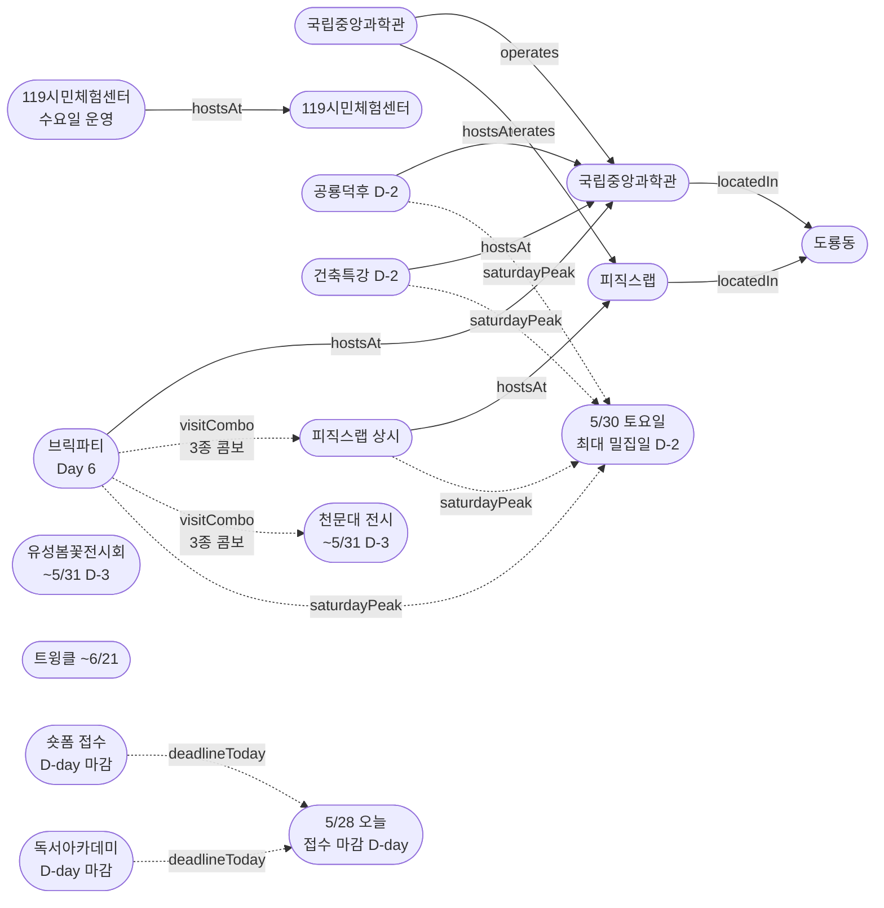

# 2026-05-28 유성구 어린이·가족 이벤트 일일 보고서

## 요약

**수요일, 접수 마감 D-day + 5/30 최대 밀집일 D-2.** (1) **접수 마감 D-day** — 숏폼 클래스(10명)·독서아카데미(잔여 9명) **오늘 동시 마감**. 마지막 신청 기회. (2) **5/30(토) 도룡동 최대 밀집일 D-2** — 공룡덕후박람회+건축특강+브릭파티+피직스랩 4종 동시 운영까지 **모레**. 가족 방문 계획 최종 수립일. (3) **브릭파티 Day 6** 세 번째 평일 수요일 — 5/30 주말 전 마지막 한산 관람 기회. (4) **K-도서관 이용자교육 접수 D-1** — 잔여 2명, 내일(5/29) 마감.

---

## 용성로20 주변 (도보권 0.5km 내)

금일 도보권(ring-walk, 0.5km) 내 신규 이벤트 없음.

---

## 오늘의 추천 (가족 동반 Top 5)

| # | 이벤트 | 장소 | 대상 | 비용 | 비고 |
|---|--------|------|------|------|------|
| 1 | **사이언스 브릭파티** | 국립중앙과학관(도룡동) | 유아·초등·가족 | 미확인 | Day 6 세 번째 평일 (~5/31) |
| 2 | **피직스랩 상시 체험** | 국립중앙과학관 과학기술관 1층 | 초등·가족 | 무료(입장권별도) | 33종 물리 실험 — 브릭파티 콤보 |
| 3 | **119시민체험센터 소방안전체험** | 119시민체험센터 | 유아·초등·가족 | 무료 | 수요일 운영 (화~토) |
| 4 | **유성봄꽃전시회** | 유림공원(어은동) | 전연령 | 무료 | 진행중 (~5/31, D-3) |
| 5 | **열한번째 트윙클** | 대전시립미술관(둔산동) | 유아·초등·가족 | 미확인 | 체험형 미술전시 (~6/21) |

---

## 주요 뉴스

### 1. 접수 마감 D-day — 숏폼 클래스·독서아카데미 오늘 마감
- **출처:** [유성구통합도서관](https://lib.yuseong.go.kr/web/menu/10095/program/30010/lectureList.do)
- **숏폼 클래스:** 접수 마감 **2026-05-28 (수) D-day** | 대상: 초등 4~6학년 | 정원: 10명 | 기간: 6/4~25, 진잠도서관
- **독서아카데미:** 접수 마감 **2026-05-28 (수) D-day** | 접수현황: 41/50명 (잔여 9명, 5/24 기준)
- **상태:** 업데이트 (← D-1 최긴급에서 **D-day 마감** 전환)
- **긴급:** 오늘이 마지막 접수일. **내일부터 접수 불가.**

### 2. 공룡덕후박람회 D-2 — 모레 토요일 개막
- **출처:** [국립중앙과학관](https://www.science.go.kr/mps/0/bbs/431/moveBbsNttDetail.do?nttSn=47354) | [한눈에 보기 YouTube](https://www.youtube.com/watch?v=9gP975mQS1Q) | [공통령 선거 안내](https://www.science.go.kr/mps/0/bbs/208/moveBbsNttDetail.do?nttSn=47381) | [YTN사이언스](https://www.youtube.com/watch?v=SvW-IGTxvs4)
- **일시:** 2026-05-30 ~ 5/31 (D-2)
- **장소:** 국립중앙과학관 사이언스터널·꿈이광장 (도룡동)
- **프로그램:** 공룡덕후 박람회·올림피아드·디노홀 초대전, 이융남 교수 강연, 제1대 공통령 선거
- **상태:** 업데이트 (← D-3에서 **D-2**. 공식 한눈에 보기 YouTube 영상 14번째 매체)
- **비고:** **5/30(토) = 도룡동 4종 동시 운영 최대 밀집일 D-2.** 가족 방문 계획 최종 수립일.

### 3. 사이언스 브릭파티 Day 6 — 세 번째 평일 수요일
- **출처:** [국립중앙과학관](https://www.science.go.kr/mps/1070/bbs/431/moveBbsNttList.do) | [전자신문](https://www.etnews.com/20260521000123)
- **일시:** 2026-05-23 ~ 5/31 (Day 6, 세 번째 평일 수요일)
- **장소:** 국립중앙과학관 한국과학기술사관·세미나실 (도룡동, ring-car ~3.2km)
- **프로그램:** 12명 브릭작가 해설, 업사이클링 클래스, 전통과학 브릭작품 전시
- **상태:** 업데이트 (← Day 5 두 번째 평일에서 **Day 6 세 번째 평일**)
- **비고:** 5/30 주말 전 마지막 한산 관람 기회. 피직스랩·천문대 전시와 3종 콤보 가능.

### 4. 건축특강 '선넘는 높이' D-2 — 모레 토요일
- **출처:** [국립중앙과학관](https://www.science.go.kr/mps/1070/bbs/431/moveBbsNttList.do)
- **일시:** 2026-05-30 (D-2)
- **장소:** 국립중앙과학관 내래홀 (도룡동)
- **상태:** 업데이트 (← D-3에서 **D-2**)
- **비고:** 사전접수 필요. 공룡덕후박람회와 동일일.

---

## 신규 이벤트

금일 신규 이벤트 없음. (5건 모두 기존 추적 항목의 상태 전환)

---

## 신규 오픈 가게·팝업·프로모션

금일 신규 발견 없음. **활성 윈도우 내 가게 2건** (50일 윈도우 기준 의무 노출):

| 가게 | 유형 | 동 | 거리 | 오픈일 | 윈도우 만료 | 프로모션 | 어린이 친화 | 출처 |
|------|------|----|------|--------|-------------|---------|------------|------|
| **무브먼트랩 팝업 IN 대전** | 팝업스토어 | 관평동 | ~2.5km (ring-bike) | 2026-04-03 | 2026-05-31 (팝업 종료일) | 팝업스토어 운영 (~5/31) | O | [데이포유](https://www.dayforyou.com/getScheduleList?keyword=무브먼트랩) |
| **헌터 팝업 IN 대전** | 팝업스토어 | 관평동 | ~2.5km (ring-bike) | 2026-04-03 | 2026-05-31 (팝업 종료일) | 팝업스토어 운영 (~5/31) | X (성인 브랜드) | [데이포유](https://www.dayforyou.com/getScheduleList?keyword=헌터) |

> 두 팝업 모두 현대프리미엄아울렛 대전점 2층에 위치. 팝업 종료일(5/31) 기준 잔여 **3일**.

### 사용자 제보 처리 현황

| 제보 가게 | 등록일 | 상태 | 결과 |
|----------|--------|------|------|
| 엉클부대찌개 테크노점 (관평동) | 2026-05-24 | `resolved_not_new` | 가게 존재 확인 — 오픈 시점 2025-10~11월 추정(50일 윈도우 이전). 활성 등록 미해당. |
| 인터뷰커피라운지 (도룡동) | 2026-05-24 | `resolved_not_new` | 가게 존재 확인 — 오픈 시점 2024-07월 추정(2년 운영). 심야 영업으로 어린이 친화도 낮음. 활성 등록 미해당. |
| 유성닭발 관평점 (관평동) | 2026-05-24 | `excluded` | scope.exclude 적용 — Naver '술집' 카테고리, 주류 전문. 4년 이상 운영. |

---

## 공공기관 주최 행사 (행정복지센터·보건소·복지관·도서관·우체국·경찰서·소방서)

### 119시민체험센터 — 수요일 운영중
- **운영:** 화~토 09:30~11:30 / 13:30~15:30 (일·월 휴무)
- **예약:** 체험 희망일 2일 전까지 인터넷 예약
- **프로그램:** 소화기·옥내소화전, 화재 대피·탈출, 심폐소생술, 지진 대피 체험

### 도서관 프로그램 접수
- **숏폼 클래스:** D-day 마감 (오늘 5/28 마감, 정원 10명)
- **독서아카데미:** D-day 마감 (오늘 5/28 마감, 잔여 9명)
- **K-도서관 이용자교육:** D-1 (내일 5/29 마감, 잔여 2명, 행사 5/30 토)

### 기존 운영
- 유성구 도서관 세대별 독서문화 프로그램 (상시)
- 유성이의 튼튼스쿨 (하반기 8/19~ 예정, 상반기 마감)

---

## 마감 임박 (사전신청 D-3 이내)

### 숏폼 클래스 접수 — D-day 마감
- **출처:** [유성구통합도서관](https://lib.yuseong.go.kr/web/menu/10095/program/30010/lectureList.do)
- **접수 마감:** 2026-05-28 (수) — **D-day 오늘 마감**
- **대상:** 초등 4~6학년 | **정원:** 10명
- **기간:** 6/4~25, 진잠도서관 K-도서관
- **긴급:** **오늘이 마지막 접수일**

### 미래산업 독서아카데미 접수 — D-day 마감
- **출처:** [유성구통합도서관](https://lib.yuseong.go.kr/web/menu/10095/program/30010/lectureList.do)
- **접수 마감:** 2026-05-28 (수) — **D-day 오늘 마감**
- **접수현황:** 41/50명 (잔여 9명, 5/24 기준)
- **긴급:** **오늘이 마지막 추가모집일**

### K-도서관 이용자교육 접수 — D-1
- **출처:** [유성구통합도서관](https://lib.yuseong.go.kr/web/menu/10095/program/30010/lectureList.do)
- **접수 마감:** 2026-05-29 (목) — D-1
- **접수현황:** 10/12명 (잔여 2명)
- **행사:** 5/30(토), 진잠도서관 K-도서관 | 대상: (초등생) 가족 및 개인 누구나

---

## 동심원별 묶음

### ring-stroll (1km 이내, 도보 15분)
금일 도보권 이벤트 없음.

### ring-car (5km 이내, 차량 10분)
| 이벤트 | 장소 | 일시 | 상태 |
|--------|------|------|------|
| 사이언스 브릭파티 | 국립중앙과학관 한국과학기술사관 | 5/23~31 | **Day 6 세 번째 평일** |
| 피직스랩 상시 체험 | 국립중앙과학관 과학기술관 1층 | 상시 | 운영중 |
| 건축 특강 '선넘는 높이' | 국립중앙과학관 내래홀 | 5/30 | **D-2** |
| 공룡덕후박람회 (공통령선거 포함) | 국립중앙과학관 사이언스터널 | 5/30~31 | **D-2** |
| 유성봄꽃전시회 | 유림공원(어은동) | ~5/31 | 진행중 (D-3) |
| 천문대 운석전시+사진전 | 대전시민천문대(도룡동) | ~5/31 | 진행중 (D-3) |
| 119시민체험센터 안전체험 | 119시민체험센터 | 화~토 상시 | 수요일 운영중 |

---

## 동(洞)별 이벤트 묶음

### 도룡동 (1차 타겟) — 5/30(토) 최대 밀집일 D-2

**이번 주(5/26~31)가 도룡동 가족 방문 최적 주간.** 5종 이벤트 동시 진행:
- 사이언스 브릭파티 (Day 6~마지막날, ~5/31)
- 피직스랩 상시 체험 (운영중)
- 건축 특별강연 (D-2, 5/30)
- 공룡덕후박람회 (D-2, 5/30~31)
- 천문대 운석전시·기상기후사진전 (~5/31)

> **5/30(토) = 공룡덕후+건축특강+브릭파티+피직스랩 4종 동시 운영.** 모레. 6월부터 브릭파티·천문대전시 종료로 축소. **이번 주 방문을 강력 권장.**

### 어은동 (보조)
- 유성봄꽃전시회 (~5/31, D-3)

### 둔산동 (유성구 인접)
- 열한번째 트윙클 (~6/21)

---

## 연령대별 묶음

| 연령대 | 이벤트 |
|--------|--------|
| 영유아·유아 (0~6세) | 브릭파티(Day 6), 트윙클(~6/21), 119시민체험센터 |
| 초등저학년 (7~9세) | 브릭파티(Day 6), 피직스랩, 공룡덕후(D-2), 119시민체험센터 |
| 초등고학년 (10~12세) | 피직스랩, 건축특강(D-2), 공룡덕후(D-2), 숏폼클래스(접수 D-day) |
| 전연령가족 | 유성봄꽃(~5/31), 트윙클(~6/21), 천문대 전시(~5/31), 브릭파티(Day 6), 피직스랩, 119시민체험센터 |

---

## 시리즈/정기 프로그램 업데이트

| 시리즈 | 다음 회차 | 상태 |
|--------|----------|------|
| 국립중앙과학관 가정의 달 시리즈 | 브릭파티 ~5/31 → 공룡덕후 5/30~31 | Day 6 / **D-2** |
| K-도서관 이용자교육 (연 4회) | 5/30 진잠분관 (10/12명) | **D-1, 잔여 2명** |
| 미래산업 진로탐색 독서아카데미 | 접수 마감 오늘 5/28 (41/50명) | **D-day 마감** |
| 탐이 꿈이의 비밀 실험실 | 상시 운영 (~6/30) | 진행중 |
| 진잠도서관 숏폼 클래스 | 6/4~25, 접수 마감 오늘 5/28 | **접수 D-day 마감** |

---

## 지식그래프 시각화

### 오늘의 주요 관계
- **접수 D-day 마감:** 숏폼·독서아카데미 오늘 동시 마감 — 마지막 신청 기회
- **5/30(토) 최대 밀집일 D-2:** 모레, 가족 방문 계획 최종 수립일
- **도룡동 수요일 3종 콤보:** 브릭파티+피직스랩+천문대 전시 한산 관람
- **K-도서관 D-1:** 잔여 2명, 내일 마감

### 전체 지식그래프

---

## 온톨로지 변경

| 변경 유형 | 대상 | 근거 |
|----------|------|------|
| 속성 업데이트 | ent-evt-027 브릭파티 | Day 5→**Day 6 세 번째 평일 수요일** |
| 카운트다운 | ent-evt-028 공룡덕후 | D-3→**D-2**, 한눈에 보기 YouTube 영상 매체 추가 |
| 카운트다운 | ent-evt-043 건축특강 | D-3→**D-2** |
| 접수 마감 | ent-evt-045 숏폼 클래스 | D-1→**D-day 마감** (오늘) |
| 접수 마감 | ent-evt-008 독서아카데미 | D-1→**D-day 마감** (오늘) |

---

## 추론 결과

| 추론 | 규칙 | 신뢰도 | 근거 |
|------|------|--------|------|
| 도룡동 수요일 3종 콤보 | same_dong_combo | 0.95 | 브릭파티+피직스랩+천문대 전시 한산 관람 |
| 5/30(토) 최대 밀집일 D-2 | temporal_concentration | 0.90 | 공룡덕후+건축특강+브릭파티+피직스랩 4종 |
| 접수 D-day 동시 마감 | deadline_urgency | 0.95 | 숏폼·독서아카데미 오늘 마감 |
| K-도서관 접수 D-1 | deadline_urgency | 0.95 | 잔여 2명, 내일 마감 |

---

## 분석 및 평가

**접수 D-day 마감일:** 어제까지 D-1 최긴급이던 숏폼 클래스(10명)·독서아카데미(잔여 9명)가 오늘(5/28 수) D-day 마감으로 전환되었다. 오늘 중 접수하지 않으면 내일부터 신청이 불가하다. K-도서관 이용자교육(잔여 2명)도 내일(5/29) 마감으로 D-1에 진입했다.

**5/30(토) 최대 밀집일 D-2:** 모레 토요일은 공룡덕후박람회 Day 1 + 건축특강 + 브릭파티 Day 8 + 피직스랩(상시) 4종이 동시 운영되는 최대 밀집일이다. 천문대 전시(~5/31)까지 더하면 5종. 공룡덕후박람회 공식 한눈에 보기 YouTube 영상이 새 매체(14번째)로 추가되었다. 가족 방문 계획을 오늘-내일 중 최종 수립해야 한다.

**수요일 한산 관람 기회:** 브릭파티 Day 6(세 번째 평일)은 5/30 주말 대비 관람객이 적어 여유롭게 브릭작가 해설과 전시를 관람할 수 있다. 피직스랩·천문대 전시와 3종 콤보로 도룡동 과학 체험 코스를 구성하기 좋은 날이다.

---

## 추적 항목

| 항목 | 최초 보고 | 상태 | 최신 업데이트 |
|------|----------|------|-------------|
| 사이언스 브릭파티 | 2026-04-30 | **Day 6 세 번째 평일** (5/23~31) | 수요일 한산, 3종 콤보 |
| 공룡덕후박람회 | 2026-04-30 | **D-2** (5/30~31) | 모레 토요일 개막, YouTube 영상 추가 |
| 건축특강 '선넘는 높이' | 2026-05-17 | **D-2** (5/30) | 모레 토요일, 공룡덕후 동일일 |
| 유성봄꽃전시회 | 2026-05-08 | 진행중 (~5/31, D-3) | 변동 없음 |
| 열한번째 트윙클 | 2026-05-14 | 진행중 (~6/21) | 변동 없음 |
| 천문대 특별전시 | 2026-05-13 | 진행중 (~5/31, D-3) | 변동 없음 |
| 119시민체험센터 | 2026-04-26 | 수요일 운영중 (화~토) | 변동 없음 |
| 진잠도서관 숏폼 클래스 | 2026-05-17 | 접수 **D-day 마감** (5/28) | 오늘 마감 |
| 미래산업 독서아카데미 | 2026-04-25 | 접수 41/50명 (**D-day**, 5/28) | 오늘 마감, 잔여 9명 |
| K-도서관 이용자교육 | 2026-04-25 | 접수 10/12명 (**D-1**, 5/29) | 잔여 2명, 내일 마감 |

---

## 동향 요약

| 분류 | 상태 | 비고 |
|------|------|------|
| 어린이·가족 이벤트 | 업데이트 5건 | 접수 D-day 마감 2건, 카운트다운 3건 |
| 가게(Shop) | 활성 2건 (무브먼트랩·헌터 팝업, ~5/31) | 금일 신규 발견 없음, 잔여 3일 |
| 공공기관 행사 | 119시민체험센터 수요일 운영 | 도서관 접수 D-day/D-1 |

---

## 출처 목록

1. [유성구통합도서관 프로그램](https://lib.yuseong.go.kr/web/menu/10095/program/30010/lectureList.do) - 유성구통합도서관
2. [국립중앙과학관 행사안내](https://www.science.go.kr/mps/1070/bbs/431/moveBbsNttList.do) - 국립중앙과학관
3. [세계 공룡의 날 공룡덕후박람회](https://www.science.go.kr/mps/0/bbs/431/moveBbsNttDetail.do?nttSn=47354) - 국립중앙과학관
4. [공룡덕후박람회 한눈에 보기](https://www.youtube.com/watch?v=9gP975mQS1Q) - 국립중앙과학관 YouTube
5. [공룡덕후박람회 공통령 선거 안내](https://www.science.go.kr/mps/0/bbs/208/moveBbsNttDetail.do?nttSn=47381) - 국립중앙과학관
6. [국립중앙과학관, 세계 공룡의 날 박람회 개최](https://www.youtube.com/watch?v=SvW-IGTxvs4) - YTN사이언스
7. [브릭으로 만나는 과학기술…'사이언스 브릭파티' 개최](https://www.etnews.com/20260521000123) - 전자신문, 2026-05-21
8. [소방체험 및 교육신청](https://www.daejeon.go.kr/dj119/CmmContentsHtmlView.do?menuSeq=5092) - 대전소방본부
9. [가족ON! 안전ON! 안전체험 데이 성황](https://www.thesnstime.com/daejeon119siminceheomsenteo-gajeongyi-dal-maja-gajogon-anjeonon-anjeonceheom-dei-seonghwang/) - 더에스엔에스타임
10. [제5회 유성봄꽃전시회](https://daejeontour.co.kr/festival_djt/33) - 대전관광
11. [대전시립미술관 열한번째 트윙클](https://www.thesnstime.com/daejeonsiribmisulgwan-2026-eorinimisulgihoegjeon-yeolhanbeonjjae-teuwingkeulgaecoe/) - 더에스엔에스타임
12. [대전시민천문대, '운석전시' 등 특별전시 연다](https://www.sedaily.com/article/20042838) - 서울경제
13. [국립중앙과학관, 신규 물리체험 전시관 '피직스랩' 개관](https://www.news1.kr/local/daejeon-chungnam/6047996) - 뉴스1
14. [데이포유 팝업스토어 일정](https://www.dayforyou.com/getScheduleList) - 데이포유 (무브먼트랩·헌터 팝업 출처)
