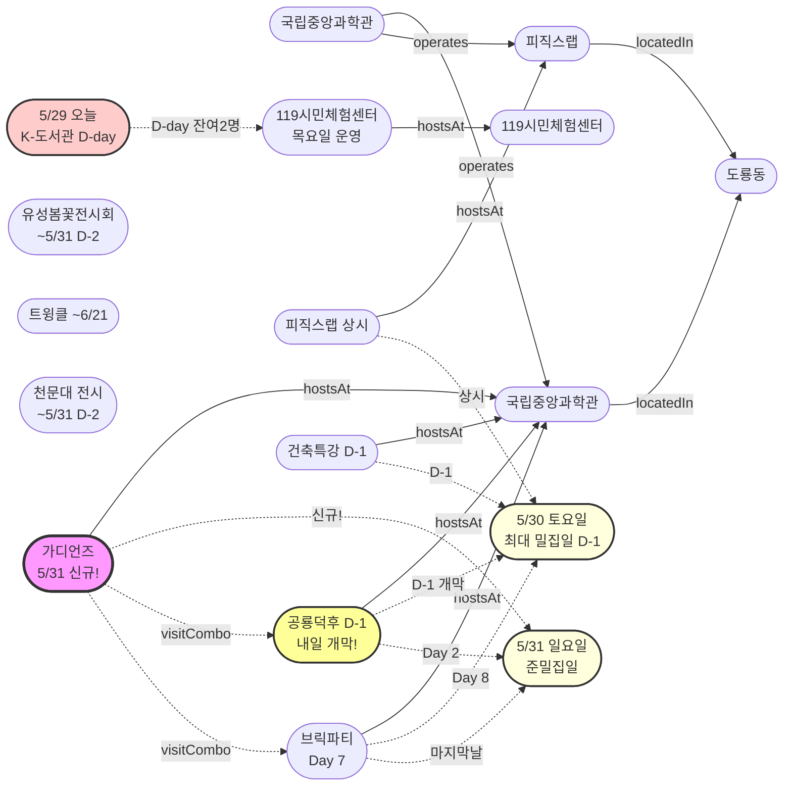

# 2026-05-29 유성구 어린이·가족 이벤트 일일 보고서

## 요약

**목요일, 공룡덕후·건축특강 D-1 + K-도서관 D-day + 가디언즈 신규 발견.** (1) **공룡덕후박람회 D-1** — 내일(5/30 금) 개막! 건축특강도 내일. 도룡동 최대 밀집일 D-1. (2) **K-도서관 이용자교육 D-day** — 잔여 2명, 오늘 마감. 행사 내일(5/30 토). (3) **신규 발견: 가디언즈 빛의 수호자들** — 5/31(일) 국립중앙과학관 미래기술관, 무료 팀전 과학체험. 사전예약 가능. (4) **브릭파티 Day 7** — 네 번째 평일 목요일, 잔여 2일. 이번 시즌 마지막 주말(5/30~31)이 가족 방문 최적·최종 주말.

---

## 용성로20 주변 (도보권 0.5km 내)

금일 도보권(ring-walk, 0.5km) 내 신규 이벤트 없음.

---

## 오늘의 추천 (가족 동반 Top 5)

| # | 이벤트 | 장소 | 대상 | 비용 | 비고 |
|---|--------|------|------|------|------|
| 1 | **사이언스 브릭파티** | 국립중앙과학관(도룡동) | 유아·초등·가족 | 미확인 | Day 7 네 번째 평일 (~5/31) |
| 2 | **피직스랩 상시 체험** | 국립중앙과학관 과학기술관 1층 | 초등·가족 | 무료(입장권별도) | 33종 물리 실험 — 브릭파티 콤보 |
| 3 | **119시민체험센터 소방안전체험** | 119시민체험센터 | 유아·초등·가족 | 무료 | 목요일 운영 (화~토) |
| 4 | **유성봄꽃전시회** | 유림공원(어은동) | 전연령 | 무료 | 진행중 (~5/31, D-2) |
| 5 | **열한번째 트윙클** | 대전시립미술관(둔산동) | 유아·초등·가족 | 미확인 | 체험형 미술전시 (~6/21) |

---

## 주요 뉴스

### 1. 공룡덕후박람회 D-1 — 내일 개막!
- **출처:** [국립중앙과학관](https://www.science.go.kr/mps/0/bbs/431/moveBbsNttDetail.do?nttSn=47354) | [에듀모닝](https://edumorning.com/articles/601) | [한눈에 보기 YouTube](https://www.youtube.com/watch?v=9gP975mQS1Q)
- **일시:** 2026-05-30 ~ 5/31 (D-1)
- **장소:** 국립중앙과학관 사이언스터널·꿈이광장 (도룡동)
- **프로그램:** 공룡덕후 박람회·올림피아드·디노홀 초대전, 이융남 교수 강연, 제1대 공통령 선거, 공룡 뮤지컬
- **비용:** 무료, 사전예약 불필요
- **상태:** 업데이트 (← D-2에서 **D-1**. 에듀모닝 매체 추가 15번째)
- **비고:** **내일 개막.** 5/30(토) 도룡동 최대 밀집일 — 공룡덕후+건축특강+브릭파티+피직스랩+업사이클링 5종 동시 운영.

### 2. 신규 발견: 가디언즈 — 빛의 수호자들
- **출처:** [국립중앙과학관 통합예약](https://rsvn.science.go.kr/nsm/evtrsvn/evtrsvnDetail?evtNo=401)
- **일시:** 2026-05-31 (일) 11:00~17:00, 9회차
- **장소:** 국립중앙과학관 미래기술관 2층 (도룡동, ring-car ~3.2km)
- **형식:** 교육 10분 + 체험 20분, **10명 vs 10명 팀전**
- **비용:** 무료
- **정원:** 회차당 20명 (총 180명)
- **제한:** 키 120cm 이상 (약 초등 2~3학년+)
- **예약:** **사전예약 필수** (현장접수 불가), 1인당 최대 2명, 접수중(~5/31)
- **상태:** 신규 발견
- **비고:** 5/31(일) 공룡덕후 Day 2 + 브릭파티 마지막날과 동시 운영. **지금 예약 가능!**

### 3. K-도서관 이용자교육 접수 D-day — 잔여 2명
- **출처:** [유성구통합도서관](https://lib.yuseong.go.kr/web/menu/10095/program/30010/lectureList.do)
- **접수 마감:** 2026-05-29 (목) — **D-day 오늘 마감**
- **접수현황:** 10/12명 (잔여 2명)
- **행사:** 내일 5/30 (토), 진잠도서관 K-도서관
- **대상:** 초등생 가족 및 개인 누구나
- **상태:** 업데이트 (← D-1에서 **D-day 마감**)
- **긴급:** **오늘이 마지막 접수일. 잔여 2명.**

### 4. 건축특강 '선넘는 높이' D-1 — 내일
- **출처:** [국립중앙과학관](https://www.science.go.kr/mps/1070/bbs/431/moveBbsNttList.do)
- **일시:** 2026-05-30 (D-1)
- **장소:** 국립중앙과학관 창의나래관 나래홀 (도룡동)
- **상태:** 업데이트 (← D-2에서 **D-1**)
- **비고:** 사전접수 필요. 공룡덕후박람회와 동일일.

### 5. 사이언스 브릭파티 Day 7 — 네 번째 평일 목요일
- **출처:** [국립중앙과학관](https://www.science.go.kr/mps/1070/bbs/431/moveBbsNttList.do) | [전자신문](https://www.etnews.com/20260521000123)
- **일시:** 2026-05-23 ~ 5/31 (Day 7, 네 번째 평일 목요일)
- **장소:** 국립중앙과학관 한국과학기술사관·세미나실 (도룡동, ring-car ~3.2km)
- **프로그램:** 12명 브릭작가 해설, 업사이클링 클래스, 전통과학 브릭작품 전시
- **상태:** 업데이트 (← Day 6 세 번째 평일에서 **Day 7 네 번째 평일**)
- **비고:** 잔여 2일. 내일(5/30)부터 마지막 주말. 오늘이 평일 한산 관람 마지막 기회.

---

## 신규 이벤트

| 이벤트 | 일시 | 장소 | 대상 | 비용 | 비고 |
|--------|------|------|------|------|------|
| **가디언즈: 빛의 수호자들** | 5/31(일) 11:00~17:00 | 국립중앙과학관 미래기술관 2층 | 초등(키 120cm+)·가족 | 무료 | 사전예약 필수, 10vs10 팀전 |

---

## 신규 오픈 가게·팝업·프로모션

금일 신규 발견 없음. **활성 윈도우 내 가게 2건** (50일 윈도우 기준 의무 노출):

| 가게 | 유형 | 동 | 거리 | 오픈일 | 윈도우 만료 | 프로모션 | 어린이 친화 | 출처 |
|------|------|----|------|--------|-------------|---------|------------|------|
| **무브먼트랩 팝업 IN 대전** | 팝업스토어 | 관평동 | ~2.5km (ring-bike) | 2026-04-03 | 2026-05-31 (팝업 종료일) | 팝업스토어 운영 (~5/31) | O | [데이포유](https://www.dayforyou.com/getScheduleList?keyword=무브먼트랩) |
| **헌터 팝업 IN 대전** | 팝업스토어 | 관평동 | ~2.5km (ring-bike) | 2026-04-03 | 2026-05-31 (팝업 종료일) | 팝업스토어 운영 (~5/31) | X (성인 브랜드) | [데이포유](https://www.dayforyou.com/getScheduleList?keyword=헌터) |

> 두 팝업 모두 현대프리미엄아울렛 대전점 2층에 위치. 팝업 종료일(5/31) 기준 잔여 **2일**.

### 사용자 제보 처리 현황

| 제보 가게 | 등록일 | 상태 | 결과 |
|----------|--------|------|------|
| 엉클부대찌개 테크노점 (관평동) | 2026-05-24 | `resolved_not_new` | 가게 존재 확인 — 오픈 시점 2025-10~11월 추정(50일 윈도우 이전). 활성 등록 미해당. |
| 인터뷰커피라운지 (도룡동) | 2026-05-24 | `resolved_not_new` | 가게 존재 확인 — 오픈 시점 2024-07월 추정(2년 운영). 심야 영업으로 어린이 친화도 낮음. 활성 등록 미해당. |
| 유성닭발 관평점 (관평동) | 2026-05-24 | `excluded` | scope.exclude 적용 — Naver '술집' 카테고리, 주류 전문. 4년 이상 운영. |

---

## 공공기관 주최 행사 (행정복지센터·보건소·복지관·도서관·우체국·경찰서·소방서)

### 119시민체험센터 — 목요일 운영중
- **운영:** 화~토 09:30~11:30 / 13:30~15:30 (일·월 휴무)
- **예약:** 체험 희망일 2일 전까지 인터넷 예약
- **프로그램:** 소화기·옥내소화전, 화재 대피·탈출, 심폐소생술, 지진 대피 체험

### 도서관 프로그램
- **K-도서관 이용자교육:** D-day 마감 (오늘 5/29 마감, 잔여 2명, 행사 5/30 토)
- **숏폼 클래스:** 접수 마감 완료 (어제 5/28 마감)
- **독서아카데미:** 접수 마감 완료 (어제 5/28 마감)

### 기존 운영
- 유성구 도서관 세대별 독서문화 프로그램 (상시)
- 유성이의 튼튼스쿨 (하반기 8/19~ 예정, 상반기 마감)

---

## 마감 임박 (사전신청 D-3 이내)

### K-도서관 이용자교육 접수 — D-day 마감
- **출처:** [유성구통합도서관](https://lib.yuseong.go.kr/web/menu/10095/program/30010/lectureList.do)
- **접수 마감:** 2026-05-29 (목) — **D-day 오늘 마감**
- **접수현황:** 10/12명 (잔여 2명)
- **행사:** 5/30(토), 진잠도서관 K-도서관 | 대상: 초등생 가족 및 개인 누구나
- **긴급:** **오늘이 마지막 접수일, 잔여 2명**

### 가디언즈 예약 — 접수중 (D-2)
- **출처:** [국립중앙과학관 통합예약](https://rsvn.science.go.kr/nsm/evtrsvn/evtrsvnDetail?evtNo=401)
- **예약 기간:** 2026-05-25 ~ 5/31, 1인당 최대 2명
- **행사:** 5/31(일) 11:00~17:00, 미래기술관 2층 | 회차당 20명
- **비고:** 현장접수 불가. **지금 예약 가능**

---

## 동심원별 묶음

### ring-stroll (1km 이내, 도보 15분)
금일 도보권 이벤트 없음.

### ring-car (5km 이내, 차량 10분)
| 이벤트 | 장소 | 일시 | 상태 |
|--------|------|------|------|
| 사이언스 브릭파티 | 국립중앙과학관 한국과학기술사관 | 5/23~31 | **Day 7 네 번째 평일** |
| 피직스랩 상시 체험 | 국립중앙과학관 과학기술관 1층 | 상시 | 운영중 |
| 공룡덕후박람회 (공통령선거 포함) | 국립중앙과학관 사이언스터널 | 5/30~31 | **D-1 내일 개막** |
| 건축 특강 '선넘는 높이' | 국립중앙과학관 나래홀 | 5/30 | **D-1** |
| **가디언즈: 빛의 수호자들** | 국립중앙과학관 미래기술관 2층 | **5/31** | **신규 (예약중)** |
| 유성봄꽃전시회 | 유림공원(어은동) | ~5/31 | 진행중 (D-2) |
| 천문대 운석전시+사진전 | 대전시민천문대(도룡동) | ~5/31 | 진행중 (D-2) |
| 119시민체험센터 안전체험 | 119시민체험센터 | 화~토 상시 | 목요일 운영중 |

---

## 동(洞)별 이벤트 묶음

### 도룡동 (1차 타겟) — 5/30(토)~31(일) 마지막 밀집 주말 D-1

**이번 주말이 이번 시즌 도룡동 가족 방문 마지막 최적 주말.** 6월부터 브릭파티·천문대전시 종료로 대폭 축소.

**5/30(토) — 최대 밀집일:**
- 공룡덕후박람회 Day 1 (D-1, 내일 개막)
- 건축특강 '선넘는 높이' (D-1)
- 브릭파티 Day 8
- 피직스랩 상시 체험
- 업사이클링 클래스
- 천문대 운석전시·기상기후사진전

**5/31(일) — 준밀집일:**
- 공룡덕후박람회 Day 2
- **가디언즈: 빛의 수호자들** (신규!)
- 브릭파티 Day 9 (마지막날)
- 피직스랩 상시 체험
- 업사이클링 클래스
- 천문대 운석전시·사진전 (마지막날)

> **5/30~31 양일 모두 6종 동시 운영.** 이번 시즌 마지막·최대 밀집 주말.

### 어은동 (보조)
- 유성봄꽃전시회 (~5/31, D-2)

### 둔산동 (유성구 인접)
- 열한번째 트윙클 (~6/21)

---

## 연령대별 묶음

| 연령대 | 이벤트 |
|--------|--------|
| 영유아·유아 (0~6세) | 브릭파티(Day 7), 트윙클(~6/21), 119시민체험센터 |
| 초등저학년 (7~9세) | 브릭파티(Day 7), 피직스랩, 공룡덕후(D-1), **가디언즈**(5/31, 키 120cm+), 119시민체험센터 |
| 초등고학년 (10~12세) | 피직스랩, 건축특강(D-1), 공룡덕후(D-1), **가디언즈**(5/31) |
| 전연령가족 | 유성봄꽃(~5/31), 트윙클(~6/21), 천문대 전시(~5/31), 브릭파티(Day 7), 피직스랩, 119시민체험센터 |

---

## 시리즈/정기 프로그램 업데이트

| 시리즈 | 다음 회차 | 상태 |
|--------|----------|------|
| 국립중앙과학관 가정의 달 시리즈 | 공룡덕후 5/30~31 → 가디언즈 5/31 | **D-1** / 신규 |
| K-도서관 이용자교육 (연 4회) | 5/30 진잠분관 (10/12명) | **D-day, 잔여 2명** |
| 탐이 꿈이의 비밀 실험실 | 상시 운영 (~6/30) | 진행중 |
| 미래산업 진로탐색 독서아카데미 | 접수 마감 완료 (5/28) | 종료 |
| 진잠도서관 숏폼 클래스 | 접수 마감 완료 (5/28), 행사 6/4~25 | 접수 종료 |

---

## 지식그래프 시각화

### 오늘의 주요 관계
- **공룡덕후·건축특강 D-1:** 내일 개막! 5/30(토) 최대 밀집일
- **가디언즈 신규:** 5/31(일) 과학관 팀전 체험 — 공룡덕후 Day 2 콤보
- **K-도서관 D-day:** 잔여 2명, 오늘 마감
- **5/30~31 = 이번 시즌 최대·마지막 밀집 주말**

### 전체 지식그래프

---

## 온톨로지 변경

| 변경 유형 | 대상 | 근거 |
|----------|------|------|
| **신규** | ent-evt-046 가디언즈: 빛의 수호자들 | 국립중앙과학관 통합예약 누리집에서 발견 |
| 속성 업데이트 | ent-evt-027 브릭파티 | Day 6→**Day 7 네 번째 평일 목요일** |
| 카운트다운 | ent-evt-028 공룡덕후 | D-2→**D-1**, 에듀모닝 매체 추가 15번째 |
| 카운트다운 | ent-evt-043 건축특강 | D-2→**D-1** |
| 접수 마감 | ent-evt-045 숏폼 클래스 | D-day→**마감 완료** (어제) |
| 접수 마감 | ent-evt-008 독서아카데미 | D-day→**마감 완료** (어제) |
| 접수 D-day | K-도서관 이용자교육 | D-1→**D-day 마감** (잔여 2명) |

---

## 추론 결과

| 추론 | 규칙 | 신뢰도 | 근거 |
|------|------|--------|------|
| 5/31 가디언즈+공룡덕후+브릭파티 콤보 | same_dong_combo | 0.90 | 도룡동 3종 동일일 방문 콤보 |
| 5/30(토) 최대 밀집일 D-1 | temporal_concentration | 0.90 | 5종 동시 운영, 내일 |
| 5/31(일) 준밀집일 | temporal_concentration | 0.85 | 가디언즈 합류로 6종 동시 |
| K-도서관 D-day 마감 | deadline_urgency | 0.95 | 잔여 2명, 오늘 마감 |
| 가디언즈 과학관 가산 | operator_kid_friendliness | 0.90 | 국립중앙과학관 운영 |
| 숏폼·독서아카데미 접수 종료 | deadline_completed | 1.00 | 어제(5/28) 마감 완료 |

---

## 분석 및 평가

**D-1 밀집 주말 전야:** 내일(5/30 금)부터 공룡덕후박람회와 건축특강이 개막한다. 5/30(토)은 공룡덕후 Day 1 + 건축특강 + 브릭파티 Day 8 + 피직스랩 + 업사이클링 + 천문대 전시 6종이 동시 운영되는 이번 시즌 최대 밀집일이다. 오늘이 가족 방문 계획 최종 확정 시한.

**가디언즈 신규 발견:** 5/31(일) 국립중앙과학관 미래기술관 2층에서 '월간 미래 5월호 가디언즈: 빛의 수호자들'이 무료로 운영된다. 10명 vs 10명 팀전 형식의 과학 체험으로, 키 120cm 이상(약 초등 2~3학년+) 제한이 있다. 사전예약이 필수이며 현재 접수 가능하다. 이로써 5/31(일)도 공룡덕후 Day 2 + 가디언즈 + 브릭파티 마지막날 + 피직스랩 + 업사이클링 + 천문대 전시 6종으로, 5/30(토)에 버금가는 밀집일이 되었다.

**K-도서관 D-day:** 잔여 2명으로 오늘 마감한다. 행사는 내일(5/30 토) 진잠도서관. 관심 가족은 오늘 중 접수 완료 필요.

**접수 마감 완료:** 어제(5/28) 숏폼 클래스(10명)와 독서아카데미(41/50명) 접수가 종료되었다.

---

## 추적 항목

| 항목 | 최초 보고 | 상태 | 최신 업데이트 |
|------|----------|------|-------------|
| **가디언즈: 빛의 수호자들** | **2026-05-29** | **신규 (5/31, 예약중)** | 미래기술관 2층, 10vs10 팀전 |
| 공룡덕후박람회 | 2026-04-30 | **D-1** (5/30~31) | 내일 개막! 에듀모닝 15번째 매체 |
| 건축특강 '선넘는 높이' | 2026-05-17 | **D-1** (5/30) | 내일, 공룡덕후 동일일 |
| 사이언스 브릭파티 | 2026-04-30 | **Day 7 네 번째 평일** (5/23~31) | 잔여 2일, 마지막 평일 관람 |
| 유성봄꽃전시회 | 2026-05-08 | 진행중 (~5/31, D-2) | 변동 없음 |
| 열한번째 트윙클 | 2026-05-14 | 진행중 (~6/21) | 변동 없음 |
| 천문대 특별전시 | 2026-05-13 | 진행중 (~5/31, D-2) | 변동 없음 |
| 119시민체험센터 | 2026-04-26 | 목요일 운영중 (화~토) | 변동 없음 |
| K-도서관 이용자교육 | 2026-04-25 | 접수 10/12명 (**D-day**, 5/29) | 잔여 2명, 오늘 마감 |
| 진잠도서관 숏폼 클래스 | 2026-05-17 | 접수 마감 완료 (5/28) | 행사 6/4~25 |
| 미래산업 독서아카데미 | 2026-04-25 | 접수 마감 완료 (5/28) | 최종 41/50명 |

---

## 동향 요약

| 분류 | 상태 | 비고 |
|------|------|------|
| 어린이·가족 이벤트 | 신규 1건 + 업데이트 6건 | 가디언즈 신규, D-1 2건, D-day 1건, 마감완료 2건 |
| 가게(Shop) | 활성 2건 (무브먼트랩·헌터 팝업, ~5/31) | 금일 신규 발견 없음, 잔여 2일 |
| 공공기관 행사 | 119시민체험센터 목요일 운영 | K-도서관 D-day 마감 |

---

## 출처 목록

1. [국립중앙과학관 행사안내](https://www.science.go.kr/mps/1070/bbs/431/moveBbsNttList.do) - 국립중앙과학관
2. [월간 미래 5월호 가디언즈 예약](https://rsvn.science.go.kr/nsm/evtrsvn/evtrsvnDetail?evtNo=401) - 국립중앙과학관 통합예약 누리집
3. [세계 공룡의 날 공룡덕후박람회](https://www.science.go.kr/mps/0/bbs/431/moveBbsNttDetail.do?nttSn=47354) - 국립중앙과학관
4. [유성구통합도서관 프로그램](https://lib.yuseong.go.kr/web/menu/10095/program/30010/lectureList.do) - 유성구통합도서관
5. [대전시민천문대 운석전시](https://www.sedaily.com/article/20042838) - 서울경제
6. [대전시립미술관 열한번째 트윙클](https://www.thesnstime.com/daejeonsiribmisulgwan-2026-eorinimisulgihoegjeon-yeolhanbeonjjae-teuwingkeulgaecoe/) - 더에스엔에스타임
7. [소방체험 및 교육신청](https://www.daejeon.go.kr/dj119/CmmContentsHtmlView.do?menuSeq=5092) - 대전소방본부
8. [유성봄꽃전시회](https://daejeontour.co.kr/festival_djt/33) - 대전관광
9. [공룡덕후박람회 한눈에 보기](https://www.youtube.com/watch?v=9gP975mQS1Q) - 국립중앙과학관 YouTube
10. [데이포유 팝업스토어 일정](https://www.dayforyou.com/getScheduleList) - 데이포유 (무브먼트랩·헌터 팝업 출처)
11. [공룡덕후 박람회 상세](https://edumorning.com/articles/601) - 에듀모닝
12. [국립중앙과학관 웹진 월간미래](https://www.science.go.kr/webzine/793/exhi.html) - 국립중앙과학관
13. [브릭으로 만나는 과학기술 사이언스 브릭파티](https://www.etnews.com/20260521000123) - 전자신문
14. [119시민체험센터 안전체험 데이 성황](https://www.thesnstime.com/daejeon119siminceheomsenteo-gajeongyi-dal-maja-gajogon-anjeonon-anjeonceheom-dei-seonghwang/) - 더에스엔에스타임
