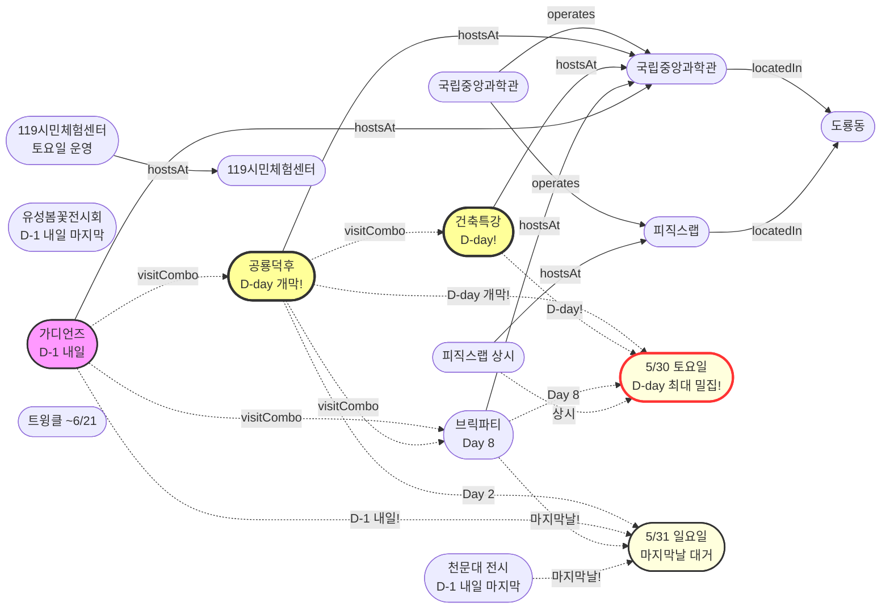

# 2026-05-30 유성구 어린이·가족 이벤트 일일 보고서

## 요약

**토요일, D-day 최대 밀집일 실현!** (1) **공룡덕후박람회 D-day 개막** — 오늘(5/30 토) 개막! 무료·사전예약 불필요. 올림피아드·공통령선거·코스프레·레진아트·오픈마이크. (2) **건축특강 D-day** — 오늘(5/30) 나래홀. (3) **브릭파티 Day 8** — 두 번째 주말 토요일. 내일(5/31) 마지막날. (4) **K-도서관 이용자교육 행사 당일** — 오늘 진잠도서관. (5) **도룡동 5종 동시 운영** — 공룡덕후+건축특강+브릭파티+피직스랩+업사이클링. 이번 시즌 최대·마지막 밀집 주말 1일차.

---

## 용성로20 주변 (도보권 0.5km 내)

금일 도보권(ring-walk, 0.5km) 내 신규 이벤트 없음.

---

## 오늘의 추천 (가족 동반 Top 5)

| # | 이벤트 | 장소 | 대상 | 비용 | 비고 |
|---|--------|------|------|------|------|
| 1 | **공룡덕후박람회** | 국립중앙과학관 사이언스터널·꿈이광장(도룡동) | 유아·초등·가족 | 무료 | **D-day 오늘 개막!** (~5/31) |
| 2 | **사이언스 브릭파티** | 국립중앙과학관 한국과학기술사관(도룡동) | 유아·초등·가족 | 미확인 | Day 8 두 번째 주말 — 내일 마지막 |
| 3 | **건축특강 '선넘는 높이'** | 국립중앙과학관 나래홀(도룡동) | 초등고학년·가족 | 미확인 | **D-day 오늘!** 사전접수 필요 |
| 4 | **피직스랩 상시 체험** | 국립중앙과학관 과학기술관 1층 | 초등·가족 | 무료(입장권별도) | 33종 물리 실험 — 콤보 |
| 5 | **119시민체험센터 소방안전체험** | 119시민체험센터 | 유아·초등·가족 | 무료 | 토요일 운영 (화~토) |

---

## 주요 뉴스

### 1. 공룡덕후박람회 D-day — 오늘 개막!
- **출처:** [국립중앙과학관](https://www.science.go.kr/mps/0/bbs/431/moveBbsNttDetail.do?nttSn=47354) | [참가안내](https://www.science.go.kr/mps/1111/bbs/208/moveBbsNttDetail.do?nttSn=47305) | [에듀모닝](https://edumorning.com/articles/601) | [소년한국일보](https://www.kidshankook.kr/news/articleView.html?idxno=13845)
- **일시:** 2026-05-30 ~ 5/31 (**D-day 오늘 개막**)
- **장소:** 국립중앙과학관 사이언스터널·꿈이광장 (도룡동, ring-car ~3.2km)
- **프로그램:** 공룡덕후박람회·올림피아드·디노홀 초대전, 이융남 교수 강연, 제1대 공통령 선거, 코스프레·레진아트·테라리움 만들기, 오픈마이크
- **비용:** 무료, 사전예약 불필요
- **상태:** 업데이트 (← D-1에서 **D-day 개막**)
- **비고:** **오늘 개막!** 15+ 매체 보도. 5/30(토) 도룡동 최대 밀집일 — 5종 동시 운영.

### 2. 건축특강 '선넘는 높이' D-day — 오늘
- **출처:** [국립중앙과학관](https://www.science.go.kr/mps/1070/bbs/431/moveBbsNttList.do)
- **일시:** 2026-05-30 (**D-day**)
- **장소:** 국립중앙과학관 창의나래관 나래홀 (도룡동)
- **상태:** 업데이트 (← D-1에서 **D-day**)
- **비고:** 사전접수 필요. 공룡덕후박람회와 동일일 동일장소.

### 3. 사이언스 브릭파티 Day 8 — 두 번째 주말 토요일
- **출처:** [국립중앙과학관](https://www.science.go.kr/mps/1070/bbs/431/moveBbsNttList.do) | [전자신문](https://www.etnews.com/20260521000123)
- **일시:** 2026-05-23 ~ 5/31 (Day 8, 두 번째 주말 토요일)
- **장소:** 국립중앙과학관 한국과학기술사관·세미나실 (도룡동, ring-car ~3.2km)
- **프로그램:** 12명 브릭작가 해설, 업사이클링 클래스, 전통과학 브릭작품 전시
- **상태:** 업데이트 (← Day 7 네 번째 평일에서 **Day 8 두 번째 주말**)
- **비고:** 잔여 1일. **내일(5/31)이 마지막날!** 오늘·내일이 마지막 관람 기회.

### 4. K-도서관 이용자교육 — 행사 당일
- **출처:** [유성구통합도서관](https://lib.yuseong.go.kr/web/menu/10095/program/30010/lectureList.do)
- **일시:** 2026-05-30 (토) — **행사 당일**
- **장소:** 진잠도서관 K-도서관
- **상태:** 업데이트 (← D-day 마감에서 **행사 당일**)
- **비고:** 어제(5/29) 접수 마감. 오늘 행사 진행.

### 5. 가디언즈: 빛의 수호자들 D-1 — 내일
- **출처:** [국립중앙과학관 통합예약](https://rsvn.science.go.kr/nsm/evtrsvn/evtrsvnDetail?evtNo=401)
- **일시:** 2026-05-31 (일) 11:00~17:00, 9회차 (**D-1 내일**)
- **장소:** 국립중앙과학관 미래기술관 2층 (도룡동, ring-car ~3.2km)
- **형식:** 교육 10분 + 체험 20분, 10명 vs 10명 팀전
- **비용:** 무료 | **정원:** 회차당 20명 (총 180명)
- **제한:** 키 120cm 이상 | **예약:** 사전예약 필수
- **상태:** 업데이트 (← 신규에서 **D-1**)
- **비고:** **내일 행사. 지금 예약 가능!** 공룡덕후 Day 2 + 브릭파티 마지막날 콤보.

---

## 신규 이벤트

금일 신규 이벤트 발견 없음.

---

## 신규 오픈 가게·팝업·프로모션

금일 신규 발견 없음. **활성 윈도우 내 가게 2건** (50일 윈도우 기준 의무 노출):

| 가게 | 유형 | 동 | 거리 | 오픈일 | 윈도우 만료 | 프로모션 | 어린이 친화 | 출처 |
|------|------|----|------|--------|-------------|---------|------------|------|
| **무브먼트랩 팝업 IN 대전** | 팝업스토어 | 관평동 | ~2.5km (ring-bike) | 2026-04-03 | 2026-05-31 (팝업 종료일) | 팝업스토어 운영 (~5/31) | O | [데이포유](https://www.dayforyou.com/getScheduleList?keyword=무브먼트랩) |
| **헌터 팝업 IN 대전** | 팝업스토어 | 관평동 | ~2.5km (ring-bike) | 2026-04-03 | 2026-05-31 (팝업 종료일) | 팝업스토어 운영 (~5/31) | X (성인 브랜드) | [데이포유](https://www.dayforyou.com/getScheduleList?keyword=헌터) |

> 두 팝업 모두 현대프리미엄아울렛 대전점 2층에 위치. 팝업 종료일(5/31) 기준 **잔여 1일** — 내일 마지막.

### 사용자 제보 처리 현황

| 제보 가게 | 등록일 | 상태 | 결과 |
|----------|--------|------|------|
| 엉클부대찌개 테크노점 (관평동) | 2026-05-24 | `resolved_not_new` | 가게 존재 확인 — 오픈 시점 2025-10~11월 추정(50일 윈도우 이전). 활성 등록 미해당. |
| 인터뷰커피라운지 (도룡동) | 2026-05-24 | `resolved_not_new` | 가게 존재 확인 — 오픈 시점 2024-07월 추정(2년 운영). 심야 영업으로 어린이 친화도 낮음. 활성 등록 미해당. |
| 유성닭발 관평점 (관평동) | 2026-05-24 | `excluded` | scope.exclude 적용 — Naver '술집' 카테고리, 주류 전문. 4년 이상 운영. |

---

## 공공기관 주최 행사 (행정복지센터·보건소·복지관·도서관·우체국·경찰서·소방서)

### 119시민체험센터 — 토요일 운영중
- **운영:** 화~토 09:30~11:30 / 13:30~15:30 (일·월 휴무)
- **예약:** 체험 희망일 2일 전까지 인터넷 예약
- **프로그램:** 소화기·옥내소화전, 화재 대피·탈출, 심폐소생술, 지진 대피 체험

### 도서관 프로그램
- **K-도서관 이용자교육:** 행사 당일 (오늘 5/30 토, 진잠도서관)
- **숏폼 클래스:** 접수 마감 완료 (5/28), 행사 6/4~25 예정
- **독서아카데미:** 접수 마감 완료 (5/28)

### 기존 운영
- 유성구 도서관 세대별 독서문화 프로그램 (상시)
- 유성이의 튼튼스쿨 (하반기 8/19~ 예정, 상반기 마감)

---

## 마감 임박 (사전신청 D-3 이내)

### 가디언즈 예약 — D-1 (내일 행사)
- **출처:** [국립중앙과학관 통합예약](https://rsvn.science.go.kr/nsm/evtrsvn/evtrsvnDetail?evtNo=401)
- **예약 기간:** ~5/31, 1인당 최대 2명
- **행사:** 5/31(일) 11:00~17:00, 미래기술관 2층 | 회차당 20명
- **비고:** 현장접수 불가. **오늘 예약하면 내일 참여 가능**

### 내일(5/31) 마지막날 행사 (사전신청 불필요)
- 유성봄꽃전시회 (~5/31, D-1)
- 천문대 운석전시·기상기후사진전 (~5/31, D-1)
- 사이언스 브릭파티 (~5/31, D-1)
- 무브먼트랩·헌터 팝업 (~5/31, D-1)

---

## 동심원별 묶음

### ring-car (5km 이내, 차량 10분)
| 이벤트 | 장소 | 일시 | 상태 |
|--------|------|------|------|
| **공룡덕후박람회** | 국립중앙과학관 사이언스터널 | 5/30~31 | **D-day 오늘 개막!** |
| **건축특강 '선넘는 높이'** | 국립중앙과학관 나래홀 | 5/30 | **D-day 오늘** |
| 사이언스 브릭파티 | 국립중앙과학관 한국과학기술사관 | 5/23~31 | **Day 8 두 번째 주말** |
| 피직스랩 상시 체험 | 국립중앙과학관 과학기술관 1층 | 상시 | 운영중 |
| 가디언즈: 빛의 수호자들 | 국립중앙과학관 미래기술관 2층 | 5/31 | **D-1 내일** |
| 유성봄꽃전시회 | 유림공원(어은동) | ~5/31 | **D-1 내일 마지막** |
| 천문대 운석전시+사진전 | 대전시민천문대(도룡동) | ~5/31 | **D-1 내일 마지막** |
| 119시민체험센터 안전체험 | 119시민체험센터 | 화~토 상시 | 토요일 운영중 |

---

## 동(洞)별 이벤트 묶음

### 도룡동 (1차 타겟) — D-day 최대 밀집일!

**오늘이 이번 시즌 도룡동 가족 방문 최적·최대·마지막 주말 1일차.**

**5/30(토) — 최대 밀집일 D-day:**
- **공룡덕후박람회 Day 1 (D-day 개막!)**
- **건축특강 '선넘는 높이' (D-day)**
- 브릭파티 Day 8
- 피직스랩 상시 체험
- 업사이클링 클래스
- 천문대 운석전시·기상기후사진전

**5/31(일) — 준밀집일 + 마지막날 대거:**
- 공룡덕후박람회 Day 2
- **가디언즈: 빛의 수호자들** (예약 필수)
- 브릭파티 Day 9 (**마지막날!**)
- 피직스랩 상시 체험
- 업사이클링 클래스
- 천문대 운석전시·사진전 (**마지막날!**)

> **오늘 6종, 내일 6종 동시 운영.** 6월부터 브릭파티·천문대전시 종료로 대폭 축소.

### 어은동 (보조)
- 유성봄꽃전시회 (~5/31, **D-1 내일 마지막**)

### 둔산동 (유성구 인접)
- 열한번째 트윙클 (~6/21)

---

## 연령대별 묶음

| 연령대 | 이벤트 |
|--------|--------|
| 영유아·유아 (0~6세) | 브릭파티(Day 8), 트윙클(~6/21), 119시민체험센터 |
| 초등저학년 (7~9세) | **공룡덕후(D-day!)**, 브릭파티(Day 8), 피직스랩, 가디언즈(D-1, 키120cm+), 119시민체험센터 |
| 초등고학년 (10~12세) | **공룡덕후(D-day!)**, **건축특강(D-day)**, 피직스랩, 가디언즈(D-1) |
| 전연령가족 | **공룡덕후(D-day!)**, 브릭파티(Day 8), 유성봄꽃(D-1), 트윙클(~6/21), 천문대 전시(D-1), 피직스랩, 119시민체험센터 |

---

## 시리즈/정기 프로그램 업데이트

| 시리즈 | 다음 회차 | 상태 |
|--------|----------|------|
| 국립중앙과학관 가정의 달 시리즈 | **공룡덕후 5/30~31 (D-day!)** → 가디언즈 5/31 (D-1) | **D-day / D-1** |
| 사이언스 브릭파티 | Day 8 (5/30) → Day 9 (5/31 마지막) | **Day 8 두 번째 주말** |
| K-도서관 이용자교육 (연 4회) | 5/30 진잠분관 (행사 당일) | **행사 당일** |
| 탐이 꿈이의 비밀 실험실 | 상시 운영 (~6/30) | 진행중 |
| 진잠도서관 숏폼 클래스 | 접수 마감 완료, 행사 6/4~25 | 대기 |

---

## 지식그래프 시각화

### 오늘의 주요 관계
- **공룡덕후·건축특강 D-day:** 오늘 개막! 도룡동 5종 동시
- **브릭파티 Day 8:** 두 번째 주말, 내일 마지막
- **가디언즈 D-1:** 내일 5/31 예약 가능
- **5/30~31 = 이번 시즌 최대·마지막 밀집 주말**

### 전체 지식그래프

---

## 온톨로지 변경

| 변경 유형 | 대상 | 근거 |
|----------|------|------|
| 상태 전환 | ent-evt-028 공룡덕후박람회 | D-1→**D-day 개막** |
| 상태 전환 | ent-evt-043 건축특강 | D-1→**D-day** |
| 상태 전환 | ent-evt-027 브릭파티 | Day 7→**Day 8 두 번째 주말 토요일** |
| 카운트다운 | ent-evt-046 가디언즈 | 신규→**D-1** |
| 카운트다운 | ent-evt-033 유성봄꽃전시회 | D-2→**D-1** |
| 카운트다운 | ent-evt-037 천문대 운석전시 | D-2→**D-1** |
| 카운트다운 | ent-evt-038 천문대 사진전 | D-2→**D-1** |
| 상태 전환 | K-도서관 이용자교육 | D-day 마감→**행사 당일** |

---

## 추론 결과

| 추론 | 규칙 | 신뢰도 | 근거 |
|------|------|--------|------|
| 5/30(토) 최대 밀집일 D-day | temporal_concentration | 0.95 | 공룡덕후+건축특강+브릭파티+피직스랩+업사이클링 5종 동시 |
| 5/31(일) 마지막날 밀집 | temporal_concentration | 0.90 | 공룡덕후Day2+가디언즈+브릭파티마지막+피직스랩+천문대전시마지막 6종 |
| 공룡덕후+브릭파티+건축특강 콤보 | same_dong_combo | 0.95 | 도룡동 동일일 방문 콤보 |
| 공룡덕후+피직스랩 콤보 | same_dong_combo | 0.90 | 도룡동 동일일 콤보 |
| 공룡덕후 과학관 가산 | operator_kid_friendliness | 0.90 | 국립중앙과학관 운영 |
| 공룡덕후 공공기관 가산 | public_institution_kid_event | 0.90 | 공공기관 주최 어린이 대상 |
| 5/31 가디언즈+공룡덕후+브릭파티 콤보 | same_dong_combo | 0.90 | 도룡동 3종 동일일 콤보 |
| K-도서관 행사 당일 | deadline_completed | 1.00 | 접수 마감(어제), 행사 진행 |

---

## 분석 및 평가

**D-day 최대 밀집일 실현:** 오늘(5/30 토)은 공룡덕후박람회와 건축특강이 동시 개막하여, 브릭파티 Day 8 + 피직스랩 + 업사이클링과 함께 도룡동에서 5종이 동시 운영되는 이번 시즌 최대 밀집일이다. 천문대 운석전시·사진전까지 포함하면 6종. 무료·사전예약 불필요인 공룡덕후가 핵심.

**내일(5/31) = 마지막날 대거 종료:** 공룡덕후 Day 2, 브릭파티 마지막날, 천문대 전시 마지막날, 봄꽃전시 마지막날, 팝업 2건 종료일이 모두 5/31에 집중된다. 가디언즈(사전예약 필수)까지 합류하여 내일도 6종 동시 운영. 6월부터는 트윙클(~6/21)·탐이꿈이(~6/30)·피직스랩(상시)·119시민체험센터(상시)로 대폭 축소.

**K-도서관 행사 당일:** 어제 접수 마감된 K-도서관 이용자교육이 오늘 진잠도서관에서 진행된다. 다음 회차는 미정.

---

## 추적 항목

| 항목 | 최초 보고 | 상태 | 최신 업데이트 |
|------|----------|------|-------------|
| **공룡덕후박람회** | 2026-04-30 | **D-day 개막!** (5/30~31) | 오늘 개막! 15+ 매체 |
| **건축특강 '선넘는 높이'** | 2026-05-17 | **D-day** (5/30) | 오늘 행사 |
| 사이언스 브릭파티 | 2026-04-30 | **Day 8 두 번째 주말** (5/23~31) | 내일 마지막날 |
| 가디언즈: 빛의 수호자들 | 2026-05-29 | **D-1** (5/31, 예약중) | 내일 행사 |
| 유성봄꽃전시회 | 2026-05-08 | **D-1** (~5/31) | 내일 마지막날 |
| 열한번째 트윙클 | 2026-05-14 | 진행중 (~6/21) | 변동 없음 |
| 천문대 특별전시 | 2026-05-13 | **D-1** (~5/31) | 내일 마지막날 |
| 119시민체험센터 | 2026-04-26 | 토요일 운영중 (화~토) | 변동 없음 |
| K-도서관 이용자교육 | 2026-04-25 | **행사 당일** (5/30) | 오늘 진잠도서관 |
| 진잠도서관 숏폼 클래스 | 2026-05-17 | 접수 마감, 행사 6/4~25 | 변동 없음 |
| 미래산업 독서아카데미 | 2026-04-25 | 접수 마감 (5/28) | 최종 41/50명 |

---

## 동향 요약

| 분류 | 상태 | 비고 |
|------|------|------|
| 어린이·가족 이벤트 | 신규 0건 + 업데이트 8건 | D-day 2건, D-1 4건, 행사당일 1건, 진행중 1건 |
| 가게(Shop) | 활성 2건 (무브먼트랩·헌터 팝업, ~5/31) | 금일 신규 발견 없음, **잔여 1일** |
| 공공기관 행사 | 119시민체험센터 토요일 운영 | K-도서관 행사 당일 |

---

## 출처 목록

1. [국립중앙과학관 행사안내](https://www.science.go.kr/mps/1070/bbs/431/moveBbsNttList.do) - 국립중앙과학관
2. [세계 공룡의 날 공룡덕후박람회](https://www.science.go.kr/mps/0/bbs/431/moveBbsNttDetail.do?nttSn=47354) - 국립중앙과학관
3. [공룡덕후박람회 참가안내](https://www.science.go.kr/mps/1111/bbs/208/moveBbsNttDetail.do?nttSn=47305) - 국립중앙과학관
4. [월간 미래 5월호 가디언즈 예약](https://rsvn.science.go.kr/nsm/evtrsvn/evtrsvnDetail?evtNo=401) - 국립중앙과학관 통합예약 누리집
5. [브릭으로 만나는 과학기술 사이언스 브릭파티](https://www.etnews.com/20260521000123) - 전자신문
6. [유성구통합도서관 프로그램](https://lib.yuseong.go.kr/web/menu/10095/program/30010/lectureList.do) - 유성구통합도서관
7. [대전시민천문대 운석전시](https://www.sedaily.com/article/20042838) - 서울경제
8. [대전시립미술관 열한번째 트윙클](https://www.thesnstime.com/daejeonsiribmisulgwan-2026-eorinimisulgihoegjeon-yeolhanbeonjjae-teuwingkeulgaecoe/) - 더에스엔에스타임
9. [소방체험 및 교육신청](https://www.daejeon.go.kr/dj119/CmmContentsHtmlView.do?menuSeq=5092) - 대전소방본부
10. [유성봄꽃전시회](https://daejeontour.co.kr/festival_djt/33) - 대전관광
11. [공룡덕후박람회 한눈에 보기](https://www.youtube.com/watch?v=9gP975mQS1Q) - 국립중앙과학관 YouTube
12. [데이포유 팝업스토어 일정](https://www.dayforyou.com/getScheduleList) - 데이포유 (무브먼트랩·헌터 팝업 출처)
13. [공룡덕후 박람회 상세](https://edumorning.com/articles/601) - 에듀모닝
14. [공룡덕후 박람회 소년한국일보](https://www.kidshankook.kr/news/articleView.html?idxno=13845) - 소년한국일보
15. [119시민체험센터 안전체험 데이 성황](https://www.thesnstime.com/daejeon119siminceheomsenteo-gajeongyi-dal-maja-gajogon-anjeonon-anjeonceheom-dei-seonghwang/) - 더에스엔에스타임
