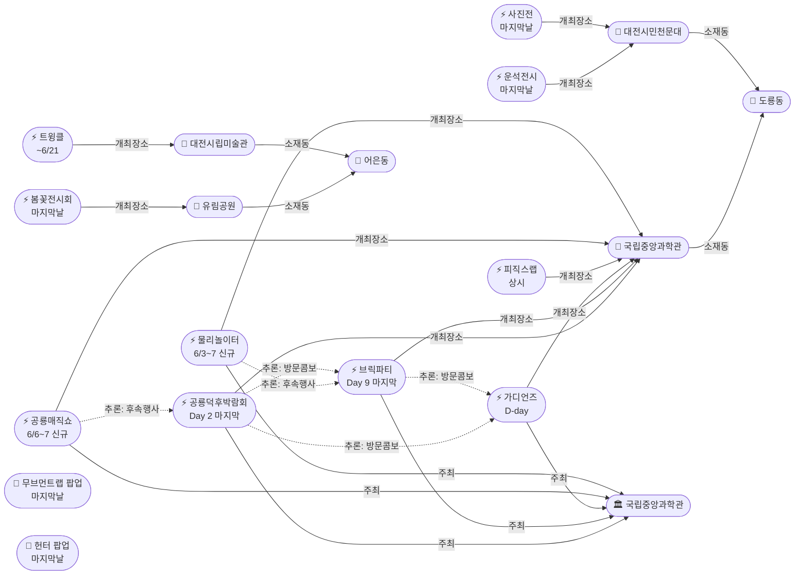

# 2026-05-31 유성구 어린이·가족 이벤트 일일 보고서

## 요약

**일요일, 5월 마지막날 — 대종료일!** (1) **공룡덕후박람회 Day 2 마지막날** — 오늘 종료! 올림피아드·공통령선거·코스프레·레진아트 마지막 기회. (2) **사이언스 브릭파티 Day 9 마지막날** — 오늘 종료! 12명 브릭작가 해설 마지막. (3) **가디언즈: 빛의 수호자들 D-day** — 오늘 행사! 미래기술관 2층, 팀전 과학체험. (4) **봄꽃전시회·천문대 특별전시·팝업 2건 동시 종료** — 5월 기한 행사 4건 일괄 종료. (5) **차기 행사 2건 신규 발견** — 물리로 물리쳐라!(6/3~7), 공룡매직쇼(6/6~7)로 6월 첫 주 도룡동 콘텐츠 이어짐.

---

## 용성로20 주변 (도보권 0.5km 내)

금일 도보권(ring-walk, 0.5km) 내 신규 이벤트 없음.

---

## 오늘의 추천 (가족 동반 Top 5)

| # | 이벤트 | 장소 | 대상 | 비용 | 비고 |
|---|--------|------|------|------|------|
| 1 | **공룡덕후박람회** | 국립중앙과학관 사이언스터널·꿈이광장(도룡동) | 유아·초등·가족 | 무료 | **마지막날!** 오늘 종료 |
| 2 | **사이언스 브릭파티** | 국립중앙과학관 한국과학기술사관(도룡동) | 유아·초등·가족 | 미확인 | **마지막날!** 오늘 종료 |
| 3 | **가디언즈: 빛의 수호자들** | 국립중앙과학관 미래기술관 2층(도룡동) | 초등(키120cm↑) | 무료 | **D-day!** 사전예약 필수 |
| 4 | **유성봄꽃전시회** | 유림공원(어은동) | 전연령가족 | 무료 | **마지막날!** 오늘 종료 |
| 5 | **피직스랩 상시 체험** | 국립중앙과학관 과학기술관 1층 | 초등·가족 | 무료(입장권별도) | 33종 물리 실험 — 콤보 |

---

## 주요 뉴스

### 1. 공룡덕후박람회 Day 2 — 마지막날!
- **출처:** [국립중앙과학관](https://www.science.go.kr/mps/0/bbs/431/moveBbsNttDetail.do?nttSn=47354) | [참가안내](https://www.science.go.kr/mps/1111/bbs/208/moveBbsNttDetail.do?nttSn=47305) | [YTN사이언스](https://m.science.ytn.co.kr/program/view_today.php?s_mcd=0082&key=202505211112442017) | [공공포털](https://www.publicportal.co.kr/news/articleView.html?idxno=2042)
- **일시:** 2026-05-30 ~ 5/31 (**Day 2 마지막날**)
- **장소:** 국립중앙과학관 사이언스터널·꿈이광장 (도룡동, ring-car ~3.2km)
- **프로그램:** 공룡덕후박람회·올림피아드·디노홀 초대전, 이융남 교수 강연, 제1대 공통령 선거, 코스프레·레진아트·테라리움 만들기, 오픈마이크
- **비용:** 무료, 사전예약 불필요
- **상태:** 업데이트 (← D-day 개막에서 **Day 2 마지막날**)
- **비고:** **오늘 종료!** 15+ 매체 보도. 차기 행사 '공룡매직쇼'(6/6~7) 확인됨.

### 2. 사이언스 브릭파티 Day 9 — 마지막날!
- **출처:** [국립중앙과학관](https://www.science.go.kr/mps/1070/bbs/431/moveBbsNttList.do) | [전자신문](https://www.etnews.com/20260521000123) | [正筆](https://www.jeongpil.com/2537104)
- **일시:** 2026-05-23 ~ 5/31 (Day 9, 마지막날)
- **장소:** 국립중앙과학관 한국과학기술사관·세미나실 (도룡동, ring-car ~3.2km)
- **프로그램:** 12명 브릭작가 해설, 업사이클링 클래스, 전통과학 브릭작품(경복궁 경회루·한양도성전도·거북선 가습기) 전시
- **상태:** 업데이트 (← Day 8 두 번째 주말 토에서 **Day 9 마지막날**)
- **비고:** **오늘 종료!** 차기 행사 '물리로 물리쳐라!'(6/3~7, 동일 장소 사이언스터널) 확인됨.

### 3. 가디언즈: 빛의 수호자들 D-day
- **출처:** [국립중앙과학관 통합예약](https://rsvn.science.go.kr/nsm/evtrsvn/evtrsvnDetail?evtNo=401)
- **일시:** 2026-05-31 (일) 11:00~17:00, 9회차 (**D-day 오늘**)
- **장소:** 국립중앙과학관 미래기술관 2층 (도룡동, ring-car ~3.2km)
- **형식:** 교육 10분 + 체험 20분, 10명 vs 10명 팀전
- **비용:** 무료 | **정원:** 회차당 20명 (총 180명)
- **제한:** 키 120cm 이상 | **예약:** 사전예약 필수
- **상태:** 업데이트 (← D-1에서 **D-day**)
- **비고:** 공룡덕후 Day 2 + 브릭파티 마지막날 콤보. 도룡동 과학관 3종 동시 체험 가능.

### 4. 유성봄꽃전시회 — 마지막날
- **출처:** [대전관광](https://daejeontour.co.kr/festival_djt/33) | [대전일보](https://www.daejonilbo.com/news/articleView.html?idxno=2272873) | [투데이충남](https://www.todaychungnam.net/news/articleView.html?idxno=468567)
- **일시:** 2026-05-08 ~ 5/31 (**마지막날**)
- **장소:** 유림공원 (어은동, ring-car ~3.8km)
- **내용:** 50여 종 8만여 본 봄꽃 전시. 풍차 꽃 조형물, 라벤더 포토존, 수변 델피늄, 어은교 꽃다리.
- **비용:** 무료
- **상태:** 업데이트 (← D-1에서 **마지막날**)
- **비고:** **오늘 종료.** 24일간의 전시 최종일.

### 5. 대전시민천문대 특별전시 — 마지막날
- **출처:** [더에스엔에스타임](https://www.thesnstime.com/daejeonsiminceonmundae-gajeongyi-dal-5weol-teugbyeoljeonsi-gaecoe/)
- **일시:** ~2026-05-31 (**마지막날**)
- **장소:** 대전시민천문대 (도룡동, ring-car ~3.0km)
- **내용:** 운석전시 + 기상기후사진전(기상청 공동). 무료 관람.
- **상태:** 업데이트 (← D-1에서 **마지막날**)
- **비고:** **오늘 종료.** 가정의 달 5월 특별전시 최종일.

---

## 신규 이벤트

### 1. 공룡매직쇼 (6/6~7) — 차기 행사 예고
- **출처:** [국립중앙과학관 행사안내](https://www.science.go.kr/mps/1070/bbs/431/moveBbsNttList.do)
- **일시:** 2026-06-06 ~ 6/07
- **장소:** 국립중앙과학관 사이언스홀 (도룡동, ring-car ~3.2km)
- **대상:** 유아·초등저학년·초등고학년
- **상태:** 신규
- **비고:** 공룡덕후박람회 종료(오늘) 후 6일 뒤 개최. 공룡 테마 후속 행사.

### 2. 물리로 물리쳐라! — 아날로그 감성 물리놀이터 (6/3~7)
- **출처:** [국립중앙과학관 행사안내](https://www.science.go.kr/mps/1070/bbs/431/moveBbsNttList.do)
- **일시:** 2026-06-03 ~ 6/07
- **장소:** 국립중앙과학관 사이언스터널 및 미래기술관 3층 (도룡동, ring-car ~3.2km)
- **대상:** 초등저학년·초등고학년·전연령가족
- **상태:** 신규
- **비고:** 브릭파티 종료(오늘) 후 3일 뒤 동일 장소(사이언스터널)에서 개최. 물리 원리 체험.

---

## 신규 오픈 가게·팝업·프로모션

금일 신규 발견 없음. **활성 윈도우 내 가게 2건** (50일 윈도우 기준 의무 노출) — **오늘 마지막날!**

| 가게 | 유형 | 동 | 거리 | 오픈일 | 윈도우 만료 | 프로모션 | 어린이 친화 | 출처 |
|------|------|----|------|--------|-------------|---------|------------|------|
| **무브먼트랩 팝업 IN 대전** | 팝업스토어 | 관평동 | ~2.5km (ring-bike) | 2026-04-03 | 2026-05-31 (팝업 종료일) | 팝업스토어 운영 (~5/31) | O | [데이포유](https://www.dayforyou.com/getScheduleList?keyword=무브먼트랩) |
| **헌터 팝업 IN 대전** | 팝업스토어 | 관평동 | ~2.5km (ring-bike) | 2026-04-03 | 2026-05-31 (팝업 종료일) | 팝업스토어 운영 (~5/31) | X (성인 브랜드) | [데이포유](https://www.dayforyou.com/getScheduleList?keyword=헌터) |

> 두 팝업 모두 현대프리미엄아울렛 대전점 2층에 위치. **오늘(5/31)이 팝업 마지막 운영일.** 내일(6/1)부터 archived 전환.

### 사용자 제보 처리 현황

| 제보 가게 | 동 | 상태 | 비고 |
|-----------|-----|------|------|
| 엉클부대찌개 테크노점 | 관평동 | resolved_not_new | 2025년 10~11월 오픈 추정. 50일 윈도우 미해당. |
| 인터뷰커피라운지 | 도룡동 | resolved_not_new | 2024년 7월 오픈. 기존 카페. |
| 유성닭발 관평점 | 관평동 | excluded | 주류 전문 — scope.exclude 적용. |

---

## 공공기관 주최 행사 (행정복지센터·보건소·복지관·도서관·우체국·경찰서·소방서)

- **119시민체험센터:** 일요일 **휴무**. 화~토 운영 (09:30~11:30/13:30~15:30). 내일(6/1 월)도 휴무.
- **유성이의 튼튼스쿨:** 상반기 모집 마감 완료. 하반기 8/19~11/27 예정.
- **유성구 도서관:** 6월 성인 대상 프로그램 접수 중 (북토크 6/20, 북콘서트 6/13, 문화학교 6/16~23). 어린이 대상 신규 프로그램은 금일 기준 미확인.
- 기타 공공기관(행정복지센터·보건소·우체국·경찰서·소방서) 주최 신규 어린이 행사: 금일 신규 없음.

---

## 마감 임박 (사전신청 D-3 이내)

해당 없음. 오늘 종료되는 행사들은 "마지막날"로 분류됨.

> **참고:** 숏폼 클래스(진잠도서관, 6/4~25)는 접수 마감 완료(5/28).

---

## 동심원별 묶음

### ring-car (차량 10분 내, ~5km)

**도룡동 과학관 권역 — 마지막날 4종 동시:**
| 이벤트 | 장소 | 상태 |
|--------|------|------|
| 공룡덕후박람회 | 사이언스터널·꿈이광장 | Day 2 마지막날 |
| 사이언스 브릭파티 | 한국과학기술사관 | Day 9 마지막날 |
| 가디언즈: 빛의 수호자들 | 미래기술관 2층 | D-day |
| 피직스랩 상시 체험 | 과학기술관 1층 | 상시 |

**어은동:**
| 이벤트 | 장소 | 상태 |
|--------|------|------|
| 유성봄꽃전시회 | 유림공원 | 마지막날 |
| 열한번째 트윙클 | 대전시립미술관 | 진행중 (~6/21) |

**도룡동 천문대:**
| 이벤트 | 장소 | 상태 |
|--------|------|------|
| 운석전시·기상기후사진전 | 대전시민천문대 | 마지막날 |

### ring-bike (자전거·짧은 차량, ~2km)

**관평동 팝업:**
| 가게 | 장소 | 상태 |
|------|------|------|
| 무브먼트랩·헌터 팝업 | 현대프리미엄아울렛 2층 | 마지막날 |

---

## 동(洞)별 이벤트 묶음

| 동 | 이벤트 수 | 주요 내용 |
|----|----------|----------|
| **도룡동** | 5 | 공룡덕후(마지막) + 브릭파티(마지막) + 가디언즈(D-day) + 피직스랩(상시) + 천문대전시(마지막) |
| **어은동** | 2 | 봄꽃전시회(마지막) + 트윙클(진행중) |
| **관평동** | 1 | 팝업 2건(마지막) |

---

## 연령대별 묶음

| 연령대 | 이벤트 |
|--------|--------|
| 영유아 | 봄꽃전시회(야외 산책), 탐이 꿈이의 비밀 실험실 |
| 유아 | 공룡덕후박람회, 브릭파티, 봄꽃전시회, 공룡매직쇼(6월 예고) |
| 초등저학년 | 공룡덕후박람회, 브릭파티, 가디언즈, 피직스랩, 물리놀이터(6월 예고) |
| 초등고학년 | 가디언즈(키120cm↑), 피직스랩, 물리놀이터(6월 예고) |
| 전연령가족 | 봄꽃전시회, 천문대전시, 트윙클, 피직스랩 |

---

## 시리즈/정기 프로그램 업데이트

### 국립중앙과학관 가정의 달 주간 교체 시리즈 (확정 패턴)
| 주차 | 행사 | 기간 | 상태 |
|------|------|------|------|
| W1 (5/1~3) | 갓생 일시정지, 동심 로그인 | 5/1~3 | 종료 |
| W2 (5/9~10) | 가족뮤지컬 알라딘 | 5/9~10 | 종료 |
| W3 (5/16~17) | 초능력 히어로 박람회 | 5/16~17 | 종료 |
| W4~5 (5/23~31) | 사이언스 브릭파티 | 5/23~31 | **오늘 종료** |
| W5 (5/30~31) | 공룡덕후박람회 | 5/30~31 | **오늘 종료** |
| **W6 (6/3~7)** | **물리로 물리쳐라!** | 6/3~7 | **신규 예고** |
| **W6~7 (6/6~7)** | **공룡매직쇼** | 6/6~7 | **신규 예고** |

> 국립중앙과학관의 주간 단위 행사 교체 패턴이 6월에도 지속됨을 확인. 5월 행사 종료 후 공백 없이 6월 첫 주(6/3~)에 신규 행사 개시.

### 탐이 꿈이의 비밀 실험실
- 4/1~6/30 상시 운영. 유료, 사전예약 필요.

### 열한번째 트윙클
- 3/18~6/21 진행중. 대전시립미술관 어린이미술기획전. 잔여 21일.

---

## 지식그래프

### 오늘의 주요 관계
1. **공룡매직쇼 → followsEvent → 공룡덕후박람회** (잠정, 0.7): 공룡 테마 후속 행사. 동일 기관 주최.
2. **물리놀이터 → followsEvent → 브릭파티** (잠정, 0.6): 동일 장소(사이언스터널) 후속 사용.
3. **도룡동 4종 visitCombo** (확정, 0.9): 공룡덕후+브릭파티+가디언즈+피직스랩 최종 콤보.
4. **5월 기한 일괄 종료**: 봄꽃전시회·천문대전시2건·팝업2건 — 총 5건 오늘 종료.

### 전체 지식그래프 시각화

---

## 온톨로지 변경

| 변경 유형 | 대상 | 근거 |
|----------|------|------|
| 새 인스턴스 | Event: 공룡매직쇼 (ent-evt-047) | 국립중앙과학관 행사안내에서 6/6~7 신규 행사 확인 |
| 새 인스턴스 | Event: 물리로 물리쳐라! (ent-evt-048) | 국립중앙과학관 행사안내에서 6/3~7 신규 행사 확인 |

---

## 추론 결과

| 추론 | 신뢰도 | 근거 |
|------|--------|------|
| 공룡매직쇼 → followsEvent → 공룡덕후박람회 | 0.70 | 동일 기관(과학관), 공룡 테마 연속, 6일 간격 |
| 물리놀이터 → followsEvent → 브릭파티 | 0.60 | 동일 장소(사이언스터널), 과학 체험 테마, 3일 간격 |
| 도룡동 4종 visitCombo | 0.90 | 동일 동, 동일일 운영, 과학관 내 도보 이동 가능 |
| 공룡매직쇼 kidFriendlyBoost +0.2 | 0.85 | 과학관 운영 어린이 대상 |
| 물리놀이터 kidFriendlyBoost +0.2 | 0.85 | 과학관 운영 어린이·가족 대상 |

---

## 추적 항목

| 항목 | 최초 보고 | 상태 | 최신 업데이트 |
|------|----------|------|-------------|
| 공룡덕후박람회 | 04-30 | **오늘 종료** | Day 2 마지막날 |
| 사이언스 브릭파티 | 04-30 | **오늘 종료** | Day 9 마지막날 |
| 가디언즈: 빛의 수호자들 | 05-29 | **D-day** | 오늘 행사 |
| 유성봄꽃전시회 | 05-08 | **오늘 종료** | 24일 전시 최종일 |
| 천문대 운석전시·사진전 | 05-13 | **오늘 종료** | 5월 특별전시 최종일 |
| 열한번째 트윙클 | 05-14 | 진행중 | ~6/21 잔여 21일 |
| 피직스랩 | 05-17 | 상시 운영 | 33종 물리 실험 |
| 탐이 꿈이의 비밀 실험실 | 04-26 | 진행중 | ~6/30 잔여 30일 |
| 숏폼 클래스 | 05-17 | 접수 마감 | 6/4~25 행사 예정 |
| 무브먼트랩·헌터 팝업 | 05-24 | **오늘 종료** | 팝업 마지막날 |
| **공룡매직쇼** | **05-31** | **신규 예고** | 6/6~7 |
| **물리로 물리쳐라!** | **05-31** | **신규 예고** | 6/3~7 |

---

## 동향 요약

| 분류 | 상태 | 비고 |
|------|------|------|
| 도룡동 과학관 | 5월 마지막날 밀집 → 6월 연속 행사 확인 | 공백 최소화 |
| 어은동 봄꽃 | 오늘 종료 | 트윙클은 6/21까지 |
| 관평동 팝업 | 오늘 종료 | 6월 신규 팝업 미확인 |
| 공공기관 | 119시민체험센터 일요일 휴무 | 화~토 운영 |
| 신규 오픈 가게 | 발견 없음 | |

---

## 출처 목록

1. [공룡덕후박람회](https://www.science.go.kr/mps/0/bbs/431/moveBbsNttDetail.do?nttSn=47354) - 국립중앙과학관, 2026-05-30
2. [공룡덕후박람회 참가안내](https://www.science.go.kr/mps/1111/bbs/208/moveBbsNttDetail.do?nttSn=47305) - 국립중앙과학관
3. [브릭파티](https://www.etnews.com/20260521000123) - 전자신문, 2026-05-21
4. [브릭파티 正筆](https://www.jeongpil.com/2537104) - 正筆
5. [브릭파티 EBN](https://www.ebn.co.kr/news/articleView.html?idxno=1682547) - EBN뉴스
6. [가디언즈](https://rsvn.science.go.kr/nsm/evtrsvn/evtrsvnDetail?evtNo=401) - 국립중앙과학관 통합예약
7. [유성봄꽃전시회](https://daejeontour.co.kr/festival_djt/33) - 대전관광
8. [봄꽃전시회 대전일보](https://www.daejonilbo.com/news/articleView.html?idxno=2272873) - 대전일보
9. [봄꽃전시회 투데이충남](https://www.todaychungnam.net/news/articleView.html?idxno=468567) - 투데이충남
10. [천문대 특별전시](https://www.thesnstime.com/daejeonsiminceonmundae-gajeongyi-dal-5weol-teugbyeoljeonsi-gaecoe/) - 더에스엔에스타임
11. [트윙클](https://www.thesnstime.com/daejeonsiribmisulgwan-2026-eorinimisulgihoegjeon-yeolhanbeonjjae-teuwingkeulgaecoe/) - 더에스엔에스타임
12. [피직스랩](https://www.news1.kr/local/daejeon-chungnam/6047996) - 뉴스1
13. [119시민체험센터](https://www.daejeon.go.kr/dj119/CmmContentsHtmlView.do?menuSeq=5092) - 대전광역시
14. [유성구통합도서관](https://lib.yuseong.go.kr/web/menu/10095/program/30010/lectureList.do) - 유성구통합도서관
15. [국립중앙과학관 행사안내](https://www.science.go.kr/mps/1070/bbs/431/moveBbsNttList.do) - 국립중앙과학관
16. [YTN사이언스](https://m.science.ytn.co.kr/program/view_today.php?s_mcd=0082&key=202505211112442017) - YTN사이언스
17. [공공포털](https://www.publicportal.co.kr/news/articleView.html?idxno=2042) - 공공포털
18. [무브먼트랩 팝업](https://www.dayforyou.com/getScheduleList?keyword=무브먼트랩) - 데이포유
19. [헌터 팝업](https://www.dayforyou.com/getScheduleList?keyword=헌터) - 데이포유
