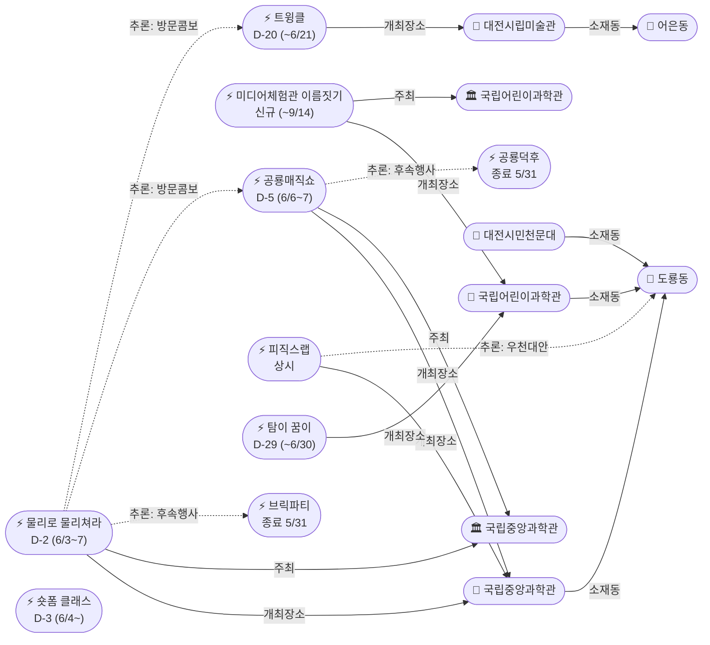

# 2026-06-01 유성구 어린이·가족 이벤트 일일 보고서

## 요약

**월요일, 6월 첫날 — 5월 대종료 다음 날, 콘텐츠 전환기.** (1) 어제(5/31) 공룡덕후박람회·브릭파티·봄꽃전시회·천문대특별전시·가디언즈·팝업 2건이 일괄 종료되면서 **도룡동 과학관 권역 콘텐츠가 대폭 감소**. (2) 그러나 **물리로 물리쳐라! D-2**(6/3~7)와 **공룡매직쇼 D-5**(6/6~7)가 각각 수요일·토요일에 개시되어 과학관 콘텐츠 공백은 이틀(6/1~2)뿐. (3) **신규 발견 1건** — 국립어린이과학관 미디어체험관 이름 짓기 이벤트(~9/14). (4) 진행 중인 전시·체험(트윙클·탐이꿈이·피직스랩·천문대·아쿠아리움)은 정상 운영. (5) 신규 오픈 가게 0건, 활성 윈도우 가게 0건(팝업 2건 어제 종료 → archived).

---

## 용성로20 주변 (도보권 0.5km 내)

금일 도보권(ring-walk, 0.5km) 내 신규 이벤트 없음.

---

## 오늘의 추천 (가족 동반 Top 5)

| # | 이벤트 | 장소 | 대상 | 비용 | 비고 |
|---|--------|------|------|------|------|
| 1 | **열한번째 트윙클** | 대전시립미술관(어은동) | 유아·초등·가족 | 무료 | 6월 유일한 대형 미술 전시 — ~6/21 (D-20) |
| 2 | **탐이 꿈이의 비밀 실험실** | 국립어린이과학관(도룡동) | 유아·초등저학년 | 유료·사전예약 | ~6/30 (D-29) |
| 3 | **피직스랩 상시 체험** | 국립중앙과학관 과학기술관 1층(도룡동) | 초등·가족 | 무료(입장권별도) | 33종 물리 실험 — 월요일 정상 운영 |
| 4 | **대전시민천문대 상시 관측** | 대전시민천문대(도룡동) | 전연령가족 | 무료 | 5월 특별전시 종료 후 상시 관측만 유지 |
| 5 | **대전엑스포아쿠아리움** | 엑스포과학공원(도룡동) | 전연령가족 | 유료 | 상시 체험 프로그램 — 우천 대안 |

---

## 주요 뉴스

### 1. 물리로 물리쳐라! D-2 — 수요일 개시
- **출처:** [국립중앙과학관 행사안내](https://www.science.go.kr/mps/1070/bbs/431/moveBbsNttList.do)
- **일시:** 2026-06-03 ~ 6/07 (**D-2**)
- **장소:** 국립중앙과학관 사이언스터널 및 미래기술관 3층 (도룡동, ring-car ~3.2km)
- **대상:** 초등저학년·초등고학년·전연령가족
- **비용:** 미확인 | **실내/야외:** 실내
- **상태:** 업데이트 (← 2026-05-31 "D-3 예고"에서 **D-2**)
- **관련 엔티티:** ent-evt-048, ent-venue-005, ent-org-006
- **비고:** 브릭파티(5/23~31) 종료 후 동일 장소(사이언스터널) 교체 행사. 아날로그 감성 물리놀이터 콘셉트. 6/6~7 공룡매직쇼와 도룡동 콤보 가능.

### 2. 공룡매직쇼 D-5 — 토요일 개시
- **출처:** [국립중앙과학관 행사안내](https://www.science.go.kr/mps/1070/bbs/431/moveBbsNttList.do)
- **일시:** 2026-06-06 ~ 6/07 (**D-5**)
- **장소:** 국립중앙과학관 사이언스홀 (도룡동, ring-car ~3.2km)
- **대상:** 유아·초등저학년·초등고학년
- **비용:** 미확인 | **실내/야외:** 실내
- **상태:** 업데이트 (← 2026-05-31 "D-6 예고"에서 **D-5**)
- **관련 엔티티:** ent-evt-047, ent-venue-005, ent-org-006
- **비고:** 공룡덕후박람회(5/30~31) 종료 후 공룡 테마 후속 행사. 6/6~7 물리놀이터와 동시 운영 — 과학관 2종 콤보.

---

## 신규 이벤트

### 1. 국립어린이과학관 미디어체험관 이름 짓기 이벤트
- **출처:** [국립어린이과학관 페이스북](https://www.facebook.com/scijoy2017/posts/)
- **일시:** ~2026-09-14 (온라인 참여)
- **장소:** 국립어린이과학관 (도룡동, ring-car ~3.2km) — 온라인 이벤트
- **대상:** 전연령가족
- **비용:** 무료
- **상태:** 신규
- **관련 엔티티:** ent-evt-049, ent-venue-004, ent-org-005
- **비고:** 2025~2026 전시개선사업으로 신설하는 몰입형 실감미디어아트 체험관의 이름을 공모. 온라인 응모 — 방문 불필요.

---

## 신규 오픈 가게·팝업·프로모션

금일 신규 발견 없음. **활성 윈도우 내 가게 0건** (50일 윈도우 기준).

> 어제(5/31) 무브먼트랩·헌터 팝업 2건이 운영 종료되어 오늘(6/1)부터 `archived` 전환 완료. 현재 활성 윈도우 가게가 없습니다.

### 사용자 제보 처리 현황

| 제보 가게 | 동 | 상태 | 비고 |
|-----------|-----|------|------|
| 엉클부대찌개 테크노점 | 관평동 | resolved_not_new | 2025년 10~11월 오픈 추정. 50일 윈도우 미해당. |
| 인터뷰커피라운지 | 도룡동 | resolved_not_new | 2024년 7월 오픈. 기존 카페. |
| 유성닭발 관평점 | 관평동 | excluded | 주류 전문 — scope.exclude 적용. |

---

## 공공기관 주최 행사 (행정복지센터·보건소·복지관·도서관·우체국·경찰서·소방서)

- **119시민체험센터:** 월요일 **휴무**. 화~토 운영 (09:30~11:30/13:30~15:30).
- **유성이의 튼튼스쿨:** 상반기 모집 마감 완료. 하반기 8/19~11/27 예정.
- **유성구 도서관:** 6월 성인 대상 프로그램 접수 중. 어린이 대상 6월 신규 프로그램은 금일 기준 미확인.
- 기타 공공기관(행정복지센터·보건소·복지관·우체국·경찰서·소방서) 주최 신규 어린이 행사: **금일 신규 없음**.

---

## 마감 임박 (사전신청 D-3 이내)

| 이벤트 | 일시 | 장소 | 마감 상태 |
|--------|------|------|----------|
| 숏폼 제작 클래스 | 6/4~25 (매주 수) | 진잠도서관 | 접수 마감 완료(5/28) — 행사 D-3 |

> 숏폼 클래스는 접수가 이미 마감되었으나 행사 자체가 6/4(수) 시작으로 D-3입니다. 추가 접수 불가.

---

## 5월 종료 현황

어제(5/31)에 7건의 행사·전시·팝업이 일괄 종료되었습니다.

| 이벤트 | 유형 | 종료일 | 비고 |
|--------|------|--------|------|
| 공룡덕후박람회 | 과학관 행사 | 5/31 | 후속: 공룡매직쇼(6/6~7) |
| 사이언스 브릭파티 | 과학관 전시 | 5/31 | 후속: 물리로 물리쳐라(6/3~7) |
| 가디언즈: 빛의 수호자들 | 과학관 체험 | 5/31 | 1일 행사 완료 |
| 유성봄꽃전시회 | 야외 전시 | 5/31 | 24일간 전시 종료 |
| 대전시민천문대 운석전시 | 실내 전시 | 5/31 | 5월 특별전시 종료 |
| 무브먼트랩 팝업 IN 대전 | 팝업스토어 | 5/31 | 현대프리미엄아울렛 2층 |
| 헌터 팝업 IN 대전 | 팝업스토어 | 5/31 | 현대프리미엄아울렛 2층 |

---

## 차기 행사 카운트다운

| 이벤트 | 시작일 | D-day | 장소 | 비고 |
|--------|--------|-------|------|------|
| **물리로 물리쳐라!** | 6/3 (수) | **D-2** | 국립중앙과학관 사이언스터널 | 브릭파티 후속 |
| **숏폼 제작 클래스** | 6/4 (수) | **D-3** | 진잠도서관 | 접수 마감 완료 |
| **공룡매직쇼** | 6/6 (금) | **D-5** | 국립중앙과학관 사이언스홀 | 공룡덕후 후속 |

---

## 동심원별 묶음

### ring-car (차량 10분 내, ~5km)

**도룡동 과학관 권역 — 전환기:**
| 이벤트 | 장소 | 상태 |
|--------|------|------|
| 피직스랩 상시 체험 | 과학기술관 1층 | 상시 운영 |
| 탐이 꿈이의 비밀 실험실 | 국립어린이과학관 | 진행중 (~6/30) |
| 물리로 물리쳐라! | 사이언스터널 | D-2 (6/3~) |
| 공룡매직쇼 | 사이언스홀 | D-5 (6/6~) |
| 미디어체험관 이름짓기 | 국립어린이과학관(온라인) | 신규(~9/14) |

**도룡동 천문대:**
| 이벤트 | 장소 | 상태 |
|--------|------|------|
| 상시 관측 프로그램 | 대전시민천문대 | 상시 운영 |

**어은동:**
| 이벤트 | 장소 | 상태 |
|--------|------|------|
| 열한번째 트윙클 | 대전시립미술관 | 진행중 (~6/21, D-20) |

---

## 동(洞)별 이벤트 묶음

| 동 | 이벤트 수 | 주요 내용 |
|----|----------|----------|
| **도룡동** | 5 | 피직스랩(상시) + 탐이꿈이(~6/30) + 물리놀이터(D-2) + 공룡매직쇼(D-5) + 미디어체험관 이름짓기(신규) |
| **어은동** | 1 | 트윙클(~6/21) |
| **진잠동** | 1 | 숏폼 클래스(D-3, 접수 마감) |

---

## 연령대별 묶음

| 연령대 | 이벤트 |
|--------|--------|
| 영유아 | 탐이 꿈이의 비밀 실험실 |
| 유아 | 탐이 꿈이, 공룡매직쇼(D-5), 열한번째 트윙클 |
| 초등저학년 | 물리로 물리쳐라(D-2), 공룡매직쇼(D-5), 피직스랩, 탐이 꿈이 |
| 초등고학년 | 물리로 물리쳐라(D-2), 공룡매직쇼(D-5), 피직스랩 |
| 전연령가족 | 열한번째 트윙클, 피직스랩, 천문대 상시 관측, 아쿠아리움, 미디어체험관 이름짓기 |

---

## 시리즈/정기 프로그램 업데이트

### 국립중앙과학관 가정의 달 → 6월 행사 교체 시리즈

| 주차 | 행사 | 기간 | 상태 |
|------|------|------|------|
| W1 (5/1~3) | 갓생 일시정지, 동심 로그인 | 5/1~3 | 종료 |
| W2 (5/9~10) | 가족뮤지컬 알라딘 | 5/9~10 | 종료 |
| W3 (5/16~17) | 초능력 히어로 박람회 | 5/16~17 | 종료 |
| W4~5 (5/23~31) | 사이언스 브릭파티 | 5/23~31 | 종료(어제) |
| W5 (5/30~31) | 공룡덕후박람회 | 5/30~31 | 종료(어제) |
| **W6 (6/3~7)** | **물리로 물리쳐라!** | 6/3~7 | **D-2** |
| **W6~7 (6/6~7)** | **공룡매직쇼** | 6/6~7 | **D-5** |

> 5월 가정의 달 행사가 전부 종료되었으나, 과학관의 주간 단위 행사 교체 패턴은 6월에도 연속. 6/3(수)부터 과학관 콘텐츠가 다시 살아납니다.

### 탐이 꿈이의 비밀 실험실
- 4/1~6/30 상시 운영. 유료, 사전예약 필요. 잔여 29일.

### 열한번째 트윙클
- 3/18~6/21 진행중. 대전시립미술관 어린이미술기획전. 잔여 20일.

---

## 지식그래프

### 오늘의 주요 관계
1. **물리로 물리쳐라 → followsEvent → 브릭파티** (0.8): 사이언스터널 콘텐츠 교체 확정. D-2.
2. **공룡매직쇼 → followsEvent → 공룡덕후박람회** (0.8): 공룡 테마 후속 행사 확정. D-5.
3. **물리로 물리쳐라 ↔ 공룡매직쇼 visitCombo** (0.75): 도룡동 6/6~7 동시 개최 — 과학관 2종 콤보.
4. **물리로 물리쳐라 ↔ 트윙클 visitCombo** (0.7): 도룡동/서구 인접 실내 콤보.
5. **피직스랩 rainyFallbackFor outdoor** (0.8): 실내 체험 — 우천 시 도룡동 대안.
6. **미디어체험관 이름짓기(신규)** → organizedBy → 국립어린이과학관, hostsAt → 국립어린이과학관.

### 전체 지식그래프 시각화

---

## 온톨로지 변경

| 변경 유형 | 대상 | 근거 |
|----------|------|------|
| 새 인스턴스 | Event: 미디어체험관 이름 짓기 이벤트 (ent-evt-049) | 국립어린이과학관 페이스북 — 몰입형 실감미디어아트 체험관 이름 공모(~9/14) |
| 상태 변경 | 7건 종료 (ent-evt-027/028/033/037/038/046) | 5/31 종료 확정 |
| 상태 변경 | 5건 카운트다운 갱신 (ent-evt-048 D-2, 047 D-5, 045 D-3, 039 D-20, 015 D-29) | 일자 경과 |

---

## 추론 결과

| 추론 | 신뢰도 | 근거 |
|------|--------|------|
| 물리로 물리쳐라 → followsEvent → 브릭파티 | 0.80 | 동일 장소(사이언스터널), 과학 체험 테마, 3일 간격 교체 |
| 공룡매직쇼 → followsEvent → 공룡덕후박람회 | 0.80 | 동일 기관(과학관), 공룡 테마 연속, 6일 간격 |
| 물리로 물리쳐라 ↔ 공룡매직쇼 visitCombo | 0.75 | 도룡동 6/6~7 동시 개최 |
| 물리로 물리쳐라 ↔ 트윙클 visitCombo | 0.70 | 도룡동/서구 인접, 둘 다 실내 |
| 물리로 물리쳐라·공룡매직쇼 kidFriendlyBoost +0.2 | 0.90 | 국립중앙과학관(과학관) 운영 어린이 대상 |
| 피직스랩 rainyFallbackFor outdoor | 0.80 | 실내 체험 — 우천 시 도룡동 대안 |

---

## 추적 항목

| 항목 | 최초 보고 | 상태 | 최신 업데이트 |
|------|----------|------|-------------|
| 물리로 물리쳐라! | 05-31 | **D-2** | 6/3(수) 개시 2일 전 |
| 공룡매직쇼 | 05-31 | **D-5** | 6/6(금) 개시 5일 전 |
| 열한번째 트윙클 | 05-14 | 진행중 | ~6/21 잔여 20일 |
| 피직스랩 | 05-17 | 상시 운영 | 33종 물리 실험 |
| 탐이 꿈이의 비밀 실험실 | 04-26 | 진행중 | ~6/30 잔여 29일 |
| 숏폼 클래스 | 05-17 | 접수 마감 | 6/4~25, D-3 |
| 대전시민천문대 | 04-25 | 상시 관측 | 5월 특별전시 종료, 상시 관측만 |
| 대전엑스포아쿠아리움 | 04-26 | 상시 운영 | 특이사항 없음 |
| **미디어체험관 이름짓기** | **06-01** | **신규** | 온라인 공모 ~9/14 |
| 공룡덕후박람회 | 04-30 | **종료** | 5/31 종료 |
| 사이언스 브릭파티 | 04-30 | **종료** | 5/31 종료 |
| 유성봄꽃전시회 | 05-08 | **종료** | 5/31 종료 |
| 천문대 운석전시·사진전 | 05-13 | **종료** | 5/31 종료 |
| 가디언즈: 빛의 수호자들 | 05-29 | **종료** | 5/31 종료 |
| 무브먼트랩·헌터 팝업 | 05-24 | **종료→archived** | 5/31 운영 종료 |

---

## 동향 요약

| 분류 | 상태 | 비고 |
|------|------|------|
| 도룡동 과학관 | 콘텐츠 공백(6/1~2) → 6/3 재개 | 물리놀이터 D-2, 공룡매직쇼 D-5 |
| 어은동 미술관 | 트윙클 진행중 | 6월 유일한 대형 전시 (D-20) |
| 관평동 팝업 | 전량 종료 → archived | 6월 신규 팝업 미확인 |
| 공공기관 | 119시민체험센터 월요일 휴무 | 6월 프로그램 미공개 |
| 신규 오픈 가게 | 발견 없음 | active_shops = 0 |
| 신규 이벤트 | 미디어체험관 이름짓기 1건 | 온라인 공모(~9/14) |

---

## 출처 목록

1. [물리로 물리쳐라 / 공룡매직쇼](https://www.science.go.kr/mps/1070/bbs/431/moveBbsNttList.do) - 국립중앙과학관 행사안내
2. [열한번째 트윙클](https://www.koreaunionnews.com/2046689) - 한국연합신문
3. [피직스랩](https://www.news1.kr/local/daejeon-chungnam/6047996) - 뉴스1
4. [탐이 꿈이의 비밀 실험실](https://www.science.go.kr/mps/cntnts/1063/moveCntnts.do) - 국립중앙과학관
5. [숏폼 제작 클래스](https://www.shinailbo.co.kr/news/articleView.html?idxno=1833539) - 신아일보
6. [119시민체험센터](https://www.daejeon.go.kr/dj119/CmmContentsHtmlView.do?menuSeq=5092) - 대전광역시
7. [대전시민천문대](https://djstar.kr/) - 대전시민천문대
8. [대전엑스포아쿠아리움](https://djexpoaqua.com/) - 대전엑스포아쿠아리움
9. [미디어체험관 이름짓기](https://www.facebook.com/scijoy2017/posts/) - 국립어린이과학관 페이스북
