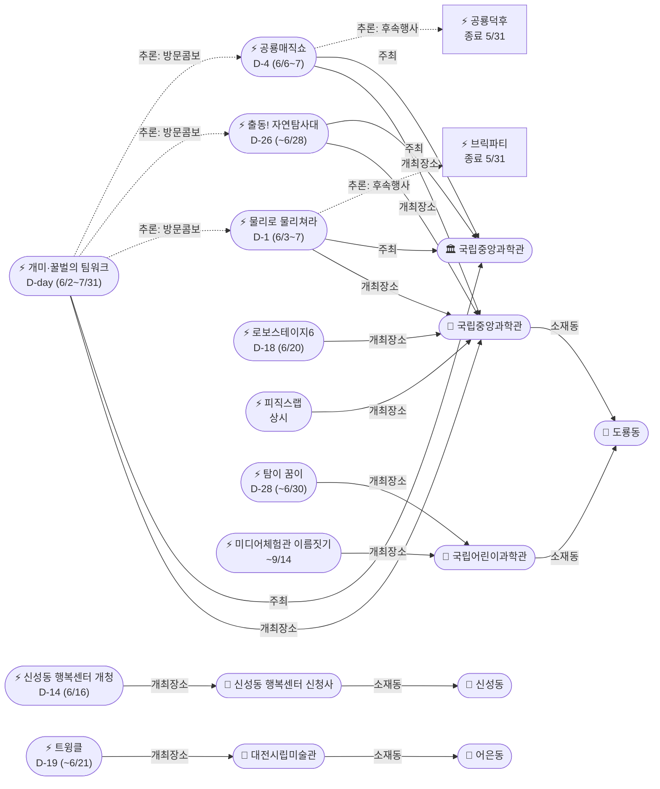

# 2026-06-02 유성구 어린이·가족 이벤트 일일 보고서

## 요약

**화요일 — 도룡동 과학관 콘텐츠 대폭 회복.** (1) **개미·꿀벌의 팀워크** 특별전시(자연사관, 6/2~7/31) 오늘 개막 — 2개월 장기 전시로 도룡동 과학관 핵심 콘텐츠 확보. (2) **출동! 첨단 미래 자연탐사대**(사이언스터널, 4/21~6/28) 누락 복구 — 이미 진행 중인 AR 자연탐사 체험 전시 최초 추적. (3) **물리로 물리쳐라! D-1** — 내일(6/3) 사이언스터널 개시. (4) **신성동 행정복지센터 신청사 개청**(6/16) — 1차 타겟 동(신성동) 최초 공공기관 행사, 수유실·공유주방 등 가족 편의시설 확충. (5) 6/20 과학관 행사 2건(로보스테이지6·별별뷰티) 예고. 어제 "콘텐츠 공백" 진단은 **오늘 3건 신규 발견으로 즉시 수정** — 실제로는 과학관 상시 체험에 더해 신규 전시가 가동 중이었음.

---

## 용성로20 주변 (도보권 0.5km 내)

금일 도보권(ring-walk, 0.5km) 내 신규 이벤트 없음.

---

## 오늘의 추천 (가족 동반 Top 5)

| # | 이벤트 | 장소 | 대상 | 비용 | 비고 |
|---|--------|------|------|------|------|
| 1 | **개미·꿀벌의 팀워크** | 국립중앙과학관 자연사관(도룡동) | 유아·초등·가족 | 무료(입장권별도) | **D-day 오늘 개막** — 2개월 장기(~7/31) |
| 2 | **열한번째 트윙클** | 대전시립미술관(어은동) | 유아·초등·가족 | 무료 | 6월 대형 미술 전시 — ~6/21 (D-19) |
| 3 | **출동! 첨단 미래 자연탐사대** | 국립중앙과학관 사이언스터널(도룡동) | 초등·가족 | 미확인 | 진행중 — ~6/28 (D-26). AR 탐사 체험 |
| 4 | **피직스랩 상시 체험** | 국립중앙과학관 과학기술관 1층(도룡동) | 초등·가족 | 무료(입장권별도) | 33종 물리 실험 — 상시 운영 |
| 5 | **탐이 꿈이의 비밀 실험실** | 국립어린이과학관(도룡동) | 유아·초등저학년 | 유료·사전예약 | ~6/30 (D-28) |

---

## 주요 뉴스

### 1. 개미·꿀벌의 팀워크 — D-day 오늘 개막
- **출처:** [국립중앙과학관 행사안내](https://www.science.go.kr/mps/1070/bbs/431/moveBbsNttList.do), [국립중앙과학관 Instagram](https://www.instagram.com/nsmscience/)
- **일시:** 2026-06-02 ~ 7/31 (**D-day 오늘 개막**, 약 2개월)
- **장소:** 국립중앙과학관 자연사관 (도룡동, ring-car ~3.2km)
- **대상:** 유아·초등저학년·초등고학년·전연령가족
- **비용:** 무료(입장권별도) | **실내/야외:** 실내
- **상태:** 신규
- **관련 엔티티:** ent-evt-050, ent-venue-005, ent-org-006
- **비고:** 개미와 꿀벌의 사회적 행동·협력을 체험형 전시로 선보이는 자연사관 특별전. 곤충 주제로 어린이 관심도 높음. 6월~7월 장기 운영으로 방문 시간적 여유 있음. 도룡동 과학관 내 피직스랩·탐이꿈이·자연탐사대와 콤보 방문 가능.

### 2. 출동! 첨단 미래 자연탐사대 — 누락 복구 (진행중 ~6/28)
- **출처:** [정책브리핑 보도자료](https://www.korea.kr/briefing/pressReleaseView.do?newsId=156756613), [코리아타임뉴스](https://www.koreatimenews.com/news/article.html?no=1040910)
- **일시:** 2026-04-21 ~ 6/28 (진행중, **D-26**)
- **장소:** 국립중앙과학관 사이언스터널 (도룡동, ring-car ~3.2km)
- **대상:** 초등저학년·초등고학년·전연령가족
- **비용:** 미확인 | **실내/야외:** 실내
- **상태:** 신규 (누락 복구 — 4/21 시작이었으나 이전 보고서에서 미추적)
- **관련 엔티티:** ent-evt-051, ent-venue-005, ent-org-006, ent-org-009
- **비고:** 과기정통부+국립중앙과학관 공동 주관. 멸종위기 생물 보전·AR 기술 활용 자연탐사 체험. "박사님의 비밀 가방을 열어라!" 부제. 사이언스터널 전시로, 내일(6/3) 시작하는 '물리로 물리쳐라!'와 동일 건물 내 위치.

### 3. 물리로 물리쳐라! D-1 — 내일 개시
- **출처:** [국립중앙과학관 행사안내](https://www.science.go.kr/mps/1070/bbs/431/moveBbsNttList.do)
- **일시:** 2026-06-03 ~ 6/07 (**D-1**)
- **장소:** 국립중앙과학관 사이언스터널 및 미래기술관 3층 (도룡동, ring-car ~3.2km)
- **대상:** 초등저학년·초등고학년·전연령가족
- **비용:** 미확인 | **실내/야외:** 실내
- **상태:** 업데이트 (← 2026-06-01 "D-2"에서 **D-1**)
- **관련 엔티티:** ent-evt-048, ent-venue-005, ent-org-006
- **비고:** 아날로그 감성 물리놀이터. 브릭파티(5/23~31) 종료 후 동일 장소 교체 행사. 자연탐사대(사이언스터널)와 동시 운영.

---

## 신규 이벤트

### 1. 개미·꿀벌의 팀워크 (D-day 개막)
- 상세는 주요 뉴스 #1 참조.

### 2. 출동! 첨단 미래 자연탐사대 (누락 복구, 진행중)
- 상세는 주요 뉴스 #2 참조.

### 3. 신성동 행정복지센터 신청사 개청 (D-14)
- **출처:** [대전일보](https://www.daejonilbo.com/news/articleView.html?idxno=2208409), [유성구청 페이스북](https://www.facebook.com/happyyuseong/posts/1116846043814102/)
- **일시:** 2026-06-16 (월) — **D-14**
- **장소:** 대전 유성구 신성로 55 (신성동, ring-bike ~1.5km)
- **대상:** 전연령 (행정 시설)
- **비용:** 해당없음
- **비고:** 1차 타겟 동(신성동)에서 최초로 포착된 공공기관 행사. 기존 청사 철거 후 같은 부지에 지하1층~지상2층(연면적 2842㎡) 신축. **수유실**, 다목적실, **공유주방**, 세미나실 마련으로 가족 접근성 향상. 2023년 9월부터 임시청사에서 운영했으며 드디어 신청사 복귀.

### 4. 로보스테이지6 : Kick Off! (D-18)
- **출처:** [국립중앙과학관 행사안내](https://www.science.go.kr/mps/1070/bbs/431/moveBbsNttList.do)
- **일시:** 2026-06-20 (토) — **D-18**
- **장소:** 국립중앙과학관 (도룡동, ring-car ~3.2km)
- **대상:** 초등저학년·초등고학년
- **비용:** 미확인 (사전예약 가능성)
- **비고:** 로봇 체험 정기 프로그램 시리즈 6회차. 같은 날 별별뷰티 특강과 동시 운영.

### 5. 별의별 과학특강 : 별별뷰티 (D-18)
- **출처:** [국립중앙과학관 행사안내](https://www.science.go.kr/mps/1070/bbs/431/moveBbsNttList.do)
- **일시:** 2026-06-20 (토) — **D-18**
- **장소:** 국립중앙과학관 (도룡동, ring-car ~3.2km)
- **대상:** 초등고학년·중학생이상
- **비용:** 미확인 (사전예약 가능성)
- **비고:** 뷰티 과학(화장품·피부과학) 특강. 초등 고학년 이상 타겟.

---

## 신규 오픈 가게·팝업·프로모션

금일 신규 발견 없음. **활성 윈도우 내 가게 0건** (50일 윈도우 기준).

> 6/1부터 무브먼트랩·헌터 팝업 2건 `archived` 전환 완료. 현재 활성 윈도우 가게가 없습니다.

### 사용자 제보 처리 현황

| 제보 가게 | 동 | 상태 | 비고 |
|-----------|-----|------|------|
| 엉클부대찌개 테크노점 | 관평동 | resolved_not_new | 2025년 10~11월 오픈 추정. 50일 윈도우 미해당. |
| 인터뷰커피라운지 | 도룡동 | resolved_not_new | 2024년 7월 오픈. 기존 카페. |
| 유성닭발 관평점 | 관평동 | excluded | 주류 전문 — scope.exclude 적용. |

---

## 공공기관 주최 행사 (행정복지센터·보건소·복지관·도서관·우체국·경찰서·소방서)

- **신성동 행정복지센터:** **신청사 개청 D-14** (6/16). 수유실·다목적실·공유주방 마련. → 신규 이벤트 #3 참조.
- **119시민체험센터:** **화요일 운영 재개**. 화~토 09:30~11:30/13:30~15:30 무료 체험.
- **유성이의 튼튼스쿨:** 상반기 모집 마감 완료. 하반기 8/19~11/27 예정.
- **유성구 도서관:** 숏폼 제작 클래스 D-2 (6/4~25, 진잠도서관, 접수 마감 완료).
- 기타 공공기관(보건소·복지관·우체국·경찰서·소방서) 주최 신규 어린이 행사: **금일 신규 없음**.

---

## 마감 임박 (사전신청 D-3 이내)

| 이벤트 | 일시 | 장소 | 마감 상태 |
|--------|------|------|----------|
| **물리로 물리쳐라!** | 6/3~7 | 국립중앙과학관 사이언스터널 | **D-1** — 내일 개시 |
| 숏폼 제작 클래스 | 6/4~25 (매주 수) | 진잠도서관 | 접수 마감 완료(5/28) — 행사 D-2 |

---

## 동심원별 묶음

### ring-bike (자전거·짧은 차량, ~2km)

**신성동:**
| 이벤트 | 장소 | 상태 |
|--------|------|------|
| 신성동 행정복지센터 신청사 개청 | 신성로 55 | D-14 (6/16) |

### ring-car (차량 10분 내, ~5km)

**도룡동 과학관 권역 — 콘텐츠 대폭 회복:**
| 이벤트 | 장소 | 상태 |
|--------|------|------|
| **개미·꿀벌의 팀워크** | 자연사관 | **D-day 개막** (~7/31) |
| **출동! 첨단 미래자연탐사대** | 사이언스터널 | 진행중 (~6/28, D-26) |
| 물리로 물리쳐라! | 사이언스터널+미래기술관 3층 | D-1 (6/3~7) |
| 공룡매직쇼 | 사이언스홀 | D-4 (6/6~7) |
| 피직스랩 상시 체험 | 과학기술관 1층 | 상시 운영 |
| 탐이 꿈이의 비밀 실험실 | 국립어린이과학관 | 진행중 (~6/30) |
| 로보스테이지6 | 국립중앙과학관 | D-18 (6/20) |
| 별별뷰티 | 국립중앙과학관 | D-18 (6/20) |
| 미디어체험관 이름짓기 | 국립어린이과학관(온라인) | 진행중 (~9/14) |

**도룡동 천문대:**
| 이벤트 | 장소 | 상태 |
|--------|------|------|
| 상시 관측 프로그램 | 대전시민천문대 | 상시 운영 (화~일) |

**어은동:**
| 이벤트 | 장소 | 상태 |
|--------|------|------|
| 열한번째 트윙클 | 대전시립미술관 | 진행중 (~6/21, D-19) |

---

## 동(洞)별 이벤트 묶음

| 동 | 이벤트 수 | 주요 내용 |
|----|----------|----------|
| **도룡동** | 9 | 팀워크(D-day) + 자연탐사대(D-26) + 물리놀이터(D-1) + 공룡매직쇼(D-4) + 피직스랩(상시) + 탐이꿈이(~6/30) + 로보스테이지(D-18) + 별별뷰티(D-18) + 미디어체험관(온라인) |
| **신성동** | 1 | 행정복지센터 신청사 개청(D-14) |
| **어은동** | 1 | 트윙클(~6/21) |
| **진잠동** | 1 | 숏폼 클래스(D-2, 접수 마감) |

---

## 연령대별 묶음

| 연령대 | 이벤트 |
|--------|--------|
| 영유아 | 탐이 꿈이의 비밀 실험실 |
| 유아 | 개미·꿀벌의 팀워크(D-day), 공룡매직쇼(D-4), 열한번째 트윙클 |
| 초등저학년 | 개미·꿀벌의 팀워크(D-day), 출동! 자연탐사대(D-26), 물리로 물리쳐라(D-1), 공룡매직쇼(D-4), 피직스랩, 로보스테이지6(D-18) |
| 초등고학년 | 개미·꿀벌의 팀워크(D-day), 출동! 자연탐사대(D-26), 물리로 물리쳐라(D-1), 공룡매직쇼(D-4), 피직스랩, 로보스테이지6(D-18), 별별뷰티(D-18) |
| 전연령가족 | 개미·꿀벌의 팀워크, 열한번째 트윙클, 피직스랩, 천문대 상시 관측, 아쿠아리움, 미디어체험관 이름짓기 |

---

## 시리즈/정기 프로그램 업데이트

### 국립중앙과학관 6월 행사 시리즈

| 주차 | 행사 | 기간 | 상태 |
|------|------|------|------|
| **상설** | **개미·꿀벌의 팀워크** | 6/2~7/31 | **D-day 오늘 개막** |
| **진행중** | **출동! 첨단 미래자연탐사대** | 4/21~6/28 | 진행중 (D-26) |
| W1 (6/3~7) | 물리로 물리쳐라! | 6/3~7 | D-1 |
| W1 (6/6~7) | 공룡매직쇼 | 6/6~7 | D-4 |
| W3 (6/20) | 로보스테이지6 : Kick Off! | 6/20 | D-18 |
| W3 (6/20) | 별의별 과학특강 : 별별뷰티 | 6/20 | D-18 |

> 5월 종료 행사(브릭파티·공룡덕후·히어로 등) 이후 6월 콘텐츠 라인업이 본격 공개. 2개월 장기 전시(팀워크)와 진행 중 전시(자연탐사대)가 도룡동 과학관 콘텐츠 밀도를 회복시킴.

### 탐이 꿈이의 비밀 실험실
- 4/1~6/30 상시 운영. 유료, 사전예약 필요. 잔여 28일.

### 열한번째 트윙클
- 3/18~6/21 진행중. 대전시립미술관 어린이미술기획전. 잔여 19일.

---

## 지식그래프

### 오늘의 주요 관계
1. **개미·꿀벌의 팀워크 → hostsAt → 국립중앙과학관** (0.95): D-day 오늘 개막. 자연사관 특별전시.
2. **출동! 자연탐사대 → hostsAt → 국립중앙과학관** (0.90): 누락 복구. 사이언스터널 진행 중.
3. **팀워크 ↔ 물리놀이터 ↔ 자연탐사대 visitCombo** (0.80~0.85): 도룡동 과학관 내 3종 동시 운영.
4. **팀워크 ↔ 공룡매직쇼 visitCombo** (0.75): 6/6~7 동시 운영.
5. **팀워크·자연탐사대 kidFriendlyBoost +0.2** (0.90): 국립중앙과학관(과학관) 운영.
6. **신성동 행정복지센터 → locatedIn → 신성동** (0.95): 1차 타겟 동 최초 공공기관 행사.
7. **로보스테이지6 → partOfSeries → 로보스테이지시리즈** (0.80): 정기 로봇 프로그램 6회차.

### 전체 지식그래프 시각화

---

## 온톨로지 변경

| 변경 유형 | 대상 | 근거 |
|----------|------|------|
| 새 인스턴스 | Event: 개미·꿀벌의 팀워크 (ent-evt-050) | 국립중앙과학관 행사안내 — 자연사관 특별전시 6/2~7/31 |
| 새 인스턴스 | Event: 출동! 첨단 미래 자연탐사대 (ent-evt-051) | 정책브리핑 보도자료 — 사이언스터널 4/21~6/28, 누락 복구 |
| 새 인스턴스 | Event: 신성동 행정복지센터 신청사 개청 (ent-evt-052) | 대전일보·유성구청 — 6/16 개청 |
| 새 인스턴스 | Event: 로보스테이지6 (ent-evt-053) | 국립중앙과학관 — 6/20 로봇 체험 |
| 새 인스턴스 | Event: 별별뷰티 (ent-evt-054) | 국립중앙과학관 — 6/20 과학특강 |
| 새 인스턴스 | Venue: 신성동 행정복지센터 신청사 (ent-venue-027) | 대전일보 — 신성로 55, 지하1층~지상2층 |
| 새 인스턴스 | Organization: 신성동 행정복지센터 (ent-org-025) | 대전일보 — 행정복지센터 |
| 상태 변경 | 5건 카운트다운 갱신 | ent-evt-048 D-1, 047 D-4, 045 D-2, 039 D-19, 015 D-28 |

---

## 추론 결과

| 추론 | 신뢰도 | 근거 |
|------|--------|------|
| 개미·꿀벌 팀워크 kidFriendlyBoost +0.2 | 0.90 | 국립중앙과학관(과학관) 운영 어린이 대상 전시 |
| 출동! 자연탐사대 kidFriendlyBoost +0.2 | 0.90 | 과기정통부+과학관 운영 AR 체험 전시 |
| 팀워크 ↔ 물리놀이터 visitCombo | 0.80 | 도룡동 6/3~7 기간 동시 운영 |
| 팀워크 ↔ 자연탐사대 visitCombo | 0.85 | 도룡동 동일 과학관 내 동시 전시 |
| 팀워크 ↔ 공룡매직쇼 visitCombo | 0.75 | 도룡동 6/6~7 동시 운영 |
| 신성동 행정복지센터 publicTrustBoost +0.15 | 0.70 | 행정복지센터 공공기관 행사 |
| 로보스테이지6 partOfSeries 로보스테이지시리즈 | 0.80 | 6회차 정기 프로그램 |
| 콘텐츠 밀도 회복 (6/1 진단 수정) | 0.95 | 어제 "공백" → 오늘 3건 발견으로 즉시 수정 |

---

## 추적 항목

| 항목 | 최초 보고 | 상태 | 최신 업데이트 |
|------|----------|------|-------------|
| **개미·꿀벌의 팀워크** | **06-02** | **D-day 개막** | 자연사관 특별전시 ~7/31 |
| **출동! 자연탐사대** | **06-02** | **진행중 (D-26)** | 사이언스터널 ~6/28, 누락 복구 |
| 물리로 물리쳐라! | 05-31 | **D-1** | 6/3(수) 개시 1일 전 |
| 공룡매직쇼 | 05-31 | **D-4** | 6/6(금) 개시 4일 전 |
| 열한번째 트윙클 | 05-14 | 진행중 | ~6/21 잔여 19일 |
| 피직스랩 | 05-17 | 상시 운영 | 33종 물리 실험 |
| 탐이 꿈이의 비밀 실험실 | 04-26 | 진행중 | ~6/30 잔여 28일 |
| 숏폼 클래스 | 05-17 | 접수 마감 | 6/4~25, D-2 |
| 대전시민천문대 | 04-25 | 상시 관측 | 화~일 14:00~22:00, 무료 |
| 대전엑스포아쿠아리움 | 04-26 | 상시 운영 | 특이사항 없음 |
| 미디어체험관 이름짓기 | 06-01 | 진행중 | 온라인 공모 ~9/14 |
| **신성동 행복센터 개청** | **06-02** | **D-14** | 6/16 신청사 업무 개시 |
| **로보스테이지6** | **06-02** | **D-18** | 6/20 로봇 체험 |
| **별별뷰티** | **06-02** | **D-18** | 6/20 과학특강 |

---

## 동향 요약

| 분류 | 상태 | 비고 |
|------|------|------|
| 도룡동 과학관 | **콘텐츠 대폭 회복** | 팀워크 D-day + 자연탐사대 누락 복구 + 물리놀이터 D-1 |
| 어은동 미술관 | 트윙클 진행중 | 6월 대형 전시 (D-19) |
| 신성동 행정 | **첫 행사 포착** | 행정복지센터 신청사 개청 D-14 |
| 관평동 팝업 | 전량 종료 | 6월 신규 팝업 미확인 |
| 공공기관 | 119시민체험센터 화요일 운영 재개 | 숏폼 클래스 D-2 |
| 신규 오픈 가게 | 발견 없음 | active_shops = 0 |
| 6/20 예고 | 2건 예고 | 로보스테이지6 + 별별뷰티 |

---

## 출처 목록

1. [개미·꿀벌의 팀워크 / 물리로 물리쳐라 / 공룡매직쇼 / 로보스테이지6 / 별별뷰티](https://www.science.go.kr/mps/1070/bbs/431/moveBbsNttList.do) - 국립중앙과학관 행사안내
2. [출동! 첨단 미래 자연탐사대](https://www.korea.kr/briefing/pressReleaseView.do?newsId=156756613) - 정책브리핑 보도자료
3. [출동! 첨단 미래 자연탐사대](https://www.koreatimenews.com/news/article.html?no=1040910) - 코리아타임뉴스
4. [신성동 행정복지센터 신청사 개청](https://www.daejonilbo.com/news/articleView.html?idxno=2208409) - 대전일보
5. [신성동 행정복지센터 신청사 이전 안내](https://www.facebook.com/happyyuseong/posts/1116846043814102/) - 유성구청 페이스북
6. [국립중앙과학관 Instagram](https://www.instagram.com/nsmscience/) - 국립중앙과학관
7. [열한번째 트윙클](https://www.koreaunionnews.com/2046689) - 한국연합신문
8. [피직스랩](https://www.news1.kr/local/daejeon-chungnam/6047996) - 뉴스1
9. [탐이 꿈이의 비밀 실험실](https://www.science.go.kr/mps/cntnts/1063/moveCntnts.do) - 국립중앙과학관
10. [숏폼 제작 클래스](https://www.shinailbo.co.kr/news/articleView.html?idxno=1833539) - 신아일보
11. [119시민체험센터](https://www.daejeon.go.kr/dj119/CmmContentsHtmlView.do?menuSeq=5092) - 대전광역시
12. [대전시민천문대](https://djstar.kr/) - 대전시민천문대
13. [대전엑스포아쿠아리움](https://djexpoaqua.com/) - 대전엑스포아쿠아리움
14. [미디어체험관 이름짓기](https://www.facebook.com/scijoy2017/posts/) - 국립어린이과학관 페이스북
