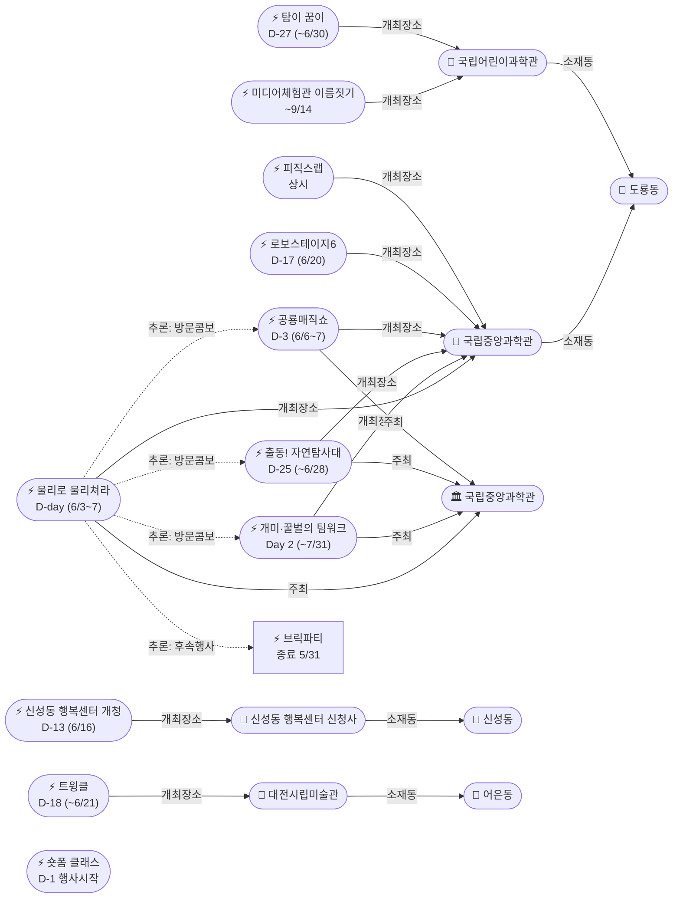

# 2026-06-03 유성구 어린이·가족 이벤트 일일 보고서

## 요약

**수요일 — 물리로 물리쳐라! D-day 개시.** (1) **물리로 물리쳐라!** 오늘(6/3) 사이언스터널+미래기술관 3층에서 개시(~6/7) — 팀 미션 게임·물리 교구 체험·서커스 워크숍·진로 강연. (2) 도룡동 과학관 **3종 동시 운영**(물리놀이터+팀워크 Day 2+자연탐사대 D-25)으로 6월 첫 주 최대 콘텐츠 밀도. (3) **공룡매직쇼 D-3** — 이번 주 금~토(6/6~7) 사이언스홀, 물리놀이터와 마지막 2일 겹침. (4) **숏폼 클래스 D-1** — 내일(6/4) 첫 수업 시작(접수 마감). 신규 이벤트 없음 — 기존 항목 카운트다운 및 D-day 전환이 핵심.

---

## 용성로20 주변 (도보권 0.5km 내)

금일 도보권(ring-walk, 0.5km) 내 신규 이벤트 없음.

---

## 오늘의 추천 (가족 동반 Top 5)

| # | 이벤트 | 장소 | 대상 | 비용 | 비고 |
|---|--------|------|------|------|------|
| 1 | **물리로 물리쳐라!** | 국립중앙과학관 사이언스터널+미래기술관 3층(도룡동) | 초등·가족 | 미확인 | **D-day 오늘 개시** (~6/7) |
| 2 | **개미·꿀벌의 팀워크** | 국립중앙과학관 자연사관(도룡동) | 유아·초등·가족 | 무료(입장권별도) | Day 2 진행중 (~7/31) |
| 3 | **출동! 첨단 미래 자연탐사대** | 국립중앙과학관 사이언스터널(도룡동) | 초등·가족 | 미확인 | 진행중 D-25 (~6/28) |
| 4 | **열한번째 트윙클** | 대전시립미술관(어은동) | 유아·초등·가족 | 무료 | 진행중 D-18 (~6/21) |
| 5 | **피직스랩 상시 체험** | 국립중앙과학관 과학기술관 1층(도룡동) | 초등·가족 | 무료(입장권별도) | 33종 물리 실험 상시 |

> 수요일 추천: 도룡동 과학관 **3종 콤보**(물리놀이터+팀워크+자연탐사대) 한 번의 방문으로 체험. 피직스랩+탐이꿈이까지 합치면 5종.

---

## 주요 뉴스

### 1. 물리로 물리쳐라! — D-day 오늘 개시
- **출처:** [국립중앙과학관 행사안내](https://www.science.go.kr/mps/1070/bbs/431/moveBbsNttList.do)
- **일시:** 2026-06-03 ~ 6/07 (**D-day 오늘 개시**)
- **장소:** 국립중앙과학관 사이언스터널 및 미래기술관 3층 (도룡동, ring-car ~3.2km)
- **대상:** 초등저학년·초등고학년·전연령가족
- **비용:** 미확인 | **실내/야외:** 실내
- **상태:** D-day (← 어제 D-1)
- **관련 엔티티:** ent-evt-048, ent-venue-005, ent-org-006
- **비고:** 아날로그 감성 물리놀이터. 팀 미션 게임·물리 교구 체험·서커스 워크숍·진로 강연으로 구성. 브릭파티(5/23~31) 종료 후 동일 장소(사이언스터널) 교체 행사. 피직스랩(1/23 개관) 연계 확장. 자연탐사대(사이언스터널 내)와 같은 건물.

### 2. 공룡매직쇼 — D-3 이번 주 금~토
- **출처:** [국립중앙과학관 행사안내](https://www.science.go.kr/mps/1070/bbs/431/moveBbsNttList.do)
- **일시:** 2026-06-06 ~ 6/07 (**D-3**)
- **장소:** 국립중앙과학관 사이언스홀 (도룡동, ring-car ~3.2km)
- **대상:** 유아·초등저학년·초등고학년·전연령가족
- **비용:** 미확인 | **실내/야외:** 실내
- **상태:** D-3 (← 어제 D-4)
- **관련 엔티티:** ent-evt-047, ent-venue-005, ent-org-006
- **비고:** 공룡 테마 매직쇼. 물리놀이터 마지막 2일(6/6~7)과 완전 중첩 — 금~토 방문 시 둘 다 체험 가능.

---

## 신규 이벤트

금일 신규 이벤트 없음.

---

## 신규 오픈 가게·팝업·프로모션

금일 신규 발견 없음. **활성 윈도우 내 가게 0건** (50일 윈도우 기준).

> 6/1부터 무브먼트랩·헌터 팝업 2건 `archived` 전환 완료. 현재 활성 윈도우 가게가 없습니다.

### 사용자 제보 처리 현황

| 제보 가게 | 동 | 상태 | 비고 |
|-----------|-----|------|------|
| 엉클부대찌개 테크노점 | 관평동 | resolved_not_new | 2025년 10~11월 오픈 추정. 50일 윈도우 미해당. |
| 인터뷰커피라운지 | 도룡동 | resolved_not_new | 2024년 7월 오픈. 기존 카페. |
| 유성닭발 관평점 | 관평동 | excluded | 주류 전문 — scope.exclude 적용. |

---

## 공공기관 주최 행사 (행정복지센터·보건소·복지관·도서관·우체국·경찰서·소방서)

- **119시민체험센터:** **수요일 정상 운영**. 화~토 09:30~11:30/13:30~15:30 무료 체험.
- **신성동 행정복지센터:** **신청사 개청 D-13** (6/16). 수유실·다목적실·공유주방 마련.
- **유성구 도서관:** 숏폼 제작 클래스 **D-1 행사시작** (6/4~25, 진잠도서관, 접수 마감 완료). 내일 첫 수업.
- **유성이의 튼튼스쿨:** 상반기 모집 마감 완료. 하반기 8/19~11/27 예정.
- 기타 공공기관(보건소·복지관·우체국·경찰서·소방서) 주최 신규 어린이 행사: **금일 신규 없음**.

---

## 마감 임박 (사전신청 D-3 이내)

| 이벤트 | 일시 | 장소 | 마감 상태 |
|--------|------|------|----------|
| **물리로 물리쳐라!** | 6/3~7 | 국립중앙과학관 사이언스터널 | **D-day 오늘 개시** |
| **공룡매직쇼** | 6/6~7 | 국립중앙과학관 사이언스홀 | **D-3** — 이번 주 금~토 |
| 숏폼 제작 클래스 | 6/4~25 (매주 수) | 진잠도서관 | 접수 마감 완료 — **D-1 행사시작** |

---

## 동심원별 묶음

### ring-bike (자전거·짧은 차량, ~2km)

**신성동:**
| 이벤트 | 장소 | 상태 |
|--------|------|------|
| 신성동 행정복지센터 신청사 개청 | 신성로 55 | D-13 (6/16) |

### ring-car (차량 10분 내, ~5km)

**도룡동 과학관 권역 — 3종 콤보 활성화:**
| 이벤트 | 장소 | 상태 |
|--------|------|------|
| **물리로 물리쳐라!** | 사이언스터널+미래기술관 3층 | **D-day 오늘 개시** (6/3~7) |
| **개미·꿀벌의 팀워크** | 자연사관 | Day 2 진행중 (~7/31) |
| **출동! 첨단 미래자연탐사대** | 사이언스터널 | D-25 (~6/28) |
| 공룡매직쇼 | 사이언스홀 | D-3 (6/6~7) |
| 피직스랩 상시 체험 | 과학기술관 1층 | 상시 운영 |
| 탐이 꿈이의 비밀 실험실 | 국립어린이과학관 | D-27 (~6/30) |
| 로보스테이지6 | 국립중앙과학관 | D-17 (6/20) |
| 별별뷰티 | 국립중앙과학관 | D-17 (6/20) |
| 미디어체험관 이름짓기 | 국립어린이과학관(온라인) | 진행중 (~9/14) |

**도룡동 천문대:**
| 이벤트 | 장소 | 상태 |
|--------|------|------|
| 상시 관측 프로그램 | 대전시민천문대 | 상시 운영 (화~일) — 수요일 운영 |

**어은동:**
| 이벤트 | 장소 | 상태 |
|--------|------|------|
| 열한번째 트윙클 | 대전시립미술관 | D-18 (~6/21) |

---

## 동(洞)별 이벤트 묶음

| 동 | 이벤트 수 | 주요 내용 |
|----|----------|----------|
| **도룡동** | 9 | 물리놀이터(D-day) + 팀워크(Day 2) + 자연탐사대(D-25) + 공룡매직쇼(D-3) + 피직스랩(상시) + 탐이꿈이(D-27) + 로보스테이지(D-17) + 별별뷰티(D-17) + 미디어체험관(온라인) |
| **신성동** | 1 | 행정복지센터 신청사 개청(D-13) |
| **어은동** | 1 | 트윙클(D-18) |
| **진잠동** | 1 | 숏폼 클래스(D-1 행사시작) |

---

## 연령대별 묶음

| 연령대 | 이벤트 |
|--------|--------|
| 영유아 | 탐이 꿈이의 비밀 실험실(D-27) |
| 유아 | 개미·꿀벌의 팀워크(Day 2), 공룡매직쇼(D-3), 열한번째 트윙클(D-18) |
| 초등저학년 | **물리로 물리쳐라!(D-day)**, 개미·꿀벌의 팀워크(Day 2), 출동! 자연탐사대(D-25), 공룡매직쇼(D-3), 피직스랩, 로보스테이지6(D-17) |
| 초등고학년 | **물리로 물리쳐라!(D-day)**, 개미·꿀벌의 팀워크(Day 2), 출동! 자연탐사대(D-25), 공룡매직쇼(D-3), 피직스랩, 로보스테이지6(D-17), 별별뷰티(D-17) |
| 전연령가족 | 물리로 물리쳐라!, 개미·꿀벌의 팀워크, 열한번째 트윙클, 피직스랩, 천문대 상시 관측, 아쿠아리움, 미디어체험관 이름짓기 |

---

## 시리즈/정기 프로그램 업데이트

### 국립중앙과학관 6월 행사 시리즈

| 주차 | 행사 | 기간 | 상태 |
|------|------|------|------|
| **상설** | **개미·꿀벌의 팀워크** | 6/2~7/31 | Day 2 진행중 |
| **진행중** | **출동! 첨단 미래자연탐사대** | 4/21~6/28 | D-25 |
| **W1** | **물리로 물리쳐라!** | 6/3~7 | **D-day 오늘 개시** |
| **W1** | 공룡매직쇼 | 6/6~7 | D-3 |
| **W3** | 로보스테이지6 : Kick Off! | 6/20 | D-17 |
| **W3** | 별의별 과학특강 : 별별뷰티 | 6/20 | D-17 |

> W1(이번 주): 물리놀이터 D-day + 공룡매직쇼 D-3. 금~토(6/6~7) 두 행사 동시 체험 가능. 팀워크+자연탐사대+피직스랩과 합치면 도룡동 과학관 5종 콤보.

### 탐이 꿈이의 비밀 실험실
- 4/1~6/30 상시 운영. 유료, 사전예약 필요. 잔여 27일.

### 열한번째 트윙클
- 3/18~6/21 진행중. 대전시립미술관 어린이미술기획전. 잔여 18일.

---

## 지식그래프

### 오늘의 주요 관계
1. **물리로 물리쳐라 → hostsAt → 국립중앙과학관** (0.95): D-day 오늘 개시. 사이언스터널+미래기술관 3층.
2. **물리놀이터 ↔ 팀워크 visitCombo** (0.85): 도룡동 과학관 동시 운영 — 한 번 방문으로 체험.
3. **물리놀이터 ↔ 자연탐사대 visitCombo** (0.80): 사이언스터널 동일 건물.
4. **물리놀이터 ↔ 공룡매직쇼 visitCombo** (0.70): 6/6~7 마지막 2일 완전 중첩.
5. **물리놀이터 → followsEvent → 브릭파티** (0.75): 사이언스터널 콘텐츠 교체.
6. **로보스테이지6 partOfSeries** (0.80): 정기 로봇 프로그램 6회차.

### 전체 지식그래프 시각화

---

## 온톨로지 변경

| 변경 유형 | 대상 | 근거 |
|----------|------|------|
| 상태 변경 | ent-evt-048: D-1 → **D-day 개시** | 물리로 물리쳐라! 6/3 개시 |
| 상태 변경 | ent-evt-050: D-day → **Day 2 진행중** | 개미·꿀벌의 팀워크 |
| 상태 변경 | ent-evt-047: D-4 → **D-3** | 공룡매직쇼 |
| 상태 변경 | ent-evt-045: D-2 → **D-1 행사시작** | 숏폼 클래스 내일 첫 수업 |
| 상태 변경 | 6건 카운트다운 갱신 | 051 D-25, 039 D-18, 015 D-27, 052 D-13, 053 D-17, 054 D-17 |

---

## 추론 결과

| 추론 | 신뢰도 | 근거 |
|------|--------|------|
| 물리놀이터 ↔ 팀워크 visitCombo | 0.85 | 도룡동 6/3 동시 운영 |
| 물리놀이터 ↔ 자연탐사대 visitCombo | 0.80 | 사이언스터널 동일 건물 |
| 물리놀이터 ↔ 공룡매직쇼 visitCombo | 0.70 | 6/6~7 마지막 2일 중첩 |
| 물리놀이터 → 브릭파티 followsEvent | 0.75 | 사이언스터널 콘텐츠 교체 |
| 로보스테이지6 partOfSeries | 0.80 | 정기 로봇 프로그램 6회차 |
| 도룡동 5종 콤보 활성화 | 0.85 | 물리놀이터+팀워크+자연탐사대+피직스랩+탐이꿈이 동시 운영 |

---

## 추적 항목

| 항목 | 최초 보고 | 상태 | 최신 업데이트 |
|------|----------|------|-------------|
| **물리로 물리쳐라!** | 05-31 | **D-day 오늘 개시** | 6/3(수) 사이언스터널+미래기술관 3층 |
| 개미·꿀벌의 팀워크 | 06-02 | Day 2 진행중 | ~7/31 장기 전시 |
| 출동! 자연탐사대 | 06-02 | D-25 | ~6/28 사이언스터널 |
| **공룡매직쇼** | 05-31 | **D-3** | 이번 주 금~토(6/6~7) |
| 열한번째 트윙클 | 05-14 | D-18 | ~6/21 잔여 18일 |
| 피직스랩 | 05-17 | 상시 운영 | 33종 물리 실험 |
| 탐이 꿈이의 비밀 실험실 | 04-26 | D-27 | ~6/30 잔여 27일 |
| **숏폼 클래스** | 05-17 | **D-1 행사시작** | 6/4(목) 첫 수업 내일 |
| 대전시민천문대 | 04-25 | 상시 관측 | 수요일 운영 (화~일 14:00~22:00) |
| 대전엑스포아쿠아리움 | 04-26 | 상시 운영 | 특이사항 없음 |
| 미디어체험관 이름짓기 | 06-01 | 진행중 | 온라인 공모 ~9/14 |
| 신성동 행복센터 개청 | 06-02 | D-13 | 6/16 신청사 업무 개시 |
| 로보스테이지6 | 06-02 | D-17 | 6/20 로봇 체험 |
| 별별뷰티 | 06-02 | D-17 | 6/20 과학특강 |

---

## 동향 요약

| 분류 | 상태 | 비고 |
|------|------|------|
| 도룡동 과학관 | **3종 콤보 활성화** | 물리놀이터 D-day + 팀워크 Day 2 + 자연탐사대 D-25 |
| 공룡매직쇼 | **D-3 이번 주** | 금~토(6/6~7) 물리놀이터와 마지막 2일 겹침 |
| 어은동 미술관 | 트윙클 D-18 | 6월 대형 전시 (D-18) |
| 신성동 행정 | D-13 | 행정복지센터 신청사 개청 6/16 |
| 공공기관 | 119시민체험센터 수요일 운영 | 숏폼 클래스 D-1 행사시작 |
| 신규 오픈 가게 | 발견 없음 | active_shops = 0 |
| 신규 이벤트 | 없음 | 상태 전환·카운트다운 중심 |

---

## 출처 목록

1. [물리로 물리쳐라 / 공룡매직쇼 / 개미·꿀벌 팀워크 / 로보스테이지6 / 별별뷰티](https://www.science.go.kr/mps/1070/bbs/431/moveBbsNttList.do) - 국립중앙과학관 행사안내
2. [출동! 첨단 미래 자연탐사대](https://www.korea.kr/briefing/pressReleaseView.do?newsId=156756613) - 정책브리핑 보도자료
3. [신성동 행정복지센터 신청사 개청](https://www.daejonilbo.com/news/articleView.html?idxno=2208409) - 대전일보
4. [열한번째 트윙클](https://www.koreaunionnews.com/2046689) - 한국연합신문
5. [피직스랩](https://www.news1.kr/local/daejeon-chungnam/6047996) - 뉴스1
6. [탐이 꿈이의 비밀 실험실](https://www.science.go.kr/mps/cntnts/1063/moveCntnts.do) - 국립중앙과학관
7. [숏폼 제작 클래스](https://www.shinailbo.co.kr/news/articleView.html?idxno=1833539) - 신아일보
8. [119시민체험센터](https://www.daejeon.go.kr/dj119/CmmContentsHtmlView.do?menuSeq=5092) - 대전광역시
9. [대전시민천문대](https://djstar.kr/) - 대전시민천문대
10. [대전엑스포아쿠아리움](https://djexpoaqua.com/) - 대전엑스포아쿠아리움
11. [미디어체험관 이름짓기](https://www.facebook.com/scijoy2017/posts/) - 국립어린이과학관 페이스북
