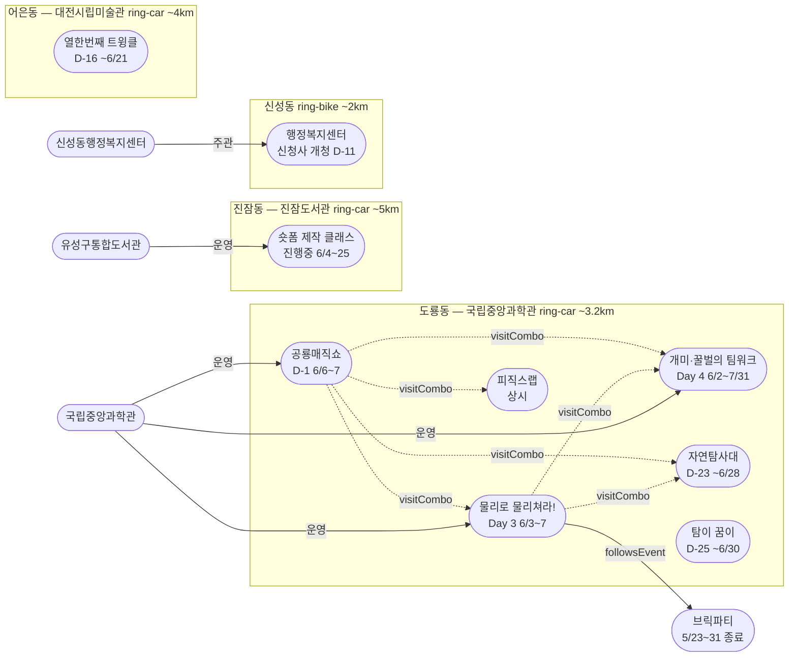

# 2026-06-05 유성구 어린이·가족 이벤트 일일 보고서

## 요약

**금요일 — 공룡매직쇼 D-1, 주말 과학관 5종 콤보 확정.** (1) **공룡매직쇼 D-1** — 내일(6/6 토) 사이언스홀 D-day. 물리놀이터 Day 4(마지막 이틀)와 완전 중첩 → **주말 과학관 방문 시 공룡매직쇼+물리놀이터+팀워크+자연탐사대+피직스랩 = 5종 콤보 추천.** (2) **물리로 물리쳐라! Day 3** 금요일 진행, 내일(토)이 마지막 주말. (3) **신성동 행정복지센터 D-11** — 유성구청 공식 인스타그램·페이스북 게시 확인으로 매체 교차검증 강화(5+개). (4) **119시민체험센터 금요일 정상 운영.** 신규 이벤트 없음.

---

## 용성로20 주변 (도보권 0.5km 내)

금일 도보권(ring-walk, 0.5km) 내 신규 이벤트 없음.

---

## 오늘의 추천 (가족 동반 Top 5)

| # | 이벤트 | 장소 | 대상 | 비용 | 비고 |
|---|--------|------|------|------|------|
| 1 | **물리로 물리쳐라!** | 국립중앙과학관 사이언스터널+미래기술관 3층(도룡동) | 초등·가족 | 미확인 | Day 3 진행중 (~6/7) |
| 2 | **개미·꿀벌의 팀워크** | 국립중앙과학관 자연사관(도룡동) | 유아·초등·가족 | 무료(입장권별도) | Day 4 진행중 (~7/31) |
| 3 | **출동! 첨단 미래 자연탐사대** | 국립중앙과학관 사이언스터널(도룡동) | 초등·가족 | 미확인 | 진행중 D-23 (~6/28) |
| 4 | **열한번째 트윙클** | 대전시립미술관(어은동) | 유아·초등·가족 | 무료 | 진행중 D-16 (~6/21) |
| 5 | **119시민체험센터** | 대전소방본부 119시민체험센터 | 유아·초등·가족 | 무료 | 금요일 정상 운영 |

> **주말 방문 추천:** 내일(토) 도룡동 과학관에서 **공룡매직쇼 D-day + 물리놀이터 Day 4 + 팀워크 Day 5 + 자연탐사대 + 피직스랩** = 한 번의 방문으로 **5종 체험**. 탐이 꿈이(어린이과학관)까지 합치면 6종.

---

## 주요 뉴스

### 1. 공룡매직쇼 — D-1 내일 시작
- **출처:** [국립중앙과학관 행사안내](https://www.science.go.kr/mps/1070/bbs/431/moveBbsNttList.do)
- **일시:** 2026-06-06 ~ 6/07 (**D-1**)
- **장소:** 국립중앙과학관 사이언스홀 (도룡동, ring-car ~3.2km)
- **대상:** 유아·초등저학년·초등고학년·전연령가족
- **비용:** 미확인 | **실내/야외:** 실내
- **상태:** D-1 (← 어제 D-2)
- **관련 엔티티:** ent-evt-047, ent-venue-005, ent-org-006
- **비고:** 공룡 테마 매직쇼. **물리놀이터 마지막 2일(6/6~7)과 완전 중첩** — 토~일 방문 시 둘 다 체험 가능. 5종 콤보의 핵심.

### 2. 물리로 물리쳐라! — Day 3 진행중
- **출처:** [국립중앙과학관 행사안내](https://www.science.go.kr/mps/1070/bbs/431/moveBbsNttList.do)
- **일시:** 2026-06-03 ~ 6/07 (**Day 3**)
- **장소:** 국립중앙과학관 사이언스터널+미래기술관 3층 (도룡동, ring-car ~3.2km)
- **대상:** 초등저학년·초등고학년·전연령가족
- **비용:** 미확인 | **실내/야외:** 실내
- **상태:** Day 3 (← 어제 Day 2)
- **관련 엔티티:** ent-evt-048, ent-venue-005, ent-org-006
- **비고:** 아날로그 감성 물리놀이터. 팀 미션 게임·물리 교구 체험·서커스 워크숍·진로 강연. 내일(Day 4)·모레(Day 5=마지막날)가 마지막 주말. 피직스랩 연계.

### 3. 신성동 행정복지센터 신청사 개청 — D-11 매체 강화
- **출처:** [대전일보](https://www.daejonilbo.com/news/articleView.html?idxno=2208409), [유성구청 인스타그램](https://www.instagram.com/p/DK9Fq10S_5s/), [굿모닝충청](https://www.goodmorningcc.com/news/articleView.html?idxno=423555), [충청뉴스](http://www.ccnnews.co.kr/news/articleView.html?idxno=376404)
- **일시:** 2026-06-16 (**D-11**)
- **장소:** 신성동 행정복지센터 신청사 (신성동, ring-bike ~2km)
- **상태:** D-11 (← 어제 D-12). 유성구청 공식 SNS 게시물 확인으로 매체 교차검증 +3건 (총 5개 이상 매체).
- **관련 엔티티:** ent-evt-052, ent-venue-027, ent-org-025
- **비고:** 1차 타겟 동 공공기관 행사. 지하1층 지상2층, 수유실·다목적실·공유주방·세미나실. 6/16(화) 업무 개시.

---

## 신규 이벤트

금일 신규 이벤트 없음.

---

## 신규 오픈 가게·팝업·프로모션

금일 신규 발견 없음. **활성 윈도우 내 가게 0건** (50일 윈도우 기준).

> 6/1부터 무브먼트랩·헌터 팝업 2건 `archived` 전환 완료. 현재 활성 윈도우 가게가 없습니다.

### 사용자 제보 처리 현황

| 제보 가게 | 동 | 상태 | 비고 |
|-----------|-----|------|------|
| 엉클부대찌개 테크노점 | 관평동 | resolved_not_new | 2025년 10~11월 오픈 추정. 50일 윈도우 미해당. |
| 인터뷰커피라운지 | 도룡동 | resolved_not_new | 2024년 7월 오픈. 기존 카페. |
| 유성닭발 관평점 | 관평동 | excluded | 주류 전문 — scope.exclude 적용. |

---

## 공공기관 주최 행사 (행정복지센터·보건소·복지관·도서관·우체국·경찰서·소방서)

- **119시민체험센터:** **금요일 정상 운영**. 화~토 09:30~11:30/13:30~15:30 무료 체험. 내일(토)도 운영. ([예약](https://www.daejeon.go.kr/dj119/CmmContentsHtmlView.do?menuSeq=5092))
- **신성동 행정복지센터:** **신청사 개청 D-11** (6/16). 유성구청 공식 SNS 게시물(인스타·페이스북) 확인으로 매체 교차검증 강화. ([대전일보](https://www.daejonilbo.com/news/articleView.html?idxno=2208409), [유성구청 인스타](https://www.instagram.com/p/DK9Fq10S_5s/))
- **유성구 도서관(진잠):** 숏폼 제작 클래스 진행중 (6/4~25, 초등4~6학년). **금요일은 비수업일** (목요일 주 1회, 다음 수업 6/11).
- **유성이의 튼튼스쿨:** 상반기 모집 마감 완료. 하반기 8/19~11/27 예정.
- 기타 공공기관(보건소·복지관·우체국·경찰서·소방서) 주최 신규 어린이 행사: **금일 신규 없음**.

---

## 마감 임박 (사전신청 D-3 이내)

| 이벤트 | 일시 | 장소 | 마감 상태 |
|--------|------|------|----------|
| **공룡매직쇼** | 6/6~7 | 국립중앙과학관 사이언스홀(도룡동) | **D-1** — 내일 시작 |

---

## 동심원별 묶음

### ring-walk (0.5km 이내, 도보 5분)
- 해당 없음

### ring-stroll (1.0km 이내, 도보 15분)
- 해당 없음

### ring-bike (2.0km 이내, 자전거)
- **신성동 행정복지센터 신청사 개청** D-11 (6/16, ~2km)

### ring-car (5.0km 이내, 차량 10분)
- **국립중앙과학관 도룡동 클러스터** (~3.2km): 물리놀이터(Day 3) + 팀워크(Day 4) + 자연탐사대(D-23) + **공룡매직쇼(D-1)** + 피직스랩(상시) + 탐이꿈이(~6/30)
- **대전시민천문대** (~3km, 도룡동): 상시 관측 14:00~22:00 (금요일 운영)
- **대전엑스포아쿠아리움** (~3.5km, 도룡동): 상시 체험
- **대전시립미술관** (~4km, 어은동): 열한번째 트윙클 D-16 (~6/21)

---

## 동(洞)별 이벤트 묶음

### 도룡동 (1차 타겟) — 6종
| 이벤트 | 상태 | 비용 |
|--------|------|------|
| 물리로 물리쳐라! | Day 3 (~6/7) | 미확인 |
| 개미·꿀벌의 팀워크 | Day 4 (~7/31) | 무료(입장권별도) |
| 출동! 첨단 미래자연탐사대 | D-23 (~6/28) | 미확인 |
| 공룡매직쇼 | **D-1** (6/6~7) | 미확인 |
| 피직스랩 상시 체험 | 상시 | 무료(입장권별도) |
| 탐이 꿈이의 비밀 실험실 | D-25 (~6/30) | 유료 |

### 신성동 (1차 타겟) — 1종
| 이벤트 | 상태 | 비용 |
|--------|------|------|
| 신성동 행정복지센터 신청사 개청 | D-11 (6/16) | 해당없음 |

### 어은동 (보조) — 1종
| 이벤트 | 상태 | 비용 |
|--------|------|------|
| 열한번째 트윙클 | D-16 (~6/21) | 무료 |

### 진잠동 (보조) — 1종
| 이벤트 | 상태 | 비용 |
|--------|------|------|
| 숏폼 제작 클래스 | 진행중 (~6/25) | 무료 |

> 용산동·전민동·관평동·문지동: 금일 이벤트 없음.

---

## 연령대별 묶음

| 연령대 | 이벤트 |
|--------|--------|
| 영유아 (0~3) | — |
| 유아 (4~6) | 개미·꿀벌의 팀워크, 공룡매직쇼, 열한번째 트윙클, 탐이 꿈이 |
| 초등저학년 (7~9) | 물리로 물리쳐라!, 개미·꿀벌의 팀워크, 공룡매직쇼, 열한번째 트윙클, 피직스랩 |
| 초등고학년 (10~12) | 물리로 물리쳐라!, 공룡매직쇼, 숏폼 제작 클래스, 피직스랩, 자연탐사대 |
| 전연령가족 | 물리로 물리쳐라!, 개미·꿀벌의 팀워크, 자연탐사대, 공룡매직쇼, 피직스랩, 119시민체험센터 |

---

## 시리즈/정기 프로그램 업데이트

| 시리즈 | 업데이트 |
|--------|----------|
| 국립중앙과학관 Science Chapter | 물리놀이터 Day 3. 내일 공룡매직쇼 D-day + Day 4 주말 콤보. |
| 유성구 도서관 K-도서관 시리즈 | 숏폼 진행중 — 금요일 비수업일, 다음 수업 6/11(목). |
| 119시민체험센터 상시 | 금요일 정상 운영. 내일(토)도 운영. |
| 대전시민천문대 상시 | 금요일 정상 운영 (14:00~22:00). |
| 탐이 꿈이의 비밀 실험실 | D-25 진행중 (~6/30). |

---

## 예고 (D-7 이상)

| 이벤트 | 일시 | 장소 | D-day까지 |
|--------|------|------|-----------|
| 신성동 행정복지센터 신청사 개청 | 6/16 | 신성동 | D-11 |
| 로보스테이지6: Kick Off! | 6/20 | 국립중앙과학관 | D-15 |
| 별별뷰티 | 6/20 | 국립중앙과학관 | D-15 |
| 열한번째 트윙클 종료 | 6/21 | 대전시립미술관 | D-16 |
| 자연탐사대 종료 | 6/28 | 국립중앙과학관 | D-23 |

---

## 지식그래프 시각화

> 점선(-.->)은 추론된 방문 콤보 관계. 공룡매직쇼(D-1)가 내일 시작되면서 도룡동 과학관 5종 콤보 네트워크가 완성됨.

---

## 출처 목록

1. [국립중앙과학관 행사안내](https://www.science.go.kr/mps/1070/bbs/431/moveBbsNttList.do) — 공룡매직쇼·물리놀이터·팀워크·자연탐사대·로보스테이지6·별별뷰티
2. [대전일보 — 신성동 행정복지센터](https://www.daejonilbo.com/news/articleView.html?idxno=2208409)
3. [유성구청 인스타그램 — 신성동 이전 안내](https://www.instagram.com/p/DK9Fq10S_5s/)
4. [굿모닝충청 — 신성동 개청](https://www.goodmorningcc.com/news/articleView.html?idxno=423555)
5. [충청뉴스 — 신성동 개청](http://www.ccnnews.co.kr/news/articleView.html?idxno=376404)
6. [뉴스로 — 열한번째 트윙클](https://www.newsro.kr/article243/1626322/)
7. [뉴스1 — 피직스랩](https://www.news1.kr/local/daejeon-chungnam/6047996)
8. [정책브리핑 — 자연탐사대](https://www.korea.kr/briefing/pressReleaseView.do?newsId=156756613)
9. [유성구통합도서관 행사신청](https://lib.yuseong.go.kr/web/menu/10095/program/30010/lectureList.do) — 숏폼
10. [국립중앙과학관 탐이 꿈이](https://www.science.go.kr/mps/cntnts/1063/moveCntnts.do)
11. [119시민체험센터 예약](https://www.daejeon.go.kr/dj119/CmmContentsHtmlView.do?menuSeq=5092)
12. [대전시민천문대](https://djstar.kr/)
13. [대전엑스포아쿠아리움](https://djexpoaqua.com/)
