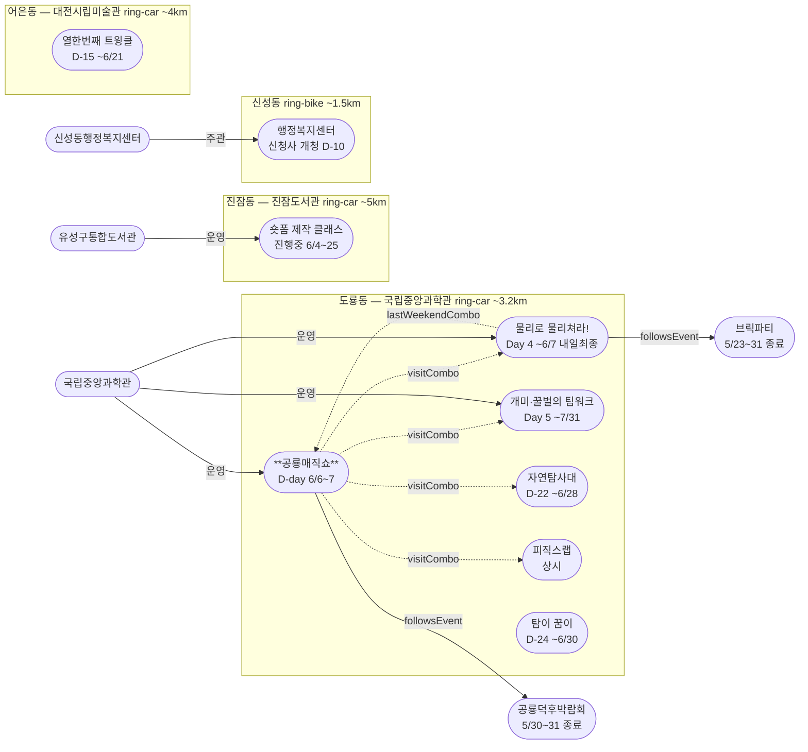

# 2026-06-06 유성구 어린이·가족 이벤트 일일 보고서

## 요약

**현충일 토요일 — 공룡매직쇼 D-day 개막, 도룡동 과학관 5종 콤보 마지막 완전 구성.** (1) **공룡매직쇼 D-day** — 오늘(6/6 토) 사이언스홀 개막. 내일(6/7 일)까지 이틀간. (2) **물리로 물리쳐라! Day 4** — 마지막 주말 토요일. **내일(6/7)이 최종일** → 이후 도룡동 콤보가 4종으로 축소. (3) **5종 콤보 마지막 완전 구성** — 공룡매직쇼 + 물리놀이터 + 팀워크 + 자연탐사대 + 피직스랩. 오늘과 내일이 이 조합으로 방문할 수 있는 마지막 주말. (4) **현충일 주의** — 119시민체험센터 등 공공기관 공휴일 휴무 가능성, 방문 전 확인 권장. 신규 이벤트 없음.

---

## 용성로20 주변 (도보권 0.5km 내)

금일 도보권(ring-walk, 0.5km) 내 신규 이벤트 없음.

---

## 오늘의 추천 (가족 동반 Top 5)

| # | 이벤트 | 장소 | 대상 | 비용 | 비고 |
|---|--------|------|------|------|------|
| 1 | **공룡매직쇼** | 국립중앙과학관 사이언스홀(도룡동) | 유아·초등·가족 | 미확인 | **D-day 오늘 개막** (6/6~7) |
| 2 | **물리로 물리쳐라!** | 국립중앙과학관 사이언스터널+미래기술관 3층(도룡동) | 초등·가족 | 미확인 | Day 4 **내일 최종일** (~6/7) |
| 3 | **개미·꿀벌의 팀워크** | 국립중앙과학관 자연사관(도룡동) | 유아·초등·가족 | 무료(입장권별도) | Day 5 주말 (~7/31) |
| 4 | **열한번째 트윙클** | 대전시립미술관(어은동) | 유아·초등·가족 | 무료 | D-15 (~6/21) |
| 5 | **출동! 첨단 미래자연탐사대** | 국립중앙과학관 사이언스터널(도룡동) | 초등·가족 | 미확인 | D-22 (~6/28) |

> **오늘 방문 추천:** 현충일 토요일, 도룡동 과학관에서 **공룡매직쇼 D-day + 물리놀이터 Day 4 + 팀워크 Day 5 + 자연탐사대 + 피직스랩 = 5종 콤보**. 탐이 꿈이(어린이과학관)까지 합치면 6종. **내일(6/7)도 가능하나, 이후 물리놀이터 종료로 콤보 축소.**

---

## 주요 뉴스

### 1. 공룡매직쇼 — D-day 오늘 개막
- **출처:** [국립중앙과학관 행사안내](https://www.science.go.kr/mps/1070/bbs/431/moveBbsNttList.do)
- **일시:** 2026-06-06 ~ 6/07 (**D-day**)
- **장소:** 국립중앙과학관 사이언스홀 (도룡동, ring-car ~3.2km)
- **대상:** 유아·초등저학년·초등고학년·전연령가족
- **비용:** 미확인 | **실내/야외:** 실내
- **상태:** D-day (← 어제 D-1)
- **관련 엔티티:** ent-evt-047, ent-venue-005, ent-org-006
- **비고:** 공룡덕후박람회(5/30~31) 후속 공룡 테마 매직쇼. **물리놀이터 마지막 이틀(6/6~7)과 완전 중첩** — 5종 콤보 마지막 완전 구성.

### 2. 물리로 물리쳐라! — Day 4 마지막 주말 토요일
- **출처:** [국립중앙과학관 행사안내](https://www.science.go.kr/mps/1070/bbs/431/moveBbsNttList.do)
- **일시:** 2026-06-03 ~ 6/07 (**Day 4**)
- **장소:** 국립중앙과학관 사이언스터널+미래기술관 3층 (도룡동, ring-car ~3.2km)
- **대상:** 초등저학년·초등고학년·전연령가족
- **비용:** 미확인 | **실내/야외:** 실내
- **상태:** Day 4 마지막 주말 (← 어제 Day 3)
- **관련 엔티티:** ent-evt-048, ent-venue-005, ent-org-006
- **비고:** 아날로그 감성 물리놀이터. **내일(6/7 일)이 최종일.** 이후 도룡동 과학관 콤보가 팀워크+자연탐사대+피직스랩+탐이꿈이 = 4종으로 축소.

### 3. 현충일(6/6) 운영 영향
- **일시:** 2026-06-06 (현충일, 토요일)
- **영향 시설:**
  - **119시민체험센터:** 정상 운영 시간 화~토이나, 현충일 공휴일 휴무 적용 가능. **사전 확인 권장** (042-270-1133, [예약](https://www.daejeon.go.kr/dj119/CmmContentsHtmlView.do?menuSeq=5092))
  - **대전시민천문대:** 오늘(현충일) 정상 운영. 단, **내일(6/7 일)이 "공휴일 다음 날"에 해당하여 휴관 가능** — 방문 전 확인 권장 ([홈페이지](https://djstar.kr/))
  - **국립중앙과학관:** 현충일 **정상 운영** (연중무휴 성격)
  - **대전시립미술관:** 현충일 **정상 운영**

---

## 신규 이벤트

금일 신규 이벤트 없음.

---

## 신규 오픈 가게·팝업·프로모션

금일 신규 발견 없음. **활성 윈도우 내 가게 0건** (50일 윈도우 기준).

> 6/1부터 무브먼트랩·헌터 팝업 2건 `archived` 전환 완료. 현재 활성 윈도우 가게가 없습니다.

### 사용자 제보 처리 현황

| 제보 가게 | 동 | 상태 | 비고 |
|-----------|-----|------|------|
| 엉클부대찌개 테크노점 | 관평동 | resolved_not_new | 2025년 10~11월 오픈 추정. 50일 윈도우 미해당. |
| 인터뷰커피라운지 | 도룡동 | resolved_not_new | 2024년 7월 오픈. 기존 카페. |
| 유성닭발 관평점 | 관평동 | excluded | 주류 전문 — scope.exclude 적용. |

---

## 공공기관 주최 행사 (행정복지센터·보건소·복지관·도서관·우체국·경찰서·소방서)

- **119시민체험센터:** 현충일(공휴일) 토요일 — **운영 여부 불확실**. 사전예약제, 방문 전 전화 확인 필수 (042-270-1133). ([예약](https://www.daejeon.go.kr/dj119/CmmContentsHtmlView.do?menuSeq=5092))
- **신성동 행정복지센터:** **신청사 개청 D-10** (6/16 월). 유성구청 페이스북 공식 안내 확인. ([대전일보](https://www.daejonilbo.com/news/articleView.html?idxno=2208409), [유성구청 페이스북](https://www.facebook.com/happyyuseong/posts/신성동-행정복지센터-신청사-이전-안내...))
- **유성구 도서관(진잠):** 숏폼 제작 클래스 진행중 (6/4~25, 초등4~6학년). **토요일 비수업일** (목 주 1회, 다음 수업 6/11).
- **유성이의 튼튼스쿨:** 상반기 모집 마감 완료. 하반기 8/19~11/27 예정.
- 기타 공공기관(보건소·복지관·우체국·경찰서·소방서) 주최 신규 어린이 행사: **금일 신규 없음**.

---

## 마감 임박 (사전신청 D-3 이내)

| 이벤트 | 일시 | 장소 | 마감 상태 |
|--------|------|------|----------|
| **공룡매직쇼** | 6/6~7 | 국립중앙과학관 사이언스홀(도룡동) | **D-day** — 오늘·내일 |
| **물리로 물리쳐라!** | 6/3~7 | 국립중앙과학관 사이언스터널(도룡동) | Day 4 — **내일 최종일** |

---

## 동심원별 묶음

### ring-walk (0.5km 이내, 도보 5분)
- 해당 없음

### ring-stroll (1.0km 이내, 도보 15분)
- 해당 없음

### ring-bike (2.0km 이내, 자전거)
- **신성동 행정복지센터 신청사 개청** D-10 (6/16, ~1.5km)

### ring-car (5.0km 이내, 차량 10분)
- **국립중앙과학관 도룡동 클러스터** (~3.2km): **공룡매직쇼(D-day)** + 물리놀이터(Day 4) + 팀워크(Day 5) + 자연탐사대(D-22) + 피직스랩(상시) + 탐이꿈이(~6/30)
- **대전시민천문대** (~3km, 도룡동): 상시 관측 14:00~22:00 (현충일 정상 운영, **내일 공휴일 다음 날 휴관 가능**)
- **대전엑스포아쿠아리움** (~3.5km, 도룡동): 상시 체험
- **대전시립미술관** (~4km, 어은동): 열한번째 트윙클 D-15 (~6/21)

---

## 동(洞)별 이벤트 묶음

### 도룡동 (1차 타겟) — 6종
| 이벤트 | 상태 | 비용 |
|--------|------|------|
| **공룡매직쇼** | **D-day** (6/6~7) | 미확인 |
| 물리로 물리쳐라! | Day 4, **내일 최종일** (~6/7) | 미확인 |
| 개미·꿀벌의 팀워크 | Day 5 (~7/31) | 무료(입장권별도) |
| 출동! 첨단 미래자연탐사대 | D-22 (~6/28) | 미확인 |
| 피직스랩 상시 체험 | 상시 | 무료(입장권별도) |
| 탐이 꿈이의 비밀 실험실 | D-24 (~6/30) | 유료 |

### 신성동 (1차 타겟) — 1종
| 이벤트 | 상태 | 비용 |
|--------|------|------|
| 신성동 행정복지센터 신청사 개청 | D-10 (6/16) | 해당없음 |

### 어은동 (보조) — 1종
| 이벤트 | 상태 | 비용 |
|--------|------|------|
| 열한번째 트윙클 | D-15 (~6/21) | 무료 |

### 진잠동 (보조) — 1종
| 이벤트 | 상태 | 비용 |
|--------|------|------|
| 숏폼 제작 클래스 | 진행중 (~6/25) | 무료 |

> 용산동·전민동·관평동·문지동: 금일 이벤트 없음.

---

## 연령대별 묶음

| 연령대 | 이벤트 |
|--------|--------|
| 영유아 (0~3) | — |
| 유아 (4~6) | **공룡매직쇼**, 개미·꿀벌의 팀워크, 열한번째 트윙클, 탐이 꿈이 |
| 초등저학년 (7~9) | **공룡매직쇼**, 물리로 물리쳐라!, 개미·꿀벌의 팀워크, 열한번째 트윙클, 피직스랩 |
| 초등고학년 (10~12) | **공룡매직쇼**, 물리로 물리쳐라!, 숏폼 제작 클래스, 피직스랩, 자연탐사대 |
| 전연령가족 | **공룡매직쇼**, 물리로 물리쳐라!, 개미·꿀벌의 팀워크, 자연탐사대, 피직스랩 |

---

## 시리즈/정기 프로그램 업데이트

| 시리즈 | 업데이트 |
|--------|----------|
| 국립중앙과학관 Science Chapter | **공룡매직쇼 D-day + 물리놀이터 Day 4** 마지막 동시 운영 주말. 내일(일) 물리놀이터 종료 후 콤보 축소. |
| 유성구 도서관 K-도서관 시리즈 | 숏폼 진행중 — 토요일 비수업일, 다음 수업 6/11(목). |
| 119시민체험센터 상시 | **현충일 운영 불확실** — 사전 확인 필수. |
| 대전시민천문대 상시 | 토요일 정상 운영. **내일(일) 공휴일 다음 날 휴관 가능.** |
| 탐이 꿈이의 비밀 실험실 | D-24 진행중 (~6/30). |

---

## 예고 (D-7 이상)

| 이벤트 | 일시 | 장소 | D-day까지 |
|--------|------|------|-----------|
| 신성동 행정복지센터 신청사 개청 | 6/16 | 신성동 | D-10 |
| 로보스테이지6: Kick Off! | 6/20 | 국립중앙과학관 | D-14 |
| 별별뷰티 | 6/20 | 국립중앙과학관 | D-14 |
| 열한번째 트윙클 종료 | 6/21 | 대전시립미술관 | D-15 |
| 자연탐사대 종료 | 6/28 | 국립중앙과학관 | D-22 |

---

## 지식그래프 시각화

> 점선(-.->)은 추론된 방문 콤보 관계. **공룡매직쇼 D-day + 물리놀이터 Day 4**가 5종 콤보의 마지막 완전 구성. 내일(6/7) 물리놀이터 종료 후 4종으로 축소.

---

## 출처 목록

1. [국립중앙과학관 행사안내](https://www.science.go.kr/mps/1070/bbs/431/moveBbsNttList.do) — 공룡매직쇼·물리놀이터·팀워크·자연탐사대·로보스테이지6·별별뷰티
2. [대전일보 — 신성동 행정복지센터](https://www.daejonilbo.com/news/articleView.html?idxno=2208409)
3. [유성구청 페이스북 — 신성동 이전 안내](https://www.facebook.com/happyyuseong/posts/신성동-행정복지센터-신청사-이전-안내...)
4. [뉴스로 — 열한번째 트윙클](https://www.newsro.kr/article243/1626322/)
5. [뉴스1 — 피직스랩](https://www.news1.kr/local/daejeon-chungnam/6047996)
6. [정책브리핑 — 자연탐사대](https://www.korea.kr/briefing/pressReleaseView.do?newsId=156756613)
7. [유성구통합도서관 행사신청](https://lib.yuseong.go.kr/web/menu/10095/program/30010/lectureList.do) — 숏폼
8. [국립중앙과학관 탐이 꿈이](https://www.science.go.kr/mps/cntnts/1063/moveCntnts.do)
9. [119시민체험센터 예약](https://www.daejeon.go.kr/dj119/CmmContentsHtmlView.do?menuSeq=5092)
10. [대전시민천문대](https://djstar.kr/)
11. [대전엑스포아쿠아리움](https://djexpoaqua.com/)
12. [교육포커스 — 피직스랩 개관](https://www.edu-focus.com/news/461944)
