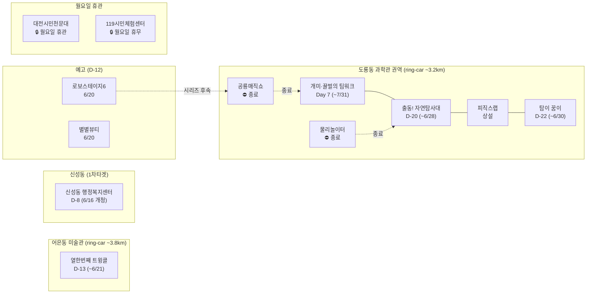

# 2026-06-08 유성구 어린이·가족 이벤트 일일 보고서

## 요약

**월요일 — 공룡매직쇼·물리놀이터 종료 후 첫 날. 도룡동 콤보 4종 체제 전환.** (1) **공룡매직쇼 종료 확정** — 어제(6/7) 사이언스홀 최종 공연 완료. 6월 공룡 테마 이벤트 공백. (2) **물리놀이터 종료 확정** — 어제(6/7) 사이언스터널 마지막 운영 완료. (3) **도룡동 콤보 4종 전환** — 팀워크(~7/31)+자연탐사대(~6/28)+피직스랩(상설)+탐이 꿈이(~6/30). 과학관 월요일 정상운영(연중무휴). (4) **월요일 휴관·휴무** — 대전시민천문대(월요일 정기 휴관), 119시민체험센터(일·월 휴무). 신규 이벤트 없음.

---

## 용성로20 주변 (도보권 0.5km 내)

금일 도보권(ring-walk, 0.5km) 내 신규 이벤트 없음.

---

## 오늘의 추천 (가족 동반 Top 5)

| # | 이벤트 | 장소 | 대상 | 비용 | 비고 |
|---|--------|------|------|------|------|
| 1 | **개미·꿀벌의 팀워크** | 국립중앙과학관 자연사관(도룡동) | 유아·초등·가족 | 무료(입장권별도) | Day 7 (~7/31) |
| 2 | **열한번째 트윙클** | 대전시립미술관(어은동) | 유아·초등·가족 | 무료 | D-13 (~6/21) |
| 3 | **출동! 첨단 미래자연탐사대** | 국립중앙과학관 사이언스터널(도룡동) | 초등·가족 | 미확인 | D-20 (~6/28) |
| 4 | **피직스랩 상시체험** | 국립중앙과학관 피직스랩(도룡동) | 초등·가족 | 무료(입장권별도) | 상설 |
| 5 | **탐이 꿈이의 비밀 실험실** | 국립어린이과학관(도룡동) | 유아·초등저학년 | 유료 | D-22 (~6/30) |

> **오늘 방문 추천:** 월요일, 국립중앙과학관 정상운영(연중무휴). 공룡매직쇼·물리놀이터 종료 후에도 **팀워크+자연탐사대+피직스랩+탐이 꿈이 = 4종 콤보** 유지. 대전시립미술관도 월요일 정상운영 — **트윙클 D-13(6/21 종료)**, 마지막 2주 진입. **주의:** 대전시민천문대·119시민체험센터 오늘 휴관/휴무.

---

## 신규 이벤트

금일 신규 이벤트 없음.

---

## 신규 오픈 가게·팝업·프로모션

금일 신규 발견 없음. **활성 윈도우 내 가게 0건** (50일 윈도우 기준).

> 6/1부터 무브먼트랩·헌터 팝업 2건 `archived` 전환 완료. 현재 활성 윈도우 가게가 없습니다.

### 사용자 제보 처리 현황

| 제보 가게 | 동 | 상태 | 비고 |
|-----------|-----|------|------|
| 엉클부대찌개 테크노점 | 관평동 | resolved_not_new | 2025년 10~11월 오픈 추정. 50일 윈도우 미해당. |
| 인터뷰커피라운지 | 도룡동 | resolved_not_new | 2024년 7월 오픈. 기존 카페. |
| 유성닭발 관평점 | 관평동 | excluded | 주류 전문 — scope.exclude 적용. |

---

## 공공기관 주최 행사 (행정복지센터·보건소·복지관·도서관·우체국·경찰서·소방서)

- **119시민체험센터:** **월요일 정기 휴무**. 다음 운영일: 6/9(화). (042-270-1133, [예약](https://www.daejeon.go.kr/dj119/CmmContentsHtmlView.do?menuSeq=5092))
- **대전시민천문대:** **월요일 정기 휴관**. 다음 운영일: 6/9(화) 14:00. (042-863-8762, [홈페이지](https://djstar.kr/))
- **신성동 행정복지센터:** **신청사 개청 D-8** (6/16 월 업무 개시, 6/30 월 개청식). ([대전일보](https://www.daejonilbo.com/news/articleView.html?idxno=2208409), [유성구청 인스타그램](https://www.instagram.com/p/DK9Fq10S_5s/))
- **학하동 주민자치센터:** 하반기(7~9월) 강좌 **방문접수 진행중** (오늘 6/8~6/10, 10:00~17:30). 온라인 6/6~6/10. 선정발표 6/12(금). (042-716-4228)
- **유성구 도서관(진잠):** 숏폼 제작 클래스 진행중 (6/4~25, 초등4~6학년). **월요일 비수업일** (다음 수업 6/11 수).
- **유성이의 튼튼스쿨:** 상반기 모집 마감 완료. 하반기 8/19~11/27 예정.
- 기타 공공기관(보건소·복지관·우체국·경찰서·소방서) 주최 신규 어린이 행사: **금일 신규 없음**.

---

## 마감 임박 (사전신청 D-3 이내)

| 이벤트 | 일시 | 장소 | 마감 상태 |
|--------|------|------|----------|
| **학하동 주민자치센터 하반기 강좌 접수** | 수강기간 7/1~9/30 | 학하동 행정복지센터 | **D-2** (6/10 수 17:30 마감) |

---

## 동심원별 묶음

### ring-walk (0.5km 이내, 도보 5분)
- 해당 없음

### ring-stroll (1.0km 이내, 도보 15분)
- 해당 없음

### ring-bike (2.0km 이내, 자전거)
- 해당 없음

### ring-car (5.0km 이내, 차량 10분)
- **국립중앙과학관 권역 (도룡동, ~3.2km):** 개미·꿀벌의 팀워크 Day 7 + 출동! 자연탐사대 D-20 + 피직스랩 상설 + 탐이 꿈이 D-22 = **4종 콤보**
- **대전시립미술관 (어은동, ~3.8km):** 열한번째 트윙클 D-13

---

## 동(洞)별 이벤트 묶음

| 동 | 이벤트 | 상태 |
|----|--------|------|
| **도룡동** (1차) | 개미·꿀벌의 팀워크, 출동! 자연탐사대, 피직스랩, 탐이 꿈이, 대전시민천문대(오늘 휴관) | 진행중 (과학관 4종 콤보) |
| **어은동** (보조) | 열한번째 트윙클 | D-13 |
| **신성동** (1차) | 신성동 행정복지센터 신청사 개청 | D-8 |
| **진잠동** | 숏폼 제작 클래스 | 진행중 (비수업일) |

---

## 연령대별 묶음

| 연령대 | 이벤트 |
|--------|--------|
| 영유아 | 탐이 꿈이의 비밀 실험실 |
| 유아 | 개미·꿀벌의 팀워크, 열한번째 트윙클, 탐이 꿈이 |
| 초등저학년 | 개미·꿀벌의 팀워크, 열한번째 트윙클, 출동! 자연탐사대, 피직스랩 |
| 초등고학년 | 출동! 자연탐사대, 피직스랩, 숏폼 제작 클래스(4~6학년) |
| 전연령가족 | 개미·꿀벌의 팀워크, 열한번째 트윙클, 피직스랩 |

---

## 시리즈/정기 프로그램 업데이트

| 시리즈 | 최근 회차 | 다음 예정 | 비고 |
|--------|-----------|-----------|------|
| 국립중앙과학관 격주 이벤트 | 공룡매직쇼(6/6~7) **종료** | **로보스테이지6(6/20)** D-12 | 2주 주기 패턴 유지 |
| 숏폼 제작 클래스 | 6/4 시작, 매주 수 | 6/11(수) 다음 수업 | 4회차/4 |
| 대전시민천문대 상시 | 월요일 제외 매일 14:00~22:00 | 6/9(화) 운영 재개 | - |
| 119시민체험센터 상시 | 화~토 운영 | 6/9(화) 운영 재개 | - |

---

## 이번 주 주요 일정 (6/8~6/14)

| 날짜 | 요일 | 주요 내용 |
|------|------|-----------|
| 6/8 | **월** | 과학관 4종 콤보, 미술관 트윙클 D-13. 천문대·119 휴관 |
| 6/9 | 화 | 천문대·119체험센터 운영 재개 |
| 6/10 | 수 | 학하동 강좌접수 마감(17:30) |
| 6/11 | 수 | 숏폼 클래스 수업일 |
| 6/12 | 금 | 학하동 강좌 선정발표 |
| 6/14 | 토 | 주말 가족 방문 집중일 — 과학관+미술관 콤보 추천 |

---

## 지식그래프 시각화

---

## 출처 목록

| # | 출처 | URL | 비고 |
|---|------|-----|------|
| 1 | 국립중앙과학관 행사안내 | https://www.science.go.kr/mps/1070/bbs/431/moveBbsNttList.do | 과학관 행사 전체 |
| 2 | 대전시립미술관 (뉴스로) | https://www.newsro.kr/article243/1626322/ | 트윙클 전시 |
| 3 | 대전일보 — 신성동 행정복지센터 | https://www.daejonilbo.com/news/articleView.html?idxno=2208409 | 개청 안내 |
| 4 | 굿모닝충청 — 신성동 행정복지센터 | https://www.goodmorningcc.com/news/articleView.html?idxno=423555 | 교차검증 |
| 5 | 유성구청 인스타그램 | https://www.instagram.com/p/DK9Fq10S_5s/ | 이전 안내 |
| 6 | 유성구통합도서관 행사신청 | https://lib.yuseong.go.kr/web/menu/10095/program/30010/lectureList.do | 숏폼 클래스 |
| 7 | 대전시민천문대 | https://djstar.kr/ | 월요일 휴관 확인 |
| 8 | 119시민체험센터 예약 | https://www.daejeon.go.kr/dj119/CmmContentsHtmlView.do?menuSeq=5092 | 월요일 휴무 확인 |
| 9 | 정책브리핑 — 자연탐사대 | https://www.korea.kr/briefing/pressReleaseView.do?newsId=156756613 | 전시 안내 |
| 10 | 유성구청 | https://www.yuseong.go.kr/ | 학하동 강좌접수 |
| 11 | 페디언 — 지역작가 인 도서관 | https://pedien.com/html/view.php?idx=1014924 | 도서관 프로그램 |
| 12 | 너티차일드 대전점 | https://www.naughtychild.co.kr/daejeon | 키즈카페 운영 확인 |

---

*이 보고서는 2026-06-08 KST 07:00 기준으로 수집된 정보를 바탕으로 작성되었습니다.*
