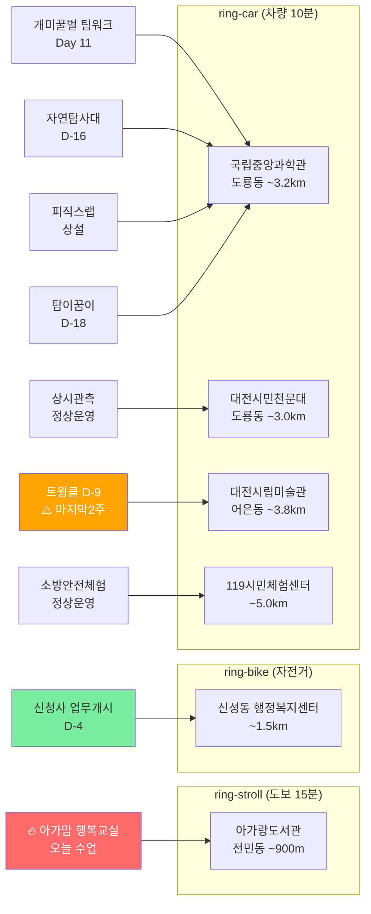

# 2026-06-12 유성구 어린이·가족 이벤트 일일 보고서

## 요약

**금요일 — 아가맘 수업일 + 학하동 선정발표 D-day. 신성동 D-4. 도룡동 4종 콤보 Day 11. 트윙클 D-9 마지막 2주.** (1) **아가·맘 행복교실 오늘 수업** — 아가랑도서관(전민동, ~900m) 매주 금 영유아 프로그램. (2) **학하동 주민자치 강좌 선정발표 D-day** — 오늘 선정자·예비후보 문자 발송. (3) **신성동 행정복지센터 D-4** — 다음 주 월요일(6/16) 업무 시작. 6개 매체 보도 확인. (4) **도룡동 과학관 4종 콤보 Day 11** — 팀워크+자연탐사대+피직스랩+탐이 꿈이. 금요일 정상 운영. (5) **열한번째 트윙클 D-9** — 6/21 종료. 마지막 2주. 신규 이벤트 없음.

---

## 용성로20 주변 (도보권 0.5km 내)

금일 도보권(ring-walk, 0.5km) 내 신규 이벤트 없음.

---

## 오늘의 추천 (가족 동반 Top 5)

| # | 이벤트 | 장소 | 대상 | 비용 | 비고 |
|---|--------|------|------|------|------|
| 1 | **아가·맘 행복교실** | 아가랑도서관(전민동, ~900m) | 영유아 | 무료 | 🔥 오늘 수업일 (매주 금) |
| 2 | **개미·꿀벌의 팀워크** | 국립중앙과학관 자연사관(도룡동) | 유아·초등·가족 | 무료(입장권별도) | Day 11 (~7/31) |
| 3 | **열한번째 트윙클** | 대전시립미술관(어은동) | 유아·초등·가족 | 무료 | D-9 (~6/21) ⚠️ 마지막 2주 |
| 4 | **출동! 첨단 미래자연탐사대** | 국립중앙과학관 사이언스터널(도룡동) | 초등·가족 | 미확인 | D-16 (~6/28) |
| 5 | **피직스랩 상시체험** | 국립중앙과학관 피직스랩(도룡동) | 초등·가족 | 무료(입장권별도) | 상설 |

> **오늘 방문 추천:** 금요일, 모든 시설 정상 운영. **아가맘 수업**(전민동, ring-stroll ~900m)이 오늘의 가장 가까운 이벤트. 국립중앙과학관 연중무휴 — **4종 콤보** 방문 최적. **천문대**(14:00~22:00) + **119시민체험센터**(09:30~15:30) 포함 시 6종 확장 콤보 가능. 대전시립미술관 금요일 정상운영 — **트윙클 D-9**, 마지막 2주 관람 권장.

---

## 신규 이벤트

금일 신규 이벤트 없음.

---

## 신규 오픈 가게·팝업·프로모션

금일 신규 발견 없음. **활성 윈도우 내 가게 0건** (50일 윈도우 기준).

> 6/1부터 무브먼트랩·헌터 팝업 2건 `archived` 전환 완료. 현재 활성 윈도우 가게가 없습니다.

### 사용자 제보 처리 현황

| 제보 가게 | 동 | 상태 | 비고 |
|-----------|-----|------|------|
| 엉클부대찌개 테크노점 | 관평동 | resolved_not_new | 2025년 10~11월 오픈 추정. 50일 윈도우 미해당. |
| 인터뷰커피라운지 | 도룡동 | resolved_not_new | 2024년 7월 오픈. 기존 카페. |
| 유성닭발 관평점 | 관평동 | excluded | 주류 전문 — scope.exclude 적용. |

---

## 공공기관 주최 행사 (행정복지센터·보건소·복지관·도서관·우체국·경찰서·소방서)

- **학하동 주민자치센터:** **선정발표 D-day** — 하반기(7~9월) 강좌 선정자·예비후보 문자 발송 오늘(6/12 금). (042-716-4228)
- **신성동 행정복지센터:** **업무개시 D-4** (6/16 월) + **개청식 D-18** (6/30 월 10:00). B1~2F, 연면적 2842㎡, 수유실·공유주방·어울마당. **6개 매체 보도** 확인. ([대전일보](https://www.daejonilbo.com/news/articleView.html?idxno=2208409), [뉴스1](https://www.news1.kr/photos/7369035), [웰로](https://www.welfarehello.com/community/hometownNews/f6f1453d-a9d7-4150-bcc9-6f1b79195174), [대전뉴스](http://www.daejeonnews.kr/news/articleView.html?idxno=35321), [충청뉴스](http://www.ccnnews.co.kr/news/articleView.html?idxno=376404), [경제투데이](http://www.e-today.kr/news/articleView.html?idxno=804180))
- **유성구 도서관(아가랑/전민동):** **아가·맘 행복교실 오늘 수업일** (4/4~6/27, 매주 금). 영유아. 다음 수업 6/20(금).
- **119시민체험센터:** 금요일 정상 운영. 화~토 09:30~11:30/13:30~15:30. (042-270-1133, [예약](https://www.daejeon.go.kr/dj119/CmmContentsHtmlView.do?menuSeq=5092))
- **대전시민천문대:** 금요일 정상 운영. 14:00~22:00. (042-863-8762, [홈페이지](https://djstar.kr/))
- **유성구 도서관(진잠):** 숏폼 제작 클래스 비수업일(금). 다음 수업 6/18(수).
- **유성이의 튼튼스쿨:** 상반기 모집 마감 완료. 하반기 8/19~11/27 예정 (7/20 선착순 신청).
- 기타 공공기관(보건소·복지관·우체국·경찰서·소방서) 주최 신규 어린이 행사: **금일 신규 없음**.

---

## 마감 임박 (사전신청 D-3 이내)

| 이벤트 | 일시 | 장소 | 마감 상태 |
|--------|------|------|----------|
| **학하동 주민자치 강좌 선정발표** | 수강기간 7/1~9/30 | 학하동 행정복지센터 | **D-day** (오늘 6/12 금 선정 발표) |

---

## 동심원별 묶음

### ring-walk (0.5km 이내, 도보 5분)
- 해당 없음

### ring-stroll (1.0km 이내, 도보 15분)
- **아가랑도서관 (전민동, ~900m):** 아가·맘 행복교실 오늘 수업일 🔥

### ring-bike (2.0km 이내, 자전거)
- **신성동 행정복지센터 (~1.5km):** 신청사 업무개시 D-4 (6/16) + 개청식 D-18 (6/30)

### ring-car (5.0km 이내, 차량 10분)
- **국립중앙과학관 권역 (도룡동, ~3.2km):** 개미·꿀벌의 팀워크 Day 11 + 출동! 자연탐사대 D-16 + 피직스랩 상설 + 탐이 꿈이 D-18 = **4종 콤보**
- **대전시민천문대 (도룡동, ~3.0km):** 상시 관측 프로그램 금요일 정상 운영
- **119시민체험센터 (~5.0km):** 소방안전체험 금요일 정상 운영
- **대전시립미술관 (어은동, ~3.8km):** 열한번째 트윙클 D-9 ⚠️ 마지막 2주

---

## 동(洞)별 이벤트 묶음

| 동 | 이벤트 | 비고 |
|----|--------|------|
| **전민동** | 아가·맘 행복교실 | 오늘 수업일 |
| **신성동** | 행정복지센터 신청사 | 업무개시 D-4 |
| **도룡동** | 과학관 4종 콤보 (팀워크·자연탐사대·피직스랩·탐이꿈이) + 천문대 | Day 11 |
| **어은동** | 열한번째 트윙클 | D-9 마지막 2주 |

---

## 연령대별 묶음

| 연령대 | 이벤트 | 비고 |
|--------|--------|------|
| **영유아 (0~3세)** | 아가·맘 행복교실 | 오늘 수업일 (ring-stroll) |
| **유아 (4~6세)** | 트윙클, 탐이 꿈이, 팀워크 | 체험형 |
| **초등저학년** | 트윙클, 팀워크, 자연탐사대, 피직스랩 | 4종 콤보 |
| **초등고학년** | 피직스랩, 자연탐사대, 로보스테이지6(D-8) | 과학관 집중 |
| **전연령가족** | 팀워크, 천문대, 119시민체험센터 | 금요일 정상 운영 |

---

## 시리즈/정기 프로그램 업데이트

| 프로그램 | 진행 상태 | 다음 일정 |
|----------|----------|----------|
| 아가·맘 행복교실 (4/4~6/27) | **오늘 수업** | 6/20(금) |
| 숏폼 제작 클래스 (6/4~25) | 비수업일(금) | 6/18(수) |
| 119시민체험센터 (상시) | 금요일 운영 | 내일 토요일도 운영 |
| 대전시민천문대 (상시) | 금요일 운영 | 토요별 음악회 내일(토 20시) |

---

## 다음 주 예고

| 날짜 | 이벤트 | 비고 |
|------|--------|------|
| 6/16(월) | **신성동 행정복지센터 업무 시작** | D-4 → D-day |
| 6/18(수) | 숏폼 제작 클래스 수업일 | 진잠도서관 |
| 6/20(토) | **로보스테이지6: Kick Off!** | 국립중앙과학관 |
| 6/20(토) | **별별뷰티 과학특강** | 국립중앙과학관 |
| 6/21(토) | **열한번째 트윙클 최종일** | 대전시립미술관 |

---

## 지식그래프 시각화

---

## 출처 목록

| # | 출처 | 매체 | URL |
|---|------|------|-----|
| 1 | 유성구청 | 유성구청 | https://www.yuseong.go.kr/kor/ |
| 2 | 유성구통합도서관 | 유성구통합도서관 | https://lib.yuseong.go.kr/web/menu/10095/program/30010/lectureList.do |
| 3 | 국립중앙과학관 | 국립중앙과학관 | https://www.science.go.kr/mps/1070/bbs/431/moveBbsNttList.do |
| 4 | 뉴스로 | 뉴스로 | https://www.newsro.kr/article243/1626322/ |
| 5 | 대전일보 | 대전일보 | https://www.daejonilbo.com/news/articleView.html?idxno=2208409 |
| 6 | 뉴스1 | 뉴스1 | https://www.news1.kr/photos/7369035 |
| 7 | 대전뉴스 | 대전뉴스 | http://www.daejeonnews.kr/news/articleView.html?idxno=35321 |
| 8 | 충청뉴스 | 충청뉴스 | http://www.ccnnews.co.kr/news/articleView.html?idxno=376404 |
| 9 | 경제투데이 | 경제투데이 | http://www.e-today.kr/news/articleView.html?idxno=804180 |
| 10 | 대전시민천문대 | 대전시민천문대 | https://djstar.kr/ |
| 11 | 119시민체험센터 | 대전시 | https://www.daejeon.go.kr/dj119/CmmContentsHtmlView.do?menuSeq=5092 |
| 12 | 대전관광공사 | 대전관광공사 | http://www.daejeontourism.com/kor/eventList.do?menuIdx=698 |

---

*이 보고서는 2026-06-12 07:00 KST 기준으로 수집된 공개 출처 정보를 기반으로 작성되었습니다.*
