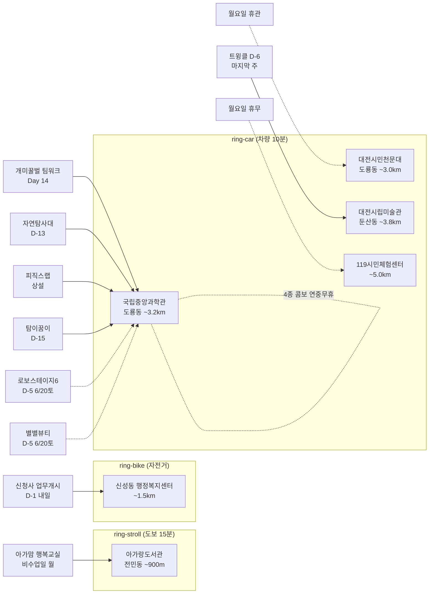

# 2026-06-15 유성구 어린이·가족 이벤트 일일 보고서

## 요약

**월요일 저활동일 — 천문대·119 휴관, 과학관 4종 콤보만 연중무휴 운영. 신성동 D-1 내일 업무개시. 트윙클 D-6 마지막 주.** (1) **국립중앙과학관 4종 콤보 Day 14** — 월요일 연중무휴. 천문대·119 모두 휴관이므로 과학관이 유일한 방문 가능 시설. (2) **신성동 행정복지센터 D-1** — 내일(6/16 월) 업무개시 D-day. 수유실·공유주방·어울마당 등 가족 편의시설 이용 가능. 8개 매체 보도. (3) **열한번째 트윙클 D-6** — 마지막 주 진입. 6/21(토) 최종일까지 남은 주말 1일(마지막날). (4) **대전시민천문대 월요일 휴관** — 다음 운영일 6/16(화). (5) 신규 이벤트 없음.

---

## 용성로20 주변 (도보권 0.5km 내)

금일 도보권(ring-walk, 0.5km) 내 신규 이벤트 없음.

---

## 오늘의 추천 (가족 동반 Top 5)

| # | 이벤트 | 장소 | 대상 | 비용 | 비고 |
|---|--------|------|------|------|------|
| 1 | **개미·꿀벌의 팀워크** | 국립중앙과학관 자연사관(도룡동) | 유아·초등·가족 | 무료(입장권별도) | Day 14 (~7/31) 월요일 연중무휴 |
| 2 | **출동! 첨단 미래자연탐사대** | 국립중앙과학관 사이언스터널(도룡동) | 초등·가족 | 미확인 | D-13 (~6/28) |
| 3 | **피직스랩 상설 전시** | 국립중앙과학관(도룡동) | 초등·가족 | 무료(입장권별도) | 상설 운영 |
| 4 | **열한번째 트윙클** | 대전시립미술관(둔산동) | 유아·초등·가족 | 무료 | D-6 (~6/21) 마지막 주 |
| 5 | **탐이 꿈이의 비밀 실험실** | 국립어린이과학관(도룡동) | 영유아·유아 | 유료 | D-15 (~6/30) |

> **월요일 방문 참고:** **천문대 휴관·119시민체험센터 휴무**이므로 실내 방문지는 **과학관 4종 콤보**(연중무휴)와 **트윙클**(D-6, 정상 운영 추정)이 유일합니다. 과학관 4종 = 팀워크 Day 14 + 자연탐사대 D-13 + 피직스랩 + 탐이꿈이 D-15. 이번 주 **토요일(6/20)** 로보스테이지6·별별뷰티 예정 — 주말 방문 계획 시 참고.

---

## 신규 이벤트

금일 유성구 일대 어린이·가족 동반 신규 이벤트 없음.

---

## 신규 오픈 가게·팝업·프로모션

금일 활성 윈도우 내 가게 **0건** (50일 윈도우 기준).

> **참고:** 아이스온 팝업 IN 베리시 대전(6/12~6/25, 신세계 Art&Science 5F)이 운영 중이나 여성 속옷 브랜드(VERISH) 팝업으로 **kid_friendly: false** — 보고서 본문 미노출.

### 사용자 제보 처리 현황

| 제보 가게 | 동 | 상태 | 비고 |
|-----------|-----|------|------|
| 엉클부대찌개 테크노점 | 관평동 | resolved_not_new | 2025년 10~11월 오픈 추정. 50일 윈도우 미해당. |
| 인터뷰커피라운지 | 도룡동 | resolved_not_new | 2024년 7월 오픈. 기존 카페. |
| 유성닭발 관평점 | 관평동 | excluded | 주류 전문 — scope.exclude 적용. |

---

## 공공기관 주최 행사 (행정복지센터·보건소·복지관·도서관·우체국·경찰서·소방서)

- **신성동 행정복지센터:** **업무개시 D-1** (내일 6/16 월 D-day) + **개청식 D-15** (6/30 월 10:00). B1~2F, 연면적 2842㎡, 수유실·공유주방·어울마당. **8개 매체 보도** 확인. ([대전일보](https://www.daejonilbo.com/news/articleView.html?idxno=2208409), [굿모닝충청](https://www.goodmorningcc.com/news/articleView.html?idxno=423555), [유성구청 인스타그램](https://www.instagram.com/p/DK9Fq10S_5s/), [뉴스1](https://www.news1.kr/photos/7369035), [웰로](https://www.welfarehello.com/community/hometownNews/f6f1453d-a9d7-4150-bcc9-6f1b79195174), [대전뉴스](http://www.daejeonnews.kr/news/articleView.html?idxno=35321), [충청뉴스](http://www.ccnnews.co.kr/news/articleView.html?idxno=376404), [경제투데이](http://www.e-today.kr/news/articleView.html?idxno=804180))
- **대전시민천문대:** **월요일 휴관.** 다음 운영일 6/16(화) 14:00~22:00. (042-863-8762, [홈페이지](https://djstar.kr/))
- **119시민체험센터:** **월요일 휴무** (일·월 연속 휴무). 다음 운영일 6/17(화). 화~토 09:30~11:30/13:30~15:30. (042-270-1133, [예약](https://www.daejeon.go.kr/dj119/CmmContentsHtmlView.do?menuSeq=5092))
- **유성구 도서관(아가랑/전민동):** 아가·맘 행복교실 — **비수업일(월)**. 다음 수업 6/20(금). ~6/27.
- **유성구 도서관(진잠):** 숏폼 제작 클래스 — **비수업일(월)**. 다음 수업 6/18(수). ~6/25.
- **유성이의 튼튼스쿨:** 상반기 모집 마감 완료. 하반기 8/19~11/27 예정 (7/20 선착순 신청).
- 기타 공공기관(보건소·복지관·우체국·경찰서·소방서) 주최 신규 어린이 행사: **금일 신규 없음**.

---

## 마감 임박 (사전신청 D-3 이내)

| 이벤트 | 일시 | 장소 | 마감 상태 |
|--------|------|------|----------|
| **신성동 행정복지센터 업무개시** | 6/16(월) | 신성동 (~1.5km) | **D-1** (내일 D-day) |

---

## 동심원별 묶음

### ring-walk (0.5km 이내, 도보 5분)
- 해당 없음

### ring-stroll (1.0km 이내, 도보 15분)
- **아가랑도서관 (전민동, ~900m):** 아가·맘 행복교실 — 비수업일(월). 다음 6/20(금).

### ring-bike (2.0km 이내, 자전거)
- **신성동 행정복지센터 (~1.5km):** 신청사 업무개시 D-1 (내일 6/16) + 개청식 D-15 (6/30)

### ring-car (5.0km 이내, 차량 10분)
- **국립중앙과학관 권역 (도룡동, ~3.2km):** 개미·꿀벌의 팀워크 Day 14 + 출동! 자연탐사대 D-13 + 피직스랩 상설 + 탐이 꿈이 D-15 = **4종 콤보** (월요일 연중무휴)
- **대전시민천문대 (도룡동, ~3.0km):** ~~상시 관측~~ **월요일 휴관**
- **119시민체험센터 (~5.0km):** ~~소방안전체험~~ **월요일 휴무**
- **대전시립미술관 (둔산동, ~3.8km):** 열한번째 트윙클 D-6 마지막 주

---

## 동(洞)별 이벤트 묶음

| 동 | 이벤트 | 비고 |
|----|--------|------|
| **도룡동** | 과학관 4종 콤보 (연중무휴) | 천문대는 월요일 휴관 |
| **신성동** | 행정복지센터 신청사 | 업무개시 D-1 (내일) |
| **둔산동** | 열한번째 트윙클 | D-6 마지막 주 |
| **전민동** | 아가랑도서관 | 비수업일(월) |

---

## 연령대별 묶음

| 연령대 | 이벤트 | 비고 |
|--------|--------|------|
| **영유아 (0~3세)** | 탐이 꿈이 D-15 | 아가맘 비수업일(월) |
| **유아 (4~6세)** | 트윙클 D-6, 팀워크 Day 14 | 마지막 주 |
| **초등저학년** | 트윙클, 팀워크, 자연탐사대, 피직스랩 | 과학관 4종 |
| **초등고학년** | 피직스랩, 자연탐사대, 로보스테이지6(D-5) | 숏폼 비수업일(월) |
| **전연령가족** | 과학관 4종 콤보 | 천문대·119 휴관 |

---

## 시리즈/정기 프로그램 업데이트

| 프로그램 | 진행 상태 | 다음 일정 |
|----------|----------|----------|
| 아가·맘 행복교실 (4/4~6/27) | 비수업일(월) | 6/20(금) |
| 숏폼 제작 클래스 (6/4~25) | 비수업일(월) | 6/18(수) |
| 119시민체험센터 (상시) | **월요일 휴무** | 6/17(화) 재개 |
| 대전시민천문대 (상시) | **월요일 휴관** | 6/16(화) 14:00~ 재개 |

---

## 다음 주 예고

| 날짜 | 이벤트 | 비고 |
|------|--------|------|
| 6/16(월) | **신성동 행정복지센터 업무 시작** | D-1 → D-day |
| 6/16(화) | 대전시민천문대 운영 재개 | 월요일 휴관 후 |
| 6/17(화) | 119시민체험센터 운영 재개 | 일·월 휴무 후 |
| 6/18(수) | 숏폼 제작 클래스 수업일 | 진잠도서관 |
| 6/20(금) | 아가·맘 행복교실 수업일 | 아가랑도서관 |
| 6/20(토) | **로보스테이지6: Kick Off!** | 국립중앙과학관, D-5 |
| 6/20(토) | **별별뷰티 과학특강** | 국립중앙과학관, D-5 |
| 6/21(토) | **열한번째 트윙클 최종일** | 대전시립미술관, D-6 |

---

## 지식그래프 시각화

---

## 출처 목록

| # | 출처 | 매체 | URL |
|---|------|------|-----|
| 1 | 국립중앙과학관 | 국립중앙과학관 | https://www.science.go.kr/mps/1070/bbs/431/moveBbsNttList.do |
| 2 | 뉴스로 | 뉴스로 | https://www.newsro.kr/article243/1626322/ |
| 3 | 대전일보 | 대전일보 | https://www.daejonilbo.com/news/articleView.html?idxno=2208409 |
| 4 | 굿모닝충청 | 굿모닝충청 | https://www.goodmorningcc.com/news/articleView.html?idxno=423555 |
| 5 | 유성구청 인스타그램 | 유성구청 | https://www.instagram.com/p/DK9Fq10S_5s/ |
| 6 | 뉴스1 | 뉴스1 | https://www.news1.kr/photos/7369035 |
| 7 | 대전뉴스 | 대전뉴스 | http://www.daejeonnews.kr/news/articleView.html?idxno=35321 |
| 8 | 충청뉴스 | 충청뉴스 | http://www.ccnnews.co.kr/news/articleView.html?idxno=376404 |
| 9 | 경제투데이 | 경제투데이 | http://www.e-today.kr/news/articleView.html?idxno=804180 |
| 10 | 웰로 | 웰로 | https://www.welfarehello.com/community/hometownNews/f6f1453d-a9d7-4150-bcc9-6f1b79195174 |
| 11 | 대전시민천문대 | 대전시민천문대 | https://djstar.kr/ |
| 12 | 119시민체험센터 | 대전시 | https://www.daejeon.go.kr/dj119/CmmContentsHtmlView.do?menuSeq=5092 |
| 13 | 유성구통합도서관 | 유성구통합도서관 | https://lib.yuseong.go.kr/web/menu/10095/program/30010/lectureList.do |

---

*이 보고서는 2026-06-15 07:00 KST 기준으로 수집된 공개 출처 정보를 기반으로 작성되었습니다.*
