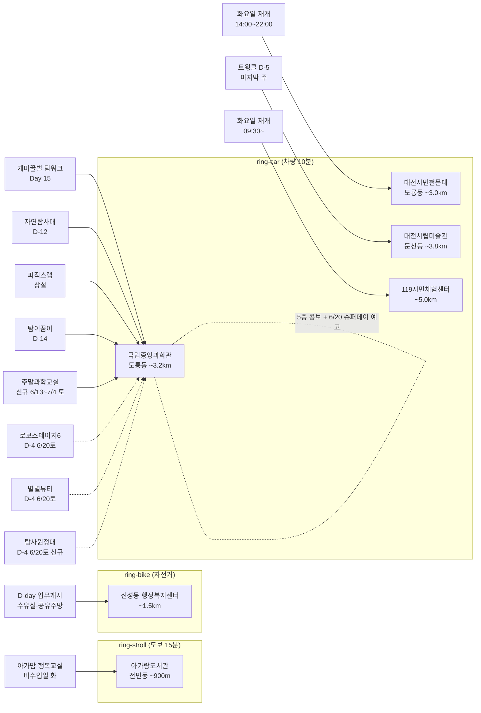

# 2026-06-16 유성구 어린이·가족 이벤트 일일 보고서

## 요약

**신성동 행정복지센터 D-day 업무개시 + 과학관 신규 프로그램 2건 발견.** (1) **신성동 행정복지센터 신청사 업무개시 D-day** — 오늘부터 공식 업무 시작. B1~2F, 2842㎡. 수유실·공유주방·어울마당 등 가족 편의시설 즉시 이용 가능. 개청식 D-14(6/30). 10+ 매체 보도. (2) **미래인재 주말과학교실** (신규 발견) — 6/13~7/4 매주 토. 5세~초등6학년. 접수 마감. (3) **희귀동식물 탐사원정대** (신규 발견) — 6/20(토) 10:00~12:00. 가족 대상. **6/20 과학관 슈퍼 토요일(4종 동시)** 확정. (4) **열한번째 트윙클 D-5** — 마지막 주. 6/21(토) 최종일. (5) **천문대·119 화요일 운영 재개**.

---

## 용성로20 주변 (도보권 0.5km 내)

금일 도보권(ring-walk, 0.5km) 내 신규 이벤트 없음.

---

## 오늘의 추천 (가족 동반 Top 5)

| # | 이벤트 | 장소 | 대상 | 비용 | 비고 |
|---|--------|------|------|------|------|
| 1 | **신성동 행정복지센터 업무개시** | 신성동 (~1.5km) | 전연령 | 무료 | **D-day 오늘 개시!** 수유실·공유주방 |
| 2 | **개미·꿀벌의 팀워크** | 국립중앙과학관 자연사관(도룡동) | 유아·초등·가족 | 무료(입장권별도) | Day 15 (~7/31) |
| 3 | **열한번째 트윙클** | 대전시립미술관(둔산동) | 유아·초등·가족 | 무료 | **D-5** (~6/21) 마지막 주 |
| 4 | **출동! 첨단 미래자연탐사대** | 국립중앙과학관 사이언스터널(도룡동) | 초등·가족 | 미확인 | D-12 (~6/28) |
| 5 | **대전시민천문대 상시 관측** | 대전시민천문대(도룡동) | 전연령 | 무료 | **오늘 재개** 14:00~22:00 |

> **화요일 방문 참고:** 어제(월) 휴관이었던 **천문대** 14:00~22:00 재개(화요 시낭송·음악 20시), **119시민체험센터** 09:30~ 재개. 과학관 **5종 콤보** 연중무휴. **신성동 행정복지센터 오늘 개시** — 가족 민원·공유주방·수유실 이용 가능. 이번 주 **토요일(6/20)** 과학관 슈퍼 데이(4종 동시: 로보스테이지6+별별뷰티+탐사원정대+주말과학교실) + **6/21(토) 트윙클 최종일** 예정.

---

## 신규 이벤트

### 1. 미래인재 주말과학교실 (누락 프로그램 발견)
- **출처:** [국립중앙과학관 교육프로그램](https://www.science.go.kr/mps/1092/allEduPrograms.do), [한국강사신문](https://www.lecturernews.com/news/articleView.html?idxno=194423)
- **일시:** 2026-06-13 ~ 2026-07-04, 매주 토요일 (09:30~11:30, 13:30~15:30, 16:00~17:00)
- **장소:** 국립중앙과학관 (도룡동, ~3.2km, ring-car)
- **대상:** 5세 유아(2020생) ~ 초등 6학년
- **비용:** 유료 (추정)
- **접수:** 마감 (5/13~6/12 선착순)
- **상태:** 신규 발견 — 6/13 첫 수업 완료, Day 2(6/14) 경과. 이전 보고서에 누락.
- **kid_friendly_score:** 0.95
- **관련 엔티티:** 국립중앙과학관, 도룡동

### 2. 2026년 1차 희귀동식물 탐사원정대
- **출처:** [국립중앙과학관 통합예약](https://rsvn.science.go.kr/), [한국강사신문](https://www.lecturernews.com/news/articleView.html?idxno=194423)
- **일시:** 2026-06-20(토) 10:00~12:00
- **장소:** 국립중앙과학관 야외 권역 (도룡동, ~3.2km, ring-car)
- **대상:** 가족 (전연령)
- **비용:** 미확인
- **접수:** 사전신청 필요
- **상태:** 신규 발견 — D-4. 로보스테이지6·별별뷰티와 같은 날(6/20) 운영.
- **kid_friendly_score:** 0.8
- **관련 엔티티:** 국립중앙과학관, 도룡동

---

## 신규 오픈 가게·팝업·프로모션

금일 활성 윈도우 내 가게 **0건** (50일 윈도우 기준).

> **참고:** 아이스온 팝업 IN 베리시 대전(6/12~6/25, 신세계 Art&Science 5F)이 운영 중이나 여성 속옷 브랜드(VERISH) 팝업으로 **kid_friendly: false** — 보고서 본문 미노출.

### 사용자 제보 처리 현황

| 제보 가게 | 동 | 상태 | 비고 |
|-----------|-----|------|------|
| 엉클부대찌개 테크노점 | 관평동 | resolved_not_new | 2025년 10~11월 오픈 추정. 50일 윈도우 미해당. |
| 인터뷰커피라운지 | 도룡동 | resolved_not_new | 2024년 7월 오픈. 기존 카페. |
| 유성닭발 관평점 | 관평동 | excluded | 주류 전문 — scope.exclude 적용. |

---

## 공공기관 주최 행사 (행정복지센터·보건소·복지관·도서관·우체국·경찰서·소방서)

- **신성동 행정복지센터:** **D-day 업무개시** (오늘 6/16부터 공식 업무 시작). 신성로55, B1~2F 연면적 2842㎡. 1F 종합민원실·무인민원발급기·**수유실**, 2F 대회의실·중회의실, B1 다목적실·세미나실·**공유주방**, 별관 **어울마당**. **개청식 D-14** (6/30 월 10:00). **10+ 매체 보도.** ([대전일보](https://www.daejonilbo.com/news/articleView.html?idxno=2208409), [충청뉴스](http://www.ccnnews.co.kr/news/articleView.html?idxno=376404), [뉴스세상](https://www.newssesang.kr/news/articleView.html?idxno=311473), [데일리연합](https://www.dailyan.com/news/article.html?no=715235), [웰로](https://www.welfarehello.com/community/hometownNews/f6f1453d-a9d7-4150-bcc9-6f1b79195174), [유성구청 인스타그램](https://www.instagram.com/p/DK9Fq10S_5s/), [유성구청 페이스북](https://www.facebook.com/happyyuseong/posts/1116846043814102/), [굿모닝충청](https://www.goodmorningcc.com/news/articleView.html?idxno=423555), [뉴스1](https://www.news1.kr/photos/7369035), [대전뉴스](http://www.daejeonnews.kr/news/articleView.html?idxno=35321), [경제투데이](http://www.e-today.kr/news/articleView.html?idxno=804180))
- **대전시민천문대:** **화요일 운영 재개** 14:00~22:00. 화요 시낭송·음악 20시. (042-863-8762, [홈페이지](https://djstar.kr/))
- **119시민체험센터:** **화요일 운영 재개** 09:30~11:30/13:30~15:30. (042-270-1133, [예약](https://www.daejeon.go.kr/dj119/CmmContentsHtmlView.do?menuSeq=5092))
- **유성구 도서관(아가랑/전민동):** 아가·맘 행복교실 — **비수업일(화)**. 다음 수업 6/20(금). ~6/27.
- **유성구 도서관(진잠):** 숏폼 제작 클래스 — **비수업일(화)**. 다음 수업 6/18(수). ~6/25.
- **유성이의 튼튼스쿨:** 상반기 모집 마감 완료. 하반기 8/19~11/27 예정 (7/20 선착순 신청).
- 기타 공공기관(보건소·복지관·우체국·경찰서·소방서) 주최 신규 어린이 행사: **금일 신규 없음**.

---

## 마감 임박 (사전신청 D-3 이내)

| 이벤트 | 일시 | 장소 | 마감 상태 |
|--------|------|------|----------|
| **신성동 행정복지센터 업무개시** | 6/16(화) | 신성동 (~1.5km) | **D-day** (오늘 개시!) |

---

## 동심원별 묶음

### ring-walk (0.5km 이내, 도보 5분)
- 해당 없음

### ring-stroll (1.0km 이내, 도보 15분)
- **아가랑도서관 (전민동, ~900m):** 아가·맘 행복교실 — 비수업일(화). 다음 6/20(금).

### ring-bike (2.0km 이내, 자전거)
- **신성동 행정복지센터 (~1.5km):** **D-day 업무개시** + 개청식 D-14 (6/30)

### ring-car (5.0km 이내, 차량 10분)
- **국립중앙과학관 권역 (도룡동, ~3.2km):** 개미·꿀벌의 팀워크 Day 15 + 출동! 자연탐사대 D-12 + 피직스랩 상설 + 탐이 꿈이 D-14 + **미래인재 주말과학교실**(토) = **5종 콤보** (연중무휴)
- **대전시민천문대 (도룡동, ~3.0km):** 상시 관측 **화요일 재개** 14:00~22:00
- **119시민체험센터 (~5.0km):** 소방안전체험 **화요일 재개** 09:30~
- **대전시립미술관 (둔산동, ~3.8km):** 열한번째 트윙클 **D-5 마지막 주**

---

## 동(洞)별 이벤트 묶음

| 동 | 이벤트 | 비고 |
|----|--------|------|
| **신성동** | 행정복지센터 D-day 업무개시 | ring-bike, 수유실·공유주방 |
| **도룡동** | 과학관 5종 콤보 (연중무휴) + 천문대 재개 | 화요일 정상 운영 |
| **둔산동** | 열한번째 트윙클 | D-5 마지막 주 |
| **전민동** | 아가랑도서관 | 비수업일(화) |

---

## 연령대별 묶음

| 연령대 | 이벤트 | 비고 |
|--------|--------|------|
| **영유아 (0~3세)** | 탐이 꿈이 D-14, 신성동 수유실 | 아가맘 비수업일(화) |
| **유아 (4~6세)** | 트윙클 D-5, 팀워크 Day 15, 주말과학교실(토) | 마지막 주 |
| **초등저학년** | 트윙클, 팀워크, 자연탐사대, 피직스랩, 주말과학교실(토) | 5종 콤보 |
| **초등고학년** | 피직스랩, 자연탐사대, 로보스테이지6(D-4), 주말과학교실(토) | 숏폼 비수업일(화) |
| **전연령가족** | 과학관 5종 콤보 + 천문대(재개) + 119(재개) + 탐사원정대(D-4) | 화요일 활동 다수 재개 |

---

## 시리즈/정기 프로그램 업데이트

| 프로그램 | 진행 상태 | 다음 일정 |
|----------|----------|----------|
| **미래인재 주말과학교실** (6/13~7/4) | **신규 등록** Day 4 | 6/21(토) |
| 아가·맘 행복교실 (4/4~6/27) | 비수업일(화) | 6/20(금) |
| 숏폼 제작 클래스 (6/4~25) | 비수업일(화) | 6/18(수) |
| 119시민체험센터 (상시) | **화요일 재개** | 오늘 09:30~ |
| 대전시민천문대 (상시) | **화요일 재개** | 오늘 14:00~ |

---

## 6/20(토) 과학관 슈퍼 토요일 예고

6/20(토)에 국립중앙과학관에서 **4종 행사 동시 운영** 확정:

| 행사 | 시간 | 대상 | D-day |
|------|------|------|-------|
| **희귀동식물 탐사원정대** | 10:00~12:00 | 가족 | D-4 |
| **로보스테이지6: Kick Off!** | TBD | 초등 | D-4 |
| **별별뷰티 과학특강** | TBD | 초등고+ | D-4 |
| **미래인재 주말과학교실** | 09:30~/13:30~/16:00~ | 5세~초6 | 3회차 |

+ 상설 전시 3종(팀워크 Day 19 + 자연탐사대 D-8 + 피직스랩 + 탐이꿈이 D-10) = **역대 최대 7+ 프로그램 동시 운영**.

**열한번째 트윙클 최종일(6/21 토)** 과학관 슈퍼 데이 다음날 — 토~일 2일 연속 가족 방문 계획 시 참고.

---

## 지식그래프 시각화

---

## 출처 목록

| # | 출처 | 매체 | URL |
|---|------|------|-----|
| 1 | 국립중앙과학관 행사안내 | 국립중앙과학관 | https://www.science.go.kr/mps/1070/bbs/431/moveBbsNttList.do |
| 2 | 국립중앙과학관 교육프로그램 | 국립중앙과학관 | https://www.science.go.kr/mps/1092/allEduPrograms.do |
| 3 | 국립중앙과학관 통합예약 | 국립중앙과학관 | https://rsvn.science.go.kr/ |
| 4 | 한국강사신문 | 한국강사신문 | https://www.lecturernews.com/news/articleView.html?idxno=194423 |
| 5 | 대전일보 | 대전일보 | https://www.daejonilbo.com/news/articleView.html?idxno=2208409 |
| 6 | 충청뉴스 | 충청뉴스 | http://www.ccnnews.co.kr/news/articleView.html?idxno=376404 |
| 7 | 뉴스세상 | 뉴스세상 | https://www.newssesang.kr/news/articleView.html?idxno=311473 |
| 8 | 데일리연합 | 데일리연합 | https://www.dailyan.com/news/article.html?no=715235 |
| 9 | 웰로 | 웰로 | https://www.welfarehello.com/community/hometownNews/f6f1453d-a9d7-4150-bcc9-6f1b79195174 |
| 10 | 유성구청 인스타그램 | 유성구청 | https://www.instagram.com/p/DK9Fq10S_5s/ |
| 11 | 유성구청 페이스북 | 유성구청 | https://www.facebook.com/happyyuseong/posts/1116846043814102/ |
| 12 | 굿모닝충청 | 굿모닝충청 | https://www.goodmorningcc.com/news/articleView.html?idxno=423555 |
| 13 | 뉴스1 | 뉴스1 | https://www.news1.kr/photos/7369035 |
| 14 | 대전뉴스 | 대전뉴스 | http://www.daejeonnews.kr/news/articleView.html?idxno=35321 |
| 15 | 경제투데이 | 경제투데이 | http://www.e-today.kr/news/articleView.html?idxno=804180 |
| 16 | 뉴스로 | 뉴스로 | https://www.newsro.kr/article243/1626322/ |
| 17 | 대전시민천문대 | 대전시민천문대 | https://djstar.kr/ |
| 18 | 119시민체험센터 | 대전시 | https://www.daejeon.go.kr/dj119/CmmContentsHtmlView.do?menuSeq=5092 |
| 19 | 유성구통합도서관 | 유성구통합도서관 | https://lib.yuseong.go.kr/web/menu/10095/program/30010/lectureList.do |

---

*이 보고서는 2026-06-16 07:00 KST 기준으로 수집된 공개 출처 정보를 기반으로 작성되었습니다.*
